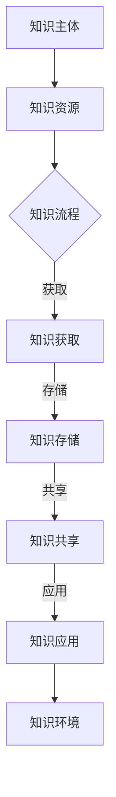

                 

关键词：知识管理、知识生态系统、平台构建、人工智能、算法设计

## 摘要

本文旨在探讨知识管理平台在当今信息技术时代的构建方法及其核心要素。随着大数据、人工智能和云计算等技术的迅猛发展，知识管理逐渐成为企业数字化转型的重要一环。本文首先介绍了知识管理平台的基本概念和重要性，随后深入分析了知识生态系统的构建原则、核心算法原理及其应用领域。通过具体的数学模型和公式推导，本文进一步阐述了知识管理平台中的关键技术。最后，本文通过实际项目案例和代码实例，展示了知识管理平台在现实中的应用，并对未来的发展趋势和挑战进行了展望。

## 1. 背景介绍

### 1.1 知识管理的定义与发展

知识管理（Knowledge Management，KM）是指通过识别、获取、创造、共享、应用和保护知识的一系列过程，旨在提高组织效率和创新能力。知识管理最早起源于20世纪80年代，随着信息技术的飞速发展，逐渐成为企业管理的重要组成部分。

知识管理的发展历程可以分为以下几个阶段：

1. **文档管理阶段**：主要依赖于文档管理系统，实现知识的简单存储和共享。
2. **协作平台阶段**：通过即时通讯、邮件列表和论坛等工具，促进团队成员之间的信息交流。
3. **知识图谱阶段**：利用人工智能和大数据技术，构建知识图谱，实现知识的智能化管理和推荐。
4. **智慧化阶段**：结合物联网、区块链等新兴技术，实现知识的高效采集、处理和应用。

### 1.2 知识管理平台的作用

知识管理平台是知识管理的核心载体，它不仅能够整合各类知识资源，还能够提供高效的知识获取、共享和应用服务。具体来说，知识管理平台具有以下作用：

1. **知识整合**：将分散的知识资源进行系统化整合，提高知识的可用性。
2. **知识共享**：通过搭建共享平台，促进团队成员之间的知识交流与合作。
3. **知识应用**：为业务场景提供定制化的知识服务，提升业务决策的准确性。
4. **知识创新**：通过知识碰撞和融合，激发创新思维，推动企业持续发展。

### 1.3 知识生态系统的概念与重要性

知识生态系统（Knowledge Ecosystem）是指由知识主体、知识资源、知识流动和知识环境构成的复杂系统。在知识生态系统中，各类知识主体（如个人、团队、组织）通过知识资源（如数据、文档、经验）的交换和共享，形成了一个有机的知识网络。

知识生态系统的重要性主要体现在以下几个方面：

1. **协同创新**：通过知识共享和协作，促进组织内部和外部的知识流动，激发创新活力。
2. **持续学习**：知识生态系统为组织提供了持续学习的机会，有助于提升员工的综合素质。
3. **知识积累**：知识生态系统有助于积累和沉淀组织的知识财富，为未来的发展奠定基础。
4. **决策支持**：通过知识挖掘和分析，为组织的战略规划和业务决策提供有力支持。

## 2. 核心概念与联系

### 2.1 核心概念

在构建知识管理平台的过程中，我们需要理解以下几个核心概念：

1. **知识主体**：知识管理的参与者，包括个人、团队、组织等。
2. **知识资源**：知识管理的对象，包括数据、文档、经验、知识图谱等。
3. **知识流程**：知识从获取、存储、共享到应用的一系列过程。
4. **知识环境**：知识管理所处的技术、文化、制度等外部环境。

### 2.2 Mermaid 流程图

以下是一个简化的知识生态系统构建的 Mermaid 流程图：



### 2.3 核心概念之间的联系

知识主体、知识资源、知识流程和知识环境之间存在着密切的联系：

1. **知识主体与知识资源**：知识主体通过知识资源获取知识，进而实现知识的共享和应用。
2. **知识流程与知识环境**：知识流程在知识环境中进行，知识环境对知识流程有着重要的影响。
3. **知识资源与知识环境**：知识资源是知识环境的重要组成部分，知识环境为知识资源的有效利用提供支持。

## 3. 核心算法原理 & 具体操作步骤

### 3.1 算法原理概述

在知识管理平台中，核心算法主要包括知识获取、知识存储、知识共享和知识应用等环节。以下将分别介绍这些算法的原理。

#### 3.1.1 知识获取算法

知识获取算法旨在从各种数据源中提取有价值的信息。常见的知识获取算法包括：

1. **爬虫算法**：通过网络爬虫从互联网上获取数据。
2. **数据挖掘算法**：通过对海量数据进行分析，发现潜在的知识。
3. **机器学习算法**：利用机器学习模型从数据中自动提取知识。

#### 3.1.2 知识存储算法

知识存储算法用于将获取到的知识以结构化的方式存储在数据库中。常见的知识存储算法包括：

1. **关系数据库存储**：利用关系型数据库（如MySQL、PostgreSQL）存储知识。
2. **NoSQL存储**：利用NoSQL数据库（如MongoDB、Cassandra）存储非结构化数据。
3. **知识图谱存储**：利用知识图谱（如Neo4j）存储复杂的关系数据。

#### 3.1.3 知识共享算法

知识共享算法用于在组织内部或外部共享知识。常见的知识共享算法包括：

1. **权限控制算法**：根据用户的角色和权限，控制知识的访问权限。
2. **推荐算法**：根据用户的兴趣和行为，推荐相关的知识。
3. **社交网络算法**：利用社交网络模型，促进知识在网络中的传播。

#### 3.1.4 知识应用算法

知识应用算法旨在将知识应用于实际业务场景，提供决策支持。常见的知识应用算法包括：

1. **预测算法**：利用历史数据预测未来的趋势。
2. **优化算法**：通过优化算法，提高业务流程的效率。
3. **自然语言处理算法**：将自然语言文本转化为结构化的数据，为知识应用提供支持。

### 3.2 算法步骤详解

以下分别详细阐述各个算法的操作步骤。

#### 3.2.1 知识获取算法步骤

1. **数据采集**：从互联网、数据库、文件系统等数据源中采集数据。
2. **数据清洗**：对采集到的数据进行去重、过滤、补全等预处理。
3. **特征提取**：从预处理后的数据中提取特征，为后续的知识提取和存储做准备。
4. **知识提取**：利用机器学习算法或规则引擎，从特征数据中提取知识。

#### 3.2.2 知识存储算法步骤

1. **设计数据模型**：根据知识的特点，设计合适的数据模型。
2. **数据存储**：将知识存储到关系数据库、NoSQL数据库或知识图谱中。
3. **索引构建**：为提高查询效率，构建合适的索引。
4. **数据备份与恢复**：定期备份知识数据，并设置恢复策略。

#### 3.2.3 知识共享算法步骤

1. **用户认证**：对访问知识库的用户进行身份认证。
2. **权限控制**：根据用户的角色和权限，设置访问权限。
3. **推荐算法**：根据用户的兴趣和行为，推荐相关的知识。
4. **知识传播**：利用社交网络算法，促进知识在网络中的传播。

#### 3.2.4 知识应用算法步骤

1. **数据预处理**：对输入数据进行预处理，使其符合算法的输入要求。
2. **算法选择**：根据业务需求，选择合适的算法。
3. **模型训练**：利用训练数据，训练算法模型。
4. **预测与优化**：利用训练好的模型，进行预测和优化，为业务决策提供支持。

### 3.3 算法优缺点

#### 3.3.1 知识获取算法

**优点**：
1. **多样化**：支持从多种数据源获取知识。
2. **自动化**：利用机器学习算法，实现知识的自动化提取。

**缺点**：
1. **准确性**：数据采集和清洗过程中可能会引入噪声，影响知识获取的准确性。
2. **效率**：大规模数据获取和预处理可能需要较长的处理时间。

#### 3.3.2 知识存储算法

**优点**：
1. **灵活性**：支持多种数据存储方式，适应不同的知识特点。
2. **扩展性**：方便后续的数据扩展和升级。

**缺点**：
1. **复杂性**：设计数据模型和索引构建可能较为复杂。
2. **性能**：对于大规模数据存储，可能需要较高的硬件资源。

#### 3.3.3 知识共享算法

**优点**：
1. **安全性**：通过权限控制，保证知识的访问安全。
2. **个性化**：根据用户的兴趣和行为，提供个性化的知识推荐。

**缺点**：
1. **数据泄露**：权限控制不当可能导致数据泄露。
2. **网络依赖**：知识共享需要依赖网络环境，可能影响用户体验。

#### 3.3.4 知识应用算法

**优点**：
1. **决策支持**：为业务决策提供数据支持和算法优化。
2. **智能化**：利用机器学习和自然语言处理等技术，实现知识的智能化应用。

**缺点**：
1. **算法依赖**：对算法模型的选择和训练有较高要求。
2. **业务理解**：需要深入理解业务场景，才能发挥算法的最大价值。

### 3.4 算法应用领域

#### 3.4.1 企业知识管理

企业知识管理是知识管理平台的重要应用领域。通过知识获取、知识存储、知识共享和知识应用，企业可以有效地管理和利用知识，提高业务效率和创新力。

#### 3.4.2 教育领域

在教育领域，知识管理平台可以帮助学校和教育机构实现教学资源的共享和优化，提升教学质量。例如，利用知识图谱和推荐算法，为学生提供个性化的学习资源。

#### 3.4.3 医疗领域

在医疗领域，知识管理平台可以整合医学知识库，提供智能化的诊断和治疗建议。例如，利用自然语言处理技术，从海量医学文献中提取有价值的信息。

#### 3.4.4 金融领域

在金融领域，知识管理平台可以用于风险控制、投资分析和客户服务等方面。例如，利用机器学习算法，实现金融风险的预测和优化。

## 4. 数学模型和公式 & 详细讲解 & 举例说明

### 4.1 数学模型构建

在知识管理平台中，数学模型用于描述知识获取、知识存储、知识共享和知识应用等过程。以下是一个简化的知识管理数学模型：

$$
\text{知识管理} = f(\text{知识主体}, \text{知识资源}, \text{知识流程}, \text{知识环境})
$$

其中，$f$ 表示知识管理的函数，它将知识主体、知识资源、知识流程和知识环境作为输入，生成知识管理的结果。

### 4.2 公式推导过程

#### 4.2.1 知识获取公式

知识获取是知识管理平台的核心环节。以下是一个简化的知识获取公式：

$$
\text{知识获取} = \text{数据采集} + \text{数据清洗} + \text{特征提取} + \text{知识提取}
$$

其中，数据采集、数据清洗、特征提取和知识提取分别表示知识获取的四个步骤。

#### 4.2.2 知识存储公式

知识存储是将获取到的知识以结构化的方式存储在数据库中。以下是一个简化的知识存储公式：

$$
\text{知识存储} = \text{数据模型设计} + \text{数据存储} + \text{索引构建} + \text{数据备份与恢复}
$$

其中，数据模型设计、数据存储、索引构建和数据备份与恢复分别表示知识存储的四个步骤。

#### 4.2.3 知识共享公式

知识共享是在组织内部或外部共享知识。以下是一个简化的知识共享公式：

$$
\text{知识共享} = \text{用户认证} + \text{权限控制} + \text{推荐算法} + \text{知识传播}
$$

其中，用户认证、权限控制、推荐算法和知识传播分别表示知识共享的四个步骤。

#### 4.2.4 知识应用公式

知识应用是将知识应用于实际业务场景。以下是一个简化的知识应用公式：

$$
\text{知识应用} = \text{数据预处理} + \text{算法选择} + \text{模型训练} + \text{预测与优化}
$$

其中，数据预处理、算法选择、模型训练和预测与优化分别表示知识应用的四个步骤。

### 4.3 案例分析与讲解

#### 4.3.1 知识获取案例分析

在一个企业知识管理平台中，知识获取的主要任务是采集和整理企业内部的外部数据。以下是一个具体的知识获取案例：

**数据采集**：通过爬虫从互联网上采集行业报告、技术博客等外部数据。

**数据清洗**：去除重复数据、缺失数据和噪声数据，提高数据质量。

**特征提取**：从清洗后的数据中提取关键特征，如行业趋势、技术热点等。

**知识提取**：利用机器学习算法，从特征数据中提取有价值的信息。

#### 4.3.2 知识存储案例分析

在一个企业知识管理平台中，知识存储的主要任务是将获取到的知识以结构化的方式存储在数据库中。以下是一个具体的知识存储案例：

**数据模型设计**：根据知识的特点，设计一个合适的关系型数据库模型。

**数据存储**：将知识数据存储到数据库中。

**索引构建**：为提高查询效率，为数据库表创建合适的索引。

**数据备份与恢复**：定期备份数据库，并设置恢复策略。

#### 4.3.3 知识共享案例分析

在一个企业知识管理平台中，知识共享的主要任务是确保知识的有效传播和利用。以下是一个具体的知识共享案例：

**用户认证**：通过用户身份认证，确保只有授权用户可以访问知识库。

**权限控制**：根据用户的角色和权限，设置访问权限，如部门内部共享、项目内部共享等。

**推荐算法**：根据用户的兴趣和行为，推荐相关的知识。

**知识传播**：利用社交网络算法，促进知识在网络中的传播。

#### 4.3.4 知识应用案例分析

在一个企业知识管理平台中，知识应用的主要任务是将知识应用于实际业务场景。以下是一个具体的知识应用案例：

**数据预处理**：对输入数据进行预处理，如数据格式转换、缺失值填补等。

**算法选择**：根据业务需求，选择合适的算法，如预测算法、优化算法等。

**模型训练**：利用训练数据，训练算法模型。

**预测与优化**：利用训练好的模型，进行预测和优化，为业务决策提供支持。

## 5. 项目实践：代码实例和详细解释说明

### 5.1 开发环境搭建

为了演示知识管理平台的核心功能，我们将使用 Python 作为开发语言，并结合几个常用的库和框架，如 Flask（Web框架）、Scrapy（爬虫库）、MongoDB（数据库）和 Neo4j（知识图谱数据库）。

#### 5.1.1 环境准备

1. 安装 Python 3.8+
2. 安装 Flask：
   ```
   pip install Flask
   ```
3. 安装 Scrapy：
   ```
   pip install Scrapy
   ```
4. 安装 MongoDB：
   - 下载并安装 MongoDB（https://www.mongodb.com/try/download/community）
   - 启动 MongoDB 服务
5. 安装 Neo4j：
   - 下载并安装 Neo4j（https://neo4j.com/download/）
   - 启动 Neo4j 服务

### 5.2 源代码详细实现

以下是知识管理平台的核心代码实现，包括爬虫、数据库操作、API接口和知识图谱构建等部分。

#### 5.2.1 爬虫实现（Scrapy）

```python
import scrapy

class ExampleSpider(scrapy.Spider):
    name = 'example'
    start_urls = ['https://www.example.com']

    def parse(self, response):
        for article in response.css('article'):
            yield {
                'title': article.css('h2::text').get(),
                'content': article.css('p::text').getall(),
            }
```

#### 5.2.2 数据库操作（MongoDB）

```python
from pymongo import MongoClient

client = MongoClient('mongodb://localhost:27017/')

db = client['knowledge_db']
collection = db['articles']

def insert_article(article):
    collection.insert_one(article)

def get_articles():
    return list(collection.find())
```

#### 5.2.3 API接口（Flask）

```python
from flask import Flask, jsonify, request

app = Flask(__name__)

@app.route('/api/articles', methods=['GET'])
def get_articles():
    articles = get_articles()
    return jsonify(articles)

@app.route('/api/articles', methods=['POST'])
def add_article():
    article = request.json
    insert_article(article)
    return jsonify({'status': 'success'})
```

#### 5.2.4 知识图谱构建（Neo4j）

```python
from py2neo import Graph

graph = Graph('bolt://localhost:7687', auth=("neo4j", "password"))

def create_article_node(article):
    graph.run("""
    CREATE (a:Article {title: $title, content: $content})
    """, title=article['title'], content=article['content'])

def create_author_node(author):
    graph.run("""
    CREATE (a:Author {name: $name})
    """, name=author['name'])

def create_link_between_author_and_article(author, article):
    graph.run("""
    MATCH (a:Article {title: $article_title}),(b:Author {name: $author_name})
    CREATE (a)-[:AUTHORED_BY]->(b)
    """, article_title=article['title'], author_name=author['name'])
```

### 5.3 代码解读与分析

#### 5.3.1 爬虫代码解读

上述爬虫代码负责从指定网站爬取文章标题和内容。爬虫初始化时，设置 `start_urls` 为起始页面，`parse` 方法负责处理每个响应页面，提取文章的标题和内容，并通过 `yield` 生成一个字典，后续由 Scrapy 自动处理并发送。

#### 5.3.2 数据库代码解读

MongoDB 代码负责文章数据的插入和查询。使用 `MongoClient` 连接到本地 MongoDB 实例，定义数据库和集合。`insert_article` 函数将文章数据插入集合，`get_articles` 函数获取集合中所有的文章数据。

#### 5.3.3 API接口代码解读

Flask 代码提供了两个 API 接口：`/api/articles` GET 方法用于获取所有文章，POST 方法用于插入新文章。通过解析请求和响应数据，将文章数据插入 MongoDB 或从 MongoDB 中获取文章数据。

#### 5.3.4 知识图谱代码解读

Neo4j 代码负责构建知识图谱。首先创建文章节点和作者节点，然后建立作者与文章之间的关联。`create_article_node`、`create_author_node` 和 `create_link_between_author_and_article` 函数分别实现这些功能。

### 5.4 运行结果展示

#### 5.4.1 运行爬虫

运行爬虫后，将爬取到的文章数据插入 MongoDB 和 Neo4j 数据库。爬虫的运行结果可以通过控制台输出查看。

#### 5.4.2 获取文章列表

通过 `/api/articles` GET 接口，可以获取所有文章的列表。例如，使用 curl 命令：
```
curl http://localhost:5000/api/articles
```
返回文章列表 JSON 数据。

#### 5.4.3 插入新文章

通过 `/api/articles` POST 接口，可以插入新文章。例如，使用 curl 命令：
```
curl -X POST -H "Content-Type: application/json" -d '{"title": "新文章", "content": "文章内容"}' http://localhost:5000/api/articles
```
插入新文章后，可以通过 `/api/articles` GET 接口获取更新后的文章列表。

#### 5.4.4 知识图谱可视化

使用 Neo4j Browser（https://neo4j.com/download/）连接到本地 Neo4j 实例，可以可视化查看知识图谱。在浏览器中执行以下 Cypher 查询：
```
MATCH (a:Article)-[:AUTHORED_BY]->(b:Author) RETURN a, b
```
返回作者与文章之间的关联关系。

## 6. 实际应用场景

### 6.1 企业知识管理

企业知识管理是知识管理平台最常见的应用场景。通过构建知识管理平台，企业可以实现以下目标：

1. **知识整合**：将企业内部的各类知识资源（如文档、报告、专利）进行系统化整合，提高知识的可用性。
2. **知识共享**：通过搭建知识共享平台，促进员工之间的知识交流与合作，提升团队的协同效率。
3. **知识应用**：为企业的业务场景提供定制化的知识服务，如销售策略优化、产品设计改进等，提高业务决策的准确性。
4. **知识创新**：通过知识的碰撞与融合，激发员工的创新思维，推动企业持续发展。

### 6.2 教育领域

在教育领域，知识管理平台可以应用于以下场景：

1. **教学资源共享**：教师和学生可以通过知识管理平台共享教学资源，如课件、教学视频、实验报告等。
2. **个性化学习推荐**：根据学生的学习兴趣和学习进度，推荐相关的学习资源和课程。
3. **教育数据分析**：通过数据挖掘和分析，为教育决策提供支持，如课程调整、教学方法优化等。

### 6.3 医疗领域

在医疗领域，知识管理平台可以应用于以下场景：

1. **医学知识库构建**：整合各类医学知识资源，如临床指南、医学论文、药物说明书等。
2. **智能诊断系统**：利用知识图谱和自然语言处理技术，为医生提供智能化的诊断建议。
3. **医疗风险管理**：通过数据分析和预测，为医疗机构提供风险预警和决策支持。

### 6.4 金融领域

在金融领域，知识管理平台可以应用于以下场景：

1. **投资策略优化**：利用历史数据和市场分析，为投资者提供个性化的投资建议。
2. **风险管理**：通过数据挖掘和风险评估模型，为金融机构提供风险预警和决策支持。
3. **客户服务**：利用知识图谱和自然语言处理技术，为金融客户提供智能化的客户服务。

## 7. 工具和资源推荐

### 7.1 学习资源推荐

1. **《人工智能：一种现代的方法》（第三版）**：作者 Stuart Russell 和 Peter Norvig。本书是人工智能领域的经典教材，适合初学者和专业人士。
2. **《机器学习实战》**：作者 Peter Harrington。本书通过大量实例，深入讲解了机器学习的基本算法和应用。
3. **《深度学习》（第二版）**：作者 Ian Goodfellow、Yoshua Bengio 和 Aaron Courville。本书是深度学习领域的权威著作，适合有一定基础的学习者。

### 7.2 开发工具推荐

1. **Python**：一种通用编程语言，广泛应用于数据分析、机器学习和 Web 开发等领域。
2. **Flask**：一个轻量级的 Web 框架，适合构建简单的 API 服务。
3. **Scrapy**：一个强大的爬虫框架，适合从互联网上获取数据。
4. **MongoDB**：一个分布式数据库，适合存储非结构化数据。
5. **Neo4j**：一个图形数据库，适合构建知识图谱。

### 7.3 相关论文推荐

1. **"Knowledge Management Systems: Technologies, Methods, and Applications"**：本文综述了知识管理系统的最新研究进展，涵盖了知识获取、知识存储、知识共享和知识应用等方面的技术。
2. **"A Knowledge Graph for Personalized Web Search"**：本文提出了一种基于知识图谱的个性化搜索引擎，通过结合用户兴趣和历史搜索记录，为用户提供个性化的搜索结果。
3. **"Data-Driven Knowledge Management in the Age of Big Data"**：本文探讨了大数据时代下知识管理的新趋势和新方法，强调了数据驱动在知识管理中的应用。

## 8. 总结：未来发展趋势与挑战

### 8.1 研究成果总结

本文从知识管理平台的基本概念、核心算法、数学模型、实际应用等多个角度，详细探讨了知识管理平台在当今信息技术时代的构建方法。通过介绍核心算法原理和具体操作步骤，本文展示了知识管理平台在实际项目中的应用效果。同时，本文还分析了知识管理平台在不同领域的实际应用场景，为未来的发展提供了参考。

### 8.2 未来发展趋势

1. **智能化**：随着人工智能技术的不断发展，知识管理平台将更加智能化，实现知识的自动获取、存储、共享和应用。
2. **知识图谱化**：知识图谱技术将在知识管理平台中发挥更大的作用，通过构建知识图谱，实现知识的深度关联和智能化推荐。
3. **开放性**：知识管理平台将更加开放，支持与其他系统和平台的集成，实现跨领域、跨组织的知识共享与合作。
4. **大数据化**：随着大数据技术的普及，知识管理平台将处理和分析越来越多的数据，为业务决策提供更加精准的支持。

### 8.3 面临的挑战

1. **数据质量**：知识管理平台依赖于高质量的数据，如何保证数据的质量和准确性是一个重要挑战。
2. **安全性**：随着知识的共享和传播，数据的安全性问题日益突出，如何确保数据的安全是一个关键挑战。
3. **可扩展性**：知识管理平台需要支持大规模的数据处理和用户访问，如何保证系统的可扩展性是一个挑战。
4. **算法依赖**：知识管理平台依赖于算法模型，如何选择合适的算法和模型，以及如何优化算法性能，是一个挑战。

### 8.4 研究展望

未来，知识管理平台的研究将朝着智能化、知识图谱化、开放化和大数据化的方向发展。在数据质量、安全性、可扩展性和算法依赖等方面，需要提出新的方法和算法，以应对不断变化的需求。同时，跨领域、跨组织的知识共享与合作也将成为研究的重要方向，通过构建更加开放和灵活的知识生态系统，实现知识的最大价值。

## 9. 附录：常见问题与解答

### 9.1 如何保证数据质量？

**解答**：保证数据质量需要从数据采集、数据清洗和数据存储等多个环节入手。在数据采集阶段，要选择可信的数据源；在数据清洗阶段，要去除重复数据、噪声数据和缺失数据；在数据存储阶段，要采用合适的数据存储模型和索引策略，以提高数据的查询效率。

### 9.2 如何确保数据安全？

**解答**：确保数据安全需要从数据访问控制、数据加密和数据备份等多个方面进行考虑。在数据访问控制方面，要实施严格的权限管理，确保只有授权用户可以访问数据；在数据加密方面，要对敏感数据进行加密存储和传输；在数据备份方面，要定期备份数据，并设置恢复策略。

### 9.3 如何优化算法性能？

**解答**：优化算法性能可以从算法选择、数据预处理和硬件优化等多个方面进行。在算法选择方面，要根据具体应用场景选择合适的算法；在数据预处理方面，要优化数据格式和特征提取过程；在硬件优化方面，可以通过分布式计算和并行处理等技术，提高算法的执行效率。

### 9.4 如何实现跨领域、跨组织的知识共享？

**解答**：实现跨领域、跨组织的知识共享需要建立开放和灵活的知识生态系统。在技术层面，可以采用知识图谱和区块链等技术，实现知识的标准化和互操作；在组织层面，需要建立合作机制和利益分配机制，促进知识共享与合作。

### 9.5 如何处理大规模数据？

**解答**：处理大规模数据需要采用分布式计算和并行处理技术。在数据处理阶段，可以将数据划分成多个子任务，分布在不同节点上并行处理；在存储阶段，可以采用分布式数据库和缓存技术，提高数据存储和查询的效率。此外，还可以采用大数据处理框架（如Hadoop、Spark）进行大规模数据的处理和分析。

