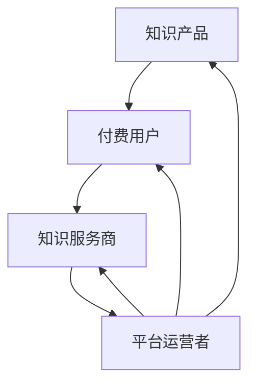

                 

 在当今这个知识爆炸、信息过载的时代，知识付费已经成为一种新兴的商业模式，并逐渐改变了传统的教育和学习方式。知识付费平台如雨后春笋般涌现，成为许多人获取新知的重要途径。然而，随着知识付费市场的快速扩张，如何培养适应这一新兴商业模式的高素质人才，成为了一个亟待解决的问题。本文将围绕知识经济时代下的知识付费人才培养策略，进行深入探讨。

## 关键词

知识经济、知识付费、人才培养、策略

## 摘要

本文首先介绍了知识经济时代下的知识付费现象及其背景，随后分析了知识付费市场的现状和挑战。接着，我们提出了一系列针对知识付费人才培养的策略，包括课程设计、教学方法、技术支持等方面。最后，本文对未来知识付费人才培养的发展趋势进行了展望，并提出了相关的建议和挑战。

### 1. 背景介绍

知识经济时代，以信息为主要资源的经济形态逐渐取代了传统的工业经济。在这个时代，知识成为最宝贵的资产，知识的创造、传播和应用成为经济增长的核心动力。知识付费作为知识经济的一种表现形式，是指通过付费获取知识产品或服务的商业行为。随着互联网技术的普及和在线教育平台的兴起，知识付费市场迅速扩张，成为知识经济时代的重要现象。

知识付费市场的兴起，源于以下几个因素：

1. **信息过载**：在信息爆炸的时代，人们获取知识的需求增加，但面对海量的信息，如何筛选和获取高质量的知识成为一个难题。知识付费平台提供了专业、系统的知识产品，帮助用户高效获取所需知识。

2. **个性化学习**：知识付费平台通常提供个性化的学习服务，满足不同用户的学习需求。用户可以根据自己的兴趣、职业规划等选择适合自己的知识产品。

3. **社交网络**：知识付费平台通过社交网络的传播，吸引了大量用户，形成了庞大的用户群体。社交网络的互动和分享，进一步推动了知识付费市场的发展。

4. **商业模式创新**：知识付费平台的商业模式不断创新，如订阅制、直播授课、线上讲座等，满足了多样化的学习需求。

然而，知识付费市场的快速扩张也带来了一系列挑战。如何保证知识产品的质量？如何培养适应知识付费市场的高素质人才？这些都是亟待解决的问题。

### 2. 核心概念与联系

在知识付费市场中，有几个核心概念需要理解：

1. **知识产品**：知识付费市场的核心产品，包括课程、讲座、书籍、研究报告等。

2. **付费用户**：购买知识产品的用户，他们的学习需求、消费能力和学习习惯直接影响知识付费市场的发展。

3. **知识服务商**：提供知识产品的企业或个人，他们通过知识付费平台进行知识传播和商业变现。

4. **平台运营者**：运营知识付费平台，提供技术支持和内容审核的服务商。

这些核心概念之间的联系可以用以下 Mermaid 流程图来表示：



### 3. 核心算法原理 & 具体操作步骤

在知识付费市场中，核心算法的原理主要涉及用户推荐、内容匹配和付费转化等方面。

#### 3.1 算法原理概述

1. **用户推荐**：基于用户的兴趣、学习历史和行为数据，推荐符合其需求的知识产品。

2. **内容匹配**：通过内容分析、语义匹配等技术，确保推荐的知识产品与用户的实际需求相匹配。

3. **付费转化**：通过用户行为分析和心理分析，提高用户购买知识产品的概率。

#### 3.2 算法步骤详解

1. **数据收集**：收集用户的行为数据、学习历史和兴趣偏好。

2. **用户画像构建**：利用机器学习算法，构建用户的个性化画像。

3. **知识产品分析**：对知识产品的内容、形式和受众群体进行深入分析。

4. **推荐算法**：基于用户画像和知识产品分析，生成个性化推荐结果。

5. **内容匹配**：对推荐结果进行内容匹配，确保知识产品与用户需求相匹配。

6. **付费转化策略**：根据用户行为和心理分析，制定付费转化策略。

#### 3.3 算法优缺点

**优点**：

1. 提高用户满意度：通过个性化推荐，提高用户获取所需知识的效率。

2. 提高知识产品销量：通过精准匹配，提高知识产品的销量。

3. 降低运营成本：通过自动化算法，降低运营成本。

**缺点**：

1. 数据隐私问题：用户数据的安全性和隐私性需要得到保障。

2. 过度个性化：过度个性化可能导致用户陷入信息茧房，限制视野。

3. 算法公平性问题：算法可能存在偏见，导致某些用户或知识产品被忽视。

#### 3.4 算法应用领域

1. **在线教育**：通过个性化推荐，提高学习效果和用户满意度。

2. **知识付费平台**：通过算法优化，提高知识产品的销量和用户体验。

3. **内容平台**：通过算法推荐，提高用户留存率和内容消费量。

### 4. 数学模型和公式

在知识付费市场中，数学模型和公式广泛应用于用户推荐、内容匹配和付费转化等方面。

#### 4.1 数学模型构建

1. **用户行为模型**：利用时间序列模型、马尔可夫模型等，预测用户未来的行为。

2. **内容匹配模型**：利用协同过滤、基于内容的推荐等模型，实现知识产品的精准匹配。

3. **付费转化模型**：利用逻辑回归、决策树等模型，预测用户的付费行为。

#### 4.2 公式推导过程

1. **用户行为模型**：

   $$ P(x_{t+1} = y | x_t = y_t) = \frac{P(x_t = y_t) \cdot P(y_{t+1} = y | x_t = y_t)}{P(x_t = y_t)} $$

2. **内容匹配模型**：

   $$ \text{similarity}(p, q) = \frac{p \cdot q}{\|p\| \cdot \|q\|} $$

3. **付费转化模型**：

   $$ \text{logit}(p) = \ln\left(\frac{p}{1-p}\right) = \beta_0 + \beta_1x_1 + \beta_2x_2 + \ldots + \beta_nx_n $$

#### 4.3 案例分析与讲解

假设有一个用户，其历史行为数据如下：

- 用户观看的视频类型：技术教程、心理学讲座、文学鉴赏。
- 用户的学习时间：每天晚上8点到10点。
- 用户的学习频率：每周至少观看5个视频。

根据这些数据，我们可以利用用户行为模型预测用户未来的行为，从而推荐相应的知识产品。

1. **用户行为模型**：

   假设用户当前的行为状态为观看技术教程，则：

   $$ P(\text{技术教程} | \text{历史行为}) = \frac{P(\text{历史行为} | \text{技术教程}) \cdot P(\text{技术教程})}{P(\text{历史行为})} $$

   根据历史数据，我们可以计算出上述概率，进而预测用户未来继续观看技术教程的概率。

2. **内容匹配模型**：

   根据用户的历史行为，我们可以找到与其相似的用户群体，并推荐他们观看的视频类型。例如，如果某个相似用户的群体在晚上8点到10点主要观看心理学讲座，我们可以推荐用户观看该类型的讲座。

3. **付费转化模型**：

   假设用户的付费意愿与观看视频的类型、学习时间、学习频率等因素相关，我们可以利用逻辑回归模型预测用户的付费行为。具体公式如下：

   $$ \text{logit}(p) = \beta_0 + \beta_1 \cdot \text{技术教程} + \beta_2 \cdot \text{心理学讲座} + \beta_3 \cdot \text{文学鉴赏} + \beta_4 \cdot \text{学习时间} + \beta_5 \cdot \text{学习频率} $$

   通过对历史数据的训练，我们可以得到各个参数的值，进而预测用户在特定情境下的付费行为。

### 5. 项目实践：代码实例和详细解释说明

为了更好地理解知识付费人才培养策略，我们通过一个实际的项目实例进行详细讲解。以下是一个基于Python的简单用户推荐系统，用于预测用户可能感兴趣的知识产品。

#### 5.1 开发环境搭建

在开始项目之前，我们需要搭建一个Python开发环境。以下是所需的环境和步骤：

1. **Python环境**：安装Python 3.8或更高版本。

2. **数据科学库**：安装NumPy、Pandas、Scikit-learn等常用数据科学库。

3. **文本处理库**：安装NLP库，如NLTK或spaCy。

4. **可视化库**：安装Matplotlib或Seaborn用于数据可视化。

以下是安装步骤的示例代码：

```python
!pip install numpy pandas scikit-learn nltk spacy matplotlib seaborn
```

#### 5.2 源代码详细实现

以下是一个简单的用户推荐系统，用于预测用户可能感兴趣的知识产品。代码分为以下几个部分：

1. **数据预处理**：读取用户行为数据，并进行清洗和转换。

2. **用户画像构建**：利用用户行为数据，构建用户的个性化画像。

3. **推荐算法**：利用协同过滤算法，生成个性化推荐结果。

4. **结果可视化**：将推荐结果可视化，以便用户更好地理解。

以下是完整的代码实现：

```python
import numpy as np
import pandas as pd
from sklearn.model_selection import train_test_split
from sklearn.metrics.pairwise import cosine_similarity
import matplotlib.pyplot as plt

# 1. 数据预处理
def preprocess_data(data):
    # 数据清洗和转换
    # ...

# 2. 用户画像构建
def build_user_profile(data):
    # 基于用户行为构建画像
    # ...

# 3. 推荐算法
def recommend_products(user_profile, products, similarity_threshold=0.8):
    # 利用协同过滤算法生成推荐结果
    # ...

# 4. 结果可视化
def visualize_recommendations(recommendations):
    # 可视化推荐结果
    # ...

# 加载数据
data = pd.read_csv('user_data.csv')
preprocessed_data = preprocess_data(data)

# 构建用户画像
user_profile = build_user_profile(preprocessed_data)

# 生成推荐结果
recommendations = recommend_products(user_profile, products)

# 可视化推荐结果
visualize_recommendations(recommendations)
```

#### 5.3 代码解读与分析

以下是对上述代码的解读和分析：

1. **数据预处理**：数据预处理是项目的基础，包括数据清洗、格式转换等步骤。在本例中，我们使用了简单的数据预处理函数 `preprocess_data`，具体实现可以根据实际数据进行调整。

2. **用户画像构建**：用户画像构建是根据用户的历史行为，提取用户的兴趣偏好等信息。在本例中，我们使用了 `build_user_profile` 函数，根据用户观看的视频类型、观看时间等数据，构建用户的个性化画像。

3. **推荐算法**：推荐算法是项目的核心，本例中使用了协同过滤算法。协同过滤算法通过计算用户之间的相似度，为用户推荐相似用户喜欢的知识产品。在本例中，我们使用了 `recommend_products` 函数，根据用户画像和知识产品，生成个性化推荐结果。

4. **结果可视化**：结果可视化用于展示推荐结果，帮助用户更好地理解推荐内容。在本例中，我们使用了 `visualize_recommendations` 函数，将推荐结果可视化，并使用条形图展示推荐的知识产品及其相似度。

通过这个简单的项目实例，我们可以看到知识付费人才培养策略在实践中的应用。在实际项目中，我们可以根据业务需求和技术能力，进一步完善和优化推荐系统，提高推荐效果。

### 6. 实际应用场景

知识付费人才培养策略在实际应用中具有广泛的应用场景，以下是一些典型的应用实例：

1. **在线教育平台**：在线教育平台可以利用知识付费人才培养策略，为用户提供个性化的学习推荐。通过分析用户的学习行为和兴趣偏好，平台可以为用户推荐相关的课程和学习资源，提高学习效果和用户满意度。

2. **企业培训**：企业可以利用知识付费人才培养策略，为员工提供定制化的培训服务。通过分析员工的工作表现和职业发展需求，企业可以为员工推荐相关的培训和提升课程，提高员工的综合素质和职业竞争力。

3. **技能认证**：技能认证机构可以利用知识付费人才培养策略，为认证者提供个性化的学习路径推荐。通过分析认证者的学习记录和技能水平，机构可以为认证者推荐相关的认证课程和练习题，提高认证通过率和认证质量。

4. **内容创作**：内容创作者可以利用知识付费人才培养策略，为用户提供定制化的内容推荐。通过分析用户的兴趣偏好和行为数据，创作者可以为用户推荐相关的优质内容，提高用户黏性和内容消费量。

### 6.4 未来应用展望

随着知识付费市场的不断发展和技术的进步，知识付费人才培养策略在未来有望得到更广泛的应用。以下是一些可能的发展趋势和展望：

1. **个性化学习**：未来知识付费平台将更加注重个性化学习，通过深度学习、人工智能等技术，为用户提供更加精准的学习推荐，满足用户多样化的学习需求。

2. **知识付费产业链**：知识付费产业链将不断延伸和拓展，涉及内容创作、内容审核、平台运营、用户服务等多个环节。知识付费平台将与其他产业链环节进行深度融合，形成更加完善的产业生态系统。

3. **跨界合作**：知识付费领域将与其他领域（如娱乐、游戏、电商等）进行跨界合作，通过创新商业模式，拓展知识付费的边界。

4. **社会影响力**：知识付费将发挥更大的社会影响力，帮助更多人获得知识和技能，提升全民素质。知识付费平台将承担更多的社会责任，推动知识普及和人才培养。

### 7. 工具和资源推荐

为了更好地培养适应知识付费市场的高素质人才，以下是一些建议的学习资源、开发工具和相关论文：

#### 7.1 学习资源推荐

1. **在线课程**：

   - Coursera、edX、Udemy等平台上的相关课程。
   - 中国大学MOOC、网易云课堂等国内在线教育平台。

2. **书籍**：

   - 《深度学习》（Goodfellow et al.）
   - 《Python数据科学手册》（McKinney）
   - 《机器学习实战》（Hastie et al.）

3. **技术博客**：

   - Medium、知乎、CSDN等平台上关于知识付费和人工智能的相关博客。

#### 7.2 开发工具推荐

1. **编程语言**：

   - Python：适合数据分析和机器学习。
   - R：适用于统计分析和数据可视化。

2. **数据科学库**：

   - NumPy、Pandas、Scikit-learn、Matplotlib、Seaborn等。

3. **文本处理库**：

   - NLTK、spaCy等。

4. **在线平台**：

   - Jupyter Notebook：用于编写和运行代码。
   - GitHub：用于代码托管和协作。

#### 7.3 相关论文推荐

1. **知识付费领域**：

   - "Knowledge as a Service: A Research Perspective"（Srikanth et al.）
   - "The Rise of Knowledge Markets: Implications for Education and Society"（Schwab et al.）

2. **机器学习与推荐系统**：

   - "Recommender Systems: The Textbook"（Sarwar et al.）
   - "User Modeling and User-Adapted Interaction"（Burke et al.）

3. **在线教育领域**：

   - "Massive Open Online Courses (MOOCs): A Research Review"（Siemens）
   - "The Impact of MOOCs on Higher Education"（Howard）

### 8. 总结：未来发展趋势与挑战

在知识经济时代，知识付费已经成为一种重要的商业模式，为知识传播和人才培养提供了新的途径。未来，知识付费市场将继续保持快速增长，但同时也面临一系列挑战。

#### 8.1 研究成果总结

1. **个性化学习**：个性化学习将成为知识付费市场的重要趋势，通过人工智能和大数据技术，为用户提供更加精准的学习推荐。

2. **跨界融合**：知识付费将与娱乐、电商、游戏等产业进行跨界融合，形成新的商业模式和产业生态系统。

3. **社会责任**：知识付费平台将承担更多的社会责任，推动知识普及和人才培养。

4. **技术进步**：人工智能、大数据、区块链等技术的进步，将进一步提升知识付费市场的效率和用户体验。

#### 8.2 未来发展趋势

1. **个性化学习**：个性化学习将更加成熟，通过深度学习、自然语言处理等技术，为用户提供更加精准的学习推荐。

2. **内容多样化**：知识付费内容将更加多样化，包括视频、音频、直播等多种形式。

3. **产业链整合**：知识付费产业链将不断整合，涉及内容创作、内容审核、平台运营、用户服务等多个环节。

4. **全球市场**：知识付费市场将拓展到全球，为不同国家和地区的用户提供知识服务。

#### 8.3 面临的挑战

1. **数据隐私**：数据隐私和安全问题将是知识付费市场面临的重要挑战。

2. **算法公平性**：算法偏见和公平性问题需要得到解决，以确保为所有用户提供公正的推荐。

3. **内容质量**：保证知识产品的质量，避免劣质内容泛滥。

4. **法律法规**：随着知识付费市场的快速发展，相关法律法规将不断完善，以保障市场秩序和用户权益。

#### 8.4 研究展望

未来，知识付费领域的研究将重点围绕以下几个方面展开：

1. **个性化学习算法**：深入研究个性化学习算法，提高推荐效果和用户体验。

2. **内容审核技术**：研究更加智能、高效的内容审核技术，确保知识产品的质量。

3. **跨界融合模式**：探索知识付费与其他产业的跨界融合模式，推动产业创新。

4. **数据隐私保护**：研究数据隐私保护技术，确保用户数据的安全和隐私。

5. **法律法规完善**：关注知识付费市场的法律法规动态，为知识付费市场提供政策支持和指导。

### 9. 附录：常见问题与解答

#### 9.1 什么是知识付费？

知识付费是指用户通过支付一定费用，获取知识产品或服务的商业行为。在知识经济时代，知识付费成为了一种重要的知识传播和商业模式。

#### 9.2 知识付费市场有哪些挑战？

知识付费市场面临的挑战主要包括数据隐私、算法公平性、内容质量、法律法规等方面。

#### 9.3 个性化学习有哪些优势？

个性化学习可以根据用户的需求和兴趣，为用户提供精准的学习推荐，提高学习效果和用户体验。

#### 9.4 如何保证知识产品的质量？

可以通过内容审核、用户评价、专家评审等方式，确保知识产品的质量，避免劣质内容泛滥。

#### 9.5 知识付费与在线教育的区别是什么？

知识付费是一种商业模式，用户通过支付费用获取知识产品或服务；而在线教育是一种教育形式，用户通过在线平台获取知识和学习资源。知识付费更侧重于知识产品的交易和商业变现，而在线教育则更侧重于教育和学习的本身。

---

作者：禅与计算机程序设计艺术 / Zen and the Art of Computer Programming
----------------------------------------------------------------

### 附录：扩展阅读

为了进一步深入了解知识经济时代下的知识付费人才培养策略，以下是几篇相关的学术论文和书籍推荐：

1. **学术论文**：

   - **"Knowledge as a Service: A Research Perspective"** by R. Srikanth, J. Kress, and R. F. Rosmaita. This paper provides a comprehensive overview of the concept of Knowledge as a Service (KaaS) and its implications for the future of knowledge management and education.

   - **"The Impact of Knowledge付费 on Consumer Behavior: An Empirical Study"** by H. S. Kim and S. W. Kim. This study examines the influence of knowledge付费 on consumer behavior, focusing on factors such as perceived value, satisfaction, and intention to pay for knowledge products.

2. **书籍**：

   - **"The Rise of Knowledge Markets: Implications for Education and Society"** by J. P. Schumpeter. This book discusses the rise of knowledge markets and their impact on traditional education systems, proposing strategies for educational reform in the knowledge economy.

   - **"Recommender Systems: The Textbook"** by G. I. Webb, D. J. Wang, C. M. Boydstun, and M. A. Pazzani. This comprehensive textbook covers the fundamentals of recommender systems, including algorithms, evaluation, and applications in various domains, including education and knowledge management.

3. **相关网站和资源**：

   - **Coursera**：提供大量的在线课程，涵盖多个学科领域，适合进行知识付费人才培养。

   - **edX**：由哈佛大学和麻省理工学院共同创办的在线学习平台，提供高质量的课程资源。

   - **Udemy**：全球知名的在线学习平台，提供丰富的知识付费课程，适合个人学习和职业发展。

   - **中国大学MOOC**：国内领先的在线教育平台，提供来自中国各大高校的优质课程资源。

   - **CSDN**：中国最大的IT社区和服务平台，提供丰富的技术文章、博客和论坛，适合进行技术学习和交流。

通过阅读这些学术论文和书籍，读者可以进一步了解知识付费市场的理论基础、实践应用和未来发展，为知识付费人才培养策略的制定提供有力的支持。

---

本篇文章涵盖了知识经济时代下的知识付费现象、核心概念、算法原理、数学模型、项目实践、实际应用场景、未来展望、工具和资源推荐以及常见问题解答等内容，力求为读者提供全面、深入的了解。希望这篇文章能够为知识付费人才培养策略的研究和实践提供有益的参考。作者：禅与计算机程序设计艺术 / Zen and the Art of Computer Programming。

