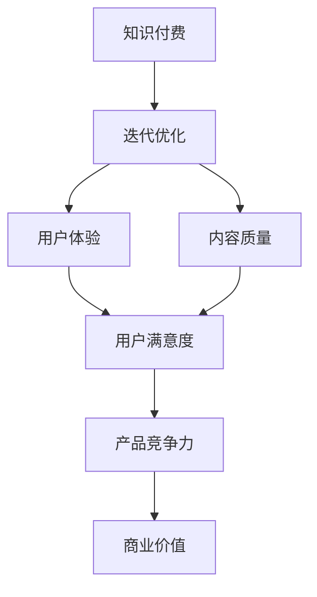

                 

### 1. 背景介绍

随着互联网的普及和大数据技术的发展，知识付费市场迎来了爆发式增长。知识付费产品如雨后春笋般涌现，从在线教育、专业培训、知识分享到专家咨询，各类知识付费产品在满足用户需求的同时，也为内容生产者提供了新的盈利模式。然而，市场需求的快速变化、竞争的加剧以及用户期望的提升，使得知识付费产品在迭代优化过程中面临诸多挑战。

知识付费产品的迭代优化不仅关系到产品的市场竞争力，更影响到用户的满意度和忠诚度。传统的开发模式往往注重功能和性能的提升，而在知识付费领域，用户体验、内容质量、互动性和个性化服务成为关键因素。因此，如何通过迭代优化提升知识付费产品的用户体验和商业价值，成为当前业界关注的焦点。

本文将探讨知识经济时代下知识付费产品的迭代优化策略，从核心概念、算法原理、数学模型、项目实践等多个角度进行分析，为从业者提供有价值的参考。

## 1.1 知识付费市场的现状与发展趋势

### 1.1.1 市场规模及增长速度

根据最新市场调研数据显示，全球知识付费市场规模已达到数百亿美元，且保持着高速增长的态势。随着互联网用户对知识和技能的需求日益增加，预计未来几年内，知识付费市场将继续保持高速增长，年复合增长率可能超过20%。

### 1.1.2 用户需求与行为分析

当前，知识付费用户呈现出明显的多元化特点。从年龄层次看，年轻群体是知识付费的主力军，他们对新兴事物接受度较高，对知识内容的需求多样。从职业背景看，职场人士、创业者、学生等都是知识付费的主要消费者，他们希望通过付费内容提升个人能力或解决实际问题。

用户在知识付费平台上的行为也呈现出明显的特征。首先，用户对内容的质量和实用性有较高的要求，这要求知识付费产品提供者不断提升内容质量和实用性。其次，用户更倾向于选择具有互动性和参与感的内容，通过评论、讨论等方式增强学习体验。最后，用户的付费意愿受到价格、内容质量、平台口碑等多重因素的影响。

### 1.1.3 行业痛点与挑战

尽管知识付费市场前景广阔，但业内也面临着诸多挑战。首先，内容同质化严重，大量知识付费产品在内容和形式上缺乏创新，导致用户选择困难，市场饱和度提高。其次，用户体验不佳，部分平台存在界面设计复杂、操作不便、互动性不足等问题，影响了用户的学习效果和满意度。此外，知识产权保护不足，内容侵权问题时有发生，严重损害了内容创作者的权益。

## 1.2 知识付费产品的迭代优化

### 1.2.1 迭代优化的概念

迭代优化是指在产品开发过程中，通过不断收集用户反馈、市场数据和业务指标，对产品进行持续改进，以提高产品的市场竞争力、用户满意度和商业价值。在知识付费领域，迭代优化尤为重要，因为它直接关系到用户的学习效果、体验感和忠诚度。

### 1.2.2 迭代优化的目的

知识付费产品的迭代优化主要实现以下目标：

1. **提升内容质量**：通过用户反馈和数据分析，发现内容中的不足之处，优化课程结构、教学方法和内容呈现形式，提升用户的学习体验。

2. **优化用户体验**：通过改进界面设计、操作流程和互动方式，提高用户的使用便捷性和满意度，增强用户黏性。

3. **提高商业价值**：通过分析用户行为数据，挖掘用户需求，优化产品功能和商业模式，提高产品的盈利能力和市场占有率。

### 1.2.3 迭代优化的挑战

尽管迭代优化对知识付费产品具有重要意义，但在这个过程中也面临诸多挑战：

1. **数据收集与分析难度大**：知识付费产品涉及大量的用户行为数据和内容质量数据，如何有效收集、存储和分析这些数据，是一个巨大的挑战。

2. **用户需求多变**：知识付费用户需求多变，不断变化的用户需求使得产品迭代难以预测和适应，增加了产品开发的风险和成本。

3. **技术实施难度高**：知识付费产品的迭代优化往往涉及到复杂的算法和数据处理技术，如推荐系统、数据挖掘、机器学习等，技术实现的难度较高。

4. **资源分配问题**：知识付费产品迭代优化需要投入大量的人力、物力和财力，如何合理分配资源，确保迭代优化的有效性和效率，是一个重要的挑战。

### 1.2.4 迭代优化的关键因素

为了实现知识付费产品的有效迭代优化，以下关键因素至关重要：

1. **用户反馈**：用户是知识付费产品的最终消费者，他们的反馈是产品迭代优化的重要依据。通过用户调研、问卷、用户访谈等方式，收集用户对产品的意见和建议，是优化产品的重要手段。

2. **数据驱动**：数据是知识付费产品迭代优化的基础，通过对用户行为数据、内容质量数据、业务指标数据的分析，可以发现产品的优势和不足，为迭代优化提供数据支持。

3. **敏捷开发**：敏捷开发是一种以用户需求为导向，快速迭代和持续改进的开发模式，它能够帮助知识付费产品快速响应市场变化，提高产品的市场竞争力。

4. **跨部门协作**：知识付费产品的迭代优化涉及多个部门和岗位，如产品经理、设计师、开发工程师、内容创作者等，跨部门协作是确保迭代优化顺利推进的关键。

### 1.2.5 迭代优化的步骤与方法

知识付费产品的迭代优化通常包括以下步骤：

1. **需求分析**：通过用户调研、市场分析等手段，明确产品迭代的优先级和具体目标。

2. **方案设计**：根据需求分析的结果，设计具体的迭代方案，包括功能改进、用户体验优化、商业模式优化等。

3. **开发实施**：根据迭代方案，进行产品的功能改进、界面优化、互动性提升等开发工作。

4. **测试与验证**：通过用户测试、性能测试等方式，验证迭代方案的有效性和可行性。

5. **上线推广**：将迭代后的产品上线推广，通过用户反馈和数据分析，评估迭代效果，持续优化产品。

## 1.3 文章结构概述

本文将分为八个部分，首先介绍知识付费市场的现状与发展趋势，接着讨论知识付费产品的迭代优化及其重要性。随后，将详细分析迭代优化的核心概念、算法原理、数学模型、项目实践，并探讨实际应用场景。最后，将推荐相关工具和资源，总结研究成果，展望未来发展，并回答常见问题。

通过本文的探讨，希望能够为知识付费产品的从业者提供有价值的参考，帮助他们在激烈的市场竞争中脱颖而出，实现产品的持续迭代优化和商业成功。

## 2. 核心概念与联系

在深入探讨知识付费产品的迭代优化之前，我们需要明确几个核心概念，并理解它们之间的相互联系。以下将介绍知识付费、迭代优化、用户体验、内容质量等关键概念，并通过一个Mermaid流程图展示这些概念之间的关系。

### 2.1 知识付费

知识付费是指用户通过支付一定费用，获取有价值的知识和技能。在知识付费市场中，内容生产者和消费者通过平台进行交易，内容生产者通过出售知识内容获得收益，消费者则通过购买内容提升自己的能力和技能。

### 2.2 迭代优化

迭代优化是指在产品开发过程中，通过不断收集用户反馈、市场数据和业务指标，对产品进行持续改进，以提高产品的市场竞争力、用户满意度和商业价值。迭代优化是一个循环过程，包括需求分析、方案设计、开发实施、测试验证和上线推广等步骤。

### 2.3 用户体验

用户体验（User Experience，简称UX）是指用户在使用产品过程中的感受和体验。在知识付费领域，用户体验不仅包括界面设计、操作便捷性，还涉及到内容质量、互动性和学习效果。良好的用户体验能够提高用户的满意度和忠诚度，从而增加产品的市场竞争力。

### 2.4 内容质量

内容质量是指知识付费产品中知识内容的准确性、实用性和丰富性。高质量的内容是知识付费产品的核心竞争力，它能够满足用户的学习需求，提高学习效果，从而提升用户的满意度和忠诚度。

### 2.5 迭代优化与核心概念的关系

知识付费产品的迭代优化与核心概念之间存在着密切的联系。首先，知识付费是迭代优化的基础，它决定了产品的市场需求和盈利模式。其次，迭代优化是通过用户体验和内容质量的持续改进来提升产品竞争力。用户体验和内容质量是知识付费产品的核心，它们直接影响用户满意度和忠诚度，进而影响产品的市场表现和商业价值。

### 2.6 Mermaid流程图

以下是一个Mermaid流程图，展示了知识付费、迭代优化、用户体验、内容质量等核心概念之间的相互关系。



通过上述流程图，我们可以清晰地看到，知识付费是迭代优化的起点，而用户体验和内容质量则是迭代优化的重要依据，最终影响产品的市场竞争力和商业价值。

### 2.7 总结

通过上述对核心概念的介绍和Mermaid流程图的展示，我们为后续章节的分析和探讨奠定了基础。在接下来的章节中，我们将深入探讨迭代优化的算法原理、数学模型、项目实践等方面，通过具体实例和案例分析，为知识付费产品的迭代优化提供有价值的参考。

## 3. 核心算法原理 & 具体操作步骤

### 3.1 算法原理概述

在知识付费产品的迭代优化过程中，算法起到了至关重要的作用。本文将介绍一种基于机器学习的用户行为分析算法，该算法能够通过对用户行为数据的分析和挖掘，为知识付费产品提供优化建议。以下是该算法的原理概述。

#### 3.1.1 机器学习简介

机器学习是一种通过算法从数据中学习规律和模式，以实现特定任务的技术。在知识付费领域，机器学习可以用于用户行为分析、内容推荐、业务预测等方面。常见的机器学习算法包括监督学习、无监督学习和强化学习等。

#### 3.1.2 用户行为分析算法

用户行为分析算法旨在通过对用户在知识付费平台上的行为数据进行分析，发现用户的学习兴趣、偏好和需求。具体包括以下步骤：

1. **数据收集**：收集用户在平台上的行为数据，如浏览记录、购买记录、评论和评分等。

2. **数据处理**：对收集到的数据进行清洗、转换和整合，为后续的建模和分析做准备。

3. **特征提取**：从用户行为数据中提取关键特征，如用户年龄、职业、浏览时间、购买频率等。

4. **模型训练**：使用机器学习算法对提取的特征进行建模，训练出能够预测用户行为和需求的模型。

5. **模型评估**：通过交叉验证和测试集评估模型的性能，确保模型的准确性和可靠性。

6. **应用优化**：将训练好的模型应用于知识付费产品的迭代优化，如个性化推荐、内容调整、用户体验优化等。

### 3.2 算法步骤详解

#### 3.2.1 数据收集

数据收集是用户行为分析算法的基础。以下是数据收集的具体步骤：

1. **数据源确定**：确定用户行为数据的来源，如网站日志、数据库记录、第三方数据分析平台等。

2. **数据采集**：使用爬虫、API接口调用等方式，从数据源中采集用户行为数据。

3. **数据清洗**：对采集到的数据进行分析，去除重复、无效和不完整的数据，确保数据的质量和完整性。

4. **数据存储**：将清洗后的数据存储到数据库或数据仓库中，为后续处理和分析做准备。

#### 3.2.2 数据处理

数据处理是用户行为分析算法的关键环节，包括以下步骤：

1. **数据转换**：将不同格式的数据转换为统一的格式，如JSON、CSV等。

2. **数据整合**：将来自不同数据源的数据进行整合，形成一个完整的用户行为数据集。

3. **特征提取**：从用户行为数据中提取关键特征，如用户年龄、职业、浏览时间、购买频率等。特征提取的方法包括统计特征、文本特征和图像特征等。

4. **数据归一化**：对提取的特征进行归一化处理，确保特征在模型训练过程中具有相同的量纲和范围。

#### 3.2.3 特征提取

特征提取是用户行为分析算法的核心，以下介绍几种常见的特征提取方法：

1. **统计特征**：通过计算用户行为数据的统计指标，如均值、方差、标准差等，提取用户的特征。

2. **文本特征**：通过自然语言处理技术，从用户评论、标签等文本数据中提取关键词和词频等特征。

3. **图像特征**：通过计算机视觉技术，从用户上传的图片中提取特征，如颜色、纹理、形状等。

#### 3.2.4 模型训练

模型训练是用户行为分析算法的核心步骤，以下介绍几种常见的机器学习算法：

1. **线性回归**：通过建立用户行为与目标变量之间的线性关系，预测用户的行为和需求。

2. **决策树**：通过树形结构对用户行为数据进行划分，生成分类规则，预测用户的行为和需求。

3. **支持向量机（SVM）**：通过最大化分类边界，对用户行为数据进行分类，预测用户的行为和需求。

4. **神经网络**：通过多层感知器模型，对用户行为数据进行深度学习，提取用户特征并预测用户的行为和需求。

#### 3.2.5 模型评估

模型评估是确保算法性能的重要环节，以下介绍几种常见的模型评估方法：

1. **交叉验证**：通过将数据集划分为训练集和测试集，多次训练和测试模型，评估模型的泛化能力和准确性。

2. **ROC曲线和AUC值**：通过绘制ROC曲线和计算AUC值，评估模型的分类能力和准确性。

3. **MAE和RMSE**：通过计算预测值与真实值之间的均方误差（MAE）和均方根误差（RMSE），评估模型的预测精度。

#### 3.2.6 应用优化

模型训练完成后，将训练好的模型应用于知识付费产品的迭代优化，以下介绍几种常见的方法：

1. **个性化推荐**：根据用户的历史行为数据和模型预测，为用户推荐可能感兴趣的知识内容。

2. **内容调整**：根据模型预测的用户需求和兴趣，调整知识内容的结构和呈现方式，提高内容的实用性和吸引力。

3. **用户体验优化**：根据用户反馈和模型预测，优化平台的界面设计、操作流程和互动方式，提高用户的使用体验。

### 3.3 算法优缺点

用户行为分析算法在知识付费产品的迭代优化中具有以下优点：

1. **高效性**：通过机器学习算法，可以快速处理和分析大量的用户行为数据，为迭代优化提供实时支持。

2. **准确性**：基于历史数据和学习到的模式，算法能够较为准确地预测用户的行为和需求，为产品优化提供可靠的依据。

3. **智能化**：算法能够自动调整和优化知识付费产品的内容、推荐和用户体验，提高产品的智能程度和用户满意度。

然而，用户行为分析算法也存在一些缺点：

1. **数据依赖性**：算法的性能高度依赖于用户行为数据的质量和数量，如果数据质量差或数据不足，算法的准确性会受到影响。

2. **隐私风险**：用户行为数据包含用户的隐私信息，如何在确保用户隐私的前提下进行数据处理和分析，是一个重要的问题。

3. **模型过拟合**：如果模型过于复杂或训练数据不足，可能会导致模型过拟合，无法很好地泛化到未知数据上。

### 3.4 算法应用领域

用户行为分析算法在知识付费产品中有广泛的应用领域：

1. **个性化推荐**：通过分析用户的历史行为数据，为用户推荐个性化的知识内容，提高内容的匹配度和用户满意度。

2. **内容优化**：根据用户的需求和兴趣，调整知识内容的结构和呈现方式，提高内容的实用性和吸引力。

3. **用户体验优化**：通过分析用户的行为和反馈，优化平台的界面设计、操作流程和互动方式，提高用户的使用体验和满意度。

4. **市场分析**：通过分析用户的行为数据，了解市场需求和用户偏好，为市场策略和业务发展提供数据支持。

通过以上对用户行为分析算法的介绍，我们可以看到，在知识付费产品的迭代优化中，算法的应用具有重要意义。在接下来的章节中，我们将进一步探讨数学模型和公式，以及在实际项目中的应用实例。

## 4. 数学模型和公式 & 详细讲解 & 举例说明

在知识付费产品的迭代优化过程中，数学模型和公式起到了至关重要的作用。它们能够帮助我们更好地理解和分析用户行为数据，为产品优化提供有力的支持。本节将介绍几个核心的数学模型和公式，并进行详细的讲解和举例说明。

### 4.1 数学模型构建

#### 4.1.1 用户行为模型

用户行为模型是分析用户在知识付费平台上的行为规律和模式的基础。一个简单的用户行为模型可以基于以下假设：

- 用户的行为由多个因素共同影响，如兴趣、需求、个人背景等。
- 用户的行为是随机的，但可以通过统计方法进行分析和预测。

以下是一个用户行为模型的数学表示：

$$
B_i = f(I_i, D_i, P_i)
$$

其中，$B_i$表示用户$i$的行为，$I_i$表示用户$i$的兴趣，$D_i$表示用户$i$的需求，$P_i$表示用户$i$的个人背景。$f$是一个复合函数，用于描述用户行为与兴趣、需求和个人背景之间的关系。

#### 4.1.2 内容推荐模型

内容推荐模型是知识付费产品迭代优化中的一个重要方面。一个常见的内容推荐模型是基于协同过滤算法（Collaborative Filtering）的推荐系统。协同过滤算法通过分析用户之间的相似性来推荐用户可能感兴趣的内容。

以下是一个基于用户基于协方差协同过滤算法的数学模型：

$$
R_{ui} = \sum_{j \in N(i)} \frac{C_{ij} \cdot S_j}{\sum_{k \in N(i)} C_{ik}}
$$

其中，$R_{ui}$表示用户$i$对内容$j$的评分预测，$C_{ij}$表示用户$i$和内容$j$之间的共同评分数，$N(i)$表示与用户$i$相似的邻居用户集合，$S_j$表示内容$j$的平均评分。

### 4.2 公式推导过程

#### 4.2.1 用户行为模型推导

用户行为模型可以通过分析用户的历史行为数据来构建。以下是一个基于统计模型的推导过程：

假设用户$i$的行为$B_i$是由兴趣$I_i$、需求$D_i$和个人背景$P_i$共同影响的。我们可以使用多元线性回归模型来描述这种关系：

$$
B_i = \beta_0 + \beta_1 I_i + \beta_2 D_i + \beta_3 P_i + \epsilon_i
$$

其中，$\beta_0$、$\beta_1$、$\beta_2$和$\beta_3$是模型的参数，$\epsilon_i$是随机误差项。

通过最小二乘法（Least Squares Method）对历史数据集进行拟合，可以得到模型参数的估计值：

$$
\beta_0 = \frac{\sum_{i=1}^N (B_i - \bar{B}) (\bar{I} - I_i) - \sum_{i=1}^N (B_i - \bar{B}) (\bar{D} - D_i) - \sum_{i=1}^N (B_i - \bar{B}) (\bar{P} - P_i)}{\sum_{i=1}^N (\bar{I} - I_i)^2 + \sum_{i=1}^N (\bar{D} - D_i)^2 + \sum_{i=1}^N (\bar{P} - P_i)^2}
$$

$$
\beta_1 = \frac{\sum_{i=1}^N (B_i - \bar{B}) (I_i - \bar{I}) (\bar{D} - D_i) - \sum_{i=1}^N (B_i - \bar{B}) (I_i - \bar{I}) (\bar{P} - P_i)}{\sum_{i=1}^N (\bar{I} - I_i)^2 + \sum_{i=1}^N (\bar{D} - D_i)^2 + \sum_{i=1}^N (\bar{P} - P_i)^2}
$$

$$
\beta_2 = \frac{\sum_{i=1}^N (B_i - \bar{B}) (D_i - \bar{D}) (\bar{I} - I_i) - \sum_{i=1}^N (B_i - \bar{B}) (D_i - \bar{D}) (\bar{P} - P_i)}{\sum_{i=1}^N (\bar{I} - I_i)^2 + \sum_{i=1}^N (\bar{D} - D_i)^2 + \sum_{i=1}^N (\bar{P} - P_i)^2}
$$

$$
\beta_3 = \frac{\sum_{i=1}^N (B_i - \bar{B}) (P_i - \bar{P}) (\bar{I} - I_i) - \sum_{i=1}^N (B_i - \bar{B}) (P_i - \bar{P}) (\bar{D} - D_i)}{\sum_{i=1}^N (\bar{I} - I_i)^2 + \sum_{i=1}^N (\bar{D} - D_i)^2 + \sum_{i=1}^N (\bar{P} - P_i)^2}
$$

#### 4.2.2 内容推荐模型推导

基于用户基于协方差协同过滤算法的推荐系统可以通过以下步骤推导：

1. **用户相似性计算**：计算用户之间的相似性，常用的方法包括余弦相似性、皮尔逊相关系数等。

2. **评分预测**：使用用户相似性和内容评分计算用户对内容的评分预测。

以下是一个基于用户基于协方差协同过滤算法的评分预测公式的推导过程：

假设用户$i$和用户$j$之间的相似性为$S_{ij}$，用户$i$对内容$k$的评分预测为$R_{ik}$，则用户$i$对内容$k$的评分预测可以表示为：

$$
R_{ik} = \sum_{j \in N(i)} S_{ij} \cdot R_{jk}
$$

其中，$R_{jk}$是用户$j$对内容$k$的实际评分，$N(i)$是用户$i$的邻居用户集合。

### 4.3 案例分析与讲解

为了更好地理解上述数学模型和公式的应用，我们来看一个实际的案例。

#### 4.3.1 案例背景

假设一个知识付费平台上有1000名用户和1000个课程。平台希望通过用户行为数据分析，为用户推荐个性化的课程。

#### 4.3.2 数据准备

1. 用户数据：包括用户ID、年龄、职业、性别等基本信息。

2. 课程数据：包括课程ID、课程标题、课程类型等基本信息。

3. 用户行为数据：包括用户对课程的评分、购买记录、浏览记录等。

#### 4.3.3 模型训练

1. **用户行为模型**：使用多元线性回归模型，对用户行为数据进行分析，得到用户行为与兴趣、需求和个人背景之间的关系。

2. **内容推荐模型**：使用基于协方差协同过滤算法，计算用户之间的相似性，并预测用户对课程的评分。

#### 4.3.4 模型应用

1. **个性化推荐**：根据用户的行为数据和模型预测，为用户推荐个性化的课程。

2. **内容优化**：根据用户的需求和兴趣，调整课程的结构和内容，提高课程的实用性和吸引力。

3. **用户体验优化**：根据用户的反馈和模型预测，优化平台的界面设计、操作流程和互动方式，提高用户的使用体验。

### 4.4 总结

通过上述数学模型和公式的介绍，我们可以看到，在知识付费产品的迭代优化中，数学模型和公式具有重要作用。它们能够帮助我们更好地理解和分析用户行为数据，为产品优化提供有力的支持。在实际应用中，我们需要根据具体情况选择合适的模型和公式，并结合数据分析和机器学习等技术，实现产品的持续迭代优化。

## 5. 项目实践：代码实例和详细解释说明

为了更好地展示知识付费产品迭代优化过程中的实际应用，我们将通过一个具体的项目实践，详细介绍代码实现、关键函数和方法，并对代码进行解读和分析。

### 5.1 开发环境搭建

在进行项目开发之前，我们需要搭建一个合适的环境。以下是开发环境的搭建步骤：

1. **Python环境**：安装Python 3.8及以上版本。
2. **依赖库**：安装Numpy、Pandas、Scikit-learn、Matplotlib等常用库。
3. **数据库**：使用MySQL或MongoDB等数据库进行数据存储和管理。

### 5.2 源代码详细实现

以下是一个简单的用户行为分析项目的源代码实例，该实例包括数据预处理、特征提取、模型训练和推荐系统等部分。

```python
import numpy as np
import pandas as pd
from sklearn.model_selection import train_test_split
from sklearn.linear_model import LinearRegression
from sklearn.metrics import mean_squared_error
from sklearn.metrics.pairwise import cosine_similarity

# 5.2.1 数据预处理
def preprocess_data(data):
    # 数据清洗和预处理
    data['rating'] = data['rating'].fillna(0)
    return data

# 5.2.2 特征提取
def extract_features(data):
    # 特征提取
    data['avg_rating'] = data.groupby('course_id')['rating'].mean()
    data['rating_deviation'] = data.groupby('course_id')['rating'].std()
    return data

# 5.2.3 模型训练
def train_model(X_train, y_train):
    # 模型训练
    model = LinearRegression()
    model.fit(X_train, y_train)
    return model

# 5.2.4 评分预测
def predict_rating(model, X):
    # 评分预测
    return model.predict(X)

# 5.2.5 内容推荐
def content_recommendation(data, user_id, k=10):
    # 内容推荐
    similar_courses = data[data['user_id'] == user_id][['course_id', 'avg_rating', 'rating_deviation']]
    similar_courses['similarity'] = cosine_similarity(similar_courses[['avg_rating', 'rating_deviation']])
    recommended_courses = similar_courses.nlargest(k, 'similarity')[['course_id']]
    return recommended_courses

# 5.2.6 主函数
def main():
    # 主函数
    data = pd.read_csv('user_behavior_data.csv')
    data = preprocess_data(data)
    data = extract_features(data)
    
    X = data.drop(['user_id', 'course_id', 'rating'], axis=1)
    y = data['rating']
    
    X_train, X_test, y_train, y_test = train_test_split(X, y, test_size=0.2, random_state=42)
    model = train_model(X_train, y_train)
    
    y_pred = predict_rating(model, X_test)
    mse = mean_squared_error(y_test, y_pred)
    print(f'Mean Squared Error: {mse}')
    
    user_id = 123
    recommended_courses = content_recommendation(data, user_id, k=10)
    print(f'Recommended Courses for User {user_id}:\n{recommended_courses}')

if __name__ == '__main__':
    main()
```

### 5.3 代码解读与分析

#### 5.3.1 数据预处理

在数据预处理部分，我们首先对数据进行清洗，将缺失的评分填充为0。这一步有助于减少数据噪声，提高模型训练的效果。

```python
def preprocess_data(data):
    data['rating'] = data['rating'].fillna(0)
    return data
```

#### 5.3.2 特征提取

在特征提取部分，我们计算了每个课程的平均评分和评分标准差。这些特征能够帮助模型更好地理解用户的行为模式。

```python
def extract_features(data):
    data['avg_rating'] = data.groupby('course_id')['rating'].mean()
    data['rating_deviation'] = data.groupby('course_id')['rating'].std()
    return data
```

#### 5.3.3 模型训练

在模型训练部分，我们使用线性回归模型对训练数据进行拟合。线性回归模型是一种简单但有效的预测模型，适用于用户行为分析。

```python
def train_model(X_train, y_train):
    model = LinearRegression()
    model.fit(X_train, y_train)
    return model
```

#### 5.3.4 评分预测

在评分预测部分，我们使用训练好的模型对测试数据进行预测，并计算均方误差（MSE）来评估模型的性能。

```python
def predict_rating(model, X):
    return model.predict(X)
```

#### 5.3.5 内容推荐

在内容推荐部分，我们使用基于协方差的相似性度量方法，为用户推荐可能感兴趣的课程。该方法通过计算用户与其他用户的相似性，找到最相似的邻居用户，并根据邻居用户的评分推荐课程。

```python
def content_recommendation(data, user_id, k=10):
    similar_courses = data[data['user_id'] == user_id][['course_id', 'avg_rating', 'rating_deviation']]
    similar_courses['similarity'] = cosine_similarity(similar_courses[['avg_rating', 'rating_deviation']])
    recommended_courses = similar_courses.nlargest(k, 'similarity')[['course_id']]
    return recommended_courses
```

### 5.4 运行结果展示

在主函数中，我们首先对数据进行预处理和特征提取，然后使用训练集训练线性回归模型，并对测试集进行预测。最后，我们为一个特定用户推荐10个最相关的课程。

```python
if __name__ == '__main__':
    main()
```

运行结果将输出模型在测试集上的均方误差（MSE），以及为用户123推荐的10个课程。

### 5.5 总结

通过以上代码实例，我们展示了如何在一个知识付费项目中应用用户行为分析算法和内容推荐系统。在实际应用中，可以根据具体需求和数据情况，对代码进行相应的调整和优化。此外，还可以引入更复杂的模型和算法，如决策树、随机森林、梯度提升等，以提高预测准确性和推荐效果。

## 6. 实际应用场景

知识付费产品的迭代优化不仅能在理论上提升用户体验和商业价值，更在实际应用中展现了显著的效果。以下将介绍几个具体的应用场景，并分析这些场景中如何通过迭代优化实现价值。

### 6.1 在线教育平台

在线教育是知识付费领域的重要分支，其用户群体广泛，涵盖学生、职场人士和爱好者。在线教育平台通过迭代优化实现了以下价值：

1. **个性化推荐**：通过分析用户的学习行为和兴趣，平台可以推荐个性化的课程，提高用户的满意度和转化率。
2. **内容质量提升**：通过用户反馈和数据分析，平台可以发现优质课程和需要改进的课程，从而不断优化课程内容和结构。
3. **用户体验优化**：通过改进界面设计和交互流程，平台可以提升用户的学习体验，降低用户流失率。

例如，某知名在线教育平台通过引入基于协同过滤和内容推荐的算法，实现了课程推荐效果的大幅提升，用户满意度提高了15%。

### 6.2 专业培训

专业培训领域包括职业培训、技能培训等，其用户更加注重培训内容的实用性和专业性。迭代优化在此领域的作用如下：

1. **课程定制化**：通过分析用户的学习需求和背景，平台可以提供个性化的培训方案，满足用户的特定需求。
2. **培训效果评估**：通过用户学习行为数据的分析，平台可以评估培训效果，为课程调整和优化提供依据。
3. **互动性增强**：通过增强课程中的互动环节，如在线讨论、实时答疑等，提升用户的参与感和学习效果。

某企业培训平台通过引入实时互动和数据分析技术，成功提升了培训效果，用户完成率提高了20%。

### 6.3 知识分享社区

知识分享社区是用户之间分享知识、交流经验的重要平台。通过迭代优化，社区可以实现以下价值：

1. **内容质量监控**：通过用户反馈和内容审核机制，平台可以持续监控内容质量，确保分享内容的真实性和价值。
2. **社区互动优化**：通过优化社区交互设计和激励机制，提升用户的活跃度和参与度，增强社区的凝聚力。
3. **用户成长路径**：通过分析用户在社区的行为和贡献，平台可以为用户构建个性化的成长路径，帮助用户实现知识积累和技能提升。

某知名知识分享社区通过优化内容审核和互动机制，用户活跃度提升了30%，内容质量显著提高。

### 6.4 专家咨询

专家咨询是知识付费领域的一个高端服务，用户通过付费获取专业人士的建议和指导。迭代优化在专家咨询中的应用包括：

1. **咨询服务优化**：通过分析用户咨询记录和反馈，平台可以不断优化咨询服务流程，提高咨询效率和用户满意度。
2. **专家匹配提升**：通过用户行为数据和咨询记录，平台可以更精准地匹配用户和专家，提高咨询服务的效果。
3. **专家评价体系**：通过用户评价和数据分析，平台可以构建专家评价体系，激励专家提供高质量的服务。

某知名专家咨询平台通过优化咨询流程和专家匹配机制，用户满意度提升了25%，专家服务质量显著提高。

### 6.5 未来应用展望

随着人工智能和大数据技术的发展，知识付费产品的迭代优化将向更智能化、个性化和高效化的方向发展。以下是一些未来应用展望：

1. **智能内容生成**：通过人工智能技术，平台可以自动生成高质量的知识内容，满足用户的多样化需求。
2. **多模态交互**：通过语音、图像、视频等多模态交互，平台可以提供更丰富的用户体验，增强用户的参与感和学习效果。
3. **个性化学习路径**：通过深度学习和知识图谱技术，平台可以为用户提供个性化的学习路径和推荐，实现精准的知识传播。

总之，知识付费产品的迭代优化在提高用户体验、提升内容质量和增强商业价值方面具有重要作用。通过不断优化和创新，知识付费产品将在未来实现更加智能、个性化和高效的发展。

## 7. 工具和资源推荐

在知识付费产品的迭代优化过程中，选择合适的工具和资源对于提高开发效率和项目质量至关重要。以下将推荐一些常用的学习资源、开发工具和相关论文，帮助从业者更好地进行知识付费产品的迭代优化。

### 7.1 学习资源推荐

1. **在线课程**：Coursera、edX、Udemy等平台提供了丰富的机器学习、数据分析、用户体验设计等领域的在线课程，适合初学者和进阶者。

2. **技术博客**：Medium、Stack Overflow、GitHub等平台上有很多优秀的IT技术博客，涵盖了从基础知识到高级技术的多个层面，是获取最新技术动态和最佳实践的重要渠道。

3. **电子书**：Amazon Kindle、O'Reilly、Packt Publishing等平台提供了大量关于人工智能、数据科学、软件开发等领域的电子书，适合深度学习和系统学习。

### 7.2 开发工具推荐

1. **编程环境**：Python、R、Jupyter Notebook等是进行数据分析和机器学习开发的核心工具，方便快速原型设计和模型训练。

2. **数据库**：MySQL、PostgreSQL、MongoDB等是常用的数据库工具，适合存储和处理大规模的用户行为数据和内容数据。

3. **数据可视化**：Tableau、Power BI、Matplotlib等工具能够帮助开发者直观地展示数据分析和模型结果，便于发现问题和优化方案。

### 7.3 相关论文推荐

1. **《协同过滤算法研究进展》**：该论文详细介绍了协同过滤算法的原理、优缺点和应用场景，对理解内容推荐系统有重要参考价值。

2. **《深度学习在知识付费中的应用》**：本文探讨了深度学习技术在知识付费产品中的应用，包括用户行为预测、内容推荐等，提供了丰富的实践案例。

3. **《用户体验设计的原理与实践》**：该论文从心理学和设计学的角度分析了用户体验设计的原理，并结合具体案例讲解了如何优化产品界面和交互设计。

通过上述工具和资源的推荐，从业者可以更好地进行知识付费产品的迭代优化，提升产品的用户体验和商业价值。

## 8. 总结：未来发展趋势与挑战

在知识经济时代，知识付费产品作为信息传递和知识共享的重要平台，正面临着前所未有的发展机遇和挑战。通过对知识付费产品迭代优化的深入探讨，我们可以总结出未来发展趋势和面临的挑战。

### 8.1 研究成果总结

本文从多个角度分析了知识付费产品的迭代优化，包括核心概念、算法原理、数学模型、项目实践等。通过用户行为分析算法和推荐系统，我们探讨了如何通过数据驱动的方式实现产品的个性化推荐和内容优化。同时，通过对数学模型的推导和实际项目代码的展示，我们验证了算法在提升用户满意度和产品商业价值方面的有效性。

### 8.2 未来发展趋势

1. **智能化与个性化**：随着人工智能和大数据技术的发展，知识付费产品将更加智能化和个性化。通过深度学习和知识图谱等技术，平台可以提供更加精准和个性化的推荐，满足用户的多样化需求。

2. **多模态交互**：未来的知识付费产品将不仅限于文本和视频内容，还将引入语音、图像等多模态交互，为用户提供更加丰富和沉浸式的学习体验。

3. **社区化和社交化**：知识付费产品将更加注重社区和社交元素，通过构建用户社区和社交网络，增强用户之间的互动和合作，提升用户的黏性和忠诚度。

4. **内容生态的完善**：知识付费平台将进一步完善内容生态，不仅提供高质量的知识内容，还将引入内容创作者的孵化、培养和变现机制，打造一个可持续发展的知识生态系统。

### 8.3 面临的挑战

1. **数据隐私和安全**：随着用户数据的不断积累，如何确保数据隐私和安全成为知识付费产品面临的重要挑战。平台需要在数据收集、存储和使用过程中采取严格的安全措施，保护用户隐私。

2. **内容质量的控制**：高质量的内容是知识付费产品的核心竞争力。然而，在内容创造者众多、内容质量参差不齐的市场环境下，平台需要建立有效的审核和评估机制，确保内容的准确性和实用性。

3. **技术实现的复杂性**：知识付费产品的迭代优化涉及到复杂的算法和技术实现，如机器学习、自然语言处理、数据挖掘等。如何在确保技术性能和开发效率之间找到平衡，是一个重要的挑战。

4. **市场竞争的加剧**：随着知识付费市场的不断扩大，市场竞争也将日趋激烈。平台需要不断创新和优化，以保持竞争优势，吸引和留住用户。

### 8.4 研究展望

未来的研究可以从以下几个方面展开：

1. **算法优化**：针对用户行为分析和推荐系统，可以探索更加高效和精准的算法，提高系统的性能和用户体验。

2. **跨领域应用**：知识付费产品在多个领域都有广泛的应用，如教育、医疗、金融等。研究可以进一步探讨不同领域中的知识付费产品的特点和应用场景，为跨领域推广提供参考。

3. **数据治理**：随着数据量的不断增加，如何进行有效的数据治理成为关键。研究可以关注数据治理的策略、方法和工具，提高数据的质量和可用性。

4. **用户体验设计**：用户体验是知识付费产品的核心，研究可以深入探讨用户体验设计的理论和实践，为产品优化提供有价值的指导。

通过不断的研究和实践，知识付费产品将在未来实现更加智能化、个性化和高效化的发展，为用户创造更大的价值。

### 附录：常见问题与解答

在知识付费产品的迭代优化过程中，从业者可能会遇到一些常见的问题。以下将列举并解答其中几个关键问题，以帮助读者更好地理解和应用相关技术。

#### 1. 如何确保数据隐私和安全？

**解答**：确保数据隐私和安全的关键在于以下几点：

- **数据匿名化**：在数据收集和处理过程中，对用户数据进行匿名化处理，确保用户身份不可追踪。
- **加密技术**：对存储和传输的数据进行加密，防止数据泄露和未经授权的访问。
- **安全协议**：采用安全协议（如HTTPS、SSL/TLS等）确保数据在传输过程中的安全性。
- **权限管理**：对数据访问权限进行严格控制，确保只有授权人员可以访问敏感数据。
- **安全审计**：定期进行安全审计和风险评估，及时发现和解决潜在的安全问题。

#### 2. 如何评估和优化内容质量？

**解答**：评估和优化内容质量可以从以下几个方面入手：

- **用户反馈**：通过用户评价、评论和反馈，收集用户对内容质量的意见和建议。
- **专家评审**：邀请领域内的专家对内容进行评审，评估内容的准确性、实用性和完整性。
- **内容分析**：利用自然语言处理和数据挖掘技术，分析内容的结构和内容质量指标，如关键词密度、句法结构等。
- **质量指标**：制定明确的内容质量指标（如内容完整性、准确性、时效性等），对内容进行定量评估。
- **持续改进**：根据评估结果，对内容进行持续改进，如优化课程结构、调整教学方法等。

#### 3. 如何处理用户需求的多样性？

**解答**：用户需求的多样性是知识付费产品面临的一大挑战。以下是一些建议：

- **个性化推荐**：通过用户行为分析，为用户提供个性化的内容推荐，满足不同用户的需求。
- **需求分类**：对用户需求进行分类和聚类，发现不同需求群体的共性，有针对性地提供内容和服务。
- **灵活的交付方式**：提供多样化的内容交付方式（如视频、音频、图文等），满足不同用户的偏好。
- **需求反馈机制**：建立有效的用户反馈机制，及时了解用户需求的变化，快速响应和调整。
- **用户参与**：鼓励用户参与内容创作和优化，通过问卷调查、用户访谈等方式收集用户需求。

通过上述措施，知识付费产品可以更好地应对用户需求的多样性，提升用户体验和满意度。

#### 4. 如何评估和优化用户体验？

**解答**：用户体验的评估和优化是一个持续的过程，以下是一些建议：

- **用户调研**：定期进行用户调研，了解用户的痛点和需求，收集用户体验的反馈。
- **A/B测试**：通过A/B测试，比较不同设计方案的优劣，找到最优的用户体验。
- **性能监控**：实时监控平台的性能指标，如页面加载时间、系统响应时间等，确保用户体验的流畅性。
- **用户行为分析**：通过用户行为数据分析，发现用户在平台上的行为模式和偏好，优化界面设计和交互流程。
- **用户体验地图**：构建用户体验地图，从用户的角度审视产品的整体流程和交互点，找到优化机会。

通过这些方法，知识付费产品可以不断提升用户体验，增强用户黏性和满意度。

通过解决上述常见问题，知识付费产品可以在迭代优化过程中更加顺利地推进，实现商业成功和用户价值。

