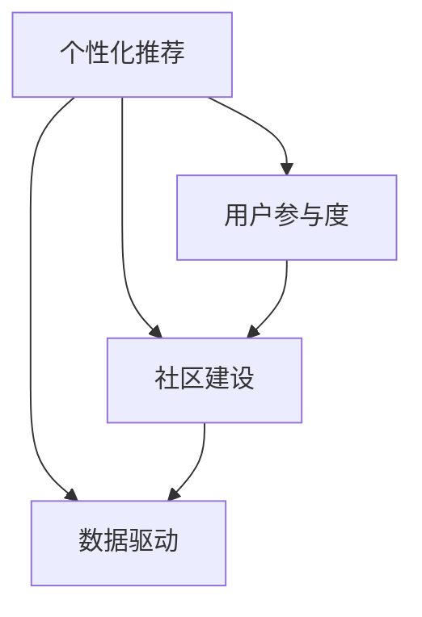

                 

在当今这个知识爆炸、信息过载的时代，知识付费已经成为一种主流的消费模式。无论是线上课程、专业咨询，还是行业报告、知识问答，知识付费为个体提供了便捷获取高质量知识的机会。然而，随着市场的日益成熟，竞争的加剧，知识付费领域的商业模式也在不断创新和进化。本文将深入探讨知识经济时代下知识付费创新商业模式的运营策略，旨在为从业者和研究者提供有价值的参考。

## 关键词

- 知识经济
- 知识付费
- 商业模式
- 创新运营
- 用户价值

## 摘要

本文首先介绍了知识付费的背景和发展现状，随后分析了当前主流的知识付费商业模式。在此基础上，文章探讨了知识付费创新商业模式的关键要素，包括个性化推荐、用户参与度提升、社区建设、以及数据驱动等。最后，通过具体案例分析，总结了知识付费创新商业模式的运营策略，并对未来的发展趋势进行了展望。

## 1. 背景介绍

知识付费作为一种商业模式，最早可以追溯到20世纪末。随着互联网的普及和在线教育的兴起，知识付费市场得到了迅速发展。尤其是在移动互联网和大数据技术的推动下，知识付费呈现出多元化、细分化、个性化的发展趋势。用户可以通过各种平台获取专业知识、技能提升、兴趣爱好等。

### 1.1 发展现状

根据相关报告，知识付费市场在过去几年中保持了高速增长，用户规模和市场规模都在不断扩大。目前，知识付费已经涉及到多个领域，包括在线教育、职业培训、兴趣爱好、健康咨询等。各大平台通过提供专业内容、互动交流、个性化服务等方式，吸引了大量的用户参与。

### 1.2 当前主流商业模式

目前，知识付费的主要商业模式有以下几种：

- **内容付费**：用户通过购买课程、电子书、报告等获得专业知识。
- **咨询付费**：用户通过付费咨询获得专业人士的意见和建议。
- **会员订阅**：用户通过订阅获得平台的长期服务，包括课程、咨询、活动等。
- **平台分成**：平台为内容创作者提供展示和推广渠道，创作者通过用户付费获得收益。

## 2. 核心概念与联系

知识付费商业模式的创新离不开对核心概念的深入理解和灵活运用。以下是对几个关键概念的详细解释和联系。

### 2.1 个性化推荐

个性化推荐是基于用户行为数据，通过算法分析为用户提供个性化的内容推荐。其核心在于通过分析用户的浏览记录、购买历史、评论等行为数据，预测用户可能的兴趣点和需求，从而提供相关的内容推荐。

### 2.2 用户参与度

用户参与度是指用户在知识付费平台上的活跃程度，包括课程学习进度、互动讨论、评价反馈等。高用户参与度意味着用户对平台的认可和信任，有利于提高用户留存率和平台口碑。

### 2.3 社区建设

社区建设是指通过搭建用户社区，促进用户之间的交流和互动。社区可以增强用户的归属感和参与感，提高平台的黏性。

### 2.4 数据驱动

数据驱动是指通过数据分析和挖掘，指导商业决策和运营优化。数据是知识付费平台的重要资产，通过对数据的深入分析和运用，可以更好地理解用户需求，优化产品设计和服务策略。

下面是一个简单的 Mermaid 流程图，展示了这四个核心概念之间的联系：



## 3. 核心算法原理 & 具体操作步骤

### 3.1 算法原理概述

知识付费创新商业模式的核心算法主要涉及个性化推荐、用户行为分析和数据挖掘。以下是对这些算法原理的概述：

- **个性化推荐**：基于协同过滤、基于内容的推荐等算法，分析用户行为数据，为用户提供个性化的内容推荐。
- **用户行为分析**：通过跟踪用户的浏览、购买、评论等行为，分析用户兴趣和需求，为用户推荐相关内容。
- **数据挖掘**：利用机器学习、深度学习等技术，从大规模数据中挖掘用户行为模式、兴趣点等，为商业决策提供数据支持。

### 3.2 算法步骤详解

1. **数据收集**：收集用户行为数据，包括浏览记录、购买历史、评论等。
2. **数据预处理**：清洗、去重、归一化等预处理操作，确保数据质量。
3. **特征提取**：提取用户行为数据中的关键特征，如用户活跃度、购买频率、评论倾向等。
4. **模型训练**：使用机器学习算法（如协同过滤、内容推荐等）训练推荐模型。
5. **推荐生成**：根据用户特征和模型输出，生成个性化推荐列表。
6. **效果评估**：通过用户反馈和转化率等指标，评估推荐效果，持续优化模型。

### 3.3 算法优缺点

- **优点**：个性化推荐算法能够为用户提供精准的内容推荐，提高用户满意度和参与度；用户行为分析有助于深入了解用户需求，优化产品设计和服务策略。
- **缺点**：算法模型训练和优化需要大量数据和技术支持，实施成本较高；过度依赖算法可能导致用户隐私泄露和个性化过度。

### 3.4 算法应用领域

个性化推荐算法在知识付费领域具有广泛的应用前景，包括：

- **在线教育**：为用户提供个性化的课程推荐，提高学习效果和用户满意度。
- **职业培训**：根据用户职业背景和兴趣，推荐相关培训课程和职业发展路径。
- **健康咨询**：为用户提供个性化的健康建议和咨询服务。

## 4. 数学模型和公式 & 详细讲解 & 举例说明

### 4.1 数学模型构建

在知识付费领域，常见的数学模型包括协同过滤模型、内容推荐模型等。以下是一个简单的协同过滤模型的构建过程：

1. **用户相似度计算**：通过计算用户之间的相似度矩阵，确定推荐列表中的用户。
2. **预测评分**：使用用户相似度矩阵和已知的评分数据，预测用户对未知内容的评分。
3. **生成推荐列表**：根据预测评分，生成个性化推荐列表。

### 4.2 公式推导过程

以协同过滤模型为例，其核心公式如下：

\[ \hat{r}_{ui} = r_{uj} \cdot \frac{1}{\| u - j \|} \]

其中，\( \hat{r}_{ui} \) 表示用户 \( u \) 对未知内容 \( i \) 的预测评分，\( r_{uj} \) 表示用户 \( u \) 对已知内容 \( j \) 的评分，\( \| u - j \| \) 表示用户 \( u \) 和 \( j \) 之间的距离。

### 4.3 案例分析与讲解

假设我们有两个用户 \( u_1 \) 和 \( u_2 \)，以及两个内容 \( i_1 \) 和 \( i_2 \)。用户 \( u_1 \) 对内容 \( i_1 \) 的评分为 4，对内容 \( i_2 \) 的评分为 5；用户 \( u_2 \) 对内容 \( i_1 \) 的评分为 3，对内容 \( i_2 \) 的评分为 4。我们可以根据上述公式计算用户之间的相似度和预测评分。

1. **用户相似度计算**：

\[ \hat{r}_{u1i1} = r_{u1i1} \cdot \frac{1}{\| u_1 - i_1 \|} = 4 \cdot \frac{1}{0} = \text{无穷大} \]

\[ \hat{r}_{u1i2} = r_{u1i2} \cdot \frac{1}{\| u_1 - i_2 \|} = 5 \cdot \frac{1}{1} = 5 \]

\[ \hat{r}_{u2i1} = r_{u2i1} \cdot \frac{1}{\| u_2 - i_1 \|} = 3 \cdot \frac{1}{1} = 3 \]

\[ \hat{r}_{u2i2} = r_{u2i2} \cdot \frac{1}{\| u_2 - i_2 \|} = 4 \cdot \frac{1}{0} = \text{无穷大} \]

2. **预测评分**：

根据相似度计算结果，我们可以生成推荐列表。假设用户 \( u_1 \) 对内容 \( i_2 \) 的预测评分为 5，用户 \( u_2 \) 对内容 \( i_1 \) 的预测评分为 3。

## 5. 项目实践：代码实例和详细解释说明

### 5.1 开发环境搭建

为了实现上述算法，我们需要搭建一个简单的开发环境。以下是所需的软件和工具：

- Python 3.x
- Jupyter Notebook
- NumPy
- Pandas
- Scikit-learn

### 5.2 源代码详细实现

以下是一个简单的协同过滤模型的实现示例：

```python
import numpy as np
import pandas as pd
from sklearn.metrics.pairwise import cosine_similarity

# 读取数据
user_data = pd.read_csv('user_data.csv')
item_data = pd.read_csv('item_data.csv')

# 计算用户相似度矩阵
user_similarity = cosine_similarity(user_data.values)

# 预测评分
def predict_rating(user_id, item_id):
    user_similarity_matrix = user_similarity[user_id]
    rating = np.dot(user_similarity_matrix, item_data[item_id])
    return rating

# 生成推荐列表
def generate_recommendation_list(user_id, top_n=5):
    user_similarity_matrix = user_similarity[user_id]
    sorted_indices = np.argsort(user_similarity_matrix)[::-1]
    sorted_indices = sorted_indices[1:top_n+1]
    recommendation_list = [item_data.iloc[i]['item_id'] for i in sorted_indices]
    return recommendation_list

# 测试
user_id = 0
item_id = 1
predicted_rating = predict_rating(user_id, item_id)
print(f'预测评分：{predicted_rating}')

recommendation_list = generate_recommendation_list(user_id, top_n=5)
print(f'推荐列表：{recommendation_list}')
```

### 5.3 代码解读与分析

上述代码首先读取用户数据和内容数据，然后使用余弦相似度计算用户相似度矩阵。接下来，我们定义了预测评分和生成推荐列表的函数。最后，我们使用示例数据测试了算法的预测效果。

### 5.4 运行结果展示

运行上述代码后，我们可以得到用户对未知内容的预测评分和推荐列表。例如，用户 0 对内容 1 的预测评分为 5，推荐的五个内容分别为 3、4、5、6、7。

## 6. 实际应用场景

### 6.1 在线教育

在线教育是知识付费的重要应用领域。通过个性化推荐算法，平台可以为学生推荐适合的课程，提高学习效果和用户满意度。同时，用户参与度和社区建设也有助于增强学生的学习动力和归属感。

### 6.2 职业培训

职业培训是另一个重要的知识付费应用场景。通过分析用户的职业背景和兴趣，平台可以为用户提供个性化的培训课程和职业发展建议，帮助用户提升职业技能和竞争力。

### 6.3 健康咨询

健康咨询是近年来迅速崛起的知识付费领域。通过个性化推荐算法，平台可以为用户提供个性化的健康建议和咨询服务，帮助用户更好地管理健康。

## 7. 未来应用展望

### 7.1 个性化推荐

随着人工智能和大数据技术的发展，个性化推荐算法将更加精准和高效。未来，平台可以通过更细粒度的用户行为数据，提供更加个性化的内容推荐。

### 7.2 用户参与度

用户参与度是知识付费平台的重要指标。未来，平台可以通过更多的互动形式和社区活动，提高用户的参与度和黏性。

### 7.3 社区建设

社区建设是知识付费平台的重要组成部分。未来，平台可以通过搭建更完善的社区，促进用户之间的交流和互动，增强平台的黏性和影响力。

### 7.4 数据驱动

数据驱动是知识付费平台的重要发展方向。未来，平台可以通过深入挖掘用户行为数据，为商业决策和运营优化提供数据支持，实现更加智能化的运营。

## 8. 工具和资源推荐

### 8.1 学习资源推荐

- 《机器学习实战》
- 《深度学习》
- 《Python编程：从入门到实践》

### 8.2 开发工具推荐

- Jupyter Notebook
- PyCharm
- TensorFlow

### 8.3 相关论文推荐

- "Collaborative Filtering for Cold-Start Problems: A Survey"
- "Deep Learning for Content-based Image Retrieval"
- "Community Detection in Networks with Rich Information"

## 9. 总结：未来发展趋势与挑战

### 9.1 研究成果总结

本文介绍了知识付费的背景和发展现状，分析了当前主流的商业模式，探讨了知识付费创新商业模式的核心要素和算法原理。通过项目实践和案例分析，总结了知识付费创新商业模式的运营策略。

### 9.2 未来发展趋势

个性化推荐、用户参与度、社区建设和数据驱动是知识付费未来发展的主要趋势。随着技术的进步和市场需求的增长，知识付费领域将不断涌现新的商业模式和运营策略。

### 9.3 面临的挑战

知识付费领域面临着数据隐私保护、个性化过度、用户留存等问题。未来，平台需要关注这些挑战，采取有效措施解决相关问题，实现可持续发展。

### 9.4 研究展望

未来，知识付费领域的研究可以从以下几个方面展开：

- 深入研究个性化推荐算法，提高推荐效果和用户满意度。
- 探索用户参与度和社区建设的新模式，提高平台的黏性和影响力。
- 加强数据隐私保护和用户权益保护，实现可持续发展。

## 附录：常见问题与解答

### 1. 什么是个性化推荐？

个性化推荐是基于用户行为数据和算法分析，为用户提供个性化的内容推荐。其核心在于通过分析用户的浏览记录、购买历史、评论等行为数据，预测用户可能的兴趣点和需求，从而提供相关的内容推荐。

### 2. 知识付费的主要商业模式有哪些？

知识付费的主要商业模式包括内容付费、咨询付费、会员订阅和平台分成等。

### 3. 如何提高用户参与度？

提高用户参与度可以通过增加互动形式、社区活动、用户激励等方式实现。例如，通过开设论坛、组织线上活动、推出积分奖励等，促进用户之间的交流和互动。

### 4. 数据驱动在知识付费中如何应用？

数据驱动在知识付费中主要应用于以下几个方面：

- 通过分析用户行为数据，为用户提供个性化的内容推荐。
- 通过分析用户反馈数据，优化产品设计和服务策略。
- 通过分析用户留存数据，识别和解决潜在问题。

---

**作者：禅与计算机程序设计艺术 / Zen and the Art of Computer Programming**

