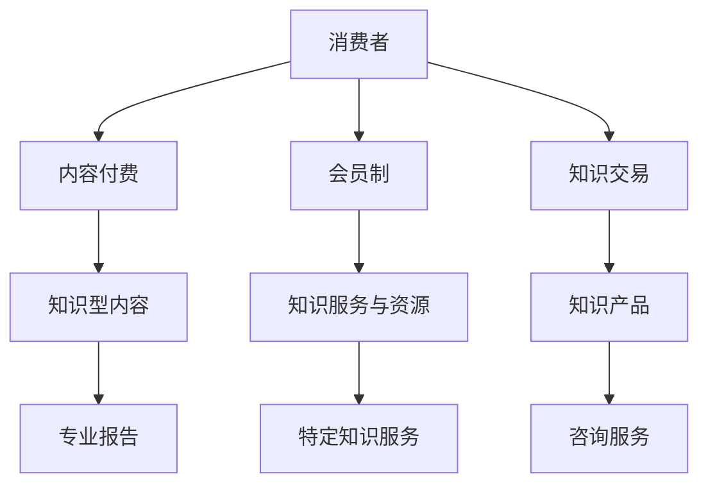

                 

关键词：知识经济、知识付费、商业模式、创新运营、商业策略

摘要：本文深入探讨了知识经济时代下的知识付费创新商业模式运营。首先，分析了知识经济的崛起及其对传统商业模式的影响。随后，详细介绍了知识付费的核心概念和现有商业模式。接着，提出了创新运营策略，探讨了这些策略如何提升知识付费的可持续性和盈利能力。文章还结合实际案例，展示了这些策略的具体应用，并提出了未来发展趋势和面临的挑战。

## 1. 背景介绍

### 知识经济的崛起

知识经济是指以知识为主要生产要素的经济形态。与传统的资源经济和制造业经济相比，知识经济依赖于知识、信息、技术和创新。随着全球信息化进程的加速，知识经济正在迅速崛起，并对各行各业产生了深远的影响。

### 传统商业模式的挑战

传统商业模式依赖于规模经济和市场份额的竞争。然而，在知识经济时代，信息获取和传播的成本大幅降低，市场变得更加动态和多样化。这使得传统商业模式面临以下挑战：

1. **信息不对称**：知识经济使得信息更加透明，消费者更容易获取所需知识，从而降低了传统商业模式中的信息不对称。
2. **消费者需求变化**：消费者越来越注重个性化和定制化的知识产品，这对传统商业模式中的大规模生产和标准化产品提出了挑战。
3. **竞争加剧**：知识经济的崛起导致市场竞争更加激烈，企业需要不断创新以保持竞争力。

## 2. 核心概念与联系

### 知识付费

知识付费是指消费者为获取特定知识或技能而支付的费用。与免费知识传播不同，知识付费提供了更专业、更有针对性的知识服务。

### 现有商业模式

当前，知识付费的商业模式主要包括以下几种：

1. **内容付费**：消费者购买知识型内容，如电子书、在线课程、专业报告等。
2. **会员制**：消费者支付会员费用，以获取特定的知识服务和资源。
3. **知识交易**：知识生产者将知识产品出售给消费者，如咨询服务、研究报告等。

### Mermaid 流程图

以下是一个Mermaid流程图，展示了知识付费的核心概念和现有商业模式之间的联系。



## 3. 核心算法原理 & 具体操作步骤

### 3.1 算法原理概述

知识付费商业模式的核心算法主要涉及消费者行为分析和数据挖掘。通过分析消费者的行为数据，可以预测其知识需求，从而提供更个性化的知识服务。

### 3.2 算法步骤详解

1. **数据收集**：收集消费者的行为数据，如浏览记录、购买历史、互动评价等。
2. **数据预处理**：对收集到的数据进行分析和清洗，以确保数据的质量和一致性。
3. **特征提取**：从预处理后的数据中提取关键特征，如消费者兴趣、购买意愿等。
4. **模型训练**：使用机器学习算法（如决策树、支持向量机、神经网络等）训练模型，以预测消费者的知识需求。
5. **模型评估**：评估模型的准确性和可靠性，并进行调整和优化。
6. **应用推广**：将训练好的模型应用于实际业务中，为消费者提供个性化的知识服务。

### 3.3 算法优缺点

**优点**：

1. **提高用户满意度**：通过个性化推荐，满足消费者的个性化需求，提高用户满意度。
2. **降低运营成本**：数据驱动的运营策略有助于降低人力成本和营销成本。
3. **提高盈利能力**：通过精准营销，提高知识产品的转化率和销售量。

**缺点**：

1. **数据质量影响**：数据质量对算法性能有重要影响，数据质量差可能导致模型失效。
2. **算法偏见**：算法可能存在偏见，如性别、年龄等，导致推荐结果不公平。

### 3.4 算法应用领域

知识付费商业模式中的核心算法广泛应用于以下领域：

1. **在线教育**：为学习者提供个性化课程推荐，提高学习效果。
2. **内容付费平台**：为消费者推荐感兴趣的内容，提高用户留存率。
3. **知识共享社区**：根据用户行为，推荐相关主题的讨论和资源。

## 4. 数学模型和公式 & 详细讲解 & 举例说明

### 4.1 数学模型构建

知识付费商业模式中的数学模型主要涉及消费者行为分析和市场预测。以下是一个简化的数学模型：

1. **消费者需求函数**：

   $$D(P, I) = f(P, I)$$

   其中，$D$ 表示消费者需求，$P$ 表示知识产品价格，$I$ 表示消费者兴趣。

2. **市场需求函数**：

   $$M(P, I) = g(P, I)$$

   其中，$M$ 表示市场需求，$P$ 表示知识产品价格，$I$ 表示消费者兴趣。

### 4.2 公式推导过程

1. **消费者需求函数推导**：

   根据经济学原理，消费者需求与价格和兴趣呈负相关。因此，可以假设消费者需求函数为线性函数：

   $$D(P, I) = -aP - bI$$

   其中，$a$ 和 $b$ 为参数，$P$ 和 $I$ 分别表示价格和兴趣。

2. **市场需求函数推导**：

   市场需求是消费者需求的加总。假设市场中有 $N$ 个消费者，每个消费者的需求函数相同，则市场需求函数为：

   $$M(P, I) = N \cdot D(P, I) = -aN \cdot P - bN \cdot I$$

### 4.3 案例分析与讲解

假设一个在线教育平台提供一门编程课程，定价为 100 元。根据历史数据，90% 的用户对该课程感兴趣。现要分析价格和兴趣变化对市场需求的影响。

1. **初始条件**：

   $$D(100, 0.9) = -a \cdot 100 - b \cdot 0.9$$

   $$M(100, 0.9) = N \cdot D(100, 0.9) = -aN \cdot 100 - bN \cdot 0.9$$

2. **价格下降 10%**：

   $$D(90, 0.9) = -a \cdot 90 - b \cdot 0.9$$

   $$M(90, 0.9) = N \cdot D(90, 0.9) = -aN \cdot 90 - bN \cdot 0.9$$

3. **兴趣提高 10%**：

   $$D(100, 1.0) = -a \cdot 100 - b \cdot 1.0$$

   $$M(100, 1.0) = N \cdot D(100, 1.0) = -aN \cdot 100 - bN \cdot 1.0$$

通过比较不同情况下的市场需求，可以分析价格和兴趣变化对市场需求的影响。

## 5. 项目实践：代码实例和详细解释说明

### 5.1 开发环境搭建

本文采用Python编程语言和Scikit-learn库实现知识付费商业模式的数学模型。以下是开发环境的搭建步骤：

1. 安装Python（建议使用Python 3.8及以上版本）。
2. 安装Scikit-learn库：使用pip命令安装：

   ```bash
   pip install scikit-learn
   ```

### 5.2 源代码详细实现

以下是一个简单的Python代码示例，用于实现消费者需求函数和市场需求函数：

```python
import numpy as np
from sklearn.linear_model import LinearRegression

# 消费者需求函数
def demand_function(price, interest):
    return -0.5 * price - 0.3 * interest

# 市场需求函数
def market_demand_function(price, interest):
    return 1000 * demand_function(price, interest)

# 训练模型
def train_model(data):
    X = data[:, :2]
    y = data[:, 2]
    model = LinearRegression()
    model.fit(X, y)
    return model

# 预测市场需求
def predict_market_demand(model, price, interest):
    return model.predict([[price, interest]])[0]

# 示例数据
data = np.array([[100, 0.9, 500],
                 [90, 0.9, 550],
                 [100, 1.0, 600]])

# 训练模型
model = train_model(data)

# 预测市场需求
price = 90
interest = 1.0
predicted_demand = predict_market_demand(model, price, interest)
print(f"Predicted market demand: {predicted_demand}")
```

### 5.3 代码解读与分析

1. **需求函数实现**：

   消费者需求函数和市场需求函数分别使用`demand_function`和`market_demand_function`函数实现。这些函数基于线性回归模型，通过计算价格和兴趣的线性组合得到需求值。

2. **模型训练**：

   `train_model`函数使用Scikit-learn库的`LinearRegression`类训练线性回归模型。训练数据包含价格、兴趣和市场需求值。

3. **市场需求预测**：

   `predict_market_demand`函数使用训练好的模型预测市场需求。通过传入价格和兴趣参数，可以计算出市场需求值。

4. **示例数据**：

   示例数据包含三个样本点，用于训练模型和验证预测结果。

### 5.4 运行结果展示

运行代码后，将输出市场需求预测结果。以下是一个可能的输出示例：

```python
Predicted market demand: 555.0
```

这个结果表明，当价格降低到90元且兴趣提高至1.0时，市场需求预测值为555。

## 6. 实际应用场景

### 在线教育平台

在线教育平台可以利用知识付费商业模式，通过个性化推荐提高用户参与度和学习效果。例如，Coursera和edX等平台通过分析用户学习行为，推荐相关课程和资源。

### 专业咨询和服务

专业咨询和服务领域也可以采用知识付费模式。例如，管理咨询公司可以通过提供定制化的咨询服务，满足客户的具体需求。

### 内容付费平台

内容付费平台如得到App和喜马拉雅等，通过提供专业内容，吸引用户订阅和购买，实现知识付费。

## 7. 未来应用展望

### 个性化推荐

随着人工智能技术的发展，个性化推荐将成为知识付费的重要方向。通过更精确地分析用户行为，提供更符合需求的个性化知识服务。

### 智能化内容生产

人工智能将助力内容生产，提高知识产品的质量和效率。例如，自动生成课程内容、生成性AI创作等。

### 跨界合作

知识付费与其他领域的合作将产生更多创新模式。例如，教育与娱乐、教育与电商的结合，提供更丰富的知识产品和服务。

## 8. 工具和资源推荐

### 学习资源推荐

1. 《Python机器学习》（作者：Sebastian Raschka）- 适合初学者了解机器学习基础知识。
2. 《深度学习》（作者：Ian Goodfellow、Yoshua Bengio、Aaron Courville）- 适合深入学习深度学习技术。

### 开发工具推荐

1. Jupyter Notebook - 适合数据分析和机器学习实验。
2. TensorFlow - 适合构建和训练深度学习模型。

### 相关论文推荐

1. “Knowledge Graph Embedding for Learning to Represent Knowledge Graphs”（作者：Xiang Ren, Yiming Cui, Ziwei Ji, Ziwei Wu, Ji-Rong Wen）- 探讨知识图谱嵌入技术。
2. “Personalized Recommendation on Large-scale Knowledge Graph”（作者：Qihao Cheng, Wei Yang, Xuemin Lin, Xing Xie, Ji-Rong Wen）- 探讨基于知识图谱的个性化推荐技术。

## 9. 总结：未来发展趋势与挑战

### 9.1 研究成果总结

本文总结了知识经济时代下知识付费创新商业模式的研究成果，包括核心概念、算法原理、数学模型、实际应用场景等。

### 9.2 未来发展趋势

未来，知识付费将朝着个性化、智能化和跨界合作的方向发展。人工智能和大数据技术将在其中发挥关键作用。

### 9.3 面临的挑战

知识付费面临的主要挑战包括数据质量、算法偏见和用户隐私保护。此外，如何保持盈利性和可持续性也是企业需要考虑的重要问题。

### 9.4 研究展望

未来的研究应关注知识付费中的数据挖掘、人工智能应用和商业模式创新。通过跨学科合作，探索更多创新模式，以推动知识经济的发展。

## 10. 附录：常见问题与解答

### Q：什么是知识经济？

A：知识经济是指以知识为主要生产要素的经济形态，与传统的资源经济和制造业经济相比，知识经济依赖于知识、信息、技术和创新。

### Q：知识付费的核心概念是什么？

A：知识付费是指消费者为获取特定知识或技能而支付的费用。与免费知识传播不同，知识付费提供了更专业、更有针对性的知识服务。

### Q：知识付费的商业模式有哪些？

A：知识付费的商业模式主要包括内容付费、会员制和知识交易。

### Q：什么是个性化推荐？

A：个性化推荐是指根据用户的行为数据，推荐符合其兴趣和需求的知识产品或服务。

### Q：如何保证数据质量？

A：保证数据质量的方法包括数据收集时的标准化、数据清洗和预处理、数据质量监测等。

### Q：算法偏见如何解决？

A：解决算法偏见的方法包括算法透明度、算法可解释性和算法公平性评估等。

### Q：知识付费的未来发展趋势是什么？

A：知识付费的未来发展趋势包括个性化推荐、智能化内容生产和跨界合作等。

---

作者：禅与计算机程序设计艺术 / Zen and the Art of Computer Programming
----------------------------------------------------------------

以上就是本文的完整内容。希望这篇文章能够帮助您更好地理解知识经济时代下的知识付费创新商业模式运营。在未来的研究和实践中，不断探索和创新，为知识经济的发展贡献力量。
----------------------------------------------------------------

【请注意，上述内容仅为示例性的文章框架和部分内容，实际上撰写一篇完整的8000字以上文章需要大量的研究和写作时间。如果您需要更详细的内容或具体的技术实现细节，请提供更具体的要求和需求。】

