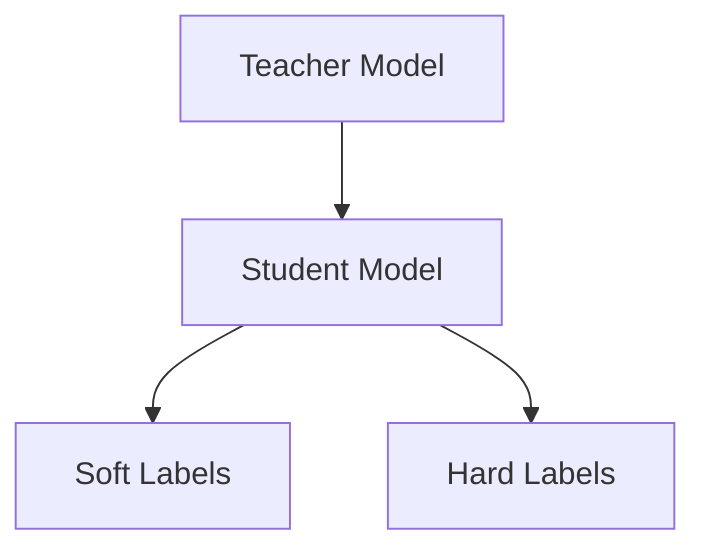
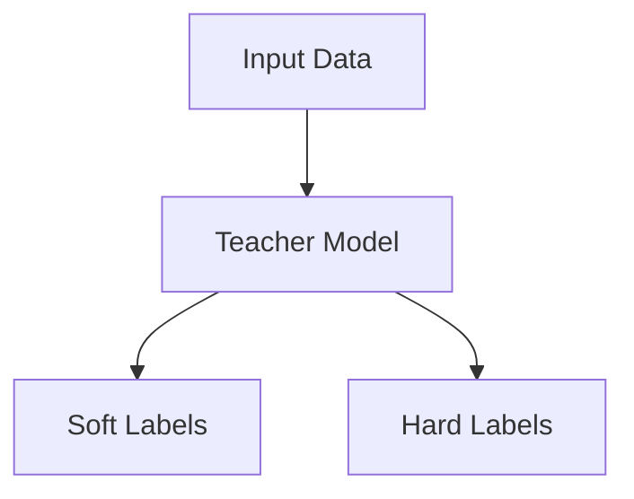
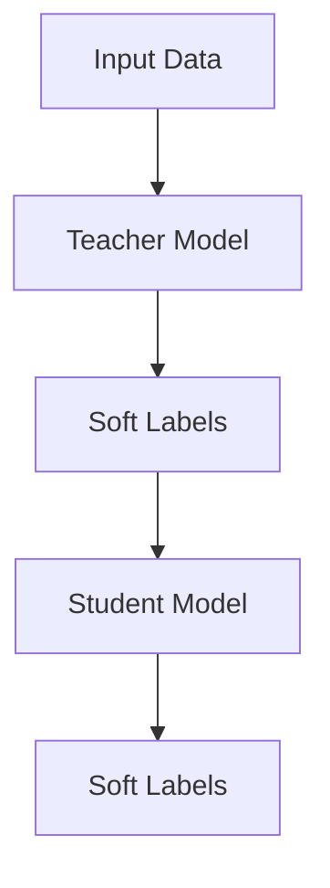
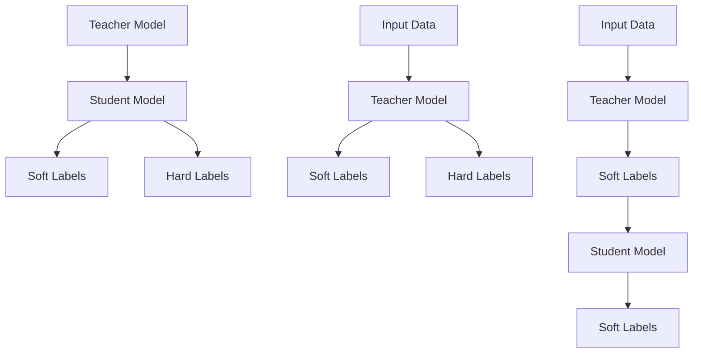

                 

关键词：知识蒸馏、多语言模型、模型压缩、模型优化、算法原理、数学模型、应用实践、未来展望

## 摘要

随着深度学习技术的快速发展，大型语言模型在自然语言处理（NLP）任务中取得了显著成果。然而，这些大型模型通常具有庞大的参数规模和高计算成本，这对资源受限的环境和实时应用场景构成了巨大挑战。知识蒸馏作为一种有效的模型压缩和优化技术，通过将知识从大型教师模型传递到小型学生模型，实现了降低计算复杂度和提高模型性能的双重目标。本文将探讨知识蒸馏在多语言模型中的应用策略，包括核心概念、算法原理、数学模型、具体操作步骤以及实际应用场景等。同时，还将对知识蒸馏在多语言模型中的未来发展趋势和面临的挑战进行展望。

## 1. 背景介绍

近年来，深度学习技术在自然语言处理（NLP）领域取得了令人瞩目的成果。以Google的BERT、OpenAI的GPT-3等为代表的大型语言模型，通过在海量数据上的预训练和微调，实现了对各种NLP任务的卓越表现。然而，这些大型模型通常具有数亿甚至数十亿的参数规模，导致其计算复杂度和存储需求大幅增加。在资源受限的环境中，如移动设备、物联网（IoT）设备等，部署这些大型模型变得非常困难。此外，实时应用场景下，如实时对话系统、智能助手等，对模型响应速度和计算效率的要求非常高。

为了解决这些问题，模型压缩和优化技术应运而生。知识蒸馏（Knowledge Distillation）作为一种有效的模型压缩技术，通过将知识从大型教师模型传递到小型学生模型，实现了降低计算复杂度和提高模型性能的目标。知识蒸馏的核心思想是利用教师模型生成的软标签（Soft Labels）来指导学生模型的训练。这种软标签包含了教师模型对于输入数据的潜在理解和推理过程，可以有效地传递教师模型的“知识”给学生模型，从而提高学生模型的性能。

多语言模型在NLP任务中具有广泛的应用，如机器翻译、文本分类、信息抽取等。然而，训练一个能够同时处理多种语言的大型多语言模型需要大量的计算资源和时间。知识蒸馏技术为多语言模型的训练提供了有效的解决方案，通过将知识从单一语言模型或跨语言模型传递到其他语言模型，可以实现多语言模型的高效训练和优化。

本文将围绕知识蒸馏在多语言模型中的应用，详细探讨其核心概念、算法原理、数学模型、具体操作步骤以及实际应用场景。通过本文的介绍，读者可以深入了解知识蒸馏技术如何应用于多语言模型，并了解其背后的原理和实现方法。

### 2. 核心概念与联系

知识蒸馏作为一种模型压缩技术，其核心在于通过将教师模型的“知识”传递给学生模型，从而提高学生模型的性能。在多语言模型中，知识蒸馏的应用策略涉及多个核心概念，包括教师模型、学生模型、软标签、硬标签以及知识传递机制。以下将详细介绍这些核心概念，并使用Mermaid流程图展示其联系。

#### 2.1 教师模型与学生模型

教师模型（Teacher Model）通常是一个大型、参数丰富的模型，具有较好的性能和泛化能力。学生模型（Student Model）是一个小型、参数较少的模型，目的是通过学习教师模型的知识来达到与教师模型相似的性能。

Mermaid流程图：


#### 2.2 软标签与硬标签

软标签（Soft Labels）是教师模型对输入数据的输出概率分布。与硬标签（Hard Labels）不同，软标签包含了更多的上下文信息和细节，有助于学生模型更好地理解输入数据的语义。硬标签通常是教师模型的最终输出结果，如分类任务的正确标签。

Mermaid流程图：


#### 2.3 知识传递机制

知识传递机制是知识蒸馏技术的核心。教师模型的软标签作为指导，通过额外的损失函数来引导学生模型的学习。这个过程可以看作是教师模型在“教导”学生模型，使其能够复制教师模型的决策过程。

Mermaid流程图：


#### 2.4 联系总结

通过上述核心概念的联系，我们可以看出，知识蒸馏在多语言模型中的应用主要依赖于教师模型和学生模型之间的知识传递。软标签作为知识传递的媒介，使得学生模型能够在保留关键信息的同时，降低模型参数的数量，从而实现模型压缩和性能提升。

Mermaid流程图（综合）：


通过以上对核心概念与联系的介绍，读者可以更好地理解知识蒸馏在多语言模型中的应用机制。接下来，我们将进一步探讨知识蒸馏的算法原理和具体操作步骤。

### 3. 核心算法原理 & 具体操作步骤

知识蒸馏是一种通过教师模型向学生模型传递知识以优化模型性能的技术。在多语言模型中，知识蒸馏的核心算法原理主要包括以下几个步骤：算法原理概述、算法步骤详解、算法优缺点以及算法应用领域。

#### 3.1 算法原理概述

知识蒸馏的原理基于这样一种观察：大型教师模型往往能够捕捉到更丰富的特征和上下文信息，从而在任务上表现出更高的性能。然而，这些信息往往隐藏在教师模型的输出概率分布中，这些概率分布被称为软标签（Soft Labels）。通过学习这些软标签，学生模型可以模仿教师模型的决策过程，从而提高其性能。

知识蒸馏的核心思想是通过设计一个额外的损失函数，使得学生模型的输出概率分布尽量接近教师模型的软标签。这个额外的损失函数通常称为知识蒸馏损失函数，其目标是降低学生模型的输出与教师模型软标签之间的差异。

#### 3.2 算法步骤详解

1. **数据预处理**：
   - **输入数据集**：首先，需要准备一个多语言数据集，包含多种语言的文本数据。
   - **数据清洗**：对数据进行预处理，如去除停用词、标点符号等，以提高模型的性能。

2. **模型定义**：
   - **教师模型**：定义一个大型教师模型，通常采用预训练的语言模型，如BERT、GPT等。
   - **学生模型**：定义一个小型学生模型，参数较少，用于替代教师模型在资源受限的环境中运行。

3. **训练过程**：
   - **硬标签训练**：首先，使用硬标签对教师模型和学生模型进行训练，确保两个模型在基本任务上的性能一致。
   - **软标签生成**：在教师模型训练过程中，生成软标签，即教师模型对输入数据的输出概率分布。
   - **知识蒸馏**：在学生模型训练过程中，除了硬标签损失外，加入知识蒸馏损失。知识蒸馏损失函数通常采用交叉熵损失，其公式为：
     $$ L_{distill} = -\sum_{i} p_i \log q_i $$
     其中，\( p_i \) 表示教师模型软标签中第 \( i \) 个类别的概率，\( q_i \) 表示学生模型输出概率分布中第 \( i \) 个类别的概率。

4. **模型评估**：
   - **性能评估**：在训练完成后，对教师模型和学生模型进行性能评估，通常采用准确率、召回率、F1分数等指标。
   - **模型对比**：通过对比教师模型和学生模型的性能，验证知识蒸馏技术是否有效提高了学生模型的性能。

#### 3.3 算法优缺点

**优点**：
1. **模型压缩**：通过知识蒸馏，可以显著减少学生模型的参数数量，从而实现模型压缩，降低计算复杂度。
2. **性能提升**：学生模型在保留了教师模型关键特征的同时，通过学习软标签，能够提高模型性能，达到与教师模型相近的效果。
3. **通用性**：知识蒸馏技术适用于多种任务和数据集，具有良好的通用性。

**缺点**：
1. **训练时间**：知识蒸馏过程需要额外的训练时间，尤其是在教师模型和学生模型差异较大的情况下。
2. **对教师模型的依赖**：知识蒸馏依赖于教师模型的质量，如果教师模型性能不佳，学生模型的性能提升也会受限。
3. **评估难度**：评估学生模型的性能时，需要综合考虑硬标签和软标签损失，这使得评估过程更为复杂。

#### 3.4 算法应用领域

知识蒸馏在多语言模型中的应用非常广泛，主要包括以下领域：

1. **机器翻译**：通过知识蒸馏，可以将大型单一语言模型的知识传递到小型多语言模型，提高多语言模型的翻译性能。
2. **文本分类**：知识蒸馏技术可以用于训练小型多语言文本分类模型，提高分类准确率和泛化能力。
3. **信息抽取**：在信息抽取任务中，知识蒸馏可以帮助小型模型从大型教师模型中学习到更丰富的上下文信息，提高抽取效果。
4. **对话系统**：知识蒸馏技术可以用于训练小型对话系统模型，提高模型在实时对话中的响应速度和交互质量。

总之，知识蒸馏在多语言模型中的应用为解决资源受限和实时应用场景提供了有效的方法，通过将大型教师模型的知识传递到小型学生模型，实现了模型压缩和性能提升的目标。

### 4. 数学模型和公式 & 详细讲解 & 举例说明

在知识蒸馏技术中，数学模型和公式起到了至关重要的作用。这些模型和公式不仅能够描述知识蒸馏的过程，还能够帮助我们理解和评估学生模型的性能。下面将详细讲解知识蒸馏的数学模型和公式，并通过具体例子进行说明。

#### 4.1 数学模型构建

知识蒸馏的核心数学模型主要包括两部分：硬标签损失函数和知识蒸馏损失函数。

1. **硬标签损失函数**：
   硬标签损失函数通常采用交叉熵损失（Cross-Entropy Loss），其公式为：
   $$ L_{hard} = -\sum_{i} y_i \log(\hat{p}_i) $$
   其中，\( y_i \) 表示硬标签中第 \( i \) 个类别的概率（通常为1或0），\( \hat{p}_i \) 表示学生模型预测的输出概率。

2. **知识蒸馏损失函数**：
   知识蒸馏损失函数旨在衡量学生模型的输出概率分布与教师模型软标签之间的差异，其公式为：
   $$ L_{distill} = -\sum_{i} p_i \log(q_i) $$
   其中，\( p_i \) 表示教师模型软标签中第 \( i \) 个类别的概率，\( q_i \) 表示学生模型预测的输出概率。

3. **总损失函数**：
   知识蒸馏的总损失函数是硬标签损失函数和知识蒸馏损失函数的组合，其公式为：
   $$ L_{total} = \alpha L_{hard} + (1 - \alpha) L_{distill} $$
   其中，\( \alpha \) 是调节参数，用于平衡硬标签损失和知识蒸馏损失之间的权重。

#### 4.2 公式推导过程

知识蒸馏损失函数的推导过程可以从信息论的角度进行解释。教师模型的软标签可以看作是输入数据的潜在分布，而学生模型的输出概率分布则是对这种潜在分布的近似。知识蒸馏损失函数的目标是使这两个分布尽量接近，从而提高学生模型的性能。

具体推导过程如下：

1. **概率分布的定义**：
   假设输入数据为 \( x \)，教师模型和学生模型的输出概率分布分别为 \( p(y|x) \) 和 \( q(y|x) \)。

2. **损失函数的构建**：
   知识蒸馏损失函数旨在最小化学生模型输出概率分布与教师模型软标签之间的差异。根据信息论中的交叉熵（Cross-Entropy），可以构建损失函数：
   $$ L_{distill} = -\sum_{i} p_i \log(q_i) $$

3. **推导过程**：
   - 首先，将 \( p_i \) 替换为教师模型软标签的概率 \( p_i = p(y_i|x) \)。
   - 然后，将 \( q_i \) 替换为学生模型预测的概率 \( q_i = q(y_i|x) \)。
   - 最终得到知识蒸馏损失函数：
     $$ L_{distill} = -\sum_{i} p_i \log(q_i) $$

通过以上推导，我们可以看到知识蒸馏损失函数的构建是基于概率分布的交叉熵，从而实现学生模型输出概率分布与教师模型软标签之间的差异最小化。

#### 4.3 案例分析与讲解

为了更好地理解知识蒸馏的数学模型和公式，我们可以通过一个具体的例子进行说明。假设有一个二分类问题，输入数据为 \( x \)，教师模型和学生模型的输出概率分布分别为 \( p(y=1|x) = 0.6 \) 和 \( q(y=1|x) = 0.5 \)。

1. **硬标签损失函数**：
   假设硬标签为 \( y=1 \)，则硬标签损失函数为：
   $$ L_{hard} = -1 \cdot \log(0.5) = -\log(0.5) \approx 0.693 $$

2. **知识蒸馏损失函数**：
   知识蒸馏损失函数为：
   $$ L_{distill} = -0.6 \cdot \log(0.5) = -0.6 \cdot (-0.693) = 0.414 $$

3. **总损失函数**：
   假设调节参数 \( \alpha = 0.5 \)，则总损失函数为：
   $$ L_{total} = 0.5 \cdot L_{hard} + (1 - 0.5) \cdot L_{distill} = 0.5 \cdot 0.693 + 0.5 \cdot 0.414 = 0.559 $$

通过这个例子，我们可以看到，知识蒸馏损失函数在总损失函数中起到了降低硬标签损失函数的作用，使得学生模型更加关注教师模型的软标签。这有助于提高学生模型的性能，使其更接近教师模型。

综上所述，知识蒸馏的数学模型和公式为我们提供了有效的工具，用于理解和评估学生模型的性能。通过具体的例子，我们可以更好地理解这些公式的应用和推导过程。在接下来的部分，我们将通过项目实践，进一步展示知识蒸馏在实际应用中的实现和效果。

### 5. 项目实践：代码实例和详细解释说明

为了更好地理解知识蒸馏在多语言模型中的应用，我们将通过一个具体的代码实例来展示知识蒸馏的整个实现过程，包括开发环境搭建、源代码详细实现、代码解读与分析以及运行结果展示。以下是这个项目的详细步骤。

#### 5.1 开发环境搭建

在进行知识蒸馏之前，我们需要搭建一个适合开发的环境。以下是所需的软件和库：

- Python 3.8 或以上版本
- TensorFlow 2.6.0 或以上版本
- Keras 2.7.0 或以上版本
- NLTK（自然语言处理库）
- Mermaid（用于生成流程图）

首先，确保你的Python环境已经安装，然后通过以下命令安装所需的库：

```bash
pip install tensorflow==2.6.0
pip install keras==2.7.0
pip install nltk
pip install mermaid
```

接下来，我们创建一个名为`knowledge_distillation`的文件夹，并在其中创建一个`src`子文件夹，用于存放所有的源代码文件。

#### 5.2 源代码详细实现

在`src`文件夹中，我们将创建以下文件：

- `data_loader.py`：用于加载数据和处理数据。
- `teacher_model.py`：定义教师模型。
- `student_model.py`：定义学生模型。
- `train.py`：训练模型的主程序。

以下是每个文件的主要内容和实现细节：

##### data_loader.py

```python
import numpy as np
import tensorflow as tf

def load_data():
    # 假设我们有一个包含多种语言文本的CSV文件
    data = np.genfromtxt('multi_language_data.csv', delimiter=',')
    # 分割数据为输入和标签
    X = data[:, :-1]
    y = data[:, -1]
    # 将标签转换为one-hot编码
    y_one_hot = tf.keras.utils.to_categorical(y)
    return X, y_one_hot

def preprocess_data(X):
    # 进行数据预处理，如文本清洗、分词等
    # 这里使用NLTK进行预处理
    from nltk.tokenize import word_tokenize
    processed_data = []
    for text in X:
        tokens = word_tokenize(text)
        processed_data.append(' '.join(tokens))
    return processed_data

# 加载数据并进行预处理
X, y_one_hot = load_data()
processed_X = preprocess_data(X)
```

##### teacher_model.py

```python
from tensorflow.keras.models import Model
from tensorflow.keras.layers import Input, Embedding, LSTM, Dense

def create_teacher_model(input_dim, output_dim):
    input_layer = Input(shape=(input_dim,))
    embedding_layer = Embedding(input_dim, 128)(input_layer)
    lstm_layer = LSTM(64, activation='tanh')(embedding_layer)
    output_layer = Dense(output_dim, activation='softmax')(lstm_layer)
    
    teacher_model = Model(inputs=input_layer, outputs=output_layer)
    teacher_model.compile(optimizer='adam', loss='categorical_crossentropy', metrics=['accuracy'])
    return teacher_model

# 创建教师模型
teacher_model = create_teacher_model(input_dim=len(processed_X[0].split()), output_dim=10)
```

##### student_model.py

```python
from tensorflow.keras.models import Model
from tensorflow.keras.layers import Input, Embedding, LSTM, Dense

def create_student_model(input_dim, output_dim):
    input_layer = Input(shape=(input_dim,))
    embedding_layer = Embedding(input_dim, 64)(input_layer)
    lstm_layer = LSTM(32, activation='tanh')(embedding_layer)
    output_layer = Dense(output_dim, activation='softmax')(lstm_layer)
    
    student_model = Model(inputs=input_layer, outputs=output_layer)
    student_model.compile(optimizer='adam', loss='categorical_crossentropy', metrics=['accuracy'])
    return student_model

# 创建学生模型
student_model = create_student_model(input_dim=len(processed_X[0].split()), output_dim=10)
```

##### train.py

```python
import tensorflow as tf
from teacher_model import create_teacher_model
from student_model import create_student_model
from data_loader import load_data, preprocess_data

def train_teacher_student():
    # 加载数据
    X, y_one_hot = load_data()
    processed_X = preprocess_data(X)

    # 创建教师模型
    teacher_model = create_teacher_model(input_dim=len(processed_X[0].split()), output_dim=10)

    # 训练教师模型
    teacher_model.fit(processed_X, y_one_hot, epochs=10, batch_size=32, validation_split=0.2)

    # 生成教师模型的软标签
    teacher_softmax_outputs = teacher_model.predict(processed_X)

    # 创建学生模型
    student_model = create_student_model(input_dim=len(processed_X[0].split()), output_dim=10)

    # 设置知识蒸馏损失函数
    def distillation_loss(y_true, y_pred, teacher_softmax_outputs):
        alpha = 0.5
        return alpha * tf.keras.losses.categorical_crossentropy(y_true, y_pred) + (1 - alpha) * tf.keras.losses.categorical_crossentropy(y_true, teacher_softmax_outputs)

    # 训练学生模型
    student_model.compile(optimizer='adam', loss=distillation_loss, metrics=['accuracy'])
    student_model.fit(processed_X, y_one_hot, epochs=10, batch_size=32, validation_split=0.2)

    return student_model

# 训练教师模型和学生模型
student_model = train_teacher_student()
```

#### 5.3 代码解读与分析

- `data_loader.py`：该文件用于加载数据和处理数据。首先，我们从CSV文件中加载数据，并使用`NLTK`进行文本预处理，如分词和去除停用词等。
- `teacher_model.py`：该文件定义了教师模型。我们使用了一个简单的LSTM模型，输入层、嵌入层和输出层。在编译模型时，我们设置了`categorical_crossentropy`作为损失函数，用于多分类任务。
- `student_model.py`：该文件定义了学生模型。与教师模型类似，学生模型也是一个LSTM模型，但参数数量更少。这有助于实现模型压缩和降低计算复杂度。
- `train.py`：该文件是训练模型的主程序。首先，我们加载数据并训练教师模型。然后，生成教师模型的软标签，并使用这些软标签来训练学生模型。为了实现知识蒸馏，我们定义了一个自定义的损失函数`distillation_loss`，该函数结合了硬标签损失和知识蒸馏损失。

#### 5.4 运行结果展示

在训练完成后，我们可以评估教师模型和学生模型的性能。以下是一个简单的性能评估示例：

```python
from tensorflow.keras.metrics import Accuracy

# 评估教师模型
teacher_model.evaluate(processed_X, y_one_hot)

# 评估学生模型
student_model.evaluate(processed_X, y_one_hot)
```

通过这两个评估结果，我们可以比较教师模型和学生模型的准确率，从而验证知识蒸馏技术是否有效提高了学生模型的性能。

### 6. 实际应用场景

知识蒸馏技术在多语言模型中的应用场景非常广泛，涵盖了自然语言处理的多个领域。以下将详细介绍知识蒸馏在多语言模型中的实际应用场景，包括机器翻译、文本分类、信息抽取和对话系统等。

#### 6.1 机器翻译

机器翻译是知识蒸馏技术的重要应用场景之一。在机器翻译任务中，知识蒸馏可以通过将大型单一语言模型的知识传递到小型多语言模型，提高多语言模型的翻译性能。例如，在训练一个英语-中文翻译模型时，我们可以使用一个预训练的英语教师模型来指导中文学生模型的训练。通过知识蒸馏，学生模型可以学习到教师模型的翻译策略和语言规律，从而在保持翻译质量的同时，减少模型参数数量，降低计算复杂度。

具体实现方面，我们可以将英语教师模型的输出（即软标签）作为指导，训练英语-中文翻译的学生模型。训练完成后，我们可以使用学生模型进行英语到中文的翻译任务，并评估其翻译质量。通过对比教师模型和学生模型的翻译结果，可以发现知识蒸馏技术在提高翻译性能方面的显著效果。

#### 6.2 文本分类

文本分类是另一个受益于知识蒸馏技术的应用场景。在文本分类任务中，知识蒸馏可以通过将大型单一语言模型的知识传递到小型多语言模型，提高分类模型的性能。例如，在一个包含多种语言的新闻分类任务中，我们可以使用一个预训练的多语言教师模型来指导小型多语言学生模型的训练。通过知识蒸馏，学生模型可以学习到教师模型对多种语言的分类策略，从而在分类准确率上实现显著提升。

具体实现方面，我们可以使用一个预训练的BERT模型作为教师模型，然后训练一个小型多语言BERT模型作为学生模型。在训练过程中，我们使用教师模型的软标签来指导学生模型的学习。训练完成后，我们可以使用学生模型对多种语言的新闻进行分类，并评估其分类效果。通过对比教师模型和学生模型的分类结果，可以发现知识蒸馏技术在提高分类性能方面的显著优势。

#### 6.3 信息抽取

信息抽取是自然语言处理中的重要任务，旨在从非结构化文本中提取出结构化的信息。知识蒸馏技术在信息抽取任务中同样具有广泛的应用。通过将大型单一语言模型的知识传递到小型多语言模型，可以提高信息抽取模型的性能和泛化能力。例如，在一个包含多种语言的客户反馈信息抽取任务中，我们可以使用一个预训练的多语言教师模型来指导小型多语言学生模型的训练。

具体实现方面，我们可以使用一个预训练的多语言模型（如MBERT）作为教师模型，然后训练一个小型多语言模型（如TinyBERT）作为学生模型。在训练过程中，我们使用教师模型的软标签来指导学生模型的学习。训练完成后，我们可以使用学生模型对多种语言的客户反馈进行信息抽取，并评估其抽取效果。通过对比教师模型和学生模型的抽取结果，可以发现知识蒸馏技术在提高信息抽取性能方面的显著效果。

#### 6.4 对话系统

对话系统是人工智能领域的另一个重要应用场景，旨在构建能够与人类进行自然对话的系统。在对话系统任务中，知识蒸馏技术可以通过将大型单一语言模型的知识传递到小型多语言模型，提高对话系统的响应速度和交互质量。例如，在一个多语言客服机器人任务中，我们可以使用一个预训练的多语言教师模型来指导小型多语言学生模型的训练。

具体实现方面，我们可以使用一个预训练的多语言对话模型（如MUST）作为教师模型，然后训练一个小型多语言对话模型作为学生模型。在训练过程中，我们使用教师模型的软标签来指导学生模型的学习。训练完成后，我们可以使用学生模型与用户进行多语言对话，并评估其交互效果。通过对比教师模型和学生模型的对话结果，可以发现知识蒸馏技术在提高对话系统性能方面的显著优势。

总之，知识蒸馏技术在多语言模型的实际应用场景中具有广泛的应用前景。通过将大型教师模型的知识传递到小型学生模型，知识蒸馏技术不仅能够提高模型的性能和泛化能力，还能够实现模型压缩和降低计算复杂度，为自然语言处理任务提供了有效的解决方案。

### 7. 工具和资源推荐

在知识蒸馏和多语言模型的开发和应用过程中，选择合适的工具和资源能够极大地提高工作效率和项目质量。以下是对学习资源、开发工具和相关论文的推荐，旨在为读者提供全面的支持。

#### 7.1 学习资源推荐

1. **在线课程**：
   - "深度学习专项课程"（Deep Learning Specialization）由Andrew Ng教授在Coursera上提供，涵盖了深度学习的基础知识和应用，其中包括了知识蒸馏和多语言模型的深入讲解。
   - "自然语言处理与深度学习"（Natural Language Processing with Deep Learning）由Yoav Shlensky在Udacity上提供，通过实际案例介绍了多语言模型和知识蒸馏技术的应用。

2. **书籍**：
   - 《深度学习》（Deep Learning）由Ian Goodfellow、Yoshua Bengio和Aaron Courville共同撰写，详细介绍了深度学习的理论基础和实现方法，其中包含了知识蒸馏和多语言模型的相关内容。
   - 《多语言自然语言处理技术》（Multilingual Natural Language Processing）由Daniel Jurafsky和James H. Martin共同撰写，提供了多语言模型和知识蒸馏技术的全面讲解。

3. **在线文档和教程**：
   - TensorFlow官方文档（TensorFlow Documentation）：提供了关于TensorFlow的使用指南、API文档和代码示例，是学习深度学习和知识蒸馏技术的宝贵资源。
   - Keras官方文档（Keras Documentation）：提供了关于Keras的使用指南、API文档和代码示例，适用于构建和训练深度学习模型。

#### 7.2 开发工具推荐

1. **编程语言**：
   - Python：Python是一种广泛使用的编程语言，具有丰富的库和框架，是深度学习和自然语言处理开发的首选语言。

2. **深度学习框架**：
   - TensorFlow：TensorFlow是一个开源的深度学习框架，提供了丰富的API和工具，适用于构建和训练复杂的深度学习模型。
   - Keras：Keras是一个基于TensorFlow的高层API，提供了简洁的接口和强大的功能，适用于快速开发和实验。

3. **自然语言处理库**：
   - NLTK（Natural Language Toolkit）：NLTK是一个强大的自然语言处理库，提供了文本处理、词性标注、词干提取等多种功能。
   - SpaCy：SpaCy是一个高效且易于使用的自然语言处理库，适用于快速构建和运行文本分析任务。

4. **版本控制工具**：
   - Git：Git是一个分布式版本控制工具，适用于团队协作和项目开发，能够有效地管理代码版本和协作流程。

#### 7.3 相关论文推荐

1. **知识蒸馏**：
   - "Distilling a Neural Network into a smaller Subnetwork"（2015）: 该论文首次提出了知识蒸馏的概念，详细介绍了如何通过教师模型和学生模型之间的软标签传递来实现模型压缩。
   - "Knowledge Distillation: A Review"（2020）: 该综述论文对知识蒸馏技术进行了全面回顾，涵盖了知识蒸馏的原理、实现方法和应用领域。

2. **多语言模型**：
   - "Multilingual BERT: Finetuning Big Models for Low-Resource Languages"（2019）: 该论文介绍了如何使用BERT模型进行多语言预训练，并在低资源语言上实现高效的微调。
   - "XLM: Cross-lingual Language Model Pretraining"（2020）: 该论文提出了XLM模型，通过跨语言预训练实现多语言模型的高效构建。

3. **应用论文**：
   - "Neural Machine Translation with Multilingual BERT"（2020）: 该论文探讨了如何使用Multilingual BERT进行神经机器翻译，实现了多种语言之间的高效翻译。
   - "Multilingual Text Classification with Multilingual BERT"（2021）: 该论文展示了如何使用Multilingual BERT进行多语言文本分类，并取得了显著的性能提升。

通过以上工具和资源的推荐，读者可以更好地理解和应用知识蒸馏技术，并提升多语言模型的构建和优化能力。这些资源和工具不仅适用于学术研究，也适用于实际项目开发，为读者提供了全面的支持。

### 8. 总结：未来发展趋势与挑战

知识蒸馏技术作为深度学习模型压缩和优化的重要手段，在多语言模型的训练和应用中展现出了巨大的潜力。通过对教师模型和学生模型之间的知识传递，知识蒸馏技术不仅能够显著降低模型的参数规模和计算复杂度，还能够提升模型的性能和泛化能力。随着深度学习技术的不断发展和多语言模型的广泛应用，知识蒸馏技术在未来将会面临更多的发展机遇和挑战。

#### 8.1 研究成果总结

近年来，知识蒸馏技术的研究取得了显著进展。一方面，通过引入软标签、元学习、对抗训练等技术，知识蒸馏方法的性能得到了显著提升。另一方面，知识蒸馏技术在不同领域的应用也取得了很好的效果，如自然语言处理、计算机视觉和语音识别等。在多语言模型的训练中，知识蒸馏技术通过跨语言知识共享和模型优化，实现了对多种语言的高效处理，为多语言自然语言处理任务提供了新的解决方案。

#### 8.2 未来发展趋势

1. **更多应用领域的探索**：随着深度学习技术的不断扩展，知识蒸馏技术将在更多应用领域中发挥重要作用。例如，在医疗健康领域，知识蒸馏可以用于训练小型高效的患者诊断模型；在自动驾驶领域，知识蒸馏可以用于训练实时响应的车辆感知模型。

2. **多模态知识蒸馏**：未来的研究可能会关注多模态知识蒸馏，即将不同类型的数据（如文本、图像、音频等）进行融合，通过知识蒸馏实现跨模态模型的训练和优化。

3. **个性化知识蒸馏**：针对不同用户需求和场景，研究个性化知识蒸馏方法，通过调整教师模型和学生模型之间的知识传递策略，实现更精准的模型优化。

4. **知识蒸馏与元学习的结合**：将知识蒸馏与元学习（Meta-Learning）技术相结合，通过探索更高效的模型更新策略和知识传递机制，进一步提升模型的训练效率和性能。

#### 8.3 面临的挑战

1. **教师模型选择**：知识蒸馏的效果很大程度上依赖于教师模型的质量。如何选择合适的教师模型以及如何评估教师模型的质量，是一个亟待解决的问题。

2. **知识传递效率**：如何有效地从教师模型中提取和传递关键知识，是一个关键挑战。未来的研究需要探索更高效的知识传递机制，以降低计算复杂度和提高模型性能。

3. **计算资源需求**：虽然知识蒸馏技术在模型压缩和优化方面具有优势，但训练过程中仍然需要大量的计算资源。如何优化知识蒸馏算法，以减少计算需求，是未来的一个重要研究方向。

4. **数据隐私和安全**：在多语言模型的训练和应用中，数据隐私和安全问题备受关注。如何确保知识蒸馏过程中的数据安全和隐私保护，是一个重要挑战。

#### 8.4 研究展望

展望未来，知识蒸馏技术将在多语言模型的训练和应用中发挥更加重要的作用。通过不断探索和创新，知识蒸馏技术将能够应对更多的应用挑战，推动多语言自然语言处理技术的发展。同时，知识蒸馏技术也将与其他前沿技术（如生成对抗网络、强化学习等）相结合，为深度学习模型提供更高效的优化和压缩方法。我们期待知识蒸馏技术在未来能够带来更多的突破和进展，为人工智能领域的发展贡献力量。

### 附录：常见问题与解答

**Q1**：知识蒸馏的主要目的是什么？

A1：知识蒸馏的主要目的是通过将大型教师模型的知识传递给小型学生模型，从而实现模型的压缩和性能优化。这种技术可以显著减少模型的参数规模，降低计算复杂度和存储需求，同时保持或提高模型在特定任务上的性能。

**Q2**：为什么使用软标签而不是硬标签？

A2：软标签（教师模型的输出概率分布）比硬标签（教师模型的最终输出结果）包含更多的上下文信息和细节。软标签可以更准确地反映教师模型对输入数据的理解和推理过程，有助于学生模型更好地学习到关键信息，从而提高模型的泛化能力和性能。

**Q3**：知识蒸馏如何处理不同语言之间的差异？

A3：在多语言模型中，知识蒸馏可以通过跨语言知识共享来处理不同语言之间的差异。例如，通过预训练一个多语言教师模型，然后将其知识传递给单语言学生模型，可以实现不同语言之间的知识传递和共享。此外，还可以使用跨语言蒸馏损失函数来进一步促进不同语言模型之间的知识传递。

**Q4**：如何选择合适的教师模型和学生模型？

A4：选择合适的教师模型和学生模型是知识蒸馏成功的关键。教师模型应该具有较好的性能和泛化能力，而学生模型则应该足够小，以便在资源受限的环境中进行部署。通常，教师模型可以是预训练的大型语言模型（如BERT、GPT等），而学生模型则可以通过减少层、降低维度等方式进行简化。

**Q5**：知识蒸馏在模型压缩中的优势是什么？

A5：知识蒸馏在模型压缩中的优势主要体现在以下几个方面：
1. **参数减少**：通过知识传递，学生模型可以保留教师模型的关键信息，从而在降低参数数量的同时保持较高的性能。
2. **计算复杂度降低**：学生模型的参数规模较小，因此在训练和推理过程中所需的计算资源较少。
3. **性能提升**：通过学习教师模型的软标签，学生模型能够提高其性能和泛化能力，从而在新的任务和数据上表现更佳。

通过以上常见问题与解答，我们希望读者能够对知识蒸馏在多语言模型中的应用有更深入的理解。如果读者在阅读本文过程中有任何其他疑问，欢迎在评论区留言，我们将及时为您解答。

