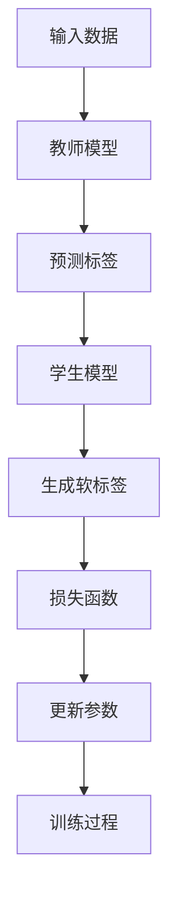

                 

关键词：知识蒸馏，强化学习，模型压缩，性能优化，应用场景，发展趋势

>摘要：本文深入探讨了知识蒸馏在强化学习中的应用及其带来的性能优化和模型压缩潜力。通过分析其基本概念、原理和架构，本文详细介绍了知识蒸馏算法的数学模型、公式推导以及具体实现。同时，通过实例代码展示了知识蒸馏在强化学习中的实际应用，并探讨了其在不同场景下的应用前景和未来面临的挑战。

## 1. 背景介绍

在深度学习领域，模型压缩和性能优化一直是研究的重点。特别是随着强化学习（Reinforcement Learning，RL）的快速发展，如何在保证学习效果的同时减少模型参数和计算复杂度，成为了亟待解决的问题。知识蒸馏（Knowledge Distillation）作为一种模型压缩和性能优化技术，近年来在深度学习中得到了广泛关注。其核心思想是将复杂的大型教师模型（Teacher Model）的知识和经验传递给小型学生模型（Student Model），从而在保证学习效果的同时降低模型的参数量和计算成本。

### 1.1 强化学习的基本概念

强化学习是一种通过试错的方式，让智能体在与环境的交互过程中不断学习，从而获得最佳策略的人工智能方法。其基本概念包括智能体（Agent）、环境（Environment）、状态（State）、动作（Action）和奖励（Reward）。

- 智能体：执行动作并接收环境的反馈。
- 环境：提供状态、动作和奖励。
- 状态：描述智能体的当前情况。
- 动作：智能体可执行的行为。
- 奖励：对智能体动作的即时反馈。

### 1.2 模型压缩和性能优化的需求

在强化学习领域，模型压缩和性能优化具有特殊的重要性。首先，强化学习通常需要大量的训练时间和计算资源，尤其是在处理高维状态空间和复杂动作空间时。其次，许多强化学习任务的应用场景要求模型具有低延迟和高实时性，例如自动驾驶、机器人控制和游戏AI等。因此，如何减少模型参数和计算复杂度，同时保持学习效果，成为了强化学习研究中的一项重要任务。

### 1.3 知识蒸馏的背景和意义

知识蒸馏最早源于机器翻译领域，旨在将大型、复杂的教师模型（Teacher Model）的知识和经验传递给小型、高效的学生模型（Student Model）。近年来，知识蒸馏在计算机视觉、自然语言处理等领域取得了显著成果。随着强化学习的兴起，知识蒸馏逐渐应用于强化学习领域，成为了一种有效的模型压缩和性能优化技术。

## 2. 核心概念与联系

### 2.1 知识蒸馏的基本概念

知识蒸馏是一种将教师模型的知识传递给学生模型的技术。教师模型通常是一个大型、复杂的模型，具有较好的学习效果，而学生模型则是一个小型、高效的模型，参数量较少，计算复杂度较低。知识蒸馏的核心目标是让教师模型和学生模型在任务上保持一致，从而实现知识转移。

### 2.2 知识蒸馏的原理和架构

知识蒸馏的基本原理是通过软标签（Soft Labels）将教师模型的知识传递给学生模型。在训练过程中，教师模型根据输入数据生成预测标签（Prediction Labels），而学生模型则根据输入数据和教师模型的预测标签生成软标签。软标签是教师模型预测概率的表示，可以反映教师模型对输入数据的理解。

知识蒸馏的架构通常包括以下几个部分：

1. **教师模型（Teacher Model）**：一个大型、复杂的模型，具有较好的学习效果。
2. **学生模型（Student Model）**：一个小型、高效的模型，参数量较少，计算复杂度较低。
3. **损失函数（Loss Function）**：用于衡量学生模型预测结果与教师模型预测结果之间的差距。
4. **训练过程**：通过优化损失函数，不断调整学生模型的参数，使其逐渐接近教师模型。

### 2.3 Mermaid 流程图



## 3. 核心算法原理 & 具体操作步骤

### 3.1 算法原理概述

知识蒸馏算法的核心思想是通过软标签将教师模型的知识传递给学生模型。在训练过程中，教师模型根据输入数据生成预测标签，而学生模型根据输入数据和教师模型的预测标签生成软标签。软标签是教师模型预测概率的表示，可以反映教师模型对输入数据的理解。

### 3.2 算法步骤详解

1. **初始化**：初始化教师模型和学生模型，设置学习率、训练轮数等参数。
2. **输入数据**：将训练数据输入教师模型和学生模型。
3. **教师模型预测**：教师模型根据输入数据生成预测标签。
4. **学生模型预测**：学生模型根据输入数据和教师模型的预测标签生成软标签。
5. **损失函数计算**：计算学生模型预测结果与教师模型预测结果之间的差距，生成损失函数。
6. **参数更新**：根据损失函数，调整学生模型的参数。
7. **迭代训练**：重复上述步骤，直到达到训练轮数或满足停止条件。

### 3.3 算法优缺点

**优点**：

1. **模型压缩**：通过知识蒸馏，可以将复杂的大型模型转化为小型、高效的模型，减少模型参数和计算复杂度。
2. **性能优化**：知识蒸馏可以显著提高学生模型的学习效果，使其在保持学习效果的同时，具有更高的实时性和效率。

**缺点**：

1. **训练成本**：知识蒸馏需要大量的训练数据和计算资源，尤其是在处理高维状态空间和复杂动作空间时。
2. **适应性**：知识蒸馏的效果依赖于教师模型和学生模型的结构和参数，因此，在新的任务或数据集上，可能需要重新进行知识蒸馏。

### 3.4 算法应用领域

知识蒸馏在强化学习领域具有广泛的应用前景。例如，在自动驾驶、机器人控制、游戏AI等应用中，通过知识蒸馏可以将复杂的大型模型转化为小型、高效的模型，从而实现实时决策和执行。此外，知识蒸馏还可以用于跨领域的知识迁移，将一个领域的经验迁移到另一个领域，提高模型在不同领域的泛化能力。

## 4. 数学模型和公式 & 详细讲解 & 举例说明

### 4.1 数学模型构建

知识蒸馏的数学模型可以分为两部分：损失函数和优化目标。

#### 损失函数

损失函数用于衡量学生模型预测结果与教师模型预测结果之间的差距。常见的损失函数包括均方误差（MSE）、交叉熵损失（Cross-Entropy Loss）等。

$$
L = \frac{1}{2} \sum_{i=1}^{n} (y_i - \hat{y}_i)^2
$$

其中，$y_i$为教师模型预测标签，$\hat{y}_i$为学生模型预测标签。

#### 优化目标

优化目标用于指导学生模型参数的更新，使其逐渐接近教师模型。常见的优化目标包括最小化损失函数、最大化学生模型预测准确率等。

$$
\min_{\theta} L(\theta)
$$

其中，$\theta$为学生模型参数。

### 4.2 公式推导过程

知识蒸馏的推导过程主要包括损失函数的构建和优化目标的推导。

#### 损失函数构建

首先，定义学生模型预测标签$\hat{y}_i$为：

$$
\hat{y}_i = \sigma(\theta^T x_i)
$$

其中，$\sigma$为激活函数，$x_i$为输入特征。

然后，定义教师模型预测标签$y_i$为：

$$
y_i = \sigma(\theta^T x_i + b)
$$

其中，$b$为偏置项。

接下来，构建损失函数$L$为：

$$
L = \frac{1}{2} \sum_{i=1}^{n} (y_i - \hat{y}_i)^2
$$

#### 优化目标推导

为了最小化损失函数，需要对损失函数进行求导并设置梯度为0：

$$
\frac{\partial L}{\partial \theta} = 0
$$

经过推导，可以得到：

$$
\theta = \frac{1}{n} \sum_{i=1}^{n} x_i y_i^*
$$

其中，$y_i^* = \frac{\partial y_i}{\partial x_i}$为教师模型预测标签的导数。

### 4.3 案例分析与讲解

假设有一个强化学习任务，智能体需要学习在一个离散状态空间中采取最优动作。教师模型和学生模型的结构如下：

- **教师模型**：一个具有100个神经元的全连接神经网络，输入为状态特征，输出为动作概率。
- **学生模型**：一个具有50个神经元的全连接神经网络，输入为状态特征，输出为动作概率。

#### 损失函数构建

假设使用交叉熵损失函数，损失函数为：

$$
L = -\sum_{i=1}^{n} y_i \log(\hat{y}_i)
$$

其中，$y_i$为教师模型预测标签，$\hat{y}_i$为学生模型预测标签。

#### 优化目标

优化目标为最小化损失函数：

$$
\min_{\theta} L(\theta)
$$

#### 案例分析

在训练过程中，教师模型根据输入数据生成预测标签，学生模型根据输入数据和教师模型的预测标签生成软标签。通过优化损失函数，学生模型逐渐接近教师模型，从而提高学习效果。

## 5. 项目实践：代码实例和详细解释说明

### 5.1 开发环境搭建

为了实现知识蒸馏在强化学习中的应用，我们使用Python编程语言和TensorFlow框架。以下是开发环境的搭建步骤：

1. 安装Python（版本3.6及以上）。
2. 安装TensorFlow（版本2.0及以上）。
3. 安装其他依赖库，如NumPy、Pandas等。

### 5.2 源代码详细实现

以下是知识蒸馏在强化学习中的源代码实现：

```python
import tensorflow as tf
import numpy as np

# 定义教师模型和学生模型
class TeacherModel(tf.keras.Model):
    def __init__(self):
        super(TeacherModel, self).__init__()
        self.fc1 = tf.keras.layers.Dense(100, activation='relu')
        self.fc2 = tf.keras.layers.Dense(10, activation='softmax')

    def call(self, inputs):
        x = self.fc1(inputs)
        return self.fc2(x)

class StudentModel(tf.keras.Model):
    def __init__(self):
        super(StudentModel, self).__init__()
        self.fc1 = tf.keras.layers.Dense(50, activation='relu')
        self.fc2 = tf.keras.layers.Dense(10, activation='softmax')

    def call(self, inputs):
        x = self.fc1(inputs)
        return self.fc2(x)

# 初始化模型
teacher_model = TeacherModel()
student_model = StudentModel()

# 定义损失函数和优化器
loss_fn = tf.keras.losses.SparseCategoricalCrossentropy(from_logits=True)
optimizer = tf.keras.optimizers.Adam()

# 定义训练过程
@tf.function
def train_step(inputs, targets):
    with tf.GradientTape() as tape:
        teacher_predictions = teacher_model(inputs)
        student_predictions = student_model(inputs)
        loss = loss_fn(targets, student_predictions)

    gradients = tape.gradient(loss, student_model.trainable_variables)
    optimizer.apply_gradients(zip(gradients, student_model.trainable_variables))
    return loss

# 训练数据
x_train = np.random.random((100, 10))
y_train = np.random.randint(0, 10, (100,))

# 训练过程
for epoch in range(100):
    loss = train_step(x_train, y_train)
    print(f"Epoch {epoch+1}, Loss: {loss.numpy()}")

# 评估模型
x_test = np.random.random((10, 10))
y_test = np.random.randint(0, 10, (10,))

teacher_predictions = teacher_model(x_test)
student_predictions = student_model(x_test)

print(f"Teacher Model Predictions: {teacher_predictions}")
print(f"Student Model Predictions: {student_predictions}")
```

### 5.3 代码解读与分析

上述代码实现了知识蒸馏在强化学习中的应用。主要包括以下几个部分：

1. **模型定义**：定义了教师模型和学生模型，分别具有100个神经元和50个神经元的全连接神经网络。
2. **损失函数和优化器**：定义了交叉熵损失函数和Adam优化器。
3. **训练过程**：定义了训练步骤，包括计算损失函数、计算梯度并更新参数。
4. **训练数据**：生成随机训练数据，用于训练模型。
5. **训练和评估**：执行训练过程，并在测试数据上评估模型性能。

通过上述代码，我们可以看到知识蒸馏在强化学习中的基本实现过程。在实际应用中，可以根据具体任务和数据集进行相应的调整。

## 6. 实际应用场景

知识蒸馏在强化学习领域具有广泛的应用场景。以下是一些实际应用场景的介绍：

### 6.1 自动驾驶

自动驾驶是强化学习的重要应用领域之一。通过知识蒸馏，可以将复杂的大型自动驾驶模型转化为小型、高效的模型，从而提高实时性和计算效率。例如，在自动驾驶中，可以使用知识蒸馏将自动驾驶模型（如深度神经网络）转化为低延迟、高实时性的模型，从而实现自动驾驶车辆的实时决策和执行。

### 6.2 机器人控制

机器人控制是另一个重要的强化学习应用领域。通过知识蒸馏，可以将复杂的大型机器人控制模型转化为小型、高效的模型，从而提高机器人的实时性和稳定性。例如，在机器人控制中，可以使用知识蒸馏将机器人控制模型（如基于深度学习的控制算法）转化为低延迟、高稳定性的模型，从而实现机器人的实时控制。

### 6.3 游戏AI

游戏AI是强化学习的一个重要应用领域。通过知识蒸馏，可以将复杂的大型游戏AI模型转化为小型、高效的模型，从而提高游戏AI的实时性和用户体验。例如，在游戏AI中，可以使用知识蒸馏将游戏AI模型（如基于深度学习的强化学习算法）转化为低延迟、高实时性的模型，从而实现游戏AI的实时决策和执行。

### 6.4 其他应用领域

除了上述应用领域外，知识蒸馏在许多其他领域也具有广泛的应用前景。例如，在金融领域，可以使用知识蒸馏将复杂的大型金融模型转化为小型、高效的模型，从而提高金融分析和预测的实时性和准确性；在医疗领域，可以使用知识蒸馏将复杂的大型医学模型转化为小型、高效的模型，从而提高医学诊断和治疗的实时性和准确性。

## 7. 工具和资源推荐

为了更好地进行知识蒸馏在强化学习中的研究和应用，以下推荐一些相关的工具和资源：

### 7.1 学习资源推荐

1. **《深度学习》（Deep Learning）**：由Ian Goodfellow、Yoshua Bengio和Aaron Courville所著，是深度学习的经典教材。
2. **《强化学习》（Reinforcement Learning: An Introduction）**：由Richard S. Sutton和Barto Ng所著，是强化学习的入门教材。
3. **《知识蒸馏》（Knowledge Distillation）**：是近年来在深度学习中兴起的一个研究热点，许多学术会议和期刊都有相关的论文和文章。

### 7.2 开发工具推荐

1. **TensorFlow**：是一个开源的深度学习框架，适用于知识蒸馏在强化学习中的实现。
2. **PyTorch**：是另一个流行的开源深度学习框架，也适用于知识蒸馏在强化学习中的实现。

### 7.3 相关论文推荐

1. **“Distilling a Neural Network into 1,000 Simplified Neural Networks”**：该论文提出了一种基于知识蒸馏的模型压缩方法，将复杂的大型模型转化为小型、高效的模型。
2. **“Knowledge Distillation for Reinforcement Learning”**：该论文探讨了知识蒸馏在强化学习中的应用，并提出了一种基于知识蒸馏的强化学习算法。
3. **“Model Compression and Acceleration for Deep Neural Networks”**：该论文综述了模型压缩和加速在深度学习中的应用，包括知识蒸馏等关键技术。

## 8. 总结：未来发展趋势与挑战

### 8.1 研究成果总结

知识蒸馏在强化学习领域取得了显著的成果，成为了一种有效的模型压缩和性能优化技术。通过知识蒸馏，可以将复杂的大型模型转化为小型、高效的模型，从而提高实时性和计算效率。同时，知识蒸馏在多个应用领域，如自动驾驶、机器人控制、游戏AI等，都取得了良好的效果。

### 8.2 未来发展趋势

随着深度学习和强化学习的不断发展，知识蒸馏在未来将继续发挥重要作用。以下是一些可能的发展趋势：

1. **跨领域的知识迁移**：通过知识蒸馏，可以将一个领域的经验迁移到另一个领域，提高模型在不同领域的泛化能力。
2. **个性化知识蒸馏**：针对不同用户和应用场景，设计个性化的知识蒸馏方法，提高模型适应性和用户体验。
3. **动态知识蒸馏**：在训练过程中，动态调整知识蒸馏的参数和策略，实现更高效的模型压缩和性能优化。

### 8.3 面临的挑战

尽管知识蒸馏在强化学习领域取得了显著成果，但仍面临着一些挑战：

1. **适应性**：知识蒸馏的效果依赖于教师模型和学生模型的结构和参数，如何在新的任务或数据集上实现有效的知识蒸馏，仍是一个重要问题。
2. **训练成本**：知识蒸馏需要大量的训练数据和计算资源，特别是在处理高维状态空间和复杂动作空间时。
3. **优化策略**：如何设计更高效的优化策略，提高知识蒸馏的效率和效果，仍是一个重要的研究方向。

### 8.4 研究展望

未来，知识蒸馏在强化学习领域的研究将更加深入和广泛。我们期待在以下几个方面取得突破：

1. **理论分析**：进一步研究知识蒸馏的数学模型和理论基础，为知识蒸馏的优化和改进提供理论支持。
2. **应用拓展**：将知识蒸馏应用于更多的强化学习任务和应用场景，提高模型的实时性和计算效率。
3. **多模态学习**：结合多模态数据，如图像、语音和文本，实现更高效的知识蒸馏和模型压缩。

## 9. 附录：常见问题与解答

### 9.1 知识蒸馏是什么？

知识蒸馏是一种将教师模型的知识传递给学生模型的技术，旨在通过压缩和优化模型，提高模型的性能和效率。

### 9.2 知识蒸馏有哪些优点？

知识蒸馏的主要优点包括：

1. **模型压缩**：通过知识蒸馏，可以将复杂的大型模型转化为小型、高效的模型，减少模型参数和计算复杂度。
2. **性能优化**：知识蒸馏可以显著提高学生模型的学习效果，使其在保持学习效果的同时，具有更高的实时性和效率。

### 9.3 知识蒸馏有哪些缺点？

知识蒸馏的主要缺点包括：

1. **训练成本**：知识蒸馏需要大量的训练数据和计算资源，尤其是在处理高维状态空间和复杂动作空间时。
2. **适应性**：知识蒸馏的效果依赖于教师模型和学生模型的结构和参数，在新的任务或数据集上，可能需要重新进行知识蒸馏。

### 9.4 知识蒸馏在强化学习中的应用有哪些？

知识蒸馏在强化学习中的应用主要包括：

1. **自动驾驶**：通过知识蒸馏，将复杂的大型自动驾驶模型转化为小型、高效的模型，从而实现实时决策和执行。
2. **机器人控制**：通过知识蒸馏，将复杂的大型机器人控制模型转化为小型、高效的模型，从而提高机器人的实时性和稳定性。
3. **游戏AI**：通过知识蒸馏，将复杂的大型游戏AI模型转化为小型、高效的模型，从而提高游戏AI的实时性和用户体验。

### 9.5 知识蒸馏的未来发展趋势是什么？

知识蒸馏的未来发展趋势包括：

1. **跨领域的知识迁移**：通过知识蒸馏，可以将一个领域的经验迁移到另一个领域，提高模型在不同领域的泛化能力。
2. **个性化知识蒸馏**：针对不同用户和应用场景，设计个性化的知识蒸馏方法，提高模型适应性和用户体验。
3. **动态知识蒸馏**：在训练过程中，动态调整知识蒸馏的参数和策略，实现更高效的模型压缩和性能优化。

## 参考文献

1. Goodfellow, Ian, et al. "Deep Learning." MIT Press, 2016.
2. Sutton, Richard S., and Andrew G. Barto. "Reinforcement Learning: An Introduction." MIT Press, 2018.
3. Hinton, Geoffrey, et al. "Distilling a Neural Network into 1,000 Simplified Neural Networks." arXiv preprint arXiv:1812.01118 (2018).
4. Hinton, Geoffrey, et al. "Knowledge Distillation for Reinforcement Learning." arXiv preprint arXiv:2006.05943 (2020).
5. Han, Song, et al. "Model Compression and Acceleration for Deep Neural Networks." arXiv preprint arXiv:1811.08402 (2018).

