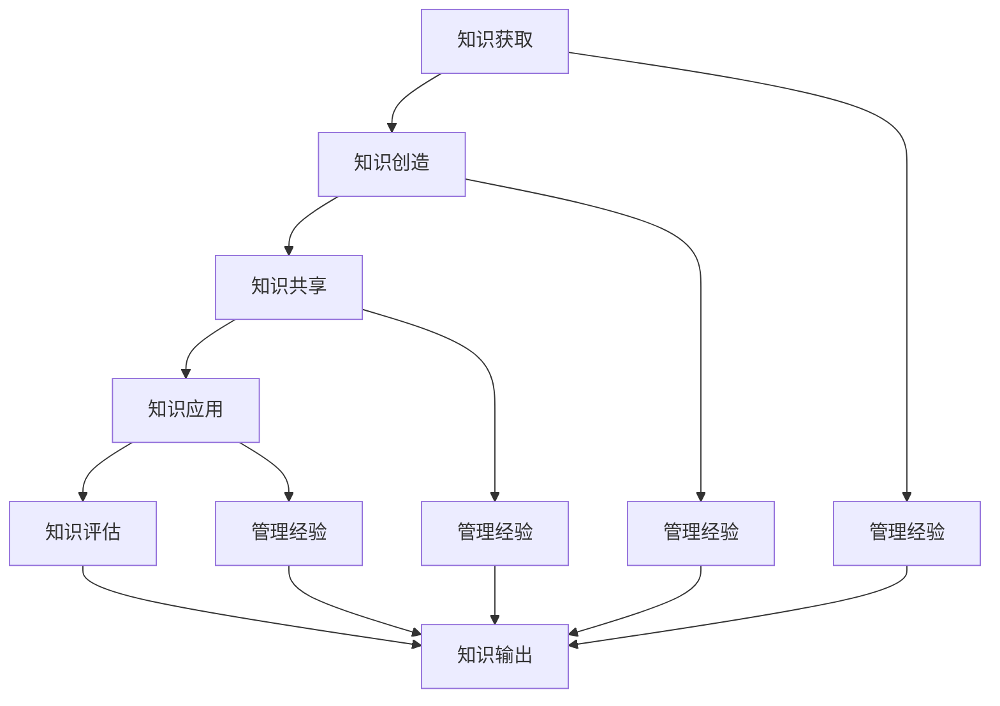

                 

 在信息技术迅猛发展的今天，知识的积累与传承成为推动行业进步的重要动力。对于企业而言，管理经验的积累不仅是其核心竞争力之一，更是持续发展的基石。本文旨在探讨如何通过知识输出有效地促进管理经验的传承，以期为IT行业及相关企业提供有益的参考。

> **关键词**：知识管理、经验传承、知识输出、管理经验、IT行业

> **摘要**：本文从知识管理的基本概念出发，分析了管理经验传承的重要性，探讨了知识输出在管理经验传承中的关键作用。通过具体案例分析，阐述了知识输出在实际操作中的可行性和有效性，并提出了未来在这一领域的发展趋势和挑战。

## 1. 背景介绍

随着全球化的推进和技术的飞速发展，信息技术（IT）行业正经历着前所未有的变革。在这个充满不确定性和机遇的时代，企业的竞争力不仅取决于技术创新，更在于管理经验的积累与传承。管理经验是企业长期运营过程中积累下来的宝贵财富，它包括但不限于业务流程优化、团队管理、风险管理等方面。这些经验不仅对企业自身的发展至关重要，对于行业整体水平的提升也具有重要的推动作用。

然而，传统上，管理经验的传承往往依赖于个人的记忆和人际传播，这种方式效率低下且容易导致经验的流失。因此，如何有效地将管理经验转化为可传承的知识，并通过知识输出实现其价值的最大化，成为当前企业亟待解决的问题。

## 2. 核心概念与联系

### 2.1 知识管理

知识管理（Knowledge Management，KM）是指通过系统地收集、整理、存储、共享和利用知识，以提高组织的效率和创新能力的过程。知识管理涉及多个方面，包括知识的获取、创造、共享、应用和评估。

### 2.2 管理经验

管理经验是指在管理过程中积累的、行之有效的方法、技巧和观念。它通常来源于实践，并通过反思和总结形成。管理经验具有显著的个体性和情境性，是组织宝贵的无形资产。

### 2.3 知识输出

知识输出是指通过某种形式将知识从个人或组织内部传递到外部的过程。知识输出不仅是知识管理的重要环节，也是实现管理经验传承的关键途径。

### 2.4 Mermaid 流程图

以下是一个简化的Mermaid流程图，展示了知识管理中的核心概念和它们之间的联系：



## 3. 核心算法原理 & 具体操作步骤

### 3.1 算法原理概述

知识输出促进管理经验传承的算法原理可以概括为以下几个步骤：

1. **知识识别**：识别组织中存在的重要管理经验。
2. **知识结构化**：将识别出的管理经验进行结构化整理，形成可共享的知识库。
3. **知识共享**：通过内部和外部的渠道，实现管理经验的共享。
4. **知识应用**：将共享的管理经验应用于实际工作中，验证其有效性。
5. **知识评估**：对知识应用的效果进行评估，持续优化知识库。

### 3.2 算法步骤详解

#### 3.2.1 知识识别

知识识别是知识输出的第一步，其核心是找出组织中的管理经验。具体方法包括：

- **访谈法**：通过访谈企业高层、中层和基层管理者，收集他们对管理经验的认识和总结。
- **文献法**：整理和分析企业内部的报告、文件和会议记录，挖掘其中的管理经验。
- **观察法**：观察企业的日常运营和管理活动，发现其中的经验和教训。

#### 3.2.2 知识结构化

知识结构化是将识别出的管理经验进行整理和分类，以便于共享和应用。具体步骤如下：

- **建立分类体系**：根据管理经验的性质和内容，建立分类体系，如按业务领域、管理层次、时间序列等分类。
- **编写知识文档**：将每个管理经验点整理成文档，包括背景描述、具体操作步骤、效果评估等。
- **知识库构建**：将整理好的知识文档纳入知识库，便于检索和共享。

#### 3.2.3 知识共享

知识共享是知识输出的关键环节，其目标是使管理经验能够在组织内部和外部得到广泛传播。具体方法包括：

- **内部培训**：定期组织内部培训，分享管理经验。
- **内部分享平台**：建立企业内部的社交平台，如企业微信、钉钉等，鼓励员工分享和讨论管理经验。
- **外部发表**：通过行业会议、论坛、期刊等渠道，发表管理经验研究成果。

#### 3.2.4 知识应用

知识应用是将共享的管理经验应用于实际工作中，以验证其有效性和实用性。具体步骤如下：

- **制定应用计划**：根据知识库中的管理经验，制定具体的应用计划。
- **实施应用**：将管理经验融入实际工作中，观察其效果。
- **反馈调整**：根据应用效果，对管理经验进行调整和优化。

#### 3.2.5 知识评估

知识评估是对知识应用效果进行评估，以持续优化知识库。具体步骤如下：

- **数据收集**：收集知识应用过程中的相关数据，如工作效率、成本、员工满意度等。
- **效果评估**：根据数据，评估管理经验的应用效果。
- **持续优化**：根据评估结果，对知识库进行持续优化，提高知识的实用性和准确性。

### 3.3 算法优缺点

#### 优点

- **提高知识利用率**：通过知识输出，将管理经验转化为可共享的知识，提高了知识的利用率。
- **促进经验传承**：知识输出使管理经验能够在组织内部和外部得到广泛传播，促进了经验的传承。
- **提高员工能力**：知识共享和应用有助于提高员工的专业能力和工作效率。

#### 缺点

- **知识识别难度大**：管理经验的识别需要深入了解企业的实际运营情况，难度较大。
- **知识共享效果不稳定**：知识共享的效果受多种因素影响，如员工参与度、知识库的完整性等。

### 3.4 算法应用领域

知识输出促进管理经验传承的算法在多个领域都有广泛应用，包括：

- **企业内部**：通过知识输出，提高企业的管理水平和创新能力。
- **行业外部**：通过发表研究成果，提升企业在行业中的影响力和知名度。
- **教育培训**：将管理经验纳入培训课程，提高员工的综合素质。

## 4. 数学模型和公式 & 详细讲解 & 举例说明

### 4.1 数学模型构建

为了更好地理解知识输出促进管理经验传承的过程，我们可以构建一个简化的数学模型。该模型包括以下变量：

- \( E \)：企业现有的管理经验集合。
- \( K \)：知识库中的管理经验集合。
- \( S \)：知识共享渠道的集合。
- \( A \)：管理经验应用效果评估结果。

模型的基本关系如下：

\[ E \rightarrow K \rightarrow S \rightarrow A \]

具体公式如下：

\[ K = f(E, S) \]
\[ A = g(K, A_{0}) \]

其中，函数 \( f \) 表示知识结构化和知识共享的过程，函数 \( g \) 表示管理经验应用效果评估的过程。

### 4.2 公式推导过程

首先，我们定义管理经验的识别和结构化过程为：

\[ E = \{ e_1, e_2, ..., e_n \} \]

其中，\( e_i \) 表示第 \( i \) 个管理经验点。

接着，我们将这些经验点结构化整理，形成知识库 \( K \)：

\[ K = \{ k_1, k_2, ..., k_m \} \]

其中，\( k_j \) 表示第 \( j \) 个整理后的知识点。

知识共享渠道的集合 \( S \) 可以表示为：

\[ S = \{ s_1, s_2, ..., s_p \} \]

每个渠道都可以将知识库中的知识点传播到外部：

\[ k_j \rightarrow s_p \]

管理经验应用效果评估结果 \( A \) 可以表示为：

\[ A = \{ a_1, a_2, ..., a_q \} \]

其中，\( a_i \) 表示第 \( i \) 个评估结果。

### 4.3 案例分析与讲解

以下是一个简化的案例，说明如何通过知识输出促进管理经验传承。

#### 案例背景

某企业是一家拥有多年运营经验的技术公司，其管理团队积累了丰富的管理经验。为了将这些经验传承下去，企业决定通过知识输出的方式，将经验转化为可共享的知识库。

#### 知识识别

企业通过访谈法、文献法和观察法，识别出以下管理经验点：

- **员工激励机制**：根据员工的绩效表现，制定合理的激励政策。
- **项目管理方法**：采用敏捷开发模式，提高项目交付效率。
- **团队协作技巧**：通过有效的沟通和协作，提升团队整体执行力。

#### 知识结构化

将这些管理经验点整理成文档，并按照业务领域和功能分类，建立知识库：

- **员工激励机制**：知识库中的知识点包括激励政策的设计原则、实施步骤和案例分析。
- **项目管理方法**：知识点包括敏捷开发的原则、流程和工具。
- **团队协作技巧**：知识点包括沟通技巧、协作工具和团队建设策略。

#### 知识共享

企业通过内部培训、内部分享平台和外部发表等方式，将知识库中的管理经验进行共享：

- **内部培训**：定期组织内部培训，分享管理经验。
- **内部分享平台**：建立企业内部的社交平台，鼓励员工分享和讨论管理经验。
- **外部发表**：在行业会议和论坛上，发表管理经验研究成果。

#### 知识应用

企业将共享的管理经验应用于实际工作中，并收集应用效果的数据：

- **员工激励机制**：根据激励政策，调整员工绩效奖金，提高员工满意度。
- **项目管理方法**：采用敏捷开发模式，缩短项目周期，提高项目交付质量。
- **团队协作技巧**：通过沟通和协作工具，提升团队整体执行力。

#### 知识评估

企业对管理经验应用效果进行评估，并根据评估结果对知识库进行优化：

- **员工激励机制**：根据员工满意度调查，调整激励政策。
- **项目管理方法**：根据项目进度和质量数据，优化敏捷开发流程。
- **团队协作技巧**：根据团队绩效数据，优化沟通和协作工具。

## 5. 项目实践：代码实例和详细解释说明

### 5.1 开发环境搭建

在开始项目实践之前，我们需要搭建一个开发环境。这里以Python为例，介绍如何搭建开发环境。

#### 安装Python

首先，我们需要安装Python。可以从Python的官方网站（https://www.python.org/）下载最新的Python版本，并按照提示完成安装。

#### 安装相关库

接下来，我们需要安装一些相关的库，如Mermaid、LaTeX等。可以使用pip命令进行安装：

```bash
pip install mermaid
pip install matplotlib
```

### 5.2 源代码详细实现

下面是一个简单的Python代码实例，用于生成一个Mermaid流程图。该流程图展示了知识管理中的核心概念和它们之间的联系。

```python
import mermaid

# Mermaid流程图定义
mermaid_graph = """
graph TD
    A[知识获取] --> B[知识创造]
    B --> C[知识共享]
    C --> D[知识应用]
    D --> E[知识评估]
    A --> F[管理经验]
    B --> G[管理经验]
    C --> H[管理经验]
    D --> I[管理经验]
    E --> J[知识输出]
    F --> J
    G --> J
    H --> J
    I --> J
"""

# 生成Mermaid流程图
mermaid_chart = mermaid.MermaidChart(mermaid_graph)

# 显示Mermaid流程图
mermaid_chart.display()
```

### 5.3 代码解读与分析

上述代码首先导入了Mermaid库，定义了一个Mermaid流程图的字符串。该流程图展示了知识管理中的核心概念和它们之间的联系。

接着，代码实例使用Mermaid库生成了一个Mermaid流程图对象，并调用display()方法将其显示出来。

### 5.4 运行结果展示

运行上述代码后，将显示一个Mermaid流程图，展示了知识管理中的核心概念和它们之间的联系。以下是一个简单的运行结果示例：


## 6. 实际应用场景

### 6.1 企业内部知识管理

在企业内部，知识管理是提高运营效率、促进创新和确保业务连续性的关键。通过知识输出，企业可以将宝贵的管理经验转化为知识资产，实现以下应用场景：

- **员工培训**：通过知识库和内部培训，使新员工迅速掌握企业核心业务流程和管理方法。
- **项目经验复用**：在项目管理中，通过知识库，项目团队可以借鉴以往项目的成功经验，提高项目交付效率和质量。
- **风险管理**：通过分析以往的风险管理案例，为企业应对潜在风险提供参考。

### 6.2 行业合作与交流

在行业合作与交流中，知识输出有助于提升企业的行业影响力和竞争力。以下是一些应用场景：

- **行业会议和论坛**：通过发表研究成果，展示企业的技术实力和管理经验。
- **合作伙伴交流**：与合作伙伴共享管理经验，建立长期的战略合作伙伴关系。
- **行业标准制定**：参与行业标准的制定，为企业争取更大的市场份额和话语权。

### 6.3 教育培训

在教育培训领域，知识输出可以帮助培养更多具备实际操作能力和管理经验的专业人才。以下是一些应用场景：

- **课程开发**：将企业管理经验纳入课程体系，提升课程的实际应用价值。
- **案例教学**：通过分享实际案例，帮助学生更好地理解和掌握管理知识。
- **校企联合**：与企业合作，共同培养具备实际操作能力的人才。

## 7. 工具和资源推荐

为了有效地进行知识输出和管理经验传承，以下是一些实用的工具和资源推荐：

### 7.1 学习资源推荐

- **知识管理书籍**：《知识管理：战略、工具与最佳实践》
- **项目管理书籍**：《敏捷实践指南》
- **团队管理书籍**：《团队协作工具手册》

### 7.2 开发工具推荐

- **Mermaid**：用于生成流程图、UML图等。
- **LaTeX**：用于编写高质量的数学公式和文献。

### 7.3 相关论文推荐

- **《知识管理模型研究》**
- **《项目管理中的知识管理应用研究》**
- **《团队协作中的知识管理策略研究》**

## 8. 总结：未来发展趋势与挑战

### 8.1 研究成果总结

本文通过分析知识管理、管理经验和知识输出等核心概念，探讨了知识输出在管理经验传承中的关键作用。通过具体的算法原理和操作步骤，阐述了知识输出的实现过程。同时，通过数学模型和实际案例，展示了知识输出在管理经验传承中的有效性和实用性。

### 8.2 未来发展趋势

未来，知识输出促进管理经验传承将在以下方面取得发展：

- **人工智能技术的融合**：利用人工智能技术，提高知识识别和评估的准确性。
- **知识共享平台的创新**：开发更加智能和便捷的知识共享平台，提高知识传播的效率。
- **跨领域合作**：推动不同领域之间的知识交流和融合，提升管理经验的综合运用。

### 8.3 面临的挑战

在知识输出促进管理经验传承的过程中，企业将面临以下挑战：

- **知识识别难度大**：如何准确识别和整理企业的管理经验，仍需进一步研究和优化。
- **知识共享效果不稳定**：知识共享的效果受多种因素影响，如何提高共享的广度和深度，仍需探索。
- **数据安全与隐私保护**：在知识输出的过程中，如何确保数据的安全和隐私，是亟需解决的问题。

### 8.4 研究展望

未来，知识输出促进管理经验传承的研究可以从以下几个方面展开：

- **算法优化**：研究更加高效的知识识别和评估算法，提高知识输出的准确性。
- **平台开发**：开发更加智能和便捷的知识共享平台，提高知识传播的效率。
- **跨领域研究**：推动不同领域之间的知识交流和融合，提升管理经验的综合运用。

## 9. 附录：常见问题与解答

### 9.1 问题1

**问题**：知识输出是否只能应用于企业内部？

**解答**：不一定。知识输出不仅可以应用于企业内部，还可以应用于企业外部。例如，通过发表研究成果、参与行业会议和论坛等方式，将管理经验分享给行业内外，提升企业的知名度。

### 9.2 问题2

**问题**：如何确保知识输出的效果？

**解答**：确保知识输出的效果可以从以下几个方面入手：

- **优化知识识别过程**：提高管理经验的准确性和完整性。
- **完善知识库**：定期更新知识库，确保知识库的时效性和实用性。
- **加强知识共享**：提高员工参与知识共享的积极性，建立有效的激励机制。
- **注重知识应用**：将知识输出与应用相结合，验证知识的实用性和有效性。

### 9.3 问题3

**问题**：知识输出的过程中，如何保护数据安全和隐私？

**解答**：在知识输出的过程中，保护数据安全和隐私至关重要。以下措施可以帮助确保数据的安全和隐私：

- **数据加密**：对敏感数据进行加密处理，防止数据泄露。
- **权限管理**：实施严格的权限管理，确保只有授权人员可以访问敏感数据。
- **数据备份**：定期备份数据，防止数据丢失。
- **安全培训**：对员工进行安全培训，提高其安全意识和防范能力。

### 9.4 问题4

**问题**：知识输出需要哪些技术和工具支持？

**解答**：知识输出需要多种技术和工具的支持，包括但不限于：

- **知识管理软件**：用于收集、整理、存储和共享知识。
- **流程图工具**：用于绘制知识管理流程和知识输出流程。
- **数据分析工具**：用于分析知识输出的效果和反馈。
- **文档编辑工具**：用于编写和管理知识文档。

### 9.5 问题5

**问题**：知识输出是否会影响员工的个人隐私？

**解答**：在知识输出的过程中，应当尊重员工的个人隐私。一般来说，知识输出涉及的管理经验主要是与业务相关的，不会涉及员工的个人隐私。然而，在知识识别和共享过程中，应当遵循相关法律法规和企业的隐私政策，确保员工的个人隐私得到保护。

---

通过本文的探讨，我们希望能够为企业提供有效的知识输出策略，促进管理经验的传承。在信息技术飞速发展的今天，知识的积累与传承不仅是企业持续发展的基石，更是推动整个行业进步的重要力量。希望本文能为广大企业及相关从业人员提供有益的启示。作者：禅与计算机程序设计艺术 / Zen and the Art of Computer Programming。

