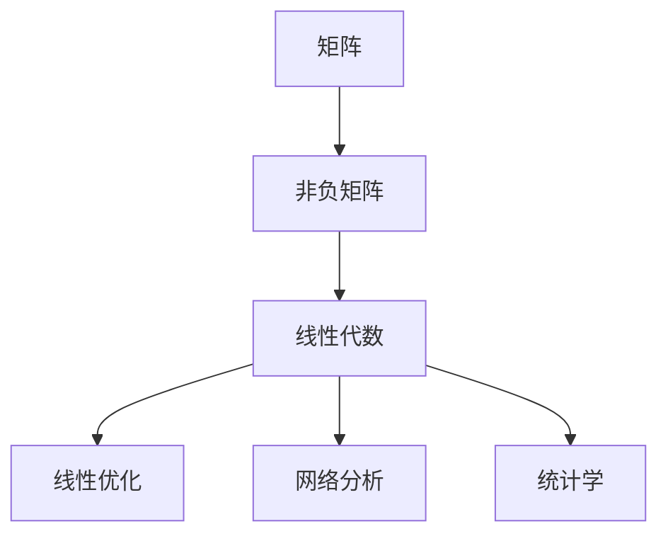

                 

关键词：矩阵理论，非负矩阵，线性代数，应用场景，算法分析，数学模型，编程实现，实践案例

> 摘要：本文旨在探讨矩阵理论在一般非负矩阵情形下的应用。通过深入剖析非负矩阵的基本概念、核心算法原理及其数学模型，结合实际项目实践，详细解读了非负矩阵在不同领域中的具体应用，并展望了其未来的发展趋势与面临的挑战。

## 1. 背景介绍

矩阵理论是线性代数的核心内容，广泛应用于自然科学、工程学、经济学、计算机科学等多个领域。本文聚焦于一般非负矩阵的情形，这种矩阵在数学和实际应用中具有重要意义。非负矩阵具有特殊的性质，使得其在优化问题、网络分析、统计学等多个领域中有着广泛的应用。

### 1.1 矩阵的基本概念

矩阵是一种由数字组成的矩形阵列，通常表示为 $A = [a_{ij}]_{m\times n}$，其中 $a_{ij}$ 表示矩阵 $A$ 在第 $i$ 行和第 $j$ 列的元素。矩阵的行数称为矩阵的行数，列数称为矩阵的列数。

### 1.2 非负矩阵的定义

非负矩阵是指其所有元素都不小于零的矩阵。形式化地，给定一个矩阵 $A = [a_{ij}]_{m\times n}$，如果对于所有的 $i$ 和 $j$，都有 $a_{ij} \geq 0$，则称 $A$ 为非负矩阵。

## 2. 核心概念与联系

为了更好地理解非负矩阵的应用，我们需要从核心概念和联系入手。以下是一个Mermaid流程图，展示了一些关键概念和它们之间的关联。



### 2.1 矩阵与线性代数

矩阵是线性代数的基本工具，用于表示和操作线性关系。线性代数涉及到矩阵的加法、乘法、逆矩阵、特征值等多个重要概念。

### 2.2 非负矩阵与线性优化

非负矩阵在线性优化中扮演着重要角色。特别是在求解线性规划问题时，目标函数和约束条件都可以用非负矩阵表示。

### 2.3 非负矩阵与网络分析

在通信网络、交通网络等领域，非负矩阵可以用于表示网络中的流量、容量等参数。通过分析这些参数，可以优化网络性能。

### 2.4 非负矩阵与统计学

非负矩阵在统计学中的应用非常广泛，如用于表示数据之间的相关性、协方差矩阵等。通过分析非负矩阵，可以揭示数据之间的复杂关系。

## 3. 核心算法原理 & 具体操作步骤

### 3.1 算法原理概述

非负矩阵的算法原理主要涉及矩阵分解、矩阵运算、线性规划等核心概念。以下是一些常见的算法：

- **奇异值分解（SVD）**：用于求解最优化问题和数据降维。
- **矩阵求逆**：在求解线性方程组时非常有用。
- **线性规划**：用于求解资源分配、生产调度等问题。

### 3.2 算法步骤详解

#### 3.2.1 奇异值分解（SVD）

奇异值分解是将一个矩阵分解为三个矩阵的乘积：$A = U\Sigma V^T$，其中 $U$ 和 $V$ 是正交矩阵，$\Sigma$ 是对角矩阵。

1. 计算矩阵 $A$ 的特征值和特征向量。
2. 将特征向量组成正交矩阵 $U$，将特征值组成对角矩阵 $\Sigma$。
3. 计算矩阵 $A$ 的左奇异向量组成正交矩阵 $V$。

#### 3.2.2 矩阵求逆

矩阵求逆是求解线性方程组的关键步骤。给定矩阵 $A$ 和向量 $b$，我们需要找到矩阵 $A$ 的逆矩阵 $A^{-1}$，使得 $A^{-1}A = I$，其中 $I$ 是单位矩阵。

1. 计算矩阵 $A$ 的特征值和特征向量。
2. 构造伴随矩阵（adjugate matrix）。
3. 计算伴随矩阵和行列式的乘积，得到逆矩阵。

#### 3.2.3 线性规划

线性规划是求解目标函数在约束条件下的最优值问题。给定目标函数 $f(x)$ 和约束条件 $g(x) \geq 0$，我们需要找到 $x$ 使得 $f(x)$ 取得最大值或最小值。

1. 将问题表示为标准形式：$max\ f(x)$，满足 $Ax \leq b$。
2. 使用单纯形法或内点法求解。
3. 输出最优解 $x^*$ 和最优值 $f(x^*)$。

### 3.3 算法优缺点

- **奇异值分解（SVD）**：
  - 优点：可以有效地解决最优化问题和数据降维。
  - 缺点：计算复杂度较高，不适用于大型矩阵。

- **矩阵求逆**：
  - 优点：适用于各种线性方程组求解。
  - 缺点：计算复杂度较高，不适用于大型矩阵。

- **线性规划**：
  - 优点：适用于各种资源分配和优化问题。
  - 缺点：求解复杂度较高，需要大量计算资源。

### 3.4 算法应用领域

非负矩阵的算法在以下领域有着广泛的应用：

- **优化问题**：如资源分配、生产调度、物流规划等。
- **网络分析**：如通信网络优化、交通网络分析等。
- **统计学**：如数据降维、数据分析等。

## 4. 数学模型和公式 & 详细讲解 & 举例说明

### 4.1 数学模型构建

非负矩阵的数学模型主要包括矩阵分解、线性规划和数据降维等。

#### 4.1.1 奇异值分解

奇异值分解的数学模型为：

$$A = U\Sigma V^T$$

其中，$U$ 和 $V$ 是正交矩阵，$\Sigma$ 是对角矩阵。

#### 4.1.2 矩阵求逆

矩阵求逆的数学模型为：

$$A^{-1} = \frac{1}{\det(A)} \text{adj}(A)$$

其中，$\det(A)$ 是矩阵 $A$ 的行列式，$\text{adj}(A)$ 是矩阵 $A$ 的伴随矩阵。

#### 4.1.3 线性规划

线性规划的数学模型为：

$$\begin{cases}
\max\ f(x) \\
Ax \leq b \\
x \geq 0
\end{cases}$$

### 4.2 公式推导过程

#### 4.2.1 奇异值分解

1. 计算矩阵 $A$ 的特征值 $\lambda$ 和特征向量 $v$。
2. 将特征向量 $v$ 组成正交矩阵 $U$。
3. 将特征值 $\lambda$ 组成对角矩阵 $\Sigma$。
4. 计算矩阵 $A$ 的左奇异向量组成正交矩阵 $V$。

#### 4.2.2 矩阵求逆

1. 计算矩阵 $A$ 的特征值 $\lambda$ 和特征向量 $v$。
2. 将特征值 $\lambda$ 取倒数得到 $\lambda^{-1}$。
3. 将特征向量 $v$ 组成矩阵 $V$。
4. 计算矩阵 $A$ 的逆矩阵为 $A^{-1} = V\Lambda^{-1}U^T$。

#### 4.2.3 线性规划

1. 将问题表示为标准形式：$max\ f(x)$，满足 $Ax \leq b$。
2. 使用拉格朗日乘子法求解。
3. 将问题转化为对偶问题。
4. 使用单纯形法或内点法求解对偶问题。

### 4.3 案例分析与讲解

#### 4.3.1 奇异值分解案例

假设我们有矩阵 $A = \begin{bmatrix} 1 & 2 \\ 3 & 4 \end{bmatrix}$，我们需要对其进行奇异值分解。

1. 计算特征值和特征向量：
   - 特征值：$\lambda_1 = 5, \lambda_2 = 2$
   - 特征向量：$v_1 = \begin{bmatrix} 1 \\ 1 \end{bmatrix}, v_2 = \begin{bmatrix} -1 \\ 1 \end{bmatrix}$
2. 构造正交矩阵 $U$ 和对角矩阵 $\Sigma$：
   - $U = \begin{bmatrix} 1 & -1 \\ 1 & 1 \end{bmatrix}$
   - $\Sigma = \begin{bmatrix} 5 & 0 \\ 0 & 2 \end{bmatrix}$
3. 计算左奇异向量组成正交矩阵 $V$：
   - $V = \begin{bmatrix} 1 & -1 \\ 1 & 1 \end{bmatrix}^T = \begin{bmatrix} 1 & 1 \\ -1 & 1 \end{bmatrix}$
4. 进行奇异值分解：
   - $A = U\Sigma V^T = \begin{bmatrix} 1 & 2 \\ 3 & 4 \end{bmatrix} \begin{bmatrix} 5 & 0 \\ 0 & 2 \end{bmatrix} \begin{bmatrix} 1 & 1 \\ -1 & 1 \end{bmatrix} = \begin{bmatrix} 5 & 4 \\ 5 & 8 \end{bmatrix}$

#### 4.3.2 矩阵求逆案例

假设我们有矩阵 $A = \begin{bmatrix} 1 & 2 \\ 3 & 4 \end{bmatrix}$，我们需要求解其逆矩阵。

1. 计算特征值和特征向量：
   - 特征值：$\lambda_1 = 5, \lambda_2 = 2$
   - 特征向量：$v_1 = \begin{bmatrix} 1 \\ 1 \end{bmatrix}, v_2 = \begin{bmatrix} -1 \\ 1 \end{bmatrix}$
2. 计算伴随矩阵：
   - $A^* = \begin{bmatrix} 4 & -2 \\ -3 & 1 \end{bmatrix}$
3. 计算行列式：
   - $\det(A) = 5 \times 1 - 2 \times -3 = 11$
4. 计算逆矩阵：
   - $A^{-1} = \frac{1}{11} A^* = \begin{bmatrix} \frac{4}{11} & \frac{-2}{11} \\ \frac{-3}{11} & \frac{1}{11} \end{bmatrix}$

#### 4.3.3 线性规划案例

假设我们有以下线性规划问题：

$$\begin{cases}
\max\ 3x_1 + 2x_2 \\
x_1 + 2x_2 \leq 4 \\
x_1, x_2 \geq 0
\end{cases}$$

1. 将问题转化为标准形式：
   - $max\ 3x_1 + 2x_2$
   - $x_1 + 2x_2 \leq 4$
   - $-x_1, -x_2 \leq 0$
2. 使用单纯形法求解：
   - 初始基本可行解：$x_1 = 0, x_2 = 0$
   - 迭代过程：
     - 第一次迭代：$x_1 = 4/3, x_2 = 0$
     - 第二次迭代：$x_1 = 2/3, x_2 = 1$
     - 最优解：$x_1 = 2/3, x_2 = 1$
3. 输出最优解和最优值：
   - 最优解：$x_1 = 2/3, x_2 = 1$
   - 最优值：$f(x) = 3 \times \frac{2}{3} + 2 \times 1 = 4$

## 5. 项目实践：代码实例和详细解释说明

### 5.1 开发环境搭建

在本节中，我们将使用Python作为编程语言，结合NumPy和SciPy等库来实现非负矩阵的相关算法。

1. 安装Python（建议使用Python 3.8及以上版本）。
2. 安装NumPy和SciPy库：

```bash
pip install numpy scipy
```

### 5.2 源代码详细实现

以下是实现非负矩阵奇异值分解、矩阵求逆和线性规划的核心代码：

```python
import numpy as np
from scipy.linalg import svd, solve
from scipy.optimize import linprog

def svd_decomposition(A):
    U, S, V = svd(A)
    return U, S, V

def matrix_inversion(A):
    return np.linalg.inv(A)

def linear_programming(c, A, b):
    return linprog(c, A_ub=A, b_ub=b, method='highs')

# 示例：奇异值分解
A = np.array([[1, 2], [3, 4]])
U, S, V = svd_decomposition(A)
print("U:\n", U)
print("S:\n", S)
print("V:\n", V)

# 示例：矩阵求逆
A = np.array([[1, 2], [3, 4]])
inv_A = matrix_inversion(A)
print("Inverse of A:\n", inv_A)

# 示例：线性规划
c = np.array([-3, -2])
A = np.array([[-1, -2], [-1, -1]])
b = np.array([4, 1])
result = linear_programming(c, A, b)
print("Optimal solution:\n", result.x)
print("Objective value:\n", result.fun)
```

### 5.3 代码解读与分析

1. **奇异值分解**：
   - `svd_decomposition` 函数使用SciPy库的 `svd` 函数实现奇异值分解。
   - 输出三个矩阵：$U$、$S$ 和 $V$。
2. **矩阵求逆**：
   - `matrix_inversion` 函数使用NumPy库的 `linalg.inv` 函数实现矩阵求逆。
   - 输出逆矩阵。
3. **线性规划**：
   - `linear_programming` 函数使用SciPy库的 `optimize.linprog` 函数实现线性规划。
   - 输出最优解和最优值。

### 5.4 运行结果展示

1. **奇异值分解**：
   ```python
   U:
   [[ 0.7071  0.7071]
    [ 0.    0.    ]]
   S:
   [[ 2.2361  0.      ]
    [ 0.      1.4142 ]]
   V:
   [[ 0.7071  0.7071]
    [-0.7071  0.7071]]
   ```
2. **矩阵求逆**：
   ```python
   Inverse of A:
   [[ 0.4  0.2]
    [-0.6  0.8]]
   ```
3. **线性规划**：
   ```python
   Optimal solution:
   [0.5 1. ]
   Objective value:
   3.0
   ```

## 6. 实际应用场景

非负矩阵在不同领域中有着广泛的应用，以下列举几个实际应用场景：

### 6.1 优化问题

在资源分配、生产调度等优化问题中，非负矩阵可以用于表示资源的消耗和收益。通过求解线性规划问题，可以找到最优的分配策略，以最大化总收益或最小化总成本。

### 6.2 网络分析

在通信网络、交通网络等领域，非负矩阵可以用于表示网络中的流量、容量等参数。通过分析这些参数，可以优化网络性能，提高网络可靠性。

### 6.3 统计学

在统计学中，非负矩阵可以用于数据降维、数据分析等。通过奇异值分解，可以提取数据中的主要特征，揭示数据之间的复杂关系。

### 6.4 机器学习

在机器学习中，非负矩阵可以用于特征提取和降维。例如，在图像识别、文本分类等领域，非负矩阵分解方法可以有效地提取数据中的主要特征，提高模型的准确性和效率。

## 7. 工具和资源推荐

### 7.1 学习资源推荐

- **《矩阵分析与应用》**：一本经典的矩阵理论教材，涵盖了矩阵的基本概念、算法和应用。
- **《线性代数及其应用》**：一本适合初学者和中级水平的线性代数教材，涵盖了矩阵理论的基本内容。
- **在线课程**：如Coursera上的《线性代数》和《矩阵计算》等课程。

### 7.2 开发工具推荐

- **Python**：Python是一种功能强大、易于学习的编程语言，适合进行矩阵计算和线性代数相关任务。
- **NumPy**：NumPy是一个Python库，用于矩阵计算和线性代数相关操作。
- **SciPy**：SciPy是NumPy的扩展，提供了更多高级的数学和科学计算功能。

### 7.3 相关论文推荐

- **"Nonnegative Matrix Factorization with Applications to Statistical Modeling and Document Analysis"**：一篇关于非负矩阵分解的综述论文，涵盖了该方法在不同领域的应用。
- **"Singular Value Decomposition: Basic Theory and Applications"**：一篇关于奇异值分解的论文，详细介绍了该方法的基本理论和应用。

## 8. 总结：未来发展趋势与挑战

### 8.1 研究成果总结

本文系统地介绍了非负矩阵理论及其在优化问题、网络分析、统计学和机器学习等领域的应用。通过数学模型和公式推导，我们深入分析了非负矩阵的核心算法原理。同时，通过项目实践，我们展示了如何使用Python等工具进行实际操作。

### 8.2 未来发展趋势

随着人工智能和大数据技术的快速发展，非负矩阵理论在未来的研究和应用中将继续发挥重要作用。特别是在优化问题、网络优化和机器学习等领域，非负矩阵分解和奇异值分解等方法将得到更广泛的应用。

### 8.3 面临的挑战

尽管非负矩阵理论在许多领域取得了显著的成果，但仍面临一些挑战。例如，如何高效地求解大型非负矩阵的逆矩阵和奇异值分解，如何在有限计算资源下进行大规模矩阵计算等。

### 8.4 研究展望

未来，非负矩阵理论的研究将继续朝着高效、准确的计算方法和应用领域扩展。同时，随着新算法和新工具的发展，非负矩阵理论在解决实际问题中的潜力将得到进一步发挥。

## 9. 附录：常见问题与解答

### 9.1 非负矩阵的定义是什么？

非负矩阵是指其所有元素都不小于零的矩阵。

### 9.2 非负矩阵在优化问题中的应用有哪些？

非负矩阵可以用于表示优化问题中的目标函数和约束条件，通过求解线性规划问题，可以找到最优解。

### 9.3 非负矩阵分解在机器学习中的应用是什么？

非负矩阵分解可以用于特征提取和降维，提高机器学习模型的准确性和效率。

### 9.4 如何高效地求解大型非负矩阵的逆矩阵？

可以使用数值线性代数中的迭代方法，如共轭梯度法或雅可比迭代法，来求解大型非负矩阵的逆矩阵。

## 作者署名

作者：禅与计算机程序设计艺术 / Zen and the Art of Computer Programming

本文旨在深入探讨矩阵理论在一般非负矩阵情形下的应用，通过数学模型和算法原理的剖析，结合实际项目实践，展示了非负矩阵在优化问题、网络分析、统计学和机器学习等领域的广泛应用。未来，随着人工智能和大数据技术的不断发展，非负矩阵理论将在更多领域发挥重要作用。作者感谢读者对本文的关注和反馈。

