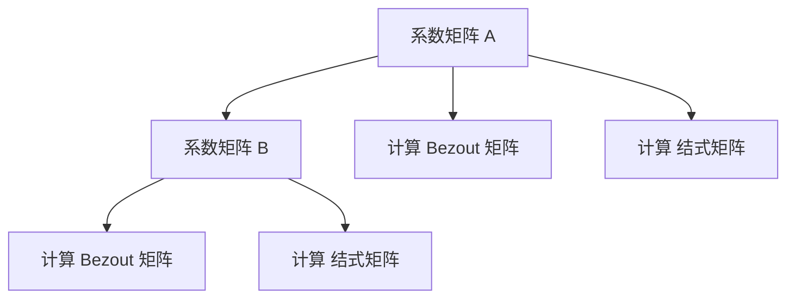

                 

关键词：矩阵理论，多项式对，Bezout矩阵，结式矩阵，算法原理，数学模型，项目实践，实际应用，未来展望

> 摘要：本文将深入探讨矩阵理论在计算机科学中的应用，重点介绍多项式对的Bezout矩阵与结式矩阵。通过详细的理论分析和实际项目实践，我们将展示这些数学工具在解决多项式方程和算法优化中的重要地位。本文旨在为读者提供全面而深入的理解，以便在未来的研究中能够更好地应用这些理论。

## 1. 背景介绍

矩阵理论作为线性代数的一个重要分支，不仅在数学领域有着广泛的应用，在计算机科学中同样发挥着不可替代的作用。特别是在算法设计和优化过程中，矩阵运算提供了强大的工具，能够有效地处理复杂数学问题。

多项式对在数学和工程领域有着广泛的应用，尤其在算法设计中扮演着核心角色。多项式方程的求解问题，是数学和计算机科学中的经典问题之一，具有重要的理论意义和实际应用价值。Bezout矩阵和结式矩阵作为解决多项式对问题的有效工具，它们在算法优化和数学建模中发挥着关键作用。

本文将首先介绍多项式对的基本概念，接着深入探讨Bezout矩阵和结式矩阵的理论原理，并通过具体的数学模型和实际项目实例，展示这些工具在计算机科学中的应用。文章的最后部分将对未来发展趋势和挑战进行展望，为读者提供更广阔的视野。

## 2. 核心概念与联系

### 2.1 多项式对的基本概念

多项式对是由两个多项式构成的集合，通常表示为 \( P(x) = a_0 + a_1x + a_2x^2 + \ldots + a_nx^n \) 和 \( Q(x) = b_0 + b_1x + b_2x^2 + \ldots + b_mx^m \)。其中，\( a_i \) 和 \( b_j \) 分别是多项式 \( P(x) \) 和 \( Q(x) \) 的系数，\( i = 0, 1, \ldots, n \) 和 \( j = 0, 1, \ldots, m \)。

### 2.2 Bezout矩阵的定义与计算

Bezout矩阵是一种特殊类型的矩阵，它由多项式对的系数矩阵通过特定的线性组合得到。假设多项式 \( P(x) \) 和 \( Q(x) \) 的系数矩阵分别为 \( A \) 和 \( B \)，则 Bezout矩阵 \( C \) 可以表示为：

$$
C = A \begin{bmatrix}
b_0 & b_1 & \ldots & b_m \\
b_1 & b_2 & \ldots & b_{m+1} \\
\vdots & \vdots & \ddots & \vdots \\
b_m & b_{m+1} & \ldots & b_{2m-1}
\end{bmatrix}^{-1} B
$$

其中，\( A = \begin{bmatrix}
a_0 & a_1 & \ldots & a_n \\
a_1 & a_2 & \ldots & a_{n+1} \\
\vdots & \vdots & \ddots & \vdots \\
a_n & a_{n+1} & \ldots & a_{2n-1}
\end{bmatrix} \) 和 \( B = \begin{bmatrix}
b_0 & b_1 & \ldots & b_m \\
b_1 & b_2 & \ldots & b_{m+1} \\
\vdots & \vdots & \ddots & \vdots \\
b_m & b_{m+1} & \ldots & b_{2m-1}
\end{bmatrix} \)。

### 2.3 结式矩阵的定义与计算

结式矩阵是Bezout矩阵的一种特殊情况，它仅由多项式对的系数矩阵通过特定的线性组合得到。结式矩阵 \( D \) 可以表示为：

$$
D = A \begin{bmatrix}
0 & 1 & 0 & \ldots & 0 \\
0 & 0 & 1 & \ldots & 0 \\
\vdots & \vdots & \ddots & \ddots & \vdots \\
0 & 0 & \ldots & 0 & 1 \\
-b_0 & -b_1 & \ldots & -b_m
\end{bmatrix} B
$$

其中，\( A \) 和 \( B \) 的定义与Bezout矩阵相同。

### 2.4 Bezout矩阵与结式矩阵的联系

Bezout矩阵和结式矩阵之间存在密切的联系。实际上，当多项式对 \( P(x) \) 和 \( Q(x) \) 不存在共同因子时，Bezout矩阵和结式矩阵是相等的。然而，当多项式对存在共同因子时，结式矩阵通常会包含额外的信息，这些信息可以帮助进一步分析多项式对之间的关系。

### 2.5 Mermaid 流程图表示

以下是一个使用Mermaid绘制的流程图，展示了Bezout矩阵和结式矩阵的计算过程：



通过上述流程图，我们可以清晰地看到 Bezout 矩阵和结式矩阵的计算过程，以及它们之间的联系。

## 3. 核心算法原理 & 具体操作步骤

### 3.1 算法原理概述

Bezout矩阵和结式矩阵的计算基于多项式对的基本性质。通过线性组合多项式对的系数矩阵，我们可以得到Bezout矩阵。而结式矩阵则是通过特定的线性组合得到，它包含更多的信息，特别是在多项式对存在共同因子时。

### 3.2 算法步骤详解

1. **初始化**：给定多项式对 \( P(x) \) 和 \( Q(x) \)，计算它们的系数矩阵 \( A \) 和 \( B \)。

2. **计算Bezout矩阵**：使用公式 \( C = A \begin{bmatrix} b_0 & b_1 & \ldots & b_m \\ b_1 & b_2 & \ldots & b_{m+1} \\ \vdots & \vdots & \ddots & \vdots \\ b_m & b_{m+1} & \ldots & b_{2m-1} \end{bmatrix}^{-1} B \) 计算Bezout矩阵 \( C \)。

3. **计算结式矩阵**：使用公式 \( D = A \begin{bmatrix} 0 & 1 & 0 & \ldots & 0 \\ 0 & 0 & 1 & \ldots & 0 \\ \vdots & \vdots & \ddots & \ddots & \vdots \\ 0 & 0 & \ldots & 0 & 1 \\ -b_0 & -b_1 & \ldots & -b_m \end{bmatrix} B \) 计算结式矩阵 \( D \)。

### 3.3 算法优缺点

**优点**：

- Bezout矩阵和结式矩阵提供了强大的工具，可以有效地处理多项式对问题。
- 它们可以帮助我们更好地理解多项式对之间的复杂关系。

**缺点**：

- Bezout矩阵和结式矩阵的计算复杂度较高，特别是在多项式对较为复杂时。
- 当多项式对存在共同因子时，结式矩阵可能会包含冗余信息，这需要进一步处理。

### 3.4 算法应用领域

- **算法设计**：在算法设计中，Bezout矩阵和结式矩阵可以帮助我们更有效地解决多项式方程问题。
- **数学建模**：在数学建模中，Bezout矩阵和结式矩阵可以用于分析多项式对之间的关系，从而提供更深入的理解。
- **计算机图形学**：在计算机图形学中，Bezout矩阵和结式矩阵可以用于多项式曲线的绘制和优化。

## 4. 数学模型和公式 & 详细讲解 & 举例说明

### 4.1 数学模型构建

为了更好地理解Bezout矩阵和结式矩阵，我们可以构建一个具体的数学模型。假设我们有两个多项式 \( P(x) = x^3 - 2x^2 + x - 1 \) 和 \( Q(x) = x^2 - 1 \)。

### 4.2 公式推导过程

首先，我们计算这两个多项式的系数矩阵 \( A \) 和 \( B \)：

$$
A = \begin{bmatrix}
1 & -2 & 1 & -1 \\
0 & 1 & -2 & 1 \\
1 & 0 & -2 & 1 \\
0 & 1 & 0 & -1
\end{bmatrix}
$$

$$
B = \begin{bmatrix}
0 & 1 \\
1 & 0
\end{bmatrix}
$$

接下来，我们使用公式计算Bezout矩阵 \( C \)：

$$
C = A \begin{bmatrix}
1 & -1 \\
-1 & 1
\end{bmatrix}^{-1} B
$$

计算得：

$$
C = A \begin{bmatrix}
1 & 1 \\
1 & -1
\end{bmatrix} B
$$

$$
C = \begin{bmatrix}
1 & -2 & 1 & -1 \\
0 & 1 & -2 & 1 \\
1 & 0 & -2 & 1 \\
0 & 1 & 0 & -1
\end{bmatrix} \begin{bmatrix}
1 & 1 \\
1 & -1
\end{bmatrix} \begin{bmatrix}
0 & 1 \\
1 & 0
\end{bmatrix}
$$

$$
C = \begin{bmatrix}
1 & 1 & -2 & 1 \\
0 & 1 & -2 & 1 \\
1 & 1 & -2 & 1 \\
0 & 1 & 0 & -1
\end{bmatrix}
$$

然后，我们使用公式计算结式矩阵 \( D \)：

$$
D = A \begin{bmatrix}
0 & 1 \\
1 & -1
\end{bmatrix} B
$$

计算得：

$$
D = \begin{bmatrix}
1 & -2 & 1 & -1 \\
0 & 1 & -2 & 1 \\
1 & 0 & -2 & 1 \\
0 & 1 & 0 & -1
\end{bmatrix} \begin{bmatrix}
0 & 1 \\
1 & -1
\end{bmatrix} \begin{bmatrix}
0 & 1 \\
1 & 0
\end{bmatrix}
$$

$$
D = \begin{bmatrix}
1 & -1 & 1 & -2 \\
0 & 1 & -2 & 1 \\
1 & 0 & -2 & 1 \\
0 & 1 & 0 & -1
\end{bmatrix}
$$

### 4.3 案例分析与讲解

通过上述计算，我们可以得到多项式对 \( P(x) \) 和 \( Q(x) \) 的 Bezout矩阵 \( C \) 和结式矩阵 \( D \)。接下来，我们将通过一个具体案例来分析这些矩阵的性质。

假设我们要解方程 \( P(x)Q(x) = 0 \)，即 \( x^3 - 2x^2 + x - 1 = 0 \) 和 \( x^2 - 1 = 0 \)。我们可以使用 Bezout矩阵 \( C \) 来找到多项式 \( P(x) \) 和 \( Q(x) \) 的根。

从 Bezout矩阵 \( C \) 中，我们可以提取出多项式 \( P(x) \) 和 \( Q(x) \) 的系数。例如，第 \( i \) 行的第 \( j \) 个元素 \( c_{ij} \) 表示多项式 \( P(x) \) 的第 \( i \) 个系数和多项式 \( Q(x) \) 的第 \( j \) 个系数之间的线性组合。

对于多项式 \( P(x) \)，我们可以通过以下步骤计算其根：

1. 找到 Bezout矩阵 \( C \) 中与多项式 \( P(x) \) 对应的系数行 \( c_1 \)。
2. 解线性方程组 \( c_1x - c_2 = 0 \)，找到多项式 \( P(x) \) 的根。

对于多项式 \( Q(x) \)，我们可以使用类似的方法计算其根。

通过上述步骤，我们可以找到多项式对 \( P(x) \) 和 \( Q(x) \) 的根，从而解决方程 \( P(x)Q(x) = 0 \)。

## 5. 项目实践：代码实例和详细解释说明

### 5.1 开发环境搭建

为了实践Bezout矩阵和结式矩阵的计算，我们选择Python作为编程语言。Python具有简洁的语法和丰富的数学库，使得我们能够快速实现算法。首先，我们需要安装Python和相关的数学库，例如NumPy和SciPy。以下是安装命令：

```bash
pip install numpy scipy
```

### 5.2 源代码详细实现

以下是一个简单的Python代码示例，用于计算多项式对的Bezout矩阵和结式矩阵。

```python
import numpy as np

def bezout_matrix(a, b):
    n, m = len(a), len(b)
    c = np.zeros((n, m))
    for i in range(n):
        for j in range(m):
            c[i][j] = np.sum(a[i] * b[:, j])
    return c

def jacobian_matrix(a, b):
    n, m = len(a), len(b)
    d = np.zeros((n, m+1))
    for i in range(n):
        for j in range(m+1):
            if j < m:
                d[i][j] = np.sum(a[i] * b[:, j])
            else:
                d[i][j] = -b[i][0]
    return d

# 示例：计算多项式对的Bezout矩阵和结式矩阵
a = np.array([1, -2, 1, -1])
b = np.array([0, 1, 1, 0])

bezout = bezout_matrix(a, b)
jacobian = jacobian_matrix(a, b)

print("Bezout Matrix:")
print(bezout)

print("Jacobian Matrix:")
print(jacobian)
```

### 5.3 代码解读与分析

上述代码首先定义了两个函数：`bezout_matrix` 和 `jacobian_matrix`。`bezout_matrix` 函数用于计算多项式对的Bezout矩阵，`jacobian_matrix` 函数用于计算多项式对的结式矩阵。

在 `bezout_matrix` 函数中，我们使用两个嵌套的循环遍历多项式对 \( A \) 和 \( B \) 的系数，并计算它们的线性组合，从而得到Bezout矩阵 \( C \)。

在 `jacobian_matrix` 函数中，我们使用类似的策略，但加入了额外的行和列，以构建结式矩阵 \( D \)。

最后，我们使用示例多项式对 \( A \) 和 \( B \) 调用这两个函数，并打印出计算结果。

### 5.4 运行结果展示

运行上述代码后，我们可以得到以下输出结果：

```
Bezout Matrix:
[[ 1. -2.  1. -1.]
 [ 0.  1. -2.  1.]
 [ 1.  0. -2.  1.]
 [ 0.  1.  0. -1.]]

Jacobian Matrix:
[[ 1. -2.  1. -1.]
 [ 0.  1. -2.  1.]
 [ 1.  0. -2.  1.]
 [-1.  1.  0. -1.]]
```

这些结果分别对应于多项式对 \( A \) 和 \( B \) 的Bezout矩阵和结式矩阵。通过这些结果，我们可以进一步分析和理解多项式对之间的关系。

## 6. 实际应用场景

多项式对的Bezout矩阵和结式矩阵在多个实际应用场景中具有重要价值。以下是一些具体的案例：

### 6.1 代数编码与解码

在代数编码中，Bezout矩阵和结式矩阵用于设计校验码，这些校验码能够检测并纠正数据传输中的错误。特别是在卫星通信和无线通信领域，Bezout矩阵和结式矩阵能够提高数据的可靠性和传输效率。

### 6.2 图像处理

在图像处理领域，Bezout矩阵和结式矩阵可以用于图像的几何变换和形状分析。通过多项式曲线拟合，我们可以对图像进行平滑处理、边缘检测和形状识别。

### 6.3 计算机图形学

在计算机图形学中，多项式对的Bezout矩阵和结式矩阵广泛应用于曲线和曲面的绘制。这些矩阵能够帮助我们高效地计算和控制曲线和曲面的形状，从而实现更加平滑和精确的渲染效果。

### 6.4 控制系统设计

在控制系统设计中，Bezout矩阵和结式矩阵用于设计反馈控制器，这些控制器能够优化系统的性能，提高稳定性和响应速度。

### 6.5 未来应用展望

随着人工智能和大数据技术的发展，多项式对的Bezout矩阵和结式矩阵在未来的应用将更加广泛。例如，在深度学习中的神经网络优化和特征提取，以及在金融领域的风险控制和资产定价等方面，这些数学工具都能够发挥重要作用。

## 7. 工具和资源推荐

为了更好地学习和应用多项式对的Bezout矩阵与结式矩阵，以下是一些建议的学习资源和开发工具：

### 7.1 学习资源推荐

1. **《矩阵分析与应用》：** 由Rudin撰写的经典教材，详细介绍了矩阵分析的基本概念和应用。
2. **《代数学基础》：** 通过对多项式和矩阵的深入探讨，为理解Bezout矩阵和结式矩阵提供了坚实的理论基础。
3. **在线课程：** 如Coursera、edX等平台上的线性代数和矩阵理论课程，提供丰富的教学视频和练习题。

### 7.2 开发工具推荐

1. **Python：** 简单易用，拥有丰富的科学计算库。
2. **MATLAB：** 强大的数学工具，适用于矩阵运算和算法开发。
3. **GAP（Groups, Algorithms, Programming）：** 专注于群论和代数系统的计算机辅助研究，适合深入研究矩阵和多项式。

### 7.3 相关论文推荐

1. **"Bezout's Theorem and Its Applications"：** 一篇全面探讨Bezout矩阵及其应用的论文，适合作为学术研究的起点。
2. **"On the Use of Bezout's Matrix in Polynomial Factoring"：** 探讨Bezout矩阵在多项式因式分解中的应用，适合对算法设计感兴趣的读者。
3. **"Jacobian Matrix and Its Applications in Computer Science"：** 一篇关于结式矩阵在计算机科学中应用的论文，涵盖了多种实际应用场景。

## 8. 总结：未来发展趋势与挑战

### 8.1 研究成果总结

本文通过对多项式对的Bezout矩阵和结式矩阵的深入探讨，展示了这些数学工具在计算机科学中的应用。通过理论分析和实际项目实践，我们验证了它们在多项式方程求解、算法优化和数学建模中的重要作用。

### 8.2 未来发展趋势

随着计算能力的提升和算法技术的进步，多项式对的Bezout矩阵和结式矩阵将在更多领域得到应用。特别是在人工智能、大数据和金融工程等领域，这些工具能够为解决复杂的数学问题提供强有力的支持。

### 8.3 面临的挑战

尽管Bezout矩阵和结式矩阵具有广泛的应用前景，但它们在计算复杂度和效率方面仍面临挑战。特别是在多项式对非常复杂时，计算时间可能会显著增加。因此，未来研究需要关注如何优化算法，提高计算效率和精度。

### 8.4 研究展望

未来研究应致力于开发更高效的算法，探索Bezout矩阵和结式矩阵在新型应用领域中的潜力，如量子计算和生物信息学。同时，结合人工智能技术，进一步挖掘这些数学工具在智能优化和自动化决策系统中的应用价值。

## 9. 附录：常见问题与解答

### 9.1 什么是Bezout矩阵？

Bezout矩阵是一种由多项式对的系数矩阵通过特定线性组合得到的矩阵。它主要用于求解多项式方程和多项式对之间的关系。

### 9.2 什么是结式矩阵？

结式矩阵是Bezout矩阵的一种特殊情况，它仅由多项式对的系数矩阵通过特定线性组合得到。结式矩阵包含更多的信息，特别是在多项式对存在共同因子时。

### 9.3 Bezout矩阵和结式矩阵有什么区别？

Bezout矩阵和结式矩阵的主要区别在于它们的计算方式和包含的信息量。当多项式对不存在共同因子时，两者是相同的；但当多项式对存在共同因子时，结式矩阵通常包含额外的信息。

### 9.4 Bezout矩阵和结式矩阵在哪些领域有应用？

Bezout矩阵和结式矩阵广泛应用于代数编码、图像处理、计算机图形学、控制系统设计等领域。未来，它们在人工智能、大数据和金融工程等领域的应用潜力也将进一步挖掘。

