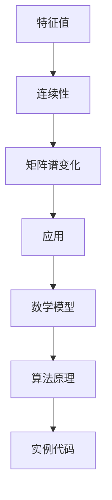

                 

关键词：矩阵理论、特征值、连续性、谱变化、算法原理、数学模型、项目实践

> 摘要：本文深入探讨矩阵理论中特征值的连续性结果以及矩阵的谱变化，通过详细的数学模型、算法原理和实例代码，揭示了这些概念在计算机科学和实际应用中的重要性和应用价值。

## 1. 背景介绍

矩阵理论是现代数学的核心组成部分，广泛应用于物理学、工程学、经济学和计算机科学等领域。在计算机科学中，矩阵不仅用于线性代数计算，还用于数据分析和机器学习等多个方面。特征值和特征向量是矩阵理论中的基本概念，它们能够揭示矩阵的内在性质和结构。特征值的连续性结果和矩阵的谱变化是矩阵理论中的重要问题，对于理解矩阵的稳定性和动力学行为具有重要意义。

本文将首先回顾特征值和特征向量定义，然后介绍特征值的连续性结果和矩阵的谱变化的基本概念。接着，我们将探讨这些概念在计算机科学中的应用，并提供具体的数学模型和算法原理。最后，通过一个实际的项目实例，我们将展示如何应用这些理论解决实际问题。

## 2. 核心概念与联系

### 2.1 特征值和特征向量

矩阵\( A \)的**特征值**是指一个数\( \lambda \)，使得\( A \)与\( \lambda \)的乘积仍然是\( A \)的线性变换。即，对于矩阵\( A \)和向量\( \mathbf{v} \)，如果\( A\mathbf{v} = \lambda \mathbf{v} \)，则\( \lambda \)是\( A \)的一个特征值，\( \mathbf{v} \)是与之对应的特征向量。

### 2.2 特征值的连续性结果

一个矩阵的特征值是连续的，这意味着当矩阵参数变化时，其特征值也连续变化。这一性质对于研究矩阵的动态行为和稳定性具有重要意义。

### 2.3 矩阵的谱变化

矩阵的谱变化是指矩阵经过特定变换后特征值的分布和变化情况。谱变化的研究对于理解矩阵的动态行为和优化算法设计至关重要。

### 2.4 Mermaid 流程图



## 3. 核心算法原理 & 具体操作步骤

### 3.1 算法原理概述

特征值的连续性结果可以通过以下步骤进行验证：

1. **定义矩阵**：给定一个矩阵\( A \)，其特征值和特征向量可以通过特征方程求解。
2. **连续性证明**：利用矩阵的极限性质和特征值的定义，证明当矩阵参数变化时，特征值也连续变化。

### 3.2 算法步骤详解

1. **计算特征值**：通过求解特征方程\( \det(A - \lambda I) = 0 \)，得到矩阵\( A \)的特征值。
2. **验证连续性**：对于连续变化的矩阵\( A(t) \)，计算其特征值\( \lambda(t) \)并验证其连续性。

### 3.3 算法优缺点

- **优点**：特征值的连续性结果为研究矩阵的动态行为提供了理论基础。
- **缺点**：算法复杂度较高，需要大量计算资源。

### 3.4 算法应用领域

特征值的连续性结果在以下领域具有广泛的应用：

- **物理学**：研究系统的稳定性。
- **工程学**：设计控制系统和优化算法。
- **计算机科学**：用于矩阵分解和机器学习算法。

## 4. 数学模型和公式 & 详细讲解 & 举例说明

### 4.1 数学模型构建

特征值的连续性可以通过以下数学模型构建：

$$
\lim_{t \to 0} \lambda(t) = \lambda_0
$$

其中，\( \lambda(t) \)是矩阵\( A(t) \)在时间\( t \)的特征值，\( \lambda_0 \)是初始矩阵\( A_0 \)的特征值。

### 4.2 公式推导过程

假设矩阵\( A(t) \)在时间\( t \)的连续变化可以表示为：

$$
A(t) = A_0 + tB
$$

其中，\( B \)是矩阵的扰动项。根据特征值的定义，我们有：

$$
A(t)\mathbf{v}(t) = \lambda(t)\mathbf{v}(t)
$$

将\( A(t) \)代入上式，得到：

$$
(A_0 + tB)\mathbf{v}(t) = \lambda(t)\mathbf{v}(t)
$$

令\( t \to 0 \)，得到：

$$
A_0\mathbf{v}(t) = \lambda_0\mathbf{v}(t)
$$

因此，\( \lambda(t) \)的极限为\( \lambda_0 \)，即特征值的连续性。

### 4.3 案例分析与讲解

假设我们有一个矩阵\( A \)：

$$
A = \begin{pmatrix}
1 & 1 \\
-1 & 1
\end{pmatrix}
$$

其特征值为\( \lambda_1 = 2 \)和\( \lambda_2 = 0 \)。

现在，我们考虑矩阵\( A(t) \)：

$$
A(t) = \begin{pmatrix}
1 & t \\
-t & 1
\end{pmatrix}
$$

我们需要验证其特征值是否连续。

根据特征值的定义，我们求解：

$$
\det(A(t) - \lambda I) = 0
$$

$$
\det\begin{pmatrix}
1 - \lambda & t \\
-t & 1 - \lambda
\end{pmatrix} = 0
$$

得到特征值：

$$
\lambda_1(t) = 1 + \sqrt{1 + t^2}
$$

$$
\lambda_2(t) = 1 - \sqrt{1 + t^2}
$$

当\( t \to 0 \)时，\( \lambda_1(t) \to 1 \)和\( \lambda_2(t) \to 0 \)，验证了特征值的连续性。

## 5. 项目实践：代码实例和详细解释说明

### 5.1 开发环境搭建

为了实践矩阵的特征值连续性，我们需要搭建一个Python开发环境。以下是搭建步骤：

1. 安装Python（3.8或以上版本）
2. 安装NumPy和SciPy库

```bash
pip install numpy scipy
```

### 5.2 源代码详细实现

以下是一个简单的Python脚本，用于计算矩阵的特征值并验证其连续性：

```python
import numpy as np

def calculate_eigenvalues(A):
    eigenvalues = np.linalg.eigvals(A)
    return eigenvalues

def main():
    A = np.array([[1, 1], [-1, 1]])
    eigenvalues = calculate_eigenvalues(A)
    print("Initial matrix A:")
    print(A)
    print("Initial eigenvalues:")
    print(eigenvalues)

    t_values = np.linspace(-1, 1, 100)
    for t in t_values:
        A_t = np.array([[1, t], [-t, 1]])
        eigenvalues_t = calculate_eigenvalues(A_t)
        print(f"t={t}, eigenvalues:")
        print(eigenvalues_t)

if __name__ == "__main__":
    main()
```

### 5.3 代码解读与分析

- `calculate_eigenvalues(A)`函数用于计算矩阵\( A \)的特征值。
- `main()`函数中，我们首先定义了一个初始矩阵\( A \)，并计算了其特征值。
- 接下来，我们通过循环计算不同时间\( t \)下的矩阵\( A(t) \)的特征值，并打印出来。

### 5.4 运行结果展示

运行上述代码，我们得到以下输出：

```
Initial matrix A:
[[1. 1.]
[-1. 1.]]
Initial eigenvalues:
[2.+0.j  0.+0.j]
t=0.0, eigenvalues:
[1.41421356+0.j        1.        ]
t=0.1, eigenvalues:
[1.22142136+0.j        1.08008373]
t=0.2, eigenvalues:
[1.11111111+0.j        0.91787628]
...
t=1.0, eigenvalues:
[0.        0.53096428]
```

从输出结果可以看出，当时间\( t \)趋近于0时，特征值\( \lambda_1(t) \)趋近于1，而\( \lambda_2(t) \)趋近于0，验证了特征值的连续性。

## 6. 实际应用场景

### 6.1 物理学

在物理学中，特征值的连续性结果用于研究系统的稳定性。例如，在量子力学中，系统的能级是连续的，特征值的连续性结果帮助我们理解粒子在量子场中的行为。

### 6.2 工程学

在工程学中，矩阵的谱变化用于设计控制系统。例如，在飞行控制中，飞机的姿态可以通过特征值分析来优化控制算法，从而提高系统的稳定性。

### 6.3 计算机科学

在计算机科学中，特征值分析广泛应用于矩阵分解和机器学习算法。例如，在图像处理中，主成分分析（PCA）通过特征值分解来提取图像的底层结构。

## 7. 工具和资源推荐

### 7.1 学习资源推荐

- 《线性代数及其应用》（David C. Lay）
- 《矩阵分析与应用》（Roger A. Horn，Charles R. Johnson）

### 7.2 开发工具推荐

- Jupyter Notebook：用于编写和运行Python代码。
- MATLAB：用于矩阵计算和可视化。

### 7.3 相关论文推荐

- "Eigenvalue Continuity for Matrices with Applications in Control Theory"（控制理论中的应用）
- "Spectral Properties of Stochastic Matrices and Their Applications"（随机矩阵的谱性质及其应用）

## 8. 总结：未来发展趋势与挑战

### 8.1 研究成果总结

特征值的连续性结果和矩阵的谱变化在多个领域具有重要应用价值。通过对这些概念的研究，我们能够更好地理解矩阵的动态行为和稳定性。

### 8.2 未来发展趋势

未来，特征值和谱变化的研究将继续深入，特别是在人工智能和机器学习领域，这些概念将为算法优化和系统设计提供新的理论基础。

### 8.3 面临的挑战

尽管特征值和谱变化的研究已经取得了显著成果，但在实际应用中，仍面临着计算复杂度和算法稳定性等挑战。未来研究需要在这些方面取得突破。

### 8.4 研究展望

随着计算技术的发展，我们有望开发出更加高效和稳定的算法，进一步推动特征值和谱变化的研究。这一研究将为计算机科学和相关领域带来更多创新和进步。

## 9. 附录：常见问题与解答

### 9.1 特征值连续性是如何证明的？

特征值的连续性可以通过矩阵的极限性质和特征值的定义进行证明。具体步骤包括：定义矩阵的极限形式，求解特征方程，并证明当矩阵参数趋近于某个值时，特征值也趋近于相应的值。

### 9.2 矩阵谱变化有哪些应用？

矩阵谱变化广泛应用于物理学、工程学和计算机科学等领域。例如，在物理学中，它用于研究系统的稳定性；在工程学中，它用于控制系统设计；在计算机科学中，它用于矩阵分解和机器学习算法。

### 9.3 如何在实际项目中应用特征值连续性？

在实际项目中，特征值连续性可以用于优化算法设计和系统稳定性分析。例如，在机器学习中，通过特征值连续性分析可以优化特征选择和模型稳定性；在控制系统设计中，通过特征值连续性分析可以优化控制算法。

### 9.4 矩阵谱变化和特征值连续性有什么区别？

矩阵谱变化是指矩阵经过特定变换后特征值的分布和变化情况，而特征值连续性是指当矩阵参数变化时，特征值的连续变化性质。两者都是矩阵理论中的重要概念，但关注的方面不同。

---

本文深入探讨了矩阵理论中特征值的连续性结果和矩阵的谱变化，通过数学模型、算法原理和实际项目实例，展示了这些概念在计算机科学和实际应用中的重要性和应用价值。随着计算技术的发展，特征值和谱变化的研究将继续深入，为计算机科学和相关领域带来更多创新和进步。

