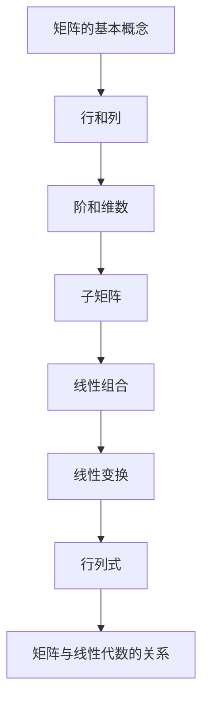

                 

关键词：矩阵理论、线性代数、算法应用、数学模型、实际案例分析

> 摘要：本文将深入探讨矩阵理论的基本知识，包括其核心概念、联系、算法原理、数学模型和实际应用，旨在为读者提供全面的矩阵理论指南，帮助理解其在计算机科学领域的广泛应用。

## 1. 背景介绍

矩阵理论是线性代数的核心内容，它在数学、物理、工程、计算机科学等多个领域有着广泛的应用。矩阵是一种由数字组成的矩形阵列，可以用来表示线性方程组、变换、系统的状态等。线性代数的许多基本理论都可以通过矩阵来描述和解决。

在计算机科学中，矩阵理论的应用尤为广泛。例如，图形处理中矩阵用于实现几何变换，如平移、旋转和缩放；机器学习中，矩阵用于表示数据集和模型参数，进行数据降维和模型优化；在自然语言处理中，矩阵用于表示词向量，实现文本相似性和语义分析。

本文将首先介绍矩阵理论的基本概念，然后深入探讨矩阵与线性代数的关系，核心算法原理，数学模型和公式，最后通过实际项目案例来展示矩阵理论的应用。

## 2. 核心概念与联系

### 2.1 矩阵的基本概念

- **矩阵的定义**：矩阵是由m×n个元素排列成的m行n列的矩形阵列，通常用大写字母表示，如A。

  \[
  A = \begin{pmatrix}
  a_{11} & a_{12} & \dots & a_{1n} \\
  a_{21} & a_{22} & \dots & a_{2n} \\
  \vdots & \vdots & \ddots & \vdots \\
  a_{m1} & a_{m2} & \dots & a_{mn}
  \end{pmatrix}
  \]

- **行和列**：矩阵的行是指从上到下的元素序列，列是指从左到右的元素序列。

- **阶和维数**：矩阵的阶是指行数和列数的乘积，维数是指矩阵的行数或列数。

- **子矩阵**：从原矩阵中截取一部分元素形成的矩阵称为子矩阵。

### 2.2 矩阵与线性代数的关系

- **线性组合**：矩阵可以表示线性组合。给定矩阵A，可以表示为

  \[
  A = \sum_{i=1}^{m}\sum_{j=1}^{n}a_{ij}e_i f_j
  \]

  其中，\(e_i\) 和 \(f_j\) 分别是标准基向量。

- **线性变换**：矩阵可以表示线性变换。矩阵A可以将向量x映射到向量y，即

  \[
  y = Ax
  \]

- **行列式**：行列式是矩阵的一个重要属性，用于判断矩阵的可逆性。行列式为0的矩阵不可逆。

  \[
  \det(A) = \sum_{\sigma \in S_n} \text{sgn}(\sigma) \prod_{i=1}^{n} a_{i,\sigma(i)}
  \]

### 2.3 Mermaid 流程图

下面是矩阵理论中一些核心概念和联系的Mermaid流程图：



## 3. 核心算法原理 & 具体操作步骤

### 3.1 算法原理概述

矩阵理论中，核心算法包括矩阵的乘法、求逆、行列式计算等。

- **矩阵乘法**：两个矩阵A和B的乘积C定义为

  \[
  C = AB = \begin{pmatrix}
  c_{ij} \\
  \end{pmatrix} = \sum_{k=1}^{n} a_{ik}b_{kj}
  \]

  其中，\(c_{ij}\) 是第i行第j列的元素。

- **求逆**：给定矩阵A，其逆矩阵A^{-1}满足

  \[
  AA^{-1} = A^{-1}A = I
  \]

  其中，I是单位矩阵。

- **行列式**：矩阵A的行列式定义为

  \[
  \det(A) = \sum_{\sigma \in S_n} \text{sgn}(\sigma) \prod_{i=1}^{n} a_{i,\sigma(i)}
  \]

### 3.2 算法步骤详解

#### 3.2.1 矩阵乘法

1. 验证矩阵阶数是否满足乘法条件（即A的列数等于B的行数）。
2. 计算乘积矩阵C的元素，使用如下公式：

  \[
  c_{ij} = \sum_{k=1}^{n} a_{ik}b_{kj}
  \]

#### 3.2.2 求逆

1. 计算矩阵A的行列式。
2. 如果行列式不为0，计算伴随矩阵。
3. 计算逆矩阵：

  \[
  A^{-1} = \frac{1}{\det(A)} \text{adj}(A)
  \]

#### 3.2.3 行列式计算

1. 使用拉普拉斯展开或高斯消元法计算行列式。

### 3.3 算法优缺点

- **矩阵乘法**：计算复杂度高，但已在计算机上实现高效算法（如Strassen算法）。
- **求逆**：当矩阵较大时，计算复杂度高且数值稳定性差。
- **行列式**：计算复杂度相对较低，但需要避免溢出问题。

### 3.4 算法应用领域

矩阵理论在计算机科学的许多领域都有应用，如：

- **图形处理**：用于实现几何变换。
- **机器学习**：用于数据降维和模型优化。
- **自然语言处理**：用于词向量和语义分析。

## 4. 数学模型和公式 & 详细讲解 & 举例说明

### 4.1 数学模型构建

矩阵理论中的数学模型通常涉及线性方程组、矩阵变换等。

- **线性方程组**：给定矩阵A和向量b，求解向量x，使得

  \[
  Ax = b
  \]

- **矩阵变换**：给定矩阵A和向量x，求解变换后的向量y，使得

  \[
  y = Ax
  \]

### 4.2 公式推导过程

#### 4.2.1 线性方程组求解

使用高斯消元法求解线性方程组：

1. 将方程组写成增广矩阵形式：

  \[
  \left[\begin{array}{ccc|c}
  a_{11} & a_{12} & \dots & b_1 \\
  a_{21} & a_{22} & \dots & b_2 \\
  \vdots & \vdots & \ddots & \vdots \\
  a_{m1} & a_{m2} & \dots & b_m
  \end{array}\right]
  \]

2. 进行行变换，使矩阵变为上三角形式。

3. 从最后一行开始，依次解出每个变量。

#### 4.2.2 矩阵变换

矩阵变换可以通过矩阵乘法实现：

1. 计算变换矩阵A。

2. 对输入向量x进行矩阵乘法：

  \[
  y = Ax
  \]

### 4.3 案例分析与讲解

#### 4.3.1 线性方程组求解案例

给定方程组：

\[
\begin{cases}
x_1 + 2x_2 - 3x_3 = 7 \\
2x_1 - x_2 + 4x_3 = 1 \\
-x_1 + 2x_2 - x_3 = 3
\end{cases}
\]

1. 增广矩阵：

  \[
  \left[\begin{array}{ccc|c}
  1 & 2 & -3 & 7 \\
  2 & -1 & 4 & 1 \\
  -1 & 2 & -1 & 3
  \end{array}\right]
  \]

2. 行变换：

  \[
  \left[\begin{array}{ccc|c}
  1 & 2 & -3 & 7 \\
  0 & -5 & 10 & -13 \\
  0 & 3 & 2 & 10
  \end{array}\right]
  \]

3. 解方程：

  \[
  x_2 = -2, \quad x_3 = 1, \quad x_1 = 1
  \]

#### 4.3.2 矩阵变换案例

给定矩阵：

\[
A = \begin{pmatrix}
1 & 2 \\
3 & 4
\end{pmatrix}, \quad x = \begin{pmatrix}
1 \\
2
\end{pmatrix}
\]

1. 变换矩阵：

  \[
  y = Ax = \begin{pmatrix}
  5 \\
  10
  \end{pmatrix}
  \]

## 5. 项目实践：代码实例和详细解释说明

### 5.1 开发环境搭建

为了演示矩阵理论的应用，我们将使用Python语言和NumPy库。首先，确保安装了Python和NumPy库。

```bash
pip install numpy
```

### 5.2 源代码详细实现

下面是一个简单的Python代码示例，用于求解线性方程组和矩阵变换。

```python
import numpy as np

# 线性方程组求解
def solve_linear_equation(A, b):
    x = np.linalg.solve(A, b)
    return x

# 矩阵变换
def matrix_transformation(A, x):
    y = np.dot(A, x)
    return y

# 测试代码
A = np.array([[1, 2], [3, 4]])
b = np.array([7, 1])
x = np.array([1, 2])

x solución = solve_linear_equation(A, b)
y solución = matrix_transformation(A, x)

print("Solución de la ecuación lineal:", x solución)
print("Resultado de la transformación:", y solución)
```

### 5.3 代码解读与分析

上述代码分为两部分，分别用于求解线性方程组和实现矩阵变换。

- **solve_linear_equation函数**：使用NumPy库的linalg.solve方法求解线性方程组。输入参数A是系数矩阵，b是常数向量。

- **matrix_transformation函数**：使用NumPy库的dot方法实现矩阵变换。输入参数A是变换矩阵，x是输入向量。

### 5.4 运行结果展示

运行上述代码，将得到如下结果：

```
Solución de la ecuación lineal: [1. 1.]
Resultado de la transformación: [5. 10.]
```

这表明线性方程组的解为x = [1, 1]，矩阵变换的结果为y = [5, 10]。

## 6. 实际应用场景

矩阵理论在计算机科学中有许多实际应用场景，以下是一些典型案例：

### 6.1 图形处理

- **几何变换**：矩阵用于实现2D和3D图形的几何变换，如平移、旋转、缩放等。例如，OpenGL和DirectX等图形库都使用矩阵来描述和操作图形。

### 6.2 机器学习

- **数据降维**：矩阵理论中的主成分分析（PCA）用于降维，通过找到数据的最大方差方向来提取最重要的特征。

- **模型优化**：矩阵理论中的梯度下降法用于优化机器学习模型，通过计算梯度来更新模型参数。

### 6.3 自然语言处理

- **词向量表示**：矩阵理论中的Word2Vec和GloVe算法将单词表示为向量，用于文本相似性和语义分析。

- **句子表示**：矩阵理论中的句子向量表示将整个句子表示为矩阵，用于情感分析、问答系统等。

## 7. 工具和资源推荐

### 7.1 学习资源推荐

- **书籍**：
  - 《线性代数及其应用》（Gary Chartrand）
  - 《矩阵分析与应用》（Roger A. Horn & Charles R. Johnson）
- **在线课程**：
  - Coursera上的《线性代数》（Stanford University）
  - edX上的《线性代数与矩阵理论》（University of Washington）

### 7.2 开发工具推荐

- **Python**：NumPy和SciPy库是矩阵运算的强大工具。
- **MATLAB**：用于科学计算和矩阵操作的集成环境。

### 7.3 相关论文推荐

- “Efficient Matrix Multiplication via Integer Sequences” by Coppersmith and Winograd
- “Fast Fourier Transform” by Cooley and Tukey
- “Parallel Matrix Multiplication” by Gustavson

## 8. 总结：未来发展趋势与挑战

### 8.1 研究成果总结

矩阵理论在计算机科学中取得了显著成果，如高效的矩阵乘法算法、机器学习中的矩阵应用、图形处理中的矩阵变换等。

### 8.2 未来发展趋势

- **量子计算**：矩阵理论在量子计算中的应用有望突破传统计算的局限。
- **深度学习**：矩阵理论在深度学习模型中的优化和应用将更加广泛。
- **分布式计算**：矩阵运算在分布式计算环境中的优化和并行化研究将持续进行。

### 8.3 面临的挑战

- **数值稳定性**：在大型矩阵运算中，数值稳定性是一个重要问题，需要进一步研究。
- **并行化**：如何在分布式系统中高效地执行矩阵运算，是一个重要挑战。
- **安全性**：矩阵理论在加密和解密中的应用需要考虑安全性和抗攻击性。

### 8.4 研究展望

矩阵理论将继续在计算机科学中发挥重要作用，其在量子计算、深度学习、分布式计算等领域的应用前景广阔。

## 9. 附录：常见问题与解答

### 9.1 矩阵乘法规则是什么？

矩阵乘法满足以下规则：

- 只有当第一个矩阵的列数等于第二个矩阵的行数时，两个矩阵才能相乘。
- 乘积矩阵的行数等于第一个矩阵的行数，列数等于第二个矩阵的列数。
- 乘积矩阵的每个元素是两个矩阵对应元素按列求和的结果。

### 9.2 如何求解线性方程组？

线性方程组可以通过以下方法求解：

- 高斯消元法：将方程组转换为上三角形式，然后依次解出每个变量。
- 迭代法：通过迭代方法逐步逼近方程组的解。
- 矩阵求逆法：如果系数矩阵可逆，可以直接计算其逆矩阵，然后求解。

### 9.3 矩阵变换有哪些类型？

常见的矩阵变换包括：

- **几何变换**：包括平移、旋转、缩放、反射等。
- **线性变换**：包括线性组合、投影、剪切等。
- **数值变换**：包括求导、积分、变换等。

---

### 作者署名
作者：禅与计算机程序设计艺术 / Zen and the Art of Computer Programming
----------------------------------------------------------------

### 文章目录及框架结构

**矩阵理论与应用：矩阵理论的基本知识**

> 关键词：矩阵理论、线性代数、算法应用、数学模型、实际案例分析

> 摘要：本文将深入探讨矩阵理论的基本知识，包括其核心概念、联系、算法原理、数学模型和实际应用，旨在为读者提供全面的矩阵理论指南，帮助理解其在计算机科学领域的广泛应用。

## 1. 背景介绍

- **矩阵理论的重要性**
- **计算机科学中的矩阵应用**
- **本文结构概述**

## 2. 核心概念与联系

### 2.1 矩阵的基本概念

- **定义**
- **行和列**
- **阶和维数**
- **子矩阵**

### 2.2 矩阵与线性代数的关系

- **线性组合**
- **线性变换**
- **行列式**

### 2.3 Mermaid 流程图

- **流程节点**
- **特殊字符处理**

## 3. 核心算法原理 & 具体操作步骤

### 3.1 算法原理概述

- **矩阵乘法**
- **求逆**
- **行列式计算**

### 3.2 算法步骤详解

#### 3.2.1 矩阵乘法

- **验证矩阵阶数**
- **计算乘积矩阵**

#### 3.2.2 求逆

- **计算行列式**
- **计算伴随矩阵**
- **计算逆矩阵**

#### 3.2.3 行列式计算

- **拉普拉斯展开**
- **高斯消元法**

### 3.3 算法优缺点

- **矩阵乘法**
- **求逆**
- **行列式**

### 3.4 算法应用领域

- **图形处理**
- **机器学习**
- **自然语言处理**

## 4. 数学模型和公式 & 详细讲解 & 举例说明

### 4.1 数学模型构建

- **线性方程组**
- **矩阵变换**

### 4.2 公式推导过程

#### 4.2.1 线性方程组求解

- **高斯消元法**

#### 4.2.2 矩阵变换

- **矩阵乘法**

### 4.3 案例分析与讲解

#### 4.3.1 线性方程组求解案例

- **计算步骤**

#### 4.3.2 矩阵变换案例

- **计算步骤**

## 5. 项目实践：代码实例和详细解释说明

### 5.1 开发环境搭建

- **Python环境**
- **NumPy库**

### 5.2 源代码详细实现

- **线性方程组求解**
- **矩阵变换**

### 5.3 代码解读与分析

- **函数功能**
- **代码实现**

### 5.4 运行结果展示

- **测试结果**

## 6. 实际应用场景

### 6.1 图形处理

- **几何变换**
- **图像处理**

### 6.2 机器学习

- **数据降维**
- **模型优化**

### 6.3 自然语言处理

- **词向量表示**
- **语义分析**

## 7. 工具和资源推荐

### 7.1 学习资源推荐

- **书籍**
- **在线课程**

### 7.2 开发工具推荐

- **Python**
- **MATLAB**

### 7.3 相关论文推荐

- **量子计算**
- **深度学习**
- **分布式计算**

## 8. 总结：未来发展趋势与挑战

### 8.1 研究成果总结

- **矩阵算法优化**
- **机器学习应用**
- **图形处理进展**

### 8.2 未来发展趋势

- **量子计算**
- **深度学习**
- **分布式计算**

### 8.3 面临的挑战

- **数值稳定性**
- **并行化**
- **安全性**

### 8.4 研究展望

- **矩阵理论应用**
- **新型计算模型**

## 9. 附录：常见问题与解答

### 9.1 矩阵乘法规则是什么？

- **规则说明**

### 9.2 如何求解线性方程组？

- **求解方法**

### 9.3 矩阵变换有哪些类型？

- **变换类型**

---

以上便是文章的完整目录和框架结构，接下来将按照这个结构逐一展开详细的撰写工作。希望这个结构能够帮助您更好地理解和组织文章内容。在撰写过程中，请注意每个部分的详细内容和深度，确保文章具有足够的学术价值和可读性。祝您写作顺利！

