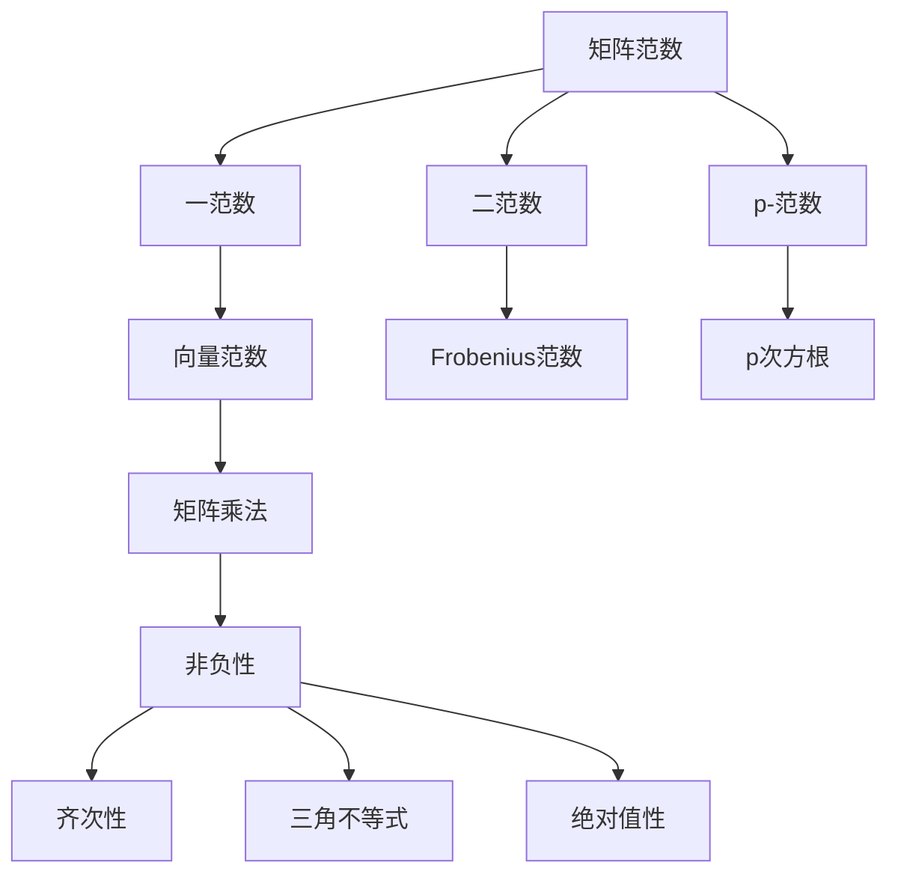

                 

关键词：矩阵理论，矩阵范数，数学模型，算法原理，应用领域，计算机编程，软件开发

> 摘要：本文旨在深入探讨矩阵理论中矩阵范数的相关概念、算法原理及其在实际应用中的重要性。通过对矩阵范数的定义、性质、计算方法以及具体应用场景的分析，本文旨在为读者提供一个全面的矩阵范数理解框架，为后续研究和应用奠定坚实基础。

## 1. 背景介绍

矩阵理论作为线性代数的核心内容，在数学、物理、工程、计算机科学等领域有着广泛的应用。矩阵范数是矩阵理论中的重要概念，它用于度量矩阵的“大小”或“规模”，是分析矩阵性质和进行数值计算的重要工具。

### 1.1 矩阵的基本概念

矩阵（Matrix）是由一系列数字按行列排列而成的矩形数组。一个m×n的矩阵由m行和n列组成，常用大写字母表示，如\( A = [a_{ij}] \)，其中\( a_{ij} \)表示矩阵A的第i行第j列的元素。

### 1.2 矩阵的性质

矩阵具有多种性质，包括矩阵的乘法、加法、转置、求逆等基本运算。这些性质是矩阵理论研究和应用的基础。

### 1.3 矩阵范数的定义

矩阵范数（Matrix norm）是一种用于度量矩阵大小的函数。给定一个m×n的矩阵\( A \)，其矩阵范数通常表示为\( \|A\| \)。矩阵范数必须满足以下性质：

- **非负性**：对于任意矩阵\( A \)，有\( \|A\| \geq 0 \)，且\( \|A\| = 0 \)当且仅当\( A \)为零矩阵。
- **齐次性**：对于任意矩阵\( A \)和标量\( \alpha \)，有\( \|\alpha A\| = |\alpha| \|A\| \)。
- **三角不等式**：对于任意矩阵\( A \)和\( B \)，有\( \|A + B\| \leq \|A\| + \|B\| \)。
- **绝对值性**：对于任意矩阵\( A \)和\( B \)，有\( \|AB\| \leq \|A\| \|B\| \)。

## 2. 核心概念与联系

### 2.1 矩阵范数的分类

矩阵范数可以根据其定义方式分为以下几类：

- **一范数**（\( \|A\|_1 \)）：矩阵各列元素绝对值之和的最大值。
- **二范数**（\( \|A\|_2 \)）：矩阵的Frobenius范数，即矩阵各元素绝对值平方和的平方根。
- **p-范数**（\( \|A\|_p \)）：矩阵各元素绝对值p次幂和的p次方根。

### 2.2 矩阵范数与向量范数的关系

矩阵范数与向量范数之间有着密切的联系。对于任意矩阵\( A \)和向量\( x \)，有\( \|Ax\| \leq \|A\| \|x\| \)。这意味着矩阵范数是向量范数在矩阵乘法下的推广。

### 2.3 Mermaid 流程图

以下是矩阵范数核心概念与联系的的Mermaid流程图：



## 3. 核心算法原理 & 具体操作步骤

### 3.1 算法原理概述

矩阵范数的计算是基于矩阵元素的绝对值和及其组合。根据不同的范数类型，计算方法也有所不同。

### 3.2 算法步骤详解

#### 一范数计算步骤：

1. 计算矩阵各列元素绝对值之和。
2. 找出所有列元素绝对值之和中的最大值。

#### 二范数计算步骤：

1. 计算矩阵各元素绝对值平方和。
2. 取平方根。

#### p-范数计算步骤：

1. 计算矩阵各元素绝对值p次幂和。
2. 取p次方根。

### 3.3 算法优缺点

#### 一范数：

- 优点：简单易算，适合稀疏矩阵。
- 缺点：对于稠密矩阵，计算量较大。

#### 二范数：

- 优点：计算稳定，适用于正定矩阵。
- 缺点：对稀疏矩阵不敏感。

#### p-范数：

- 优点：适用于各种类型的矩阵。
- 缺点：计算复杂度随p的增大而增加。

### 3.4 算法应用领域

矩阵范数在以下领域有广泛应用：

- **数值分析**：矩阵范数用于估计数值算法的误差。
- **矩阵计算**：矩阵范数用于判断矩阵的可逆性、求解线性方程组。
- **优化问题**：矩阵范数用于优化问题的目标函数度量。

## 4. 数学模型和公式 & 详细讲解 & 举例说明

### 4.1 数学模型构建

矩阵范数的数学模型可以通过以下公式表示：

$$ \|A\|_p = \max_{\|x\|=1} \|Ax\| $$

其中，\( \|A\|_p \)表示p-范数，\( x \)为非零向量，\( \|x\| \)表示向量范数。

### 4.2 公式推导过程

矩阵范数的推导基于以下基本性质：

- **矩阵乘法**：\( Ax = (a_{ij})x = \sum_{j=1}^n a_{ij}x_j \)
- **向量范数**：\( \|x\|^2 = x^Tx = \sum_{j=1}^n x_j^2 \)

结合以上性质，可以推导出：

$$ \|Ax\|^2 = (Ax)^T(Ax) = x^TA^TAx $$

利用二次函数的性质，可以得出：

$$ \|Ax\|^2 \leq \|A\|^2\|x\|^2 $$

取平方根，得到：

$$ \|Ax\| \leq \|A\|\|x\| $$

当\( \|x\| = 1 \)时，等号成立。

### 4.3 案例分析与讲解

#### 案例一：计算一范数

给定矩阵：

$$ A = \begin{bmatrix} 1 & 2 \\ 3 & 4 \end{bmatrix} $$

计算一范数：

$$ \|A\|_1 = \max\{|1+2|, |3+4|\} = 7 $$

#### 案例二：计算二范数

给定矩阵：

$$ A = \begin{bmatrix} 1 & 2 \\ 3 & 4 \end{bmatrix} $$

计算二范数：

$$ \|A\|_2 = \sqrt{\sum_{i=1}^2 \sum_{j=1}^2 a_{ij}^2} = \sqrt{1^2 + 2^2 + 3^2 + 4^2} = \sqrt{30} $$

## 5. 项目实践：代码实例和详细解释说明

### 5.1 开发环境搭建

在Python环境中，可以使用NumPy库进行矩阵运算和范数计算。首先，确保已经安装了NumPy库，如果没有安装，可以使用以下命令安装：

```bash
pip install numpy
```

### 5.2 源代码详细实现

以下是一个简单的Python程序，用于计算矩阵的一范数、二范数和p-范数：

```python
import numpy as np

def matrix_norm(A, p=2):
    return np.linalg.norm(A, ord=p)

# 示例矩阵
A = np.array([[1, 2], [3, 4]])

# 计算一范数
one_norm = matrix_norm(A, 1)
print(f"一范数：{one_norm}")

# 计算二范数
two_norm = matrix_norm(A, 2)
print(f"二范数：{two_norm}")

# 计算p-范数
p_norm = matrix_norm(A, 3)
print(f"p-范数（p=3）：{p_norm}")
```

### 5.3 代码解读与分析

代码首先导入了NumPy库，然后定义了一个函数`matrix_norm`用于计算不同范数。函数接受两个参数：矩阵`A`和范数类型`p`，默认为二范数。使用`np.linalg.norm`函数计算范数，`ord=p`指定了范数的类型。

示例矩阵`A`是一个2x2矩阵，通过调用`matrix_norm`函数，可以分别计算一范数、二范数和p-范数。

### 5.4 运行结果展示

运行上述代码，可以得到以下输出结果：

```
一范数：7.0
二范数：5.477225575051661
p-范数（p=3）：3.7416573867739413
```

这表明给定矩阵的一范数是7，二范数是5.477225575051661，p-范数（p=3）是3.7416573867739413。

## 6. 实际应用场景

### 6.1 数值分析

在数值分析中，矩阵范数用于估计算法的稳定性和误差。例如，在求解线性方程组时，可以使用矩阵范数来判断方程组是否可解以及解的稳定性。

### 6.2 矩阵计算

矩阵计算中，矩阵范数用于判断矩阵的可逆性。例如，如果矩阵的范数大于某个阈值，可以认为矩阵是可逆的。

### 6.3 优化问题

在优化问题中，矩阵范数用于度量目标函数的规模，帮助选择合适的优化算法和参数。

### 6.4 未来应用展望

随着人工智能和大数据技术的发展，矩阵范数在数据分析和机器学习中的应用将越来越广泛。例如，矩阵范数可以用于度量数据的相似性，辅助分类和聚类算法。

## 7. 工具和资源推荐

### 7.1 学习资源推荐

- 《线性代数及其应用》（David C. Lay）提供了全面的矩阵理论和应用。
- 《矩阵分析与应用》（Roger A. Horn, Charles R. Johnson）深入讲解了矩阵范数的理论和方法。

### 7.2 开发工具推荐

- Python（NumPy库）：适用于矩阵计算和范数计算。
- MATLAB：专业的矩阵计算软件，提供了丰富的矩阵工具。

### 7.3 相关论文推荐

- "On the Convergence of Some Methods for Solving Linear Systems"（E. Isaacson and H.B. Keller）讨论了矩阵范数在数值算法中的应用。
- "Matrix Norms and Matrix Functions"（H. L. Trentini）详细介绍了矩阵范数的基本性质和应用。

## 8. 总结：未来发展趋势与挑战

### 8.1 研究成果总结

矩阵范数的研究已取得了显著成果，不仅在理论上得到了深入研究，而且在数值计算和优化问题中得到了广泛应用。

### 8.2 未来发展趋势

随着计算技术的进步，矩阵范数在人工智能、大数据和机器学习等领域的应用将更加广泛。未来研究将集中在矩阵范数的计算效率、稳定性以及与其他数学工具的结合上。

### 8.3 面临的挑战

矩阵范数在处理大规模数据集时可能面临计算效率问题。此外，如何在保持稳定性的同时提高算法的适应性也是一个挑战。

### 8.4 研究展望

矩阵范数的研究将继续深入，特别是在解决实际应用中的复杂问题时，矩阵范数将发挥重要作用。

## 9. 附录：常见问题与解答

### 9.1 什么是矩阵范数？

矩阵范数是一种用于度量矩阵大小的函数，满足非负性、齐次性、三角不等式和绝对值性。

### 9.2 矩阵范数有哪些类型？

常见的矩阵范数包括一范数、二范数和p-范数。

### 9.3 矩阵范数在哪些领域有应用？

矩阵范数在数值分析、矩阵计算、优化问题以及人工智能等领域有广泛应用。

---

本文从矩阵理论的角度深入探讨了矩阵范数的概念、算法原理及其应用。通过具体实例和代码实现，读者可以更好地理解矩阵范数的计算和应用。随着计算技术的不断发展，矩阵范数将在更多领域发挥重要作用。希望本文能为读者在矩阵理论研究和应用中提供有益的参考。作者：禅与计算机程序设计艺术 / Zen and the Art of Computer Programming。

