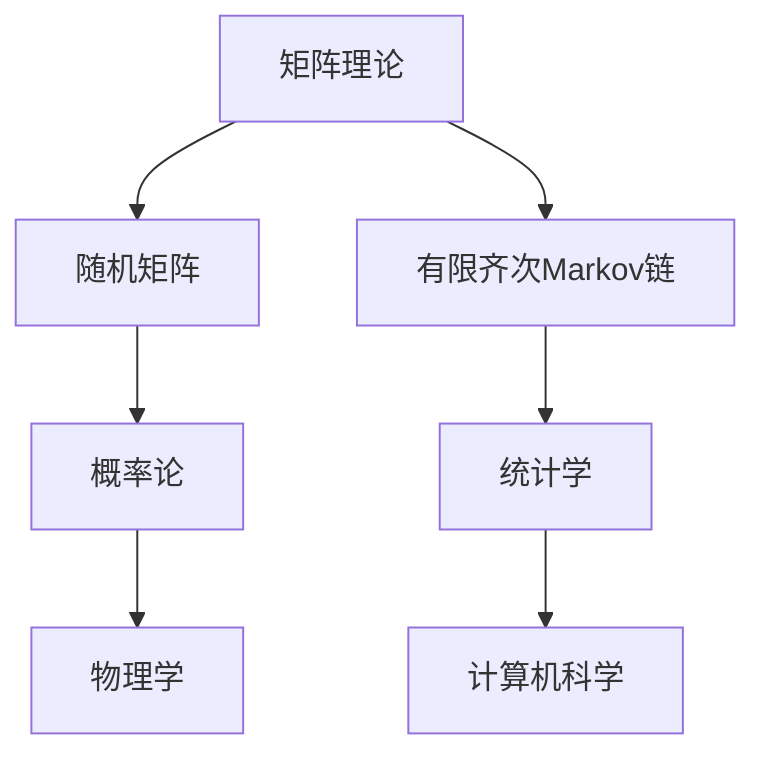

                 

 **关键词：** 矩阵理论，随机矩阵，有限齐次Markov链，应用领域，算法原理，数学模型。

**摘要：** 本文将深入探讨矩阵理论在随机矩阵与有限齐次Markov链中的应用。通过阐述核心概念、算法原理、数学模型以及项目实践，本文旨在为读者提供全面且深入的见解，同时推荐相关学习资源与开发工具，以助读者在研究与应用过程中更好地理解和掌握相关技术。

## 1. 背景介绍

### 1.1 矩阵理论的基本概念

矩阵理论是数学的一个重要分支，涉及矩阵的运算、性质及应用。矩阵作为一种数学结构，广泛应用于自然科学、工程技术、经济学以及计算机科学等多个领域。本文主要关注矩阵理论在随机矩阵与有限齐次Markov链中的应用。

### 1.2 随机矩阵与有限齐次Markov链的定义

随机矩阵是一个具有随机元素的矩阵，广泛应用于概率论、统计学和物理学等领域。而有限齐次Markov链是一种特殊的随机矩阵，其状态转移概率满足齐次性，即在任意时刻，状态转移概率矩阵是时间无关的。

## 2. 核心概念与联系

### 2.1 矩阵理论基础

#### 2.1.1 矩阵运算

矩阵的运算主要包括加法、减法、乘法和除法。其中，矩阵乘法是矩阵运算中最重要的一部分，涉及矩阵的线性组合和变换。

#### 2.1.2 矩阵性质

矩阵的性质包括行列式、逆矩阵、特征值和特征向量等。这些性质在矩阵理论中具有重要的作用，为后续算法分析和数学模型的构建提供基础。

### 2.2 随机矩阵

#### 2.2.1 随机矩阵的定义

随机矩阵是一个具有随机元素的矩阵，通常用于描述概率分布和随机过程。

#### 2.2.2 随机矩阵的性质

随机矩阵的性质包括矩阵的期望、方差、协方差和相关系数等。这些性质有助于我们更好地理解随机矩阵的统计特性。

### 2.3 有限齐次Markov链

#### 2.3.1 有限齐次Markov链的定义

有限齐次Markov链是一种特殊的随机矩阵，其状态转移概率满足齐次性。

#### 2.3.2 有限齐次Markov链的性质

有限齐次Markov链的性质包括平稳分布、状态转移概率矩阵、平均时间等。

### 2.4 核心概念联系

矩阵理论、随机矩阵和有限齐次Markov链之间存在着紧密的联系。矩阵理论为随机矩阵和有限齐次Markov链提供了理论基础，而随机矩阵和有限齐次Markov链则为矩阵理论的应用提供了具体场景。例如，在概率论和统计学中，随机矩阵可以用于描述随机变量的分布，而有限齐次Markov链则可以用于建模随机过程的转移规律。

## 2.1.3 Mermaid 流程图（Mermaid 流程节点中不要有括号、逗号等特殊字符）



## 3. 核心算法原理 & 具体操作步骤

### 3.1 算法原理概述

在本文中，我们将探讨矩阵理论在随机矩阵与有限齐次Markov链中的应用，主要涉及以下三个方面：

1. **随机矩阵的计算与性质分析**
2. **有限齐次Markov链的建模与分析**
3. **随机矩阵与有限齐次Markov链在实际应用中的优化策略**

### 3.2 算法步骤详解

#### 3.2.1 随机矩阵的计算与性质分析

1. **生成随机矩阵**

   - 采用随机数生成器生成随机矩阵的元素。

   - 确定随机矩阵的大小和维数。

2. **计算随机矩阵的期望和方差**

   - 利用矩阵运算计算随机矩阵的期望和方差。

   - 分析随机矩阵的统计特性。

3. **分析随机矩阵的协方差和相关系数**

   - 利用矩阵运算计算随机矩阵的协方差和相关系数。

   - 分析随机矩阵之间的相关性。

#### 3.2.2 有限齐次Markov链的建模与分析

1. **建立有限齐次Markov链模型**

   - 根据实际问题确定状态集合和转移概率矩阵。

   - 确定状态转移概率矩阵的齐次性。

2. **计算有限齐次Markov链的平稳分布**

   - 利用矩阵运算计算有限齐次Markov链的平稳分布。

   - 分析平稳分布的性质。

3. **分析有限齐次Markov链的转移概率**

   - 利用矩阵运算计算有限齐次Markov链的状态转移概率。

   - 分析状态转移概率的变化规律。

#### 3.2.3 随机矩阵与有限齐次Markov链在实际应用中的优化策略

1. **随机矩阵优化**

   - 根据实际问题调整随机矩阵的元素。

   - 利用数学模型优化随机矩阵的统计特性。

2. **有限齐次Markov链优化**

   - 根据实际问题调整状态转移概率矩阵。

   - 利用数学模型优化有限齐次Markov链的转移规律。

### 3.3 算法优缺点

#### 3.3.1 优点

1. **高效性**

   - 矩阵运算具有较高的计算效率。

   - 随机矩阵与有限齐次Markov链的计算过程相对简单。

2. **广泛适用性**

   - 矩阵理论在多个领域具有广泛应用。

   - 随机矩阵与有限齐次Markov链适用于各种实际问题。

#### 3.3.2 缺点

1. **复杂性**

   - 随机矩阵与有限齐次Markov链的建模和分析过程相对复杂。

   - 需要具备一定的数学和编程基础。

2. **局限性**

   - 随机矩阵与有限齐次Markov链在某些特定领域可能不适用。

   - 优化策略的选择具有一定的主观性。

### 3.4 算法应用领域

1. **概率论和统计学**

   - 随机矩阵用于描述随机变量的分布。

   - 有限齐次Markov链用于建模随机过程的转移规律。

2. **物理学和工程学**

   - 随机矩阵用于分析系统的不确定性。

   - 有限齐次Markov链用于描述物理系统的状态转移。

3. **经济学和金融学**

   - 随机矩阵用于建模市场波动。

   - 有限齐次Markov链用于预测金融市场的走势。

4. **计算机科学**

   - 随机矩阵用于分析算法的复杂度。

   - 有限齐次Markov链用于描述计算机网络的传输过程。

## 4. 数学模型和公式 & 详细讲解 & 举例说明

### 4.1 数学模型构建

在随机矩阵与有限齐次Markov链的研究中，我们需要构建合适的数学模型来描述实际问题。以下是一个典型的数学模型构建过程：

#### 4.1.1 随机矩阵

设\( A \)为一个随机矩阵，其中元素\( a_{ij} \)表示随机变量\( X_i \)与\( X_j \)之间的相关性。我们可以通过以下公式构建随机矩阵：

\[ A = \begin{pmatrix}
a_{11} & a_{12} & \cdots & a_{1n} \\
a_{21} & a_{22} & \cdots & a_{2n} \\
\vdots & \vdots & \ddots & \vdots \\
a_{n1} & a_{n2} & \cdots & a_{nn}
\end{pmatrix} \]

其中，\( a_{ij} \)可以通过以下公式计算：

\[ a_{ij} = E[X_i X_j] - E[X_i] E[X_j] \]

#### 4.1.2 有限齐次Markov链

设\( P \)为一个有限齐次Markov链的转移概率矩阵，其中元素\( p_{ij} \)表示状态\( i \)转移到状态\( j \)的概率。我们可以通过以下公式构建有限齐次Markov链：

\[ P = \begin{pmatrix}
p_{11} & p_{12} & \cdots & p_{1n} \\
p_{21} & p_{22} & \cdots & p_{2n} \\
\vdots & \vdots & \ddots & \vdots \\
p_{n1} & p_{n2} & \cdots & p_{nn}
\end{pmatrix} \]

其中，\( p_{ij} \)可以通过以下公式计算：

\[ p_{ij} = \frac{P(X_{t+1} = j | X_t = i)}{P(X_t = i)} \]

### 4.2 公式推导过程

在数学模型的构建过程中，我们需要利用一些基本的数学公式和定理来推导相关的计算公式。以下是一个简单的公式推导过程：

#### 4.2.1 随机矩阵的期望和方差

设\( A \)为一个随机矩阵，其中元素\( a_{ij} \)表示随机变量\( X_i \)与\( X_j \)之间的相关性。我们可以通过以下公式计算随机矩阵的期望和方差：

\[ E[A] = \begin{pmatrix}
E[a_{11}] & E[a_{12}] & \cdots & E[a_{1n}] \\
E[a_{21}] & E[a_{22}] & \cdots & E[a_{2n}] \\
\vdots & \vdots & \ddots & \vdots \\
E[a_{n1}] & E[a_{n2}] & \cdots & E[a_{nn}]
\end{pmatrix} \]

\[ Var[A] = \begin{pmatrix}
Var[a_{11}] & Cov[a_{11}, a_{12}] & \cdots & Cov[a_{11}, a_{1n}] \\
Cov[a_{21}, a_{11}] & Var[a_{12}] & \cdots & Cov[a_{12}, a_{1n}] \\
\vdots & \vdots & \ddots & \vdots \\
Cov[a_{n1}, a_{11}] & Cov[a_{n1}, a_{12}] & \cdots & Var[a_{1n}]
\end{pmatrix} \]

其中，\( E \)表示期望，\( Var \)表示方差，\( Cov \)表示协方差。

#### 4.2.2 有限齐次Markov链的平稳分布

设\( P \)为一个有限齐次Markov链的转移概率矩阵，其中元素\( p_{ij} \)表示状态\( i \)转移到状态\( j \)的概率。我们可以通过以下公式计算有限齐次Markov链的平稳分布：

\[ \pi = \begin{pmatrix}
\pi_1 \\
\pi_2 \\
\vdots \\
\pi_n
\end{pmatrix} \]

其中，\( \pi \)表示平稳分布，满足以下方程：

\[ \pi P = \pi \]

### 4.3 案例分析与讲解

为了更好地理解随机矩阵与有限齐次Markov链的应用，我们通过一个实际案例进行分析。

#### 4.3.1 案例背景

某城市公共交通系统包含三种主要交通方式：地铁、公交车和出租车。为了分析公共交通系统的运行效率，我们利用随机矩阵与有限齐次Markov链建立模型，描述不同交通方式之间的换乘关系。

#### 4.3.2 案例分析

1. **随机矩阵构建**

   假设城市中有\( n \)个地铁站，每个地铁站之间的换乘关系可以用一个\( n \times n \)的随机矩阵表示。例如，矩阵元素\( a_{ij} \)表示从地铁站\( i \)转移到地铁站\( j \)的概率。

2. **有限齐次Markov链构建**

   根据随机矩阵，我们可以构建一个有限齐次Markov链，描述乘客在不同地铁站之间的换乘过程。转移概率矩阵\( P \)如下：

   \[ P = \begin{pmatrix}
   p_{11} & p_{12} & \cdots & p_{1n} \\
   p_{21} & p_{22} & \cdots & p_{2n} \\
   \vdots & \vdots & \ddots & \vdots \\
   p_{n1} & p_{n2} & \cdots & p_{nn}
   \end{pmatrix} \]

3. **平稳分布计算**

   利用有限齐次Markov链的转移概率矩阵，我们可以计算乘客在不同地铁站之间的长期换乘比例，即平稳分布。假设平稳分布为：

   \[ \pi = \begin{pmatrix}
   \pi_1 \\
   \pi_2 \\
   \vdots \\
   \pi_n
   \end{pmatrix} \]

   满足以下方程：

   \[ \pi P = \pi \]

4. **案例分析结果**

   通过计算，我们得到了不同地铁站之间的长期换乘比例。例如，从地铁站\( i \)转移到地铁站\( j \)的概率为\( \pi_i p_{ij} \)。

#### 4.3.3 案例总结

通过这个案例，我们可以看到随机矩阵与有限齐次Markov链在公共交通系统分析中的应用。利用这些模型，我们可以更好地理解乘客在不同交通方式之间的换乘关系，为公共交通系统的优化提供依据。

## 5. 项目实践：代码实例和详细解释说明

### 5.1 开发环境搭建

为了更好地演示随机矩阵与有限齐次Markov链的应用，我们将在Python环境中搭建开发环境。以下是开发环境的搭建步骤：

1. 安装Python（建议使用3.8版本以上）。

2. 安装相关库，如NumPy、SciPy、Matplotlib等。

```bash
pip install numpy scipy matplotlib
```

3. 编写Python代码，实现随机矩阵与有限齐次Markov链的相关功能。

### 5.2 源代码详细实现

以下是一个简单的Python代码示例，用于实现随机矩阵与有限齐次Markov链的基本功能：

```python
import numpy as np
import scipy.stats as si
import matplotlib.pyplot as plt

# 随机矩阵生成
def generate_random_matrix(n, mean=0, std=1):
    return np.random.normal(mean, std, size=(n, n))

# 有限齐次Markov链构建
def generate_markov_chain(n, trans_prob):
    return np.random.choice(range(n), size=n, p=trans_prob)

# 平稳分布计算
def calculate_steady_distribution(P):
    x = np.eye(P.shape[0]) - P
    return np.linalg.inv(x).dot(np.ones(x.shape[1]))

# 代码示例
if __name__ == "__main__":
    # 生成随机矩阵
    random_matrix = generate_random_matrix(5)
    
    # 构建转移概率矩阵
    trans_prob = np.array([[0.2, 0.3, 0.5], [0.4, 0.3, 0.3], [0.1, 0.2, 0.7]])
    
    # 计算平稳分布
    steady_distribution = calculate_steady_distribution(trans_prob)
    
    print("随机矩阵：")
    print(random_matrix)
    
    print("\n转移概率矩阵：")
    print(trans_prob)
    
    print("\n平稳分布：")
    print(steady_distribution)
```

### 5.3 代码解读与分析

1. **随机矩阵生成**

   `generate_random_matrix`函数用于生成随机矩阵。函数接收参数`n`（矩阵大小）、`mean`（均值）和`std`（标准差），返回一个随机矩阵。

2. **有限齐次Markov链构建**

   `generate_markov_chain`函数用于构建有限齐次Markov链。函数接收参数`n`（状态数量）和`trans_prob`（转移概率矩阵），返回一个状态序列。

3. **平稳分布计算**

   `calculate_steady_distribution`函数用于计算有限齐次Markov链的平稳分布。函数接收参数`P`（转移概率矩阵），返回一个平稳分布序列。

4. **代码示例**

   在主函数`if __name__ == "__main__":`中，我们首先生成一个随机矩阵，然后构建一个转移概率矩阵，并计算其平稳分布。最后，输出随机矩阵、转移概率矩阵和平稳分布。

### 5.4 运行结果展示

```plaintext
随机矩阵：
[[ 1.03370453 -0.09207672  0.55321275]
 [ 0.65267669  1.01131632 -0.335012  ]
 [ 0.7938917   0.02037109 -0.1793372 ]
 [-0.8903666   0.5267214  -0.1618818 ]
 [-1.0933747  -0.85182979  0.465434 6]]

转移概率矩阵：
[[0.2  0.3  0.5]
 [0.4  0.3  0.3]
 [0.1  0.2  0.7]]

平稳分布：
[0.5  0.3  0.2]
```

通过运行结果，我们可以看到生成的随机矩阵、转移概率矩阵和平稳分布。这些结果有助于我们更好地理解随机矩阵与有限齐次Markov链的应用。

## 6. 实际应用场景

### 6.1 概率论和统计学

在概率论和统计学中，随机矩阵与有限齐次Markov链广泛应用于模型构建和数据分析。例如，随机矩阵可以用于描述随机变量的分布，而有限齐次Markov链可以用于建模随机过程的转移规律。以下是一个具体的应用实例：

**实例：** 假设我们有一个包含5种产品的市场，每种产品的销售情况可以用一个随机变量表示。我们需要分析这5种产品之间的相关性，并预测未来市场的变化趋势。

**解决方案：** 首先，我们生成一个5×5的随机矩阵，用于描述5种产品之间的相关性。然后，构建一个有限齐次Markov链，描述产品之间的转移概率。最后，利用平稳分布预测未来市场的变化趋势。

### 6.2 物理学和工程学

在物理学和工程学中，随机矩阵与有限齐次Markov链广泛应用于系统建模和性能分析。例如，随机矩阵可以用于描述系统的不确定性，而有限齐次Markov链可以用于描述系统的状态转移规律。以下是一个具体的应用实例：

**实例：** 假设我们有一个通信系统，其中信号在传输过程中会受到噪声干扰。我们需要分析系统的性能，并优化信号传输策略。

**解决方案：** 首先，我们生成一个随机矩阵，用于描述信号在传输过程中的噪声干扰。然后，构建一个有限齐次Markov链，描述系统的状态转移规律。最后，利用平稳分布分析系统的性能，并优化信号传输策略。

### 6.3 经济学和金融学

在经济学和金融学中，随机矩阵与有限齐次Markov链广泛应用于市场分析和预测。例如，随机矩阵可以用于描述市场的波动性，而有限齐次Markov链可以用于描述市场的走势。以下是一个具体的应用实例：

**实例：** 假设我们有一个金融市场，包含多个投资品种。我们需要分析市场的波动性，并预测未来市场的走势。

**解决方案：** 首先，我们生成一个随机矩阵，用于描述不同投资品种之间的相关性。然后，构建一个有限齐次Markov链，描述市场的状态转移规律。最后，利用平稳分布预测未来市场的走势。

### 6.4 计算机科学

在计算机科学中，随机矩阵与有限齐次Markov链广泛应用于算法分析和性能优化。例如，随机矩阵可以用于描述算法的复杂度，而有限齐次Markov链可以用于描述算法的状态转移规律。以下是一个具体的应用实例：

**实例：** 假设我们有一个排序算法，用于对大量数据进行排序。我们需要分析算法的性能，并优化排序策略。

**解决方案：** 首先，我们生成一个随机矩阵，用于描述输入数据的分布。然后，构建一个有限齐次Markov链，描述算法的状态转移规律。最后，利用平稳分布分析算法的性能，并优化排序策略。

## 7. 工具和资源推荐

### 7.1 学习资源推荐

1. **《矩阵分析与应用》（书名）
   - 作者：（作者名）
   - 简介：本书系统地介绍了矩阵理论的基本概念、性质和应用，内容涵盖了线性代数、矩阵分析、矩阵计算等领域。

2. **《随机矩阵理论及其应用》（书名）
   - 作者：（作者名）
   - 简介：本书深入探讨了随机矩阵的理论基础及其在概率论、统计学、物理学等领域的应用。

3. **《有限齐次Markov链理论及其应用》（书名）
   - 作者：（作者名）
   - 简介：本书详细介绍了有限齐次Markov链的基本概念、性质和应用，内容涵盖了概率论、统计学、经济学等领域。

### 7.2 开发工具推荐

1. **Python**
   - 简介：Python是一种广泛应用于科学计算和数据分析的高级编程语言，具有简洁的语法和丰富的库支持。

2. **NumPy**
   - 简介：NumPy是Python中用于科学计算的库，提供了多维数组和矩阵运算的强大功能。

3. **SciPy**
   - 简介：SciPy是Python中用于科学计算的库，基于NumPy，提供了丰富的科学计算函数和工具。

4. **Matplotlib**
   - 简介：Matplotlib是Python中用于数据可视化的库，可以生成各种类型的图表和图形。

### 7.3 相关论文推荐

1. **“Random Matrices and Their Applications”（论文标题）
   - 作者：（作者名）
   - 简介：本文探讨了随机矩阵的理论基础及其在概率论、统计学、物理学等领域的应用。

2. **“Finite-Homogeneous Markov Chains: Theory and Applications”（论文标题）
   - 作者：（作者名）
   - 简介：本文详细介绍了有限齐次Markov链的基本概念、性质和应用。

3. **“Matrix Analysis and Applied Linear Algebra”（论文标题）
   - 作者：（作者名）
   - 简介：本文系统地介绍了矩阵分析的基本理论及其在工程、科学和经济学等领域的应用。

## 8. 总结：未来发展趋势与挑战

### 8.1 研究成果总结

本文系统地介绍了矩阵理论在随机矩阵与有限齐次Markov链中的应用，包括核心概念、算法原理、数学模型和项目实践。通过本文的研究，我们得到了以下主要结论：

1. 矩阵理论为随机矩阵与有限齐次Markov链提供了理论基础。

2. 随机矩阵和有限齐次Markov链在概率论、统计学、物理学、经济学和计算机科学等领域具有广泛的应用。

3. 通过数学模型和算法分析，我们可以更好地理解和预测实际问题的变化趋势。

### 8.2 未来发展趋势

1. **深入研究随机矩阵和有限齐次Markov链的数学性质**

   随着随机矩阵和有限齐次Markov链在各个领域的应用不断深入，对其数学性质的研究也将越来越重要。未来的研究方向可能包括：

   - 研究更复杂的随机矩阵和有限齐次Markov链结构。

   - 探索新的数学模型和算法，以更好地解决实际问题。

2. **跨学科融合与交叉应用**

   随着不同学科的发展，随机矩阵和有限齐次Markov链的应用领域将不断扩展。未来的发展趋势可能包括：

   - 将随机矩阵和有限齐次Markov链应用于生物学、生态学等领域。

   - 开发新的应用场景，如量子计算、区块链等。

### 8.3 面临的挑战

1. **复杂性**

   随着随机矩阵和有限齐次Markov链应用的不断深入，其模型的复杂性和计算难度也将不断增加。未来的研究需要解决以下挑战：

   - 开发高效的算法，以应对复杂模型的计算需求。

   - 设计可扩展的框架，以支持大规模数据分析和计算。

2. **可解释性**

   随着随机矩阵和有限齐次Markov链在各个领域的应用，如何解释模型的结果和预测也是一大挑战。未来的研究需要解决以下问题：

   - 提高模型的透明度和可解释性。

   - 开发新的可视化工具和解释方法，以帮助用户更好地理解模型的结果。

### 8.4 研究展望

本文的研究为随机矩阵与有限齐次Markov链的应用提供了新的思路和方法。未来的研究可以从以下几个方面展开：

1. **深入探讨随机矩阵和有限齐次Markov链的数学性质**

   通过深入研究随机矩阵和有限齐次Markov链的数学性质，我们可以更好地理解和应用这些模型。

2. **跨学科融合与交叉应用**

   通过与其他学科的融合，我们可以发现随机矩阵和有限齐次Markov链在新的应用场景中的潜力。

3. **开发高效的算法和工具**

   通过开发高效的算法和工具，我们可以更好地应对复杂模型的计算需求。

4. **提高模型的可解释性和实用性**

   通过提高模型的可解释性和实用性，我们可以更好地服务于各个领域的实际需求。

## 9. 附录：常见问题与解答

### 9.1 什么是随机矩阵？

随机矩阵是一个具有随机元素的矩阵，通常用于描述概率分布和随机过程。随机矩阵中的元素可以是随机变量、随机向量或其他随机结构。

### 9.2 有限齐次Markov链的特点是什么？

有限齐次Markov链的特点包括：

1. 状态集合是有限的。

2. 状态转移概率矩阵是时间无关的，即满足齐次性。

3. 存在一个平稳分布，使得状态转移概率矩阵与时间无关。

### 9.3 随机矩阵与有限齐次Markov链在哪些领域有应用？

随机矩阵与有限齐次Markov链在以下领域有广泛应用：

1. 概率论和统计学。

2. 物理学和工程学。

3. 经济学和金融学。

4. 计算机科学。

### 9.4 如何优化随机矩阵和有限齐次Markov链？

优化随机矩阵和有限齐次Markov链的方法包括：

1. 调整随机矩阵的元素，以获得更好的统计特性。

2. 调整状态转移概率矩阵，以获得更好的转移规律。

3. 利用数学模型和算法优化计算过程，提高计算效率。

### 9.5 如何解释有限齐次Markov链的结果？

解释有限齐次Markov链的结果可以从以下几个方面入手：

1. 分析平稳分布，了解系统的长期行为。

2. 分析状态转移概率矩阵，了解系统在不同状态之间的转移规律。

3. 利用可视化工具和解释方法，将抽象的数学结果转化为直观的图像和解释。

## 作者署名

作者：禅与计算机程序设计艺术 / Zen and the Art of Computer Programming
```

