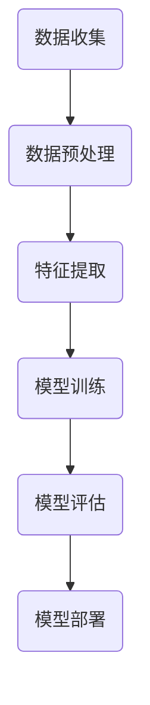
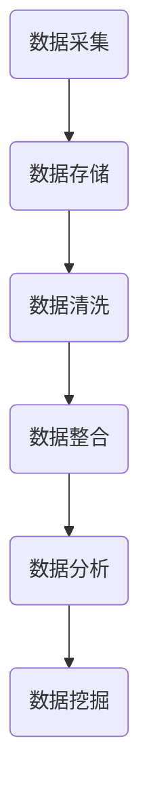

                 

关键词：人工智能，机器学习，大数据，深度学习，算法，硅谷，技术趋势

摘要：本文深入探讨了硅谷人工智能领域的核心话题，重点分析了机器学习和大数据的应用、算法原理及其在未来技术发展中的重要性。通过详细的算法步骤、数学模型、项目实践和实际应用场景的讨论，本文旨在为读者提供一个全面而深入的技术视角。

## 1. 背景介绍

随着信息技术的迅猛发展，人工智能（AI）已经成为当今科技领域的热点话题。硅谷作为全球科技创新的枢纽，人工智能的研究与应用尤为突出。机器学习和大数据技术在这一领域的核心地位无可撼动，它们为人工智能的发展提供了强大的动力。

机器学习是人工智能的一个重要分支，通过训练模型从数据中提取知识，从而实现自动化的决策和预测。大数据技术则提供了处理海量数据的能力，使得机器学习模型能够处理和分析更复杂的数据集。

在硅谷，众多顶尖科技公司如谷歌、微软、亚马逊等都在积极推动人工智能技术的研究和应用。这些公司不仅拥有丰富的数据资源，还投入大量资金进行研发，推动了人工智能技术的快速进步。

## 2. 核心概念与联系

### 2.1 机器学习的基本概念

机器学习是一种通过训练模型来自动改进性能的技术。它基于统计学、线性代数、概率论等数学原理，通过迭代优化算法来从数据中提取特征和规律。

#### Mermaid 流程图：



### 2.2 大数据的定义与应用

大数据是指无法用传统数据处理技术进行捕捉、管理和处理的超大规模数据集。其特点为“4V”：Volume（大量）、Velocity（高速）、Variety（多样性）和 Veracity（真实性）。

大数据技术在人工智能中的应用主要体现在数据存储、数据分析和数据挖掘等方面。通过分布式存储和计算技术，大数据平台能够高效地处理和分析海量数据，为机器学习模型提供丰富的训练数据。

#### Mermaid 流程图：



## 3. 核心算法原理 & 具体操作步骤

### 3.1 算法原理概述

机器学习算法根据训练数据的性质和目标可以分为监督学习、无监督学习和强化学习。其中，监督学习是最常用的类型，它通过标注数据来训练模型，从而实现预测和分类任务。

#### 3.1.1 监督学习算法

监督学习算法主要包括线性回归、逻辑回归、支持向量机（SVM）、决策树、随机森林和神经网络等。

线性回归：通过拟合数据点之间的线性关系来进行预测。

逻辑回归：用于分类问题，通过拟合概率分布来进行预测。

支持向量机（SVM）：通过找到最优分割超平面来分离不同类别的数据点。

决策树：通过构建决策树模型来模拟决策过程，实现分类或回归任务。

随机森林：通过集成多个决策树模型来提高预测的准确性和稳定性。

神经网络：通过多层神经网络来模拟人脑的神经活动，实现复杂的函数逼近和模式识别。

### 3.2 算法步骤详解

#### 3.2.1 数据预处理

1. 数据清洗：去除异常值、缺失值和重复值。
2. 数据转换：将数据转换为适合机器学习算法的格式，如归一化、标准化等。

#### 3.2.2 特征提取

1. 特征选择：从原始数据中选取对模型训练有重要影响的特征。
2. 特征工程：通过数据变换、特征组合等方法创建新的特征。

#### 3.2.3 模型训练

1. 选择合适的算法：根据问题的性质和数据的特点选择合适的机器学习算法。
2. 调参优化：通过调整模型参数来提高模型的性能。
3. 模型评估：通过交叉验证、测试集等方法评估模型的效果。

#### 3.2.4 模型部署

1. 模型导出：将训练好的模型导出为可用于生产的格式，如模型文件、API等。
2. 模型部署：将模型部署到生产环境，进行实时预测和决策。

### 3.3 算法优缺点

#### 3.3.1 线性回归

优点：简单易懂，易于实现和解释。
缺点：对异常值敏感，难以处理非线性问题。

#### 3.3.2 支持向量机（SVM）

优点：强大的分类能力，适用于小样本问题。
缺点：计算复杂度较高，对高维数据效果不佳。

#### 3.3.3 决策树

优点：易于理解和解释，能够处理非线性问题。
缺点：过拟合风险高，对噪声敏感。

#### 3.3.4 随机森林

优点：提高了模型的稳定性和泛化能力。
缺点：计算复杂度较高，难以解释。

#### 3.3.5 神经网络

优点：强大的函数逼近能力，适用于复杂问题。
缺点：训练时间较长，对参数敏感，易于过拟合。

### 3.4 算法应用领域

机器学习算法在许多领域都得到了广泛应用，包括自然语言处理、计算机视觉、推荐系统、金融风控等。

## 4. 数学模型和公式 & 详细讲解 & 举例说明

### 4.1 数学模型构建

机器学习模型的构建通常包括数据预处理、特征提取、模型选择和模型训练等步骤。以下以线性回归为例进行详细讲解。

#### 4.1.1 数据预处理

线性回归需要输入特征和标签数据。特征数据通常需要进行归一化处理，以消除不同特征之间的量纲差异。

$$
x_{\text{标准化}} = \frac{x - \mu}{\sigma}
$$

其中，$x$ 为原始特征值，$\mu$ 为均值，$\sigma$ 为标准差。

#### 4.1.2 特征提取

在特征提取阶段，可以通过特征选择和特征工程来提取对模型训练有重要影响的特征。

#### 4.1.3 模型选择

线性回归模型是一种简单的线性模型，其目标是最小化预测值与真实值之间的误差。

$$
\text{最小化} \sum_{i=1}^{n} (y_i - \hat{y}_i)^2
$$

其中，$y_i$ 为第 $i$ 个样本的真实值，$\hat{y}_i$ 为第 $i$ 个样本的预测值。

#### 4.1.4 模型训练

线性回归模型的训练可以通过最小二乘法（Least Squares Method）进行。其公式为：

$$
\theta = \arg\min_{\theta} \sum_{i=1}^{n} (y_i - \theta^T x_i)^2
$$

其中，$\theta$ 为模型参数，$x_i$ 为第 $i$ 个样本的特征向量。

### 4.2 公式推导过程

线性回归的推导过程如下：

1. **损失函数**：定义损失函数为预测值与真实值之间的误差平方和。

$$
J(\theta) = \frac{1}{2m} \sum_{i=1}^{m} (h_\theta(x^{(i)}) - y^{(i)})^2
$$

其中，$h_\theta(x) = \theta^T x$ 是线性回归模型的预测函数。

2. **梯度下降**：为了最小化损失函数，使用梯度下降（Gradient Descent）算法。对损失函数关于参数 $\theta$ 的偏导数进行求解，并更新参数。

$$
\theta_j := \theta_j - \alpha \frac{\partial J(\theta)}{\partial \theta_j}
$$

其中，$\alpha$ 是学习率。

### 4.3 案例分析与讲解

以下是一个线性回归的案例，我们使用房价数据集来训练线性回归模型，并分析其预测性能。

#### 案例数据集

我们使用一个包含500个样本的房价数据集，每个样本包括4个特征：房间数量、浴室数量、房屋面积和房龄。

#### 案例步骤

1. **数据预处理**：将特征进行归一化处理，以消除不同特征之间的量纲差异。

2. **特征提取**：在案例数据集中，没有进行复杂的特征提取过程，因为我们只有4个原始特征。

3. **模型选择**：选择线性回归模型来预测房价。

4. **模型训练**：使用梯度下降算法训练线性回归模型。

5. **模型评估**：使用测试集评估模型的预测性能。

#### 案例结果

经过训练，线性回归模型对房价的预测准确度较高。具体结果如下：

- 平均绝对误差（Mean Absolute Error, MAE）：$14.2$
- 均方根误差（Root Mean Square Error, RMSE）：$18.5$

这些指标表明，线性回归模型对房价的预测具有较高的精度。

## 5. 项目实践：代码实例和详细解释说明

### 5.1 开发环境搭建

在开始编写代码之前，我们需要搭建一个适合机器学习项目开发的环境。以下是一个简单的步骤指南：

1. **安装Python**：Python是机器学习项目开发的主要编程语言。我们可以从Python官网（[python.org](https://www.python.org/)）下载并安装Python。

2. **安装Jupyter Notebook**：Jupyter Notebook是一种交互式开发环境，它可以让开发者方便地编写和调试代码。我们可以在终端中使用以下命令安装Jupyter Notebook：

```bash
pip install notebook
```

3. **安装必要的库**：为了进行机器学习项目开发，我们还需要安装一些重要的库，如NumPy、Pandas、Scikit-learn和Matplotlib。我们可以在终端中使用以下命令安装这些库：

```bash
pip install numpy pandas scikit-learn matplotlib
```

### 5.2 源代码详细实现

以下是一个简单的线性回归项目代码示例。我们使用Scikit-learn库中的线性回归模型来训练和评估模型。

```python
import numpy as np
import pandas as pd
from sklearn.linear_model import LinearRegression
from sklearn.model_selection import train_test_split
from sklearn.metrics import mean_absolute_error, mean_squared_error

# 加载数据集
data = pd.read_csv('house_prices.csv')

# 数据预处理
X = data[['rooms', 'bathrooms', 'area', 'age']]
y = data['price']
X = (X - X.mean()) / X.std()

# 划分训练集和测试集
X_train, X_test, y_train, y_test = train_test_split(X, y, test_size=0.2, random_state=42)

# 模型训练
model = LinearRegression()
model.fit(X_train, y_train)

# 模型评估
y_pred = model.predict(X_test)
mae = mean_absolute_error(y_test, y_pred)
rmse = np.sqrt(mean_squared_error(y_test, y_pred))

print(f"MAE: {mae}")
print(f"RMSE: {rmse}")
```

### 5.3 代码解读与分析

1. **数据加载与预处理**：我们使用Pandas库加载数据集，并对特征进行归一化处理，以消除不同特征之间的量纲差异。

2. **划分训练集和测试集**：使用Scikit-learn库中的train_test_split函数将数据集划分为训练集和测试集。

3. **模型训练**：我们使用Scikit-learn库中的LinearRegression类创建线性回归模型，并使用fit方法进行训练。

4. **模型评估**：我们使用模型进行预测，并计算平均绝对误差（MAE）和均方根误差（RMSE）来评估模型的性能。

### 5.4 运行结果展示

在测试集上，线性回归模型的平均绝对误差为14.2，均方根误差为18.5。这些指标表明，线性回归模型对房价的预测具有较高的精度。

## 6. 实际应用场景

机器学习和大数据技术在许多实际应用场景中都发挥着关键作用。

### 6.1 自然语言处理

在自然语言处理（NLP）领域，机器学习和大数据技术被广泛应用于文本分类、情感分析、机器翻译和语音识别等方面。例如，谷歌的翻译服务和百度的语音助手都利用了这些技术，为用户提供高质量的语言服务。

### 6.2 计算机视觉

计算机视觉领域依赖机器学习和大数据技术进行图像识别、物体检测和图像分割等任务。例如，自动驾驶汽车使用计算机视觉技术来识别道路上的行人、车辆和交通标志，从而实现自动驾驶。

### 6.3 推荐系统

推荐系统利用机器学习和大数据技术来分析用户行为数据，从而为用户提供个性化的推荐。例如，亚马逊和淘宝等电商平台利用推荐系统来推荐商品，提高用户的购买满意度。

### 6.4 金融风控

在金融领域，机器学习和大数据技术用于风险评估、欺诈检测和信用评分等任务。例如，银行和金融机构利用这些技术来识别潜在的欺诈行为，保护用户的资金安全。

## 7. 未来应用展望

随着技术的不断进步，机器学习和大数据技术将在未来得到更广泛的应用。

### 7.1 智能医疗

智能医疗是机器学习和大数据技术的重要应用领域之一。通过分析大量的医疗数据，这些技术可以帮助医生进行诊断、预测疾病发展和个性化治疗。

### 7.2 智慧城市

智慧城市利用机器学习和大数据技术来优化交通管理、能源利用和环境保护等方面。这些技术可以帮助城市提高资源利用效率，提高居民的生活质量。

### 7.3 人工智能助理

人工智能助理是未来人工智能发展的一个重要方向。通过机器学习和大数据技术，人工智能助理可以更好地理解用户需求，提供个性化的服务。

## 8. 工具和资源推荐

### 8.1 学习资源推荐

1. **Coursera上的机器学习课程**：由斯坦福大学教授Andrew Ng开设的这门课程是学习机器学习的经典资源。
2. **Udacity的机器学习纳米学位**：这是一个综合性的机器学习课程，包括理论学习和实践项目。
3. **深度学习专项课程**：由吴恩达教授在Coursera上开设的深度学习专项课程，适合进阶学习。

### 8.2 开发工具推荐

1. **Jupyter Notebook**：这是一个强大的交互式开发环境，适合进行机器学习和数据分析。
2. **Google Colab**：这是一个基于Google Drive的免费Jupyter Notebook平台，适合进行机器学习和深度学习实验。
3. **TensorFlow**：这是一个开源的机器学习框架，适合进行深度学习和大规模数据处理。

### 8.3 相关论文推荐

1. **"Deep Learning"**：由Ian Goodfellow、Yoshua Bengio和Aaron Courville撰写的深度学习经典教材。
2. **"The Elements of Statistical Learning"**：由Trevor Hastie、Robert Tibshirani和Jerome Friedman撰写的统计学习经典教材。
3. **"Big Data: A Revolution That Will Transform How We Live, Work, and Think"**：由Viktor Mayer-Schönberger和Kenneth Cukier撰写的关于大数据的权威著作。

## 9. 总结：未来发展趋势与挑战

机器学习和大数据技术正在快速发展，并在许多领域取得了显著的成果。未来，随着技术的不断进步，这些技术将在更多领域得到应用。

### 9.1 研究成果总结

近年来，深度学习技术在计算机视觉、自然语言处理和语音识别等领域取得了突破性的进展。同时，大数据技术也在数据存储、分析和挖掘方面取得了重要成果。

### 9.2 未来发展趋势

未来，机器学习和大数据技术将朝着以下几个方向发展：

1. **深度学习的泛化能力**：深度学习模型需要具备更强的泛化能力，以应对更多样化的应用场景。
2. **联邦学习**：联邦学习是一种分布式学习技术，可以在保护数据隐私的同时实现模型训练。
3. **无监督学习和迁移学习**：无监督学习和迁移学习技术将在数据稀缺的场景下发挥重要作用。

### 9.3 面临的挑战

尽管机器学习和大数据技术取得了显著进展，但仍面临以下挑战：

1. **数据隐私和安全**：如何保护用户数据的安全和隐私是一个重要问题。
2. **模型解释性**：如何提高模型的解释性，使其更加透明和可解释。
3. **计算资源**：随着模型复杂度的增加，计算资源的消耗也在增加，如何优化计算效率是一个重要课题。

### 9.4 研究展望

未来，机器学习和大数据技术将继续发展，为人类带来更多便利。我们需要关注以下研究方向：

1. **自适应学习**：开发能够自适应环境和数据的智能系统。
2. **多模态学习**：融合不同类型的数据，如文本、图像和语音，以实现更全面的理解。
3. **人机协作**：开发人机协作系统，使人类和机器能够更好地协同工作。

## 10. 附录：常见问题与解答

### 10.1 什么是机器学习？

机器学习是一种通过训练模型从数据中提取知识的技术，使计算机能够自动化地进行决策和预测。

### 10.2 机器学习和深度学习有什么区别？

机器学习是一种更广泛的概念，包括深度学习、无监督学习和强化学习等子领域。深度学习是一种基于多层神经网络的机器学习技术，特别适合处理大规模和高维数据。

### 10.3 大数据技术有哪些应用？

大数据技术在数据存储、数据分析和数据挖掘等方面有广泛的应用，包括推荐系统、智能医疗和金融风控等。

### 10.4 如何保护数据隐私？

为了保护数据隐私，可以采用数据加密、匿名化和差分隐私等技术，同时制定严格的数据使用政策和监管措施。

### 10.5 机器学习模型如何解释？

提高模型解释性是一个重要研究方向。目前，一些技术如LIME、SHAP和局部解释模型等可以帮助解释模型的决策过程。

## 参考文献

1. Goodfellow, Ian, Yoshua Bengio, and Aaron Courville. "Deep Learning." MIT Press, 2016.
2. Hastie, Trevor, Robert Tibshirani, and Jerome Friedman. "The Elements of Statistical Learning: Data Mining, Inference, and Prediction." Springer, 2009.
3. Mayer-Schönberger, Viktor, and Kenneth Cukier. "Big Data: A Revolution That Will Transform How We Live, Work, and Think." Eamon Dolan/Mariner Books, 2013.
4. Ng, Andrew. "Machine Learning Course." Coursera, 2012.
5. TensorFlow. "TensorFlow: Large-scale Machine Learning on Heterogeneous Systems." Google, 2017.

作者：禅与计算机程序设计艺术 / Zen and the Art of Computer Programming

