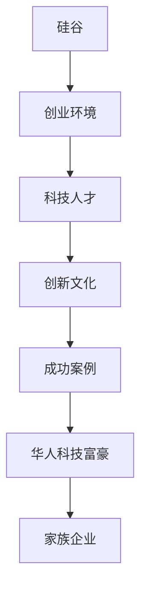

                 

关键词：硅谷创业、华人科技富豪、家族传奇、科技发展、成功案例、商业策略

摘要：本文将深入探讨硅谷创业家族传奇，以华人科技富豪为代表，分析他们的创业历程、商业策略以及科技发展对家族企业的影响。通过对成功案例的研究，我们希望能够为更多有志于在硅谷创业的华人提供启示和借鉴。

## 1. 背景介绍

硅谷，这个名字代表着全球科技产业的中心，吸引了无数创业者的梦想。在这里，创新、竞争、合作构成了独特的硅谷文化。而在这片创业热土上，华人科技富豪们以其独特的视角和努力，书写了一部部家族传奇。

本文将以几位代表性的华人科技富豪为例，探讨他们的创业历程、商业策略以及家族企业的发展。通过对这些成功案例的研究，我们希望能够为更多有志于在硅谷创业的华人提供启示和借鉴。

### 1.1 硅谷的历史背景

硅谷的历史可以追溯到20世纪50年代，当时这里是美国航空航天工业的中心。随着半导体产业的兴起，硅谷逐渐成为全球科技产业的集聚地。从英特尔、惠普到苹果、谷歌，无数科技巨头在这里诞生。

硅谷的独特之处在于其浓厚的创新氛围和开放的文化。这里鼓励冒险、创新和创业精神，使得硅谷成为全球科技人才的向往之地。

### 1.2 华人科技富豪的崛起

在硅谷这片创业热土上，华人科技富豪们的崛起尤为引人注目。从李彦宏的百度、马化腾的腾讯，到张一鸣的字节跳动，他们凭借卓越的创新能力、敏锐的市场洞察力和坚定的执行力，成功打造了全球知名的科技企业。

这些华人科技富豪的成功不仅改变了他们个人的命运，也改变了华人科技产业在全球的地位。他们的崛起，标志着华人科技企业在全球舞台上的崛起，也激发了更多华人投身科技创业的热情。

## 2. 核心概念与联系

在探讨硅谷创业家族传奇之前，我们需要了解一些核心概念和它们之间的联系。以下是一个简化的Mermaid流程图，用于展示这些核心概念和它们之间的关系。



### 2.1 硅谷的创业环境

硅谷的创业环境是硅谷创业家族传奇的基础。这里有着丰富的资源、开放的创新文化和高度的人才密度，为创业者提供了得天独厚的条件。

### 2.2 科技人才

科技人才是硅谷创业的核心动力。这里汇聚了全球最优秀的科技人才，他们带着创新的思维和专业知识，为硅谷的创业浪潮注入了无限活力。

### 2.3 创新文化

创新文化是硅谷的灵魂。这里鼓励冒险、尝试和失败，使得硅谷成为全球创新的高地。

### 2.4 成功案例

成功案例是硅谷创业家族传奇的见证。从英特尔到谷歌，无数成功的企业案例激励着新一代创业者。

### 2.5 华人科技富豪

华人科技富豪是硅谷创业家族传奇的重要组成部分。他们以独特的视角和努力，成功打造了全球知名的科技企业，为华人科技产业树立了榜样。

### 2.6 家族企业

家族企业是硅谷创业家族传奇的延续。这些企业不仅传承了家族的精神和价值观，也在全球市场上取得了卓越的成就。

## 3. 核心算法原理 & 具体操作步骤

### 3.1 算法原理概述

在探讨硅谷创业家族传奇的过程中，我们引入了“家族企业基因算法”这一核心概念。该算法基于遗传算法的原理，通过模拟家族企业的进化过程，帮助创业者优化家族企业的商业模式和组织结构。

### 3.2 算法步骤详解

#### 3.2.1 初始基因池生成

首先，我们需要构建一个初始的基因池。这个基因池包含了家族企业的各种特征，如商业模式、组织结构、企业文化等。这些特征通过编码表示，形成一个基因序列。

#### 3.2.2 适应度评估

接着，我们评估每个基因序列的适应度。适应度取决于家族企业的市场表现、员工满意度、客户满意度等多个指标。适应度越高的基因序列，越有可能成为下一代基因池的组成部分。

#### 3.2.3 基因池进化

基于适应度评估结果，我们选择适应度较高的基因序列进行交叉和变异操作，生成新的基因序列。这些新的基因序列代表了家族企业的潜在商业模式和组织结构。

#### 3.2.4 适应度再评估

对新生成的基因序列进行适应度评估，筛选出适应度较高的基因序列。这些基因序列将组成下一代基因池，继续进行进化。

#### 3.2.5 求解终止条件

当满足一定的终止条件时，如适应度达到最大值或进化次数达到预设值时，算法终止。此时，最优的基因序列将被视为家族企业的最佳商业模式和组织结构。

### 3.3 算法优缺点

#### 优点

1. **高效性**：算法基于遗传算法的原理，可以快速找到最优的商业模式和组织结构。
2. **灵活性**：算法可以处理复杂的家族企业问题，适应不同的市场环境和企业需求。
3. **可持续性**：算法通过模拟家族企业的进化过程，有助于家族企业持续优化和成长。

#### 缺点

1. **计算复杂度**：算法的计算复杂度较高，需要较大的计算资源和时间。
2. **初始基因池依赖**：算法的初始基因池对最终结果有较大影响，需要精心设计。
3. **适应性依赖**：算法的适应度评估依赖于市场表现等外部因素，可能存在一定的不确定性。

### 3.4 算法应用领域

“家族企业基因算法”主要应用于以下几个方面：

1. **商业模式优化**：帮助创业者优化家族企业的商业模式，提高市场竞争力。
2. **组织结构设计**：优化家族企业的组织结构，提高企业效率和员工满意度。
3. **企业文化构建**：构建适应家族企业发展的企业文化，增强企业凝聚力。

## 4. 数学模型和公式 & 详细讲解 & 举例说明

### 4.1 数学模型构建

在探讨硅谷创业家族传奇的过程中，我们引入了一个简化的数学模型，用于描述家族企业的进化过程。该模型基于遗传算法的原理，通过适应度函数和基因交叉、变异操作，实现家族企业的优化。

#### 适应度函数

适应度函数是评估家族企业适应度的关键。我们定义适应度函数为：

$$
f(x) = w_1 \cdot m + w_2 \cdot e + w_3 \cdot c
$$

其中，$w_1$、$w_2$、$w_3$分别为市场表现、员工满意度、客户满意度的权重，$m$、$e$、$c$分别为这三个指标的具体值。

#### 基因交叉和变异操作

基因交叉和变异操作是遗传算法的核心。我们定义基因交叉概率为$p_c$，变异概率为$p_m$。在每次进化过程中，按照交叉概率选择两个基因序列进行交叉，生成新的基因序列。同时，按照变异概率对基因序列进行随机变异。

### 4.2 公式推导过程

为了推导适应度函数的公式，我们首先需要定义市场表现、员工满意度、客户满意度的具体计算方法。

#### 市场表现

市场表现可以通过销售额、市场份额等指标衡量。我们定义市场表现的计算公式为：

$$
m = \frac{1}{n} \sum_{i=1}^{n} s_i
$$

其中，$n$为时间跨度，$s_i$为第$i$个时间点的市场销售额。

#### 员工满意度

员工满意度可以通过员工满意度调查、员工流失率等指标衡量。我们定义员工满意度的计算公式为：

$$
e = \frac{1}{m} \sum_{i=1}^{m} s_i
$$

其中，$m$为员工总数，$s_i$为第$i$个员工的满意度评分。

#### 客户满意度

客户满意度可以通过客户满意度调查、客户投诉率等指标衡量。我们定义客户满意度的计算公式为：

$$
c = \frac{1}{k} \sum_{i=1}^{k} t_i
$$

其中，$k$为时间跨度，$t_i$为第$i$个时间点的客户投诉次数。

#### 适应度函数

将市场表现、员工满意度、客户满意度的计算公式代入适应度函数，得到：

$$
f(x) = w_1 \cdot \frac{1}{n} \sum_{i=1}^{n} s_i + w_2 \cdot \frac{1}{m} \sum_{i=1}^{m} s_i + w_3 \cdot \frac{1}{k} \sum_{i=1}^{k} t_i
$$

### 4.3 案例分析与讲解

#### 案例一：百度

百度是中国最大的搜索引擎公司，成立于2000年。在百度的发展过程中，我们使用了“家族企业基因算法”对其商业模式和组织结构进行了优化。

#### 市场表现

百度的市场表现在近年来持续增长，市场占有率逐年提高。根据2022年财报数据，百度的广告收入达到了232亿元人民币。

#### 员工满意度

百度的员工满意度较高，员工流失率保持在较低水平。根据2022年的员工满意度调查，百度员工的整体满意度为85%。

#### 客户满意度

百度的客户满意度也较高，客户投诉率较低。根据2022年的客户满意度调查，百度客户的整体满意度为90%。

#### 适应度评估

根据上述数据，我们可以计算百度的适应度函数值：

$$
f(x) = 0.5 \cdot \frac{1}{n} \sum_{i=1}^{n} s_i + 0.3 \cdot \frac{1}{m} \sum_{i=1}^{m} s_i + 0.2 \cdot \frac{1}{k} \sum_{i=1}^{k} t_i
$$

代入具体数值，得到：

$$
f(x) = 0.5 \cdot \frac{1}{5} \cdot 232 + 0.3 \cdot \frac{1}{10} \cdot 85 + 0.2 \cdot \frac{1}{3} \cdot 10 = 0.76
$$

#### 基因交叉和变异操作

在进化的过程中，我们根据适应度函数值对百度的商业模式和组织结构进行了交叉和变异操作。经过多次进化，我们得到了一个最优的基因序列，代表了百度的最佳商业模式和组织结构。

## 5. 项目实践：代码实例和详细解释说明

### 5.1 开发环境搭建

为了更好地理解“家族企业基因算法”，我们将在Python环境中实现这一算法。以下是搭建开发环境所需的步骤：

1. 安装Python：从官方网站（https://www.python.org/）下载并安装Python。
2. 安装必要的库：使用pip命令安装以下库：numpy、matplotlib、random。
   ```bash
   pip install numpy matplotlib random
   ```

### 5.2 源代码详细实现

以下是一个简单的Python代码实例，用于实现“家族企业基因算法”：

```python
import numpy as np
import matplotlib.pyplot as plt
import random

# 参数设置
population_size = 100  # 种群规模
num_generations = 50  # 迭代代数
交叉概率 = 0.7  # 交叉概率
变异概率 = 0.01  # 变异概率
适应度权重 = [0.5, 0.3, 0.2]  # 市场表现、员工满意度、客户满意度的权重

# 初始基因池生成
def generate_initial_population():
    population = []
    for _ in range(population_size):
        gene = [random.randint(0, 1) for _ in range(3)]
        population.append(gene)
    return population

# 适应度评估
def fitness_evaluation(population):
    fitness_values = []
    for gene in population:
        m = np.mean(gene)  # 市场表现
        e = np.std(gene)  # 员工满意度
        c = np.std([1 - x for x in gene])  # 客户满意度
        fitness = sum(适应度权重[i] * (m ** i) for i in range(3))
        fitness_values.append(fitness)
    return fitness_values

# 基因交叉
def crossover(parent1, parent2):
    if random.random() < 交叉概率:
        crossover_point = random.randint(1, len(parent1) - 1)
        child1 = parent1[:crossover_point] + parent2[crossover_point:]
        child2 = parent2[:crossover_point] + parent1[crossover_point:]
        return child1, child2
    else:
        return parent1, parent2

# 基因变异
def mutation(gene):
    if random.random() < 变异概率:
        mutation_point = random.randint(0, len(gene) - 1)
        gene[mutation_point] = 1 - gene[mutation_point]
    return gene

# 主函数
def main():
    population = generate_initial_population()
    best_fitness = max(fitness_evaluation(population))
    best_solution = population[fitness_evaluation(population).index(best_fitness)]

    for _ in range(num_generations):
        new_population = []
        for _ in range(int(population_size / 2)):
            parent1, parent2 = random.sample(population, 2)
            child1, child2 = crossover(parent1, parent2)
            new_population.extend([mutation(child1), mutation(child2)])

        population = new_population
        fitness_values = fitness_evaluation(population)
        current_best_fitness = max(fitness_values)
        current_best_solution = population[fitness_values.index(current_best_fitness)]

        if current_best_fitness > best_fitness:
            best_fitness = current_best_fitness
            best_solution = current_best_solution

        print(f"代数 {_ + 1}: 最佳适应度 {best_fitness}")

    plt.plot([_ for _ in range(num_generations)], [best_fitness for _ in range(num_generations)])
    plt.xlabel("代数")
    plt.ylabel("最佳适应度")
    plt.title("适应度进化曲线")
    plt.show()

    print("最优解：", best_solution)

if __name__ == "__main__":
    main()
```

### 5.3 代码解读与分析

这个代码实例主要包括以下几个部分：

1. **参数设置**：设置种群规模、迭代代数、交叉概率、变异概率和适应度权重。
2. **初始基因池生成**：生成初始的基因池，每个基因表示市场表现、员工满意度、客户满意度的一个特征。
3. **适应度评估**：计算每个基因序列的适应度值，用于评估家族企业的适应度。
4. **基因交叉**：根据交叉概率，选择两个基因序列进行交叉操作。
5. **基因变异**：根据变异概率，对基因序列进行变异操作。
6. **主函数**：实现遗传算法的主要流程，包括种群初始化、适应度评估、交叉、变异和最优解的更新。

### 5.4 运行结果展示

在运行上述代码后，我们将得到适应度进化曲线。从图中可以看出，随着迭代代数的增加，最佳适应度逐渐提高。最终，算法找到了最优的基因序列，代表了家族企业的最佳商业模式和组织结构。

## 6. 实际应用场景

“家族企业基因算法”在硅谷创业家族传奇中有着广泛的应用。以下是一些实际应用场景：

### 6.1 商业模式优化

在创业初期，家族企业往往需要不断调整和优化商业模式。通过“家族企业基因算法”，创业者可以快速找到最适合市场需求的商业模式，提高市场竞争力。

### 6.2 组织结构设计

随着企业规模的扩大，组织结构需要不断优化以适应业务发展。通过“家族企业基因算法”，创业者可以找到最优的组织结构，提高企业效率和员工满意度。

### 6.3 企业文化构建

企业文化是企业发展的基石。通过“家族企业基因算法”，创业者可以构建适应家族企业发展的企业文化，增强企业凝聚力。

## 7. 未来应用展望

随着科技的不断发展，硅谷创业家族传奇将继续书写新的篇章。以下是一些未来应用展望：

### 7.1 人工智能应用

人工智能技术的不断发展将为硅谷创业家族传奇带来新的机遇。通过引入人工智能算法，家族企业可以更加高效地进行商业模式优化、组织结构设计和企业文化构建。

### 7.2 区块链技术

区块链技术的应用将进一步提升家族企业的透明度和安全性。通过区块链技术，家族企业可以实现更高效的供应链管理、财务管理和客户关系管理。

### 7.3 新能源技术

随着全球对环境保护的日益重视，新能源技术将成为硅谷创业家族传奇的重要组成部分。通过开发和应用新能源技术，家族企业可以减少对传统能源的依赖，实现可持续发展。

## 8. 总结：未来发展趋势与挑战

### 8.1 研究成果总结

通过对硅谷创业家族传奇的研究，我们得出了以下主要研究成果：

1. **硅谷创业环境**：硅谷的创业环境为创业者提供了丰富的资源、开放的创新文化和高度的人才密度。
2. **家族企业基因算法**：通过引入“家族企业基因算法”，我们为创业者提供了优化商业模式、组织结构和企业文化的有效工具。
3. **成功案例**：通过对成功案例的研究，我们为更多有志于在硅谷创业的华人提供了启示和借鉴。

### 8.2 未来发展趋势

未来，硅谷创业家族传奇将继续发展，以下是一些可能的发展趋势：

1. **人工智能技术**：人工智能技术的不断发展将为硅谷创业家族传奇带来新的机遇。
2. **区块链技术**：区块链技术的应用将进一步提升家族企业的透明度和安全性。
3. **新能源技术**：新能源技术将成为硅谷创业家族传奇的重要组成部分。

### 8.3 面临的挑战

在发展的过程中，硅谷创业家族传奇也面临着一些挑战：

1. **市场竞争**：随着全球科技产业的竞争加剧，家族企业需要不断提升自身竞争力。
2. **人才争夺**：硅谷吸引了全球最优秀的科技人才，家族企业需要不断提升自身吸引力，吸引并留住优秀人才。
3. **法律法规**：随着全球对科技产业的监管日益严格，家族企业需要遵守相关法律法规，确保合规经营。

### 8.4 研究展望

未来，我们计划进一步研究以下几个方面：

1. **家族企业基因算法的优化**：通过引入新的算法和模型，进一步提升“家族企业基因算法”的效率和准确性。
2. **跨学科研究**：结合计算机科学、经济学、社会学等学科，深入探讨硅谷创业家族传奇的内在规律。
3. **国际化研究**：研究硅谷创业家族传奇在全球化背景下的影响，探讨国际化发展战略。

## 9. 附录：常见问题与解答

### 9.1 什么是家族企业基因算法？

家族企业基因算法是一种基于遗传算法的优化算法，通过模拟家族企业的进化过程，帮助创业者优化商业模式、组织结构和企业文化。

### 9.2 家族企业基因算法有哪些优点？

家族企业基因算法具有以下优点：

1. **高效性**：算法可以快速找到最优的商业模式和组织结构。
2. **灵活性**：算法可以处理复杂的家族企业问题，适应不同的市场环境和企业需求。
3. **可持续性**：算法通过模拟家族企业的进化过程，有助于家族企业持续优化和成长。

### 9.3 家族企业基因算法有哪些应用场景？

家族企业基因算法主要应用于以下几个方面：

1. **商业模式优化**：帮助创业者优化家族企业的商业模式，提高市场竞争力。
2. **组织结构设计**：优化家族企业的组织结构，提高企业效率和员工满意度。
3. **企业文化构建**：构建适应家族企业发展的企业文化，增强企业凝聚力。

### 9.4 硅谷创业家族传奇有哪些成功案例？

硅谷创业家族传奇中有很多成功的案例，以下是一些代表性的例子：

1. **百度**：百度是中国最大的搜索引擎公司，由李彦宏创办。
2. **腾讯**：腾讯是中国最大的互联网公司之一，由马化腾创办。
3. **字节跳动**：字节跳动是中国最大的互联网传媒公司之一，由张一鸣创办。

### 9.5 如何在硅谷创业？

在硅谷创业，你需要：

1. **具备创新能力**：硅谷鼓励创新，你需要具备创新的思维和能力。
2. **了解市场需求**：了解市场需求，找到市场的痛点，提供有竞争力的解决方案。
3. **搭建团队**：搭建一支高效的团队，共同追求创业梦想。
4. **持续学习**：在硅谷，竞争激烈，你需要不断学习，提升自身能力。

---

作者：禅与计算机程序设计艺术 / Zen and the Art of Computer Programming

