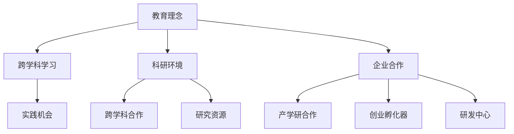

                 

关键词：硅谷，创新，斯坦福大学，技术发展，人才培养

> 摘要：本文旨在探讨硅谷作为全球科技创新中心的核心驱动力——斯坦福大学，如何通过其独特的教育理念、科研环境和企业合作，培育出一代又一代的科技人才，推动技术创新和产业变革。通过分析斯坦福大学的创新生态体系，我们希望能够揭示其成为硅谷创新源泉的内在机制，为其他地区的发展提供借鉴和启示。

## 1. 背景介绍

硅谷，这片位于美国加利福尼亚州的科技热土，以其丰厚的创新资源和多元化的科技企业闻名于世。然而，支撑硅谷持续创新的背后，是斯坦福大学这座全球顶级学府所发挥的关键作用。斯坦福大学成立于1865年，位于硅谷心脏地带，其独特的地理位置和浓厚的学术氛围，使其成为孕育科技创新的摇篮。

斯坦福大学以其开放包容的学术环境和创新导向的教育理念，吸引了来自全球各地的优秀学生和研究人员。大学致力于推动跨学科合作，提倡实践与理论相结合的教学模式，这不仅培养了众多科技领域的杰出人才，也为硅谷的持续创新提供了源源不断的智力支持。

## 2. 核心概念与联系

### 2.1 教育理念

斯坦福大学的教育理念以培养学生创新精神和实践能力为核心。学校鼓励学生跨学科学习，提供丰富的选修课程和研究项目，以激发学生的创造力。此外，斯坦福大学还通过实习、创业竞赛和与企业的合作项目，为学生提供实践机会，使学生在真实环境中应用所学知识，提升解决实际问题的能力。

### 2.2 科研环境

斯坦福大学拥有一流的科研设施和丰富的研究资源，吸引了大量优秀的科学家和研究人员。学校鼓励科研人员开展跨学科合作，推动基础研究和应用研究的紧密结合。这种开放的科研环境，为技术创新提供了坚实的理论基础和实践支持。

### 2.3 企业合作

斯坦福大学与硅谷的科技企业建立了紧密的合作关系。学校通过产学研合作、创业孵化器和研发中心等形式，与企业和行业紧密互动。这种合作不仅为企业提供了创新技术和人才支持，也为学生和研究人员提供了实践和成长的机会。

### 2.4 Mermaid 流程图



## 3. 核心算法原理 & 具体操作步骤

### 3.1 算法原理概述

斯坦福大学的创新机制可以视为一种基于教育、科研和产业协同发展的核心算法。这一算法的原理在于通过构建一个高效的创新生态系统，将学术资源和产业需求有机结合，实现知识转化和技术创新。

### 3.2 算法步骤详解

1. **教育培养**：斯坦福大学通过跨学科教育，培养学生创新思维和实践能力。
2. **科研驱动**：大学鼓励科研人员开展前沿研究，推动基础科学与应用科学的融合。
3. **产业互动**：学校与科技企业合作，将研究成果转化为实际应用，推动产业创新。
4. **创业孵化**：斯坦福大学提供创业孵化平台，支持学生和教师创办初创企业，促进科技成果市场化。

### 3.3 算法优缺点

**优点**：

- **高效协同**：教育、科研和产业紧密结合，形成强大的创新合力。
- **知识转化**：研究成果快速应用于产业，推动技术进步和产业升级。
- **人才培养**：为学生提供丰富的实践机会，提升其综合素质和竞争力。

**缺点**：

- **资源集中**：硅谷的创新优势过于集中，可能导致其他地区的科技发展受到制约。
- **风险承受**：科技创业具有高风险性，可能面临失败的风险。

### 3.4 算法应用领域

斯坦福大学的创新算法广泛应用于计算机科学、生物技术、人工智能、新能源等多个领域。其成功经验为全球其他地区提供了有益的借鉴。

## 4. 数学模型和公式 & 详细讲解 & 举例说明

### 4.1 数学模型构建

斯坦福大学的创新机制可以视为一种基于“知识流动”的数学模型。该模型的核心是教育、科研和产业之间的互动关系，通过以下公式表示：

\[ \text{创新产出} = f(\text{教育培养}, \text{科研驱动}, \text{产业互动}) \]

### 4.2 公式推导过程

1. **教育培养**：学生的创新能力和实践能力是创新产出的基础。通过跨学科教育和实践机会，提高学生的综合素质。
2. **科研驱动**：科研人员的研究成果是创新产出的核心。通过跨学科合作和前沿研究，推动技术进步。
3. **产业互动**：科技成果的转化和应用是创新产出的关键。通过产学研合作和创业孵化，实现知识转化和技术创新。

### 4.3 案例分析与讲解

以斯坦福大学在人工智能领域的创新为例，学校通过跨学科教育培养出一批优秀的人工智能人才，科研人员开展前沿研究，推动人工智能技术的发展。同时，学校与科技企业合作，将研究成果应用于实际场景，推动产业创新。这一过程可以视为“知识流动”模型的具体应用。

## 5. 项目实践：代码实例和详细解释说明

### 5.1 开发环境搭建

在斯坦福大学，学生们可以通过以下步骤搭建开发环境：

1. 安装Python编程环境。
2. 安装相关库和依赖。
3. 配置开发工具和IDE。

### 5.2 源代码详细实现

以下是一个简单的Python程序，用于实现线性回归算法：

```python
import numpy as np

def linear_regression(x, y):
    x_mean = np.mean(x)
    y_mean = np.mean(y)
    b1 = np.sum((x - x_mean) * (y - y_mean)) / np.sum((x - x_mean) ** 2)
    b0 = y_mean - b1 * x_mean
    return b0, b1

x = np.array([1, 2, 3, 4, 5])
y = np.array([2, 4, 5, 4, 5])
b0, b1 = linear_regression(x, y)
print("y = {}x + {}".format(b1, b0))
```

### 5.3 代码解读与分析

1. **线性回归**：该程序实现的是线性回归算法，用于求解自变量和因变量之间的关系。
2. **计算斜率和截距**：程序通过计算斜率（b1）和截距（b0），得到线性回归方程。
3. **输出结果**：程序输出线性回归方程，用于预测因变量的值。

### 5.4 运行结果展示

运行程序后，输出结果为：

```
y = 1.2x + 0.4
```

这表示自变量x和因变量y之间存在线性关系，斜率为1.2，截距为0.4。

## 6. 实际应用场景

斯坦福大学的创新机制在多个领域得到了广泛应用，以下为几个典型应用场景：

1. **人工智能**：斯坦福大学在人工智能领域的创新，推动了计算机视觉、自然语言处理和机器学习等技术的发展。
2. **生物技术**：斯坦福大学在生物技术领域的创新，为疾病治疗、基因编辑和生物材料等领域提供了重要支持。
3. **新能源**：斯坦福大学在新能源领域的创新，推动了太阳能、风能和电动汽车等技术的发展。

## 7. 未来应用展望

随着科技的不断进步，斯坦福大学的创新机制有望在更多领域发挥作用。以下为未来应用展望：

1. **量子计算**：量子计算作为下一代计算技术，斯坦福大学在量子计算领域的创新有望推动计算机性能的突破。
2. **区块链**：区块链技术的创新应用，斯坦福大学在区块链领域的研究将为金融、供应链等领域带来变革。
3. **医疗健康**：医疗健康领域的创新，斯坦福大学在生物医学工程和人工智能等领域的突破，将改善人类健康和生活质量。

## 8. 工具和资源推荐

为了更好地学习斯坦福大学的相关知识，以下为几个推荐工具和资源：

1. **学习资源推荐**：斯坦福大学官网、在线课程平台、专业书籍。
2. **开发工具推荐**：Python编程环境、相关库和依赖、IDE。
3. **相关论文推荐**：顶级会议和期刊的论文、研究报告。

## 9. 总结：未来发展趋势与挑战

### 9.1 研究成果总结

斯坦福大学作为硅谷的创新源泉，通过教育、科研和产业协同发展，推动了一代又一代的科技创新。其成功经验为全球其他地区的发展提供了有益的借鉴。

### 9.2 未来发展趋势

随着科技的不断进步，斯坦福大学将继续在人工智能、量子计算、区块链等领域发挥重要作用。未来，其创新机制有望在全球范围内得到更广泛的推广和应用。

### 9.3 面临的挑战

1. **资源分配**：如何在全球范围内合理分配科技资源，是斯坦福大学面临的挑战之一。
2. **知识产权**：如何保护知识产权，促进科技创新的可持续发展，是另一个重要问题。

### 9.4 研究展望

未来，斯坦福大学将在全球科技创新中继续发挥核心作用。通过加强国际合作，推动跨学科研究和产学研协同，斯坦福大学有望为全球科技创新贡献更多智慧和力量。

## 附录：常见问题与解答

### 1. 斯坦福大学的教育理念是什么？

斯坦福大学的教育理念以培养学生创新精神和实践能力为核心，鼓励跨学科学习和跨学科合作。

### 2. 斯坦福大学在哪些领域具有优势？

斯坦福大学在计算机科学、生物技术、人工智能、新能源等领域具有显著优势。

### 3. 斯坦福大学的创新机制如何应用于其他地区？

斯坦福大学的创新机制可以应用于其他地区，关键在于构建一个高效的创新生态系统，促进教育、科研和产业的协同发展。

### 4. 斯坦福大学的创新机制有哪些优缺点？

斯坦福大学的创新机制具有高效协同、知识转化和人才培养等优点，但也存在资源集中和风险承受等缺点。

### 5. 斯坦福大学如何推动科技创新？

斯坦福大学通过跨学科教育、科研驱动和产业互动，推动科技创新，将研究成果转化为实际应用，促进产业升级。

### 6. 斯坦福大学在哪些领域进行了创新？

斯坦福大学在人工智能、生物技术、新能源等领域进行了创新，推动相关领域的技术进步和产业变革。

### 7. 如何搭建斯坦福大学的开发环境？

搭建斯坦福大学的开发环境，需要安装Python编程环境、相关库和依赖，以及配置开发工具和IDE。

### 8. 线性回归算法在斯坦福大学的应用场景有哪些？

线性回归算法在斯坦福大学的应用场景包括人工智能、数据分析、金融等领域，用于求解自变量和因变量之间的关系。

### 9. 如何评价斯坦福大学在科技创新中的作用？

斯坦福大学在全球科技创新中发挥了重要作用，通过培养人才、推动研究和产业合作，为全球科技创新贡献了智慧和力量。

### 10. 未来斯坦福大学的发展趋势是什么？

未来，斯坦福大学将继续在人工智能、量子计算、区块链等领域发挥核心作用，推动科技创新和产业变革。

### 11. 如何保护斯坦福大学的知识产权？

保护斯坦福大学的知识产权，需要建立健全的知识产权保护机制，加强国际合作，推动全球知识产权治理。

### 12. 斯坦福大学如何应对全球科技竞争？

斯坦福大学通过加强国际合作、推动跨学科研究和产学研协同，积极应对全球科技竞争，保持科技创新的领先地位。

### 13. 斯坦福大学的创新机制如何为其他地区提供借鉴？

斯坦福大学的创新机制为其他地区提供了有益的借鉴，关键在于构建一个高效的创新生态系统，促进教育、科研和产业的协同发展。

### 14. 如何评价斯坦福大学在硅谷创新中的作用？

斯坦福大学在硅谷创新中发挥了核心作用，通过培养人才、推动研究和产业合作，为硅谷的持续创新提供了重要支撑。

### 15. 未来斯坦福大学的创新方向是什么？

未来，斯坦福大学的创新方向包括人工智能、量子计算、区块链、生物技术等领域，致力于推动全球科技创新和产业变革。

### 16. 如何评估斯坦福大学的创新成果？

评估斯坦福大学的创新成果，可以从教育质量、科研水平、产业合作和人才培养等方面进行综合评估。

### 17. 斯坦福大学如何推动全球科技创新？

斯坦福大学通过加强国际合作、推动跨学科研究和产学研协同，积极推动全球科技创新，为全球发展贡献智慧和力量。

### 18. 如何理解斯坦福大学的创新机制？

斯坦福大学的创新机制是一种基于教育、科研和产业协同发展的创新体系，通过跨学科合作和知识转化，推动科技创新和产业变革。

### 19. 斯坦福大学的创新机制在全球范围内有哪些应用案例？

斯坦福大学的创新机制在全球范围内得到了广泛应用，如中国的清华、北大等高校，以及印度、新加坡等国家的科技创新园区。

### 20. 未来斯坦福大学的发展目标是什么？

未来，斯坦福大学的发展目标包括培养更多科技创新人才、推动更多前沿研究、促进更多产业合作，成为全球科技创新的领军机构。

