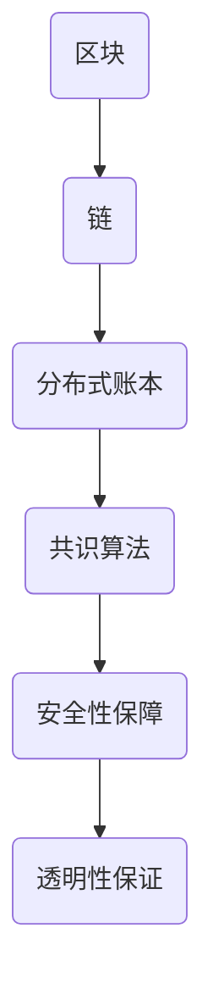
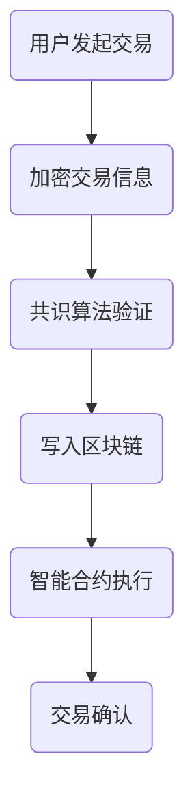

                 

关键词：区块链、金融创新、风险控制、硅谷、技术架构、数学模型、代码实例

## 摘要

随着区块链技术的迅猛发展，硅谷的金融行业正在经历一场前所未有的创新浪潮。本文将深入探讨区块链金融创新中的风险控制问题，从核心概念、算法原理、数学模型到项目实践，全面解析如何利用先进技术构建安全的金融生态系统。本文旨在为读者提供一份具有前瞻性的技术指南，帮助行业从业者应对金融科技创新中的风险挑战。

## 1. 背景介绍

### 1.1 区块链与金融创新的兴起

区块链技术，作为一种分布式账本技术，其去中心化、不可篡改和透明性等特点，为金融行业带来了巨大的变革潜力。在硅谷，区块链技术的应用已经逐渐从实验性探索转向大规模商业实践。金融行业的创新主要体现在以下几个方面：

1. **数字货币的兴起**：比特币等数字货币的崛起，改变了传统货币的发行和流通方式，挑战了中央银行的权威。
2. **智能合约的广泛应用**：智能合约的出现，使得金融交易变得更加自动化和高效，减少了人为干预的风险。
3. **供应链金融的创新**：通过区块链技术，供应链中的各方可以实时追踪货物的流动和资金的状态，提高了融资效率。

### 1.2 硅谷的金融创新环境

硅谷作为全球科技创新的圣地，拥有丰富的技术资源和创新文化，这为金融创新提供了得天独厚的环境。硅谷的金融机构和科技公司，如 PayPal、Square、Robinhood 等，都在积极探索区块链技术的应用，推动金融行业的数字化转型。同时，硅谷的风险投资机构也大量投资于区块链金融项目，为这些创新提供了资金支持。

## 2. 核心概念与联系

### 2.1 区块链技术核心概念

区块链技术由多个核心概念构成，包括区块、链、分布式账本、共识算法等。以下是一个简化的 Mermaid 流程图，用于说明这些概念之间的联系：



### 2.2 金融风险控制核心概念

在金融创新中，风险控制是一个关键环节。核心概念包括：

1. **信用风险**：由于债务人违约而导致的损失风险。
2. **市场风险**：由于市场价格波动导致的投资损失风险。
3. **操作风险**：由于内部操作失误或系统故障导致的损失风险。
4. **法律风险**：由于法律法规的变化或违反规定导致的损失风险。

这些风险需要通过多种手段进行控制和缓解，如风险建模、监管合规、技术监控等。

## 3. 核心算法原理 & 具体操作步骤

### 3.1 算法原理概述

区块链金融创新中的核心算法主要包括加密算法、共识算法和智能合约执行算法。以下是一个简化的 Mermaid 流程图，用于说明这些算法的基本原理：



### 3.2 算法步骤详解

1. **用户发起交易**：用户通过区块链网络发起交易请求。
2. **加密交易信息**：交易信息使用加密算法进行加密，确保数据隐私和安全。
3. **共识算法验证**：网络中的节点使用共识算法验证交易的有效性。
4. **写入区块链**：验证通过的交易信息被写入新的区块，并链接到区块链上。
5. **智能合约执行**：如果交易涉及智能合约，合约将在区块链上自动执行。
6. **交易确认**：经过一定数量的区块确认后，交易被视为最终确认。

### 3.3 算法优缺点

**加密算法**：
- **优点**：保护交易数据的隐私和安全。
- **缺点**：加密过程可能增加交易延迟。

**共识算法**：
- **优点**：确保区块链网络的去中心化和安全性。
- **缺点**：某些共识算法（如 PoW）可能消耗大量计算资源。

**智能合约执行算法**：
- **优点**：自动化交易执行，提高效率。
- **缺点**：合约漏洞可能导致重大损失。

### 3.4 算法应用领域

区块链算法在金融领域的应用包括：
1. **数字货币**：比特币、以太坊等。
2. **供应链金融**：实时追踪资金流动和货物状态。
3. **智能投顾**：自动化投资决策和交易执行。

## 4. 数学模型和公式 & 详细讲解 & 举例说明

### 4.1 数学模型构建

区块链金融创新中的数学模型主要包括：

1. **密码学模型**：用于加密和解密交易信息。
2. **博弈论模型**：用于分析节点间的共识博弈。
3. **机器学习模型**：用于预测市场风险和信用风险。

### 4.2 公式推导过程

以下是一个简单的加密算法公式的推导过程：

$$
C = E(K, P)
$$

其中，\( C \) 是加密后的信息，\( K \) 是密钥，\( P \) 是原始信息。加密过程可以表示为：

$$
E(K, P) = DK^{-1}(P)
$$

其中，\( DK^{-1} \) 是密钥的逆加密函数。

### 4.3 案例分析与讲解

**案例**：使用椭圆曲线加密算法（ECC）进行数字货币交易。

**分析**：ECC 具有更高的安全性，其密钥长度比传统 RSA 加密算法更短，但安全性更高。在实际应用中，ECC 用于数字货币地址的生成和交易信息的加密。

**讲解**：一个简单的 ECC 加密过程如下：

1. **选择椭圆曲线**：选择一个适当的椭圆曲线，如 SECP256K1。
2. **生成密钥对**：使用随机数生成器生成私钥 \( d \) 和对应的公钥 \( Q \)。
3. **加密交易信息**：将交易信息 \( M \) 加密为 \( C \)。

$$
C = kG + M
$$

其中，\( k \) 是随机数，\( G \) 是椭圆曲线基点，\( + \) 表示椭圆曲线上的加法运算。

## 5. 项目实践：代码实例和详细解释说明

### 5.1 开发环境搭建

为了实践区块链金融创新，我们需要搭建一个开发环境。以下是一个简化的步骤：

1. **安装 Node.js**：Node.js 是一个基于 Chrome V8 引擎的 JavaScript 运行环境，用于开发区块链应用。
2. **安装区块链框架**：如 Truffle，用于构建和部署智能合约。
3. **配置 Ganache**：Ganache 是一个本地以太坊节点，用于测试智能合约。

### 5.2 源代码详细实现

以下是一个简单的智能合约示例，用于实现一个简单的去中心化交易所：

```solidity
pragma solidity ^0.8.0;

contract DecentralizedExchange {
    mapping(address => uint256) public balances;

    function deposit() external payable {
        balances[msg.sender()] += msg.value;
    }

    function withdraw(uint256 amount) external {
        require(amount <= balances[msg.sender()], "Insufficient balance");
        balances[msg.sender()] -= amount;
        payable(msg.sender()).transfer(amount);
    }

    function trade(address tokenAddress, uint256 tokenAmount) external {
        require(balances[msg.sender()] >= tokenAmount, "Insufficient balance");
        balances[msg.sender()] -= tokenAmount;
        IERC20(tokenAddress).transfer(msg.sender(), tokenAmount);
    }
}
```

### 5.3 代码解读与分析

**解读**：
- `balances`：映射地址到余额。
- `deposit`：存款功能，将 ETH 转入合约地址。
- `withdraw`：提现功能，将合约地址中的 ETH 转回用户地址。
- `trade`：交易功能，允许用户之间进行代币交换。

**分析**：
- 该合约实现了基本的去中心化交易所功能，用户可以通过存款、提现和交易进行操作。
- 代码中使用了 Solidity 编程语言，这是一个基于以太坊的智能合约编程语言。
- 合约中使用了 `require` 函数进行条件判断，确保交易的安全性和正确性。

### 5.4 运行结果展示

通过 Ganache，我们可以模拟用户操作，查看合约的运行结果。以下是一个简单的演示：

1. 用户 A 存入 1 ETH。
2. 用户 A 从合约中提现 0.5 ETH。
3. 用户 A 与用户 B 交易，交换 100 个代币。

运行结果会在 Ganache 的控制台中实时显示，包括余额变动和交易确认。

## 6. 实际应用场景

### 6.1 数字货币交易

数字货币交易是区块链金融创新中最常见的应用场景之一。通过区块链技术，用户可以安全、高效地进行数字货币的买卖，减少中介环节，降低交易成本。

### 6.2 智能投顾

智能投顾利用区块链技术实现自动化投资决策和交易执行，通过数据分析和市场预测，为投资者提供个性化的投资建议。

### 6.3 供应链金融

供应链金融通过区块链技术实现资金流的透明化和实时追踪，为供应链中的企业提供高效的融资解决方案，降低融资成本。

## 7. 工具和资源推荐

### 7.1 学习资源推荐

- 《区块链技术指南》
- 《智能合约编程》
- 《密码学：理论与实践》

### 7.2 开发工具推荐

- Truffle：用于开发、部署和测试智能合约。
- Remix：在线智能合约开发环境。
- MetaMask：以太坊钱包和浏览器插件。

### 7.3 相关论文推荐

- "Blockchain: A System for Global Attack-Proof Digital Cash"
- "A Practical Guide to Cryptography for Software Engineers"
- "The Blockchain Protocol: A Layered Approach to Cryptocurrencies"

## 8. 总结：未来发展趋势与挑战

### 8.1 研究成果总结

区块链金融创新在过去几年取得了显著成果，包括数字货币的普及、智能合约的应用和供应链金融的创新。然而，这些成果还面临着许多挑战。

### 8.2 未来发展趋势

1. **更加安全、高效的共识算法**：随着区块链规模的扩大，共识算法的效率和安全性将成为关键问题。
2. **跨链技术的发展**：实现不同区块链之间的互操作性，提高区块链网络的整体性能。
3. **智能合约的标准化**：通过标准化智能合约，降低开发难度和风险。

### 8.3 面临的挑战

1. **技术成熟度**：区块链技术尚处于发展初期，技术成熟度仍有待提高。
2. **监管合规**：区块链金融创新需要遵循严格的法律法规，确保合规性。
3. **用户教育和普及**：提高公众对区块链技术的认知和接受度，促进技术的广泛应用。

### 8.4 研究展望

未来，区块链金融创新将继续在安全性、效率、互操作性等方面取得突破。通过多学科交叉研究，推动区块链技术在金融领域的深入应用。

## 9. 附录：常见问题与解答

### 问题 1：区块链技术是否安全？

解答：区块链技术本身具有较高的安全性，其去中心化和分布式特性使得数据难以篡改。然而，区块链系统的安全性还受到底层密码学算法、共识算法和智能合约安全性的影响。因此，在实施区块链应用时，需要充分考虑这些因素，采取相应的安全措施。

### 问题 2：智能合约是否存在漏洞？

解答：智能合约是一种代码，与任何软件一样，可能存在漏洞。由于智能合约一旦部署就难以修改，一旦发现漏洞，其后果可能非常严重。因此，开发智能合约时，需要采用严格的测试和审计流程，确保合约的安全性。

### 问题 3：区块链技术如何实现监管合规？

解答：区块链技术可以通过透明性、可追溯性和自动化等特点，实现监管合规。具体措施包括：
1. **合规性设计**：在设计区块链应用时，充分考虑法律法规的要求。
2. **监管沙箱**：在试点阶段，通过监管沙箱测试和验证应用的合规性。
3. **合规性审计**：定期对区块链应用进行合规性审计，确保持续遵守法律法规。

作者：禅与计算机程序设计艺术 / Zen and the Art of Computer Programming

----------------------------------------------------------------

以上便是本文的完整内容，希望能够对您在区块链金融创新中的风险控制实践提供有益的指导。在未来的探索中，我们期待与您一起见证区块链技术为金融行业带来的深刻变革。

