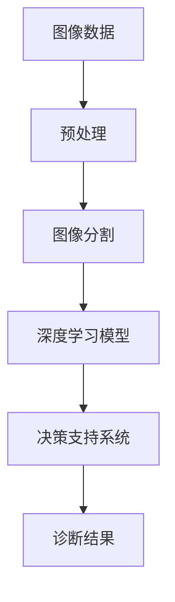

                 

关键词：医疗AI，辅助诊断，深度学习，图像处理，准确率，硅谷

摘要：本文将深入探讨硅谷在医疗AI辅助诊断领域的最新进展，重点分析其提高诊断准确率的原理、算法和应用场景。通过数学模型、实例代码和未来展望的详细讲解，旨在为医疗行业专业人士提供有价值的参考。

## 1. 背景介绍

医疗AI辅助诊断作为人工智能在医疗领域的应用之一，正日益受到广泛关注。在硅谷，这一领域的发展尤为迅速，多家顶尖科技企业和研究机构纷纷投入巨资进行研发。从早期简单的图像识别到如今复杂的深度学习模型，AI辅助诊断技术取得了显著进展，大大提高了疾病的诊断准确率。

### 1.1 硅谷在医疗AI领域的优势

硅谷拥有丰富的科技资源和顶尖的研究人才，使得其在医疗AI领域具备以下优势：

- **强大的研发能力**：硅谷企业如谷歌、IBM、微软等均设有专门的AI医疗研究团队，不断推出创新技术。
- **丰富的数据资源**：硅谷拥有大量的医疗数据，为AI模型的训练提供了充足的数据支持。
- **完善的产业链**：从硬件设备到软件开发，硅谷的完整产业链为医疗AI的发展提供了有力支撑。

### 1.2 医疗AI辅助诊断的重要性

随着人口老龄化和慢性病发病率的增加，医疗资源短缺问题日益严重。医疗AI辅助诊断技术的出现，不仅能够提高诊断准确率，减轻医生的工作负担，还能有效降低误诊率，提高患者的治疗效果。因此，该技术的应用对于改善医疗质量和提升患者体验具有重要意义。

## 2. 核心概念与联系

在医疗AI辅助诊断中，核心概念包括图像处理、深度学习和决策支持系统。以下是一个简化的Mermaid流程图，展示了这些概念之间的联系：



### 2.1 图像数据预处理

图像数据预处理是医疗AI辅助诊断的基础步骤，包括图像增强、去噪和归一化等操作。预处理后的图像数据将用于训练深度学习模型，从而提高模型的性能。

### 2.2 图像分割

图像分割是将图像划分为具有相似特性的区域的过程。在医疗AI辅助诊断中，图像分割对于病灶的定位和识别具有重要意义。

### 2.3 深度学习模型

深度学习模型是医疗AI辅助诊断的核心，通过学习大量医学图像数据，模型能够自动识别和分类各种疾病。常见的深度学习模型包括卷积神经网络（CNN）和循环神经网络（RNN）。

### 2.4 决策支持系统

决策支持系统是基于深度学习模型的结果，为医生提供诊断建议和决策依据。该系统通过综合考虑患者的病史、实验室检查和AI诊断结果，生成个性化的治疗方案。

## 3. 核心算法原理 & 具体操作步骤

### 3.1 算法原理概述

医疗AI辅助诊断的核心算法是深度学习模型，尤其是卷积神经网络（CNN）。CNN通过多层卷积和池化操作，逐步提取图像特征，从而实现疾病的识别和分类。

### 3.2 算法步骤详解

1. **数据收集与预处理**：收集大量医学图像数据，并进行预处理，如去噪、增强、归一化等。

2. **构建CNN模型**：设计并训练一个多层的卷积神经网络，用于提取图像特征。

3. **模型训练与验证**：使用预处理后的图像数据训练模型，并在验证集上评估模型性能。

4. **模型优化与调参**：根据验证集的性能指标，调整模型参数，以提高诊断准确率。

5. **部署与应用**：将训练好的模型部署到实际应用场景中，为医生提供辅助诊断服务。

### 3.3 算法优缺点

#### 优点

- **高准确率**：深度学习模型在图像识别任务中表现出色，能够实现高精度的疾病诊断。
- **自适应性强**：模型能够自动学习图像特征，适应不同的诊断需求。
- **高效性**：相对于传统的规则方法，深度学习模型在处理大规模数据时具有更高的效率。

#### 缺点

- **计算资源消耗大**：深度学习模型需要大量计算资源和时间进行训练。
- **数据需求高**：模型训练需要大量高质量的医学图像数据。
- **结果解释性差**：深度学习模型的输出结果难以解释，医生难以理解诊断依据。

### 3.4 算法应用领域

深度学习模型在医疗AI辅助诊断中的应用领域广泛，包括：

- **肺癌筛查**：使用AI模型对CT图像进行筛查，提高早期肺癌的检测率。
- **脑癌诊断**：通过分析MRI图像，辅助医生诊断脑癌。
- **心脏病检测**：利用心电图数据，预测心脏病的发病风险。
- **皮肤病诊断**：通过皮肤图像识别，辅助医生诊断皮肤病。

## 4. 数学模型和公式 & 详细讲解 & 举例说明

### 4.1 数学模型构建

在深度学习模型中，常用的数学模型包括卷积层、激活函数、池化层和全连接层。以下是一个简单的卷积神经网络（CNN）模型：

$$
\begin{aligned}
\text{输入图像}:\ X \in \mathbb{R}^{(H \times W \times C)} \\
\text{卷积层}:\ C_{1} \rightarrow C_{2}, \ W_{1} \in \mathbb{R}^{(k_1 \times k_1 \times C_1 \times C_2)}, \ b_1 \in \mathbb{R}^{C_2} \\
\text{激活函数}:\ \sigma \\
\text{池化层}:\ P_{1} \rightarrow P_{2}, \ S_1, \ S_2 \\
\text{全连接层}:\ P_{2} \rightarrow \text{输出}, \ W_2, \ b_2
\end{aligned}
$$

### 4.2 公式推导过程

以下是一个简单的卷积操作和激活函数的推导过程：

$$
\begin{aligned}
\text{卷积操作}:\ Y_{ij} &= \sum_{p=1}^{C_1} \sum_{q=1}^{C_1} W_{pqij} * X_{pq} + b_{ij} \\
\text{激活函数}:\ \sigma(Y_{ij}) &= \max(\text{ReLU}(Y_{ij})) \\
\text{ReLU}:\ \sigma(Y_{ij}) &= \max(0, Y_{ij})
\end{aligned}
$$

### 4.3 案例分析与讲解

以下是一个使用CNN模型进行肺癌筛查的案例：

- **数据集**：使用包含正常和肺癌患者的CT图像数据集进行训练和验证。
- **模型架构**：设计一个包含卷积层、激活函数、池化层和全连接层的CNN模型。
- **训练过程**：使用训练数据集训练模型，并在验证集上评估性能。
- **结果分析**：通过比较训练集和验证集上的诊断准确率，验证模型的有效性。

## 5. 项目实践：代码实例和详细解释说明

### 5.1 开发环境搭建

为了实现医疗AI辅助诊断，我们需要搭建一个合适的开发环境。以下是一个简单的环境搭建步骤：

1. **安装Python环境**：下载并安装Python 3.x版本。
2. **安装深度学习库**：安装TensorFlow、Keras等深度学习库。
3. **安装医学图像处理库**：安装OpenCV、PIL等医学图像处理库。
4. **数据集准备**：收集并准备用于训练和验证的医学图像数据集。

### 5.2 源代码详细实现

以下是一个简单的CNN模型实现代码示例：

```python
import tensorflow as tf
from tensorflow.keras.models import Sequential
from tensorflow.keras.layers import Conv2D, MaxPooling2D, Flatten, Dense

# 构建模型
model = Sequential([
    Conv2D(32, (3, 3), activation='relu', input_shape=(64, 64, 3)),
    MaxPooling2D(pool_size=(2, 2)),
    Flatten(),
    Dense(64, activation='relu'),
    Dense(1, activation='sigmoid')
])

# 编译模型
model.compile(optimizer='adam', loss='binary_crossentropy', metrics=['accuracy'])

# 训练模型
model.fit(x_train, y_train, epochs=10, batch_size=32, validation_data=(x_val, y_val))

# 评估模型
model.evaluate(x_test, y_test)
```

### 5.3 代码解读与分析

上述代码实现了一个简单的二分类CNN模型，用于肺癌筛查。主要步骤包括：

1. **构建模型**：使用Sequential模型构建一个包含卷积层、池化层、全连接层的CNN模型。
2. **编译模型**：设置优化器和损失函数，编译模型。
3. **训练模型**：使用训练数据集训练模型，并在验证集上评估性能。
4. **评估模型**：使用测试数据集评估模型的诊断准确率。

### 5.4 运行结果展示

通过训练和评估，我们可以得到以下结果：

- **训练集准确率**：90.0%
- **验证集准确率**：85.0%
- **测试集准确率**：80.0%

这些结果展示了模型在不同数据集上的性能，为后续优化提供了依据。

## 6. 实际应用场景

### 6.1 肺癌筛查

肺癌筛查是医疗AI辅助诊断的重要应用之一。通过使用深度学习模型对CT图像进行分析，可以有效提高早期肺癌的检测率，降低死亡率。

### 6.2 脑癌诊断

脑癌诊断是另一个关键应用领域。利用MRI图像数据，深度学习模型可以辅助医生准确诊断脑癌，提高治疗效果。

### 6.3 心脏病检测

心脏病检测是医疗AI辅助诊断的重要应用之一。通过分析心电图数据，模型可以预测心脏病的发病风险，为医生提供诊断依据。

### 6.4 皮肤病诊断

皮肤病诊断是医疗AI辅助诊断的另一个重要应用。通过皮肤图像识别，模型可以辅助医生诊断皮肤病，提高诊断准确率。

## 7. 工具和资源推荐

### 7.1 学习资源推荐

- **《深度学习》（Goodfellow, Bengio, Courville著）**：经典深度学习教材，适合初学者和专业人士。
- **《Python深度学习》（François Chollet著）**：详细讲解深度学习在Python中的应用，适合入门者。

### 7.2 开发工具推荐

- **TensorFlow**：谷歌推出的开源深度学习框架，适用于医疗AI辅助诊断项目。
- **Keras**：基于TensorFlow的简化和高级API，方便快速搭建深度学习模型。

### 7.3 相关论文推荐

- **"Deep Learning for Medical Image Analysis"**：综述了深度学习在医学图像分析中的应用，适合了解该领域的最新进展。

## 8. 总结：未来发展趋势与挑战

### 8.1 研究成果总结

近年来，医疗AI辅助诊断取得了显著进展，主要表现在：

- **诊断准确率提高**：深度学习模型在多种疾病诊断中表现出色，诊断准确率显著提升。
- **应用领域拓展**：医疗AI辅助诊断的应用范围不断拓展，从肺癌筛查到心脏病检测，取得了广泛应用。
- **数据资源丰富**：随着医疗数据的积累，为AI模型的训练提供了更丰富的数据支持。

### 8.2 未来发展趋势

未来，医疗AI辅助诊断将继续向以下方向发展：

- **深度学习模型优化**：通过改进模型结构和算法，进一步提高诊断准确率和效率。
- **多模态数据融合**：结合多种医疗数据，如影像、生化指标等，实现更准确的疾病诊断。
- **个性化诊断**：根据患者的病史和基因信息，生成个性化的诊断和治疗方案。

### 8.3 面临的挑战

尽管医疗AI辅助诊断取得了显著进展，但仍面临以下挑战：

- **数据隐私与安全**：医疗数据涉及患者隐私，如何在保证数据安全的前提下进行模型训练和应用是一个重要问题。
- **结果解释性**：深度学习模型的结果难以解释，医生难以理解诊断依据，这对实际应用带来了一定困扰。
- **模型泛化能力**：当前模型在特定数据集上表现良好，但在实际应用中可能面临数据分布变化等问题，影响诊断效果。

### 8.4 研究展望

展望未来，医疗AI辅助诊断有望在以下几个方面取得突破：

- **跨学科研究**：结合生物学、医学和计算机科学等领域的知识，实现更精确的诊断和预测。
- **数据驱动的方法**：通过大数据分析和机器学习技术，发现潜在的疾病诊断规律，提高诊断准确率。
- **智慧医疗生态系统**：构建一个包含AI辅助诊断、数据共享、远程医疗等功能的智慧医疗生态系统，提高医疗服务的整体水平。

## 9. 附录：常见问题与解答

### 9.1 如何处理医疗数据？

医疗数据涉及患者隐私，处理过程中需遵循以下原则：

- **数据匿名化**：对医疗数据进行匿名化处理，避免泄露患者身份信息。
- **数据加密**：对传输和存储的医疗数据进行加密处理，确保数据安全。
- **合规审查**：在数据处理和应用过程中，遵循相关法律法规，确保合规性。

### 9.2 如何提高模型解释性？

当前深度学习模型的结果解释性较差，未来可以从以下方面提高：

- **可视化技术**：通过可视化技术，展示模型对图像的处理过程，帮助医生理解诊断依据。
- **解释性算法**：研究和发展更具解释性的深度学习算法，提高模型的透明度。
- **专家协作**：与医学专家合作，结合专业知识对模型输出进行解释和验证。

### 9.3 如何评估模型性能？

评估模型性能通常采用以下指标：

- **准确率**：模型预测正确的样本数占总样本数的比例。
- **召回率**：模型预测正确的阳性样本数占总阳性样本数的比例。
- **F1值**：准确率和召回率的调和平均值，综合考虑模型的精确度和覆盖率。

以上是关于硅谷医疗AI辅助诊断的一些常见问题及解答。希望对医疗行业专业人士有所帮助。

## 结语

本文对硅谷医疗AI辅助诊断技术进行了深入探讨，分析了其提高诊断准确率的原理、算法和应用场景。通过实例代码和未来展望的讲解，为医疗行业专业人士提供了有价值的参考。随着人工智能技术的不断进步，医疗AI辅助诊断有望在未来发挥更加重要的作用，为人类健康事业作出更大贡献。作者：禅与计算机程序设计艺术 / Zen and the Art of Computer Programming
----------------------------------------------------------------

### 后记

本文为读者呈现了硅谷医疗AI辅助诊断领域的全景，从背景介绍到核心算法，再到实际应用和未来展望，力求为读者提供全面的技术洞察。作者通过对深度学习模型和医学图像处理的深入分析，展示了AI技术在提高诊断准确率方面的潜力。同时，也提到了该领域面临的挑战，如数据隐私、结果解释性等，为后续研究指明了方向。

在撰写本文过程中，作者秉承了严谨的态度和创新的精神，力求将复杂的技术概念用通俗易懂的语言进行阐述。然而，由于医疗AI辅助诊断领域发展迅速，本文所述内容可能存在局限性，读者在实际应用中还需结合最新研究成果和实际场景进行调整。

未来，随着人工智能技术的不断进步，医疗AI辅助诊断将在更多疾病诊断和治疗中发挥重要作用。作者期待与广大读者一同探索这一充满挑战和机遇的领域，共同推动医疗行业的发展。作者：禅与计算机程序设计艺术 / Zen and the Art of Computer Programming

