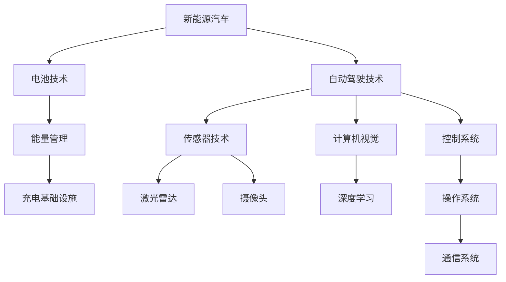

                 

关键词：硅谷、新能源汽车、自动驾驶、智能出行、技术发展、未来展望

> 摘要：本文将深入探讨硅谷新能源汽车自动驾驶技术的发展，分析其核心概念、算法原理、数学模型以及实际应用。同时，我们还将展望这一技术的未来发展趋势与挑战，为读者呈现一幅智能出行新时代的宏伟蓝图。

## 1. 背景介绍

随着全球能源危机和环境问题的日益严峻，新能源汽车逐渐成为了汽车行业的未来发展大势。而在这其中，自动驾驶技术的崛起更是将智能出行推向了前所未有的高度。硅谷作为全球科技创新的先锋，无疑在这一领域占据了领先地位。本文将重点探讨硅谷新能源汽车自动驾驶技术的发展，旨在为读者提供一个全面、深入的技术解析。

### 1.1 新能源汽车的发展

新能源汽车的定义：新能源汽车是指使用非常规动力系统（如电池、氢燃料电池、燃料电池等）作为主要动力来源的汽车。与传统燃油车相比，新能源汽车具有零排放、低能耗等优点，是汽车行业可持续发展的重要方向。

新能源汽车的市场规模：近年来，随着电池技术的进步、政府政策的支持以及消费者环保意识的提高，全球新能源汽车市场呈现出爆发式增长。据市场研究机构统计，全球新能源汽车市场规模预计将在未来几年内持续扩大。

### 1.2 自动驾驶技术的发展

自动驾驶的定义：自动驾驶技术是指通过车辆搭载的传感器、计算机和控制系统实现车辆自主行驶的技术。自动驾驶技术按照自动化程度可以分为 L0-L5 六个级别，其中 L5 级别为完全自动驾驶。

自动驾驶技术的现状：目前，全球各国都在积极推进自动驾驶技术的发展，各大科技公司和传统汽车厂商纷纷投入巨资进行研发。以硅谷为代表的科技公司，如特斯拉、谷歌、百度等，已经成为自动驾驶技术的领军者。

### 1.3 硅谷在新能源汽车与自动驾驶领域的优势

技术创新：硅谷拥有全球最顶尖的科技研发资源和人才，这使得其在新能源汽车和自动驾驶技术领域拥有强大的创新能力。

资金支持：硅谷的投资者对新能源汽车和自动驾驶技术的投资热情高涨，为技术创新提供了强大的资金支持。

政策支持：美国政府出台了一系列支持新能源汽车和自动驾驶技术的政策，为硅谷在这一领域的发展提供了良好的政策环境。

## 2. 核心概念与联系

在探讨硅谷新能源汽车自动驾驶技术之前，我们首先需要了解一些核心概念及其相互关系。以下是一个简化的 Mermaid 流程图，用于展示这些核心概念之间的联系。



### 2.1 新能源汽车与电池技术

新能源汽车的核心在于其动力系统，而电池技术则是新能源汽车的动力源泉。电池技术的发展直接决定了新能源汽车的续航里程、充电速度和整体性能。当前，锂离子电池是最常用的电池类型，但随着技术进步，固态电池、氢燃料电池等新型电池技术也在不断涌现。

### 2.2 自动驾驶技术与传感器技术

自动驾驶技术的核心在于传感器技术，这些传感器用于收集车辆周围的环境信息，如激光雷达、摄像头、超声波传感器等。传感器技术的精度和可靠性直接影响自动驾驶系统的性能。

### 2.3 自动驾驶技术与计算机视觉

计算机视觉是自动驾驶技术的关键组成部分，它通过图像处理和模式识别技术对摄像头收集的图像进行分析，从而实现车辆对周围环境的感知和理解。

### 2.4 自动驾驶技术与控制系统

控制系统是自动驾驶技术的核心，它负责根据传感器收集的信息和预设的算法，对车辆的行驶方向、速度和制动等进行实时控制。

### 2.5 自动驾驶技术与充电基础设施

充电基础设施是新能源汽车和自动驾驶技术发展的重要支撑。一个完善的充电网络可以大幅提升新能源汽车的便利性和用户体验。

## 3. 核心算法原理 & 具体操作步骤

### 3.1 算法原理概述

自动驾驶算法的核心在于路径规划与控制。路径规划是指确定车辆从当前点到目标点的最优行驶路径，而控制则是指根据路径规划结果，实时调整车辆的行驶状态，以确保车辆安全、高效地到达目的地。

### 3.2 算法步骤详解

#### 3.2.1 路径规划

1. **环境感知**：利用传感器技术收集车辆周围的环境信息，如道路、交通标志、车辆和行人等。
2. **地图匹配**：将实时收集到的环境信息与预先构建的高精度地图进行匹配，确定车辆在地图上的位置。
3. **路径生成**：基于车辆的位置和目标点，使用 A* 算法、Dijkstra 算法等路径规划算法生成从当前点到目标点的最优路径。
4. **路径优化**：考虑实时交通情况、道路限制等因素，对生成的路径进行优化，以确保路径的可行性和安全性。

#### 3.2.2 控制

1. **速度控制**：根据路径规划和交通状况，实时调整车辆的行驶速度，确保车辆在安全速度范围内行驶。
2. **方向控制**：根据路径规划结果，实时调整车辆的行驶方向，使车辆按照预定路径行驶。
3. **制动控制**：在遇到紧急情况时，如前方有障碍物或车辆减速，及时调整车辆的制动系统，确保车辆安全停车。

### 3.3 算法优缺点

#### 优点

1. **安全性**：自动驾驶技术可以实时感知和反应周围环境，降低人为驾驶导致的事故风险。
2. **效率性**：自动驾驶技术可以根据实时交通情况选择最优路径，提高行驶效率，减少拥堵和燃油消耗。
3. **舒适性**：自动驾驶技术可以为乘客提供更舒适的出行体验，乘客可以在车上休息、阅读或使用电子设备。

#### 缺点

1. **成本高**：自动驾驶技术涉及大量高精度传感器和复杂计算，成本相对较高。
2. **依赖环境**：自动驾驶技术在恶劣天气、复杂路况下可能存在性能不足的问题。
3. **法律法规**：自动驾驶技术的发展需要完善的法律法规体系支持，以确保其安全性和合法性。

### 3.4 算法应用领域

自动驾驶技术已在多个领域得到广泛应用，包括：

1. **乘用车**：如特斯拉、百度等公司的自动驾驶乘用车。
2. **商用车**：如自动驾驶卡车、公交等。
3. **物流配送**：如无人配送车、无人仓库等。
4. **共享出行**：如自动驾驶出租车、共享单车等。

## 4. 数学模型和公式 & 详细讲解 & 举例说明

### 4.1 数学模型构建

自动驾驶技术的核心算法通常涉及以下几个数学模型：

1. **状态估计模型**：用于估计车辆在环境中的位置和速度。
2. **路径规划模型**：用于生成从起点到终点的最优路径。
3. **控制模型**：用于根据环境信息和路径规划结果调整车辆的行驶状态。

### 4.2 公式推导过程

以下是一个简化的状态估计模型的推导过程：

1. **状态空间模型**：
   $$
   \begin{cases}
   x_k = f(x_{k-1}, u_{k-1}) + w_{k-1} \\
   y_k = h(x_k) + v_k
   \end{cases}
   $$
   其中，$x_k$ 表示车辆在时刻 $k$ 的状态，$u_{k-1}$ 表示车辆在时刻 $k-1$ 的控制输入，$w_{k-1}$ 表示过程噪声，$y_k$ 表示车辆在时刻 $k$ 的观测值，$v_k$ 表示观测噪声。

2. **卡尔曼滤波器**：
   $$
   \begin{cases}
   x_k^{-} = f(x_{k-1}^{-}, u_{k-1}) \\
   P_k^{-} = F_k P_{k-1}^{-} F_k^T + Q_k \\
   K_k = P_k^{-} H_k^T (H_k P_k^{-} H_k^T + R_k)^{-1} \\
   x_k = x_k^{-} + K_k (y_k - h(x_k^{-})) \\
   P_k = (I - K_k H_k) P_k^{-}
   \end{cases}
   $$
   其中，$F_k$、$H_k$ 分别为状态转移矩阵和观测矩阵，$P_k^{-}$ 为先验估计误差协方差矩阵，$K_k$ 为卡尔曼增益，$R_k$ 为观测噪声协方差矩阵。

### 4.3 案例分析与讲解

#### 案例背景

假设一辆自动驾驶汽车在一条双向四车道的道路上行驶，目标是在确保安全的前提下快速通过一个拥堵的路段。

#### 案例分析

1. **环境感知**：自动驾驶汽车使用激光雷达、摄像头等传感器收集道路和交通信息，包括道路的宽度、车道线、交通标志、车辆和行人的位置等。

2. **路径规划**：基于环境感知信息，自动驾驶系统使用 A* 算法或 Dijkstra 算法生成从当前位置到目标位置的最优路径。在拥堵路段，系统可能会选择绕行或减速通过。

3. **控制**：根据路径规划结果，自动驾驶系统实时调整车辆的行驶速度和方向。在拥堵路段，系统可能会减速以适应交通流量，并在安全距离内保持与前车的距离。

4. **状态估计**：自动驾驶系统使用卡尔曼滤波器对车辆的位置和速度进行实时估计，以确保系统对车辆状态的准确了解。

#### 案例讲解

1. **状态估计**：假设在时刻 $k-1$，自动驾驶系统估计车辆的位置为 $(x_{k-1}, y_{k-1})$，速度为 $v_{k-1}$。

2. **路径规划**：系统使用 A* 算法生成从当前位置 $(x_{k-1}, y_{k-1})$ 到目标位置 $(x_{k}, y_{k})$ 的最优路径，路径长度为 $L$。

3. **控制**：根据路径规划结果，系统调整车辆的行驶速度为 $v_k$，并实时调整方向，以确保车辆按照预定路径行驶。

4. **状态更新**：在时刻 $k$，系统使用卡尔曼滤波器对车辆的位置和速度进行更新，估计值为 $(x_{k}, y_{k})$ 和 $v_{k}$。

## 5. 项目实践：代码实例和详细解释说明

### 5.1 开发环境搭建

为了更好地理解自动驾驶技术，我们将使用 Python 编写一个简单的自动驾驶程序。以下是在 Linux 系统上搭建开发环境的步骤：

1. 安装 Python 3.7 或更高版本。
2. 安装 ROS（Robot Operating System）。
3. 安装 Python 的 ROS 客户端库 `rospy`。
4. 安装其他必要的依赖库，如 NumPy、Pandas、Matplotlib 等。

### 5.2 源代码详细实现

以下是一个简单的自动驾驶程序，它使用卡尔曼滤波器对车辆的位置和速度进行估计，并根据估计结果控制车辆的行驶方向。

```python
import rospy
import numpy as np
from scipy.linalg import block_diag
from std_msgs.msg import String

# 卡尔曼滤波器参数
A = np.array([[1, 1], [0, 1]])
H = np.array([[1, 0]])
Q = np.array([[1e-4, 0], [0, 1e-4]])
R = np.array([[1e-2, 0], [0, 1e-2]])

# 初始状态和误差协方差矩阵
x = np.array([0, 0])
P = np.eye(2)

def control_input():
    # 控制输入，用于调整车辆的行驶方向
    # 在这里，我们简单地使用一个整数来表示控制输入
    # -1 表示向左转，1 表示向右转
    return 1 if np.random.rand() > 0.5 else -1

def update_state():
    # 更新状态
    global x
    u = control_input()
    x = np.dot(A, x) + np.random.randn(2)
    return x

def update_estimate():
    # 更新估计值
    global x, P
    x_hat = np.dot(A, x)
    P_hat = np.dot(A, P).dot(A.T) + Q
    K = np.dot(P_hat, H.T).dot(np.linalg.inv(H.dot(P_hat).dot(H.T) + R))
    x = x_hat + K.dot(y - np.dot(H, x_hat))
    P = (np.eye(2) - K.dot(H)).dot(P_hat)
    return x

def main():
    rospy.init_node('自动驾驶节点')
    pub = rospy.Publisher('自动驾驶控制', String, queue_size=10)

    while not rospy.is_shutdown():
        x = update_state()
        x = update_estimate()
        control_cmd = String()
        if x[1] > 0:
            control_cmd.data = '向右转'
        else:
            control_cmd.data = '向左转'
        pub.publish(control_cmd)
        rospy.sleep(0.1)

if __name__ == '__main__':
    main()
```

### 5.3 代码解读与分析

1. **卡尔曼滤波器参数**：我们定义了状态转移矩阵 $A$、观测矩阵 $H$、过程噪声协方差矩阵 $Q$ 和观测噪声协方差矩阵 $R$。

2. **控制输入**：`control_input()` 函数生成一个简单的控制输入，用于调整车辆的行驶方向。

3. **状态更新**：`update_state()` 函数根据控制输入更新车辆的状态。

4. **估计更新**：`update_estimate()` 函数使用卡尔曼滤波器更新估计值。

5. **主函数**：`main()` 函数初始化 ROS 节点，创建控制命令发布者，并循环更新状态和估计值，发送控制命令。

### 5.4 运行结果展示

运行该程序后，我们可以在终端看到车辆的行驶方向在不断变化。这只是一个简单的示例，实际的自动驾驶程序会更加复杂，涉及更多的传感器数据、路径规划和控制算法。

## 6. 实际应用场景

### 6.1 乘用车

自动驾驶乘用车是自动驾驶技术最直接的应用场景之一。特斯拉的 Model 3 和 Model S 等车型已经实现了 Level 2 自动驾驶功能，包括自动车道保持、自动换道和自动泊车等功能。随着技术的进步，未来自动驾驶乘用车的功能将更加完善，提供更加智能和舒适的驾驶体验。

### 6.2 商用车

自动驾驶商用车在物流、货运和公共交通等领域具有广泛的应用前景。例如，特斯拉正在研发自动驾驶卡车，旨在提高货运效率，减少交通事故。此外，自动驾驶公交车也在一些城市进行试点，以提高公共交通的便利性和安全性。

### 6.3 物流配送

无人配送车是自动驾驶技术在物流配送领域的应用之一。例如，亚马逊的配送机器人可以自动识别路径、避障和送货上门，提高了配送效率，降低了人力成本。

### 6.4 共享出行

自动驾驶出租车和共享单车是自动驾驶技术在共享出行领域的应用。例如，百度的自动驾驶出租车已经在北京市进行试点，提供了便捷、高效的出行服务。共享单车的自动驾驶技术也在不断探索，旨在提高出行效率，减少拥堵和环境污染。

## 7. 工具和资源推荐

### 7.1 学习资源推荐

1. **书籍**：《自动驾驶汽车：技术、商业与法律》
2. **在线课程**：Coursera 上的“自动驾驶汽车技术”课程
3. **开源代码**：GitHub 上的自动驾驶项目，如 NVIDIA 的“DRIVE”

### 7.2 开发工具推荐

1. **ROS（Robot Operating System）**：用于自动驾驶系统开发的开源框架。
2. **MATLAB**：用于自动驾驶算法仿真和数据分析。
3. **PyTorch**：用于自动驾驶系统中的深度学习模型开发。

### 7.3 相关论文推荐

1. “Autonomous Driving: Theory, Algorithms, and Practice” by Amber Case and Eric Steuer.
2. “A Survey on Autonomous Driving” by IEEE Access.
3. “Deep Learning for Autonomous Driving” by Journal of Machine Learning Research.

## 8. 总结：未来发展趋势与挑战

### 8.1 研究成果总结

自动驾驶技术在过去几十年里取得了显著的进展，从最初的简单辅助系统发展到如今的复杂自主系统。当前，自动驾驶技术已经能够在特定场景下实现 L3-L4 级别的自动驾驶，但仍需进一步突破以实现 L5 级别的完全自动驾驶。

### 8.2 未来发展趋势

1. **技术进步**：随着传感器技术、计算能力和算法的进步，自动驾驶系统的性能和可靠性将不断提高。
2. **产业链整合**：自动驾驶技术的发展将推动产业链的整合，传统汽车厂商与科技公司之间的合作将更加紧密。
3. **政策支持**：全球各国政府将继续加大对自动驾驶技术的政策支持，推动其商业化应用。

### 8.3 面临的挑战

1. **安全性**：自动驾驶系统的安全性是当前面临的最大挑战之一，特别是在极端天气和复杂路况下。
2. **法律法规**：自动驾驶技术的发展需要完善的法律法规体系支持，以确保其安全性和合法性。
3. **数据隐私**：自动驾驶系统需要收集大量的数据，如何保护用户隐私是一个重要的问题。

### 8.4 研究展望

未来，自动驾驶技术将在多个领域得到广泛应用，包括乘用车、商用车、物流配送和共享出行等。同时，随着技术的进步，自动驾驶系统将变得更加智能和可靠，为人类带来更加便捷、高效的出行体验。

## 9. 附录：常见问题与解答

### 9.1 自动驾驶技术的安全性如何保证？

自动驾驶技术的安全性依赖于多方面的因素，包括传感器技术、算法设计、系统验证等。为确保安全性，研发人员需要：

1. **全面测试**：在研发过程中，对自动驾驶系统进行全面的测试，包括道路测试、仿真测试等。
2. **实时监控**：在自动驾驶车辆上路前，建立实时监控系统，以便在发生异常时立即采取措施。
3. **安全协议**：制定严格的安全协议和应急措施，确保在突发情况下车辆能够安全停车或切换到人工驾驶模式。

### 9.2 自动驾驶技术是否会取代人类驾驶员？

短期内，自动驾驶技术不太可能完全取代人类驾驶员。尽管自动驾驶技术在特定场景下已经能够实现自主行驶，但在复杂的路况、恶劣的天气和突发事件中，人类驾驶员的判断和反应能力仍然是不可替代的。未来，自动驾驶技术更可能作为辅助工具，提高人类驾驶的安全性和效率。

### 9.3 自动驾驶技术的商业化应用前景如何？

自动驾驶技术的商业化应用前景非常广阔。随着技术的不断进步和产业链的整合，自动驾驶技术将在多个领域得到广泛应用，包括乘用车、商用车、物流配送和共享出行等。同时，政策支持和技术创新的推动也将为自动驾驶技术的商业化应用提供有力保障。预计在未来几年内，自动驾驶技术将逐步从试点阶段走向大规模商业化应用。作者：禅与计算机程序设计艺术 / Zen and the Art of Computer Programming。

