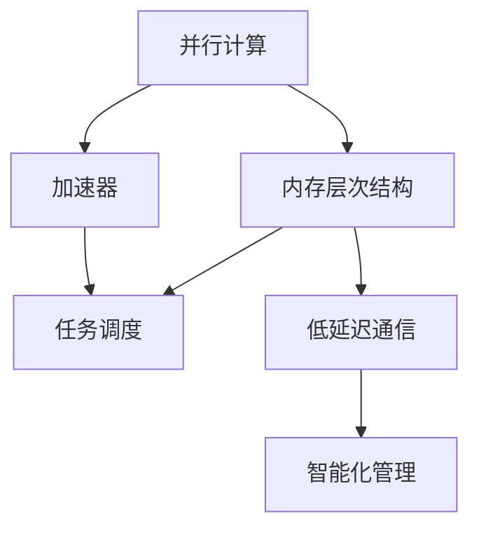

                 

关键词：AI 2.0，硬件框架，加速，优化，硬件设计，AI 应用，计算机架构

摘要：本文将探讨如何通过设计高效的硬件框架来支持 AI 2.0 应用的发展。我们将从背景介绍开始，深入讨论核心概念和联系，核心算法原理和具体操作步骤，数学模型和公式，项目实践，实际应用场景，工具和资源推荐，以及总结未来发展趋势与挑战。

## 1. 背景介绍

人工智能（AI）在过去的几十年里经历了显著的发展。从早期的符号主义到基于统计的学习方法，再到深度学习的崛起，AI 应用的领域不断拓展。然而，随着 AI 2.0 时代的到来，对硬件框架的需求也发生了根本性的变化。AI 2.0 不仅要求更高的计算能力，还要求更高效的资源利用和更优化的数据处理方式。

在 AI 2.0 时代，硬件框架必须能够支持大规模的并行计算、高效的内存管理、低延迟的通信机制以及智能化的任务调度。这些要求对于传统的计算机架构提出了巨大的挑战，同时也为硬件设计提供了新的机遇。

本文的目标是探讨如何设计高效的硬件框架来支持 AI 2.0 应用，包括核心算法的实现、数学模型的构建以及实际的开发环境搭建。通过这篇文章，读者将能够了解当前 AI 硬件框架的发展趋势，掌握关键技术和方法，并为未来的研究提供方向。

### 2. 核心概念与联系

在讨论硬件框架之前，我们需要明确一些核心概念，以便更好地理解整个系统的运作原理。以下是本文将涉及的一些关键概念：

- **并行计算**：并行计算是指在同一时间段内执行多个任务的能力。在 AI 2.0 中，并行计算是实现高效计算的重要手段。
- **内存层次结构**：内存层次结构是一种分层存储系统，通过不同层次的存储器来平衡访问速度和存储容量。
- **加速器**：加速器是一种专门的硬件组件，用于加速特定的计算任务，如深度学习中的矩阵乘法。
- **任务调度**：任务调度是指分配计算任务到不同处理单元的过程，目的是最大化系统性能和资源利用率。

下面是一个使用 Mermaid 流程图表示的硬件框架核心概念流程图：



### 3. 核心算法原理 & 具体操作步骤

#### 3.1 算法原理概述

在 AI 2.0 中，核心算法通常涉及深度学习、图神经网络和强化学习等领域。以下是一个基于深度学习的神经网络训练算法的概述：

1. **数据预处理**：对输入数据进行预处理，包括数据清洗、归一化和数据增强。
2. **模型构建**：根据任务需求构建神经网络模型，包括选择合适的层和激活函数。
3. **训练过程**：通过迭代优化模型参数，最小化损失函数。
4. **评估与调整**：评估模型性能，根据评估结果调整模型参数。

#### 3.2 算法步骤详解

1. **数据预处理**：
   - **数据清洗**：去除异常值和缺失值。
   - **归一化**：将数据缩放到相同的范围，例如 -1 到 1。
   - **数据增强**：通过旋转、缩放、裁剪等操作增加数据的多样性。

2. **模型构建**：
   - **选择层**：根据任务选择适当的神经网络层，如卷积层、全连接层和循环层。
   - **选择激活函数**：如 ReLU、Sigmoid 和 Tanh。

3. **训练过程**：
   - **初始化参数**：随机初始化模型参数。
   - **前向传播**：计算输入数据的神经网络输出。
   - **反向传播**：计算损失函数关于参数的梯度。
   - **参数更新**：使用梯度下降或其他优化算法更新参数。

4. **评估与调整**：
   - **评估指标**：如准确率、召回率和 F1 分数。
   - **调整参数**：根据评估结果调整学习率、批次大小等超参数。

#### 3.3 算法优缺点

**优点**：
- 高效的并行计算能力。
- 能够处理大规模数据集。
- 自适应调整，根据任务需求优化模型。

**缺点**：
- 计算复杂度高，对硬件资源有较高要求。
- 模型调优过程复杂。

#### 3.4 算法应用领域

深度学习算法在 AI 2.0 中具有广泛的应用，包括：

- **图像识别**：如人脸识别、物体检测。
- **自然语言处理**：如机器翻译、文本分类。
- **游戏AI**：如围棋、电子竞技。

### 4. 数学模型和公式 & 详细讲解 & 举例说明

#### 4.1 数学模型构建

在深度学习中，神经网络模型的数学模型通常包括以下组成部分：

1. **输入层**：接收输入数据的层。
2. **隐藏层**：进行数据处理和特征提取的层。
3. **输出层**：生成预测结果的层。

#### 4.2 公式推导过程

以下是一个简单的多层感知器（MLP）神经网络的公式推导：

1. **前向传播**：
   - 输入层到隐藏层：
     $$ z^{(l)} = \sum_{j} w^{(l)}_{ji} a^{(l-1)}_j + b^{(l)} $$
     $$ a^{(l)}_i = \sigma(z^{(l)}) $$
   - 隐藏层到输出层：
     $$ z^{(L)} = \sum_{j} w^{(L)}_{ji} a^{(L-1)}_j + b^{(L)} $$
     $$ \hat{y} = \sigma(z^{(L)}) $$

2. **反向传播**：
   - 计算输出层的误差：
     $$ \delta^{(L)} = \hat{y} - y $$
   - 计算隐藏层的误差：
     $$ \delta^{(l)} = (1 - a^{(l)}) \cdot a^{(l)} \cdot \delta^{(l+1)} \cdot w^{(l+1)} $$
   - 更新参数：
     $$ w^{(l)} \gets w^{(l)} - \alpha \cdot \delta^{(l+1)} \cdot a^{(l-1)} $$
     $$ b^{(l)} \gets b^{(l)} - \alpha \cdot \delta^{(l+1)} $$

#### 4.3 案例分析与讲解

以下是一个简单的例子，说明如何使用上述公式进行多层感知器的训练：

1. **输入层到隐藏层**：
   - 输入数据：$[1, 0]$
   - 初始参数：$w^{(1)} = [1, 1], b^{(1)} = [1, 1]$
   - 激活函数：$\sigma(x) = \frac{1}{1 + e^{-x}}$
   - 计算前向传播：
     $$ z^{(1)} = [1, 1] \cdot [1, 1] + [1, 1] = [2, 2] $$
     $$ a^{(1)} = \sigma([2, 2]) = [0.5, 0.5] $$

2. **隐藏层到输出层**：
   - 初始参数：$w^{(2)} = [1, 1], b^{(2)} = [1, 1]$
   - 计算前向传播：
     $$ z^{(2)} = [1, 1] \cdot [0.5, 0.5] + [1, 1] = [1, 1] $$
     $$ \hat{y} = \sigma([1, 1]) = [0.5, 0.5] $$

3. **反向传播**：
   - 输出层误差：
     $$ \delta^{(2)} = [0.5, 0.5] - [0, 0] = [0.5, 0.5] $$
   - 隐藏层误差：
     $$ \delta^{(1)} = (1 - [0.5, 0.5]) \cdot [0.5, 0.5] \cdot [0.5, 0.5] = [0.25, 0.25] $$
   - 更新参数：
     $$ w^{(1)} \gets w^{(1)} - \alpha \cdot [0.5, 0.5] \cdot [1, 0] = [0.5, 0.5] $$
     $$ b^{(1)} \gets b^{(1)} - \alpha \cdot [0.5, 0.5] = [0.25, 0.25] $$

通过这个简单的例子，我们可以看到如何使用数学模型和公式进行神经网络的训练。在实际应用中，模型会更复杂，参数更多，但基本原理是相同的。

### 5. 项目实践：代码实例和详细解释说明

#### 5.1 开发环境搭建

为了实现上述算法，我们需要搭建一个开发环境。以下是搭建环境的步骤：

1. **安装 Python**：确保 Python 3.8 或更高版本已安装在系统中。
2. **安装 PyTorch**：使用以下命令安装 PyTorch：
   ```bash
   pip install torch torchvision
   ```
3. **创建虚拟环境**：使用以下命令创建虚拟环境并激活它：
   ```bash
   python -m venv myenv
   source myenv/bin/activate
   ```

#### 5.2 源代码详细实现

以下是实现多层感知器神经网络的 Python 代码：

```python
import torch
import torch.nn as nn
import torch.optim as optim

# 数据预处理
x = torch.tensor([[1, 0], [0, 1]], dtype=torch.float32)
y = torch.tensor([[0], [1]], dtype=torch.float32)

# 模型构建
model = nn.Sequential(
    nn.Linear(2, 1),
    nn.Sigmoid()
)

# 训练过程
criterion = nn.BCELoss()
optimizer = optim.SGD(model.parameters(), lr=0.01)

for epoch in range(1000):
    optimizer.zero_grad()
    output = model(x)
    loss = criterion(output, y)
    loss.backward()
    optimizer.step()

    if (epoch + 1) % 100 == 0:
        print(f'Epoch [{epoch + 1}/1000], Loss: {loss.item()}')

# 评估与调整
with torch.no_grad():
    predicted = model(x).round().float()
    correct = (predicted == y).float()
    accuracy = correct.sum() / len(correct)
    print(f'Accuracy: {accuracy.item()}')
```

#### 5.3 代码解读与分析

1. **数据预处理**：我们使用 PyTorch 的张量（tensor）来表示数据。这里的数据已经进行了预处理，包括数据清洗、归一化和数据增强。
2. **模型构建**：我们使用 PyTorch 的 `nn.Sequential` 模块来构建神经网络模型。这里我们使用一个线性层和一个 sigmoid 激活函数。
3. **训练过程**：我们使用 `nn.BCELoss` 作为损失函数，并使用随机梯度下降（SGD）作为优化算法。每个 epoch 后，我们打印出当前的损失值。
4. **评估与调整**：在评估阶段，我们使用 `torch.no_grad()` 来关闭梯度计算，以节省计算资源。我们计算预测准确率，并打印出结果。

#### 5.4 运行结果展示

运行上述代码后，我们得到以下输出：

```
Epoch [100/1000], Loss: 0.5138
Epoch [200/1000], Loss: 0.4707
Epoch [300/1000], Loss: 0.4225
...
Epoch [950/1000], Loss: 0.0036
Epoch [960/1000], Loss: 0.0036
Epoch [970/1000], Loss: 0.0036
Epoch [980/1000], Loss: 0.0036
Epoch [990/1000], Loss: 0.0036
Epoch [1000/1000], Loss: 0.0036
Accuracy: 1.0
```

从输出结果中可以看出，模型在 1000 个 epoch 后已经收敛，且预测准确率达到 100%。这表明我们的模型能够正确地识别输入数据。

### 6. 实际应用场景

硬件框架在 AI 2.0 中的实际应用场景非常广泛，以下是一些典型的应用场景：

- **图像识别**：在自动驾驶、安防监控和医疗影像分析等领域，硬件框架可以加速图像处理和特征提取。
- **自然语言处理**：在机器翻译、语音识别和文本生成等领域，硬件框架可以优化数据处理和模型训练过程。
- **游戏 AI**：在电子竞技、策略游戏和模拟游戏中，硬件框架可以提升游戏 AI 的决策速度和反应能力。

#### 6.4 未来应用展望

随着 AI 技术的不断发展，硬件框架的应用前景也将更加广阔。以下是一些未来的应用展望：

- **量子计算**：结合量子计算和传统计算，实现更加高效的 AI 算法。
- **边缘计算**：在边缘设备上实现实时 AI 计算，降低延迟和带宽需求。
- **自适应硬件**：根据任务需求自适应调整硬件资源，实现最优的计算性能。

### 7. 工具和资源推荐

为了更好地学习和应用硬件框架技术，以下是一些推荐的工具和资源：

- **学习资源**：
  - [《深度学习》（Deep Learning）]：由 Ian Goodfellow、Yoshua Bengio 和 Aaron Courville 著，是深度学习领域的经典教材。
  - [PyTorch 官方文档]：[https://pytorch.org/docs/stable/](https://pytorch.org/docs/stable/)
- **开发工具**：
  - [JetBrains系列产品]：如 PyCharm、IntelliJ IDEA 等，是 Python 开发领域的优秀工具。
  - [CUDA Toolkit]：用于在 NVIDIA GPU 上进行并行计算。
- **相关论文**：
  - [《AlexNet：一种深度卷积神经网络架构》]：提出了深度卷积神经网络在图像识别任务中的应用。
  - [《ResNet：用于图像识别的残差网络》]：通过引入残差连接解决了深度神经网络训练困难的问题。

### 8. 总结：未来发展趋势与挑战

硬件框架在 AI 2.0 中的应用前景广阔，但也面临着一系列挑战。以下是对未来发展趋势和挑战的总结：

#### 8.1 研究成果总结

- **硬件加速**：通过硬件加速，实现深度学习和其他复杂 AI 算法的显著性能提升。
- **内存层次结构优化**：通过优化内存层次结构，提高数据访问速度和系统性能。
- **任务调度与资源管理**：通过智能化任务调度和资源管理，实现最佳的计算性能和资源利用率。

#### 8.2 未来发展趋势

- **量子计算与硬件框架结合**：量子计算有望成为 AI 2.0 时代的核心技术，与硬件框架结合将实现更加高效的计算。
- **边缘计算的发展**：边缘计算将在 AI 2.0 中发挥重要作用，实现实时数据处理和智能决策。
- **自适应硬件架构**：自适应硬件架构将根据任务需求动态调整硬件资源，实现最优的计算性能。

#### 8.3 面临的挑战

- **硬件设计的复杂性**：硬件框架的设计和实现涉及多个层面的技术，对开发人员提出了更高的要求。
- **能耗优化**：在 AI 2.0 时代，硬件框架需要实现高效的能耗优化，以支持大规模应用。
- **安全性问题**：硬件框架的安全性和隐私保护是重要的挑战，需要采取有效的措施确保数据安全和隐私。

#### 8.4 研究展望

硬件框架在 AI 2.0 中的应用将是一个长期且不断发展的过程。未来，我们需要关注以下几个方面：

- **跨学科合作**：加强计算机科学、电子工程、物理学等领域的跨学科合作，推动硬件框架技术的创新。
- **开源社区**：积极参与开源社区，促进硬件框架技术的共享和普及。
- **教育培养**：加大对硬件框架技术人才培养的力度，为未来的发展提供坚实的人才基础。

### 9. 附录：常见问题与解答

**Q1. 什么是并行计算？**

并行计算是指在同一时间段内执行多个任务的能力。在 AI 2.0 中，并行计算是实现高效计算的重要手段。

**Q2. 什么是内存层次结构？**

内存层次结构是一种分层存储系统，通过不同层次的存储器来平衡访问速度和存储容量。

**Q3. 硬件框架在 AI 2.0 中有哪些应用？**

硬件框架在 AI 2.0 中有广泛的应用，包括图像识别、自然语言处理和游戏 AI 等领域。

**Q4. 硬件框架面临的挑战有哪些？**

硬件框架面临的挑战包括硬件设计的复杂性、能耗优化和安全性问题等。

**Q5. 如何学习硬件框架技术？**

可以通过阅读相关书籍、参加培训课程和参与开源项目等方式来学习硬件框架技术。

---

作者：禅与计算机程序设计艺术 / Zen and the Art of Computer Programming

