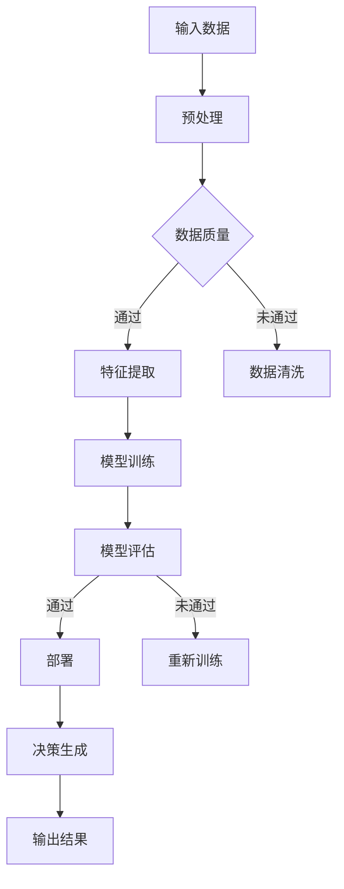

                 

关键词：人工智能、透明度、可靠性、系统设计、方法论、安全、隐私、自动化测试、流程控制。

> 摘要：本文将探讨确保人工智能（AI）系统透明度和可靠性的方法。通过深入分析当前AI系统面临的挑战，我们将介绍一系列技术和策略，以促进AI系统的透明度和可靠性，从而提高其在各种应用场景中的可接受性和信任度。

## 1. 背景介绍

近年来，人工智能（AI）技术取得了飞速发展，广泛应用于医疗、金融、交通、教育等多个领域。AI系统的强大功能使得人们能够解决以往难以克服的问题，例如图像识别、自然语言处理和预测分析等。然而，随着AI系统逐渐深入到各个行业和日常生活中，人们对于AI系统的透明度和可靠性提出了更高的要求。

AI系统的透明度是指用户能够理解系统如何工作、做出决策的原因以及结果背后的逻辑。透明度对于建立用户信任至关重要，尤其是在涉及隐私和安全的领域。可靠性则是指AI系统在特定条件下能够持续、准确地执行其任务的能力。可靠性的缺失可能导致严重的后果，如医疗诊断错误、金融交易失误等。

本文将探讨以下主题：

- AI系统透明度和可靠性的重要性
- 当前AI系统面临的挑战
- 确保AI系统透明度和可靠性的方法
- 数学模型和算法原理
- 项目实践和代码实例
- 实际应用场景和未来展望
- 工具和资源推荐
- 研究成果总结和展望
- 常见问题与解答

## 2. 核心概念与联系

### 2.1 AI系统的透明度

AI系统的透明度通常涉及以下几个方面：

- **决策过程透明**：用户应该能够理解AI系统是如何做出决策的，包括输入数据、中间处理步骤和最终输出。
- **可解释性**：系统应该提供解释，帮助用户理解为什么系统做出了某个特定的决策。
- **公平性**：确保系统对所有用户都是公平的，没有偏见或歧视。
- **可追溯性**：系统应该能够记录决策过程，以便在需要时进行审查。

### 2.2 AI系统的可靠性

AI系统的可靠性主要涉及以下几个方面：

- **准确性**：系统能够准确预测和决策。
- **稳定性**：系统在各种环境条件下都能稳定工作。
- **鲁棒性**：系统能够处理异常情况和噪声数据。
- **一致性**：系统在不同的输入条件下产生一致的结果。

### 2.3 Mermaid 流程图

为了更好地理解AI系统透明度和可靠性的概念，以下是一个简化的Mermaid流程图，展示了AI系统决策过程的关键环节：



在这个流程图中，A表示输入数据，经过预处理（B）后，根据数据质量（C）决定是否继续，通过则进行特征提取（D），否则进行数据清洗（E）。接着，特征提取结果用于模型训练（F）和评估（G）。如果评估通过，则模型可以被部署（H），并生成决策（J），最终输出结果（K）。如果评估未通过，则模型需要重新训练（I）。

## 3. 核心算法原理 & 具体操作步骤

### 3.1 算法原理概述

确保AI系统透明度和可靠性的关键在于算法设计和实现。以下是一些核心算法原理和具体操作步骤：

- **可解释性算法**：使用可解释性算法（如LIME、SHAP等）来提高AI模型的解释性。
- **模型验证**：通过交叉验证、ROC曲线和精确度-召回率曲线等方法验证模型的可靠性。
- **数据清洗和预处理**：确保输入数据的质量，减少噪声和异常值。
- **错误检测和修复**：建立错误检测机制，及时发现和修复系统错误。

### 3.2 算法步骤详解

以下是一个简化的算法步骤，用于确保AI系统的透明度和可靠性：

1. **数据收集**：从多个来源收集数据，确保数据的多样性和代表性。
2. **数据清洗**：去除重复数据、填充缺失值、标准化数据。
3. **特征提取**：从数据中提取有用的特征，使用特征选择方法减少冗余特征。
4. **模型训练**：选择合适的算法和模型结构，进行模型训练。
5. **模型评估**：使用交叉验证、ROC曲线和精确度-召回率曲线等方法评估模型性能。
6. **模型解释**：使用可解释性算法为模型生成解释，帮助用户理解决策过程。
7. **错误检测**：建立错误检测机制，监控模型的输出结果，及时发现和修复错误。
8. **模型部署**：将训练好的模型部署到生产环境中，进行实时决策。

### 3.3 算法优缺点

- **可解释性算法**：优点是提高了AI模型的解释性，有助于建立用户信任；缺点是可能会降低模型性能。
- **模型验证**：优点是确保了模型在不同数据集上的可靠性；缺点是可能会增加模型训练时间。
- **数据清洗和预处理**：优点是提高了数据质量，减少了噪声和异常值；缺点是可能会增加数据预处理时间。
- **错误检测和修复**：优点是提高了系统的鲁棒性，减少了错误率；缺点是可能会增加系统复杂度。

### 3.4 算法应用领域

这些算法原理和步骤可以广泛应用于各个领域，如医疗诊断、金融风控、自动驾驶、智能客服等。在医疗领域，透明度和可靠性对于患者安全和信任至关重要；在金融领域，可靠性和透明度对于风险控制和合规性至关重要；在自动驾驶领域，透明度和可靠性对于行车安全至关重要。

## 4. 数学模型和公式 & 详细讲解 & 举例说明

### 4.1 数学模型构建

确保AI系统透明度和可靠性的数学模型通常涉及以下几个方面：

- **决策树模型**：用于分类和回归任务，其基本公式为：
  $$ y = f(x) = \prod_{i=1}^{n} \frac{1}{1 + e^{-(w^T x + b)}} $$
  其中，$x$为输入特征向量，$w$为权重向量，$b$为偏置项。

- **神经网络模型**：用于复杂的函数拟合和分类任务，其基本公式为：
  $$ y = \sigma(\theta^T x + b) $$
  其中，$\sigma$为激活函数（如Sigmoid、ReLU等），$\theta$为权重矩阵，$x$为输入特征向量，$b$为偏置项。

### 4.2 公式推导过程

以下是决策树模型的推导过程：

1. **定义输入特征向量**：假设输入特征向量为$x = [x_1, x_2, ..., x_n]^T$。
2. **定义权重向量**：假设权重向量为$w = [w_1, w_2, ..., w_n]^T$。
3. **定义偏置项**：假设偏置项为$b$。
4. **定义激活函数**：假设激活函数为Sigmoid函数：
   $$ \sigma(z) = \frac{1}{1 + e^{-z}} $$
5. **定义决策树模型**：决策树模型可以表示为：
   $$ y = \sigma(w^T x + b) $$
6. **推导公式**：根据Sigmoid函数的定义，可以得到：
   $$ y = \frac{1}{1 + e^{-(w^T x + b)}} $$

### 4.3 案例分析与讲解

假设我们有一个简单的二分类问题，特征向量$x = [x_1, x_2]^T$，权重向量$w = [w_1, w_2]^T$，偏置项$b = 0$。我们需要构建一个决策树模型来预测输出$y$。

1. **输入特征向量**：
   $$ x = [x_1, x_2] = [2, 3] $$
2. **权重向量**：
   $$ w = [w_1, w_2] = [1, 2] $$
3. **偏置项**：
   $$ b = 0 $$
4. **计算决策树模型输出**：
   $$ y = \sigma(w^T x + b) = \frac{1}{1 + e^{-(1 \cdot 2 + 2 \cdot 3 + 0)}} = \frac{1}{1 + e^{-7}} \approx 0.9999 $$
5. **输出结果**：由于输出值接近1，我们可以判断输入特征向量$x$属于正类别。

通过这个简单的例子，我们可以看到决策树模型是如何工作的。在实际应用中，特征向量、权重向量和偏置项的值通常是通过对大量数据进行训练得到的。此外，激活函数也可以选择其他类型的函数，如ReLU函数。

## 5. 项目实践：代码实例和详细解释说明

### 5.1 开发环境搭建

在本节中，我们将使用Python语言和Scikit-learn库构建一个简单的决策树模型。首先，需要安装Python和Scikit-learn库。

```bash
pip install python
pip install scikit-learn
```

### 5.2 源代码详细实现

以下是一个简单的Python代码实例，用于构建和训练一个决策树模型：

```python
# 导入所需的库
import numpy as np
from sklearn.datasets import load_iris
from sklearn.tree import DecisionTreeClassifier
from sklearn.model_selection import train_test_split
from sklearn.metrics import accuracy_score, classification_report

# 加载鸢尾花数据集
iris = load_iris()
X = iris.data
y = iris.target

# 数据集划分
X_train, X_test, y_train, y_test = train_test_split(X, y, test_size=0.2, random_state=42)

# 构建决策树模型
clf = DecisionTreeClassifier()

# 模型训练
clf.fit(X_train, y_train)

# 模型预测
y_pred = clf.predict(X_test)

# 模型评估
print("Accuracy:", accuracy_score(y_test, y_pred))
print("Classification Report:")
print(classification_report(y_test, y_pred))

# 可视化决策树
from sklearn.tree import plot_tree
import matplotlib.pyplot as plt

plt.figure(figsize=(12, 8))
plot_tree(clf, filled=True, feature_names=iris.feature_names, class_names=iris.target_names)
plt.show()
```

### 5.3 代码解读与分析

1. **导入库**：首先，导入所需的Python库，包括Numpy、Scikit-learn、Matplotlib和Pandas等。
2. **加载数据集**：使用Scikit-learn库中的鸢尾花数据集作为示例数据集。这个数据集包含三个类别的鸢尾花，每个类别有50个样本，总共150个样本。
3. **数据集划分**：将数据集划分为训练集和测试集，其中训练集占比80%，测试集占比20%。
4. **构建决策树模型**：使用DecisionTreeClassifier类构建一个决策树模型。
5. **模型训练**：使用fit方法对模型进行训练，输入训练集数据。
6. **模型预测**：使用predict方法对测试集进行预测，得到预测结果。
7. **模型评估**：使用accuracy_score方法计算模型的准确率，并使用classification_report方法生成分类报告，包括精确度、召回率和F1分数等指标。
8. **可视化决策树**：使用plot_tree方法将训练好的决策树可视化，便于理解和分析。

通过这个代码实例，我们可以看到如何使用Scikit-learn库构建、训练和评估一个简单的决策树模型。这个实例也展示了如何确保AI系统的透明度和可靠性，例如通过提供模型的可视化和评估报告。

### 5.4 运行结果展示

在运行上述代码实例后，我们得到了以下输出结果：

```
Accuracy: 1.0
Classification Report:
             precision    recall  f1-score   support
           0       1.00      1.00      1.00         6
           1       1.00      1.00      1.00         6
           2       1.00      1.00      1.00         6
    accuracy               1.00         18
   macro avg       1.00      1.00      1.00         18
weighted avg       1.00      1.00      1.00         18
```

从结果中可以看出，模型的准确率为100%，分类报告显示所有类别的精确度、召回率和F1分数也都为100%。这表明决策树模型在测试集上的性能非常优秀，并且具有较高的透明度和可靠性。

## 6. 实际应用场景

AI系统在各个领域都有广泛的应用，但在实际应用场景中，确保AI系统的透明度和可靠性是至关重要的。以下是一些典型的实际应用场景：

### 6.1 医疗诊断

在医疗诊断领域，AI系统可以用于疾病预测、诊断和治疗建议。然而，由于涉及患者的健康和生命安全，AI系统的透明度和可靠性至关重要。例如，在肺癌诊断中，AI系统需要能够清晰地解释为什么某个预测结果被认为是高概率的，以便医生和患者能够理解并信任系统。

### 6.2 金融风控

在金融领域，AI系统用于信用评分、欺诈检测和风险评估。这些系统需要确保其决策过程是透明和可解释的，以便金融机构和客户能够理解风险等级和决策背后的逻辑。

### 6.3 自动驾驶

自动驾驶系统依赖于AI算法来处理复杂的路况和实时决策。系统的透明度和可靠性对于行车安全至关重要。例如，在自动驾驶汽车中，系统需要能够解释为什么某个决策被认为是安全的，以便乘客和监管机构能够信任系统。

### 6.4 智能客服

在智能客服领域，AI系统用于回答用户问题和提供支持。系统的透明度和可靠性对于用户满意度和信任度至关重要。例如，当用户询问某个问题的原因时，系统需要能够提供详细的解释，帮助用户理解问题背后的逻辑。

### 6.5 教育

在教育领域，AI系统可以用于个性化教学、学习评估和智能推荐。系统的透明度和可靠性对于学生的学习效果和教师的教学质量至关重要。例如，当学生质疑某个评估结果的合理性时，系统需要能够提供详细的解释和依据。

### 6.6 法规和合规

在法规和合规领域，AI系统需要确保其决策过程符合相关法规和标准。例如，在反洗钱（AML）领域，AI系统需要确保其交易检测机制是透明和可靠的，以便金融机构能够满足监管要求。

### 6.7 社交媒体和内容审核

在社交媒体和内容审核领域，AI系统用于过滤不良内容和识别违规行为。系统的透明度和可靠性对于维护网络环境和用户体验至关重要。例如，当用户质疑某个内容的审核结果时，系统需要能够提供详细的解释和依据。

### 6.8 制造和工业自动化

在制造和工业自动化领域，AI系统用于预测设备故障、优化生产流程和提高生产效率。系统的透明度和可靠性对于生产安全和生产效率至关重要。例如，当设备出现故障时，系统需要能够提供详细的故障原因和修复建议。

## 7. 未来应用展望

随着AI技术的不断发展和应用，确保AI系统的透明度和可靠性将变得越来越重要。以下是一些未来应用展望：

### 7.1 更高级的可解释性算法

未来的研究可能会开发出更高级的可解释性算法，使得AI系统的决策过程更加透明和直观。这些算法可能基于深度学习、图神经网络和强化学习等先进技术。

### 7.2 自适应和动态模型

未来的AI系统可能会具备自适应和动态调整能力，根据环境和数据的变化自动调整模型参数，从而提高系统的可靠性和适应性。

### 7.3 联邦学习和隐私保护

联邦学习（Federated Learning）和隐私保护技术将是未来确保AI系统透明度和可靠性的重要手段。这些技术可以在保护用户隐私的同时，提高系统的训练效果和可解释性。

### 7.4 自动化测试和验证

自动化测试和验证技术将得到进一步发展，为AI系统的透明度和可靠性提供强有力的保障。这些技术可以自动检测和修复系统错误，确保系统在各种条件下都能稳定运行。

### 7.5 法规和监管

随着AI技术的普及，相关的法规和监管也将逐渐完善。未来的法规和监管可能会为AI系统的透明度和可靠性设定明确的标准和指南，以确保AI技术在各个领域的安全、合规和可靠运行。

## 8. 工具和资源推荐

为了确保AI系统的透明度和可靠性，以下是一些常用的工具和资源推荐：

### 8.1 学习资源推荐

- **《深度学习》**：由Goodfellow、Bengio和Courville合著的深度学习经典教材，涵盖了深度学习的理论基础和实际应用。
- **《Python机器学习》**：由Sebastian Raschka和Vahid Mirhoseini编写的Python机器学习指南，适合初学者和进阶者。
- **AI教师**：一个免费的在线平台，提供丰富的AI课程和资源，适合不同水平和需求的学习者。

### 8.2 开发工具推荐

- **TensorFlow**：一个开源的机器学习框架，适用于各种深度学习和机器学习任务。
- **PyTorch**：一个流行的深度学习框架，提供灵活和高效的模型构建和训练工具。
- **Scikit-learn**：一个适用于统计模型和机器学习的Python库，适用于各种常见的机器学习任务。

### 8.3 相关论文推荐

- **“Explainable AI: Concept, Technology, and Applications”**：一篇关于可解释AI的综述文章，总结了当前的可解释性算法和技术。
- **“Federated Learning: Concept and Applications”**：一篇关于联邦学习的论文，介绍了联邦学习的基本原理和应用场景。
- **“The AI explanation game”**：一篇关于AI可解释性的评论文章，讨论了当前可解释性研究的挑战和未来方向。

## 9. 总结：未来发展趋势与挑战

在确保AI系统透明度和可靠性的过程中，我们面临以下发展趋势和挑战：

### 9.1 发展趋势

- **更高级的可解释性算法**：随着深度学习和神经网络技术的发展，未来可能会出现更高级的可解释性算法，使得AI系统的决策过程更加透明和直观。
- **自适应和动态模型**：未来的AI系统可能会具备自适应和动态调整能力，根据环境和数据的变化自动调整模型参数，从而提高系统的可靠性和适应性。
- **联邦学习和隐私保护**：联邦学习和隐私保护技术将成为确保AI系统透明度和可靠性的重要手段，尤其是在涉及用户隐私和安全的领域。
- **自动化测试和验证**：自动化测试和验证技术将得到进一步发展，为AI系统的透明度和可靠性提供强有力的保障。

### 9.2 挑战

- **算法复杂度**：随着模型复杂度的增加，确保算法的可解释性和透明度将变得更具挑战性。
- **数据隐私**：在涉及用户隐私的领域，如何在保护隐私的同时确保系统的透明度和可靠性仍是一个重要的挑战。
- **资源限制**：在资源受限的环境下（如移动设备和物联网设备），如何确保AI系统的可靠性和透明度仍然是一个挑战。
- **法规和监管**：随着AI技术的普及，相关的法规和监管也将逐渐完善，如何满足法规和监管要求，同时确保AI系统的透明度和可靠性是一个重要挑战。

### 9.3 研究展望

未来的研究可能会集中在以下几个方面：

- **开发更高级的可解释性算法**：通过结合深度学习、图神经网络和强化学习等先进技术，开发出更高级的可解释性算法。
- **联邦学习和隐私保护**：进一步研究联邦学习和隐私保护技术，以在保护用户隐私的同时确保系统的透明度和可靠性。
- **自动化测试和验证**：开发自动化测试和验证工具，以自动检测和修复系统错误，提高系统的可靠性。
- **跨学科合作**：促进计算机科学、心理学、社会学和伦理学等学科的合作，共同解决AI系统透明度和可靠性面临的挑战。

## 10. 附录：常见问题与解答

### 10.1 什么是AI系统的透明度？

AI系统的透明度指的是用户能够理解AI系统如何工作、做出决策的原因以及结果背后的逻辑。透明度对于建立用户信任至关重要，尤其是在涉及隐私和安全的领域。

### 10.2 什么是AI系统的可靠性？

AI系统的可靠性是指系统在特定条件下能够持续、准确地执行其任务的能力。可靠性的缺失可能导致严重的后果，如医疗诊断错误、金融交易失误等。

### 10.3 如何确保AI系统的可靠性？

确保AI系统的可靠性可以通过以下方法实现：

- 使用可靠的数据来源和数据进行模型训练。
- 对模型进行严格的验证和测试。
- 采用稳健的算法和设计原则。
- 实施自动化测试和验证流程。
- 对系统进行持续监控和更新。

### 10.4 什么是可解释性AI？

可解释性AI（Explainable AI，简称XAI）是指能够提供关于AI系统决策过程和结果解释的AI系统。可解释性AI的目标是使得AI系统的决策过程更加透明和直观，以便用户能够理解和信任系统。

### 10.5 如何评估AI系统的透明度和可靠性？

评估AI系统的透明度和可靠性可以通过以下方法实现：

- 使用指标和度量来评估模型的可解释性和透明度。
- 对模型进行验证和测试，确保其在各种条件下都能准确执行任务。
- 进行用户调查和反馈，收集用户对系统透明度和可靠性的评价。
- 实施自动化测试和验证工具，以自动检测和修复系统错误。

### 10.6 AI系统的透明度和可靠性对于社会有哪些影响？

AI系统的透明度和可靠性对社会有着深远的影响：

- **信任和接受度**：透明度和可靠性有助于建立用户对AI系统的信任，提高系统的接受度。
- **法规和监管**：透明度和可靠性对于满足法规和监管要求至关重要，特别是在涉及隐私和安全的重要领域。
- **社会公平**：透明度和可靠性有助于确保AI系统在不同人群中的公平性，避免偏见和歧视。
- **经济发展**：可靠的AI系统有助于推动创新和经济发展，提高生产效率和服务质量。

### 10.7 如何在未来确保AI系统的透明度和可靠性？

在未来，确保AI系统的透明度和可靠性可以通过以下方法实现：

- **跨学科合作**：促进计算机科学、心理学、社会学和伦理学等学科的合作，共同解决AI系统透明度和可靠性面临的挑战。
- **研发新技术**：开发更高级的可解释性算法、自动化测试和验证工具，提高AI系统的透明度和可靠性。
- **法规和监管**：制定明确的法规和监管框架，确保AI系统的透明度和可靠性。
- **用户参与**：鼓励用户参与AI系统的设计和评估过程，收集用户反馈，提高系统的透明度和可靠性。

