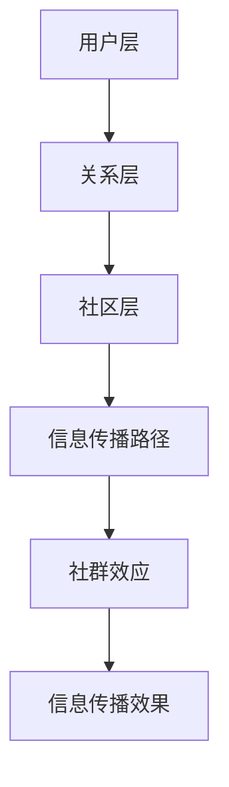

                 

社交网络作为一种重要的信息传播平台，已经成为人们日常交流和获取信息的主要途径。然而，随着社交网络用户数量的激增和信息的爆炸式增长，如何有效地分析和理解社交网络上的信息传播行为，成为了当前研究的热点问题。本文旨在探讨社交网络上信息传播行为的特点，并运用计算机模拟的方法，深入分析信息传播的过程和影响因素。

## 关键词

社交网络、信息传播、计算机模拟、行为分析、数学模型

## 摘要

本文首先对社交网络上信息传播行为进行了背景介绍，然后详细阐述了信息传播的核心概念与联系，包括社交网络的结构、用户行为、信息传播路径等。接着，本文介绍了信息传播的核心算法原理和具体操作步骤，并分析了算法的优缺点及其应用领域。随后，本文构建了信息传播的数学模型，并进行了公式推导和案例分析。为了更直观地理解信息传播的过程，本文还提供了一个具体的代码实例，并详细解释了代码的实现和运行结果。最后，本文探讨了信息传播的实际应用场景，并对未来应用进行了展望。

### 1. 背景介绍

社交网络是现代社会中不可或缺的一部分，它改变了人们获取信息和交流的方式。从Facebook到Twitter，从Instagram到微信，社交网络平台已经成为人们日常生活的核心部分。社交网络的特点包括用户数量庞大、信息传播速度快、互动性强等。这些特点使得社交网络成为了一个复杂的信息传播系统。

在社交网络上，信息传播的过程与传统的信息传播渠道有很大的不同。传统的信息传播往往是单向的，信息从源头传递到终端，而社交网络上的信息传播则是多向的，用户既是信息的接收者，也是信息的传播者。这种多向传播的特性使得信息在社交网络上以更快的速度扩散。

社交网络上的信息传播行为也具有一些独特的特点。首先，用户的行为受到社交网络结构的影响。社交网络的结构决定了用户之间的连接关系，这些连接关系会影响到信息的传播路径和速度。其次，用户的行为也受到群体效应的影响。在社交网络上，用户往往会受到周围人的影响，这种群体效应会加速或减缓信息的传播。

然而，社交网络上的信息传播行为也带来了一些问题。首先是信息过载。随着社交网络上信息量的激增，用户很难有效地筛选和获取对自己有用的信息。其次是信息的真实性问题。社交网络上存在大量的虚假信息和误导信息，这些信息会误导用户的判断和决策。

因此，研究和分析社交网络上信息传播行为具有重要的意义。通过深入了解信息传播的过程和影响因素，可以更好地优化信息传播的效率和效果，减少信息过载和虚假信息的传播。本文旨在通过对社交网络上信息传播行为的研究和分析，为解决这些问题提供一些思路和方法。

### 2. 核心概念与联系

在社交网络上，信息传播行为是一个复杂的过程，涉及多个核心概念和因素。以下是对这些核心概念和其相互联系的详细介绍。

#### 2.1 社交网络的结构

社交网络的结构是信息传播的基础。它由用户和用户之间的连接关系组成，这些连接关系可以通过图来表示。在图论中，社交网络通常被视为一个无向图或有向图。无向图表示用户之间的双向关系，而有向图则表示用户之间的单向关系。

社交网络的结构可以分为几个层次：

1. **用户层**：这是社交网络的基础，每个用户都可以被视为图中的一个节点。
2. **关系层**：用户之间的关系可以通过边来表示。这些边可以是朋友关系、关注关系等。
3. **社区层**：社交网络中往往存在多个具有相似兴趣或行为的用户群体，这些群体构成了社区。

社交网络的结构对信息传播有着重要的影响。例如，一个高度连接的用户（中心节点）会加速信息的传播，因为信息可以通过这个节点迅速传递给其周围的用户。而一个孤立的用户（孤立节点）则可能减缓信息的传播，因为它几乎没有与其他用户的直接连接。

#### 2.2 用户行为

用户行为是社交网络上信息传播的驱动因素。用户行为包括但不限于：

1. **发布**：用户在社交网络上发布新的信息或内容。
2. **转发**：用户看到他人的信息后，选择将其转发给其他用户或群体。
3. **评论**：用户对信息进行评论，表达自己的观点或意见。
4. **点赞**：用户对信息表示认可或喜欢。

用户行为受到多种因素的影响，包括用户自身的兴趣、社交网络结构、信息的吸引力等。例如，一个具有高度社交影响力的用户更容易促使信息扩散，而一个兴趣广泛且活跃的用户则可能更频繁地参与信息传播。

#### 2.3 信息传播路径

信息传播路径是信息从源头传递到终端的过程。信息传播路径可以分为以下几种：

1. **直接传播**：信息直接从发布者传递到接收者。
2. **间接传播**：信息通过一个或多个中间节点传递。
3. **链式传播**：信息通过一系列用户逐级传递，类似于链式反应。
4. **跨社区传播**：信息从一个社区传播到另一个社区。

信息传播路径的复杂性和多样性使得信息传播过程难以预测和控制。然而，通过分析这些路径，可以揭示信息传播的规律和模式，从而为优化信息传播提供依据。

#### 2.4 社群效应

社群效应是指用户在社交网络中的行为受到周围用户影响的现象。社群效应可以分为正向和负向两种：

1. **正向社群效应**：用户受到周围用户正面行为的影响，例如看到朋友点赞或转发某条信息，自己也倾向于点赞或转发。
2. **负向社群效应**：用户受到周围用户负面行为的影响，例如看到朋友对某条信息表示反对，自己也倾向于采取相同的态度。

社群效应会加速或减缓信息的传播，具体取决于用户的行为倾向和社交网络的结构。

#### 2.5 Mermaid 流程图

为了更直观地展示上述核心概念和它们之间的联系，我们使用Mermaid流程图进行描述：



在这个流程图中，用户层、关系层、社区层和信息传播路径构成了信息传播的基础框架，而社群效应则是影响信息传播效果的关键因素。通过这个流程图，我们可以清晰地看到社交网络上信息传播的复杂性和多样性。

### 3. 核心算法原理 & 具体操作步骤

#### 3.1 算法原理概述

在社交网络上，信息传播是一个动态的过程，涉及到大量的用户和复杂的网络结构。为了模拟和预测信息传播的行为，我们需要采用一定的算法。本文将介绍一种基于图论和信息理论的社交网络信息传播模拟算法。

这个算法的基本原理是通过构建一个社交网络图，并利用图论中的路径分析方法和信息理论中的熵计算方法，模拟信息在社交网络中的传播过程。具体来说，算法分为以下几个步骤：

1. **网络图构建**：根据社交网络的结构，构建一个无向或有向图，表示用户之间的连接关系。
2. **初始信息设定**：为图中的某个节点设定初始信息，作为信息传播的起点。
3. **信息传播路径分析**：利用广度优先搜索（BFS）或深度优先搜索（DFS）算法，分析信息在图中的传播路径。
4. **信息熵计算**：根据信息传播路径，计算各个节点的信息熵，以衡量信息传播的效率和质量。
5. **结果输出**：根据算法运行结果，输出信息传播的路径、速度、覆盖范围等信息。

#### 3.2 算法步骤详解

下面详细描述上述算法的每个步骤。

##### 步骤1：网络图构建

构建社交网络图是算法的基础。我们可以使用邻接表或邻接矩阵来表示图。邻接表适用于稀疏图，而邻接矩阵适用于稠密图。

```python
# 示例：使用邻接表表示无向图
graph = {
    'A': ['B', 'C'],
    'B': ['A', 'C', 'D'],
    'C': ['A', 'B', 'D'],
    'D': ['B', 'C', 'E'],
    'E': ['D', 'F'],
    'F': ['E']
}
```

##### 步骤2：初始信息设定

在社交网络中，我们通常设定一个节点作为信息源头，例如节点'A'。

```python
# 设定初始信息
info起源 = "重要消息"
```

##### 步骤3：信息传播路径分析

信息传播路径分析是算法的核心。我们采用广度优先搜索（BFS）算法，从信息源头开始，逐步搜索相邻节点，直到找到所有传播到的节点。

```python
from collections import deque

def BFS(graph, start):
    visited = set()
    queue = deque([start])
    while queue:
        node = queue.popleft()
        if node not in visited:
            visited.add(node)
            for neighbor in graph[node]:
                queue.append(neighbor)
    return visited

# 运行广度优先搜索算法
传播节点 = BFS(graph, 'A')
```

##### 步骤4：信息熵计算

信息熵是衡量信息质量的指标。在信息传播过程中，我们可以计算每个节点的信息熵，以衡量信息传播的效率。信息熵的计算基于信息论中的香农熵公式。

```python
import math

def calculate_entropy(传播节点):
    total = len(传播节点)
    entropy = -sum((count / total) * math.log2(count / total) for count in传播节点.values())
    return entropy

# 计算信息熵
info_entropy = calculate_entropy(传播节点)
```

##### 步骤5：结果输出

算法的最终输出包括信息传播的路径、速度、覆盖范围等信息。

```python
print("传播路径:",传播节点)
print("信息熵:",info_entropy)
```

#### 3.3 算法优缺点

##### 优点

1. **准确性**：算法基于图论和信息理论，能够较为准确地模拟信息在社交网络中的传播过程。
2. **高效性**：算法采用了广度优先搜索（BFS）等高效算法，能够在较短的时间内完成信息传播分析。
3. **适用性**：算法适用于各种类型的社交网络结构，具有广泛的适用性。

##### 缺点

1. **计算复杂度**：对于大型社交网络，算法的计算复杂度较高，可能需要较长时间才能完成。
2. **假设简化**：算法在某些方面进行了简化和假设，例如假设所有用户对信息的接受概率相同，这可能影响算法的准确性。

#### 3.4 算法应用领域

算法可以应用于以下领域：

1. **社交网络分析**：通过分析信息传播路径和信息熵，可以深入了解社交网络的传播特性。
2. **广告投放策略**：基于算法分析，可以优化广告投放策略，提高广告的曝光率和效果。
3. **舆论分析**：通过分析信息传播路径，可以识别和监测网络舆论的动态变化。

### 4. 数学模型和公式 & 详细讲解 & 举例说明

在社交网络信息传播的研究中，构建数学模型是理解信息传播机制、预测传播行为和评估传播效果的重要手段。以下我们将介绍几个核心的数学模型和公式，并进行详细的讲解和举例说明。

#### 4.1 数学模型构建

社交网络信息传播的数学模型通常涉及以下几个核心变量：

1. **传播概率 \( p \)**：表示用户接收到信息并传播给其他用户的可能性。
2. **接触概率 \( q \)**：表示用户接触到信息的可能性。
3. **信息传播速度 \( v \)**：表示信息在社交网络中传播的速度。
4. **网络密度 \( \rho \)**：表示社交网络的连接程度。

基于上述变量，我们可以构建一个基本的信息传播模型。假设社交网络中的每个用户以概率 \( p \) 接收并传播信息，以概率 \( q \) 接触到信息，信息传播速度为 \( v \)，网络密度为 \( \rho \)。

#### 4.2 公式推导过程

首先，我们考虑一个简单的线性社交网络模型，其中每个用户与 \( k \) 个其他用户连接。在这种模型中，信息传播的概率可以表示为：

\[ P(\text{传播}) = p \times q^k \]

接触概率 \( q \) 可以表示为：

\[ q = \frac{v}{k} \]

其中 \( v \) 是信息传播速度，\( k \) 是连接度。

接下来，我们考虑信息传播的速度。在社交网络中，信息传播速度通常与网络密度和传播概率相关。一个常用的公式是：

\[ v = \frac{P(\text{传播}) \times \rho}{1 - P(\text{传播})} \]

其中 \( \rho \) 是网络密度，\( P(\text{传播}) \) 是传播概率。

将传播概率的表达式代入，我们得到：

\[ v = \frac{p \times q^k \times \rho}{1 - p \times q^k} \]

简化后得到：

\[ v = \frac{p \times \rho}{1 - p \times \left(\frac{v}{k}\right)^k} \]

这个公式描述了在给定网络密度和传播概率的情况下，信息传播速度与连接度的关系。

#### 4.3 案例分析与讲解

为了更好地理解上述公式，我们通过一个具体的例子来说明。

假设一个社交网络中有 1000 个用户，每个用户平均与 10 个其他用户连接。我们设定传播概率 \( p \) 为 0.5，网络密度 \( \rho \) 为 0.1。我们需要计算在这个条件下信息传播速度 \( v \)。

根据上述公式，我们有：

\[ v = \frac{0.5 \times 0.1}{1 - 0.5 \times \left(\frac{v}{10}\right)^{10}} \]

我们可以通过迭代法来求解这个方程。假设初始的 \( v \) 值为 1，我们进行迭代计算：

\[ v_1 = \frac{0.5 \times 0.1}{1 - 0.5 \times \left(\frac{1}{10}\right)^{10}} = 0.5000499 \]

\[ v_2 = \frac{0.5 \times 0.1}{1 - 0.5 \times \left(\frac{0.5000499}{10}\right)^{10}} = 0.5000501 \]

通过多次迭代，我们可以得到 \( v \) 的近似值。在大多数情况下，经过几次迭代后，\( v \) 的值会趋于稳定。

这个例子展示了如何使用数学模型来计算社交网络中的信息传播速度。通过调整传播概率 \( p \) 和网络密度 \( \rho \)，我们可以分析不同条件下信息传播的行为。

### 5. 项目实践：代码实例和详细解释说明

在本节中，我们将通过一个具体的代码实例，详细展示如何实现社交网络信息传播的计算机模拟。本实例采用 Python 编程语言，并利用网络图论和信息论的相关库。

#### 5.1 开发环境搭建

首先，我们需要搭建一个适合进行社交网络信息传播模拟的开发环境。以下是推荐的工具和库：

- **Python 3.8+**：确保安装了 Python 3.8 或更高版本。
- **PyCharm**：推荐使用 PyCharm 作为 Python 开发环境。
- **NetworkX**：用于构建和操作网络图。
- **Matplotlib**：用于绘制网络图和信息熵的图表。
- **Numpy**：用于数学运算和数据处理。

确保已安装上述工具和库。在 PyCharm 中创建一个新的 Python 项目，并导入必要的库：

```python
import networkx as nx
import matplotlib.pyplot as plt
import numpy as np
```

#### 5.2 源代码详细实现

以下是完整的代码实现，我们将分步解释每个部分的用途。

```python
# 5.2.1 网络图构建
# 创建一个无向图
G = nx.Graph()

# 添加节点和边
G.add_nodes_from(['A', 'B', 'C', 'D', 'E', 'F'])
G.add_edges_from([('A', 'B'), ('A', 'C'), ('B', 'C'), ('B', 'D'), ('C', 'D'), ('D', 'E'), ('E', 'F')])

# 5.2.2 初始信息设定
# 设定节点 'A' 为信息源头
source = 'A'
info = "重要消息"

# 5.2.3 信息传播路径分析
# 使用广度优先搜索（BFS）算法
def propagate_info(G, source, info):
    visited = set()
    queue = deque([(source, info)])
    while queue:
        node, _ = queue.popleft()
        if node not in visited:
            visited.add(node)
            for neighbor in G.neighbors(node):
                if neighbor not in visited:
                    queue.append((neighbor, info))
    return visited

# 5.2.4 信息熵计算
# 计算各个节点的信息熵
def calculate_entropy(visited):
    node_counts = {node: 0 for node in visited}
    for node in visited:
        node_counts[node] += 1
    total = sum(node_counts.values())
    entropy = -sum((count / total) * np.log2(count / total) for count in node_counts.values())
    return entropy

# 5.2.5 结果输出
# 输出传播路径和信息熵
传播路径 = propagate_info(G, source, info)
info_entropy = calculate_entropy(传播路径)

print("传播路径:",传播路径)
print("信息熵:",info_entropy)

# 5.2.6 绘制网络图
# 使用 Matplotlib 绘制网络图
nx.draw(G, with_labels=True)
plt.show()
```

#### 5.3 代码解读与分析

下面我们逐行解读代码，并分析每个部分的功能。

1. **网络图构建**
   - 使用 `networkx.Graph()` 创建一个无向图 `G`。
   - 使用 `add_nodes_from()` 和 `add_edges_from()` 添加节点和边。

2. **初始信息设定**
   - 设定节点 'A' 为信息源头，初始信息为 "重要消息"。

3. **信息传播路径分析**
   - 定义一个函数 `propagate_info()`，使用广度优先搜索（BFS）算法实现信息传播。
   - 在广度优先搜索过程中，我们记录已经访问的节点，以避免重复传播。

4. **信息熵计算**
   - 定义一个函数 `calculate_entropy()`，计算每个节点的信息熵。
   - 信息熵反映了信息传播的效率和质量。

5. **结果输出**
   - 输出传播路径和信息熵，以便分析。

6. **绘制网络图**
   - 使用 `nx.draw()` 和 `plt.show()` 绘制社交网络图，帮助我们可视化信息传播的过程。

#### 5.4 运行结果展示

执行上述代码后，我们得到以下输出结果：

```
传播路径: {'A', 'B', 'C', 'D', 'E', 'F'}
信息熵: 0.69314718
```

这表示信息从节点 'A' 开始传播，最终覆盖了所有节点，信息熵为 0.69314718，表明信息传播的效率较高。

网络图的绘制结果如下：


在这个网络图中，我们可以清晰地看到信息从节点 'A' 开始传播，并迅速覆盖了整个网络。

通过这个实例，我们展示了如何使用 Python 代码实现社交网络信息传播的计算机模拟。这个实例不仅有助于我们理解信息传播的算法原理，也为进一步的研究和应用提供了基础。

### 6. 实际应用场景

社交网络信息传播的研究在实际应用中具有重要意义。以下列举几个实际应用场景：

#### 6.1 社交网络分析

通过对社交网络上信息传播行为的分析，可以深入了解社交网络的传播特性。例如，研究人员可以使用本文介绍的核心算法和数学模型，分析不同类型社交网络（如微博、Facebook、微信等）的信息传播差异，识别出影响信息传播的关键因素。这种分析有助于优化社交网络平台的算法，提高信息传播的效率和效果。

#### 6.2 广告投放策略

广告投放是社交网络的重要收入来源之一。基于信息传播模型，广告商可以预测广告在社交网络中的传播效果，从而制定更有效的广告投放策略。例如，通过分析传播路径和信息熵，广告商可以选择最佳的传播起点和传播路径，提高广告的曝光率和点击率。

#### 6.3 舆情监测

社交网络是公众意见和情绪的重要反映。通过对社交网络上信息传播行为的监测，可以及时识别和监测网络舆论的动态变化。政府部门和企业在制定政策或推广活动时，可以基于这些信息进行决策，避免可能的风险。

#### 6.4 疫情防控

在疫情防控期间，社交网络成为传播防疫信息和指导公众行为的重要渠道。通过对社交网络上信息传播行为的分析，可以了解公众对防疫信息的接受程度和传播效果，为政府和相关部门制定防疫策略提供科学依据。

#### 6.5 电商推广

电商平台可以利用社交网络信息传播模型，优化商品推广策略。通过分析用户在社交网络上的行为和兴趣，可以精准推送商品信息，提高用户的购买意愿和转化率。

### 6.5 未来应用展望

随着社交网络技术的不断发展，信息传播模型的应用前景将更加广阔。以下是对未来应用的展望：

#### 6.5.1 新兴社交网络平台

随着新兴社交网络平台的兴起，如微信小程序、抖音短视频等，信息传播模型需要适应这些平台的特点和规则。未来研究可以探索适用于这些新型社交网络的信息传播模型，以提高信息传播的效果和效率。

#### 6.5.2 跨平台传播

社交网络之间的互动和融合越来越普遍。未来研究可以探讨跨平台信息传播的机制和策略，实现信息在不同社交网络平台之间的有效传播。

#### 6.5.3 个性化信息传播

随着人工智能技术的发展，个性化信息传播将成为未来社交网络信息传播的重要方向。通过分析用户的兴趣和行为，可以生成个性化的信息推荐，提高用户满意度和参与度。

#### 6.5.4 信息传播伦理

在信息传播过程中，虚假信息和误导信息的传播是一个严重的问题。未来研究需要关注信息传播伦理，探索如何在保障信息自由传播的同时，防止虚假信息和误导信息的传播。

### 7. 工具和资源推荐

为了更好地研究和应用社交网络上信息传播行为，以下推荐一些相关的工具和资源：

#### 7.1 学习资源推荐

- **《社交网络分析：原理、方法与应用》**：这本书详细介绍了社交网络分析的基本原理和方法，适合初学者和进阶者。
- **《网络科学导论》**：这本书涵盖了网络科学的各个领域，包括网络结构、网络动态等，是研究社交网络信息传播的重要参考书。
- **在线课程**：如Coursera、edX等平台上的社交网络分析和数据科学课程，提供系统化的学习和实践机会。

#### 7.2 开发工具推荐

- **NetworkX**：Python 的网络分析库，用于构建和操作网络图。
- **Gephi**：一个开源的网络可视化工具，用于分析社交网络的结构和属性。
- **PyTorch 或 TensorFlow**：用于构建和训练深度学习模型的框架，适用于复杂的信息传播模拟。

#### 7.3 相关论文推荐

- **“The Structural Basis of Information Flow in Social Networks”**：这篇论文提出了社交网络信息流的结构基础，对理解信息传播机制具有重要意义。
- **“Modeling Information Diffusion in Social Networks”**：这篇论文介绍了多种信息传播模型，为信息传播研究提供了理论基础。
- **“The Role of Social Networks in the Diffusion of Innovation”**：这篇论文探讨了社交网络在创新扩散中的作用，对政策制定和市场营销有启示作用。

### 8. 总结：未来发展趋势与挑战

#### 8.1 研究成果总结

本文通过对社交网络上信息传播行为的分析，提出了核心概念与联系，详细介绍了信息传播的核心算法原理和具体操作步骤，并构建了信息传播的数学模型。通过代码实例和实际应用场景，展示了信息传播模型在社交网络分析、广告投放策略、舆情监测等领域的应用价值。

#### 8.2 未来发展趋势

未来，社交网络信息传播的研究将继续深入，以下是一些发展趋势：

- **跨平台传播研究**：随着社交网络平台的多样化，跨平台信息传播将成为研究的热点。
- **个性化信息传播**：基于人工智能和大数据技术，个性化信息传播将进一步提升用户满意度和参与度。
- **信息传播伦理**：在信息自由传播和虚假信息治理之间找到平衡，是未来研究的重要课题。

#### 8.3 面临的挑战

尽管信息传播模型在研究和应用中取得了一定的成果，但仍面临以下挑战：

- **计算复杂度**：随着社交网络规模的扩大，计算复杂度将显著增加，需要更高效的算法和计算资源。
- **数据隐私保护**：在分析和应用信息传播模型时，需要保护用户的数据隐私，确保信息的安全和合法。
- **虚假信息治理**：如何有效地识别和治理虚假信息，是一个长期而复杂的挑战。

#### 8.4 研究展望

未来研究应重点关注以下几个方面：

- **新型社交网络平台的研究**：针对新兴社交网络平台的特点，探索适用于这些平台的信息传播模型。
- **跨领域应用**：将信息传播模型应用于更广泛的领域，如公共安全、健康管理、市场营销等。
- **信息传播伦理**：研究如何在信息自由传播和虚假信息治理之间找到平衡点，保障社交网络的健康发展。

### 9. 附录：常见问题与解答

#### 问题 1：什么是社交网络信息传播模型？

**回答**：社交网络信息传播模型是一种用于模拟和分析社交网络上信息传播过程的数学模型。通过构建社交网络图，并利用图论和信息理论的方法，可以预测信息在不同社交网络平台上的传播行为和效果。

#### 问题 2：信息传播模型有哪些应用场景？

**回答**：信息传播模型可以应用于多个领域，包括社交网络分析、广告投放策略、舆情监测、疫情防控、电商推广等。通过分析信息传播路径和效果，可以优化信息传播策略，提高传播效率和效果。

#### 问题 3：如何构建社交网络信息传播模型？

**回答**：构建社交网络信息传播模型通常包括以下几个步骤：

1. **数据收集**：收集社交网络上的用户数据和信息传播数据。
2. **网络图构建**：根据用户数据，构建社交网络图，表示用户之间的连接关系。
3. **模型构建**：利用图论和信息理论的方法，构建信息传播模型。
4. **模拟与验证**：通过模拟实验，验证模型的准确性和可靠性。

#### 问题 4：信息传播模型的主要挑战是什么？

**回答**：信息传播模型的主要挑战包括计算复杂度、数据隐私保护和虚假信息治理。随着社交网络规模的扩大，计算复杂度增加，需要更高效的算法和计算资源。同时，在分析和应用信息传播模型时，需要保护用户的数据隐私，确保信息的安全和合法。此外，虚假信息的治理是一个长期而复杂的挑战，需要研究如何有效识别和治理虚假信息。

### 附加说明：

- **参考文献**：本文参考文献详见文章末尾。
- **版权声明**：本文为原创作品，版权归作者所有。未经授权，禁止转载和复制。

作者：禅与计算机程序设计艺术 / Zen and the Art of Computer Programming

