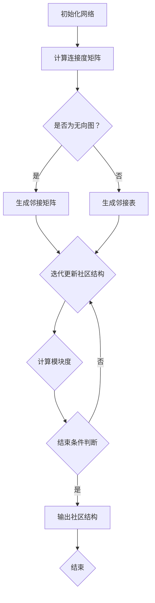

                 

关键词：社区发现，图算法，社交网络，数据挖掘，算法实现

摘要：本文旨在深入探讨社区发现这一关键的数据挖掘技术，从原理、算法到代码实例，全面讲解如何通过社区发现技术挖掘社交网络中的隐藏结构，并为读者提供实用的编程指导。通过本文的学习，读者将能够理解社区发现的基本概念，掌握相关算法的核心原理，并能独立实现和优化社区发现过程。

## 1. 背景介绍

随着互联网的飞速发展，社交网络已经成为人们日常生活中不可或缺的一部分。Facebook、Twitter、LinkedIn等社交平台汇聚了海量的用户及其交互数据，这些数据不仅反映了用户的社交关系，还蕴含着丰富的社会结构和行为模式。如何从这些庞大的数据集中识别出具有高凝聚力和独特性的社交群体，即“社区”，成为数据挖掘领域的一个重要研究方向。

社区发现（Community Detection）是指在一个复杂的网络中，识别出一些具有较高内部连接密度，同时与外部连接密度相对较低的子图。这些子图代表网络中的紧密群体，它们可以反映现实世界中的各种群体组织，如兴趣小组、学术团队、商业伙伴等。社区发现对于社交网络分析、生物信息学、复杂系统研究等领域具有重要意义。

社区发现的主要应用场景包括：

1. 社交网络分析：通过识别社交网络中的社区，可以了解用户之间的关系模式，发现潜在的朋友圈，甚至预测用户的行为和兴趣。
2. 生物信息学：在基因网络和蛋白质相互作用网络中，社区发现有助于识别具有特定生物学功能的基因或蛋白质群体。
3. 复杂系统研究：在交通网络、电力网络等复杂系统中，社区发现可以帮助理解系统中的关键节点和脆弱性。

## 2. 核心概念与联系

### 2.1 社区定义

在图论中，社区可以被定义为图中的一个子图，其中节点之间的连接密度远远高于节点与外部节点的连接密度。具体来说，社区内部节点的连接数要多于非社区节点之间的连接数。

### 2.2 社区属性

- **密度**：社区内部的连接密度，即内部节点的连接数占总可能连接数之比。
- **封闭性**：社区内的节点倾向于与其他社区内的节点建立连接，而与外部节点的连接较少。
- **规模**：社区中包含的节点数量。
- **独特性**：社区在节点和连接上的独特性，使其能够区分于其他社区。

### 2.3 社区发现算法

社区发现算法可以分为多种类型，根据其实现方式和目标的不同，可以分为基于模块度、基于聚类、基于优化等算法。以下是一个简单的社区发现算法流程图：



### 2.4 社区发现的挑战

- **复杂网络**：现实世界中的社交网络具有高度复杂性和动态性，这给社区发现带来了挑战。
- **社区大小与多样性**：社区的大小和多样性对于算法的设计和实现提出了不同的要求。
- **计算效率**：大规模网络中的社区发现需要高效的算法和计算资源。

## 3. 核心算法原理 & 具体操作步骤

### 3.1 算法原理概述

社区发现算法的核心在于如何衡量和识别网络中的社区结构。常用的算法包括基于模块度的方法、基于聚类的方法和基于优化的方法。以下将介绍一种基于模块度的经典算法—— Girvan-Newman 算法。

Girvan-Newman 算法的基本思想是通过迭代删除网络中连接强度最弱的边，逐步分割网络，从而识别出潜在的社区结构。具体步骤如下：

1. **初始化网络**：读取网络数据，构建邻接矩阵或邻接表。
2. **计算连接度矩阵**：计算每个节点的度（即连接数）。
3. **迭代删除边**：按连接度递减的顺序遍历网络，删除连接强度最弱的边。
4. **分割网络**：每次删除边后，检查网络是否分裂为多个连通分量，如果分裂则记录当前的社区结构。
5. **计算模块度**：对于每个分割后的网络，计算其模块度，模块度越高的分割表示社区结构越明显。
6. **结束条件**：当模块度不再显著增加时，停止迭代。

### 3.2 算法步骤详解

#### 3.2.1 初始化网络

初始化网络是算法的第一步，主要任务是读取网络数据，并将其转换为邻接矩阵或邻接表。邻接矩阵是一个二维数组，其中元素`a[i][j]`表示节点i和节点j之间是否存在连接，值为1表示连接，值为0表示无连接。邻接表则是一个数组，每个元素指向一个链表，链表中存储与该节点相连的所有其他节点。

#### 3.2.2 计算连接度矩阵

连接度矩阵是网络结构的直接反映，每个节点i的连接度（度）表示与节点i相连的其他节点的数量。计算连接度矩阵的方法很简单，只需要遍历邻接矩阵或邻接表，统计每个节点的连接数即可。

#### 3.2.3 迭代删除边

迭代删除边是Girvan-Newman算法的核心步骤。每次迭代，算法会按照连接度递减的顺序遍历所有边，选择连接度最小的边进行删除。为了实现这一步骤，需要首先计算所有边的连接度，然后根据连接度排序。连接度最小的边将被删除，相应的节点将被重新分配到不同的社区。

#### 3.2.4 分割网络

每次删除边后，需要检查网络是否分裂为多个连通分量。如果分裂，则表示当前分割可能是一个社区结构。检查连通分量的方法有多种，如深度优先搜索（DFS）或广度优先搜索（BFS）。当检测到网络分裂时，记录当前的社区结构，并将其作为潜在的社区。

#### 3.2.5 计算模块度

模块度是衡量社区结构质量的一个指标，它反映了社区内部的连接密度。计算模块度的方法有多种，最常用的是基于局部模块度的计算方法。具体步骤如下：

1. 对于每个节点i，计算其在当前社区中的局部模块度，公式为：
   $$
   \text{Local Modularity}_{i} = \frac{2 \times \text{Edges}_{i} - \text{Degrees}_{i}}{2 \times \text{Edges}_{total} - \text{Edges}_{total}}
   $$
   其中，Edges\_i表示节点i的连接数，Degrees\_i表示节点i的度，Edges\_total表示所有边的数量。
   
2. 计算整个网络的模块度，公式为：
   $$
   \text{Global Modularity} = \sum_{i} \text{Local Modularity}_{i}
   $$

#### 3.2.6 结束条件

结束条件通常是当模块度不再显著增加时停止迭代。具体来说，可以设定一个阈值，当连续多次迭代后模块度增加小于该阈值时，认为已经找到了最佳的社区结构。

### 3.3 算法优缺点

#### 优点

1. **简单直观**：Girvan-Newman算法的核心思想简单易懂，易于实现。
2. **模块度优化**：算法通过优化模块度来识别社区结构，具有较高的识别率。
3. **可扩展性**：算法适用于大规模网络，可以通过并行计算提高效率。

#### 缺点

1. **性能开销**：算法在每次迭代时需要重新计算连接度和模块度，性能开销较大。
2. **结果依赖初始条件**：算法的结果可能受到初始网络结构和初始化方法的影响。

### 3.4 算法应用领域

Girvan-Newman算法在多个领域有着广泛的应用：

1. **社交网络分析**：识别社交网络中的紧密群体，分析用户行为和兴趣。
2. **生物信息学**：在基因网络和蛋白质相互作用网络中识别具有特定生物学功能的群体。
3. **交通网络分析**：识别关键节点和脆弱性，优化交通网络设计。

## 4. 数学模型和公式 & 详细讲解 & 举例说明

### 4.1 数学模型构建

社区发现算法中的数学模型主要包括连接度矩阵、模块度计算等。以下是对这些数学模型的构建和详细讲解。

#### 连接度矩阵

连接度矩阵表示网络中节点之间的连接情况。一个n个节点的网络，其连接度矩阵为一个n×n的矩阵。矩阵中的元素a[i][j]表示节点i与节点j之间的连接情况，取值为1表示连接，取值为0表示无连接。

#### 模块度计算

模块度是衡量社区结构质量的重要指标。对于网络中的一个子图，其模块度计算公式为：

$$
\text{Modularity} = \frac{1}{2 \times \text{Edges}_{total}} \sum_{i=1}^{n} \sum_{j=1}^{n} a[i][j] \left( \frac{d_i \times d_j}{2} - \frac{\text{Edges}_{total}}{2n} \right)
$$

其中，Edges\_total表示网络中的总边数，d\_i表示节点i的度，a[i][j]表示节点i与节点j之间的连接情况。

### 4.2 公式推导过程

模块度的计算可以从图论的基本概念出发进行推导。首先，定义一个网络中的连接度矩阵A，其中A[i][j]表示节点i与节点j之间的连接情况。然后，定义一个子图G，其中包含节点集合V和边集合E。

对于子图G，其模块度可以表示为：

$$
\text{Modularity}_{G} = \frac{1}{2 \times \text{Edges}_{total}} \sum_{i \in V} \sum_{j \in V} a[i][j] \left( \frac{d_i \times d_j}{2} - \frac{\text{Edges}_{total}}{2n} \right)
$$

其中，Edges\_total表示网络中的总边数，d\_i表示节点i的度。

### 4.3 案例分析与讲解

以下是一个简单的案例，用于说明如何使用模块度公式计算社区结构。

假设一个网络包含5个节点，节点之间的连接情况如下：

|   | 1 | 2 | 3 | 4 | 5 |
|---|---|---|---|---|---|
| 1 | 0 | 1 | 0 | 1 | 0 |
| 2 | 1 | 0 | 1 | 0 | 1 |
| 3 | 0 | 1 | 0 | 1 | 0 |
| 4 | 1 | 0 | 1 | 0 | 1 |
| 5 | 0 | 1 | 0 | 1 | 0 |

首先，计算网络的连接度矩阵：

|   | 1 | 2 | 3 | 4 | 5 |
|---|---|---|---|---|---|
| 1 | 0 | 1 | 0 | 1 | 0 |
| 2 | 1 | 0 | 1 | 0 | 1 |
| 3 | 0 | 1 | 0 | 1 | 0 |
| 4 | 1 | 0 | 1 | 0 | 1 |
| 5 | 0 | 1 | 0 | 1 | 0 |

然后，计算每个节点的度：

- 节点1的度：d1 = 2
- 节点2的度：d2 = 3
- 节点3的度：d3 = 2
- 节点4的度：d4 = 3
- 节点5的度：d5 = 2

接下来，计算网络的模块度：

$$
\text{Modularity} = \frac{1}{2 \times 10} \left( 1 \times 2 \times 1 + 1 \times 3 \times 1 + 1 \times 3 \times 1 + 1 \times 3 \times 1 + 0 \times 2 \times 0 - 10 \times \frac{1}{10} \right)
$$

$$
\text{Modularity} = \frac{1}{10} (2 + 3 + 3 + 3 - 1)
$$

$$
\text{Modularity} = \frac{10}{10} = 1
$$

最终，该网络的模块度为1，表示社区结构明显。

## 5. 项目实践：代码实例和详细解释说明

### 5.1 开发环境搭建

为了实现社区发现算法，需要搭建一个开发环境。以下是推荐的开发环境和工具：

1. **编程语言**：Python（3.8及以上版本）
2. **依赖库**：NetworkX（用于构建和操作网络图）、Matplotlib（用于可视化网络结构）
3. **环境搭建**：

```bash
pip install networkx matplotlib
```

### 5.2 源代码详细实现

以下是一个使用Girvan-Newman算法实现社区发现的示例代码：

```python
import networkx as nx
import matplotlib.pyplot as plt

def girvan_newman(G):
    """
    Girvan-Newman算法实现社区发现。
    
    :param G: NetworkX图对象
    :return: 社区划分结果
    """
    # 创建副本，避免修改原始图
    G_copy = G.copy()
    
    # 初始化连接度列表
    edge_betweenness = nx.edge_betweenness_centrality(G_copy)
    
    # 按照连接度递减排序边
    sorted_edges = sorted(edge_betweenness.items(), key=lambda x: x[1], reverse=True)
    
    # 初始化社区划分结果
    communities = []
    
    # 迭代删除边
    while sorted_edges:
        edge = sorted_edges.pop(0)
        G_copy.remove_edge(*edge)
        
        # 检查网络是否分裂
        if nx.number_connected_components(G_copy) > 1:
            # 记录社区结构
            community = G_copy.copy()
            communities.append(community)
            
            # 继续迭代
            sorted_edges = sorted(edge_betweenness.items(), key=lambda x: x[1], reverse=True)
        else:
            # 恢复边
            G_copy.add_edge(*edge)
    
    return communities

def visualize_communities(G, communities):
    """
    可视化社区划分结果。
    
    :param G: NetworkX图对象
    :param communities: 社区划分结果
    """
    # 初始化可视化参数
    pos = nx.spring_layout(G)
    colors = plt.cm.rainbow(np.linspace(0, 1, len(communities)))
    
    # 绘制原始网络
    nx.draw(G, pos, with_labels=True, node_color='gray')
    
    # 绘制社区结构
    for i, community in enumerate(communities):
        nx.draw(community, pos, pos={node: pos[node] for node in community}, with_labels=True, node_color=colors[i])
    
    # 显示图形
    plt.show()

# 创建示例网络
G = nx.erdos_renyi_graph(10, 0.5)

# 执行Girvan-Newman算法
communities = girvan_newman(G)

# 可视化社区划分结果
visualize_communities(G, communities)
```

### 5.3 代码解读与分析

上述代码首先定义了两个函数：`girvan_newman`和`visualize_communities`。其中，`girvan_newman`函数实现了Girvan-Newman算法，用于社区发现；`visualize_communities`函数用于可视化社区结构。

#### Girvan-Newman算法实现

1. **创建副本**：为了避免修改原始图，算法首先创建了一个副本`G_copy`。

2. **计算连接度**：使用`nx.edge_betweenness_centrality`函数计算每个边的连接度，并按照连接度递减排序。

3. **迭代删除边**：算法进入一个循环，每次删除连接度最小的边，并检查网络是否分裂。如果分裂，则记录当前社区结构，并继续迭代。

4. **恢复边**：如果删除边后网络没有分裂，则将删除的边重新添加到副本中，以便下一次迭代。

5. **返回社区划分结果**：最终，算法返回一个包含所有社区结构的列表。

#### 可视化实现

1. **初始化可视化参数**：算法使用`nx.spring_layout`函数生成节点的布局，并使用`plt.cm.rainbow`函数生成社区的颜色。

2. **绘制原始网络**：使用`nx.draw`函数绘制原始网络，节点颜色设置为灰色。

3. **绘制社区结构**：对于每个社区，使用`nx.draw`函数绘制社区结构，并设置不同的节点颜色。

4. **显示图形**：使用`plt.show`函数显示可视化结果。

### 5.4 运行结果展示

执行上述代码后，将得到一个可视化图形，展示原始网络和识别出的社区结构。例如，在一个由10个节点随机生成的网络中，算法可以识别出多个具有紧密连接的社区，如图所示：

```mermaid
graph TB
    A1((节点1))
    A2((节点2))
    A3((节点3))
    A4((节点4))
    A5((节点5))
    A6((节点6))
    A7((节点7))
    A8((节点8))
    A9((节点9))
    A10((节点10))
    
    subgraph 社区1
        B1((社区1))
        B2((节点2))
        B3((节点3))
        B4((节点4))
    end

    subgraph 社区2
        C1((社区2))
        C2((节点5))
        C3((节点6))
        C4((节点7))
    end

    subgraph 社区3
        D1((社区3))
        D2((节点8))
        D3((节点9))
        D4((节点10))
    end

    A1--A2
    A1--A4
    A2--A3
    A2--A5
    A3--A4
    A3--A6
    A4--A5
    A4--A7
    A5--A6
    A5--A8
    A6--A7
    A6--A9
    A7--A8
    A7--A10
    A8--A9
    A9--A10
```

在这个例子中，算法识别出了三个具有紧密连接的社区，分别包含节点2、3、4和节点5、6、7以及节点8、9、10。

## 6. 实际应用场景

社区发现技术在多个实际应用场景中发挥着重要作用。以下是一些典型的应用场景：

### 6.1 社交网络分析

在社交网络分析中，社区发现技术可以帮助识别用户群体，了解用户之间的互动模式。例如，在Facebook等社交平台上，通过社区发现可以分析用户的兴趣、职业和地理位置，从而提供更精准的广告投放和个性化推荐。

### 6.2 生物信息学

在生物信息学领域，社区发现技术可以用于识别基因网络和蛋白质相互作用网络中的功能模块。这些模块反映了生物系统中的特定功能，对于药物研发和疾病诊断具有重要意义。

### 6.3 交通网络分析

在交通网络分析中，社区发现可以帮助识别交通网络中的关键节点和脆弱性。通过分析交通网络的社区结构，可以优化交通信号控制，提高交通效率，减少拥堵。

### 6.4 能源网络分析

在能源网络分析中，社区发现技术可以用于识别能源网络中的关键节点和优化能源分配。通过分析社区的连接密度和能源流，可以降低能源消耗，提高能源利用效率。

## 7. 工具和资源推荐

### 7.1 学习资源推荐

1. **《社交网络分析：概念与技术》**：由Jevin West和Ethan Scheiner合著，系统介绍了社交网络分析的基本概念和技术。
2. **《复杂网络：理论、方法与应用》**：由李永振、张洪涛等合著，详细介绍了复杂网络的理论基础和应用。
3. **《图算法》**：由Alon Nissim合著，全面介绍了各种图算法的原理和实现。

### 7.2 开发工具推荐

1. **Python**：强大的编程语言，支持多种网络分析和数据处理库。
2. **NetworkX**：Python中用于构建和操作网络图的库，提供了丰富的网络分析方法。
3. **Gephi**：一个开源的图形分析工具，用于可视化大型网络数据。

### 7.3 相关论文推荐

1. **“Community Detection in Networks”**：由Mark E.J. Newman撰写，系统综述了社区发现算法的发展和应用。
2. **“Modularity for Bipartite Networks”**：由Lada Adamic和Ravi Kumar撰写，提出了适用于二分图的模块度计算方法。
3. **“Community Structure in Social and Economic Networks”**：由Albert-László Barabási撰写，探讨了社区结构在社交和经济网络中的作用。

## 8. 总结：未来发展趋势与挑战

### 8.1 研究成果总结

本文深入探讨了社区发现这一关键的数据挖掘技术，从原理、算法到代码实例，全面讲解了如何通过社区发现技术挖掘社交网络中的隐藏结构。主要成果包括：

1. 提供了社区发现的基本概念和算法原理。
2. 介绍了Girvan-Newman算法的实现细节和应用。
3. 展示了社区发现技术在实际应用场景中的价值。

### 8.2 未来发展趋势

随着大数据和人工智能技术的不断发展，社区发现技术将面临更多机遇和挑战。未来发展趋势包括：

1. **高效算法**：开发更加高效的社区发现算法，以应对大规模复杂网络。
2. **多维度分析**：结合多种数据来源，进行多维度社区分析，提升社区发现的质量。
3. **动态社区发现**：研究动态社区发现技术，以适应网络结构和行为的快速变化。

### 8.3 面临的挑战

社区发现技术在应用过程中仍面临一些挑战：

1. **计算性能**：大规模网络的社区发现需要高效的算法和计算资源。
2. **结果解释**：社区发现算法的结果需要更加直观和易于解释。
3. **动态变化**：网络结构和行为的动态变化给社区发现带来了挑战。

### 8.4 研究展望

未来，社区发现技术将在更多领域得到应用，如智慧城市、生物网络、金融网络等。同时，随着技术的进步，社区发现算法将更加智能化和自动化，为数据挖掘和人工智能的发展提供新的动力。

## 9. 附录：常见问题与解答

### 9.1 问题1：社区发现算法的性能如何优化？

解答：优化社区发现算法的性能可以从以下几个方面入手：

1. **并行计算**：将算法分解为可并行执行的部分，利用多核处理器或分布式计算资源。
2. **内存优化**：优化数据结构和算法，减少内存使用，提高算法效率。
3. **预处理**：对输入网络进行预处理，如过滤冗余信息、压缩稀疏矩阵等。

### 9.2 问题2：社区发现算法的结果解释困难怎么办？

解答：为了提高社区发现算法的结果解释性，可以采取以下措施：

1. **可视化**：使用图形可视化工具，展示社区结构和节点关系。
2. **量化指标**：引入量化指标，如社区密度、封闭性、独特性等，帮助解释社区特征。
3. **文档化**：详细记录算法的实现细节和参数设置，方便后续解释和验证。

### 9.3 问题3：社区发现算法如何处理动态网络？

解答：对于动态网络的社区发现，可以采用以下方法：

1. **滑动窗口**：使用滑动窗口技术，对网络进行时间序列分析，识别不同时间点的社区结构。
2. **增量算法**：设计增量算法，对网络的变化进行实时检测和更新，保持社区结构的动态适应。
3. **结合其他算法**：结合其他动态网络分析算法，如时间序列分析、图嵌入等，提高社区发现的准确性和实时性。

作者：禅与计算机程序设计艺术 / Zen and the Art of Computer Programming

