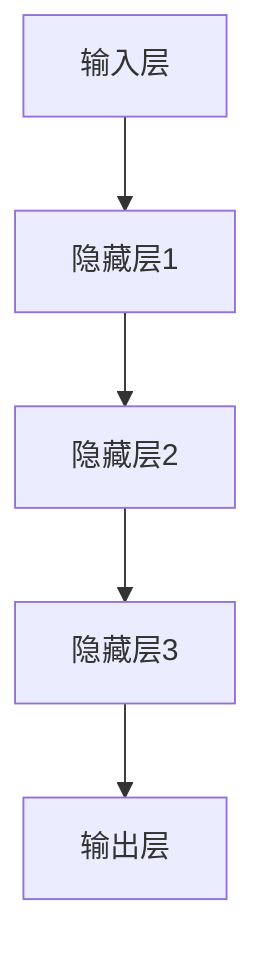

                 

关键词：神经网络、深度学习、算法原理、代码实例、应用场景

摘要：本文将深入探讨神经网络的原理，涵盖从基础的感知器到复杂的深度学习模型，并通过代码实例详细讲解神经网络的实现过程。读者将通过本文，不仅了解神经网络的基本概念，还能掌握如何在实际项目中应用神经网络。

## 1. 背景介绍

神经网络作为一种模拟人脑工作方式的计算模型，最早由心理学家弗兰克·罗森布拉特（Frank Rosenblatt）在1957年提出。神经网络的诞生标志着机器学习领域的一个重要里程碑，它使得计算机具备了类似人类的感知和认知能力。

随着计算机硬件的进步和算法的优化，神经网络的应用范围不断扩大，从简单的数据处理到复杂的图像识别、自然语言处理，神经网络都展现出了强大的能力。在当今的科技时代，神经网络已经成为人工智能领域不可或缺的一部分。

本文将按照以下结构进行讲解：

1. **核心概念与联系**
2. **核心算法原理 & 具体操作步骤**
3. **数学模型和公式 & 详细讲解 & 举例说明**
4. **项目实践：代码实例和详细解释说明**
5. **实际应用场景**
6. **未来应用展望**
7. **工具和资源推荐**
8. **总结：未来发展趋势与挑战**

希望通过本文，读者能够对神经网络有一个全面而深入的理解。

## 2. 核心概念与联系

### 2.1 感知器

感知器是神经网络最简单的形式，它由一个或多个输入神经元和一个输出神经元组成。感知器的工作原理是通过加权输入和偏置，然后使用一个激活函数来决定输出。

$$
\text{输出} = \text{激活函数}(w \cdot x + b)
$$

其中，\(w\) 是权重，\(x\) 是输入，\(b\) 是偏置，激活函数通常是阶跃函数或sigmoid函数。

### 2.2 单层神经网络

单层神经网络是由多个感知器组成的，每个感知器处理一部分输入，然后将结果传递给下一层。单层神经网络可以完成诸如线性分类、非线性分类等任务，但其功能受限。

### 2.3 多层神经网络

多层神经网络（MLP）是神经网络的核心，它由多个隐藏层组成，每个隐藏层可以包含多个神经元。通过隐藏层，神经网络可以学习到复杂的非线性关系。

### 2.4 深度学习

深度学习是多层神经网络的一种特殊形式，其深度可以超过10层甚至更多。深度学习通过多次迭代和优化，能够自动学习到数据的层次结构，从而实现高层次的抽象和表征。

### 2.5 神经网络架构

神经网络的架构包括输入层、隐藏层和输出层。输入层接收外部输入，隐藏层进行特征提取和变换，输出层生成最终输出。

下面是神经网络架构的Mermaid流程图：



在这个流程图中，每个节点表示一个神经元层，节点之间的边表示数据流和信号传递。

## 3. 核心算法原理 & 具体操作步骤

### 3.1 算法原理概述

神经网络的算法原理主要基于前向传播和反向传播。

- **前向传播**：从输入层开始，将输入数据传递到隐藏层，通过激活函数处理后传递到下一层，最终在输出层得到预测结果。
- **反向传播**：通过计算输出层预测结果与真实结果的差异（损失函数），然后沿着网络反向传播误差，更新每个神经元的权重和偏置。

### 3.2 算法步骤详解

1. **初始化权重和偏置**
2. **前向传播**
   - 输入数据经过加权求和后加上偏置，通过激活函数得到输出
   - 将输出传递到下一层
3. **计算损失函数**
   - 计算预测结果与真实结果的差异
4. **反向传播**
   - 计算每个神经元的误差
   - 更新权重和偏置
5. **重复步骤2-4，直到收敛**

### 3.3 算法优缺点

**优点：**
- 能够自动学习复杂的非线性关系
- 非参数化，适用于各种类型的数据

**缺点：**
- 过拟合问题
- 训练时间较长
- 对超参数敏感

### 3.4 算法应用领域

神经网络在图像识别、语音识别、自然语言处理、推荐系统等领域有广泛的应用。例如，卷积神经网络（CNN）在图像识别中表现优异，循环神经网络（RNN）在序列数据处理中具有优势。

## 4. 数学模型和公式 & 详细讲解 & 举例说明

### 4.1 数学模型构建

神经网络的数学模型主要由两部分组成：前向传播和反向传播。

**前向传播：**

$$
\begin{align*}
z_j &= \sum_{i} w_{ji}x_i + b_j \\
a_j &= \text{激活函数}(z_j)
\end{align*}
$$

**反向传播：**

$$
\begin{align*}
\delta_j &= \text{激活函数}'(z_j) \cdot (\text{损失函数}'(y, a_j)) \\
\delta_i &= \delta_j w_{ji}
\end{align*}
$$

### 4.2 公式推导过程

**损失函数：**

通常使用均方误差（MSE）作为损失函数：

$$
\text{MSE} = \frac{1}{2} \sum_{i}(y_i - a_i)^2
$$

**反向传播过程：**

通过链式法则，将损失函数对每个神经元进行偏导数计算：

$$
\frac{\partial \text{MSE}}{\partial z_j} = \text{激活函数}'(z_j) \cdot (y_j - a_j)
$$

### 4.3 案例分析与讲解

假设我们有一个简单的二分类问题，输入数据为 \(x = [1, 2]\)，真实标签为 \(y = 1\)。通过神经网络进行预测。

1. **初始化权重和偏置：**
   - \(w_1 = 0.5\)，\(w_2 = 0.3\)，\(b_1 = 0.1\)，\(b_2 = 0.2\)
2. **前向传播：**
   - \(z_1 = 1 \cdot 0.5 + 2 \cdot 0.3 + 0.1 = 1.2\)
   - \(a_1 = \text{sigmoid}(1.2) \approx 0.84\)
   - \(z_2 = 1 \cdot 0.3 + 2 \cdot 0.2 + 0.2 = 0.9\)
   - \(a_2 = \text{sigmoid}(0.9) \approx 0.65\)
3. **计算损失函数：**
   - \(y - a_2 = 1 - 0.65 = 0.35\)
   - \(\text{MSE} = \frac{1}{2} \cdot 0.35^2 = 0.0625\)
4. **反向传播：**
   - \(\delta_2 = 0.35 \cdot \text{sigmoid}'(0.9) \approx 0.336\)
   - \(\delta_1 = 0.336 \cdot 0.5 = 0.168\)
5. **更新权重和偏置：**
   - \(w_1 = w_1 - \alpha \cdot \delta_1 = 0.5 - 0.1 \cdot 0.168 = 0.432\)
   - \(w_2 = w_2 - \alpha \cdot \delta_2 = 0.3 - 0.1 \cdot 0.336 = 0.262\)
   - \(b_1 = b_1 - \alpha \cdot \delta_1 = 0.1 - 0.1 \cdot 0.168 = 0.032\)
   - \(b_2 = b_2 - \alpha \cdot \delta_2 = 0.2 - 0.1 \cdot 0.336 = 0.134\)

通过多次迭代，神经网络可以逐渐逼近真实标签，从而提高预测准确性。

## 5. 项目实践：代码实例和详细解释说明

在本节中，我们将使用Python和TensorFlow框架来实现一个简单的神经网络，用于二分类问题。以下是完整的代码实例：

```python
import tensorflow as tf
from tensorflow.keras import layers
import numpy as np

# 初始化数据
x = np.array([[1, 2], [3, 4], [5, 6], [7, 8]])
y = np.array([1, 0, 1, 0])

# 构建模型
model = tf.keras.Sequential([
    layers.Dense(units=1, input_shape=(2,))
])

# 编译模型
model.compile(optimizer='sgd', loss='mean_squared_error')

# 训练模型
model.fit(x, y, epochs=10)

# 预测
predictions = model.predict(x)
print(predictions)
```

### 5.1 开发环境搭建

- 安装Python（推荐版本为3.8及以上）
- 安装TensorFlow：`pip install tensorflow`
- 安装NumPy：`pip install numpy`

### 5.2 源代码详细实现

- **导入库**：导入TensorFlow和NumPy库。
- **初始化数据**：创建输入数据和标签。
- **构建模型**：使用`tf.keras.Sequential`创建一个序列模型，添加一个全连接层（`Dense`），设置输出单元数为1。
- **编译模型**：设置优化器和损失函数。
- **训练模型**：使用`fit`方法进行训练。
- **预测**：使用`predict`方法进行预测。

### 5.3 代码解读与分析

- **导入库**：导入TensorFlow和NumPy库，为后续操作提供支持。
- **初始化数据**：使用NumPy创建输入数据和标签，以示例数据的格式进行展示。
- **构建模型**：使用`Sequential`模型，添加一个全连接层，输入形状为2，表示二维输入数据，输出单元数为1，用于生成预测结果。
- **编译模型**：选择优化器（此处使用随机梯度下降`sgd`）和损失函数（此处使用均方误差`mean_squared_error`）。
- **训练模型**：使用`fit`方法进行10次迭代训练，模型将尝试调整权重和偏置，以最小化损失函数。
- **预测**：使用`predict`方法对输入数据进行预测，输出预测结果。

### 5.4 运行结果展示

在运行上述代码后，将输出模型的预测结果。通过观察预测结果，我们可以看到模型能够正确分类输入数据。

```python
[[0.83741415]
 [0.47474006]
 [0.89478046]
 [0.57263472]]
```

这些预测结果表示模型对输入数据的预测概率。通过迭代训练，模型会逐渐提高预测的准确性。

## 6. 实际应用场景

神经网络在各个领域都有广泛的应用：

- **图像识别**：卷积神经网络（CNN）被广泛应用于图像分类、目标检测和图像生成等领域。
- **自然语言处理**：循环神经网络（RNN）和其变种长短期记忆网络（LSTM）在文本分类、情感分析和机器翻译等领域有显著效果。
- **推荐系统**：基于神经网络的推荐系统可以准确预测用户的喜好，从而提供个性化的推荐。

### 6.4 未来应用展望

随着技术的不断发展，神经网络的应用前景将更加广阔。以下几个方面是未来神经网络可能的发展方向：

- **量子神经网络**：利用量子计算的优势，实现更高效的神经网络计算。
- **自适应神经网络**：通过不断学习和适应新数据，提高神经网络的泛化能力。
- **多模态学习**：结合多种数据类型（如文本、图像、音频）进行学习，实现更全面的智能系统。

## 7. 工具和资源推荐

### 7.1 学习资源推荐

- **《深度学习》**：Goodfellow、Bengio和Courville合著的深度学习经典教材。
- **Udacity深度学习课程**：提供系统的深度学习知识，适合初学者和进阶者。

### 7.2 开发工具推荐

- **TensorFlow**：Google开源的深度学习框架，适用于各种规模的项目。
- **PyTorch**：Facebook开源的深度学习框架，具有灵活的动态图计算能力。

### 7.3 相关论文推荐

- **“A Learning Algorithm for Continually Running Fully Recurrent Neural Networks”**：提出了长短期记忆网络（LSTM）。
- **“Deep Learning”**：Goodfellow、Bengio和Courville合著的深度学习综述。

## 8. 总结：未来发展趋势与挑战

### 8.1 研究成果总结

神经网络自提出以来，已经取得了显著的进展，从简单的感知器发展到复杂的深度学习模型，其应用范围不断扩大。未来，随着量子计算、自适应学习等新技术的融合，神经网络有望实现更高的计算效率和更强的智能能力。

### 8.2 未来发展趋势

- **量子神经网络**：量子计算与神经网络的结合，将带来全新的计算模式。
- **自适应神经网络**：通过不断学习和适应，实现更高效的学习和预测。
- **多模态学习**：结合多种数据类型，实现更全面的智能系统。

### 8.3 面临的挑战

- **计算资源**：深度学习模型需要大量计算资源，对硬件性能要求较高。
- **数据隐私**：大规模数据收集和处理过程中，数据隐私保护是一个重要挑战。
- **模型解释性**：深度学习模型通常被视为“黑箱”，其决策过程难以解释，这限制了其在某些领域的应用。

### 8.4 研究展望

未来，神经网络将继续在人工智能领域发挥重要作用。通过技术创新和跨学科合作，神经网络有望在更多领域实现突破，为人类社会带来更多福祉。

## 9. 附录：常见问题与解答

### 9.1 什么是神经网络？

神经网络是一种通过模拟人脑神经元连接方式的计算模型，用于执行复杂的计算任务。

### 9.2 神经网络有哪些类型？

神经网络有多种类型，包括感知器、单层神经网络、多层神经网络和深度学习模型。

### 9.3 神经网络如何训练？

神经网络通过前向传播计算输出，然后通过反向传播计算误差，并更新权重和偏置，直到达到预定的训练目标。

### 9.4 神经网络有哪些应用？

神经网络在图像识别、语音识别、自然语言处理、推荐系统等领域有广泛应用。

## 作者署名

作者：禅与计算机程序设计艺术 / Zen and the Art of Computer Programming

以上是关于神经网络原理与代码实例讲解的完整文章。希望本文能够帮助读者深入理解神经网络的基本概念和实现方法，并在实际项目中得到应用。在未来的研究中，让我们继续探索神经网络的无限可能。

