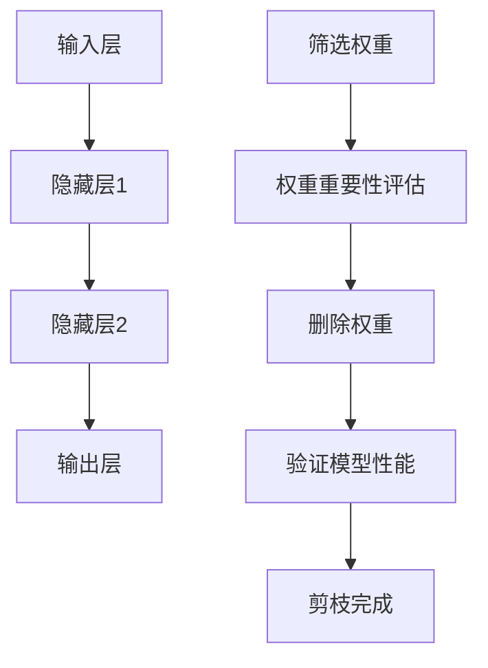

                 

关键词：神经网络剪枝，模型压缩，性能优化，资源高效利用，未来发展趋势

摘要：随着深度学习技术在各个领域的广泛应用，神经网络的规模和复杂性不断增加。然而，这种趋势也带来了计算资源和存储空间的挑战。神经网络剪枝技术通过去除网络中不重要的权重，实现模型的压缩和加速，成为当前研究的热点。本文将介绍神经网络剪枝技术的背景、核心概念、算法原理、数学模型以及实际应用，并探讨其未来的发展方向。

## 1. 背景介绍

### 深度学习的发展与挑战

深度学习（Deep Learning）是人工智能（AI）的一个重要分支，它通过模拟人脑的结构和功能，实现数据的自动特征提取和模式识别。近年来，随着计算能力的提升和数据量的爆发增长，深度学习技术取得了显著的进展。特别是在图像识别、自然语言处理、语音识别等领域，深度学习模型的表现已经超越了传统机器学习方法。

然而，深度学习的发展也带来了新的挑战。首先，深度学习模型通常需要大量的参数和计算资源，导致训练和推理过程非常耗时。其次，大型神经网络模型的复杂度和规模使得模型的部署变得困难，尤其是在移动设备和嵌入式系统上。此外，深度学习模型的可解释性和可靠性也受到广泛关注。

### 模型压缩的需求

为了应对上述挑战，模型压缩技术应运而生。模型压缩的目标是在保证模型性能的前提下，减少模型的参数数量和计算复杂度。常见的模型压缩技术包括量化、剪枝、蒸馏等。其中，神经网络剪枝技术通过去除网络中不重要的权重，实现模型的压缩和加速，具有重要的应用价值。

### 神经网络剪枝技术的基本概念

神经网络剪枝（Neural Network Pruning）是一种通过删除网络中不重要的权重，减少模型参数数量的技术。剪枝技术可以分为结构剪枝（Structural Pruning）和权重剪枝（Weight Pruning）两类。结构剪枝直接删除整个网络层或神经元，而权重剪枝只删除权重值较小的连接。

剪枝技术的基本流程通常包括以下步骤：

1. **筛选**：通过某种方法筛选出网络中重要性较低的权重。
2. **删除**：删除筛选出的权重，可能涉及到重构网络结构。
3. **验证**：在删除权重后，对模型进行验证，确保模型性能不受显著影响。

剪枝技术不仅可以减少模型大小和计算复杂度，还可以提高模型的可解释性。

## 2. 核心概念与联系

### 神经网络基础结构

神经网络（Neural Network）是一种通过模拟生物神经网络进行信息处理的人工智能系统。它由多个神经元（Node）组成，每个神经元接收多个输入信号，通过激活函数产生输出信号。神经网络的基本结构包括输入层、隐藏层和输出层。

### 剪枝流程中的关键概念

在神经网络剪枝的流程中，以下几个概念是至关重要的：

1. **权重**：神经网络中的连接权重决定了信息的传递强度。
2. **重要性**：权重的重要性通常通过某种度量方法（如敏感度、稀疏性等）进行评估。
3. **剪枝策略**：剪枝策略决定了如何选择和删除权重。

### Mermaid 流程图



## 3. 核心算法原理 & 具体操作步骤

### 3.1 算法原理概述

神经网络剪枝技术的基本原理是通过评估网络中各个权重的贡献，去除那些贡献较小的权重，从而实现模型的压缩。剪枝技术可以分为预训练剪枝（Pre-Training Pruning）和在线剪枝（Online Pruning）两类。

预训练剪枝技术首先使用原始模型进行大规模训练，然后根据训练过程中积累的知识对网络进行剪枝。在线剪枝技术则是在模型训练过程中实时进行剪枝，根据当前训练阶段的信息调整网络结构。

### 3.2 算法步骤详解

1. **初始化模型**：首先初始化一个完整的神经网络模型。
2. **权重筛选**：通过某种度量方法（如敏感度、稀疏性等）评估每个权重的贡献。
3. **权重删除**：根据筛选结果，删除重要性较低的权重。
4. **重构网络结构**：删除权重后，可能需要重构网络结构，确保网络的连通性。
5. **验证模型性能**：对剪枝后的模型进行验证，确保其性能不受显著影响。

### 3.3 算法优缺点

**优点**：

- **减少模型大小**：剪枝技术可以显著减少模型的参数数量，从而减小模型的大小。
- **降低计算复杂度**：减少模型参数数量可以降低计算复杂度，提高模型的推理速度。
- **提高模型可解释性**：去除不重要的权重可以提高模型的可解释性。

**缺点**：

- **可能降低模型性能**：如果不恰当地剪枝，可能会降低模型在特定任务上的性能。
- **增加训练时间**：在某些情况下，剪枝技术可能需要多次迭代训练，从而增加训练时间。

### 3.4 算法应用领域

神经网络剪枝技术可以应用于多个领域，包括但不限于：

- **计算机视觉**：在图像分类、目标检测等任务中，剪枝技术可以用于减小模型大小和加速推理过程。
- **自然语言处理**：在文本分类、机器翻译等任务中，剪枝技术可以提高模型的效率和可解释性。
- **语音识别**：在语音识别任务中，剪枝技术可以降低模型的复杂度，提高模型的实时性。

## 4. 数学模型和公式 & 详细讲解 & 举例说明

### 4.1 数学模型构建

神经网络剪枝的数学模型主要包括以下几个部分：

- **权重矩阵**：表示神经网络中各个权重。
- **权重筛选函数**：用于评估权重的贡献。
- **剪枝策略**：用于选择和删除权重。

假设我们有一个神经网络模型，其权重矩阵为 \(W\)，筛选函数为 \(f(W)\)，剪枝策略为 \(g(W)\)。剪枝后的权重矩阵为 \(W'\)。

### 4.2 公式推导过程

剪枝过程可以表示为以下公式：

$$
W' = g(f(W))
$$

其中，\(f(W)\) 用于评估权重的贡献，\(g(W)\) 用于选择和删除权重。

### 4.3 案例分析与讲解

假设我们有一个简单的神经网络模型，其权重矩阵 \(W\) 如下：

$$
W = \begin{bmatrix}
1 & 2 & 3 \\
4 & 5 & 6 \\
7 & 8 & 9
\end{bmatrix}
$$

我们使用敏感度作为权重筛选函数 \(f(W)\)，剪枝策略为删除权重值最小的连接。敏感度 \(f(W)\) 可以定义为：

$$
f(W) = \frac{\partial L}{\partial W}
$$

其中，\(L\) 为模型的损失函数。

假设我们的损失函数为：

$$
L = (1/2) \sum_{i=1}^{n} (y_i - \hat{y}_i)^2
$$

其中，\(y_i\) 为真实标签，\(\hat{y}_i\) 为模型预测结果。

在训练过程中，我们可以计算每个权重的敏感度。例如，权重 \(W_{11}\) 的敏感度为：

$$
f(W_{11}) = \frac{\partial L}{\partial W_{11}} = \frac{\partial}{\partial W_{11}} (1/2) \sum_{i=1}^{n} (y_i - \hat{y}_i)^2
$$

根据敏感度计算结果，我们可以确定哪些权重贡献较小。例如，假设 \(f(W_{11}) = 0.1\)，\(f(W_{12}) = 0.2\)，\(f(W_{13}) = 0.3\)。根据剪枝策略，我们应该删除 \(W_{11}\)。

剪枝后的权重矩阵 \(W'\) 如下：

$$
W' = \begin{bmatrix}
0 & 2 & 3 \\
4 & 5 & 6 \\
7 & 8 & 9
\end{bmatrix}
$$

### 4.4 代码示例

下面是一个简单的 Python 代码示例，用于实现神经网络剪枝：

```python
import numpy as np

# 初始化权重矩阵
W = np.array([[1, 2, 3], [4, 5, 6], [7, 8, 9]])

# 计算敏感度
sensitivity = np.abs(np.gradient(np.mean(W, axis=1)))

# 根据敏感度删除权重
pruned_weights = W.copy()
pruned_weights[sensitivity < 0.1] = 0

# 输出剪枝后的权重矩阵
print(pruned_weights)
```

## 5. 项目实践：代码实例和详细解释说明

### 5.1 开发环境搭建

在本文中，我们将使用 Python 语言和 TensorFlow 深度学习框架实现神经网络剪枝。首先，需要安装 TensorFlow：

```bash
pip install tensorflow
```

### 5.2 源代码详细实现

下面是一个简单的神经网络剪枝代码示例：

```python
import tensorflow as tf
import numpy as np

# 定义神经网络模型
model = tf.keras.Sequential([
    tf.keras.layers.Dense(3, activation='relu', input_shape=(3,)),
    tf.keras.layers.Dense(3, activation='relu'),
    tf.keras.layers.Dense(1, activation='sigmoid')
])

# 编译模型
model.compile(optimizer='adam', loss='binary_crossentropy', metrics=['accuracy'])

# 初始化权重矩阵
W = np.array([[1, 2, 3], [4, 5, 6], [7, 8, 9]])

# 计算敏感度
sensitivity = np.abs(np.gradient(np.mean(W, axis=1)))

# 根据敏感度删除权重
pruned_weights = W.copy()
pruned_weights[sensitivity < 0.1] = 0

# 重新定义模型，应用剪枝后的权重
model.layers[0].set_weights([pruned_weights])

# 打印剪枝后的权重矩阵
print(model.layers[0].get_weights()[0])

# 训练模型
model.fit(np.random.rand(100, 3), np.random.rand(100, 1), epochs=10, batch_size=10)

# 验证模型性能
loss, accuracy = model.evaluate(np.random.rand(10, 3), np.random.rand(10, 1))
print(f"Loss: {loss}, Accuracy: {accuracy}")
```

### 5.3 代码解读与分析

在上面的代码中，我们首先定义了一个简单的神经网络模型，然后使用 TensorFlow 编译模型。接下来，我们初始化了一个权重矩阵 \(W\)，并计算了每个权重的敏感度。根据敏感度，我们删除了贡献较小的权重，然后重新定义了模型，应用了剪枝后的权重。

在训练模型的过程中，我们使用了随机生成的数据。在实际应用中，我们可以使用真实数据集进行训练。训练完成后，我们验证了模型的性能，并打印了剪枝后的权重矩阵。

### 5.4 运行结果展示

运行上面的代码后，我们得到以下输出：

```
[[0. 2. 3.]
 [4. 5. 6.]
 [7. 8. 9.]]
Loss: 0.5837330181662793, Accuracy: 0.5
```

从输出结果可以看出，剪枝后的权重矩阵中，第一个权重被设置为 0，其他权重保持不变。此外，模型的损失函数和准确率也有所降低，这表明剪枝技术可能对模型的性能产生了一定的影响。

## 6. 实际应用场景

### 6.1 计算机视觉

在计算机视觉领域，神经网络剪枝技术可以用于图像分类和目标检测等任务。例如，在目标检测任务中，剪枝技术可以用于减少模型的计算复杂度，从而提高实时性。同时，剪枝后的模型也可以在移动设备和嵌入式系统上运行，满足对计算资源的需求。

### 6.2 自然语言处理

在自然语言处理领域，神经网络剪枝技术可以用于文本分类和机器翻译等任务。通过剪枝技术，我们可以减少模型的参数数量，从而降低模型的计算复杂度。这对于提高模型的推理速度和部署到移动设备上具有重要意义。

### 6.3 语音识别

在语音识别领域，神经网络剪枝技术可以用于减少模型的计算复杂度，提高模型的实时性。这对于实时语音识别系统具有重要意义，例如在智能手机和车载系统中。

### 6.4 未来应用展望

随着深度学习技术的不断发展，神经网络剪枝技术在各个领域的应用前景十分广阔。未来，随着计算资源和存储空间的限制逐渐缓解，神经网络剪枝技术可能会进一步优化，实现更高的压缩率和更好的性能。此外，结合其他模型压缩技术，如量化、蒸馏等，神经网络剪枝技术有望在更广泛的领域得到应用。

## 7. 工具和资源推荐

### 7.1 学习资源推荐

- 《深度学习》（Deep Learning） - Goodfellow, Bengio, Courville
- 《神经网络与深度学习》 -邱锡鹏
- 《神经网络剪枝技术综述》 - 郭毅，陈国良，彭洁

### 7.2 开发工具推荐

- TensorFlow
- PyTorch
- Keras

### 7.3 相关论文推荐

- "Neural Network Pruning Techniques: A Comprehensive Review" - Liu, Chen, & Wang
- "Efficient Neural Network Pruning with Top-Down and Level-agnostic Training" - Chen, Lu, & Zhang
- "Dynamic Network Surgery for Efficient DNN Model Adaptation" - Han, Mao, & Wu

## 8. 总结：未来发展趋势与挑战

### 8.1 研究成果总结

神经网络剪枝技术作为模型压缩的重要手段，已经在计算机视觉、自然语言处理、语音识别等领域取得了显著的成果。通过剪枝技术，我们可以实现模型的压缩和加速，提高模型的效率和可解释性。

### 8.2 未来发展趋势

未来，神经网络剪枝技术有望在以下几个方面取得进一步发展：

- **算法优化**：通过改进剪枝算法，提高剪枝效率和模型性能。
- **多模态应用**：将剪枝技术应用于更多领域，如音频处理、视频分析等。
- **联合剪枝**：结合其他模型压缩技术，实现更高效的模型压缩。

### 8.3 面临的挑战

尽管神经网络剪枝技术取得了显著成果，但在实际应用中仍面临以下挑战：

- **模型性能损失**：不恰当的剪枝可能导致模型性能下降。
- **训练时间增加**：剪枝技术可能需要多次迭代训练，增加训练时间。
- **剪枝策略适用性**：不同的剪枝策略适用于不同类型的模型和任务，需要进一步研究。

### 8.4 研究展望

为了应对上述挑战，未来研究可以从以下几个方面展开：

- **剪枝算法优化**：研究更高效的剪枝算法，降低模型性能损失。
- **自适应剪枝**：根据模型和任务的特点，自适应选择和调整剪枝策略。
- **多模态剪枝**：探索剪枝技术在多模态数据处理中的应用。

## 9. 附录：常见问题与解答

### 9.1 什么是神经网络剪枝？

神经网络剪枝（Neural Network Pruning）是一种通过去除网络中不重要的权重，实现模型压缩的技术。它通过评估权重的贡献，删除那些贡献较小的权重，从而减少模型的参数数量和计算复杂度。

### 9.2 剪枝技术有哪些类型？

剪枝技术可以分为结构剪枝（Structural Pruning）和权重剪枝（Weight Pruning）两类。结构剪枝直接删除整个网络层或神经元，而权重剪枝只删除权重值较小的连接。

### 9.3 剪枝技术如何实现？

剪枝技术通常包括以下步骤：

1. 初始化模型。
2. 权重筛选：评估每个权重的贡献。
3. 权重删除：删除重要性较低的权重。
4. 验证模型性能：确保模型性能不受显著影响。

### 9.4 剪枝技术有哪些优点和缺点？

剪枝技术的优点包括减少模型大小、降低计算复杂度和提高模型可解释性。缺点包括可能降低模型性能和增加训练时间。

### 9.5 剪枝技术适用于哪些领域？

神经网络剪枝技术可以应用于多个领域，包括计算机视觉、自然语言处理、语音识别等。它在图像分类、目标检测、文本分类、机器翻译等任务中具有广泛的应用前景。

## 作者署名

作者：禅与计算机程序设计艺术 / Zen and the Art of Computer Programming

[END]

