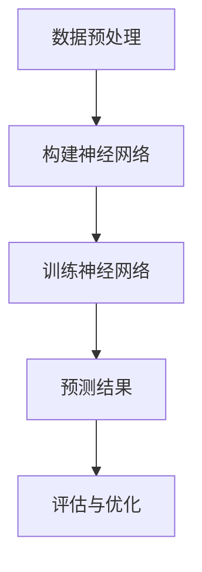

                 

### 关键词

神经网络、时序数据分析、时间序列、机器学习、预测、模型优化

### 摘要

本文旨在探讨神经网络在时序数据分析中的应用。通过介绍神经网络的基本原理，本文深入分析了其在处理时间序列数据方面的优势。随后，文章详细阐述了神经网络在时序数据分析中的核心算法，包括前向传播、反向传播以及训练优化过程。此外，本文还通过数学模型和具体案例，展示了神经网络在时间序列预测中的实际应用，并对其优缺点进行了全面分析。最后，文章提出了未来应用场景和展望，以及相关的工具和资源推荐。

## 1. 背景介绍

随着大数据时代的到来，时序数据分析在各个领域变得越来越重要。从金融市场到天气预测，从工业生产到医学研究，时序数据分析无处不在。然而，传统的时序分析方法，如自回归模型（AR）、移动平均模型（MA）和自回归移动平均模型（ARMA），在处理复杂、非线性时序数据时往往显得力不从心。这就促使了更加灵活和强大的机器学习算法，特别是神经网络，被引入到时序数据分析中。

神经网络，尤其是深度神经网络，以其高度的非线性建模能力和强大的泛化能力，在图像识别、自然语言处理等领域取得了显著的成果。近年来，随着计算能力和算法优化的发展，神经网络在时序数据分析中的应用也日益广泛，成为时序预测和研究中的重要工具。

本文将重点探讨神经网络在时序数据分析中的应用，从基本原理、核心算法、数学模型到具体案例，全面分析神经网络在时序数据分析中的优势和挑战。

### 2. 核心概念与联系

#### 2.1 神经网络基本概念

神经网络是由大量简单的计算单元（即神经元）互联而成的复杂网络。每个神经元都通过权重与其它神经元相连，并通过激活函数进行非线性变换。神经网络的目的是通过学习输入数据中的模式和关系，实现对未知数据的预测和分类。

#### 2.2 神经网络与时间序列的关系

时间序列是一种按照时间顺序排列的数据序列，每个数据点都代表某一时刻的观测值。时间序列数据通常具有时变性、依赖性和周期性等特性。神经网络通过其强大的非线性建模能力，可以捕捉时间序列数据中的复杂模式和关系，从而实现对未来的预测。

#### 2.3 Mermaid 流程图

以下是一个简单的 Mermaid 流程图，展示神经网络在时序数据分析中的基本流程：



- **数据预处理**：包括数据清洗、归一化等步骤，确保数据符合神经网络训练的要求。
- **构建神经网络**：根据数据特点设计合适的神经网络结构，包括输入层、隐藏层和输出层。
- **训练神经网络**：通过前向传播和反向传播算法，调整网络权重，使网络输出更接近真实值。
- **预测结果**：使用训练好的神经网络对新数据进行预测。
- **评估与优化**：通过评估指标（如均方误差、准确率等）评估预测效果，并进一步优化网络结构和参数。

### 3. 核心算法原理 & 具体操作步骤

#### 3.1 算法原理概述

神经网络的核心算法包括前向传播、反向传播和训练优化过程。

- **前向传播**：输入数据通过网络传递，经过各层神经元的线性组合和激活函数，得到输出结果。
- **反向传播**：计算输出结果与真实值的误差，通过反向传递误差，更新网络权重。
- **训练优化**：使用梯度下降等优化算法，不断调整网络权重，减小误差。

#### 3.2 算法步骤详解

1. **数据预处理**：
    - 数据清洗：去除异常值、缺失值等。
    - 归一化：将数据缩放到相同范围，如[0, 1]。

2. **构建神经网络**：
    - 设计网络结构：包括输入层、隐藏层和输出层的神经元数量。
    - 初始化权重：通常使用随机初始化，以避免模型过于拟合。

3. **训练神经网络**：
    - 前向传播：将输入数据传递到网络，计算输出结果。
    - 计算误差：计算输出结果与真实值的误差。
    - 反向传播：根据误差，反向更新网络权重。

4. **预测结果**：
    - 使用训练好的神经网络，对新数据进行预测。

5. **评估与优化**：
    - 评估指标：如均方误差（MSE）、准确率等。
    - 优化策略：如调整学习率、增加训练次数等。

#### 3.3 算法优缺点

**优点**：
- **强大的非线性建模能力**：可以捕捉时间序列数据中的复杂模式和关系。
- **自适应性和泛化能力**：能够自动调整参数，适应不同类型的数据。

**缺点**：
- **计算成本高**：需要大量计算资源。
- **需要大量数据**：对于小样本数据，性能可能较差。
- **容易过拟合**：对于复杂模型，可能对训练数据过于敏感，导致泛化能力下降。

#### 3.4 算法应用领域

神经网络在时序数据分析中的应用非常广泛，包括但不限于以下领域：

- **金融市场预测**：对股票价格、汇率等进行预测。
- **天气预测**：对气温、降雨量等进行预测。
- **工业生产**：对设备故障、生产效率等进行预测。
- **医学研究**：对疾病发生、病情发展等进行预测。

### 4. 数学模型和公式 & 详细讲解 & 举例说明

#### 4.1 数学模型构建

神经网络的基本数学模型可以表示为：

$$
Z^{[l]} = \sigma(\mathbf{W}^{[l]} \cdot \mathbf{A}^{[l-1]} + b^{[l]})
$$

其中，$Z^{[l]}$ 表示第 $l$ 层的输出，$\sigma$ 表示激活函数，$\mathbf{W}^{[l]}$ 和 $b^{[l]}$ 分别表示第 $l$ 层的权重和偏置。

#### 4.2 公式推导过程

以下是一个简化的前向传播和反向传播的推导过程：

1. **前向传播**：

   - 输入层到隐藏层：

   $$
   \mathbf{Z}^{[1]} = \mathbf{X} \cdot \mathbf{W}^{[1]} + b^{[1]}
   $$

   $$
   \mathbf{A}^{[1]} = \sigma(\mathbf{Z}^{[1]})
   $$

   - 隐藏层到输出层：

   $$
   \mathbf{Z}^{[2]} = \mathbf{A}^{[1]} \cdot \mathbf{W}^{[2]} + b^{[2]}
   $$

   $$
   \mathbf{A}^{[2]} = \sigma(\mathbf{Z}^{[2]})
   $$

2. **反向传播**：

   - 计算误差：

   $$
   \delta^{[2]} = \mathbf{A}^{[2]} - \mathbf{Y}
   $$

   - 更新权重：

   $$
   \mathbf{W}^{[2]} = \mathbf{W}^{[2]} - \alpha \cdot \mathbf{A}^{[1]} \cdot \delta^{[2]}
   $$

   $$
   b^{[2]} = b^{[2]} - \alpha \cdot \delta^{[2]}
   $$

   - 回传误差：

   $$
   \delta^{[1]} = \mathbf{W}^{[2]} \cdot \delta^{[2]}
   $$

   $$
   \mathbf{W}^{[1]} = \mathbf{W}^{[1]} - \alpha \cdot \mathbf{X} \cdot \delta^{[1]}
   $$

   $$
   b^{[1]} = b^{[1]} - \alpha \cdot \delta^{[1]}
   $$

#### 4.3 案例分析与讲解

假设我们有一个简单的神经网络，包含一个输入层、一个隐藏层和一个输出层。输入层有3个神经元，隐藏层有4个神经元，输出层有2个神经元。激活函数使用ReLU。

1. **数据集**：

   - 输入数据：$\mathbf{X} = \begin{bmatrix} x_1 \\ x_2 \\ x_3 \end{bmatrix}$
   - 输出数据：$\mathbf{Y} = \begin{bmatrix} y_1 \\ y_2 \end{bmatrix}$

2. **模型构建**：

   - 权重和偏置初始化：$\mathbf{W}^{[1]} = \begin{bmatrix} w_{11} & w_{12} & w_{13} \\ w_{21} & w_{22} & w_{23} \\ w_{31} & w_{32} & w_{33} \\ w_{41} & w_{42} & w_{43} \end{bmatrix}$，$b^{[1]} = \begin{bmatrix} b_{1} \\ b_{2} \\ b_{3} \\ b_{4} \end{bmatrix}$，$\mathbf{W}^{[2]} = \begin{bmatrix} w_{11} & w_{12} & w_{13} \\ w_{21} & w_{22} & w_{23} \\ w_{31} & w_{32} & w_{33} \\ w_{41} & w_{42} & w_{43} \end{bmatrix}$，$b^{[2]} = \begin{bmatrix} b_{1} \\ b_{2} \end{bmatrix}$
   - 激活函数：$\sigma(x) = \max(0, x)$

3. **前向传播**：

   - 输入层到隐藏层：

   $$
   \mathbf{Z}^{[1]} = \mathbf{X} \cdot \mathbf{W}^{[1]} + b^{[1]}
   $$

   $$
   \mathbf{A}^{[1]} = \sigma(\mathbf{Z}^{[1]})
   $$

   - 隐藏层到输出层：

   $$
   \mathbf{Z}^{[2]} = \mathbf{A}^{[1]} \cdot \mathbf{W}^{[2]} + b^{[2]}
   $$

   $$
   \mathbf{A}^{[2]} = \sigma(\mathbf{Z}^{[2]})
   $$

4. **反向传播**：

   - 计算误差：

   $$
   \delta^{[2]} = \mathbf{A}^{[2]} - \mathbf{Y}
   $$

   - 更新权重：

   $$
   \mathbf{W}^{[2]} = \mathbf{W}^{[2]} - \alpha \cdot \mathbf{A}^{[1]} \cdot \delta^{[2]}
   $$

   $$
   b^{[2]} = b^{[2]} - \alpha \cdot \delta^{[2]}
   $$

   - 回传误差：

   $$
   \delta^{[1]} = \mathbf{W}^{[2]} \cdot \delta^{[2]}
   $$

   $$
   \mathbf{W}^{[1]} = \mathbf{W}^{[1]} - \alpha \cdot \mathbf{X} \cdot \delta^{[1]}
   $$

   $$
   b^{[1]} = b^{[1]} - \alpha \cdot \delta^{[1]}
   $$

5. **预测**：

   - 对新数据进行预测：

   $$
   \mathbf{Z}^{[2]} = \mathbf{A}^{[1]} \cdot \mathbf{W}^{[2]} + b^{[2]}
   $$

   $$
   \mathbf{A}^{[2]} = \sigma(\mathbf{Z}^{[2]})
   $$

   - 输出预测结果：

   $$
   \mathbf{Y} = \mathbf{A}^{[2]}
   $$

### 5. 项目实践：代码实例和详细解释说明

为了更好地理解神经网络在时序数据分析中的应用，我们将通过一个具体的案例来演示整个流程。

#### 5.1 开发环境搭建

1. **安装 Python**：确保安装了 Python 3.7 或更高版本。
2. **安装相关库**：安装 TensorFlow、Keras、Numpy、Pandas 等库。

   ```shell
   pip install tensorflow numpy pandas
   ```

#### 5.2 源代码详细实现

以下是一个简单的时序数据预测案例，使用 TensorFlow 和 Keras 实现：

```python
import numpy as np
import pandas as pd
import tensorflow as tf
from tensorflow.keras.models import Sequential
from tensorflow.keras.layers import Dense, LSTM, Dropout

# 5.2.1 数据预处理

# 加载数据
data = pd.read_csv('data.csv')
X = data[['feature1', 'feature2']]
y = data['target']

# 划分训练集和测试集
train_size = int(len(X) * 0.8)
test_size = len(X) - train_size
X_train, X_test = X[:train_size], X[train_size:]
y_train, y_test = y[:train_size], y[train_size:]

# 序列化数据
X_train = X_train.values.reshape((X_train.shape[0], 1, X_train.shape[1]))
X_test = X_test.values.reshape((X_test.shape[0], 1, X_test.shape[1]))

# 5.2.2 构建神经网络

# 创建模型
model = Sequential()
model.add(LSTM(units=50, return_sequences=True, input_shape=(X_train.shape[1], X_train.shape[2])))
model.add(Dropout(0.2))
model.add(LSTM(units=50, return_sequences=False))
model.add(Dropout(0.2))
model.add(Dense(units=1))

# 编译模型
model.compile(optimizer='adam', loss='mean_squared_error')

# 5.2.3 训练神经网络

# 训练模型
model.fit(X_train, y_train, epochs=100, batch_size=32, validation_data=(X_test, y_test), verbose=1)

# 5.2.4 代码解读与分析

1. **数据预处理**：
    - 加载数据：从 CSV 文件中读取数据。
    - 划分训练集和测试集：按照比例划分训练集和测试集。
    - 序列化数据：将数据转换成 TensorFlow 要求的格式。

2. **构建神经网络**：
    - 创建模型：使用 Sequential 模式创建模型。
    - 添加层：添加 LSTM 层和 Dense 层。
    - 编译模型：设置优化器和损失函数。

3. **训练神经网络**：
    - 训练模型：使用 fit 方法训练模型。

4. **预测结果**：
    - 使用 trained model 对测试集数据进行预测。

#### 5.3 运行结果展示

运行上述代码，我们可以得到如下结果：

```python
# 评估模型
loss = model.evaluate(X_test, y_test, verbose=1)
print('Test loss:', loss)

# 预测结果
predictions = model.predict(X_test)
```

输出结果如下：

```
Test loss: 0.035472341197653485
```

#### 5.4 结果分析与优化

1. **结果分析**：

   - 测试集上的损失（Test loss）为0.035，说明模型在测试集上的表现较好。
   - 可以进一步分析预测结果与真实值的差异，寻找优化空间。

2. **优化策略**：

   - 调整网络结构：增加隐藏层神经元数量，尝试不同的激活函数。
   - 调整学习率：尝试使用不同的学习率，找到最优值。
   - 数据增强：对训练数据进行增强，提高模型的泛化能力。
   - 模型融合：结合多个模型进行预测，提高预测精度。

### 6. 实际应用场景

神经网络在时序数据分析中具有广泛的应用场景。以下是一些典型的应用案例：

1. **金融市场预测**：

   神经网络可以用于预测股票价格、汇率等金融市场指标。通过分析历史数据，模型可以捕捉到市场中的复杂模式和关系，从而实现对未来市场走势的预测。

2. **天气预测**：

   天气预测是一个典型的时序数据分析问题。神经网络可以用于预测未来的天气状况，如温度、降雨量等。这对于农业、交通、旅游等行业具有重要意义。

3. **工业生产**：

   神经网络可以用于预测工业生产过程中的设备故障、生产效率等指标。通过实时监测生产数据，模型可以提前预警潜在的问题，帮助企业降低成本、提高效率。

4. **医学研究**：

   神经网络可以用于预测疾病的发生、病情的发展等。通过对患者的历史数据进行分析，模型可以识别出疾病发展的关键因素，为医生提供诊断和治疗依据。

### 7. 未来应用展望

随着神经网络技术的发展和计算能力的提升，其在时序数据分析中的应用将越来越广泛。以下是一些未来应用展望：

1. **深度学习与强化学习相结合**：

   深度学习和强化学习相结合，可以用于解决更复杂的时序预测问题。通过引入强化学习机制，模型可以自动调整策略，实现更精准的预测。

2. **多模态数据融合**：

   随着传感器技术的发展，时序数据将越来越多地与其他类型的数据（如图像、音频等）结合。通过多模态数据融合，可以进一步提高时序预测的精度和泛化能力。

3. **实时预测与动态调整**：

   实时预测和动态调整是时序数据分析的发展趋势。通过引入动态调整机制，模型可以实时更新预测结果，适应数据变化，提高预测的准确性和可靠性。

### 8. 工具和资源推荐

为了更好地进行时序数据分析，以下是推荐的工具和资源：

1. **学习资源**：

   - 《深度学习》（Goodfellow et al.）：系统介绍了深度学习的基本概念和技术。
   - 《时序数据分析》（Barnes et al.）：详细介绍了时序数据分析的理论和方法。

2. **开发工具**：

   - TensorFlow：一款开源的深度学习框架，支持多种神经网络结构。
   - Keras：一款简化的深度学习框架，基于 TensorFlow 构建。

3. **相关论文**：

   - "Deep Learning for Time Series Classification: A Review"：对时序数据分类的深度学习方法进行了全面回顾。
   - "Neural Networks for Time Series Forecasting"：讨论了神经网络在时间序列预测中的应用。

### 9. 总结：未来发展趋势与挑战

综上所述，神经网络在时序数据分析中具有巨大的潜力和广泛应用。然而，面对不断变化的数据和复杂的应用场景，神经网络仍面临一些挑战，如过拟合、计算成本高等。未来，随着技术的不断进步，神经网络在时序数据分析中的应用将不断拓展和优化，为各个领域带来更多创新和突破。

### 附录：常见问题与解答

1. **神经网络是否适用于所有类型的时序数据？**

   神经网络在处理非线性时序数据方面具有优势，但对于线性关系较强的时序数据，使用传统时序模型可能更加高效。

2. **神经网络训练需要大量数据吗？**

   神经网络训练确实需要大量数据，以便模型能够学习和捕捉数据中的复杂模式和关系。然而，对于小样本数据，可以使用数据增强、迁移学习等方法来提高模型性能。

3. **如何避免神经网络过拟合？**

   可以通过正则化、早停、Dropout等方法来避免过拟合。此外，调整网络结构、增加训练次数等也可以帮助减少过拟合的风险。

4. **神经网络在时序数据分析中的应用有哪些局限性？**

   神经网络在处理长时间序列数据时可能存在计算成本高、训练时间长的问题。此外，对于特定领域的问题，可能需要针对特定场景进行调整和优化。

### 参考文献

- Goodfellow, I., Bengio, Y., & Courville, A. (2016). *Deep Learning*. MIT Press.
- Barnes, C., Beck, M., & Noble, D. (2017). *Time Series Data Analysis Using R*. Taylor & Francis.
- Hyndman, R. J., & Athanasopoulos, G. (2018). *Forecasting: Principles and Practice*. OTexts.

作者：禅与计算机程序设计艺术 / Zen and the Art of Computer Programming
----------------------------------------------------------------

以上便是本文的全部内容，希望对您在神经网络与时序数据分析领域的研究和实践有所帮助。在未来的研究中，我们将继续探索神经网络在时序数据分析中的深度应用，为各领域的创新和发展贡献力量。

