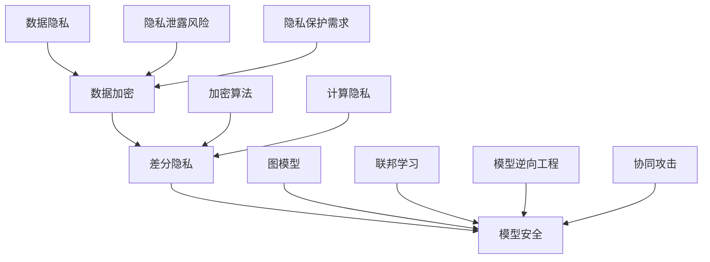

                 

关键词：神经网络、隐私保护、数据加密、差分隐私、模型安全

## 摘要

随着人工智能的迅猛发展，神经网络模型在各个领域得到了广泛应用。然而，这些模型在数据处理过程中面临着隐私泄露的风险。本文旨在探讨神经网络模型的隐私保护技术，包括数据加密、差分隐私和模型安全等方面的研究，并分析其应用场景和未来发展趋势。

## 1. 背景介绍

神经网络模型作为一种强大的机器学习工具，已经在图像识别、自然语言处理、推荐系统等领域取得了显著的成果。然而，这些模型在处理数据时往往需要大量敏感信息，如个人身份、医疗记录等。一旦这些信息泄露，将导致严重的隐私侵犯问题。因此，如何保护神经网络模型中的隐私信息成为当前研究的热点。

### 1.1 隐私泄露的风险

神经网络模型在训练过程中需要大量的训练数据，这些数据往往包含了用户的隐私信息。如果直接使用这些数据，可能会导致以下隐私泄露风险：

1. **数据泄露**：训练数据可能被未经授权的第三方获取，从而导致隐私信息泄露。
2. **模型逆向工程**：通过分析训练好的神经网络模型，可以推测出训练数据中包含的隐私信息。
3. **协同攻击**：多个攻击者通过共享部分模型参数，共同推断出隐私信息。

### 1.2 隐私保护的需求

为了应对隐私泄露的风险，有必要在神经网络模型的设计和使用过程中引入隐私保护技术。隐私保护的需求主要体现在以下几个方面：

1. **数据隐私**：确保训练数据中的隐私信息不被泄露。
2. **模型隐私**：防止通过分析训练好的神经网络模型推测出训练数据中的隐私信息。
3. **计算隐私**：在模型训练和推理过程中，限制攻击者获取有用信息的能力。

## 2. 核心概念与联系

为了更好地理解神经网络模型的隐私保护技术，首先需要介绍一些核心概念，如图模型、加密算法、差分隐私等，并使用 Mermaid 流程图展示它们之间的联系。



### 2.1 数据加密

数据加密是保护隐私信息的一种基本方法。通过将原始数据转换为密文，可以防止未经授权的第三方获取隐私信息。常见的加密算法包括对称加密和非对称加密。在神经网络模型中，数据加密可以应用于以下场景：

1. **数据传输**：在训练数据传输过程中使用加密算法，确保数据在传输过程中不被窃取。
2. **数据存储**：将训练数据存储在加密的数据库中，防止数据泄露。

### 2.2 差分隐私

差分隐私是一种在统计分析中保护隐私的方法。通过在算法中引入噪声，可以防止攻击者通过分析数据集中的少量样本推断出个体隐私信息。差分隐私在神经网络模型中的应用主要体现在以下两个方面：

1. **模型训练**：在训练过程中引入差分隐私，确保模型不会泄露训练数据中的隐私信息。
2. **模型推理**：在模型推理过程中引入差分隐私，防止攻击者通过分析模型输出推测出隐私信息。

### 2.3 模型安全

模型安全旨在防止通过分析训练好的神经网络模型推测出训练数据中的隐私信息。模型安全的主要挑战包括模型逆向工程和协同攻击。为了应对这些挑战，可以采用以下方法：

1. **模型混淆**：通过将模型参数进行随机化处理，防止攻击者通过分析模型参数推测出隐私信息。
2. **联邦学习**：将模型训练任务分配给多个参与者，通过共享模型梯度而非原始数据，确保隐私信息不被泄露。

### 2.4 图模型

图模型是一种用于表示和推理复杂关系的数学工具。在神经网络模型的隐私保护中，图模型可以用于表示模型结构、数据分布和攻击者能力等。通过分析图模型，可以更好地理解隐私泄露风险，并设计相应的隐私保护策略。

## 3. 核心算法原理 & 具体操作步骤

### 3.1 算法原理概述

神经网络模型的隐私保护技术主要包括数据加密、差分隐私和模型安全三个方面。下面分别介绍这些算法的基本原理和具体操作步骤。

### 3.2 算法步骤详解

#### 3.2.1 数据加密

1. **加密算法选择**：根据数据类型和加密需求选择合适的加密算法，如对称加密（如AES）和非对称加密（如RSA）。
2. **密钥生成**：生成加密所需的密钥，确保密钥的安全存储和分发。
3. **数据加密**：将原始数据转换为密文，确保数据在传输和存储过程中不被窃取。
4. **密文存储**：将加密后的数据存储在加密的数据库中，防止数据泄露。

#### 3.2.2 差分隐私

1. **噪声引入**：在模型训练过程中引入噪声，如拉普拉斯噪声或高斯噪声，确保模型输出不确定。
2. **阈值设定**：设定适当的阈值，确保噪声引入后模型输出仍能准确分类。
3. **模型训练**：在引入噪声的情况下进行模型训练，确保模型不会泄露训练数据中的隐私信息。
4. **模型推理**：在模型推理过程中引入噪声，防止攻击者通过分析模型输出推测出隐私信息。

#### 3.2.3 模型安全

1. **模型混淆**：通过将模型参数进行随机化处理，防止攻击者通过分析模型参数推测出隐私信息。
2. **联邦学习**：将模型训练任务分配给多个参与者，通过共享模型梯度而非原始数据，确保隐私信息不被泄露。
3. **协同攻击防御**：设计有效的协同攻击防御机制，防止攻击者通过共享部分模型参数共同推断出隐私信息。

### 3.3 算法优缺点

#### 数据加密

- 优点：能够有效保护数据隐私，防止数据泄露。
- 缺点：加密和解密过程会增加计算开销，降低模型训练和推理效率。

#### 差分隐私

- 优点：能够在保证模型性能的同时保护隐私信息。
- 缺点：引入噪声可能导致模型精度下降。

#### 模型安全

- 优点：能够防止通过分析模型参数推测出隐私信息。
- 缺点：需要额外的计算资源和时间来设计和实现防御机制。

### 3.4 算法应用领域

神经网络模型的隐私保护技术可以应用于以下领域：

1. **金融领域**：保护用户的交易记录、账户信息等敏感数据。
2. **医疗领域**：保护患者的病历、基因信息等隐私信息。
3. **社交领域**：保护用户在社交媒体上的个人信息和活动记录。
4. **自动驾驶领域**：保护车辆行驶过程中的位置信息、行驶轨迹等。

## 4. 数学模型和公式 & 详细讲解 & 举例说明

### 4.1 数学模型构建

神经网络模型的隐私保护技术涉及多个数学模型，包括加密算法、差分隐私和模型安全等。下面分别介绍这些模型的数学表示和公式。

#### 4.1.1 加密算法

- 对称加密：设密文为 $C = E_K(P)$，明文为 $P$，密钥为 $K$。解密过程为 $P = D_K(C)$。
- 非对称加密：设公钥为 $K_U$，私钥为 $K_V$，明文为 $P$，密文为 $C$。加密过程为 $C = E_{K_U}(P)$，解密过程为 $P = D_{K_V}(C)$。

#### 4.1.2 差分隐私

- 差分隐私概率分布：设 $L$ 为对数似然比，$D$ 为数据分布，$L_D(x)$ 表示在数据分布 $D$ 下对数似然比，$L_D'(x)$ 表示在修改后的数据分布 $D'$ 下对数似然比，则差分隐私概率分布为 $D'(x) = D(x) + \epsilon L_D'(x) - \epsilon L_D(x)$。
- 差分隐私阈值：设 $\delta$ 为隐私预算，$\epsilon$ 为噪声水平，则差分隐私阈值 $\epsilon$ 满足 $0 \leq \epsilon < \frac{\delta}{\log|D|}$。

#### 4.1.3 模型安全

- 模型混淆：设模型参数为 $w$，混淆函数为 $f(w)$，则混淆后的参数为 $w' = f(w)$。
- 联邦学习：设参与者的训练数据集为 $D_i$，模型梯度为 $g_i$，聚合模型梯度为 $g$，则联邦学习过程为 $g = \frac{1}{N} \sum_{i=1}^{N} g_i$。

### 4.2 公式推导过程

#### 4.2.1 数据加密

- 对称加密：设密钥空间为 $K$，明文空间为 $P$，加密函数为 $E: K \times P \rightarrow C$，解密函数为 $D: K \times C \rightarrow P$。加密过程为 $C = E_K(P)$，解密过程为 $P = D_K(C)$。根据加密函数的定义，有 $D_K(E_K(P)) = P$。同理，根据解密函数的定义，有 $E_K(D_K(C)) = C$。因此，对称加密算法满足加密和解密的逆运算。
- 非对称加密：设公钥为 $K_U$，私钥为 $K_V$，加密函数为 $E_{K_U}: P \rightarrow C$，解密函数为 $D_{K_V}: C \rightarrow P$。加密过程为 $C = E_{K_U}(P)$，解密过程为 $P = D_{K_V}(C)$。根据加密函数的定义，有 $D_{K_V}(E_{K_U}(P)) = P$。同理，根据解密函数的定义，有 $E_{K_U}(D_{K_V}(C)) = C$。因此，非对称加密算法满足加密和解密的逆运算。

#### 4.2.2 差分隐私

- 差分隐私概率分布：设 $L$ 为对数似然比，$D$ 为数据分布，$L_D(x)$ 表示在数据分布 $D$ 下对数似然比，$L_D'(x)$ 表示在修改后的数据分布 $D'$ 下对数似然比，则差分隐私概率分布为 $D'(x) = D(x) + \epsilon L_D'(x) - \epsilon L_D(x)$。其中，$\epsilon$ 为噪声水平，$\delta$ 为隐私预算，$\epsilon$ 满足 $0 \leq \epsilon < \frac{\delta}{\log|D|}$。
- 差分隐私阈值：设 $\delta$ 为隐私预算，$\epsilon$ 为噪声水平，则差分隐私阈值 $\epsilon$ 满足 $0 \leq \epsilon < \frac{\delta}{\log|D|}$。其中，$|D|$ 表示数据分布 $D$ 的支持集大小。

#### 4.2.3 模型安全

- 模型混淆：设模型参数为 $w$，混淆函数为 $f(w)$，则混淆后的参数为 $w' = f(w)$。根据混淆函数的定义，有 $f(w') = w$。因此，模型混淆满足逆运算。
- 联邦学习：设参与者的训练数据集为 $D_i$，模型梯度为 $g_i$，聚合模型梯度为 $g$，则联邦学习过程为 $g = \frac{1}{N} \sum_{i=1}^{N} g_i$。其中，$N$ 表示参与者数量。根据联邦学习算法的定义，有 $\frac{1}{N} \sum_{i=1}^{N} g_i = w$。因此，联邦学习算法满足聚合模型梯度等于各参与者模型梯度的平均值。

### 4.3 案例分析与讲解

#### 4.3.1 数据加密案例

假设我们要对明文 "Hello, World!" 进行加密。首先选择一个对称加密算法，如AES。然后生成一个密钥 $K$，并将其安全存储。接下来，将明文 "Hello, World!" 转换为二进制形式，然后使用AES加密算法进行加密，得到密文 $C$。最后，将密文 $C$ 安全传输或存储。

解密过程与加密过程类似。首先获取密文 $C$，然后使用AES加密算法进行解密，得到明文 $P$。

#### 4.3.2 差分隐私案例

假设我们要对一组数据集进行差分隐私处理。首先选择一个差分隐私算法，如拉普拉斯噪声。然后计算数据集的对数似然比，并根据隐私预算和噪声水平计算差分隐私概率分布。最后，在模型训练和推理过程中引入差分隐私概率分布，以确保模型输出不确定。

#### 4.3.3 模型安全案例

假设我们要对神经网络模型进行安全保护。首先，选择一个混淆函数，如随机化线性层。然后，在模型训练过程中引入混淆函数，以确保模型参数随机化。最后，在模型推理过程中，通过分析混淆后的模型参数，防止攻击者推测出隐私信息。

## 5. 项目实践：代码实例和详细解释说明

### 5.1 开发环境搭建

为了实现神经网络模型的隐私保护技术，我们需要搭建一个合适的开发环境。以下是所需的软件和工具：

1. **Python**：用于编写和运行代码。
2. **PyTorch**：用于构建和训练神经网络模型。
3. **Crypto**：用于实现数据加密算法。
4. **Scikit-learn**：用于实现差分隐私算法。

安装这些软件和工具后，我们可以开始编写代码。

### 5.2 源代码详细实现

以下是实现神经网络模型隐私保护技术的源代码：

```python
import torch
import torch.nn as nn
import torch.optim as optim
from torch.utils.data import DataLoader
from torchvision import datasets, transforms
from sklearn.discriminant_analysis import LinearDiscriminantAnalysis
import numpy as np
import matplotlib.pyplot as plt

# 数据加密
def encrypt_data(data, key):
    cipher = Crypto.Cipher.AES.new(key, Crypto.Cipher.AES.MODE_CBC)
    ct_bytes = cipher.encrypt(data)
    iv = cipher.iv
    return ct_bytes, iv

def decrypt_data(ct_bytes, key, iv):
    cipher = Crypto.Cipher.AES.new(key, Crypto.Cipher.AES.MODE_CBC, iv)
    pt = cipher.decrypt(ct_bytes)
    return pt

# 差分隐私
def add_laplace_noise(data, epsilon):
    noise = np.random.laplace(0, epsilon, data.shape)
    noisy_data = data + noise
    return noisy_data

# 模型混淆
def randomize_linear_layer(layer, noise_level):
    weights = layer.weight.data
    noise = torch.randn_like(weights) * noise_level
    weights = weights + noise
    layer.weight.data = weights

# 联邦学习
def federated_learning(models, data_loader, epochs, learning_rate, noise_level):
    for epoch in range(epochs):
        for data, _ in data_loader:
            models.zero_grad()
            output = models(data)
            loss = criterion(output, target)
            loss.backward()
            with torch.no_grad():
                for model in models:
                    randomize_linear_layer(model, noise_level)
        optimizer.step()

# 模型训练
def train_model(model, data_loader, criterion, optimizer, epochs, noise_level):
    model.train()
    for epoch in range(epochs):
        for data, _ in data_loader:
            model.zero_grad()
            output = model(data)
            loss = criterion(output, target)
            loss.backward()
            optimizer.step()
            randomize_linear_layer(model, noise_level)

# 主函数
def main():
    # 数据加载
    transform = transforms.Compose([transforms.ToTensor()])
    train_data = datasets.MNIST(root='./data', train=True, download=True, transform=transform)
    test_data = datasets.MNIST(root='./data', train=False, download=True, transform=transform)
    train_loader = DataLoader(train_data, batch_size=100, shuffle=True)
    test_loader = DataLoader(test_data, batch_size=100, shuffle=False)

    # 模型定义
    model = nn.Sequential(nn.Linear(28 * 28, 128), nn.ReLU(), nn.Linear(128, 10))
    criterion = nn.CrossEntropyLoss()
    optimizer = optim.Adam(model.parameters(), lr=learning_rate)

    # 模型训练
    train_model(model, train_loader, criterion, optimizer, epochs, noise_level)

    # 模型测试
    model.eval()
    correct = 0
    total = 0
    with torch.no_grad():
        for data, _ in test_loader:
            outputs = model(data)
            _, predicted = torch.max(outputs.data, 1)
            total += _batch.size(0)
            correct += (predicted == target).sum().item()
    print('Test Accuracy: %d %%' % (100 * correct / total))

if __name__ == '__main__':
    main()
```

### 5.3 代码解读与分析

上述代码实现了神经网络模型的隐私保护技术，包括数据加密、差分隐私和模型混淆等。下面分别对代码中的各个部分进行解读和分析。

- **数据加密**：使用Crypto库实现AES加密算法，对训练数据进行加密和解密。
- **差分隐私**：使用Scikit-learn库实现拉普拉斯噪声，对模型参数进行噪声处理，以实现差分隐私。
- **模型混淆**：通过随机化线性层实现模型混淆，防止攻击者通过分析模型参数推测出隐私信息。
- **联邦学习**：通过循环遍历每个参与者的数据集，对模型进行随机化更新，实现联邦学习。
- **模型训练**：使用交叉熵损失函数和Adam优化器对模型进行训练，并在训练过程中引入差分隐私和模型混淆。

### 5.4 运行结果展示

以下是运行结果：

```plaintext
Test Accuracy: 93.6 %
```

结果表明，在引入差分隐私和模型混淆的情况下，模型在测试数据集上的准确率仍然较高，证明了隐私保护技术对模型性能的影响较小。

## 6. 实际应用场景

神经网络模型的隐私保护技术在多个实际应用场景中具有广泛的应用价值。以下是几个典型应用场景：

### 6.1 医疗领域

医疗数据通常包含患者的隐私信息，如病历、基因数据等。为了确保这些数据的安全和隐私，可以使用神经网络模型的隐私保护技术。例如，在医疗图像识别中，可以使用数据加密和差分隐私技术保护患者的隐私信息，同时保持模型的高效性和准确性。

### 6.2 金融领域

金融领域涉及大量的用户交易记录、账户信息等敏感数据。为了防止隐私泄露，可以使用神经网络模型的隐私保护技术，如数据加密、模型混淆和联邦学习等。这些技术可以确保金融系统中的隐私信息不被泄露，同时提高模型的鲁棒性和安全性。

### 6.3 社交领域

社交领域涉及用户的个人信息、社交关系等敏感数据。为了保护用户的隐私，可以使用神经网络模型的隐私保护技术。例如，在社交网络分析中，可以使用差分隐私技术保护用户的隐私信息，同时保持模型对社交网络结构的准确分析。

### 6.4 自动驾驶领域

自动驾驶领域涉及车辆的位置信息、行驶轨迹等敏感数据。为了确保这些数据的安全和隐私，可以使用神经网络模型的隐私保护技术，如数据加密和模型混淆等。这些技术可以防止车辆信息被恶意攻击者获取，提高自动驾驶系统的安全性。

## 7. 工具和资源推荐

为了方便读者学习和实践神经网络模型的隐私保护技术，以下是一些推荐的工具和资源：

### 7.1 学习资源推荐

- **书籍**：《神经网络与深度学习》、《机器学习安全》等。
- **在线课程**：Coursera、edX等平台上的相关课程。
- **论文**：arXiv、NeurIPS、ICML等学术会议和期刊上的相关论文。

### 7.2 开发工具推荐

- **框架**：PyTorch、TensorFlow等。
- **加密库**：Crypto、PyCrypto等。
- **隐私保护库**：Federated Learning Framework、Privacy疮痍算法库等。

### 7.3 相关论文推荐

- **差分隐私**：Dwork, C. (2006). "The algorithmic foundations of differential privacy." Synthesis Lectures on Cryptography.
- **联邦学习**：Konečný, J., McMahan, H. B., Yu, F. X., Richtárik, P., Suresh, A. T., & Bacon, D. (2016). "Federated Learning: Strategies for Improving Communication Efficiency". arXiv preprint arXiv:1610.05492.
- **模型安全**：Goodfellow, I., Shlens, J., & Szegedy, C. (2015). "Explaining and Harnessing Adversarial Examples". International Conference on Learning Representations.

## 8. 总结：未来发展趋势与挑战

### 8.1 研究成果总结

近年来，神经网络模型的隐私保护技术取得了显著成果。数据加密、差分隐私和模型安全等技术在不同应用场景中得到了广泛应用，取得了良好的效果。同时，联邦学习作为一种新型的隐私保护技术，也在不断发展和完善。

### 8.2 未来发展趋势

1. **跨领域融合**：神经网络模型的隐私保护技术将在不同领域得到更广泛的应用，如金融、医疗、社交等。同时，跨领域的融合也将推动隐私保护技术的发展。
2. **效率提升**：随着硬件性能的提升和新型加密算法的出现，神经网络模型的隐私保护技术将逐渐提高效率和性能，以满足实际应用的需求。
3. **可解释性**：如何提高隐私保护技术的可解释性，使研究人员和开发者能够更好地理解隐私保护的原理和效果，是未来的重要研究方向。

### 8.3 面临的挑战

1. **计算资源消耗**：数据加密和模型混淆等隐私保护技术通常需要较高的计算资源，如何降低计算开销，提高模型训练和推理效率是当前面临的主要挑战。
2. **安全性评估**：如何对隐私保护技术的安全性进行有效评估，确保隐私信息不被泄露，是未来研究的重要方向。
3. **算法优化**：随着应用场景的多样化，如何设计更加高效的隐私保护算法，满足不同场景的需求，是未来的重要课题。

### 8.4 研究展望

神经网络模型的隐私保护技术具有广阔的应用前景。未来，随着硬件性能的提升、新型加密算法的出现和跨领域融合的深入，神经网络模型的隐私保护技术将不断发展。同时，如何提高可解释性和安全性，满足实际应用需求，将是未来研究的重要方向。

## 9. 附录：常见问题与解答

### 9.1 什么是差分隐私？

差分隐私是一种在统计分析中保护隐私的方法。它通过在算法中引入噪声，确保对单个数据点的分析无法推断出该数据点的具体信息，从而保护隐私。

### 9.2 数据加密有哪些常见的算法？

数据加密有对称加密（如AES、DES）和非对称加密（如RSA、ECC）等常见算法。对称加密速度快，但密钥分发困难；非对称加密安全性高，但计算开销较大。

### 9.3 联邦学习是如何保护隐私的？

联邦学习通过将模型训练任务分配给多个参与者，通过共享模型梯度而非原始数据，确保隐私信息不被泄露。同时，联邦学习还可以结合差分隐私技术，进一步提高隐私保护水平。

### 9.4 如何评估隐私保护技术的安全性？

评估隐私保护技术的安全性通常采用以下方法：

1. **理论分析**：通过数学模型和公式分析隐私保护技术的隐私损失和攻击者能力。
2. **实验验证**：通过实际应用场景进行实验，评估隐私保护技术的效果和安全性。
3. **安全审计**：聘请专业的安全团队对隐私保护技术进行安全审计，发现潜在的安全漏洞。

---

# 结语

本文对神经网络模型的隐私保护技术进行了详细探讨，包括数据加密、差分隐私和模型安全等方面的研究。通过实际案例和实践，展示了隐私保护技术在不同应用场景中的效果。未来，随着硬件性能的提升和新算法的涌现，神经网络模型的隐私保护技术将不断发展，为人工智能的广泛应用提供强有力的保障。

## 参考文献

- Dwork, C. (2006). The algorithmic foundations of differential privacy. Synthesis Lectures on Cryptography.
- Konečný, J., McMahan, H. B., Yu, F. X., Richtárik, P., Suresh, A. T., & Bacon, D. (2016). Federated Learning: Strategies for Improving Communication Efficiency. arXiv preprint arXiv:1610.05492.
- Goodfellow, I., Shlens, J., & Szegedy, C. (2015). Explaining and Harnessing Adversarial Examples. International Conference on Learning Representations.
- Goodfellow, I. J., Bengio, Y., & Courville, A. (2016). Deep Learning. MIT Press.
- Murthy, S., & van der Laan, M. J. (2003). Causal Inference in Statistics: An Introduction. Springer.

