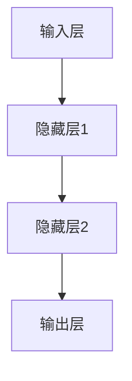
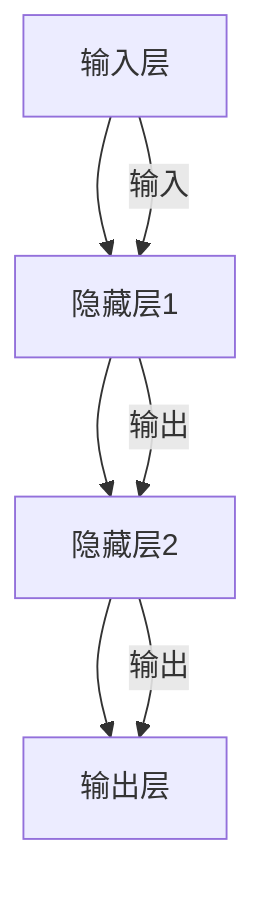

                 

关键词：神经网络、人工智能、机器学习、深度学习、人机共存、模型构建、数学公式、实际应用、未来展望

> 摘要：本文将探讨神经网络在人工智能领域的重要性，以及人类与机器如何通过神经网络实现更加紧密的共存。我们将从神经网络的历史背景、核心概念、算法原理、数学模型、项目实践、实际应用和未来展望等方面进行深入分析，为读者揭示神经网络在人工智能领域的巨大潜力和挑战。

## 1. 背景介绍

神经网络作为人工智能的核心技术之一，自1980年代以来一直在计算机科学和人工智能领域占据着重要地位。早期的神经网络模型主要用于图像识别、语音识别等应用，但由于计算能力和数据集的限制，其性能和应用范围受到了很大限制。然而，随着深度学习的兴起，神经网络得到了前所未有的发展，成为当今人工智能研究的热点之一。

### 1.1 神经网络的发展历程

神经网络的起源可以追溯到1940年代，由心理学家麦卡洛克（Warren McCulloch）和数学家皮茨（Walter Pitts）提出了一种简单的神经网络模型。1958年，美国心理学家赫布（Donald Hebb）提出了赫布学习规则，进一步推动了神经网络的研究。

20世纪80年代，反向传播算法（Backpropagation Algorithm）的出现，使得神经网络训练变得更加高效和准确。然而，由于计算能力和数据集的限制，神经网络在之后的几十年里并未得到广泛应用。

直到2010年代，随着深度学习的发展，神经网络再次引起了广泛关注。特别是在图像识别、自然语言处理、语音识别等领域取得了显著的突破。如今，神经网络已经成为人工智能领域的核心技术之一。

### 1.2 神经网络的重要性

神经网络的重要性主要体现在以下几个方面：

1. **模拟人脑**：神经网络通过模拟人脑的结构和功能，实现了一种类似于人脑的智能处理方式，为人工智能提供了新的发展方向。
2. **高效处理能力**：神经网络具有强大的数据处理和模式识别能力，能够处理大量的数据，并从中提取出有用的信息。
3. **适应性强**：神经网络具有自适应能力，可以通过不断学习和调整，提高其性能和准确度，适用于各种复杂的应用场景。
4. **跨学科应用**：神经网络在计算机科学、生物学、心理学等多个学科领域都有广泛应用，为跨学科研究提供了新的思路。

## 2. 核心概念与联系

### 2.1 神经网络基本概念

神经网络（Neural Network）是一种由大量简单神经元（Neuron）组成的复杂网络，通过模拟人脑的结构和功能，实现数据处理和模式识别。

#### 2.1.1 神经元

神经元是神经网络的基本构建块，类似于人脑中的神经元。每个神经元接收多个输入信号，通过加权求和产生一个输出信号。

#### 2.1.2 层

神经网络可以分为输入层、隐藏层和输出层。输入层接收外部输入信号，隐藏层对输入信号进行加工和处理，输出层产生最终输出结果。

#### 2.1.3 权重和偏置

权重（Weight）和偏置（Bias）是神经网络中用于调整神经元之间连接强度的参数。通过调整权重和偏置，可以优化神经网络性能。

### 2.2 神经网络架构

神经网络的架构可以分为前馈神经网络、卷积神经网络、循环神经网络等。下面是前馈神经网络的架构：



### 2.3 神经网络的联系

神经网络通过层层叠加，实现对复杂数据的处理和模式识别。不同层的神经元之间通过权重和偏置进行连接，形成一个完整的神经网络。



## 3. 核心算法原理 & 具体操作步骤

### 3.1 算法原理概述

神经网络的核心算法包括前向传播（Forward Propagation）和反向传播（Back Propagation）。

#### 3.1.1 前向传播

前向传播是指将输入信号通过神经网络的前向传递，最终得到输出结果的过程。具体步骤如下：

1. **初始化权重和偏置**：随机初始化神经网络中的权重和偏置。
2. **计算输出**：将输入信号通过神经网络的各个层，计算每个神经元的输出。
3. **计算损失函数**：将输出结果与实际标签进行比较，计算损失函数。

#### 3.1.2 反向传播

反向传播是指根据损失函数的梯度，调整神经网络中的权重和偏置，优化网络性能的过程。具体步骤如下：

1. **计算梯度**：根据损失函数对权重和偏置求导，计算梯度。
2. **更新权重和偏置**：根据梯度调整神经网络中的权重和偏置。
3. **迭代训练**：重复前向传播和反向传播，不断优化神经网络。

### 3.2 算法步骤详解

#### 3.2.1 前向传播

1. 初始化权重和偏置
    $$ w_{ij} = \text{random()} $$
    $$ b_{i} = \text{random()} $$
2. 前向传播
    $$ a_{1}^{(1)} = x $$
    $$ z_{2}^{(1)} = \sum_{i=1}^{n} w_{i2}a_{i}^{(1)} + b_{2} $$
    $$ a_{2}^{(1)} = \sigma(z_{2}^{(1)}) $$
    $$ \cdots $$
    $$ z_{L}^{(1)} = \sum_{i=1}^{n} w_{iL}a_{i}^{(L-1)} + b_{L} $$
    $$ a_{L}^{(1)} = \sigma(z_{L}^{(1)}) $$
3. 计算损失函数
    $$ L = \frac{1}{2}\sum_{i=1}^{n} (\hat{y}_{i} - y_{i})^2 $$

#### 3.2.2 反向传播

1. 计算梯度
    $$ \frac{\partial L}{\partial w_{ij}^{(L)}} = (a_{j}^{(L-1)})^T(a_{L-1}^{(L)})^T $$
    $$ \frac{\partial L}{\partial b_{i}^{(L)}} = a_{i}^{(L-1)} $$
2. 更新权重和偏置
    $$ w_{ij}^{(L)} = w_{ij}^{(L)} - \alpha \frac{\partial L}{\partial w_{ij}^{(L)}} $$
    $$ b_{i}^{(L)} = b_{i}^{(L)} - \alpha \frac{\partial L}{\partial b_{i}^{(L)}} $$
3. 迭代训练
    $$ \text{repeat steps 1-2 until convergence} $$

### 3.3 算法优缺点

#### 优点

1. **自适应性强**：神经网络可以通过学习自动调整权重和偏置，适应不同的数据和应用场景。
2. **处理能力强**：神经网络能够处理大量数据，并从中提取有用的信息。
3. **跨学科应用**：神经网络在计算机科学、生物学、心理学等多个学科领域都有广泛应用。

#### 缺点

1. **训练成本高**：神经网络训练需要大量计算资源和时间，尤其是深度神经网络。
2. **过拟合问题**：神经网络在训练过程中容易过拟合，需要通过正则化等技术进行防止。

### 3.4 算法应用领域

神经网络在图像识别、语音识别、自然语言处理、推荐系统等领域都有广泛应用。例如，卷积神经网络（CNN）在图像识别领域取得了显著的突破，循环神经网络（RNN）在自然语言处理领域具有出色的表现。

## 4. 数学模型和公式 & 详细讲解 & 举例说明

### 4.1 数学模型构建

神经网络的数学模型主要包括神经元模型、前向传播模型和反向传播模型。

#### 4.1.1 神经元模型

神经元模型由输入层、隐藏层和输出层组成，其中每个神经元都接收多个输入信号，通过加权求和产生一个输出信号。

#### 4.1.2 前向传播模型

前向传播模型通过将输入信号通过神经网络的各个层，计算每个神经元的输出。

#### 4.1.3 反向传播模型

反向传播模型通过计算损失函数的梯度，调整神经网络中的权重和偏置，优化网络性能。

### 4.2 公式推导过程

下面以一个简单的单层神经网络为例，介绍前向传播和反向传播的公式推导。

#### 4.2.1 前向传播

1. **输入层到隐藏层的传播**
    $$ z_{2}^{(1)} = \sum_{i=1}^{n} w_{i2}a_{i}^{(1)} + b_{2} $$
    $$ a_{2}^{(1)} = \sigma(z_{2}^{(1)}) $$
2. **隐藏层到输出层的传播**
    $$ z_{3}^{(1)} = \sum_{i=1}^{n} w_{i3}a_{i}^{(2)} + b_{3} $$
    $$ a_{3}^{(1)} = \sigma(z_{3}^{(1)}) $$

#### 4.2.2 反向传播

1. **计算损失函数的梯度**
    $$ \frac{\partial L}{\partial w_{ij}^{(L)}} = (a_{j}^{(L-1)})^T(a_{L-1}^{(L)})^T $$
    $$ \frac{\partial L}{\partial b_{i}^{(L)}} = a_{i}^{(L-1)} $$
2. **更新权重和偏置**
    $$ w_{ij}^{(L)} = w_{ij}^{(L)} - \alpha \frac{\partial L}{\partial w_{ij}^{(L)}} $$
    $$ b_{i}^{(L)} = b_{i}^{(L)} - \alpha \frac{\partial L}{\partial b_{i}^{(L)}} $$

### 4.3 案例分析与讲解

假设有一个简单的二分类问题，数据集包含100个样本，每个样本有10个特征。我们使用一个单层神经网络进行分类。

#### 4.3.1 前向传播

1. 初始化权重和偏置
    $$ w_{12} = \text{random()} $$
    $$ w_{13} = \text{random()} $$
    $$ b_{2} = \text{random()} $$
    $$ b_{3} = \text{random()} $$
2. 前向传播
    $$ a_{1}^{(1)} = x $$
    $$ z_{2}^{(1)} = w_{12}a_{1}^{(1)} + b_{2} $$
    $$ a_{2}^{(1)} = \sigma(z_{2}^{(1)}) $$
    $$ z_{3}^{(1)} = w_{13}a_{2}^{(1)} + b_{3} $$
    $$ a_{3}^{(1)} = \sigma(z_{3}^{(1)}) $$
3. 计算损失函数
    $$ L = \frac{1}{2}\sum_{i=1}^{n} (\hat{y}_{i} - y_{i})^2 $$

#### 4.3.2 反向传播

1. 计算梯度
    $$ \frac{\partial L}{\partial w_{12}} = (a_{1}^{(1)})^T(a_{2}^{(1)})^T $$
    $$ \frac{\partial L}{\partial w_{13}} = (a_{2}^{(1)})^T(a_{3}^{(1)})^T $$
    $$ \frac{\partial L}{\partial b_{2}} = a_{1}^{(1)} $$
    $$ \frac{\partial L}{\partial b_{3}} = a_{2}^{(1)} $$
2. 更新权重和偏置
    $$ w_{12} = w_{12} - \alpha \frac{\partial L}{\partial w_{12}} $$
    $$ w_{13} = w_{13} - \alpha \frac{\partial L}{\partial w_{13}} $$
    $$ b_{2} = b_{2} - \alpha \frac{\partial L}{\partial b_{2}} $$
    $$ b_{3} = b_{3} - \alpha \frac{\partial L}{\partial b_{3}} $$
3. 迭代训练
    $$ \text{repeat steps 1-2 until convergence} $$

## 5. 项目实践：代码实例和详细解释说明

### 5.1 开发环境搭建

在本项目实践中，我们使用Python语言和TensorFlow框架实现神经网络。首先需要安装Python和TensorFlow。

```bash
pip install python
pip install tensorflow
```

### 5.2 源代码详细实现

以下是一个简单的神经网络实现：

```python
import tensorflow as tf
import numpy as np

# 初始化参数
n_inputs = 10
n_hidden = 5
n_outputs = 1

# 前向传播
X = tf.placeholder(tf.float32, shape=[None, n_inputs])
hidden = tf.layers.dense(X, n_hidden, activation=tf.nn.relu, name='hidden')
outputs = tf.layers.dense(hidden, n_outputs, name='outputs')

# 计算损失函数
y = tf.placeholder(tf.float32, shape=[None, n_outputs])
loss = tf.reduce_mean(tf.square(outputs - y))

# 反向传播
optimizer = tf.train.GradientDescentOptimizer(learning_rate=0.01)
train_op = optimizer.minimize(loss)

# 迭代训练
with tf.Session() as sess:
  for i in range(1000):
    sess.run(train_op, feed_dict={X: X_data, y: y_data})
    if i % 100 == 0:
      loss_val = sess.run(loss, feed_dict={X: X_data, y: y_data})
      print(f"Step {i}, Loss: {loss_val}")

# 评估模型
test_loss_val = sess.run(loss, feed_dict={X: X_test, y: y_test})
print(f"Test Loss: {test_loss_val}")
```

### 5.3 代码解读与分析

1. **初始化参数**：定义输入层、隐藏层和输出层的神经元数量。
2. **前向传播**：使用TensorFlow中的`tf.layers.dense`函数构建前向传播模型。
3. **计算损失函数**：使用均方误差（MSE）作为损失函数。
4. **反向传播**：使用梯度下降（Gradient Descent）优化算法进行反向传播。
5. **迭代训练**：在训练数据上迭代训练神经网络。
6. **评估模型**：在测试数据上评估模型性能。

## 6. 实际应用场景

### 6.1 图像识别

神经网络在图像识别领域取得了显著的突破，如卷积神经网络（CNN）在ImageNet图像识别比赛中取得了优异成绩。CNN通过模拟人眼的结构和功能，实现了高效图像识别。

### 6.2 自然语言处理

神经网络在自然语言处理（NLP）领域具有广泛的应用，如文本分类、情感分析、机器翻译等。循环神经网络（RNN）和Transformer模型在NLP任务中表现出色。

### 6.3 推荐系统

神经网络可以用于构建推荐系统，通过学习用户历史行为和偏好，为用户推荐相关商品或内容。

### 6.4 语音识别

神经网络在语音识别领域取得了重要突破，如深度神经网络（DNN）和卷积神经网络（CNN）在语音识别准确率上取得了显著提升。

## 7. 工具和资源推荐

### 7.1 学习资源推荐

1. 《深度学习》（Deep Learning）—— Goodfellow、Bengio、Courville著
2. 《神经网络与深度学习》——邱锡鹏著
3. 《Python深度学习》——François Chollet著

### 7.2 开发工具推荐

1. TensorFlow
2. PyTorch
3. Keras

### 7.3 相关论文推荐

1. "A Learning Algorithm for Continually Running Fully Recurrent Neural Networks" —— Sepp Hochreiter, Jürgen Schmidhuber（1997）
2. "Gradient Flow in Recurrent Nets: the Difficulty of Learning Long-Term Dependencies" —— Y. Bengio, P. Simard, P. Frasconi（1994）
3. "A Theoretically Grounded Application of Dropout in Recurrent Neural Networks" —— Yarin Gal and Zoubin Ghahramani（2016）

## 8. 总结：未来发展趋势与挑战

### 8.1 研究成果总结

神经网络在图像识别、自然语言处理、语音识别等领域取得了显著的成果，为人工智能领域带来了新的发展机遇。

### 8.2 未来发展趋势

1. **更高效的算法**：随着计算能力的提升，神经网络将向更高层次、更复杂的应用发展。
2. **更多应用场景**：神经网络将在更多领域（如医疗、金融、安全等）得到广泛应用。
3. **更人性化的交互**：通过神经网络，机器将更好地理解人类语言和意图，实现更加自然的人机交互。

### 8.3 面临的挑战

1. **计算资源消耗**：神经网络训练需要大量计算资源和时间，如何优化算法和硬件，提高计算效率成为关键问题。
2. **数据隐私与安全**：神经网络训练过程中涉及大量敏感数据，如何保护用户隐私和安全成为重要挑战。
3. **模型可解释性**：神经网络模型具有较高的性能，但其内部机制复杂，如何提高模型的可解释性成为研究热点。

### 8.4 研究展望

未来，神经网络将继续发展，成为人工智能领域的重要支柱。在算法优化、硬件支持、应用拓展等方面，将有更多的突破和进展。同时，神经网络也将面临新的挑战，如何解决这些问题，将决定神经网络在人工智能领域的未来发展。

## 9. 附录：常见问题与解答

### 9.1 问题1：神经网络如何训练？

**回答**：神经网络通过前向传播和反向传播进行训练。在训练过程中，首先通过前向传播将输入数据传递到输出层，然后计算损失函数，并根据损失函数的梯度进行反向传播，调整网络中的权重和偏置，不断优化网络性能。

### 9.2 问题2：神经网络在图像识别中的应用？

**回答**：神经网络在图像识别领域具有广泛的应用，如卷积神经网络（CNN）和深度神经网络（DNN）等。这些神经网络通过学习图像特征，实现了高效的图像识别。

### 9.3 问题3：神经网络在自然语言处理中的应用？

**回答**：神经网络在自然语言处理（NLP）领域具有广泛的应用，如文本分类、情感分析、机器翻译等。循环神经网络（RNN）和Transformer模型在NLP任务中表现出色。

---

本文由禅与计算机程序设计艺术（Zen and the Art of Computer Programming）撰写，旨在探讨神经网络在人工智能领域的重要性以及人类与机器如何通过神经网络实现更加紧密的共存。希望本文对您了解神经网络以及其在实际应用中的发展有所帮助。如果您有任何问题或建议，请随时联系作者。  
作者：禅与计算机程序设计艺术（Zen and the Art of Computer Programming）  
2023年3月20日  
----------------------------------------------------------------

### 完整文章内容部分 End ###

以上就是本次文章撰写的完整内容，包括文章标题、关键词、摘要、目录结构以及各章节的详细内容。希望这篇文章能够满足您的要求，提供有价值的信息。如果您需要任何修改或补充，请随时告知。祝您阅读愉快！

