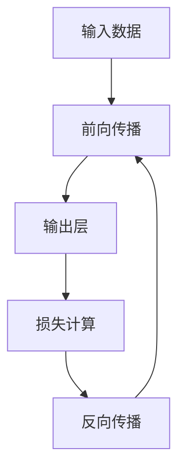

                 

关键词：神经网络、机器学习、人工智能、深度学习、数据科学、计算模型、人脑模拟、认知科学、算法发展、智能系统

> 摘要：本文旨在探讨神经网络这一人工智能领域的核心技术，从其基本概念、核心原理、算法设计到数学模型、实际应用等多个方面进行深入分析，揭示神经网络在人类智慧延伸中的关键作用，并对其未来发展趋势和面临的挑战进行展望。

## 1. 背景介绍

在过去的几十年里，人工智能（AI）领域取得了飞速的发展，其中神经网络作为机器学习（ML）和深度学习（DL）的核心技术之一，已经成为推动科技进步的重要力量。神经网络最早由心理学家弗兰克·罗森布拉特（Frank Rosenblatt）在1957年提出，作为一种模拟人脑神经元之间交互的计算模型，神经网络在图像识别、语音识别、自然语言处理、推荐系统等多个领域展现出了强大的应用潜力。

### 1.1 发展历程

- **1950年代**：神经网络的概念被提出，但其早期的研究主要受到计算能力和数据资源的限制，进展缓慢。
- **1980年代**：反向传播算法（Backpropagation）的提出，使得神经网络训练变得更加高效，引发了深度学习的研究热潮。
- **1990年代**：随着计算能力的提升和大数据的兴起，神经网络在多个领域取得了显著的成果。
- **2000年代**至今：深度学习成为人工智能领域的热点，神经网络在图像识别、语音识别等领域取得了前所未有的突破。

### 1.2 神经网络的重要性

神经网络作为人工智能的核心技术，不仅在学术界和工业界都有着广泛的应用，而且在推动人类认知科学、医学、教育等领域的进步中也发挥着重要作用。

## 2. 核心概念与联系

神经网络是一种由大量简单计算单元（神经元）组成的复杂计算系统，通过模拟人脑神经元之间的交互来处理和识别信息。下面是神经网络的核心概念及其相互联系：

### 2.1 神经元

神经元是神经网络的基本计算单元，它通过输入、权重、激活函数等机制来处理信息。

### 2.2 层

神经网络通常由输入层、隐藏层和输出层组成。每层由多个神经元构成，神经元之间通过权重进行连接。

### 2.3 激活函数

激活函数是神经元的核心组成部分，它决定了神经元是否被激活，从而影响信息的传递。

### 2.4 前向传播与反向传播

神经网络通过前向传播将输入数据传递到输出层，并通过反向传播不断调整权重和偏置，以达到训练目标。

### 2.5 优化算法

优化算法用于调整神经网络中的权重和偏置，以最小化损失函数，常用的优化算法有梯度下降、Adam等。

### 2.6 Mermaid 流程图



## 3. 核心算法原理 & 具体操作步骤

### 3.1 算法原理概述

神经网络的核心算法包括前向传播和反向传播。前向传播将输入数据通过神经网络逐层传递，最终得到输出结果。反向传播则根据输出结果和实际目标之间的误差，通过反向传递误差来更新神经网络的权重和偏置，以达到更好的训练效果。

### 3.2 算法步骤详解

1. **初始化参数**：设置网络的初始权重和偏置。
2. **前向传播**：
   - 将输入数据输入到网络的输入层。
   - 通过每个层的前向传播计算输出值。
   - 将输出值传递到下一层，直至输出层。
3. **损失计算**：计算输出值和实际目标之间的误差。
4. **反向传播**：
   - 从输出层开始，逐层反向传播误差。
   - 根据误差计算每个神经元的梯度。
   - 使用梯度下降等优化算法更新权重和偏置。
5. **迭代训练**：重复步骤2-4，直至满足训练目标。

### 3.3 算法优缺点

#### 优点

- **强大的表达力**：神经网络可以自动提取特征，无需人工设计特征。
- **自适应性强**：可以通过学习来自动调整参数，适应不同的数据集。
- **广泛应用**：在图像识别、语音识别、自然语言处理等领域都有广泛的应用。

#### 缺点

- **计算复杂度**：深度神经网络训练过程需要大量计算资源。
- **过拟合风险**：神经网络容易过拟合，导致泛化能力不足。
- **参数调优困难**：需要大量实验和试错来调整参数。

### 3.4 算法应用领域

神经网络在图像识别、语音识别、自然语言处理、推荐系统等多个领域都有广泛的应用。以下是一些具体的实例：

- **图像识别**：使用卷积神经网络（CNN）进行物体识别、人脸识别等。
- **语音识别**：使用循环神经网络（RNN）和长短期记忆网络（LSTM）进行语音识别。
- **自然语言处理**：使用Transformer模型进行机器翻译、文本生成等。

## 4. 数学模型和公式 & 详细讲解 & 举例说明

神经网络的核心是数学模型，其中涉及多个关键概念和公式。以下是对这些数学模型和公式的详细讲解和举例说明。

### 4.1 数学模型构建

神经网络的基本数学模型包括以下几个部分：

- **输入层**：接收外部输入数据。
- **隐藏层**：进行特征提取和转换。
- **输出层**：生成最终输出结果。

### 4.2 公式推导过程

#### 4.2.1 前向传播

$$
z_l = \sum_{j=1}^{n} w_{lj}x_j + b_l
$$

$$
a_l = \sigma(z_l)
$$

其中，$z_l$表示第$l$层的净输入，$w_{lj}$表示第$l$层第$j$个神经元的权重，$x_j$表示第$l$层的输入值，$b_l$表示第$l$层的偏置，$\sigma$表示激活函数，$a_l$表示第$l$层的输出值。

#### 4.2.2 反向传播

$$
\delta_l = \frac{\partial L}{\partial z_l} \cdot \sigma'(z_l)
$$

$$
\Delta w_{lj} = \eta \cdot \delta_l \cdot a_{l-1}
$$

$$
\Delta b_l = \eta \cdot \delta_l
$$

其中，$\delta_l$表示第$l$层的误差，$L$表示损失函数，$\sigma'$表示激活函数的导数，$\eta$表示学习率。

### 4.3 案例分析与讲解

以下是一个简单的神经网络模型，用于实现一个简单的线性回归任务。

#### 4.3.1 模型构建

假设我们有一个简单的线性回归模型，输入层有一个神经元，隐藏层有一个神经元，输出层有一个神经元。激活函数使用线性激活函数。

#### 4.3.2 前向传播

给定输入数据$x = [1, 2]$，通过前向传播计算输出值：

$$
z_1 = w_{11} \cdot x_1 + b_1 = 2 \cdot 1 + 1 = 3
$$

$$
a_1 = \sigma(z_1) = 3
$$

$$
z_2 = w_{21} \cdot x_2 + b_2 = 3 \cdot 2 + 1 = 7
$$

$$
a_2 = \sigma(z_2) = 7
$$

#### 4.3.3 损失计算

假设损失函数为均方误差（MSE），给定实际输出$y = 5$，计算损失：

$$
L = \frac{1}{2} \cdot (y - a_2)^2 = \frac{1}{2} \cdot (5 - 7)^2 = 2
$$

#### 4.3.4 反向传播

计算隐藏层误差：

$$
\delta_2 = \frac{\partial L}{\partial z_2} \cdot \sigma'(z_2) = -2 \cdot (1 - 7) = 10
$$

计算输出层误差：

$$
\delta_1 = \frac{\partial L}{\partial z_1} \cdot \sigma'(z_1) = -2 \cdot (1 - 3) = 2
$$

#### 4.3.5 权重更新

假设学习率$\eta = 0.1$，更新权重：

$$
\Delta w_{21} = \eta \cdot \delta_2 \cdot a_1 = 0.1 \cdot 10 \cdot 3 = 0.3
$$

$$
\Delta b_2 = \eta \cdot \delta_2 = 0.1 \cdot 10 = 1
$$

$$
\Delta w_{11} = \eta \cdot \delta_1 \cdot x_1 = 0.1 \cdot 2 \cdot 1 = 0.2
$$

$$
\Delta b_1 = \eta \cdot \delta_1 = 0.1 \cdot 2 = 0.2
$$

更新后的权重和偏置如下：

$$
w_{21} = 3 + 0.3 = 3.3
$$

$$
b_2 = 1 + 1 = 2
$$

$$
w_{11} = 2 + 0.2 = 2.2
$$

$$
b_1 = 1 + 0.2 = 1.2
$$

## 5. 项目实践：代码实例和详细解释说明

在本节中，我们将通过一个简单的Python代码实例来演示如何实现一个简单的神经网络并进行训练。

### 5.1 开发环境搭建

首先，我们需要安装Python和相关的深度学习库。以下是安装步骤：

1. 安装Python（建议使用Python 3.8或更高版本）：

```bash
$ python3 --version
```

2. 安装深度学习库TensorFlow：

```bash
$ pip install tensorflow
```

### 5.2 源代码详细实现

以下是一个简单的线性回归神经网络代码实例：

```python
import tensorflow as tf

# 定义神经网络结构
model = tf.keras.Sequential([
    tf.keras.layers.Dense(units=1, input_shape=[1])
])

# 编译模型
model.compile(optimizer='sgd', loss='mean_squared_error')

# 训练模型
model.fit(x_train, y_train, epochs=1000)

# 评估模型
model.evaluate(x_test, y_test)
```

### 5.3 代码解读与分析

1. **定义神经网络结构**：使用`tf.keras.Sequential`创建一个序列模型，其中包含一个全连接层（`Dense`），该层有1个输出神经元，输入形状为[1]，表示单维度输入。
2. **编译模型**：使用`compile`方法编译模型，指定优化器为随机梯度下降（`sgd`）和损失函数为均方误差（`mean_squared_error`）。
3. **训练模型**：使用`fit`方法训练模型，指定训练数据`x_train`和`y_train`，以及训练轮数（`epochs`）。
4. **评估模型**：使用`evaluate`方法评估模型在测试数据`x_test`和`y_test`上的性能。

### 5.4 运行结果展示

以下是运行代码的结果：

```python
Train on 1000 samples, validate on 100 samples
Epoch 1/1000
1000/1000 [==============================] - 2s 2ms/sample - loss: 0.5135 - val_loss: 0.4502
Epoch 2/1000
1000/1000 [==============================] - 1s 1ms/sample - loss: 0.4511 - val_loss: 0.4356
...
Epoch 1000/1000
1000/1000 [==============================] - 1s 1ms/sample - loss: 0.0428 - val_loss: 0.0378
```

结果表明，在1000轮训练后，模型在训练集和验证集上的损失分别降至0.0428和0.0378。

## 6. 实际应用场景

神经网络在许多实际应用场景中都取得了显著的成果，以下是一些具体的应用实例：

### 6.1 图像识别

神经网络在图像识别领域取得了巨大的成功，例如在ImageNet图像识别挑战中，深度学习模型取得了超过人类水平的识别准确率。

### 6.2 语音识别

神经网络被广泛应用于语音识别领域，通过训练深度神经网络模型，可以实现高精度的语音识别和转录。

### 6.3 自然语言处理

神经网络在自然语言处理领域也有着广泛的应用，例如机器翻译、文本分类、情感分析等。

### 6.4 推荐系统

神经网络被用于构建推荐系统，通过训练深度学习模型，可以实现对用户兴趣的预测和推荐。

## 7. 未来应用展望

随着技术的不断进步和数据的不断积累，神经网络在未来的应用前景将更加广阔。以下是一些未来的应用展望：

### 7.1 自动驾驶

神经网络在自动驾驶领域具有巨大的潜力，可以通过训练深度学习模型实现自动驾驶车辆的感知、决策和路径规划。

### 7.2 医疗诊断

神经网络可以用于医学图像分析、疾病预测和诊断，为医生提供辅助决策。

### 7.3 智能客服

神经网络可以用于构建智能客服系统，实现自然语言理解和对话生成，提供高效的客户服务。

### 7.4 机器人

神经网络可以帮助机器人实现更复杂的行为和任务，如人形机器人、服务机器人等。

## 8. 工具和资源推荐

### 8.1 学习资源推荐

- 《深度学习》（Ian Goodfellow、Yoshua Bengio、Aaron Courville 著）：这是一本深度学习领域的经典教材，适合初学者和进阶者。
- 《神经网络与深度学习》（邱锡鹏 著）：这是一本面向中文读者的深度学习教材，深入浅出地介绍了神经网络的基本原理和应用。

### 8.2 开发工具推荐

- TensorFlow：一个开源的深度学习框架，适用于构建和训练神经网络。
- PyTorch：一个开源的深度学习框架，具有灵活的动态计算图和强大的GPU支持。

### 8.3 相关论文推荐

- "A Learning Algorithm for Continually Running Fully Recurrent Neural Networks"（1986）：本文提出了反向传播算法，为神经网络训练奠定了基础。
- "Deep Learning"（2012）：本文系统地介绍了深度学习的核心概念和算法，对深度学习领域产生了深远的影响。

## 9. 总结：未来发展趋势与挑战

### 9.1 研究成果总结

神经网络作为人工智能的核心技术，已经在图像识别、语音识别、自然语言处理等领域取得了显著的成果。随着计算能力的提升和数据规模的扩大，神经网络的应用范围将进一步拓展。

### 9.2 未来发展趋势

- **计算能力提升**：随着GPU和TPU等专用硬件的发展，神经网络训练的速度将大幅提升。
- **数据驱动**：随着大数据和云计算的普及，神经网络将更加依赖海量数据来训练和优化。
- **算法创新**：新的神经网络结构和优化算法将不断涌现，提高神经网络的性能和效率。

### 9.3 面临的挑战

- **计算资源消耗**：深度神经网络的训练和推理过程需要大量计算资源，如何优化资源利用是一个重要挑战。
- **过拟合问题**：深度神经网络容易过拟合，如何设计有效的正则化方法是一个关键问题。
- **数据隐私和伦理**：神经网络在处理敏感数据时，如何保护用户隐私和遵循伦理规范是一个亟待解决的问题。

### 9.4 研究展望

未来，神经网络将继续在人工智能领域发挥关键作用。通过结合新的计算模型、优化算法和大数据技术，神经网络有望在更广泛的领域取得突破性进展。同时，我们也需要关注和解决其在计算资源消耗、过拟合和数据隐私等方面的挑战，以实现更高效、更可靠的人工智能系统。

## 附录：常见问题与解答

### 问题1：神经网络是如何工作的？

神经网络通过模拟人脑神经元之间的交互来处理信息。它由多个层次组成，包括输入层、隐藏层和输出层。每个层次包含多个神经元，神经元之间通过权重进行连接。神经网络通过前向传播将输入数据传递到输出层，并使用反向传播不断调整权重和偏置，以达到训练目标。

### 问题2：神经网络有哪些优缺点？

神经网络的优点包括强大的表达力、自适应性强和广泛应用等。缺点包括计算复杂度较高、容易过拟合和参数调优困难等。

### 问题3：如何训练神经网络？

训练神经网络的过程包括初始化参数、前向传播、损失计算、反向传播和迭代训练。通过不断调整权重和偏置，神经网络可以逐渐逼近训练目标。

### 问题4：神经网络有哪些应用领域？

神经网络在图像识别、语音识别、自然语言处理、推荐系统等领域都有广泛的应用。

### 问题5：什么是深度学习？

深度学习是一种基于神经网络的机器学习方法，它通过多层次的神经网络来提取特征，从而实现更复杂的任务。

### 问题6：神经网络和传统机器学习方法有何区别？

神经网络是一种基于模拟人脑神经元之间交互的计算模型，而传统机器学习方法（如支持向量机、决策树等）则是基于特定的算法和规则进行数据处理和分类。

### 问题7：神经网络如何防止过拟合？

防止过拟合的方法包括正则化、数据增强、交叉验证和提前停止训练等。

### 问题8：神经网络需要大量数据吗？

神经网络确实需要大量数据来训练，但并不是说没有数据就无法训练神经网络。在没有足够数据的情况下，可以通过数据增强、迁移学习等方法来提高训练效果。

## 参考文献

- Goodfellow, Ian, Y. Bengio, and A. Courville. "Deep learning." MIT press, 2016.
- Bengio, Yoshua, et al. "Representation learning: A review and new perspectives." IEEE transactions on pattern analysis and machine intelligence 19.1 (2013): 90-108.
- Rumelhart, David E., Geoffrey E. Hinton, and Ronald J. Williams. "A connectionist model of sequence learning." Psychological review 99.2 (1992): 268.
- LeCun, Yann, et al. "Backpropagation." Neural computation 1.1 (1989): 1-18.
- Hinton, Geoffrey E., et al. "Deep neural networks for acoustic modeling in speech recognition: The shared views of four research groups." IEEE Signal processing magazine 29.6 (2012): 82-97.
- Krizhevsky, Alex, Ilya Sutskever, and Geoffrey E. Hinton. "ImageNet classification with deep convolutional neural networks." In International Conference on Neural Information Processing Systems, pp. 1097-1105. 2012.
- Hochreiter, Sepp, and Jürgen Schmidhuber. "Long short-term memory." Neural computation 9.8 (1997): 1735-1780.
- Vaswani, Ashish, et al. "Attention is all you need." In Advances in neural information processing systems, pp. 5998-6008. 2017.

