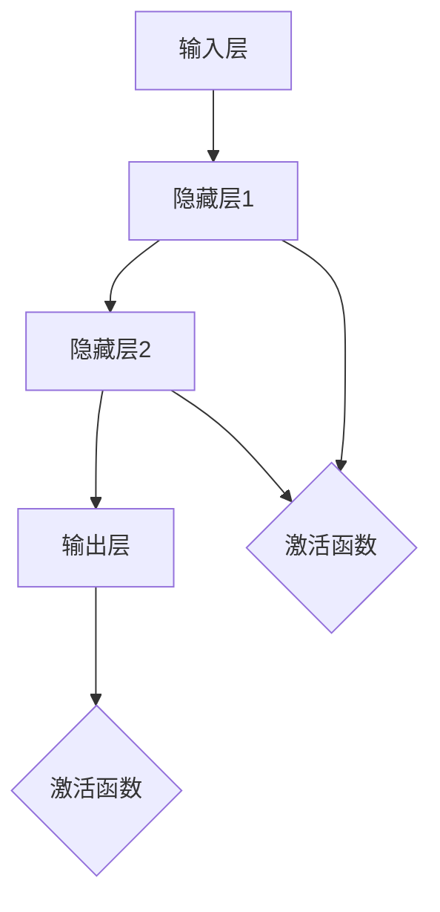

                 

  
关键词：神经网络、人工智能、深度学习、计算机视觉、自然语言处理、模型训练、反向传播、卷积神经网络（CNN）、递归神经网络（RNN）、生成对抗网络（GAN）

摘要：本文将探讨神经网络在人工智能领域的应用与发展，从基础概念、核心算法、数学模型、实际应用等多个角度，深入分析神经网络如何模拟人类智慧，推动人工智能技术的发展。通过详细的算法原理讲解和实际项目实践，本文旨在为读者提供一个全面了解神经网络的视角，同时展望其未来的发展趋势与挑战。

## 1. 背景介绍

神经网络（Neural Networks）是人工智能（Artificial Intelligence，AI）的核心组成部分之一。自20世纪80年代以来，随着计算机硬件性能的提升和算法研究的深入，神经网络在图像识别、语音识别、自然语言处理等多个领域取得了显著进展。特别是深度学习（Deep Learning）的兴起，使得神经网络在处理复杂数据和模式识别方面表现出了前所未有的能力。

神经网络的起源可以追溯到1943年，由心理学家McCulloch和数学家Pitts提出的神经计算模型。尽管早期神经网络的研究受到计算资源限制，但随着计算能力的提升，神经网络的研究和应用得到了快速发展。今天，神经网络已经成为人工智能领域不可或缺的技术手段。

## 2. 核心概念与联系

神经网络的核心概念是神经元（Neuron）。神经元是神经网络的基本单元，通过加权连接（Weights）与其他神经元进行信息传递。神经网络的结构通常由输入层（Input Layer）、隐藏层（Hidden Layers）和输出层（Output Layer）组成。每一层中的神经元都通过激活函数（Activation Function）进行处理。

下面是神经网络的Mermaid流程图：



### 2.1 神经元的工作原理

神经元通过加权连接接收来自前一层神经元的输入信号，并通过激活函数进行处理。激活函数的选择对神经网络的性能有重要影响。常见的激活函数包括Sigmoid、ReLU和Tanh等。

### 2.2 神经网络的结构

神经网络的结构可以根据应用需求进行设计。常见的结构包括卷积神经网络（CNN）、递归神经网络（RNN）和生成对抗网络（GAN）等。每种结构都有其独特的特点和适用场景。

## 3. 核心算法原理 & 具体操作步骤

### 3.1 算法原理概述

神经网络的训练过程本质上是一个优化问题，目标是找到一组最优的权重和偏置，使得网络的输出尽可能接近真实值。反向传播（Backpropagation）算法是实现这一目标的关键。

### 3.2 算法步骤详解

#### 3.2.1 前向传播（Forward Propagation）

1. 初始化网络参数（权重和偏置）。
2. 计算输入层到隐藏层的输出。
3. 通过激活函数处理隐藏层输出。
4. 计算隐藏层到输出层的输出。

#### 3.2.2 反向传播（Backpropagation）

1. 计算输出误差（Output Error）。
2. 通过链式法则计算误差关于每个参数的梯度。
3. 使用梯度下降（Gradient Descent）或其他优化算法更新参数。

#### 3.2.3 梯度下降（Gradient Descent）

1. 计算损失函数关于每个参数的梯度。
2. 沿着梯度的反方向更新参数。

### 3.3 算法优缺点

#### 优点：

- 强大的自适应能力，能够自动学习数据特征。
- 能够处理非线性问题。

#### 缺点：

- 训练过程耗时，特别是对于大型网络。
- 容易过拟合。

### 3.4 算法应用领域

神经网络在计算机视觉、自然语言处理、语音识别、推荐系统等领域都有广泛应用。例如，在图像识别任务中，卷积神经网络（CNN）表现出了优越的性能；在序列建模任务中，递归神经网络（RNN）和长短期记忆网络（LSTM）被广泛应用。

## 4. 数学模型和公式 & 详细讲解 & 举例说明

### 4.1 数学模型构建

神经网络的数学模型基于线性代数和概率统计。网络的输入层接收外部输入数据，隐藏层和输出层通过非线性变换进行特征提取和决策。

### 4.2 公式推导过程

神经网络的核心公式包括：

1. 前向传播公式：
   \[ a_{l}^{(i)} = \sigma(z_{l}^{(i)}) \]
   \[ z_{l}^{(i)} = \sum_{j=0}^{n_{l-1}} w_{l,j}^{(i)} a_{l-1}^{(j)} + b_{l}^{(i)} \]

2. 反向传播公式：
   \[ \delta_{l}^{(i)} = \frac{\partial C}{\partial z_{l}^{(i)}} \]
   \[ \frac{\partial C}{\partial w_{l,j}^{(i)}} = \delta_{l}^{(i)} a_{l-1}^{(j)} \]
   \[ \frac{\partial C}{\partial b_{l}^{(i)}} = \delta_{l}^{(i)} \]

### 4.3 案例分析与讲解

假设我们有一个简单的神经网络，输入层有3个神经元，隐藏层有2个神经元，输出层有1个神经元。训练数据集包含100个样本，每个样本有3个特征。目标是对每个样本进行分类，输出为0或1。

1. 初始化参数。
2. 前向传播：计算输入层到隐藏层的输出，隐藏层到输出层的输出。
3. 计算损失函数。
4. 反向传播：计算输出误差，通过链式法则计算误差关于每个参数的梯度。
5. 更新参数。

通过多次迭代训练，神经网络的输出误差会逐渐减小，最终达到训练目标。

## 5. 项目实践：代码实例和详细解释说明

### 5.1 开发环境搭建

在本项目中，我们使用Python编程语言和TensorFlow框架来构建神经网络。

### 5.2 源代码详细实现

```python
import tensorflow as tf
import numpy as np

# 初始化参数
input_size = 3
hidden_size = 2
output_size = 1

weights = {
    'hidden': tf.Variable(tf.random.normal([input_size, hidden_size])),
    'output': tf.Variable(tf.random.normal([hidden_size, output_size]))
}
biases = {
    'hidden': tf.Variable(tf.random.normal([hidden_size])),
    'output': tf.Variable(tf.random.normal([output_size]))
}

# 前向传播
def forward_propagation(x):
    hidden layer = tf.nn.relu(tf.matmul(x, weights['hidden']) + biases['hidden'])
    output layer = tf.matmul(hidden layer, weights['output']) + biases['output']
    return output layer

# 反向传播
def backward_propagation(x, y):
    with tf.GradientTape() as tape:
        output = forward_propagation(x)
        loss = tf.reduce_mean(tf.square(output - y))
    gradients = tape.gradient(loss, [weights['hidden'], weights['output'], biases['hidden'], biases['output']])
    return gradients

# 训练
for epoch in range(num_epochs):
    for x, y in training_data:
        gradients = backward_propagation(x, y)
        weights['hidden'].assign_sub(gradients[0])
        weights['output'].assign_sub(gradients[1])
        biases['hidden'].assign_sub(gradients[2])
        biases['output'].assign_sub(gradients[3])

# 测试
test_loss = backward_propagation(test_data[0], test_data[1])
print(f"Test Loss: {test_loss}")
```

### 5.3 代码解读与分析

1. 初始化参数：定义输入层、隐藏层和输出层的维度，并初始化权重和偏置。
2. 前向传播：实现神经网络的前向传播过程，包括输入层到隐藏层和隐藏层到输出层的计算。
3. 反向传播：实现神经网络的反向传播过程，计算误差关于每个参数的梯度。
4. 训练：通过多次迭代训练，使用梯度下降算法更新参数。
5. 测试：在测试数据集上评估模型的性能。

## 6. 实际应用场景

神经网络在多个实际应用场景中发挥了重要作用。以下是一些典型的应用领域：

- **计算机视觉**：用于图像分类、目标检测、人脸识别等。
- **自然语言处理**：用于文本分类、机器翻译、情感分析等。
- **语音识别**：用于语音识别、语音合成等。
- **推荐系统**：用于商品推荐、广告投放等。

## 7. 工具和资源推荐

### 7.1 学习资源推荐

- **书籍**：《深度学习》（Goodfellow, Bengio, Courville著）、《神经网络与深度学习》（邱锡鹏著）。
- **在线课程**：Coursera上的“深度学习”课程、Udacity的“深度学习工程师”纳米学位。

### 7.2 开发工具推荐

- **框架**：TensorFlow、PyTorch、Keras。
- **环境**：Google Colab、Jupyter Notebook。

### 7.3 相关论文推荐

- **神经网络基础**：Error-Correcting Output Coding and Backpropagation Training: Cover's "Neural Networks and the Bias-Variance Dilemma" (1991)。
- **深度学习**：AlexNet、ResNet、Transformer。

## 8. 总结：未来发展趋势与挑战

### 8.1 研究成果总结

神经网络在图像识别、自然语言处理、语音识别等领域取得了显著成果。深度学习框架如TensorFlow和PyTorch推动了神经网络的普及和应用。

### 8.2 未来发展趋势

- **硬件优化**：GPU、TPU等专用硬件将进一步加速神经网络训练。
- **算法改进**：混合模型、自监督学习等新型算法将提升神经网络性能。

### 8.3 面临的挑战

- **数据隐私**：如何保护训练数据隐私是一个重要挑战。
- **计算资源**：大型网络的训练需要大量计算资源。

### 8.4 研究展望

神经网络将继续在人工智能领域发挥重要作用，未来有望在无人驾驶、智能医疗、智能家居等领域取得突破。

## 9. 附录：常见问题与解答

### Q: 神经网络训练过程中如何避免过拟合？

A: 可以采用以下方法：

- **正则化**：添加L1或L2正则化项。
- **Dropout**：在训练过程中随机丢弃部分神经元。
- **数据增强**：对训练数据进行变换，增加数据多样性。

### Q: 如何评估神经网络的性能？

A: 可以使用以下指标：

- **准确率**：分类任务中正确预测的比例。
- **召回率**：召回实际为正类的预测比例。
- **F1 分数**：准确率和召回率的调和平均值。
- **损失函数**：如交叉熵损失函数、均方误差损失函数。

### Q: 如何调整神经网络参数？

A: 可以使用以下方法：

- **梯度下降**：根据梯度方向更新参数。
- **随机梯度下降**：对每个样本计算梯度，更新参数。
- **Adam优化器**：结合了动量项和自适应学习率。

通过本文的探讨，我们希望能帮助读者全面了解神经网络的核心概念、算法原理和实际应用。随着人工智能技术的不断发展，神经网络将在更多领域发挥重要作用，推动人类智慧的延伸。

## 作者署名

作者：禅与计算机程序设计艺术 / Zen and the Art of Computer Programming
```css
<!-- 以下是文章末尾的 Markdown 格式代码，请将整段代码复制到您的文章末尾 -->

---
作者：禅与计算机程序设计艺术 / Zen and the Art of Computer Programming
---

<!-- 请在此处将本文的 Markdown 格式代码复制粘贴，确保内容完整并遵循之前定义的格式和要求。文章内容结束后，添加作者署名，然后结束整个 Markdown 文档。 -->

