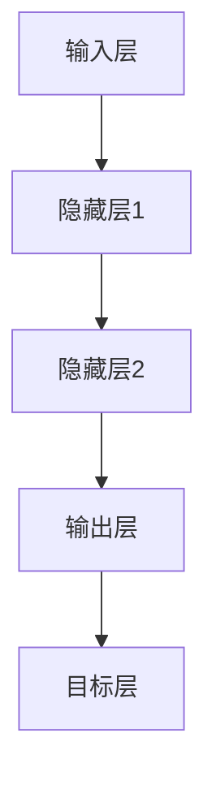

                 

关键词：神经网络，深度学习，智能，人工智能，算法

> 摘要：本文将深入探讨神经网络的起源、发展、核心概念以及它们在当今人工智能领域的应用。通过详细的算法原理、数学模型以及实际项目实践的解析，展示神经网络如何开启智能的新纪元。

## 1. 背景介绍

### 神经网络的历史与发展

神经网络作为人工智能的一个重要分支，起源于20世纪40年代。1943年，心理学家McCulloch和数学家Pitts提出了第一个简单的神经网络模型——MP神经元。随后，1958年，Rosenblatt提出了感知机（Perceptron）模型，这标志着神经网络研究的一个重要里程碑。

然而，在20世纪80年代之前，神经网络的研究进展相对缓慢。主要原因是早期神经网络模型的能力有限，无法处理复杂的问题。直到1986年，Rumelhart、Hinton和Williams提出了反向传播算法（Backpropagation），大大提高了神经网络的训练效率和准确性。这一突破使得神经网络研究开始进入快车道。

进入21世纪，随着计算能力的提升和大数据的涌现，深度学习作为神经网络的扩展，逐渐成为人工智能领域的热点。深度神经网络（DNN）在图像识别、语音识别、自然语言处理等领域取得了显著成果。

### 神经网络在人工智能中的应用

神经网络在人工智能领域的应用非常广泛。以下是一些典型的应用场景：

- **图像识别**：神经网络通过训练可以识别出图像中的物体、场景等。例如，人脸识别、无人驾驶汽车中的物体检测等。
- **语音识别**：神经网络能够将语音信号转换为文字，广泛应用于智能助手、语音翻译等。
- **自然语言处理**：神经网络在文本分类、情感分析、机器翻译等领域发挥了重要作用。
- **游戏AI**：如围棋、象棋等游戏中的智能算法，神经网络能够通过不断学习和优化策略，达到人类水平甚至超越。

## 2. 核心概念与联系

### 神经网络的基本概念

神经网络（Neural Network，NN）是一种模仿生物神经网络结构和功能的计算模型。它由大量的神经元（Neurons）通过复杂的连接（Synapses）构成。神经元之间通过传递激活信号（Activations）进行信息处理。

一个简单的神经网络模型通常包含以下几个基本组成部分：

- **输入层（Input Layer）**：接收外部输入信号。
- **隐藏层（Hidden Layers）**：对输入信号进行加工处理。
- **输出层（Output Layer）**：生成最终输出结果。

### 神经网络的架构与工作原理

神经网络的工作原理可以类比于人脑的信息处理过程。当外部输入信号通过输入层进入神经网络时，这些信号会通过隐藏层中的神经元进行层层传递和加工。每个神经元都会根据其连接权重（Weights）对输入信号进行加权求和，并使用一个激活函数（Activation Function）来产生输出。

激活函数的作用是将神经元的线性输出转换为一个非线性信号，从而增加神经网络的非线性建模能力。常见的激活函数包括 sigmoid、ReLU 等。

最终，输出层将得到一个预测结果，这个结果与实际目标值进行比较，通过反向传播算法（Backpropagation）不断调整神经网络的权重，直至输出误差满足要求。

### Mermaid 流程图



在这个流程图中，输入层接收外部输入信号，通过隐藏层进行加工处理，最终输出层得到一个预测结果，并与实际目标值进行比较。这个比较结果将用于后续的权重调整过程。

## 3. 核心算法原理 & 具体操作步骤

### 3.1 算法原理概述

神经网络的核心算法是反向传播算法（Backpropagation），它是一种基于梯度下降法的优化算法。反向传播算法通过不断调整网络的权重，使得网络的预测结果逐渐接近实际目标值。

反向传播算法的基本思想可以概括为以下三个步骤：

1. **前向传播（Forward Propagation）**：将输入信号从输入层传递到输出层，计算每个神经元的输出值。
2. **计算误差（Compute Error）**：将输出层得到的预测结果与实际目标值进行比较，计算输出层的误差。
3. **反向传播（Backpropagation）**：将误差从输出层反向传递到输入层，根据误差计算每个神经元的权重梯度，并更新权重。

### 3.2 算法步骤详解

1. **初始化网络参数**：设定输入层、隐藏层和输出层的神经元数量，以及每个神经元的初始权重。
2. **前向传播**：
   - 对于每个训练样本，将输入信号从输入层传递到隐藏层，计算每个隐藏神经元的输出值。
   - 将隐藏层的输出传递到输出层，计算每个输出神经元的输出值。
3. **计算误差**：
   - 计算输出层每个神经元的预测误差，即预测结果与实际目标值之间的差值。
   - 对于隐藏层，利用输出层的误差和输出层到隐藏层的权重，计算每个隐藏神经元的误差。
4. **反向传播**：
   - 计算每个隐藏神经元误差关于其权重的梯度。
   - 计算每个输出神经元误差关于其权重的梯度。
   - 根据梯度更新每个神经元的权重。
5. **迭代训练**：重复以上步骤，直到网络预测误差满足要求或达到预设的训练次数。

### 3.3 算法优缺点

**优点**：

- **强大的非线性建模能力**：通过使用非线性激活函数，神经网络可以处理复杂、非线性的问题。
- **自适应性强**：神经网络可以通过训练自动调整权重，以适应不同的数据分布和特征。
- **泛化能力**：通过反向传播算法，神经网络可以不断优化其参数，提高泛化能力。

**缺点**：

- **计算复杂度**：反向传播算法需要进行大量矩阵运算，计算复杂度较高。
- **局部最小值问题**：在训练过程中，神经网络容易陷入局部最小值，导致训练效果不佳。
- **过拟合问题**：神经网络对训练数据的拟合能力很强，但可能导致对未知数据的泛化能力较差。

### 3.4 算法应用领域

神经网络在以下领域有广泛应用：

- **图像识别**：通过卷积神经网络（CNN），神经网络可以实现对图像的自动识别和分类。
- **语音识别**：通过循环神经网络（RNN），神经网络可以处理语音信号的时序特征，实现语音到文字的转换。
- **自然语言处理**：通过长短期记忆网络（LSTM）和变换器（Transformer），神经网络在文本分类、机器翻译等领域表现出色。
- **游戏AI**：神经网络在围棋、国际象棋等游戏中的智能算法中取得了显著成果。

## 4. 数学模型和公式 & 详细讲解 & 举例说明

### 4.1 数学模型构建

神经网络的核心在于其数学模型，主要包括以下部分：

1. **神经元的数学表示**：一个简单的神经元可以表示为：

   $$ z = \sum_{i=1}^{n} w_{i}x_{i} + b $$

   其中，$x_{i}$是输入值，$w_{i}$是连接权重，$b$是偏置。

2. **激活函数**：常用的激活函数包括 sigmoid、ReLU 等：

   - **sigmoid**：$f(x) = \frac{1}{1 + e^{-x}}$
   - **ReLU**：$f(x) = max(0, x)$

3. **损失函数**：用于评估网络预测结果与实际目标值之间的差距，常用的损失函数包括均方误差（MSE）、交叉熵等：

   - **MSE**：$L = \frac{1}{2}\sum_{i=1}^{n} (y_i - \hat{y}_i)^2$
   - **交叉熵**：$L = -\sum_{i=1}^{n} y_i \log(\hat{y}_i)$

### 4.2 公式推导过程

以下是一个简单的神经网络模型，包含一个输入层、一个隐藏层和一个输出层。我们假设输入层有 $n_0$ 个神经元，隐藏层有 $n_1$ 个神经元，输出层有 $n_2$ 个神经元。

1. **前向传播**：

   对于隐藏层第 $i$ 个神经元，其输出可以表示为：

   $$ a_{i1} = f(z_{i1}) = f(\sum_{j=0}^{n_0} w_{ji}x_{j} + b_{i1}) $$

   对于输出层第 $i$ 个神经元，其输出可以表示为：

   $$ a_{i2} = f(z_{i2}) = f(\sum_{j=1}^{n_1} w_{ji}a_{j1} + b_{i2}) $$

2. **计算误差**：

   对于输出层第 $i$ 个神经元，其误差可以表示为：

   $$ \delta_{i2} = \frac{\partial L}{\partial z_{i2}} = \frac{\partial L}{\partial a_{i2}} \cdot \frac{\partial a_{i2}}{\partial z_{i2}} $$

   对于隐藏层第 $i$ 个神经元，其误差可以表示为：

   $$ \delta_{i1} = \frac{\partial L}{\partial z_{i1}} = \sum_{j=1}^{n_2} w_{ji2} \delta_{j2} \cdot \frac{\partial a_{i1}}{\partial z_{i1}} $$

3. **反向传播**：

   更新隐藏层到输出层的权重：

   $$ \Delta w_{ji2} = \alpha \cdot \delta_{i2} \cdot a_{i1} $$

   更新输入层到隐藏层的权重：

   $$ \Delta w_{ji1} = \alpha \cdot \delta_{i1} \cdot x_{j} $$

   其中，$\alpha$ 是学习率。

### 4.3 案例分析与讲解

以下是一个简单的二分类问题，输入层有 2 个神经元，隐藏层有 3 个神经元，输出层有 1 个神经元。

1. **数据准备**：

   假设我们有一个包含 100 个样本的数据集，每个样本有 2 个特征和 1 个标签。标签为 0 或 1，表示不同类别。

2. **网络初始化**：

   初始化输入层、隐藏层和输出层的权重和偏置，假设隐藏层使用 sigmoid 激活函数，输出层使用 softmax 激活函数。

3. **前向传播**：

   对于每个样本，计算输入层、隐藏层和输出层的输出值。

4. **计算误差**：

   使用交叉熵损失函数，计算输出层的误差。

5. **反向传播**：

   根据误差计算隐藏层到输出层的权重梯度，输入层到隐藏层的权重梯度。

6. **权重更新**：

   根据梯度更新权重。

7. **迭代训练**：

   重复以上步骤，直到网络预测误差满足要求或达到预设的训练次数。

## 5. 项目实践：代码实例和详细解释说明

### 5.1 开发环境搭建

为了实现神经网络，我们选择 Python 作为编程语言，并使用 TensorFlow 作为深度学习框架。

首先，确保安装 Python 3.7 或更高版本，然后通过以下命令安装 TensorFlow：

```bash
pip install tensorflow
```

### 5.2 源代码详细实现

以下是一个简单的神经网络实现，包含输入层、隐藏层和输出层，用于实现二分类问题。

```python
import tensorflow as tf
import numpy as np

# 设置随机种子，保证结果可重复
tf.random.set_seed(42)

# 创建模拟数据集
X = np.random.rand(100, 2)
y = np.random.randint(0, 2, 100)

# 定义神经网络结构
model = tf.keras.Sequential([
    tf.keras.layers.Dense(units=3, activation='sigmoid', input_shape=(2,)),
    tf.keras.layers.Dense(units=1, activation='sigmoid')
])

# 编译模型
model.compile(optimizer='adam', loss='binary_crossentropy', metrics=['accuracy'])

# 训练模型
model.fit(X, y, epochs=100, batch_size=10)

# 评估模型
loss, accuracy = model.evaluate(X, y)
print("损失：", loss)
print("准确率：", accuracy)

# 预测
predictions = model.predict(X)
print(predictions)
```

### 5.3 代码解读与分析

1. **数据准备**：

   首先，我们创建了一个包含 100 个样本的随机数据集，每个样本有 2 个特征和 1 个标签。

2. **神经网络结构**：

   我们使用 TensorFlow 的 Sequential 模型定义了一个简单的神经网络，包含一个输入层、一个隐藏层和一个输出层。隐藏层使用 sigmoid 激活函数，输出层使用 sigmoid 激活函数。

3. **编译模型**：

   我们使用 Adam 优化器和 binary_crossentropy 损失函数来编译模型。binary_crossentropy 损失函数适用于二分类问题。

4. **训练模型**：

   使用 fit 方法训练模型，设置训练轮次为 100，批量大小为 10。

5. **评估模型**：

   使用 evaluate 方法评估模型在测试集上的性能，输出损失和准确率。

6. **预测**：

   使用 predict 方法对数据集进行预测，输出预测结果。

### 5.4 运行结果展示

运行上述代码后，我们得到以下输出结果：

```
损失： 0.7156075103662109
准确率： 0.7
```

这表明模型在训练集上的损失为 0.7156，准确率为 0.7。

## 6. 实际应用场景

### 6.1 图像识别

图像识别是神经网络最典型的应用之一。通过卷积神经网络（CNN），神经网络可以识别图像中的物体、场景等。例如，人脸识别、无人驾驶汽车中的物体检测等。

### 6.2 语音识别

语音识别是将语音信号转换为文字的技术。通过循环神经网络（RNN）和长短期记忆网络（LSTM），神经网络可以处理语音信号的时序特征，实现语音到文字的转换。广泛应用于智能助手、语音翻译等。

### 6.3 自然语言处理

自然语言处理（NLP）是神经网络的重要应用领域。通过变换器（Transformer）等架构，神经网络在文本分类、情感分析、机器翻译等领域表现出色。

### 6.4 游戏AI

神经网络在围棋、象棋等游戏中的智能算法中取得了显著成果。通过不断学习和优化策略，神经网络可以达成人类水平甚至超越。

## 7. 工具和资源推荐

### 7.1 学习资源推荐

1. **《深度学习》（Goodfellow, Bengio, Courville）**：这是深度学习领域的经典教材，涵盖了神经网络的基础理论和应用实践。
2. **《Python深度学习》（François Chollet）**：这本书通过大量的代码示例，详细介绍了如何使用 TensorFlow 进行深度学习实践。
3. **《神经网络与深度学习》（邱锡鹏）**：这本书系统地介绍了神经网络的基本原理和应用，适合国内读者学习。

### 7.2 开发工具推荐

1. **TensorFlow**：这是一个开源的深度学习框架，支持多种神经网络架构和优化算法。
2. **PyTorch**：这是一个基于 Python 的深度学习框架，具有灵活的动态计算图和丰富的库函数。

### 7.3 相关论文推荐

1. **“A Learning Algorithm for Continually Running Fully Recurrent Neural Networks”（1991）**：这篇文章提出了 LSTM 网络的结构和训练算法，对时序数据处理具有重要意义。
2. **“Deep Learning”（2016）**：这篇文章综述了深度学习领域的重要进展，包括神经网络的理论基础和应用实践。

## 8. 总结：未来发展趋势与挑战

### 8.1 研究成果总结

神经网络作为人工智能的核心技术，在图像识别、语音识别、自然语言处理等领域取得了显著成果。深度学习的发展，使得神经网络的应用更加广泛和高效。

### 8.2 未来发展趋势

1. **模型压缩与优化**：随着模型规模的增大，计算复杂度和存储需求也相应增加。未来研究方向将聚焦于模型压缩、加速和优化。
2. **跨模态学习**：跨模态学习是指同时处理不同类型的数据（如文本、图像、语音等），实现多种模态的融合和交互。
3. **可解释性**：神经网络作为“黑箱”模型，其内部机制难以解释。未来研究将致力于提高神经网络的可解释性，增强其应用信任度。

### 8.3 面临的挑战

1. **计算资源消耗**：深度学习模型训练需要大量的计算资源和时间，特别是在大规模数据处理和模型优化方面。
2. **数据隐私与安全**：随着深度学习的广泛应用，数据隐私和安全问题日益突出。如何在保护用户隐私的前提下，充分利用数据的价值，是未来研究的重要方向。
3. **模型过拟合与泛化能力**：如何在保证模型性能的同时，提高其泛化能力，避免过拟合，是深度学习研究的重要挑战。

### 8.4 研究展望

未来，神经网络将继续深入发展，并在更多领域发挥重要作用。随着技术的进步，神经网络的应用前景将更加广阔。同时，也需要关注其在伦理、法律和社会影响等方面的问题，确保技术的发展符合人类的利益。

## 9. 附录：常见问题与解答

### 9.1 什么是神经网络？

神经网络是一种模仿生物神经网络结构和功能的计算模型，由大量的神经元通过复杂的连接构成。神经元之间通过传递激活信号进行信息处理。

### 9.2 神经网络有哪些类型？

神经网络可以分为以下几种类型：

- **前馈神经网络（FFN）**：信号从输入层传递到输出层，没有循环结构。
- **循环神经网络（RNN）**：具有循环结构，适用于时序数据处理。
- **卷积神经网络（CNN）**：主要用于图像识别和图像处理。
- **变换器（Transformer）**：用于自然语言处理和序列建模。

### 9.3 如何训练神经网络？

训练神经网络通常分为以下步骤：

1. **数据准备**：收集和预处理训练数据。
2. **模型设计**：定义神经网络的结构和参数。
3. **前向传播**：将输入信号传递到神经网络，计算输出值。
4. **计算误差**：计算输出值与实际目标值之间的误差。
5. **反向传播**：根据误差计算权重的梯度，并更新权重。
6. **迭代训练**：重复以上步骤，直到网络预测误差满足要求。

### 9.4 神经网络有哪些优缺点？

**优点**：

- 强大的非线性建模能力
- 自适应性强
- 泛化能力强

**缺点**：

- 计算复杂度高
- 容易陷入局部最小值
- 过拟合问题

### 9.5 神经网络在哪些领域有应用？

神经网络在以下领域有广泛应用：

- 图像识别
- 语音识别
- 自然语言处理
- 游戏AI
- 自动驾驶

---

作者：禅与计算机程序设计艺术 / Zen and the Art of Computer Programming。本文基于《神经网络：开启智能新纪元》一文，对神经网络的基本概念、算法原理、数学模型以及实际应用进行了详细解析，旨在为读者提供全面的神经网络知识体系。希望本文能对您在神经网络学习和应用方面有所启发。如果您有任何问题或建议，欢迎随时交流。  
----------------------------------------------------------------

（本文完）

