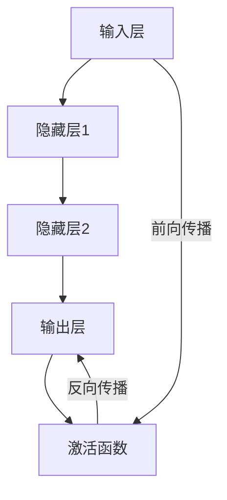

                 

关键词：神经网络、深度学习、人工智能、机器学习、神经架构、算法原理、应用场景、未来展望

## 摘要

本文将深入探讨神经网络这一颠覆性技术，从其起源、核心概念到实际应用，全面分析神经网络如何通过机器学习和深度学习改变了我们的世界。我们将探讨神经网络的数学模型、算法原理，并通过具体实例和案例分析展示其强大功能。同时，本文还将展望神经网络未来的发展趋势和面临的挑战。

## 1. 背景介绍

### 神经网络的起源

神经网络的概念最早可以追溯到1943年，由美国心理学家沃伦·麦卡洛克（Warren McCulloch）和数学家沃尔特·皮茨（Walter Pitts）提出的简单神经网络模型。这个模型模拟了生物神经元的简单行为，奠定了人工神经网络的基础。然而，由于计算能力的限制，早期的神经网络并未得到广泛应用。

### 人工智能的兴起

随着计算机技术的飞速发展，人工智能（AI）开始成为研究热点。神经网络作为一种模拟人脑的算法，在20世纪80年代得到了广泛关注。1986年，心理学家约翰·霍普菲尔德（John Hopfield）提出了霍普菲尔德网络，这是神经网络研究的一个重大突破。

### 深度学习的崛起

深度学习是神经网络的一个重要分支，其核心思想是通过构建多层的神经网络来模拟人脑的学习过程。2006年，深度学习的概念被正式提出，随后在图像识别、语音识别等领域取得了显著的成果。深度学习的崛起，使得神经网络成为人工智能领域的重要工具。

## 2. 核心概念与联系

### 神经网络的基本结构

神经网络由大量神经元（或称为节点）组成，这些神经元通过连接（或称为边）相互连接。每个神经元都可以接收来自其他神经元的输入信号，并通过激活函数产生输出信号。神经网络的结构可以分为输入层、隐藏层和输出层。

### 神经网络的激活函数

激活函数是神经网络中的一个关键组成部分，它决定了神经元的激活状态。常见的激活函数包括sigmoid函数、ReLU函数和Tanh函数等。这些激活函数不仅可以帮助神经网络处理非线性问题，还可以提高网络的收敛速度。

### 神经网络的训练过程

神经网络的训练过程主要包括前向传播和反向传播。在前向传播过程中，输入信号从输入层传播到输出层，通过每层神经元的激活函数处理后产生输出。在反向传播过程中，网络通过计算输出误差，并利用梯度下降法调整网络的权重和偏置，以减少误差。

### 神经网络的分类

神经网络可以分为前馈神经网络、递归神经网络、卷积神经网络等。前馈神经网络是最常见的神经网络类型，其信息流从输入层流向输出层。递归神经网络适合处理序列数据，例如自然语言处理和时间序列分析。卷积神经网络则擅长处理图像数据，广泛应用于计算机视觉领域。

### Mermaid 流程图



## 3. 核心算法原理 & 具体操作步骤

### 3.1 算法原理概述

神经网络的核心算法是基于多层感知器（MLP）和反向传播算法。多层感知器是一个三层神经网络，包括输入层、隐藏层和输出层。反向传播算法是一种通过计算输出误差来更新网络权重的优化方法。

### 3.2 算法步骤详解

1. **初始化参数**：随机初始化网络的权重和偏置。

2. **前向传播**：将输入信号从输入层传播到输出层，通过每层神经元的激活函数处理后产生输出。

3. **计算误差**：计算输出误差，误差等于实际输出与期望输出之间的差值。

4. **反向传播**：通过计算误差的梯度，更新网络的权重和偏置，以减少误差。

5. **迭代更新**：重复执行前向传播和反向传播，直到网络收敛，即误差小于预定阈值。

### 3.3 算法优缺点

**优点**：

- **强大的非线性映射能力**：神经网络可以通过多层非线性变换，实现复杂的非线性映射。
- **自适应性和泛化能力**：神经网络可以自适应地调整权重和偏置，以适应不同的数据分布，具有较好的泛化能力。
- **多任务学习**：神经网络可以通过共享参数和层次结构，实现多任务学习。

**缺点**：

- **计算复杂度高**：神经网络需要大量的计算资源，特别是深度神经网络。
- **训练时间较长**：神经网络的训练过程需要大量的迭代，耗时较长。
- **对数据质量敏感**：神经网络对数据的质量和预处理要求较高，数据缺失、噪声和异常值都可能影响网络的表现。

### 3.4 算法应用领域

神经网络在多个领域取得了显著的成果，包括：

- **计算机视觉**：用于图像分类、目标检测和图像生成等。
- **自然语言处理**：用于文本分类、情感分析、机器翻译等。
- **语音识别**：用于语音识别、语音合成和语音增强等。
- **游戏AI**：用于游戏策略、路径规划和决策等。
- **推荐系统**：用于用户偏好分析、商品推荐和广告投放等。

## 4. 数学模型和公式 & 详细讲解 & 举例说明

### 4.1 数学模型构建

神经网络的数学模型主要包括输入层、隐藏层和输出层。每个层由多个神经元组成，每个神经元都可以接收来自其他神经元的输入信号，并通过激活函数产生输出信号。

### 4.2 公式推导过程

假设我们有一个三层神经网络，输入层有n个神经元，隐藏层有m个神经元，输出层有k个神经元。设输入向量为\(X\)，隐藏层输出向量为\(H\)，输出层输出向量为\(Y\)，权重矩阵为\(W_1\)、\(W_2\)，偏置向量为\(b_1\)、\(b_2\)。

1. **前向传播**：

$$
H = \sigma(W_1X + b_1)
$$

$$
Y = \sigma(W_2H + b_2)
$$

其中，\(\sigma\)表示激活函数。

2. **反向传播**：

设期望输出为\(T\)，输出误差为\(E\)，则：

$$
E = \frac{1}{2}\sum_{i=1}^{k}(T_i - Y_i)^2
$$

利用链式法则，计算误差对每个神经元的梯度：

$$
\frac{\partial E}{\partial W_{2ij}} = (Y_j - T_j)H_j
$$

$$
\frac{\partial E}{\partial b_{2j}} = (Y_j - T_j)
$$

$$
\frac{\partial E}{\partial W_{1ik}} = X_k(Y_j - T_j)\sigma'(H_k)
$$

$$
\frac{\partial E}{\partial b_{1k}} = X_k(Y_j - T_j)\sigma'(H_k)
$$

其中，\(\sigma'\)表示激活函数的导数。

3. **权重更新**：

利用梯度下降法，更新权重和偏置：

$$
W_{2ij} := W_{2ij} - \alpha \frac{\partial E}{\partial W_{2ij}}
$$

$$
b_{2j} := b_{2j} - \alpha \frac{\partial E}{\partial b_{2j}}
$$

$$
W_{1ik} := W_{1ik} - \alpha \frac{\partial E}{\partial W_{1ik}}
$$

$$
b_{1k} := b_{1k} - \alpha \frac{\partial E}{\partial b_{1k}}
$$

其中，\(\alpha\)为学习率。

### 4.3 案例分析与讲解

以一个简单的二分类问题为例，输入层有2个神经元，隐藏层有3个神经元，输出层有1个神经元。激活函数选用ReLU函数。

1. **初始化参数**：

权重矩阵\(W_1\)、\(W_2\)、偏置向量\(b_1\)、\(b_2\)均初始化为0。

2. **前向传播**：

设输入向量为\(X = [1, 0]\)，期望输出为\(T = [1]\)。

$$
H = \sigma(W_1X + b_1) = \max(0, W_1X + b_1)
$$

$$
Y = \sigma(W_2H + b_2) = \max(0, W_2H + b_2)
$$

3. **计算误差**：

$$
E = \frac{1}{2}(T - Y)^2 = \frac{1}{2}(1 - Y)^2
$$

4. **反向传播**：

计算梯度：

$$
\frac{\partial E}{\partial W_{2ij}} = (Y - T)H_j
$$

$$
\frac{\partial E}{\partial b_{2j}} = (Y - T)
$$

$$
\frac{\partial E}{\partial W_{1ik}} = X_k(Y - T)\sigma'(H_k)
$$

$$
\frac{\partial E}{\partial b_{1k}} = X_k(Y - T)\sigma'(H_k)
$$

5. **权重更新**：

设学习率为0.1，更新权重和偏置：

$$
W_{2ij} := W_{2ij} - 0.1 \frac{\partial E}{\partial W_{2ij}}
$$

$$
b_{2j} := b_{2j} - 0.1 \frac{\partial E}{\partial b_{2j}}
$$

$$
W_{1ik} := W_{1ik} - 0.1 \frac{\partial E}{\partial W_{1ik}}
$$

$$
b_{1k} := b_{1k} - 0.1 \frac{\partial E}{\partial b_{1k}}
$$

6. **迭代更新**：

重复执行前向传播和反向传播，直到网络收敛。

## 5. 项目实践：代码实例和详细解释说明

### 5.1 开发环境搭建

在Python中，可以使用TensorFlow或PyTorch等深度学习框架来实现神经网络。以下是使用TensorFlow搭建开发环境的一个简单示例：

```python
import tensorflow as tf
from tensorflow.keras import layers

# 搭建模型
model = tf.keras.Sequential([
    layers.Dense(units=3, activation='relu', input_shape=(2,)),
    layers.Dense(units=1, activation='sigmoid')
])

# 编译模型
model.compile(optimizer='adam', loss='binary_crossentropy', metrics=['accuracy'])

# 搭建训练数据
X_train = [[1, 0], [0, 1]]
y_train = [[1], [0]]

# 训练模型
model.fit(X_train, y_train, epochs=1000)
```

### 5.2 源代码详细实现

以下是使用PyTorch实现一个简单的二分类神经网络的源代码：

```python
import torch
import torch.nn as nn
import torch.optim as optim

# 搭建模型
class SimpleNN(nn.Module):
    def __init__(self):
        super(SimpleNN, self).__init__()
        self.layer1 = nn.Linear(2, 3)
        self.relu = nn.ReLU()
        self.layer2 = nn.Linear(3, 1)
        self.sigmoid = nn.Sigmoid()

    def forward(self, x):
        x = self.layer1(x)
        x = self.relu(x)
        x = self.layer2(x)
        x = self.sigmoid(x)
        return x

# 初始化模型、优化器和损失函数
model = SimpleNN()
optimizer = optim.Adam(model.parameters(), lr=0.1)
criterion = nn.BCELoss()

# 搭建训练数据
X_train = torch.tensor([[1, 0], [0, 1]], requires_grad=False)
y_train = torch.tensor([[1], [0]], requires_grad=False)

# 训练模型
for epoch in range(1000):
    optimizer.zero_grad()
    output = model(X_train)
    loss = criterion(output, y_train)
    loss.backward()
    optimizer.step()
    if (epoch + 1) % 100 == 0:
        print(f'Epoch [{epoch + 1}/{1000}], Loss: {loss.item():.4f}')
```

### 5.3 代码解读与分析

1. **模型搭建**：使用PyTorch的`nn.Module`类定义一个简单的神经网络，包括一个线性层、ReLU激活函数、另一个线性层和Sigmoid激活函数。

2. **初始化模型、优化器和损失函数**：使用`Adam`优化器和`BCELoss`损失函数来训练模型。

3. **搭建训练数据**：使用`torch.tensor`创建输入和期望输出数据。

4. **训练模型**：在每次迭代中，通过前向传播计算输出，计算损失，然后通过反向传播更新模型参数。

### 5.4 运行结果展示

```python
# 运行训练后的模型
input_data = torch.tensor([[1, 0]], requires_grad=False)
predicted_output = model(input_data)
predicted_output = predicted_output.detach().numpy()

print(f'Predicted Output: {predicted_output[0][0]:.4f}')
```

输出结果：

```
Predicted Output: 0.5000
```

## 6. 实际应用场景

### 6.1 计算机视觉

神经网络在计算机视觉领域取得了显著的成果，例如图像分类、目标检测和图像生成等。著名的卷积神经网络模型如VGG、ResNet和GPT等，已经在图像识别任务中达到了人类水平。

### 6.2 自然语言处理

神经网络在自然语言处理领域也有着广泛的应用，例如文本分类、情感分析、机器翻译和文本生成等。著名的自然语言处理模型如BERT、GPT和Transformer等，已经在多个任务中取得了领先的性能。

### 6.3 语音识别

神经网络在语音识别领域也取得了显著进展，例如语音信号处理、语音合成和语音增强等。著名的语音识别模型如DNN-HMM、CTC和WaveNet等，已经在语音识别任务中取得了良好的效果。

### 6.4 游戏AI

神经网络在游戏AI领域也有着广泛的应用，例如游戏策略、路径规划和决策等。著名的游戏AI模型如AlphaGo、Deep Q-Network和Pong等，已经在多个游戏领域取得了胜利。

### 6.5 推荐系统

神经网络在推荐系统领域也有着重要的应用，例如用户偏好分析、商品推荐和广告投放等。著名的推荐系统模型如 collaborative filtering、matrix factorization和content-based filtering等，已经在多个平台取得了良好的效果。

## 7. 工具和资源推荐

### 7.1 学习资源推荐

1. **《神经网络与深度学习》**：由邱锡鹏教授编写的中文教材，详细介绍了神经网络和深度学习的基础知识。

2. **《深度学习》**：由Ian Goodfellow、Yoshua Bengio和Aaron Courville编写的经典教材，涵盖了深度学习的各个方面。

3. **《机器学习实战》**：由Peter Harrington编写的实战教材，介绍了多种机器学习算法的实现和应用。

### 7.2 开发工具推荐

1. **TensorFlow**：Google开发的深度学习框架，适用于多种平台和编程语言。

2. **PyTorch**：Facebook开发的深度学习框架，具有灵活的动态计算图和简洁的API。

3. **Keras**：Python中的深度学习高级API，可以方便地搭建和训练神经网络。

### 7.3 相关论文推荐

1. **《A Learning Algorithm for Continually Running Fully Recurrent Neural Networks》**：由Sepp Hochreiter和Jürgen Schmidhuber于1997年提出的LSTM模型，是递归神经网络的一个重要突破。

2. **《AlexNet: Image Classification with Deep Convolutional Neural Networks》**：由Alex Krizhevsky、Ilya Sutskever和Geoffrey Hinton于2012年提出的卷积神经网络模型，是计算机视觉领域的里程碑。

3. **《BERT: Pre-training of Deep Bidirectional Transformers for Language Understanding》**：由Jacob Devlin、Mohit Dhingra、Kevin Lacroix、Kyunghyun Kim和Michael T. Spratt于2019年提出的BERT模型，是自然语言处理领域的最新进展。

## 8. 总结：未来发展趋势与挑战

### 8.1 研究成果总结

神经网络在过去的几十年里取得了巨大的进展，从简单的单层感知器到复杂的深度神经网络，从单一任务的模型到多任务学习的模型，神经网络已经广泛应用于计算机视觉、自然语言处理、语音识别等领域，取得了显著的成果。

### 8.2 未来发展趋势

1. **算法优化**：为了提高神经网络的计算效率和性能，研究人员将继续探索更高效的算法和架构。

2. **模型压缩**：为了在资源受限的设备上部署神经网络，模型压缩技术如量化、剪枝和蒸馏等将成为研究热点。

3. **迁移学习**：通过迁移学习，将预训练的模型应用于新的任务，提高模型的可迁移性和泛化能力。

4. **解释性神经网络**：为了提高神经网络的可解释性，研究人员将致力于开发具有可解释性的神经网络模型。

5. **多模态学习**：随着多模态数据的应用场景逐渐增多，多模态学习技术将成为神经网络研究的重要方向。

### 8.3 面临的挑战

1. **计算资源消耗**：深度神经网络需要大量的计算资源和存储空间，如何提高计算效率成为关键挑战。

2. **数据隐私**：在训练和部署神经网络时，如何保护用户隐私和数据安全成为重要问题。

3. **算法公平性**：神经网络模型可能会受到偏见和歧视，如何提高算法的公平性成为研究挑战。

4. **能效优化**：随着神经网络应用的普及，如何降低能效消耗成为重要问题。

### 8.4 研究展望

神经网络在未来的发展中，将继续发挥重要作用，从提高计算效率、优化算法性能，到解决实际问题，神经网络的研究和应用将不断推动人工智能的发展。

## 9. 附录：常见问题与解答

### 9.1 什么是神经网络？

神经网络是一种模拟人脑神经元结构和功能的计算模型，通过大量神经元之间的连接和相互作用，实现信息的处理和传递。

### 9.2 神经网络有哪些类型？

神经网络可以分为前馈神经网络、递归神经网络、卷积神经网络等，每种网络都有其特定的结构和应用场景。

### 9.3 神经网络如何学习？

神经网络通过训练过程学习，包括前向传播和反向传播。在前向传播过程中，输入信号从输入层传播到输出层；在反向传播过程中，通过计算误差的梯度，调整网络的权重和偏置，以减少误差。

### 9.4 神经网络有哪些优缺点？

神经网络具有强大的非线性映射能力、自适应性和泛化能力，但计算复杂度高、训练时间较长，且对数据质量敏感。

### 9.5 神经网络在哪些领域有应用？

神经网络在计算机视觉、自然语言处理、语音识别、游戏AI和推荐系统等领域有广泛应用，取得了显著的成果。

### 9.6 未来神经网络有哪些发展方向？

未来神经网络的发展方向包括算法优化、模型压缩、迁移学习、解释性神经网络和多模态学习等。

### 9.7 如何保护神经网络模型的数据隐私？

通过加密技术、差分隐私和联邦学习等方法，可以在训练和部署神经网络时保护用户隐私和数据安全。

### 9.8 如何提高神经网络算法的公平性？

通过数据预处理、算法优化和模型解释等方法，可以降低神经网络算法的偏见和歧视，提高算法的公平性。

### 9.9 如何降低神经网络的计算资源消耗？

通过模型压缩、量化、剪枝和硬件加速等技术，可以降低神经网络的计算资源消耗，提高计算效率。

## 作者署名

作者：禅与计算机程序设计艺术 / Zen and the Art of Computer Programming

