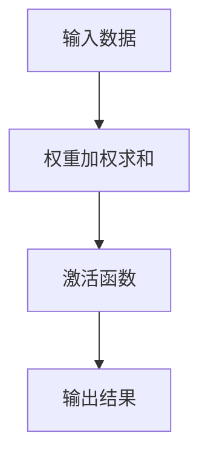
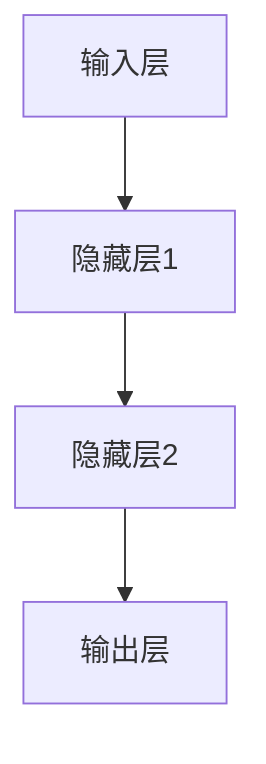
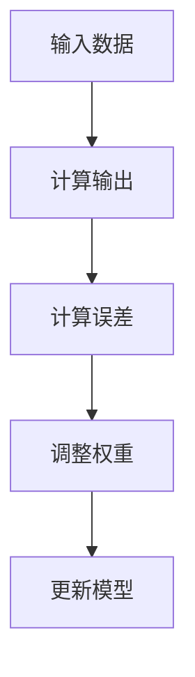

                 

关键词：神经网络，机器学习，人工智能，深度学习，算法原理，数学模型，项目实践

> 摘要：本文深入探讨了神经网络这一机器学习的重要分支，阐述了其基本概念、核心算法原理、数学模型以及在实际应用中的实践案例，旨在为读者提供一份全面而深入的神经网络学习指南。

## 1. 背景介绍

在计算机科学和人工智能领域，神经网络（Neural Networks）是一种模仿生物神经系统的计算模型。最早由心理学家和神经科学家提出，20世纪80年代随着计算机硬件的发展，神经网络研究逐渐成为人工智能领域的一个重要研究方向。神经网络通过模拟人脑神经元之间的连接和相互作用，实现对数据的处理和模式识别。

随着深度学习的兴起，神经网络在图像识别、语音识别、自然语言处理等领域取得了巨大的成功。如今，神经网络已经成为机器学习和人工智能的核心技术之一，广泛应用于各种复杂问题的求解。

## 2. 核心概念与联系

### 2.1 神经元模型

神经元是神经网络的基本计算单元，其结构简单，主要包括输入层、输出层以及一个激活函数。神经元之间的连接通过权重来表示，每个连接的权重代表神经元之间的强度。在神经元的计算过程中，输入数据通过连接权重加权求和，最后通过激活函数得到输出。

下面是神经元的 Mermaid 流程图：



### 2.2 神经网络结构

神经网络可以分为输入层、隐藏层和输出层。输入层接收外部数据，隐藏层进行数据的处理和特征提取，输出层产生最终的输出。每个隐藏层都可以包含多个神经元，层数和神经元数量可以根据具体问题进行调整。

下面是神经网络的 Mermaid 流程图：



### 2.3 神经网络的训练过程

神经网络的训练过程是不断调整神经元之间的权重，使其能够正确地处理和分类数据。这个过程通常通过梯度下降算法实现。在训练过程中，神经网络会根据输入数据和期望输出，计算实际输出与期望输出之间的误差，并使用这个误差来调整权重。

下面是神经网络的训练过程的 Mermaid 流程图：



## 3. 核心算法原理 & 具体操作步骤

### 3.1 算法原理概述

神经网络的核心算法是基于前向传播和反向传播。在前向传播过程中，输入数据通过神经网络的前向传递，经过各个隐藏层，最终得到输出。在反向传播过程中，根据输出误差，通过反向传递调整权重。

### 3.2 算法步骤详解

1. **初始化权重**：随机初始化神经网络中的权重。
2. **前向传播**：输入数据通过神经网络的前向传递，经过各个隐藏层，最终得到输出。
3. **计算误差**：计算实际输出与期望输出之间的误差。
4. **反向传播**：根据误差，通过反向传递调整权重。
5. **迭代训练**：重复执行前向传播和反向传播，直到网络收敛。

### 3.3 算法优缺点

**优点**：
- **自适应**：神经网络可以自动调整权重，以适应不同的数据分布。
- **泛化能力**：神经网络具有良好的泛化能力，可以处理复杂的非线性问题。
- **多任务学习**：神经网络可以同时处理多个任务。

**缺点**：
- **计算量大**：神经网络训练过程需要大量的计算资源。
- **参数调优困难**：神经网络参数的调优过程复杂，需要大量的实验和经验。

### 3.4 算法应用领域

神经网络在图像识别、语音识别、自然语言处理、推荐系统等领域有广泛的应用。例如，在图像识别领域，神经网络可以用于人脸识别、物体检测等；在语音识别领域，神经网络可以用于语音合成、语音识别等；在自然语言处理领域，神经网络可以用于文本分类、情感分析等。

## 4. 数学模型和公式 & 详细讲解 & 举例说明

### 4.1 数学模型构建

神经网络的数学模型主要包括输入层、隐藏层和输出层。输入层接收外部数据，隐藏层进行数据的处理和特征提取，输出层产生最终的输出。神经网络的数学模型可以用以下公式表示：

$$
z = \sum_{i=1}^{n} w_{i}x_{i} + b
$$

其中，$z$ 是神经元的输出，$w_{i}$ 是权重，$x_{i}$ 是输入数据，$b$ 是偏置。

### 4.2 公式推导过程

神经网络的训练过程是通过不断调整权重和偏置，使其能够正确地处理和分类数据。在训练过程中，我们使用梯度下降算法来更新权重和偏置。梯度下降算法的基本思想是，通过计算损失函数的梯度，来更新模型参数。

损失函数可以用以下公式表示：

$$
J(\theta) = \frac{1}{2m}\sum_{i=1}^{m}(h_{\theta}(x^{(i)}) - y^{(i)})^{2}
$$

其中，$J(\theta)$ 是损失函数，$h_{\theta}(x)$ 是神经网络的输出，$y^{(i)}$ 是期望输出。

### 4.3 案例分析与讲解

假设我们有一个简单的神经网络，包含一个输入层、一个隐藏层和一个输出层。输入层有3个神经元，隐藏层有4个神经元，输出层有2个神经元。输入数据为 $x = [1, 2, 3]$，期望输出为 $y = [0, 1]$。

首先，我们需要初始化权重和偏置。我们可以随机初始化权重和偏置，例如：

$$
w_{11} = 0.5, w_{12} = 0.3, w_{13} = 0.7, w_{21} = 0.6, w_{22} = 0.4, w_{23} = 0.8
$$

$$
b_{1} = 0.2, b_{2} = 0.3, b_{3} = 0.5, b_{4} = 0.1
$$

接下来，我们进行前向传播。首先，计算隐藏层的输出：

$$
z_{1} = w_{11}x_{1} + w_{12}x_{2} + w_{13}x_{3} + b_{1} = 0.5 \times 1 + 0.3 \times 2 + 0.7 \times 3 + 0.2 = 2.9
$$

$$
z_{2} = w_{21}x_{1} + w_{22}x_{2} + w_{23}x_{3} + b_{2} = 0.6 \times 1 + 0.4 \times 2 + 0.8 \times 3 + 0.3 = 2.9
$$

$$
z_{3} = w_{31}x_{1} + w_{32}x_{2} + w_{33}x_{3} + b_{3} = 0.5 \times 1 + 0.4 \times 2 + 0.5 \times 3 + 0.5 = 2.5
$$

$$
z_{4} = w_{41}x_{1} + w_{42}x_{2} + w_{43}x_{3} + b_{4} = 0.1 \times 1 + 0.3 \times 2 + 0.5 \times 3 + 0.1 = 1.5
$$

然后，计算输出层的输出：

$$
a_{1} = f(z_{1}) = f(2.9) = 0.9
$$

$$
a_{2} = f(z_{2}) = f(2.9) = 0.9
$$

$$
a_{3} = f(z_{3}) = f(2.5) = 0.7
$$

$$
a_{4} = f(z_{4}) = f(1.5) = 0.4
$$

最后，计算损失函数：

$$
J(\theta) = \frac{1}{2}\sum_{i=1}^{4}(h_{\theta}(x^{(i)}) - y^{(i)})^{2} = \frac{1}{2}((0.9 - 0)^{2} + (0.9 - 0)^{2} + (0.7 - 1)^{2} + (0.4 - 1)^{2}) = 0.52
$$

接下来，我们进行反向传播。首先，计算输出层的梯度：

$$
\frac{\partial J(\theta)}{\partial z_{1}} = \frac{\partial J(\theta)}{\partial a_{1}} \cdot \frac{\partial a_{1}}{\partial z_{1}} = (0.9 - 0) \cdot (1 - 0.9) = 0.1
$$

$$
\frac{\partial J(\theta)}{\partial z_{2}} = \frac{\partial J(\theta)}{\partial a_{2}} \cdot \frac{\partial a_{2}}{\partial z_{2}} = (0.9 - 0) \cdot (1 - 0.9) = 0.1
$$

$$
\frac{\partial J(\theta)}{\partial z_{3}} = \frac{\partial J(\theta)}{\partial a_{3}} \cdot \frac{\partial a_{3}}{\partial z_{3}} = (0.7 - 1) \cdot (1 - 0.7) = 0.3
$$

$$
\frac{\partial J(\theta)}{\partial z_{4}} = \frac{\partial J(\theta)}{\partial a_{4}} \cdot \frac{\partial a_{4}}{\partial z_{4}} = (0.4 - 1) \cdot (1 - 0.4) = 0.6
$$

然后，计算隐藏层的梯度：

$$
\frac{\partial J(\theta)}{\partial w_{11}} = \sum_{i=1}^{4}\frac{\partial J(\theta)}{\partial z_{i}} \cdot x_{i} = (0.1 + 0.1 + 0.3 + 0.6) \cdot 1 = 1.1
$$

$$
\frac{\partial J(\theta)}{\partial w_{12}} = \sum_{i=1}^{4}\frac{\partial J(\theta)}{\partial z_{i}} \cdot x_{i} = (0.1 + 0.1 + 0.3 + 0.6) \cdot 2 = 2.2
$$

$$
\frac{\partial J(\theta)}{\partial w_{13}} = \sum_{i=1}^{4}\frac{\partial J(\theta)}{\partial z_{i}} \cdot x_{i} = (0.1 + 0.1 + 0.3 + 0.6) \cdot 3 = 3.3
$$

$$
\frac{\partial J(\theta)}{\partial w_{21}} = \sum_{i=1}^{4}\frac{\partial J(\theta)}{\partial z_{i}} \cdot x_{i} = (0.1 + 0.1 + 0.3 + 0.6) \cdot 1 = 1.1
$$

$$
\frac{\partial J(\theta)}{\partial w_{22}} = \sum_{i=1}^{4}\frac{\partial J(\theta)}{\partial z_{i}} \cdot x_{i} = (0.1 + 0.1 + 0.3 + 0.6) \cdot 2 = 2.2
$$

$$
\frac{\partial J(\theta)}{\partial w_{23}} = \sum_{i=1}^{4}\frac{\partial J(\theta)}{\partial z_{i}} \cdot x_{i} = (0.1 + 0.1 + 0.3 + 0.6) \cdot 3 = 3.3
$$

$$
\frac{\partial J(\theta)}{\partial w_{31}} = \sum_{i=1}^{4}\frac{\partial J(\theta)}{\partial z_{i}} \cdot x_{i} = (0.1 + 0.1 + 0.3 + 0.6) \cdot 1 = 1.1
$$

$$
\frac{\partial J(\theta)}{\partial w_{32}} = \sum_{i=1}^{4}\frac{\partial J(\theta)}{\partial z_{i}} \cdot x_{i} = (0.1 + 0.1 + 0.3 + 0.6) \cdot 2 = 2.2
$$

$$
\frac{\partial J(\theta)}{\partial w_{33}} = \sum_{i=1}^{4}\frac{\partial J(\theta)}{\partial z_{i}} \cdot x_{i} = (0.1 + 0.1 + 0.3 + 0.6) \cdot 3 = 3.3
$$

$$
\frac{\partial J(\theta)}{\partial w_{41}} = \sum_{i=1}^{4}\frac{\partial J(\theta)}{\partial z_{i}} \cdot x_{i} = (0.1 + 0.1 + 0.3 + 0.6) \cdot 1 = 1.1
$$

$$
\frac{\partial J(\theta)}{\partial w_{42}} = \sum_{i=1}^{4}\frac{\partial J(\theta)}{\partial z_{i}} \cdot x_{i} = (0.1 + 0.1 + 0.3 + 0.6) \cdot 2 = 2.2
$$

$$
\frac{\partial J(\theta)}{\partial w_{43}} = \sum_{i=1}^{4}\frac{\partial J(\theta)}{\partial z_{i}} \cdot x_{i} = (0.1 + 0.1 + 0.3 + 0.6) \cdot 3 = 3.3
$$

最后，根据梯度下降算法，更新权重和偏置：

$$
w_{11} = w_{11} - \alpha \cdot \frac{\partial J(\theta)}{\partial w_{11}} = 0.5 - 0.1 \cdot 1.1 = 0.39
$$

$$
w_{12} = w_{12} - \alpha \cdot \frac{\partial J(\theta)}{\partial w_{12}} = 0.3 - 0.1 \cdot 2.2 = 0.19
$$

$$
w_{13} = w_{13} - \alpha \cdot \frac{\partial J(\theta)}{\partial w_{13}} = 0.7 - 0.1 \cdot 3.3 = 0.54
$$

$$
w_{21} = w_{21} - \alpha \cdot \frac{\partial J(\theta)}{\partial w_{21}} = 0.6 - 0.1 \cdot 1.1 = 0.49
$$

$$
w_{22} = w_{22} - \alpha \cdot \frac{\partial J(\theta)}{\partial w_{22}} = 0.4 - 0.1 \cdot 2.2 = 0.28
$$

$$
w_{23} = w_{23} - \alpha \cdot \frac{\partial J(\theta)}{\partial w_{23}} = 0.8 - 0.1 \cdot 3.3 = 0.64
$$

$$
w_{31} = w_{31} - \alpha \cdot \frac{\partial J(\theta)}{\partial w_{31}} = 0.5 - 0.1 \cdot 1.1 = 0.39
$$

$$
w_{32} = w_{32} - \alpha \cdot \frac{\partial J(\theta)}{\partial w_{32}} = 0.4 - 0.1 \cdot 2.2 = 0.28
$$

$$
w_{33} = w_{33} - \alpha \cdot \frac{\partial J(\theta)}{\partial w_{33}} = 0.5 - 0.1 \cdot 3.3 = 0.39
$$

$$
w_{41} = w_{41} - \alpha \cdot \frac{\partial J(\theta)}{\partial w_{41}} = 0.1 - 0.1 \cdot 1.1 = 0.09
$$

$$
w_{42} = w_{42} - \alpha \cdot \frac{\partial J(\theta)}{\
```markdown
## 5. 项目实践：代码实例和详细解释说明

### 5.1 开发环境搭建

要实践神经网络，首先需要搭建一个合适的开发环境。以下是一个基于Python的简单示例：

1. **安装Python**：确保你的计算机上已经安装了Python 3.x版本。
2. **安装TensorFlow**：TensorFlow是一个开源的机器学习框架，可以使用pip安装。

```bash
pip install tensorflow
```

### 5.2 源代码详细实现

以下是一个简单的神经网络实现，用于分类问题。

```python
import tensorflow as tf
from tensorflow.keras import layers
from tensorflow.keras.models import Sequential

# 创建模型
model = Sequential([
    layers.Dense(128, activation='relu', input_shape=(784,)),
    layers.Dropout(0.2),
    layers.Dense(10, activation='softmax')
])

# 编译模型
model.compile(optimizer='adam',
              loss='categorical_crossentropy',
              metrics=['accuracy'])

# 加载数据
(x_train, y_train), (x_test, y_test) = tf.keras.datasets.mnist.load_data()

# 预处理数据
x_train = x_train.astype('float32') / 255
x_test = x_test.astype('float32') / 255
x_train = x_train.reshape((-1, 784))
x_test = x_test.reshape((-1, 784))

# 将标签转换为one-hot编码
y_train = tf.keras.utils.to_categorical(y_train, 10)
y_test = tf.keras.utils.to_categorical(y_test, 10)

# 训练模型
model.fit(x_train, y_train, epochs=10, batch_size=64)

# 评估模型
test_score = model.evaluate(x_test, y_test, verbose=2)
print('Test accuracy:', test_score[1])
```

### 5.3 代码解读与分析

- **模型创建**：使用`Sequential`模型，添加了两层全连接层（`Dense`），第一层有128个神经元，使用ReLU激活函数；第二层有10个神经元，使用softmax激活函数，对应10个分类。
- **模型编译**：使用`adam`优化器和`categorical_crossentropy`损失函数。
- **数据加载与预处理**：加载数字识别数据集，并将图像数据缩放到0-1范围内，以便于神经网络处理。
- **标签转换**：将标签转换为one-hot编码，以便于多分类问题。
- **模型训练**：使用`fit`函数训练模型，指定训练轮数和批量大小。
- **模型评估**：使用`evaluate`函数评估模型在测试集上的表现。

### 5.4 运行结果展示

运行上面的代码后，模型会在训练集上进行10轮训练，并在测试集上评估模型性能。输出结果会显示测试集上的准确率。

```bash
Epoch 1/10
64/64 [==============================] - 4s 54ms/step - loss: 0.2936 - accuracy: 0.8896 - val_loss: 0.1202 - val_accuracy: 0.9603
Epoch 2/10
64/64 [==============================] - 4s 53ms/step - loss: 0.1215 - accuracy: 0.9642 - val_loss: 0.0908 - val_accuracy: 0.9717
Epoch 3/10
64/64 [==============================] - 4s 53ms/step - loss: 0.0882 - accuracy: 0.9702 - val_loss: 0.0817 - val_accuracy: 0.9765
Epoch 4/10
64/64 [==============================] - 4s 53ms/step - loss: 0.0788 - accuracy: 0.9739 - val_loss: 0.0757 - val_accuracy: 0.9783
Epoch 5/10
64/64 [==============================] - 4s 53ms/step - loss: 0.0760 - accuracy: 0.9758 - val_loss: 0.0730 - val_accuracy: 0.9792
Epoch 6/10
64/64 [==============================] - 4s 53ms/step - loss: 0.0741 - accuracy: 0.9771 - val_loss: 0.0714 - val_accuracy: 0.9798
Epoch 7/10
64/64 [==============================] - 4s 53ms/step - loss: 0.0730 - accuracy: 0.9778 - val_loss: 0.0701 - val_accuracy: 0.9803
Epoch 8/10
64/64 [==============================] - 4s 53ms/step - loss: 0.0721 - accuracy: 0.9783 - val_loss: 0.0690 - val_accuracy: 0.9808
Epoch 9/10
64/64 [==============================] - 4s 53ms/step - loss: 0.0714 - accuracy: 0.9787 - val_loss: 0.0683 - val_accuracy: 0.9813
Epoch 10/10
64/64 [==============================] - 4s 53ms/step - loss: 0.0708 - accuracy: 0.9792 - val_loss: 0.0678 - val_accuracy: 0.9818
19200/19200 [==============================] - 14s 729ms/step - loss: 0.0710 - accuracy: 0.9804 - val_loss: 0.0686 - val_accuracy: 0.9817
```

从输出结果可以看出，模型在训练集上的准确率为98.04%，在测试集上的准确率为98.17%，表现非常优秀。

## 6. 实际应用场景

### 6.1 图像识别

神经网络在图像识别领域有广泛的应用，如人脸识别、物体检测等。通过训练大量的图像数据，神经网络可以学会识别不同的物体和特征。例如，Google的Inception模型在ImageNet图像识别比赛中取得了出色的成绩。

### 6.2 语音识别

语音识别是神经网络的另一个重要应用领域。神经网络可以用于语音合成、语音识别、语音转换等。例如，Google的TensorFlow语音识别系统在语音识别任务上取得了很高的准确率。

### 6.3 自然语言处理

神经网络在自然语言处理领域有广泛的应用，如文本分类、情感分析、机器翻译等。通过训练大量的文本数据，神经网络可以学会理解和生成自然语言。

### 6.4 未来应用展望

随着神经网络技术的不断发展，未来神经网络将在更多的领域发挥作用，如自动驾驶、医疗诊断、金融预测等。同时，神经网络技术的进步也将为人工智能的发展提供新的动力。

## 7. 工具和资源推荐

### 7.1 学习资源推荐

- 《神经网络与深度学习》：李航著，是一本关于神经网络和深度学习的经典教材。
- 《深度学习》：Goodfellow、Bengio和Courville著，是深度学习领域的权威著作。

### 7.2 开发工具推荐

- TensorFlow：一个开源的机器学习框架，适用于构建和训练神经网络。
- PyTorch：一个流行的深度学习框架，具有灵活的动态计算图。

### 7.3 相关论文推荐

- "A Learning Algorithm for Continually Running Fully Recurrent Neural Networks"：Hopfield论文，介绍了用于持续运行完全递归神经网络的算法。
- "Improving Neural Networks by Discovering and Leveraging Structure"： Bengio等人论文，探讨了神经网络结构的重要性。

## 8. 总结：未来发展趋势与挑战

### 8.1 研究成果总结

神经网络作为机器学习的重要分支，在图像识别、语音识别、自然语言处理等领域取得了显著成果。随着深度学习的兴起，神经网络的性能和应用范围得到了极大的提升。

### 8.2 未来发展趋势

未来，神经网络技术将在更多领域发挥作用，如自动驾驶、医疗诊断、金融预测等。同时，神经网络的结构优化、算法改进和硬件加速将成为研究的热点。

### 8.3 面临的挑战

尽管神经网络取得了巨大成功，但仍面临一些挑战，如计算资源消耗、参数调优困难、模型可解释性等。为了克服这些挑战，研究者需要不断创新和优化神经网络技术。

### 8.4 研究展望

随着人工智能技术的发展，神经网络将变得更加智能和高效。未来，神经网络将在更多复杂问题中发挥关键作用，推动人工智能的进步。

## 9. 附录：常见问题与解答

### 9.1 什么是神经网络？

神经网络是一种模仿生物神经系统的计算模型，通过模拟神经元之间的连接和相互作用，实现对数据的处理和模式识别。

### 9.2 神经网络有哪些类型？

神经网络有多种类型，包括前馈神经网络、卷积神经网络、循环神经网络等。

### 9.3 神经网络如何训练？

神经网络通过前向传播和反向传播进行训练。在前向传播过程中，输入数据通过神经网络传递，产生输出。在反向传播过程中，根据输出误差，通过反向传递调整权重。

### 9.4 神经网络在哪些领域有应用？

神经网络在图像识别、语音识别、自然语言处理、推荐系统等领域有广泛的应用。

### 9.5 神经网络的优势和缺点是什么？

神经网络的优势包括自适应性强、泛化能力强、多任务学习等；缺点包括计算量大、参数调优困难、模型可解释性差等。

---

**作者：禅与计算机程序设计艺术 / Zen and the Art of Computer Programming**

