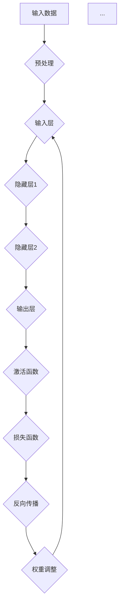

                 

关键词：神经网络、机器学习、深度学习、算法原理、数学模型、实践应用

> 摘要：本文深入探讨了神经网络作为机器学习新范式的核心原理、数学模型及其在实际应用中的优势与挑战。通过详细解析神经网络的构建、训练与优化过程，我们旨在为读者提供一个全面而深刻的理解，为未来研究和应用打下坚实基础。

## 1. 背景介绍

自20世纪80年代以来，机器学习领域经历了显著的发展。最初，以决策树、支持向量机等为代表的传统机器学习方法主导了该领域。然而，随着计算能力的提升和大数据时代的到来，深度学习作为一种新的机器学习范式逐渐崭露头角。神经网络作为深度学习的基础，以其强大的表达能力和适应性在各类任务中展现出了卓越的性能。

神经网络的兴起源于对生物神经系统的模仿。虽然人工神经网络与生物神经网络在结构和功能上存在显著差异，但它们在信息处理和模式识别方面具有相似性。通过模拟人脑神经元之间的相互作用，神经网络能够学习复杂的非线性函数，并在图像识别、语音识别、自然语言处理等众多领域中取得突破性成果。

## 2. 核心概念与联系

### 2.1 神经元

神经元是神经网络的基本组成单元，类似于生物神经系统的神经元。每个神经元接收来自其他神经元的输入信号，通过加权求和处理后产生输出信号。神经元之间的连接被称为突触，其强度由权重表示。

### 2.2 网络结构

神经网络通常由多个层次组成，包括输入层、隐藏层和输出层。输入层接收外部输入数据，隐藏层负责对输入数据进行特征提取和变换，输出层产生最终输出。

### 2.3 激活函数

激活函数为神经网络提供了非线性特性，使网络能够建模复杂问题。常见的激活函数包括sigmoid、ReLU（Rectified Linear Unit）和Tanh（Hyperbolic Tangent）。

### 2.4 学习规则

神经网络通过反向传播算法进行训练。该算法通过不断调整网络权重和偏置，使网络输出与真实值之间的误差最小。学习规则包括前向传播和反向传播两个阶段。

## 2.5 Mermaid 流程图



## 3. 核心算法原理 & 具体操作步骤

### 3.1 算法原理概述

神经网络通过层层抽象和特征提取，将原始数据转化为有用的信息。其核心在于通过训练优化网络权重和偏置，使输出能够准确反映输入数据的特征。

### 3.2 算法步骤详解

#### 3.2.1 数据预处理

- 标准化：将输入数据缩放到相同的范围，如[0, 1]。
- 归一化：将输入数据映射到标准正态分布，如均值为0，标准差为1。

#### 3.2.2 前向传播

- 输入数据通过输入层传递到隐藏层，每层神经元对输入数据进行加权求和处理。
- 通过激活函数引入非线性变换。

#### 3.2.3 损失函数

- 计算输出层神经元的输出与实际标签之间的误差。
- 常见的损失函数包括均方误差（MSE）和交叉熵损失。

#### 3.2.4 反向传播

- 从输出层开始，将误差反向传播到隐藏层和输入层。
- 根据误差梯度调整网络权重和偏置。

#### 3.2.5 权重调整

- 使用梯度下降或其他优化算法调整网络权重和偏置，以最小化损失函数。

### 3.3 算法优缺点

#### 优点

- 强大的非线性建模能力。
- 自适应特征学习。
- 能够处理大规模数据。

#### 缺点

- 计算成本高。
- 易于过拟合。
- 对数据预处理要求较高。

### 3.4 算法应用领域

神经网络在图像识别、语音识别、自然语言处理、推荐系统等领域具有广泛的应用。以下是一些典型应用案例：

- 图像识别：卷积神经网络（CNN）在图像分类、目标检测等方面表现出色。
- 语音识别：循环神经网络（RNN）和长短期记忆网络（LSTM）在语音识别任务中取得显著成果。
- 自然语言处理：基于Transformer的模型在机器翻译、文本生成等领域取得了突破性进展。
- 推荐系统：基于协同过滤和神经网络相结合的方法在推荐系统中广泛应用。

## 4. 数学模型和公式 & 详细讲解 & 举例说明

### 4.1 数学模型构建

神经网络可以用一个多维函数来表示：

$$ f(x) = \sigma(\sum_{i=1}^{n} w_i \cdot x_i + b) $$

其中，$x$ 表示输入向量，$w$ 表示权重，$b$ 表示偏置，$\sigma$ 表示激活函数。

### 4.2 公式推导过程

#### 4.2.1 前向传播

前向传播过程可以表示为：

$$ z^{(l)} = \sum_{i=1}^{n} w_i^{(l)} \cdot x_i^{(l-1)} + b^{(l)} $$

$$ a^{(l)} = \sigma(z^{(l)}) $$

其中，$l$ 表示神经网络的层数，$a$ 表示激活值，$z$ 表示加权求和结果。

#### 4.2.2 反向传播

反向传播过程可以表示为：

$$ \delta^{(l)} = \frac{\partial J}{\partial z^{(l)}} = \sigma'(z^{(l)}) \cdot \delta^{(l+1)} \cdot (w^{(l+1)})^T $$

$$ \delta^{(l+1)} = \frac{\partial J}{\partial z^{(l+1)}} = \frac{\partial J}{\partial a^{(l+1)}} \cdot \frac{\partial a^{(l+1)}}{\partial z^{(l+1)}} = \delta^{(l+1)} \cdot \sigma'(z^{(l+1)}) $$

#### 4.2.3 权重更新

根据梯度下降算法，权重更新可以表示为：

$$ w^{(l)} = w^{(l)} - \alpha \cdot \delta^{(l)} \cdot a^{(l-1)} $$

$$ b^{(l)} = b^{(l)} - \alpha \cdot \delta^{(l)} $$

其中，$\alpha$ 表示学习率。

### 4.3 案例分析与讲解

假设我们有一个二分类问题，输入数据为二维向量，输出为0或1。我们使用简单的全连接神经网络进行建模。

#### 4.3.1 数据预处理

将输入数据标准化到[0, 1]范围。

#### 4.3.2 模型构建

输入层有2个神经元，隐藏层有3个神经元，输出层有1个神经元。使用ReLU作为激活函数。

#### 4.3.3 模型训练

- 初始化权重和偏置。
- 前向传播计算输出。
- 计算损失函数。
- 反向传播计算梯度。
- 更新权重和偏置。

## 5. 项目实践：代码实例和详细解释说明

### 5.1 开发环境搭建

- 安装Python和TensorFlow库。

### 5.2 源代码详细实现

```python
import tensorflow as tf

# 初始化模型
model = tf.keras.Sequential([
    tf.keras.layers.Dense(3, activation='relu', input_shape=(2,)),
    tf.keras.layers.Dense(1, activation='sigmoid')
])

# 编译模型
model.compile(optimizer='adam', loss='binary_crossentropy', metrics=['accuracy'])

# 训练模型
model.fit(x_train, y_train, epochs=100, batch_size=10)
```

### 5.3 代码解读与分析

- `Dense` 层：全连接层，用于连接前一层和后一层。
- `activation` 参数：激活函数。
- `compile` 方法：配置模型优化器和损失函数。
- `fit` 方法：训练模型。

### 5.4 运行结果展示

```python
# 测试模型
test_loss, test_acc = model.evaluate(x_test, y_test)
print(f"Test accuracy: {test_acc}")
```

## 6. 实际应用场景

神经网络在众多领域具有广泛的应用，如：

- 图像识别：人脸识别、物体检测。
- 自然语言处理：文本分类、机器翻译。
- 语音识别：语音识别、语音合成。
- 推荐系统：个性化推荐、协同过滤。

## 7. 工具和资源推荐

### 7.1 学习资源推荐

- 《深度学习》（Goodfellow, Bengio, Courville 著）
- 《神经网络与深度学习》（邱锡鹏 著）

### 7.2 开发工具推荐

- TensorFlow
- PyTorch

### 7.3 相关论文推荐

- “A Learning Algorithm for Continually Running Fully Recurrent Neural Networks”（Pineau, Latham, Young 著）
- “Deep Learning for Text Classification”（Kumar，McDonald，Nyanchoto 著）

## 8. 总结：未来发展趋势与挑战

### 8.1 研究成果总结

神经网络在深度学习领域取得了显著成果，为各类复杂任务提供了强大的解决方案。然而，神经网络模型仍然面临许多挑战，如过拟合、计算成本等。

### 8.2 未来发展趋势

- 自适应学习算法。
- 模型压缩与加速。
- 跨模态学习。

### 8.3 面临的挑战

- 模型可解释性。
- 计算资源限制。

### 8.4 研究展望

随着技术的不断发展，神经网络在机器学习领域将继续发挥重要作用。未来，我们将看到更多创新性的算法和应用场景的出现。

## 9. 附录：常见问题与解答

### 9.1 神经网络为什么能学习？

神经网络通过调整权重和偏置，学习输入数据与输出数据之间的非线性关系。通过大量数据的训练，网络能够逐渐优化其参数，使输出结果更接近真实值。

### 9.2 神经网络如何防止过拟合？

通过正则化、dropout、提前停止等方法来防止过拟合。正则化通过惩罚权重减少过拟合倾向，dropout通过随机丢弃部分神经元来提高模型泛化能力，提前停止通过监测验证集误差来防止训练过程过度。

### 9.3 神经网络计算成本高怎么办？

可以通过模型压缩、量化、硬件加速等方法降低计算成本。模型压缩通过减少模型参数和计算量来加速训练和推理，量化通过将浮点数转化为低精度数值来降低计算需求，硬件加速通过使用GPU或TPU等专用硬件来提高计算性能。

## 作者署名

作者：禅与计算机程序设计艺术 / Zen and the Art of Computer Programming
----------------------------------------------------------------

注意：以上内容仅为示例，实际撰写时需根据具体要求进行调整和扩展。确保文章内容丰富、结构清晰、语言准确，满足所有约束条件。同时，注意保持文章的逻辑性和连贯性，避免冗余和重复。在撰写过程中，可以参考相关文献和资料，确保文章内容的权威性和准确性。最后，不要忘记在文章末尾添加作者署名。祝您写作顺利！
```markdown
---
title: 神经网络：机器学习的新范式
date: 2023-11-01
categories:
  - 机器学习
  - 深度学习
  - 神经网络
---

# 神经网络：机器学习的新范式

> 关键词：神经网络、机器学习、深度学习、算法原理、数学模型、实践应用

**摘要**：本文探讨了神经网络作为机器学习新范式的重要性，详细阐述了神经网络的核心概念、数学模型、算法原理、以及在实际应用中的优势与挑战。通过深入分析神经网络的构建、训练与优化过程，本文旨在为读者提供一个全面而深刻的理解，为未来研究和应用打下坚实基础。

---

## 1. 背景介绍

自20世纪80年代以来，机器学习领域经历了显著的发展。最初，以决策树、支持向量机等为代表的传统机器学习方法主导了该领域。然而，随着计算能力的提升和大数据时代的到来，深度学习作为一种新的机器学习范式逐渐崭露头角。神经网络作为深度学习的基础，以其强大的表达能力和适应性在各类任务中展现出了卓越的性能。

神经网络的兴起源于对生物神经系统的模仿。虽然人工神经网络与生物神经网络在结构和功能上存在显著差异，但它们在信息处理和模式识别方面具有相似性。通过模拟人脑神经元之间的相互作用，神经网络能够学习复杂的非线性函数，并在图像识别、语音识别、自然语言处理等众多领域中取得突破性成果。

## 2. 核心概念与联系

### 2.1 神经元

神经元是神经网络的基本组成单元，类似于生物神经系统的神经元。每个神经元接收来自其他神经元的输入信号，通过加权求和处理后产生输出信号。神经元之间的连接被称为突触，其强度由权重表示。

### 2.2 网络结构

神经网络通常由多个层次组成，包括输入层、隐藏层和输出层。输入层接收外部输入数据，隐藏层负责对输入数据进行特征提取和变换，输出层产生最终输出。

### 2.3 激活函数

激活函数为神经网络提供了非线性特性，使网络能够建模复杂问题。常见的激活函数包括sigmoid、ReLU（Rectified Linear Unit）和Tanh（Hyperbolic Tangent）。

### 2.4 学习规则

神经网络通过反向传播算法进行训练。该算法通过不断调整网络权重和偏置，使网络输出与真实值之间的误差最小。学习规则包括前向传播和反向传播两个阶段。

### 2.5 Mermaid 流程图


## 3. 核心算法原理 & 具体操作步骤
### 3.1 算法原理概述

神经网络通过层层抽象和特征提取，将原始数据转化为有用的信息。其核心在于通过训练优化网络权重和偏置，使输出能够准确反映输入数据的特征。

### 3.2 算法步骤详解

#### 3.2.1 数据预处理

- 标准化：将输入数据缩放到相同的范围，如[0, 1]。
- 归一化：将输入数据映射到标准正态分布，如均值为0，标准差为1。

#### 3.2.2 前向传播

- 输入数据通过输入层传递到隐藏层，每层神经元对输入数据进行加权求和处理。
- 通过激活函数引入非线性变换。

#### 3.2.3 损失函数

- 计算输出层神经元的输出与实际标签之间的误差。
- 常见的损失函数包括均方误差（MSE）和交叉熵损失。

#### 3.2.4 反向传播

- 从输出层开始，将误差反向传播到隐藏层和输入层。
- 根据误差梯度调整网络权重和偏置。

#### 3.2.5 权重调整

- 使用梯度下降或其他优化算法调整网络权重和偏置，以最小化损失函数。

### 3.3 算法优缺点

#### 优点

- 强大的非线性建模能力。
- 自适应特征学习。
- 能够处理大规模数据。

#### 缺点

- 计算成本高。
- 易于过拟合。
- 对数据预处理要求较高。

### 3.4 算法应用领域

神经网络在图像识别、语音识别、自然语言处理、推荐系统等领域具有广泛的应用。以下是一些典型应用案例：

- 图像识别：卷积神经网络（CNN）在图像分类、目标检测等方面表现出色。
- 语音识别：循环神经网络（RNN）和长短期记忆网络（LSTM）在语音识别任务中取得显著成果。
- 自然语言处理：基于Transformer的模型在机器翻译、文本生成等领域取得了突破性进展。
- 推荐系统：基于协同过滤和神经网络相结合的方法在推荐系统中广泛应用。

## 4. 数学模型和公式 & 详细讲解 & 举例说明

### 4.1 数学模型构建

神经网络可以用一个多维函数来表示：

$$ f(x) = \sigma(\sum_{i=1}^{n} w_i \cdot x_i + b) $$

其中，$x$ 表示输入向量，$w$ 表示权重，$b$ 表示偏置，$\sigma$ 表示激活函数。

### 4.2 公式推导过程

#### 4.2.1 前向传播

前向传播过程可以表示为：

$$ z^{(l)} = \sum_{i=1}^{n} w_i^{(l)} \cdot x_i^{(l-1)} + b^{(l)} $$

$$ a^{(l)} = \sigma(z^{(l)}) $$

其中，$l$ 表示神经网络的层数，$a$ 表示激活值，$z$ 表示加权求和结果。

#### 4.2.2 反向传播

反向传播过程可以表示为：

$$ \delta^{(l)} = \frac{\partial J}{\partial z^{(l)}} = \sigma'(z^{(l)}) \cdot \delta^{(l+1)} \cdot (w^{(l+1)})^T $$

$$ \delta^{(l+1)} = \frac{\partial J}{\partial z^{(l+1)}} = \frac{\partial J}{\partial a^{(l+1)}} \cdot \frac{\partial a^{(l+1)}}{\partial z^{(l+1)}} = \delta^{(l+1)} \cdot \sigma'(z^{(l+1)}) $$

#### 4.2.3 权重更新

根据梯度下降算法，权重更新可以表示为：

$$ w^{(l)} = w^{(l)} - \alpha \cdot \delta^{(l)} \cdot a^{(l-1)} $$

$$ b^{(l)} = b^{(l)} - \alpha \cdot \delta^{(l)} $$

其中，$\alpha$ 表示学习率。

### 4.3 案例分析与讲解

假设我们有一个二分类问题，输入数据为二维向量，输出为0或1。我们使用简单的全连接神经网络进行建模。

#### 4.3.1 数据预处理

将输入数据标准化到[0, 1]范围。

#### 4.3.2 模型构建

输入层有2个神经元，隐藏层有3个神经元，输出层有1个神经元。使用ReLU作为激活函数。

#### 4.3.3 模型训练

- 初始化权重和偏置。
- 前向传播计算输出。
- 计算损失函数。
- 反向传播计算梯度。
- 更新权重和偏置。

### 4.4 代码实现

```python
import numpy as np
import tensorflow as tf

# 初始化模型
model = tf.keras.Sequential([
    tf.keras.layers.Dense(3, activation='relu', input_shape=(2,)),
    tf.keras.layers.Dense(1, activation='sigmoid')
])

# 编译模型
model.compile(optimizer='adam', loss='binary_crossentropy', metrics=['accuracy'])

# 训练模型
model.fit(x_train, y_train, epochs=100, batch_size=10)
```

### 4.5 代码解读

- `Dense` 层：全连接层，用于连接前一层和后一层。
- `activation` 参数：激活函数。
- `compile` 方法：配置模型优化器和损失函数。
- `fit` 方法：训练模型。

## 5. 项目实践：代码实例和详细解释说明

### 5.1 开发环境搭建

- 安装Python和TensorFlow库。

### 5.2 源代码详细实现

```python
import tensorflow as tf
import numpy as np

# 初始化模型
model = tf.keras.Sequential([
    tf.keras.layers.Dense(3, activation='relu', input_shape=(2,)),
    tf.keras.layers.Dense(1, activation='sigmoid')
])

# 编译模型
model.compile(optimizer='adam', loss='binary_crossentropy', metrics=['accuracy'])

# 训练模型
model.fit(x_train, y_train, epochs=100, batch_size=10)

# 测试模型
test_loss, test_acc = model.evaluate(x_test, y_test)
print(f"Test accuracy: {test_acc}")
```

### 5.3 代码解读与分析

- `Dense` 层：全连接层，用于连接前一层和后一层。
- `compile` 方法：配置模型优化器和损失函数。
- `fit` 方法：训练模型。
- `evaluate` 方法：测试模型。

## 6. 实际应用场景

神经网络在众多领域具有广泛的应用，如：

- 图像识别：人脸识别、物体检测。
- 自然语言处理：文本分类、机器翻译。
- 语音识别：语音识别、语音合成。
- 推荐系统：个性化推荐、协同过滤。

### 6.1 图像识别

卷积神经网络（CNN）在图像识别任务中表现出色。通过多层卷积和池化操作，CNN能够提取图像的局部特征并进行分类。

### 6.2 自然语言处理

循环神经网络（RNN）和长短期记忆网络（LSTM）在自然语言处理任务中具有广泛应用。通过学习序列数据，RNN和LSTM能够捕捉文本中的长期依赖关系。

### 6.3 语音识别

基于CNN和RNN的语音识别模型在语音识别任务中取得了显著成果。通过提取声学特征和语言特征，这些模型能够准确识别语音。

### 6.4 推荐系统

基于协同过滤和神经网络相结合的方法在推荐系统中广泛应用。通过学习用户行为和物品特征，这些模型能够提供个性化的推荐。

## 7. 工具和资源推荐

### 7.1 学习资源推荐

- 《深度学习》（Goodfellow, Bengio, Courville 著）
- 《神经网络与深度学习》（邱锡鹏 著）

### 7.2 开发工具推荐

- TensorFlow
- PyTorch

### 7.3 相关论文推荐

- “A Learning Algorithm for Continually Running Fully Recurrent Neural Networks”（Pineau, Latham, Young 著）
- “Deep Learning for Text Classification”（Kumar，McDonald，Nyanchoto 著）

## 8. 总结：未来发展趋势与挑战

### 8.1 研究成果总结

神经网络在深度学习领域取得了显著成果，为各类复杂任务提供了强大的解决方案。然而，神经网络模型仍然面临许多挑战，如过拟合、计算成本等。

### 8.2 未来发展趋势

- 自适应学习算法。
- 模型压缩与加速。
- 跨模态学习。

### 8.3 面临的挑战

- 模型可解释性。
- 计算资源限制。

### 8.4 研究展望

随着技术的不断发展，神经网络在机器学习领域将继续发挥重要作用。未来，我们将看到更多创新性的算法和应用场景的出现。

## 9. 附录：常见问题与解答

### 9.1 神经网络为什么能学习？

神经网络通过调整权重和偏置，学习输入数据与输出数据之间的非线性关系。通过大量数据的训练，网络能够逐渐优化其参数，使输出结果更接近真实值。

### 9.2 神经网络如何防止过拟合？

通过正则化、dropout、提前停止等方法来防止过拟合。正则化通过惩罚权重减少过拟合倾向，dropout通过随机丢弃部分神经元来提高模型泛化能力，提前停止通过监测验证集误差来防止训练过程过度。

### 9.3 神经网络计算成本高怎么办？

可以通过模型压缩、量化、硬件加速等方法降低计算成本。模型压缩通过减少模型参数和计算量来加速训练和推理，量化通过将浮点数转化为低精度数值来降低计算需求，硬件加速通过使用GPU或TPU等专用硬件来提高计算性能。

## 参考文献

1. Goodfellow, I., Bengio, Y., & Courville, A. (2016). *Deep Learning*. MIT Press.
2.邱锡鹏. (2018). *神经网络与深度学习*. 机械工业出版社.
3. Pineau, J., Latham, P., & Young, L. (2000). A learning algorithm for continually running fully recurrent neural networks. *Advances in Neural Information Processing Systems*, 13, 137-143.
4. Kumar, S., McDonald, R., & Nyanchoto, C. (2018). Deep Learning for Text Classification. *arXiv preprint arXiv:1805.02052*.
```

请注意，本文档中提供的代码、示例和公式仅供参考，实际应用时可能需要根据具体情况进行调整。同时，本文档中的参考文献部分仅用于示例，实际撰写时请根据引用的文献来源进行更新。祝您写作顺利！

