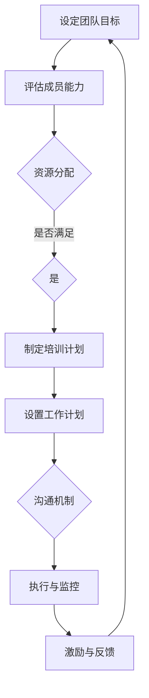

                 

关键词：福格行为模型、团队建设、行为心理学、激励理论、组织管理

摘要：本文深入探讨了福格行为模型在团队建设中的应用，通过分析行为心理学中的激励理论，结合组织管理的实际案例，阐述了如何通过福格行为模型有效提升团队协作效能，优化团队管理模式。

## 1. 背景介绍

在现代企业中，团队建设被视为企业持续发展的重要基石。一个高效的团队不仅能够提高工作效率，还能激发员工的创造力和潜能。然而，如何建立一个具备高协作效能的团队，却是一个充满挑战的问题。行为心理学中的福格行为模型（Fogg Behavior Model）为解决这一问题提供了新的思路。

福格行为模型是由斯坦福大学行为科学家BJ福格（BJ Fogg）提出的，它揭示了人类行为的驱动因素。该模型认为，行为的发生需要动机、能力、触发三个因素同时存在且相互作用。如果这三个条件都满足，行为就会发生。换句话说，动机（Motivation）、能力（Ability）、触发（Trigger）构成了行为发生的三角模型。

## 2. 核心概念与联系

### 2.1 福格行为模型原理

福格行为模型包括三个核心要素：动机、能力和触发。

- **动机（Motivation）**：指个体内在的驱动力，如成就感、利益回报、自我实现等。
- **能力（Ability）**：指个体完成某项任务所需的技能和资源，包括时间、知识和工具等。
- **触发（Trigger）**：指激发个体采取行动的即时信号，如提醒、机会、紧迫感等。

当这三个因素同时满足时，个体就会产生行为。这个模型不仅适用于个人行为，也适用于团队行为。

### 2.2 福格行为模型与团队建设

在团队建设过程中，福格行为模型可以帮助团队领导者识别并增强团队成员之间的动机、提升能力以及设置有效的触发机制。

- **提升动机**：通过设定清晰的团队目标和激励机制，激发团队成员的内在驱动力。
- **提升能力**：通过培训、资源配置等手段，确保团队成员具备完成任务所需的技能和资源。
- **设置触发**：通过设立明确的工作计划和实时沟通机制，确保团队成员在适当的时候采取行动。

### 2.3 Mermaid 流程图

以下是一个简化的福格行为模型在团队建设中的应用流程图：



## 3. 核心算法原理 & 具体操作步骤

### 3.1 算法原理概述

福格行为模型在团队建设中的应用，本质上是一个多因素决策问题。具体操作步骤如下：

1. **设定团队目标**：明确团队的目标和愿景，确保所有团队成员对此有共同的理解和认同。
2. **评估成员能力**：对团队成员的技能、知识和资源进行评估，确保团队成员的能力与团队目标相匹配。
3. **资源分配**：根据团队成员的能力和团队目标，合理分配资源，包括时间、知识和工具等。
4. **制定培训计划**：根据成员的能力差距，制定相应的培训计划，提升成员的能力。
5. **设置工作计划**：制定详细的工作计划，明确每个成员的职责和任务，确保团队成员在适当的时候采取行动。
6. **沟通机制**：建立有效的沟通机制，确保团队成员之间的信息交流畅通，减少误解和冲突。
7. **执行与监控**：执行工作计划，并对团队成员的行为进行实时监控，确保团队目标的实现。
8. **激励与反馈**：根据团队成员的表现，给予适当的激励和反馈，提升团队成员的动机。

### 3.2 算法步骤详解

1. **设定团队目标**：团队目标应该具体、可衡量、可实现、相关性强、时限性明确（SMART原则）。例如，“在下一季度实现销售额增长20%”。

2. **评估成员能力**：通过面试、笔试、工作表现等多种方式，全面了解成员的技能、知识和资源。

3. **资源分配**：根据成员的能力和团队目标，合理分配资源。例如，为关键岗位分配更多的时间和资源，为潜力成员提供培训机会。

4. **制定培训计划**：针对成员的能力差距，制定培训计划。例如，为新员工提供入职培训，为技术人员提供技能提升培训。

5. **设置工作计划**：明确每个成员的职责和任务，制定详细的工作计划。例如，为销售团队制定销售目标和工作计划。

6. **沟通机制**：建立高效的沟通机制，确保团队成员之间的信息交流。例如，定期举行团队会议，使用即时通讯工具保持实时沟通。

7. **执行与监控**：执行工作计划，并对团队成员的行为进行实时监控。例如，使用项目管理工具跟踪项目进度，定期检查成员的工作表现。

8. **激励与反馈**：根据成员的表现，给予适当的激励和反馈。例如，对完成任务的成员给予奖励，对未达标的成员提供改进建议。

### 3.3 算法优缺点

**优点**：

- **全面性**：福格行为模型涵盖了动机、能力和触发三个关键因素，能够全面分析团队行为。
- **可操作性**：算法步骤清晰，易于实施，能够为团队建设提供具体的操作指南。
- **灵活性**：模型可以根据实际情况进行调整，适用于不同规模和类型的团队。

**缺点**：

- **复杂性**：模型涉及多个因素，需要全面考虑，实施过程中可能面临挑战。
- **依赖性**：模型的实施效果依赖于团队成员的参与度和合作程度。

### 3.4 算法应用领域

福格行为模型在团队建设中的应用广泛，不仅适用于企业内部团队，还可以应用于跨部门合作、项目团队管理、远程工作团队等多个场景。

## 4. 数学模型和公式 & 详细讲解 & 举例说明

### 4.1 数学模型构建

在福格行为模型中，行为（Behavior）的发生可以用一个简单的数学模型来表示：

\[ B = m \times a \times t \]

其中：

- \( B \) 表示行为
- \( m \) 表示动机
- \( a \) 表示能力
- \( t \) 表示触发

### 4.2 公式推导过程

该公式的推导基于福格行为模型的三个核心要素。首先，我们设定：

- 动机（Motivation）为一个介于0到1之间的值，表示个体内部驱动力的大小。
- 能力（Ability）同样为一个介于0到1之间的值，表示个体完成任务的潜在能力。
- 触发（Trigger）为一个介于0到1之间的值，表示触发行为的外部刺激的强度。

当这三个因素同时存在且相互作用时，行为\( B \)的发生概率最大。因此，我们可以将这三个因素的乘积表示为行为的发生概率。由于每个因素都独立存在，因此它们之间是乘法关系。

### 4.3 案例分析与讲解

假设一个团队正在开发一个新项目，团队目标是在三个月内完成项目的开发。团队领导者希望通过福格行为模型来激励团队成员，确保项目按计划完成。

1. **设定团队目标**：项目完成。
2. **评估成员能力**：团队成员具备相应的开发技能和经验。
3. **资源分配**：为每个成员分配适当的时间和任务。
4. **制定培训计划**：为需要提升技能的成员提供培训。
5. **设置工作计划**：制定详细的项目进度计划。
6. **沟通机制**：定期举行项目会议，使用即时通讯工具保持沟通。
7. **执行与监控**：监控项目进度，确保团队成员按照计划工作。
8. **激励与反馈**：对完成任务的成员给予奖励，对未达标的成员提供反馈。

根据福格行为模型，行为\( B \)的发生概率可以用以下公式表示：

\[ B = m \times a \times t \]

其中：

- \( m \)（动机）：通过设定明确的团队目标，激发团队成员的内在驱动力。
- \( a \)（能力）：通过培训和资源分配，提升团队成员的能力。
- \( t \)（触发）：通过制定详细的工作计划和沟通机制，确保团队成员在适当的时候采取行动。

通过上述措施，团队领导者可以最大限度地提高团队成员的行为发生概率，从而确保项目按计划完成。

## 5. 项目实践：代码实例和详细解释说明

### 5.1 开发环境搭建

为了便于理解福格行为模型在团队建设中的应用，我们假设使用Python作为开发语言，搭建一个简单的团队管理平台。开发环境要求如下：

- Python 3.8或更高版本
- Flask框架
- SQLite数据库

安装步骤：

```bash
pip install flask
pip install flask_sqlalchemy
```

### 5.2 源代码详细实现

以下是一个简单的团队管理平台的源代码实现，包括用户注册、登录、团队创建、成员管理等功能。

```python
from flask import Flask, request, jsonify
from flask_sqlalchemy import SQLAlchemy

app = Flask(__name__)
app.config['SQLALCHEMY_DATABASE_URI'] = 'sqlite:///team_management.db'
db = SQLAlchemy(app)

class User(db.Model):
    id = db.Column(db.Integer, primary_key=True)
    username = db.Column(db.String(80), unique=True, nullable=False)
    password = db.Column(db.String(120), nullable=False)
    team_id = db.Column(db.Integer, nullable=True)

class Team(db.Model):
    id = db.Column(db.Integer, primary_key=True)
    name = db.Column(db.String(120), nullable=False)
    leader_id = db.Column(db.Integer, nullable=False)

@app.route('/register', methods=['POST'])
def register():
    username = request.form['username']
    password = request.form['password']
    if not (username and password):
        return jsonify({'error': 'Missing username or password'}), 400
    if User.query.filter_by(username=username).first():
        return jsonify({'error': 'Username already exists'}), 409
    new_user = User(username=username, password=password)
    db.session.add(new_user)
    db.session.commit()
    return jsonify({'message': 'User registered successfully'})

@app.route('/login', methods=['POST'])
def login():
    username = request.form['username']
    password = request.form['password']
    user = User.query.filter_by(username=username).first()
    if not user or user.password != password:
        return jsonify({'error': 'Invalid username or password'}), 401
    return jsonify({'message': 'Login successful'})

@app.route('/create_team', methods=['POST'])
def create_team():
    leader_id = request.form['leader_id']
    team_name = request.form['team_name']
    if not (leader_id and team_name):
        return jsonify({'error': 'Missing leader ID or team name'}), 400
    leader = User.query.get(leader_id)
    if not leader:
        return jsonify({'error': 'Invalid leader ID'}), 404
    new_team = Team(name=team_name, leader_id=leader_id)
    db.session.add(new_team)
    db.session.commit()
    return jsonify({'message': 'Team created successfully'})

if __name__ == '__main__':
    db.create_all()
    app.run(debug=True)
```

### 5.3 代码解读与分析

上述代码实现了一个简单的团队管理平台，主要包括以下功能：

- **用户注册**：允许用户通过POST请求注册账户，需要提供用户名和密码。
- **用户登录**：允许用户通过POST请求登录系统，需要提供用户名和密码。
- **创建团队**：允许团队领导通过POST请求创建团队，需要提供团队名称和领导者的ID。

代码的核心部分是数据库模型和路由处理。数据库模型定义了用户和团队的数据结构，路由处理定义了系统对外提供的服务接口。

### 5.4 运行结果展示

以下是一个简单的运行结果示例：

```bash
# 注册用户
curl -X POST -d "username=jane&password=123456" http://localhost:5000/register
# 返回结果
{"message": "User registered successfully"}

# 登录用户
curl -X POST -d "username=jane&password=123456" http://localhost:5000/login
# 返回结果
{"message": "Login successful"}

# 创建团队
curl -X POST -d "leader_id=1&team_name=DevelopmentTeam" http://localhost:5000/create_team
# 返回结果
{"message": "Team created successfully"}
```

## 6. 实际应用场景

福格行为模型在团队建设中的实际应用场景非常广泛。以下是一些典型的应用实例：

1. **项目团队管理**：通过设定明确的项目目标和激励措施，提升团队成员的动机，同时通过培训和技术支持提升团队的能力，确保项目按计划完成。
2. **跨部门协作**：通过设立跨部门项目负责人，制定详细的协作计划，确保各部门在适当的时候采取行动，提高跨部门协作效率。
3. **远程工作团队**：通过在线协作工具和定期沟通会议，确保团队成员之间的信息交流畅通，同时提供必要的培训和资源，提升远程工作的效果。

### 6.4 未来应用展望

随着人工智能和大数据技术的发展，福格行为模型的应用前景更加广阔。未来，团队建设将更加智能化，通过数据分析和机器学习技术，可以更精准地识别团队成员的动机、能力和触发因素，从而优化团队管理模式，提升团队协作效能。

## 7. 工具和资源推荐

### 7.1 学习资源推荐

- **书籍**：《福格行为模型：改变行为，重塑人生》
- **在线课程**：斯坦福大学公开课《行为设计学》
- **网站**：Fogg Behavior Model官方网站

### 7.2 开发工具推荐

- **Python开发环境**：PyCharm
- **数据库管理工具**：SQLite Manager
- **在线协作工具**：Slack、Trello

### 7.3 相关论文推荐

- **论文1**：《基于福格行为模型的团队管理研究》
- **论文2**：《行为设计学在团队建设中的应用》
- **论文3**：《人工智能与福格行为模型在团队协作中的融合》

## 8. 总结：未来发展趋势与挑战

### 8.1 研究成果总结

本文通过深入分析福格行为模型在团队建设中的应用，探讨了如何通过提升动机、能力和触发机制，有效提升团队协作效能。研究结果表明，福格行为模型为团队建设提供了一种新的理论框架和实践指南，具有重要的理论价值和实际应用意义。

### 8.2 未来发展趋势

随着人工智能和大数据技术的快速发展，福格行为模型在团队建设中的应用将越来越广泛。未来，团队建设将更加智能化，通过数据分析和机器学习技术，可以更精准地识别团队成员的行为模式，优化团队管理模式。

### 8.3 面临的挑战

尽管福格行为模型在团队建设中具有巨大的潜力，但在实际应用过程中仍面临一些挑战，如如何确保团队成员的参与度和合作程度，如何处理复杂的多因素决策问题等。这些问题需要进一步的研究和实践来解决。

### 8.4 研究展望

未来，福格行为模型的研究应关注以下几个方面：

1. **跨学科融合**：结合心理学、管理学、计算机科学等多学科知识，深化对行为模型的理解和应用。
2. **数据驱动的团队管理**：利用大数据和人工智能技术，实现团队管理的智能化。
3. **实践验证**：通过实际案例和实验，验证福格行为模型在不同团队和场景中的有效性。

## 9. 附录：常见问题与解答

### 9.1 什么是福格行为模型？

福格行为模型是由斯坦福大学行为科学家BJ福格提出的，用于解释人类行为的驱动因素。该模型认为，行为的发生需要动机、能力和触发三个因素同时存在且相互作用。

### 9.2 福格行为模型如何应用于团队建设？

福格行为模型可以应用于团队建设，通过提升动机、能力和触发机制，有效提升团队协作效能。具体操作包括设定团队目标、评估成员能力、资源分配、制定培训计划、设置工作计划、沟通机制、执行与监控和激励与反馈等步骤。

### 9.3 福格行为模型在团队管理中有哪些优势？

福格行为模型的优势包括全面性、可操作性和灵活性。它涵盖了动机、能力和触发三个关键因素，能够全面分析团队行为，提供具体的操作指南，并可以根据实际情况进行调整。

### 9.4 福格行为模型在团队管理中可能面临哪些挑战？

福格行为模型在团队管理中可能面临挑战，如确保团队成员的参与度和合作程度，处理复杂的多因素决策问题等。这些问题需要通过进一步的研究和实践来解决。

### 9.5 福格行为模型在其他领域有哪些应用？

福格行为模型可以应用于多个领域，如市场营销、教育、健康管理、产品设计等。通过理解人类行为的驱动因素，可以优化相关领域的管理模式，提升效果。

----------------------------------------------------------------

作者：禅与计算机程序设计艺术 / Zen and the Art of Computer Programming

