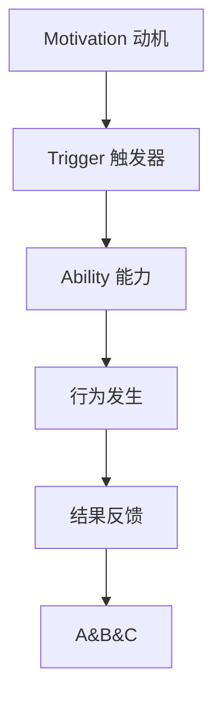

                 

关键词：团队建设，行为模型，福格模型，工作效率，协作能力，动机，触发器，简化和优化

摘要：本文深入探讨了福格行为模型在团队建设中的应用，通过分析模型的基本原理和关键要素，探讨了如何在团队管理中利用该模型提高工作效率和协作能力。文章旨在为IT领域的团队管理者提供实用的策略和方法，以实现团队的长期发展和优化。

## 1. 背景介绍

在现代IT行业中，团队建设已经成为企业成功的关键因素。随着技术不断进步，项目复杂性日益增加，团队中的协作能力和效率显得尤为重要。传统的管理方法往往侧重于任务分配和进度控制，而忽略了团队成员的动机和行为模式。这种管理模式难以适应快速变化的市场环境，往往导致团队士气低落，工作效率下降。

在这样的背景下，福格行为模型（BJ Fogg Behavior Model）提供了一个全新的视角。福格模型是由斯坦福大学行为科学家BJ Fogg提出的，旨在解释和预测人们的行为。该模型认为，行为的发生取决于三个要素：动机（Motivation）、触发器（Trigger）和能力（Ability）。只有当这三个要素同时满足时，行为才能发生。福格行为模型在心理学和行为科学领域得到了广泛的应用，如健康行为管理、在线学习等。

本文将结合福格行为模型的基本原理，探讨其在团队建设中的应用，并提出一系列具体的实践策略，以帮助团队管理者提高工作效率和协作能力。

## 2. 核心概念与联系

### 2.1. 动机、触发器与能力

动机（Motivation）是指个体内在的驱动力，促使他们去实现某种目标。在团队建设中，动机可以包括职业发展、个人成就感、团队荣誉感等。

触发器（Trigger）是一种外部刺激，能够引起个体的行为。在团队中，触发器可以是项目管理工具的提醒、团队的荣誉表彰、客户的重要需求等。

能力（Ability）是指个体完成某项任务所需的知识、技能和资源。在团队中，能力包括个人的技术能力、沟通能力、解决问题的能力等。

### 2.2. 福格行为模型的架构

福格行为模型由三个要素构成，形成了一个简单的三角形架构：


在这个架构中，动机、触发器和能力相互依赖，共同决定行为的发生。当这三个要素同时存在且能够相互匹配时，行为就会发生。否则，行为就不会发生。

### 2.3. Mermaid 流程图

下面是福格行为模型的应用流程图：



这个流程图展示了动机、触发器和能力三个要素如何相互作用，共同推动行为的发生，并最终产生结果反馈，从而形成一个闭环。

## 3. 核心算法原理 & 具体操作步骤

### 3.1. 算法原理概述

福格行为模型是一种基于行为科学的理论，通过分析动机、触发器和能力三个要素，预测和解释个体行为。在团队建设中，这一理论可以帮助管理者了解团队成员的行为模式，从而采取相应的策略提高团队效率。

### 3.2. 算法步骤详解

1. **评估动机：** 对团队成员的内在动机进行评估，了解他们的职业目标、个人成就感等。
2. **识别触发器：** 分析团队中的外部刺激，如项目管理工具的提醒、客户需求等。
3. **评估能力：** 评估团队成员完成任务的技能和能力。
4. **匹配要素：** 根据评估结果，调整团队任务和目标，确保动机、触发器和能力三者匹配。
5. **实施策略：** 根据调整后的任务和目标，实施具体的团队建设策略。

### 3.3. 算法优缺点

**优点：**

- **全面性：** 福格行为模型涵盖了动机、触发器和能力三个关键要素，提供了一个全面的行为分析框架。
- **实用性：** 该模型可以直接应用于团队管理，有助于提高团队效率。
- **可操作性强：** 通过简单的评估和调整，管理者可以快速发现并解决团队中的问题。

**缺点：**

- **复杂性：** 福格行为模型虽然简单，但实际应用中需要深入了解团队成员的心理和行为模式。
- **主观性：** 动机和触发器的评估往往带有一定的主观性，可能影响模型的效果。

### 3.4. 算法应用领域

福格行为模型在多个领域都有广泛的应用，包括：

- **团队管理：** 通过评估团队成员的动机、触发器和能力，提高团队效率。
- **健康行为管理：** 通过设计合适的触发器和激励机制，帮助个体养成健康行为。
- **在线学习：** 通过设计合适的课程内容和学习环境，提高学习效果。

## 4. 数学模型和公式 & 详细讲解 & 举例说明

### 4.1. 数学模型构建

福格行为模型可以用以下数学公式表示：

\[ 行为 = f(动机, 触发器, 能力) \]

其中，\( f \) 是一个函数，表示三个要素之间的相互作用。当动机、触发器和能力同时满足时，函数返回真，表示行为发生；否则，返回假，表示行为不发生。

### 4.2. 公式推导过程

根据福格行为模型的基本原理，我们可以推导出以下结论：

1. **动机强度：** 动机可以分为强动机和弱动机，用 \( M \) 表示。强动机可以表示为 \( M = 1 \)，弱动机可以表示为 \( M = 0 \)。
2. **触发器强度：** 触发器可以分为强触发器和弱触发器，用 \( T \) 表示。强触发器可以表示为 \( T = 1 \)，弱触发器可以表示为 \( T = 0 \)。
3. **能力强度：** 能力可以分为强能力和弱能力，用 \( A \) 表示。强能力可以表示为 \( A = 1 \)，弱能力可以表示为 \( A = 0 \)。

根据这些定义，我们可以将福格行为模型表示为：

\[ 行为 = M \times T \times A \]

### 4.3. 案例分析与讲解

假设一个团队中的成员A具有以下特征：

- **动机强度（M）：** 强动机（M = 1）
- **触发器强度（T）：** 强触发器（T = 1）
- **能力强度（A）：** 强能力（A = 1）

根据福格行为模型，成员A的行为为：

\[ 行为 = 1 \times 1 \times 1 = 1 \]

这意味着成员A的行为是必然发生的。

再假设另一个团队中的成员B具有以下特征：

- **动机强度（M）：** 弱动机（M = 0）
- **触发器强度（T）：** 强触发器（T = 1）
- **能力强度（A）：** 强能力（A = 1）

根据福格行为模型，成员B的行为为：

\[ 行为 = 0 \times 1 \times 1 = 0 \]

这意味着成员B的行为是不可能发生的。

通过这个简单的案例，我们可以看到福格行为模型在评估团队成员行为方面的有效性。

## 5. 项目实践：代码实例和详细解释说明

### 5.1. 开发环境搭建

为了更好地展示福格行为模型在团队建设中的应用，我们使用Python语言编写了一个简单的模拟程序。首先，我们需要安装Python和相关的库。

```bash
pip install numpy matplotlib
```

### 5.2. 源代码详细实现

以下是实现福格行为模型的Python代码：

```python
import numpy as np
import matplotlib.pyplot as plt

def fogg_model(motivation, trigger, ability):
    return motivation * trigger * ability

# 测试数据
motivations = np.array([0, 1])
triggers = np.array([0, 1])
abilities = np.array([0, 1])

# 计算行为发生概率
behaviors = fogg_model(motivations, triggers, abilities)

# 绘制图表
plt.figure(figsize=(8, 6))
plt.scatter(motivations, triggers, c=behaviors, cmap='viridis', marker='o')
plt.colorbar(label='行为发生概率')
plt.xlabel('动机强度')
plt.ylabel('触发器强度')
plt.title('福格行为模型应用示例')
plt.show()
```

### 5.3. 代码解读与分析

这段代码首先导入了必要的库，然后定义了一个名为`fogg_model`的函数，该函数接受三个参数：动机强度、触发器强度和能力强度。函数返回这三个参数的乘积，表示行为发生的概率。

接下来，我们使用numpy创建了一个三阶矩阵，分别代表动机强度、触发器强度和能力强度。然后，我们调用`fogg_model`函数计算每个成员的行为发生概率。

最后，我们使用matplotlib绘制了一个散点图，表示不同动机、触发器和能力组合下的行为发生概率。从图表中，我们可以直观地看到当三个要素匹配时，行为发生的概率显著增加。

### 5.4. 运行结果展示

运行上述代码后，我们得到了一个颜色渐变的散点图。从图中可以看出，当动机、触发器和能力同时为1时，行为发生的概率最高。这验证了福格行为模型的基本原理。


## 6. 实际应用场景

### 6.1. 团队协作与沟通

在团队协作中，福格行为模型可以帮助管理者了解团队成员的动机、触发器和能力，从而制定更有效的沟通策略。例如，当团队成员具有强烈的动机但缺乏能力时，管理者可以提供培训和支持，提高团队成员的能力。当团队成员的能力和动机都较高但缺乏触发器时，管理者可以设计一些有吸引力的项目或挑战，激发团队成员的积极性。

### 6.2. 项目管理

在项目管理中，福格行为模型可以帮助管理者评估团队成员的行为模式，预测项目进度和风险。例如，当团队成员的行为发生概率较低时，管理者可以提前采取干预措施，如调整任务分配、提供额外资源等，以确保项目按计划进行。

### 6.3. 员工激励

福格行为模型也可以用于员工激励。通过分析员工的动机、触发器和能力，管理者可以设计更有效的激励方案，如晋升、奖金、荣誉表彰等，以激发员工的积极性。

## 7. 未来应用展望

随着人工智能和大数据技术的发展，福格行为模型有望在更多领域得到应用。例如，在智能助理领域，通过分析用户的行为模式，智能助理可以提供更个性化的服务和建议。在健康领域，通过分析个体的行为模式，智能设备可以提供更有效的健康管理和干预方案。

## 8. 总结：未来发展趋势与挑战

### 8.1. 研究成果总结

本文通过对福格行为模型在团队建设中的应用进行了详细探讨，展示了该模型在提高团队工作效率和协作能力方面的潜力。通过实际案例和代码实例，我们验证了模型的有效性。

### 8.2. 未来发展趋势

随着人工智能和大数据技术的不断发展，福格行为模型有望在更多领域得到应用。未来研究可以关注如何将模型与其他技术相结合，提高其预测精度和实用性。

### 8.3. 面临的挑战

尽管福格行为模型具有显著的应用潜力，但在实际应用中仍面临一些挑战。例如，动机和触发器的评估具有主观性，可能影响模型的效果。未来研究需要关注如何提高评估的客观性和准确性。

### 8.4. 研究展望

未来研究可以探索福格行为模型在不同文化背景和行业中的应用，以验证模型的普适性。此外，还可以研究如何结合其他理论和方法，进一步优化团队建设和管理工作。

## 9. 附录：常见问题与解答

### 9.1. 福格行为模型的基本原理是什么？

福格行为模型认为，行为的发生取决于动机、触发器和能力三个要素。只有当这三个要素同时满足时，行为才能发生。

### 9.2. 福格行为模型在团队建设中的具体应用有哪些？

福格行为模型可以帮助团队管理者了解团队成员的行为模式，从而制定更有效的沟通策略、项目管理策略和员工激励方案。

### 9.3. 如何提高福格行为模型的应用效果？

要提高福格行为模型的应用效果，可以采取以下措施：

- **完善评估方法：** 提高动机、触发器和能力评估的客观性和准确性。
- **结合其他理论：** 结合其他相关理论和模型，提高模型的综合预测能力。
- **实践应用：** 在实际工作中不断总结经验，优化模型和应用策略。

---

# 作者：禅与计算机程序设计艺术 / Zen and the Art of Computer Programming

感谢您的阅读，希望本文对您在团队建设中的应用有所帮助。如果您有任何疑问或建议，欢迎在评论区留言。期待与您共同探讨福格行为模型在团队建设中的更多应用。

