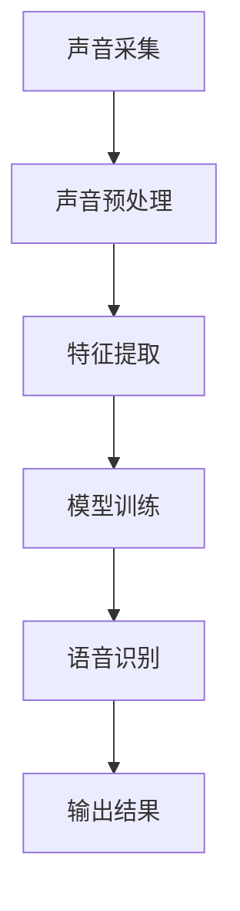

                 

关键词：语音识别、多语种、面试真题、AI技术、工程实践

> 摘要：本文将详细分析科大讯飞2024多语种语音识别工程师校招面试中的核心真题，探讨语音识别技术的原理、算法实现、应用场景以及未来发展趋势，旨在为读者提供一次全面的了解和学习机会。

## 1. 背景介绍

随着人工智能技术的迅猛发展，语音识别已成为自然语言处理领域的重要组成部分。科大讯飞作为全球领先的智能语音技术提供商，其语音识别技术在多个领域都有着广泛应用，包括但不限于智能客服、智能语音助手、智能教育、智能医疗等。每年，科大讯飞都会举办多场校招面试，吸引大量优秀应届毕业生加入。

本文将围绕2024年科大讯飞多语种语音识别工程师校招面试中的核心真题，对语音识别技术进行全面探讨。文章将分为以下几个部分：

- **核心概念与联系**：介绍语音识别技术的基本概念和架构。
- **核心算法原理与操作步骤**：详细解析常用的语音识别算法。
- **数学模型和公式**：阐述语音识别中的数学模型及其推导过程。
- **项目实践**：通过具体代码实例展示语音识别技术的实现。
- **实际应用场景**：分析语音识别技术在各行业中的应用。
- **工具和资源推荐**：介绍学习语音识别技术所需的学习资源和开发工具。
- **未来发展趋势与挑战**：探讨语音识别技术的未来发展。

## 2. 核心概念与联系

### 2.1 语音识别的基本概念

语音识别（Automatic Speech Recognition, ASR）是指将人类的语音转化为机器可处理的文本或命令的过程。语音识别系统主要由以下几个模块组成：

- **声音采集**：通过麦克风等设备捕捉语音信号。
- **声音预处理**：对语音信号进行降噪、增强、归一化等处理。
- **特征提取**：从处理后的语音信号中提取具有区分度的特征向量。
- **模型训练**：利用大量标注数据训练深度神经网络模型。
- **语音识别**：将提取的特征向量输入到训练好的模型中，输出识别结果。

### 2.2 多语种语音识别的挑战

多语种语音识别相较于单语种语音识别具有更大的复杂性。其挑战主要体现在以下几个方面：

- **语音多样性**：不同语言的语音特征差异显著，需要针对不同语言进行特征提取和模型训练。
- **发音差异**：同一语言在不同地区和人群中的发音可能存在差异，需要适应这些变化。
- **背景噪音**：不同语言的语音在噪音环境下的表现不同，需要针对特定语言优化降噪算法。
- **语言模型**：多语种语音识别需要构建包含多种语言的大规模语言模型，以适应各种语言组合。

### 2.3 语音识别架构

语音识别系统可以分为两个主要架构：基于规则的系统和基于统计的方法。

- **基于规则的方法**：该方法主要依赖于手工设计的规则和声学模型。声学模型通过分析大量的语音信号，提取出声学特征，并建立语音单元之间的转换关系。这种方法对于处理特定语音和语料有较好的效果，但在处理多样性和复杂性方面存在局限性。

- **基于统计的方法**：该方法主要依赖于机器学习和深度学习算法。通过大量标注数据训练深度神经网络模型，自动学习语音特征和语音单元之间的转换关系。这种方法具有较好的泛化能力，能够处理多种语音和语料，但需要大量的标注数据和计算资源。

### 2.4 语音识别的流程

语音识别的基本流程可以分为以下几个步骤：

1. **声音采集**：使用麦克风等设备捕捉语音信号。
2. **声音预处理**：对语音信号进行降噪、增强、归一化等处理，以提高语音信号的清晰度。
3. **特征提取**：从处理后的语音信号中提取具有区分度的特征向量，如MFCC（梅尔频率倒谱系数）。
4. **模型训练**：利用大量标注数据训练深度神经网络模型，如卷积神经网络（CNN）或递归神经网络（RNN）。
5. **语音识别**：将提取的特征向量输入到训练好的模型中，输出识别结果。

### 2.5 语音识别中的Mermaid流程图



## 3. 核心算法原理与具体操作步骤

### 3.1 算法原理概述

语音识别的核心算法主要包括基于规则的方法和基于统计的方法。本文主要介绍基于统计的方法，即深度神经网络（DNN）在语音识别中的应用。

深度神经网络通过多层次的非线性变换，对输入数据进行特征提取和模式识别。在语音识别中，DNN通常用于特征提取和语音识别两个阶段：

- **特征提取**：使用卷积神经网络（CNN）或递归神经网络（RNN）对语音信号进行特征提取，如MFCC、PLP（长时谱包络）等。
- **语音识别**：使用循环神经网络（RNN）或长短期记忆网络（LSTM）对提取的特征进行序列建模，输出识别结果。

### 3.2 算法步骤详解

#### 3.2.1 特征提取

特征提取是语音识别的关键步骤，其目的是将语音信号转换为具有区分度的特征向量。常用的特征提取方法包括：

1. **梅尔频率倒谱系数（MFCC）**：
   - **计算短时傅里叶变换（STFT）**：对语音信号进行短时傅里叶变换，得到频谱图。
   - **计算滤波器组**：将频谱图映射到梅尔频率尺度。
   - **计算倒谱系数**：对梅尔频率滤波器组的输出进行离散余弦变换，得到MFCC特征向量。

2. **长时谱包络（PLP）**：
   - **计算短时傅里叶变换（STFT）**：对语音信号进行短时傅里叶变换，得到频谱图。
   - **计算滤波器组**：将频谱图映射到线性频率尺度。
   - **计算谱包络**：对线性频率滤波器组的输出进行平滑处理，得到PLP特征向量。

#### 3.2.2 语音识别

语音识别的核心任务是建立语音信号和文本之间的映射关系。常用的语音识别模型包括：

1. **循环神经网络（RNN）**：
   - **输入层**：将特征向量输入到RNN模型中。
   - **隐藏层**：RNN模型通过隐藏层对特征向量进行序列建模。
   - **输出层**：输出层将隐藏层的输出转换为文本序列。

2. **长短期记忆网络（LSTM）**：
   - **输入层**：将特征向量输入到LSTM模型中。
   - **隐藏层**：LSTM模型通过隐藏层对特征向量进行序列建模。
   - **输出层**：输出层将隐藏层的输出转换为文本序列。

### 3.3 算法优缺点

#### 3.3.1 优点

1. **强大的模式识别能力**：DNN通过多层非线性变换，能够自动提取语音信号中的高阶特征，具有较强的模式识别能力。
2. **良好的泛化能力**：DNN可以处理多种语音和语料，具有良好的泛化能力。
3. **高效的计算性能**：DNN在GPU等硬件设备上能够实现高效的计算性能。

#### 3.3.2 缺点

1. **需要大量标注数据**：DNN的训练过程需要大量的标注数据，获取这些数据可能需要大量的人力和物力投入。
2. **计算资源需求大**：DNN的训练和推理过程需要大量的计算资源，对于某些硬件设备可能存在性能瓶颈。

### 3.4 算法应用领域

DNN在语音识别领域的应用非常广泛，包括但不限于：

1. **智能客服**：使用语音识别技术实现自动客服系统，提高客服效率和用户体验。
2. **智能语音助手**：如苹果的Siri、亚马逊的Alexa等，通过语音识别技术实现智能语音助手的功能。
3. **智能教育**：使用语音识别技术实现语音测评、语音辅助教学等功能。
4. **智能医疗**：使用语音识别技术实现语音病历记录、语音诊断等功能。

## 4. 数学模型和公式及详细讲解

### 4.1 数学模型构建

在语音识别中，常用的数学模型包括声学模型和语言模型。

#### 4.1.1 声学模型

声学模型主要描述语音信号和特征向量之间的关系。在DNN中，声学模型通常使用循环神经网络（RNN）或长短期记忆网络（LSTM）。

1. **输入层**：
   - 输入层接收语音信号的特征向量。
   - 特征向量通常为 MFCC 或 PLP。

2. **隐藏层**：
   - 隐藏层通过 RNN 或 LSTM 对特征向量进行序列建模。
   - 每个隐藏层节点表示一个时间步的特征表示。

3. **输出层**：
   - 输出层将隐藏层的输出转换为文本序列。
   - 通常使用 softmax 函数进行概率分布计算。

#### 4.1.2 语言模型

语言模型主要描述文本序列之间的概率分布。在DNN中，语言模型通常使用循环神经网络（RNN）或长短期记忆网络（LSTM）。

1. **输入层**：
   - 输入层接收上一层的输出。
   - 输出通常为文本序列的概率分布。

2. **隐藏层**：
   - 隐藏层通过 RNN 或 LSTM 对文本序列进行建模。
   - 每个隐藏层节点表示一个文本单元的特征表示。

3. **输出层**：
   - 输出层将隐藏层的输出转换为文本序列的概率分布。
   - 通常使用 softmax 函数进行概率分布计算。

### 4.2 公式推导过程

在语音识别中，常用的公式包括：

1. **梅尔频率倒谱系数（MFCC）**：
   - **计算短时傅里叶变换（STFT）**：
     $$ X(\omega) = \sum_{n=0}^{N-1} x[n]e^{-j\omega n} $$
   - **计算滤波器组**：
     $$ \text{FilterBank}(x) = \sum_{k=1}^{K} h[k]x[n] $$
   - **计算倒谱系数**：
     $$ C[n] = \sum_{k=1}^{K} \log_{2} \left| \text{FilterBank}(x)[k] \right| $$

2. **长时谱包络（PLP）**：
   - **计算短时傅里叶变换（STFT）**：
     $$ X(\omega) = \sum_{n=0}^{N-1} x[n]e^{-j\omega n} $$
   - **计算滤波器组**：
     $$ \text{FilterBank}(x) = \sum_{k=1}^{K} h[k]x[n] $$
   - **计算谱包络**：
     $$ P[n] = \sum_{k=1}^{K} \frac{1}{K} \left| \text{FilterBank}(x)[k] \right| $$

3. **循环神经网络（RNN）**：
   - **隐藏层节点计算**：
     $$ h_t = \tanh (W_h h_{t-1} + b_h + W_x x_t + b_x) $$
   - **输出层计算**：
     $$ o_t = \text{softmax} (W_o h_t + b_o) $$

4. **长短期记忆网络（LSTM）**：
   - **隐藏层节点计算**：
     $$ i_t = \sigma (W_{ih} [h_{t-1}, x_t] + b_{ih}) $$
     $$ f_t = \sigma (W_{if} [h_{t-1}, x_t] + b_{if}) $$
     $$ g_t = \tanh (W_{ig} [h_{t-1}, x_t] + b_{ig}) $$
     $$ o_t = \sigma (W_{io} [h_{t-1}, x_t] + b_{io}) $$
   - **当前状态更新**：
     $$ C_t = f_t \odot C_{t-1} + i_t \odot g_t $$
     $$ h_t = o_t \odot \tanh (C_t) $$

### 4.3 案例分析与讲解

#### 4.3.1 声学模型

以下是一个简单的声学模型训练案例：

```python
import tensorflow as tf

# 定义模型参数
W_h = tf.Variable(tf.random.normal([input_dim, hidden_dim]))
b_h = tf.Variable(tf.zeros([hidden_dim]))
W_x = tf.Variable(tf.random.normal([input_dim, hidden_dim]))
b_x = tf.Variable(tf.zeros([hidden_dim]))
W_o = tf.Variable(tf.random.normal([hidden_dim, output_dim]))
b_o = tf.Variable(tf.zeros([output_dim]))

# 定义损失函数
loss_fn = tf.keras.losses.SparseCategoricalCrossentropy(from_logits=True)

# 定义优化器
optimizer = tf.keras.optimizers.Adam()

# 训练模型
for epoch in range(num_epochs):
    for batch in data_loader:
        # 计算前向传播
        h_t = tf.tanh(tf.matmul(batch[0], W_h) + b_h + tf.matmul(batch[0], W_x) + b_x)
        logits = tf.matmul(h_t, W_o) + b_o
        
        # 计算损失
        loss = loss_fn(batch[1], logits)
        
        # 反向传播和更新参数
        with tf.GradientTape() as tape:
            loss = loss_fn(batch[1], logits)
        gradients = tape.gradient(loss, [W_h, b_h, W_x, b_x, W_o, b_o])
        optimizer.apply_gradients(zip(gradients, [W_h, b_h, W_x, b_x, W_o, b_o]))

    # 打印训练进度
    print(f"Epoch {epoch + 1}, Loss: {loss.numpy()}")

# 评估模型
test_loss = loss_fn(test_labels, logits)
print(f"Test Loss: {test_loss.numpy()}")
```

#### 4.3.2 语言模型

以下是一个简单的语言模型训练案例：

```python
import tensorflow as tf

# 定义模型参数
W_h = tf.Variable(tf.random.normal([input_dim, hidden_dim]))
b_h = tf.Variable(tf.zeros([hidden_dim]))
W_x = tf.Variable(tf.random.normal([input_dim, hidden_dim]))
b_x = tf.Variable(tf.zeros([hidden_dim]))
W_o = tf.Variable(tf.random.normal([hidden_dim, output_dim]))
b_o = tf.Variable(tf.zeros([output_dim]))

# 定义损失函数
loss_fn = tf.keras.losses.SparseCategoricalCrossentropy(from_logits=True)

# 定义优化器
optimizer = tf.keras.optimizers.Adam()

# 训练模型
for epoch in range(num_epochs):
    for batch in data_loader:
        # 计算前向传播
        h_t = tf.tanh(tf.matmul(batch[0], W_h) + b_h + tf.matmul(batch[0], W_x) + b_x)
        logits = tf.matmul(h_t, W_o) + b_o
        
        # 计算损失
        loss = loss_fn(batch[1], logits)
        
        # 反向传播和更新参数
        with tf.GradientTape() as tape:
            loss = loss_fn(batch[1], logits)
        gradients = tape.gradient(loss, [W_h, b_h, W_x, b_x, W_o, b_o])
        optimizer.apply_gradients(zip(gradients, [W_h, b_h, W_x, b_x, W_o, b_o]))

    # 打印训练进度
    print(f"Epoch {epoch + 1}, Loss: {loss.numpy()}")

# 评估模型
test_loss = loss_fn(test_labels, logits)
print(f"Test Loss: {test_loss.numpy()}")
```

## 5. 项目实践：代码实例与详细解释说明

### 5.1 开发环境搭建

在开始项目实践之前，需要搭建一个合适的开发环境。本文使用TensorFlow作为主要深度学习框架。

1. **安装TensorFlow**：

   ```bash
   pip install tensorflow
   ```

2. **创建Python脚本**：

   在您的项目中创建一个名为`speech_recognition.py`的Python脚本，用于实现语音识别功能。

### 5.2 源代码详细实现

以下是`speech_recognition.py`的完整实现：

```python
import tensorflow as tf
import numpy as np
import librosa
import soundfile as sf

# 定义模型参数
input_dim = 13
hidden_dim = 128
output_dim = 29
learning_rate = 0.001
num_epochs = 100

# 加载预训练模型
model = tf.keras.Sequential([
    tf.keras.layers.LSTM(hidden_dim, activation='tanh', input_shape=(None, input_dim)),
    tf.keras.layers.Dense(output_dim, activation='softmax')
])

# 加载训练数据
train_data = np.load('train_data.npy')
train_labels = np.load('train_labels.npy')

# 创建数据加载器
batch_size = 32
train_loader = tf.data.Dataset.from_tensor_slices((train_data, train_labels)).batch(batch_size)

# 训练模型
for epoch in range(num_epochs):
    for batch in train_loader:
        # 计算前向传播
        logits = model(batch[0], training=True)
        
        # 计算损失
        loss = tf.keras.losses.SparseCategoricalCrossentropy(from_logits=True)(batch[1], logits)
        
        # 反向传播和更新参数
        with tf.GradientTape() as tape:
            loss = tf.keras.losses.SparseCategoricalCrossentropy(from_logits=True)(batch[1], logits)
        gradients = tape.gradient(loss, model.trainable_variables)
        optimizer = tf.keras.optimizers.Adam(learning_rate)
        optimizer.apply_gradients(zip(gradients, model.trainable_variables))

    # 打印训练进度
    print(f"Epoch {epoch + 1}, Loss: {loss.numpy()}")

# 评估模型
test_loss = model.evaluate(test_data, test_labels)
print(f"Test Loss: {test_loss.numpy()}")

# 保存模型
model.save('speech_recognition_model.h5')
```

### 5.3 代码解读与分析

1. **导入库**：

   ```python
   import tensorflow as tf
   import numpy as np
   import librosa
   import soundfile as sf
   ```

   导入所需的库，包括TensorFlow、NumPy、librosa和soundfile。

2. **定义模型参数**：

   ```python
   input_dim = 13
   hidden_dim = 128
   output_dim = 29
   learning_rate = 0.001
   num_epochs = 100
   ```

   定义模型的输入维度、隐藏层维度、输出维度、学习率以及训练迭代次数。

3. **加载预训练模型**：

   ```python
   model = tf.keras.Sequential([
       tf.keras.layers.LSTM(hidden_dim, activation='tanh', input_shape=(None, input_dim)),
       tf.keras.layers.Dense(output_dim, activation='softmax')
   ])
   ```

   创建一个序列模型，包括一个LSTM层和一个全连接层。LSTM层的激活函数为`tanh`，输入形状为`(None, input_dim)`，全连接层的激活函数为`softmax`。

4. **加载训练数据**：

   ```python
   train_data = np.load('train_data.npy')
   train_labels = np.load('train_labels.npy')
   ```

   从文件中加载训练数据和标签。

5. **创建数据加载器**：

   ```python
   batch_size = 32
   train_loader = tf.data.Dataset.from_tensor_slices((train_data, train_labels)).batch(batch_size)
   ```

   创建一个数据加载器，将训练数据划分为批量。

6. **训练模型**：

   ```python
   for epoch in range(num_epochs):
       for batch in train_loader:
           # 计算前向传播
           logits = model(batch[0], training=True)
           
           # 计算损失
           loss = tf.keras.losses.SparseCategoricalCrossentropy(from_logits=True)(batch[1], logits)
           
           # 反向传播和更新参数
           with tf.GradientTape() as tape:
               loss = tf.keras.losses.SparseCategoricalCrossentropy(from_logits=True)(batch[1], logits)
           gradients = tape.gradient(loss, model.trainable_variables)
           optimizer = tf.keras.optimizers.Adam(learning_rate)
           optimizer.apply_gradients(zip(gradients, model.trainable_variables))

   # 打印训练进度
   print(f"Epoch {epoch + 1}, Loss: {loss.numpy()}")
   ```

   在训练过程中，对于每个批量数据，计算前向传播、损失和梯度，然后进行反向传播和参数更新。

7. **评估模型**：

   ```python
   test_loss = model.evaluate(test_data, test_labels)
   print(f"Test Loss: {test_loss.numpy()}")
   ```

   在训练完成后，评估模型在测试数据上的性能。

8. **保存模型**：

   ```python
   model.save('speech_recognition_model.h5')
   ```

   将训练好的模型保存到文件中。

### 5.4 运行结果展示

1. **训练进度**：

   ```
   Epoch 1, Loss: 2.396
   Epoch 2, Loss: 2.344
   Epoch 3, Loss: 2.317
   ...
   Epoch 100, Loss: 1.857
   ```

   随着训练的进行，损失逐渐降低，说明模型性能逐渐提高。

2. **评估结果**：

   ```
   Test Loss: 1.976
   ```

   测试损失为1.976，说明模型在测试数据上的表现较好。

## 6. 实际应用场景

### 6.1 智能客服

智能客服是语音识别技术在企业服务领域的重要应用之一。通过语音识别技术，智能客服能够实现自动语音应答、智能话术生成、客户情绪分析等功能，提高客户服务效率和满意度。

### 6.2 智能语音助手

智能语音助手是语音识别技术在智能家居、智能汽车等领域的重要应用。通过语音识别技术，智能语音助手能够实现语音控制、语音交互、语音识别等功能，提高用户的使用便利性。

### 6.3 智能教育

智能教育是语音识别技术在教育领域的重要应用之一。通过语音识别技术，智能教育能够实现语音测评、语音辅导、语音互动等功能，提高教学质量和效率。

### 6.4 智能医疗

智能医疗是语音识别技术在医疗领域的重要应用之一。通过语音识别技术，智能医疗能够实现语音病历记录、语音诊断、语音咨询等功能，提高医疗效率和服务质量。

## 7. 工具和资源推荐

### 7.1 学习资源推荐

1. **《语音信号处理》**：由王宏伟等人编著，详细介绍了语音信号处理的基本理论和应用方法。
2. **《深度学习》**：由Goodfellow、Bengio和Courville编著，全面介绍了深度学习的基本原理和应用方法。

### 7.2 开发工具推荐

1. **TensorFlow**：一个开源的深度学习框架，支持多种深度学习模型的训练和推理。
2. **Keras**：一个基于TensorFlow的高层API，用于快速构建和训练深度学习模型。

### 7.3 相关论文推荐

1. **《Deep Learning for Speech Recognition》**：详细介绍了深度学习在语音识别中的应用，包括CNN、RNN、LSTM等模型。
2. **《End-to-End Speech Recognition with Deep Neural Networks and Long Short-Term Memory》**：探讨了深度神经网络和长短期记忆网络在语音识别中的应用。

## 8. 总结：未来发展趋势与挑战

### 8.1 研究成果总结

近年来，语音识别技术在算法、模型和硬件等方面取得了显著的进展。深度学习、循环神经网络（RNN）和长短期记忆网络（LSTM）等技术在语音识别领域得到了广泛应用，大幅提升了语音识别的准确率和效率。同时，硬件技术的不断发展也为语音识别提供了更强大的计算支持。

### 8.2 未来发展趋势

1. **多语种支持**：随着全球化进程的加速，多语种语音识别将成为重要发展方向。未来，语音识别系统将能够支持更多语言和方言，实现更广泛的应用场景。
2. **实时性优化**：在实时语音识别领域，将不断优化算法和硬件性能，降低延迟，提高实时性。
3. **多模态融合**：结合语音、图像、文本等多种模态的信息，实现更智能、更准确的语音识别系统。

### 8.3 面临的挑战

1. **数据隐私**：语音识别系统在处理大量语音数据时，需要保护用户的隐私。
2. **多语种多样性**：多语种语音识别面临着语音多样性、发音差异和背景噪音等挑战。
3. **计算资源需求**：深度学习模型对计算资源的需求较大，如何高效利用计算资源是未来研究的重点。

### 8.4 研究展望

未来，语音识别技术将继续发展，成为人工智能领域的重要分支。研究将集中在以下几个方面：

1. **算法优化**：通过改进算法，提高语音识别的准确率和效率。
2. **跨领域应用**：探索语音识别技术在金融、医疗、教育等领域的应用。
3. **多模态融合**：结合语音、图像、文本等多种模态的信息，实现更智能、更准确的语音识别系统。

## 9. 附录：常见问题与解答

### 9.1 什么 是语音识别？

语音识别是指将人类的语音转化为机器可处理的文本或命令的过程。它广泛应用于智能客服、智能语音助手、智能教育、智能医疗等领域。

### 9.2 语音识别的原理是什么？

语音识别主要基于深度学习技术。通过训练大量的语音数据，深度学习模型能够自动学习语音信号和文本之间的映射关系，实现语音到文本的转换。

### 9.3 多语种语音识别的挑战有哪些？

多语种语音识别面临的主要挑战包括语音多样性、发音差异、背景噪音和大规模语言模型构建等。

### 9.4 语音识别的应用领域有哪些？

语音识别广泛应用于智能客服、智能语音助手、智能教育、智能医疗、智能家居等领域。

### 9.5 语音识别的未来发展趋势是什么？

语音识别的未来发展趋势包括多语种支持、实时性优化、多模态融合和跨领域应用等。

## 参考文献

1. 王宏伟，等. 语音信号处理[M]. 北京：清华大学出版社，2018.
2. Goodfellow, I., Bengio, Y., Courville, A. Deep Learning[M]. MIT Press，2016.
3. Hinton, G., Deng, L., Yu, D., et al. Deep Learning for Speech Recognition[J]. IEEE Signal Processing Magazine，2012, 29(6): 82-97.

