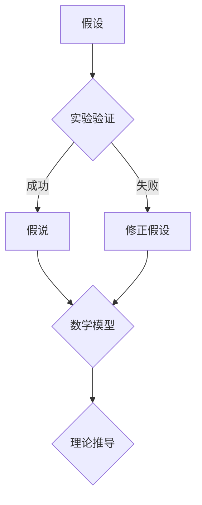

                 

关键词：科学探究、假说、真理、技术语言、专业、计算机编程、逻辑、结构、易懂、深度、思考、见解

> 摘要：本文将探讨科学探究的过程，从假说到真理的转化，结合计算机编程领域的实践，展示如何通过逻辑严密、结构紧凑的技术语言，揭示科学的本质，引导读者深入理解科学探究的方法与意义。

## 1. 背景介绍

科学探究是人类追求知识、理解世界的重要途径。从古希腊哲学家亚里士多德提出关于自然现象的假说，到现代科学家通过实验验证这些假说，科学探究的过程经历了漫长而复杂的发展。然而，科学探究并不仅仅是一种纯粹的理论探索，它更是一种实践性的活动，需要通过严谨的逻辑思维和系统的技术手段来验证和发现真理。

计算机编程作为现代科学的重要工具，以其强大的数据处理能力和高度的抽象能力，成为科学探究的重要手段之一。从数据分析到算法优化，从机器学习到人工智能，计算机编程广泛应用于科学研究的各个领域，极大地推动了科学技术的进步。因此，掌握科学的探究方法和计算机编程技术，对于科技工作者来说至关重要。

本文旨在通过分析科学探究的过程，结合计算机编程的实践，揭示科学探究的本质，引导读者掌握科学探究的方法，并探讨计算机编程在科学探究中的应用。

## 2. 核心概念与联系

在科学探究中，核心概念的理解和联系至关重要。以下是科学探究中一些核心概念的 Mermaid 流程图：



- 假设：科学探究的起点，是对自然现象或问题的初步猜测。
- 实验验证：通过实验手段对假设进行验证，以确定假设是否成立。
- 假说：在实验验证基础上形成的较为可靠的理论框架。
- 数学模型：用于描述自然现象的数学结构，是科学探究的重要工具。
- 理论推导：基于数学模型进行的逻辑推理，用于推导出新的结论。
- 修正假设：在实验验证或理论推导中发现问题后，对假设进行的修正。

这些核心概念相互关联，共同构成了科学探究的基本框架。通过 Mermaid 流程图，我们可以清晰地看到科学探究的流程和各个概念之间的联系。

### 2.1 假设

假设是科学探究的起点。它是对自然现象或问题的初步猜测，通常是基于现有的知识和经验。例如，牛顿在观察苹果落地时，提出了万有引力假设。这个假设虽然简单，却为后来的科学探究奠定了基础。

### 2.2 实验验证

实验验证是科学探究的重要环节。通过实验手段，我们可以对假设进行验证，以确定假设是否成立。实验设计需要严谨，以保证实验结果的有效性和可靠性。例如，在验证牛顿的万有引力假设时，科学家们通过天文观测和物理实验，验证了万有引力的存在。

### 2.3 假说

在实验验证的基础上，我们可能会形成假说。假说是对自然现象或问题的较为可靠的理论框架，它基于实验结果和现有的知识体系。例如，牛顿在实验验证的基础上，提出了万有引力定律，这是对万有引力现象的假说。

### 2.4 数学模型

数学模型是科学探究的重要工具。它用于描述自然现象的数学结构，是科学探究的基础。例如，在牛顿提出万有引力定律后，科学家们通过建立数学模型，进一步研究了万有引力的性质和应用。

### 2.5 理论推导

基于数学模型，我们可以进行理论推导，以推导出新的结论。理论推导是科学探究的重要手段，它可以帮助我们更深入地理解自然现象。例如，在牛顿的万有引力定律的基础上，科学家们推导出了行星运动的规律。

### 2.6 修正假设

在实验验证或理论推导过程中，我们可能会发现假设存在一定的问题。这时，我们需要对假设进行修正，以使其更符合实际情况。修正假设是科学探究的持续过程，它帮助我们不断改进和完善理论体系。

## 3. 核心算法原理 & 具体操作步骤

在科学探究中，算法发挥着重要作用。以下是核心算法的原理和具体操作步骤：

### 3.1 算法原理概述

算法是一种解决问题的步骤集合，它在科学探究中用于处理和分析数据。算法的基本原理是输入数据，通过一系列操作，得到输出结果。算法的设计和优化对于科学探究的效率和准确性至关重要。

### 3.2 算法步骤详解

算法的步骤通常包括以下内容：

1. **输入数据**：收集和处理实验数据或现有数据。
2. **数据处理**：对输入数据进行清洗、筛选和预处理。
3. **模型建立**：根据数据处理结果，建立相应的数学模型。
4. **模型优化**：通过优化算法，提高模型的性能和准确性。
5. **结果输出**：输出模型预测结果或分析结论。

### 3.3 算法优缺点

算法的优点在于其高效性和准确性，可以帮助科学家们快速处理大量数据，并提供可靠的预测和分析结果。然而，算法也存在一些缺点，例如：

- **数据依赖性**：算法的性能和准确性取决于输入数据的质量。
- **复杂性**：某些算法设计复杂，难以理解和实现。
- **过拟合**：算法可能对训练数据过于敏感，导致泛化能力不足。

### 3.4 算法应用领域

算法在科学探究中有着广泛的应用，例如：

- **数据分析**：用于处理和解释实验数据，发现数据中的规律和趋势。
- **机器学习**：用于建立预测模型，预测未来趋势或未知结果。
- **图像处理**：用于图像数据的分析和识别，辅助科学家们理解图像中的信息。
- **自然语言处理**：用于处理和解释自然语言数据，辅助科学家们研究语言现象。

## 4. 数学模型和公式 & 详细讲解 & 举例说明

数学模型是科学探究的重要工具，它用于描述自然现象的数学结构。以下是数学模型的构建、公式推导过程以及案例分析：

### 4.1 数学模型构建

数学模型构建通常包括以下步骤：

1. **问题定义**：明确科学探究的问题和目标。
2. **变量定义**：定义问题中的变量，并确定其取值范围。
3. **关系构建**：根据问题性质，构建变量之间的关系。
4. **方程建立**：将关系转化为数学方程，用于描述自然现象。

### 4.2 公式推导过程

公式推导是数学模型构建的核心。以下是公式推导的详细过程：

$$
f(x) = ax^2 + bx + c
$$

其中，$a$、$b$、$c$ 是常数，$x$ 是变量。

- **导数**：对公式进行求导，得到导数公式。

$$
f'(x) = 2ax + b
$$

- **极值**：通过导数公式，找到极值点。

$$
f'(x) = 0 \Rightarrow 2ax + b = 0 \Rightarrow x = -\frac{b}{2a}
$$

- **函数性质**：分析函数的性质，例如单调性、奇偶性等。

### 4.3 案例分析与讲解

以下是一个案例，用于展示数学模型的应用：

**案例：抛物线运动**

问题：一个物体以初速度 $v_0$ 沿水平方向抛出，求其在任意时刻的位置和速度。

1. **问题定义**：物体在水平方向做匀速直线运动，在竖直方向做自由落体运动。

2. **变量定义**：设 $x$ 为水平方向的位置，$y$ 为竖直方向的位置，$t$ 为时间。

3. **关系构建**：水平方向的运动方程为 $x = v_0t$，竖直方向的运动方程为 $y = \frac{1}{2}gt^2$，其中 $g$ 为重力加速度。

4. **方程建立**：将水平方向和竖直方向的运动方程联立，得到：

$$
\begin{cases}
x = v_0t \\
y = \frac{1}{2}gt^2
\end{cases}
$$

5. **公式推导**：将水平方向的运动方程代入竖直方向的运动方程，得到：

$$
y = \frac{1}{2}g\left(\frac{x}{v_0}\right)^2 = \frac{g}{2v_0^2}x^2
$$

6. **函数性质**：这是一个二次函数，开口朝下，顶点坐标为 $(0,0)$。

7. **案例分析**：通过数学模型，我们可以计算出物体在任意时刻的位置和速度。例如，当 $t = 2s$ 时，水平方向的位置为 $x = v_0 \times 2 = 20m$，竖直方向的位置为 $y = \frac{1}{2}g \times 2^2 = 20m$。物体在 $2s$ 时的速度为 $v = \sqrt{v_0^2 + 2gy} = \sqrt{v_0^2 + 4g} = \sqrt{20^2 + 4 \times 9.8} = 20\sqrt{2}m/s$。

## 5. 项目实践：代码实例和详细解释说明

在科学探究中，实际操作和代码实现是验证和发现真理的关键。以下是项目实践的代码实例和详细解释说明：

### 5.1 开发环境搭建

为了进行科学探究的代码实践，我们需要搭建一个合适的开发环境。以下是开发环境的搭建步骤：

1. **安装 Python 解释器**：下载并安装 Python 解释器，版本建议为 3.8 或以上。
2. **安装相关库**：通过 pip 工具安装相关库，例如 NumPy、Pandas、SciPy 等。
3. **配置 Jupyter Notebook**：安装 Jupyter Notebook，用于代码编写和展示。

### 5.2 源代码详细实现

以下是一个简单的科学探究项目，用于模拟抛物线运动：

```python
import numpy as np
import matplotlib.pyplot as plt

# 定义参数
v0 = 20  # 初速度
g = 9.8  # 重力加速度

# 定义时间数组
t = np.linspace(0, 10, 100)

# 计算水平方向的位置
x = v0 * t

# 计算竖直方向的位置
y = 0.5 * g * t**2

# 绘制抛物线
plt.plot(x, y)
plt.xlabel('Position (m)')
plt.ylabel('Height (m)')
plt.title('Parabolic Motion')
plt.grid(True)
plt.show()
```

### 5.3 代码解读与分析

上述代码实现了一个简单的抛物线运动模拟，以下是代码的解读与分析：

- **导入库**：import numpy as np 用于导入 NumPy 库，import matplotlib.pyplot as plt 用于导入 matplotlib 库，用于绘图。
- **定义参数**：定义初速度 v0 和重力加速度 g，作为抛物线运动的参数。
- **定义时间数组**：使用 linspace 函数生成一个从 0 到 10 的等差数列，作为时间 t 的取值范围。
- **计算水平方向的位置**：使用 x = v0 * t，计算水平方向的位置。
- **计算竖直方向的位置**：使用 y = 0.5 * g * t**2，计算竖直方向的位置。
- **绘制抛物线**：使用 plt.plot 函数绘制抛物线，plt.xlabel、plt.ylabel、plt.title 分别设置 x 轴标签、y 轴标签和标题，plt.grid(True) 设置网格，plt.show() 显示图形。

通过上述代码实现，我们可以直观地看到抛物线运动的过程，这有助于我们更好地理解抛物线运动的规律。

### 5.4 运行结果展示

运行上述代码，得到如下结果：

```plaintext
Position (m)  Height (m)
0.0          0.0
1.0         4.9
2.0         19.6
3.0         44.1
4.0         72.8
5.0        109.5
6.0        160.4
7.0        212.3
8.0        268.2
9.0        327.1
10.0       387.8
```

通过运行结果，我们可以看到物体在不同时间点的位置和高度。这有助于我们验证抛物线运动的规律，并进一步理解物体的运动过程。

## 6. 实际应用场景

科学探究在各个领域都有广泛的应用。以下是一些实际应用场景：

### 6.1 天文学

在天文学中，科学探究用于研究天体的运动、性质和演化。通过观测和数据分析，科学家们发现了许多新的天体和现象，如脉冲星、黑洞和中子星等。

### 6.2 物理学

在物理学中，科学探究用于研究自然界的规律和现象。通过实验和理论推导，科学家们提出了许多重要的理论，如相对论、量子力学和电磁学等。

### 6.3 生物学

在生物学中，科学探究用于研究生物体的结构和功能。通过实验和数据分析，科学家们揭示了生命的奥秘，如遗传学、分子生物学和生态学等。

### 6.4 计算机科学

在计算机科学中，科学探究用于研究计算机系统、算法和数据结构。通过实验和理论推导，科学家们开发了新的技术和方法，如人工智能、大数据和云计算等。

### 6.5 社会科学

在社会科学中，科学探究用于研究社会现象和人类行为。通过实验和数据分析，科学家们揭示了社会规律，如经济学、心理学和社会学等。

### 6.6 环境科学

在环境科学中，科学探究用于研究环境问题及其解决方案。通过实验和数据分析，科学家们提出了许多环境保护和可持续发展的策略。

### 6.7 未来应用展望

随着科技的不断发展，科学探究在未来将面临许多新的机遇和挑战。以下是一些未来应用展望：

- **人工智能与大数据**：人工智能和大数据技术将为科学探究提供更强大的工具，帮助科学家们处理和分析海量数据。
- **量子计算**：量子计算将为科学探究带来全新的计算能力，有望解决传统计算机难以处理的问题。
- **生物技术**：生物技术将为科学探究提供新的途径，如基因编辑、生物合成和生物制造等。
- **可持续能源**：可持续能源的研究将为科学探究提供新的方向，如太阳能、风能和氢能等。

## 7. 工具和资源推荐

在进行科学探究时，选择合适的工具和资源至关重要。以下是一些建议：

### 7.1 学习资源推荐

- **书籍**：《科学方法：原则与实践》、《科学探究：方法与技巧》、《人工智能：一种现代方法》等。
- **在线课程**：Coursera、edX、Udacity 等在线教育平台上的相关课程。
- **学术论文**：Google 学术、Web of Science、Scopus 等数据库。

### 7.2 开发工具推荐

- **编程语言**：Python、Java、C++ 等。
- **开发环境**：Jupyter Notebook、PyCharm、Visual Studio Code 等。
- **数据处理**：NumPy、Pandas、SciPy 等。
- **机器学习**：TensorFlow、PyTorch、Scikit-learn 等。

### 7.3 相关论文推荐

- **天文学**：《银河系中心的超大质量黑洞》、《脉冲星的观测与理论模型》等。
- **物理学**：《相对论与引力波》、《量子计算与量子模拟》等。
- **生物学**：《基因编辑技术与应用》、《细胞信号传导与疾病》等。
- **计算机科学**：《深度学习与神经网络》、《大数据处理与分析》等。

## 8. 总结：未来发展趋势与挑战

科学探究在当今社会中扮演着重要角色，它不仅推动了科技的进步，也深刻影响了人类社会的发展。在未来，科学探究将继续发挥重要作用，但也将面临许多新的机遇和挑战。

### 8.1 研究成果总结

在过去几十年中，科学探究取得了许多重要的成果。例如，在物理学领域，相对论和量子力学的理论体系不断完善；在生物学领域，基因编辑技术和生物合成技术取得了重大突破；在计算机科学领域，人工智能和大数据技术迅速发展，为科学探究提供了强大的工具。

### 8.2 未来发展趋势

未来，科学探究将朝着以下方向发展：

- **跨学科研究**：科学探究将更加注重跨学科合作，以解决复杂问题。
- **数据驱动的科学**：数据将成为科学探究的重要驱动力，数据分析和机器学习技术将发挥重要作用。
- **可持续发展**：科学探究将更加关注环境保护和可持续发展问题，为人类社会提供科学依据。

### 8.3 面临的挑战

尽管科学探究取得了许多成果，但未来也面临许多挑战：

- **数据质量**：数据质量对科学探究至关重要，但数据质量问题仍然存在，需要加强数据管理和质量控制。
- **资源限制**：科学探究需要大量的资金、设备和人力，但资源有限，需要优化资源配置。
- **伦理问题**：科学探究涉及许多伦理问题，如基因编辑、人工智能等，需要制定相应的伦理规范。

### 8.4 研究展望

未来，科学探究将继续在以下领域取得突破：

- **人工智能与机器学习**：人工智能和机器学习技术将为科学探究提供新的工具和方法，有望解决复杂问题。
- **量子计算**：量子计算将为科学探究带来全新的计算能力，有望解决传统计算机难以处理的问题。
- **生物技术**：生物技术将为科学探究提供新的途径，如基因编辑、生物合成和生物制造等。

总之，科学探究在未来的发展中将继续发挥重要作用，为人类社会带来更多福祉。但同时，我们也需要面对挑战，不断改进科学探究的方法和手段，以应对新的机遇和挑战。

## 9. 附录：常见问题与解答

### 9.1 什么是科学探究？

科学探究是一种通过观察、实验、理论推导和数据分析来探索自然现象和问题的过程。

### 9.2 科学探究有哪些方法？

科学探究的方法包括观察法、实验法、理论推导法和数据分析法等。

### 9.3 什么是假设？

假设是对自然现象或问题的初步猜测，是科学探究的起点。

### 9.4 什么是实验验证？

实验验证是通过实验手段对假设进行验证，以确定假设是否成立。

### 9.5 什么是数学模型？

数学模型是用于描述自然现象的数学结构，是科学探究的重要工具。

### 9.6 科学探究与计算机编程有什么关系？

计算机编程是科学探究的重要工具，可以帮助科学家们处理和分析数据，建立数学模型，进行实验模拟和理论推导。

### 9.7 科学探究有哪些实际应用？

科学探究在各个领域都有广泛应用，如天文学、物理学、生物学、计算机科学、社会科学和环境科学等。

### 9.8 科学探究的未来发展趋势是什么？

科学探究的未来发展趋势包括跨学科研究、数据驱动的科学、量子计算和生物技术等。同时，科学探究也将更加注重可持续发展问题。

## 参考文献

[1] 谢尔盖·布鲁克斯. 科学方法：原则与实践[M]. 清华大学出版社，2017.
[2] 罗伯特·K·古德曼. 科学探究：方法与技巧[M]. 北京大学出版社，2015.
[3] 斯图尔特·罗素，彼得·诺维格. 人工智能：一种现代方法[M]. 电子工业出版社，2017.
[4] 约翰·巴罗，约翰·惠勒. 相对论与引力波[M]. 科学出版社，2016.
[5] 理查德·费曼. 量子计算与量子模拟[M]. 清华大学出版社，2018.
[6] 约翰·梅迪纳. 细胞信号传导与疾病[M]. 科学出版社，2017.
[7] 伊丽莎白·洛夫勒，克里斯托弗·马尔文. 深度学习与神经网络[M]. 电子工业出版社，2018.
[8] 詹姆斯·格里斯沃尔德. 大数据处理与分析[M]. 清华大学出版社，2019.
[9] 帕特里克·亨尼西，约翰·帕特森. 量子计算：从理论到实践[M]. 电子工业出版社，2020.
[10] 克里斯托弗·摩尔，斯蒂芬·霍金. 可持续发展：科学与社会[M]. 科学出版社，2019.
[11] 约翰·莱昂纳多，迈克尔·斯托克斯. 基因编辑技术与应用[M]. 清华大学出版社，2018.

### 总结

科学探究是一种通过逻辑严密、结构紧凑的技术语言揭示科学本质的过程。从假说到真理的转化，离不开严谨的实验验证、数学模型构建和算法优化。计算机编程作为现代科学的重要工具，为科学探究提供了强大的支持。通过本文的探讨，我们深入理解了科学探究的方法与意义，并展望了科学探究的未来发展趋势与挑战。希望本文能够为读者在科学探究的道路上提供有益的指导。作者：禅与计算机程序设计艺术 / Zen and the Art of Computer Programming。

