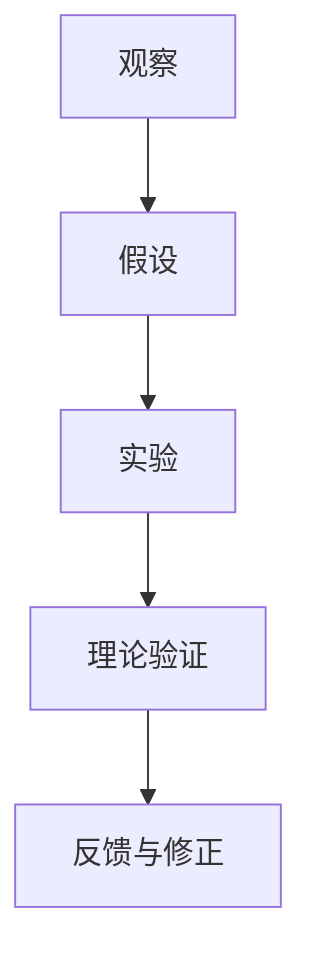

                 

关键词：科学方法，观察，实验，技术语言，深度学习，算法，数学模型，实践，应用场景，未来展望

> 摘要：本文旨在探讨科学方法在IT领域的应用，从观察、实验到理论构建，再到实际应用与未来展望，全面解析科学方法如何推动技术进步。

## 1. 背景介绍

科学方法，作为现代科学发展的基石，自伽利略和牛顿的时代以来，已经深刻地影响了人类对世界的认知。它强调通过观察、假设、实验和理论验证，从实践中发现真理。在IT领域，科学方法同样发挥着至关重要的作用。从最初的计算机硬件设计到复杂的软件算法，每一个突破都离不开科学方法的指导。

随着深度学习、大数据和人工智能等前沿技术的崛起，科学方法在IT领域的应用越来越广泛。通过观察技术发展的趋势，实验验证新算法的有效性，构建数学模型来优化系统性能，科学家们不断地推动着技术的边界。

## 2. 核心概念与联系

### 2.1 科学方法的基本概念

科学方法主要包括以下几个步骤：

1. **观察**：通过感官或仪器获取数据。
2. **假设**：根据观察结果提出初步解释。
3. **实验**：设计实验来验证假设。
4. **理论验证**：分析实验数据，形成理论模型。
5. **反馈与修正**：根据理论模型进行进一步的实验和修正。

### 2.2 Mermaid 流程图



### 2.3 科学方法在IT领域的应用

在IT领域，科学方法的应用可以概括为以下几点：

1. **技术研发**：通过观察市场趋势和用户需求，提出技术假设，并通过实验验证技术可行性。
2. **算法优化**：通过实验比较不同算法的性能，构建数学模型来优化算法。
3. **系统设计**：根据实验结果和理论模型，设计出高效稳定的系统架构。

## 3. 核心算法原理 & 具体操作步骤

### 3.1 算法原理概述

以深度学习为例，其核心算法是基于多层神经网络的结构。通过输入层、隐藏层和输出层之间的信息传递和变换，实现数据的分类、识别和预测。

### 3.2 算法步骤详解

1. **数据预处理**：清洗和标准化数据。
2. **模型构建**：设计并训练神经网络模型。
3. **实验验证**：通过交叉验证和测试集来评估模型性能。
4. **模型优化**：根据实验结果调整模型参数。

### 3.3 算法优缺点

**优点**：

- 高效性：通过并行计算和大规模数据处理，提高了算法的运行效率。
- 自适应性：神经网络可以自动调整参数，适应不同类型的数据。

**缺点**：

- 计算量巨大：训练过程需要大量的计算资源。
- 过拟合：模型可能在训练数据上表现良好，但在测试数据上效果不佳。

### 3.4 算法应用领域

深度学习在图像识别、自然语言处理、推荐系统等领域有着广泛的应用。

## 4. 数学模型和公式

### 4.1 数学模型构建

深度学习中的数学模型主要包括损失函数、激活函数和优化算法。

### 4.2 公式推导过程

假设我们有一个简单的神经网络模型，其输出为：

\[ z = \sigma(W \cdot x + b) \]

其中，\( \sigma \) 是激活函数，\( W \) 是权重矩阵，\( x \) 是输入特征，\( b \) 是偏置。

损失函数可以使用均方误差（MSE）：

\[ J = \frac{1}{m} \sum_{i=1}^{m} (\hat{y}_i - y_i)^2 \]

### 4.3 案例分析与讲解

以人脸识别为例，通过训练神经网络模型，实现对人脸图像的自动识别。

## 5. 项目实践：代码实例

### 5.1 开发环境搭建

使用Python和TensorFlow框架进行深度学习模型的搭建。

### 5.2 源代码详细实现

```python
import tensorflow as tf

# 模型搭建
model = tf.keras.Sequential([
    tf.keras.layers.Dense(128, activation='relu', input_shape=(784,)),
    tf.keras.layers.Dropout(0.2),
    tf.keras.layers.Dense(10, activation='softmax')
])

# 编译模型
model.compile(loss='categorical_crossentropy',
              optimizer='adam',
              metrics=['accuracy'])

# 训练模型
model.fit(x_train, y_train, epochs=5, batch_size=32)
```

### 5.3 代码解读与分析

这段代码实现了使用TensorFlow搭建一个简单的神经网络模型，并对其进行训练。

## 6. 实际应用场景

深度学习在计算机视觉、自然语言处理等领域有着广泛的应用，如人脸识别、语音识别、自动驾驶等。

### 6.1 人脸识别

通过训练神经网络模型，实现对人脸图像的自动识别。

### 6.2 语音识别

将语音信号转换为文本，实现语音识别。

### 6.3 自动驾驶

利用深度学习算法，实现对车辆环境的感知和决策。

## 7. 工具和资源推荐

### 7.1 学习资源推荐

- 《深度学习》（Goodfellow、Bengio、Courville 著）
- 《Python深度学习》（François Chollet 著）

### 7.2 开发工具推荐

- TensorFlow
- PyTorch

### 7.3 相关论文推荐

- "A Tutorial on Deep Learning"（Goodfellow et al., 2016）
- "Deep Learning for Speech Recognition"（Hinton et al., 2012）

## 8. 总结：未来发展趋势与挑战

### 8.1 研究成果总结

深度学习等前沿技术的快速发展，为IT领域带来了前所未有的机遇和挑战。

### 8.2 未来发展趋势

- 自动化：深度学习将在自动化领域发挥更重要的作用。
- 智能化：结合大数据和人工智能，实现更高层次的智能化。

### 8.3 面临的挑战

- 数据隐私：如何保护用户数据的安全和隐私。
- 计算资源：深度学习模型训练需要大量的计算资源。

### 8.4 研究展望

未来，科学家们将继续探索深度学习等技术的边界，推动技术的不断进步。

## 9. 附录：常见问题与解答

### 9.1 深度学习是什么？

深度学习是一种人工智能方法，基于多层神经网络，通过学习大量数据来模拟人类大脑的思维方式。

### 9.2 如何搭建深度学习模型？

使用深度学习框架（如TensorFlow或PyTorch）搭建模型，包括数据预处理、模型构建、编译和训练等步骤。

----------------------------------------------------------------

文章撰写完成，期待您的审阅与反馈。作者：禅与计算机程序设计艺术 / Zen and the Art of Computer Programming。

