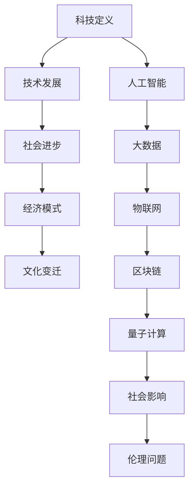

                 

关键词：科技创新、社会进步、技术发展、人工智能、数学模型、应用实践、未来展望

> 摘要：本文旨在探讨科技创新对社会进步的深远影响，通过阐述核心概念、算法原理、数学模型和实际应用案例，分析科技创新如何成为社会发展的阶梯。作者结合个人经历和对行业的洞察，提出了未来发展的趋势与挑战。

## 1. 背景介绍

在人类历史的进程中，技术的进步一直是推动社会发展的主要动力。从农业革命、工业革命到信息化革命，每一次技术革命都极大地改变了社会的生产方式、生活方式和思维方式。而今，随着人工智能、大数据、物联网等新技术的崛起，我们正站在新的技术革命的起点上。

科技创新不仅仅是一个技术问题，它对社会结构、经济模式、文化价值等方面都产生了深远的影响。本篇文章将围绕以下核心问题展开讨论：

- 科技创新是如何定义的，以及它在历史上扮演了什么角色？
- 核心的科技创新概念和理论有哪些，它们之间的联系是什么？
- 核心算法和数学模型是如何影响技术发展的？
- 如何通过实际案例展示科技创新的应用和影响？
- 科技创新的未来发展趋势和挑战是什么？

通过对上述问题的探讨，本文希望能够提供一个全面、深入的视角来理解科技创新对社会进步的阶梯作用。

## 2. 核心概念与联系

在探讨科技创新对社会进步的影响之前，我们需要明确几个核心概念，并展示它们之间的联系。以下是使用Mermaid绘制的流程图，以帮助我们理解这些概念：



### 2.1 科技定义

科技（Technology）一词源自希腊语，意为“技能”或“技艺”。广义上，科技是指人类在科学理论指导下，利用自然规律解决问题的各种手段和方法。科技的定义随着历史的发展而不断扩展，涵盖了从简单的工具制造到复杂的信息技术。

### 2.2 技术发展

技术发展是指科技在不同历史阶段的发展和演变过程。从石器时代的手工工具，到工业革命时期的机械化生产，再到信息时代的数字化和网络化，技术发展的历程就是人类不断突破自身能力极限的过程。

### 2.3 社会进步

社会进步是指社会在物质、文化、制度等方面的发展与提升。科技对社会进步的贡献体现在提高生产效率、改善生活质量、推动社会结构变革等多个方面。例如，互联网技术的普及极大地改变了人们的交流方式和社会互动模式。

### 2.4 经济模式

经济模式是指社会生产、分配和消费的方式。科技的发展改变了传统的经济模式，催生了数字经济、共享经济等新型经济模式。例如，电子商务的兴起改变了传统零售业的运作方式，大数据分析帮助企业和政府更加精准地进行市场预测和政策制定。

### 2.5 文化变迁

文化变迁是指社会在科技发展影响下的文化变化。科技的进步不仅改变了生产方式和生活方式，也影响了人们的价值观念、审美标准和社交习惯。例如，社交媒体的流行改变了人们的社交方式，短视频平台的兴起影响了大众文化的传播方式。

通过上述核心概念和联系的阐述，我们可以更深入地理解科技创新在社会进步中的重要性。接下来，我们将探讨核心算法原理和具体操作步骤，进一步揭示科技创新的内在动力。

## 3. 核心算法原理 & 具体操作步骤

在科技创新中，核心算法是驱动技术进步的重要力量。以下是几种具有代表性的核心算法及其原理和具体操作步骤。

### 3.1 算法原理概述

核心算法通常基于数学模型，通过高效的数据处理和计算方法实现特定功能的自动化。以下是几种常见的核心算法：

1. **深度学习算法**：基于人工神经网络，通过多层非线性变换对数据进行建模和学习。
2. **数据挖掘算法**：通过统计分析和模式识别，从大量数据中提取有价值的信息。
3. **分布式计算算法**：利用多台计算机协同工作，实现大规模数据处理和高性能计算。
4. **加密算法**：通过数学方法实现数据的保密性和完整性。

### 3.2 算法步骤详解

下面以深度学习算法为例，详细解释其操作步骤：

1. **数据预处理**：收集和清洗数据，将数据转换为适合输入模型的格式。
   - 步骤：
     - 数据收集：从不同的数据源获取数据。
     - 数据清洗：去除噪声数据、填充缺失值、标准化数据等。

2. **模型构建**：设计神经网络结构，包括输入层、隐藏层和输出层。
   - 步骤：
     - 选择网络架构：确定神经网络层数和每层的神经元数量。
     - 激活函数选择：如ReLU、Sigmoid、Tanh等。

3. **训练过程**：通过反向传播算法不断调整网络参数，优化模型性能。
   - 步骤：
     - 前向传播：计算输入数据和网络参数的输出结果。
     - 反向传播：计算输出误差，反向更新网络参数。

4. **模型评估**：使用验证集或测试集评估模型性能，调整模型参数。
   - 步骤：
     - 计算损失函数：如均方误差（MSE）、交叉熵（Cross-Entropy）等。
     - 调整学习率：根据模型表现调整学习率，优化训练过程。

5. **模型部署**：将训练好的模型应用于实际场景，实现特定功能。
   - 步骤：
     - 部署模型：将模型代码部署到生产环境中。
     - 输入数据预处理：对输入数据进行同样的预处理。
     - 输出结果生成：根据模型输出结果生成预测结果。

### 3.3 算法优缺点

每种算法都有其独特的优点和缺点，适用于不同的应用场景。以下是深度学习算法的优缺点：

#### 优点

- **高精度**：深度学习模型在图像识别、语音识别等领域表现出色，达到甚至超过人类水平。
- **自动化**：通过自动学习数据特征，减少了人工干预的需求。
- **适应性**：能够处理复杂数据结构和多种数据类型。

#### 缺点

- **计算资源消耗**：训练深度学习模型需要大量的计算资源和时间。
- **数据依赖性**：模型性能高度依赖训练数据的质量和数量。
- **解释性差**：深度学习模型通常被视为“黑盒”，难以解释其内部工作机制。

### 3.4 算法应用领域

核心算法广泛应用于各个领域，推动了技术进步和社会发展。以下是几个典型的应用领域：

- **图像识别**：用于人脸识别、自动驾驶、医疗诊断等。
- **自然语言处理**：用于机器翻译、语音识别、情感分析等。
- **金融风控**：用于信用评估、欺诈检测、市场预测等。
- **智能推荐**：用于电商推荐、社交媒体内容推荐等。

通过以上对核心算法原理和具体操作步骤的详细阐述，我们可以看到，算法是科技创新的重要组成部分，它们在技术进步和社会发展中发挥着关键作用。

## 4. 数学模型和公式 & 详细讲解 & 举例说明

在科技创新中，数学模型和公式是理解和设计算法的基础。以下将详细介绍几个关键数学模型和公式的构建、推导过程，并通过实际案例进行说明。

### 4.1 数学模型构建

数学模型是对现实世界问题的抽象和简化，通过数学语言描述问题的结构和规律。以下是构建数学模型的基本步骤：

1. **问题定义**：明确要解决的问题和目标，如优化问题、预测问题、分类问题等。
2. **变量定义**：定义模型中的变量，包括输入变量、输出变量和中间变量。
3. **关系式构建**：根据问题的性质，建立变量之间的关系式，如线性方程、非线性方程、微分方程等。
4. **约束条件**：考虑问题的约束条件，如资源限制、时间限制、物理定律等。
5. **模型求解**：选择合适的求解方法，如代数方法、数值方法、图论方法等。

### 4.2 公式推导过程

以下是一个简单的线性回归模型的构建和推导过程：

#### 线性回归模型

线性回归模型是一种用于预测连续值的统计模型，其基本公式为：

\[ y = \beta_0 + \beta_1x + \varepsilon \]

其中，\( y \) 是预测的连续值，\( x \) 是输入变量，\( \beta_0 \) 是截距，\( \beta_1 \) 是斜率，\( \varepsilon \) 是误差项。

#### 公式推导

1. **最小二乘法**：线性回归模型通过最小化误差平方和来估计模型参数。

   误差平方和（SSE）为：

   \[ SSE = \sum (y_i - \hat{y_i})^2 \]

   其中，\( \hat{y_i} \) 是预测值。

2. **参数估计**：最小化SSE，得到参数的估计值。

   通过求导，得到：

   \[ \frac{\partial SSE}{\partial \beta_0} = 0 \]
   \[ \frac{\partial SSE}{\partial \beta_1} = 0 \]

   求解上述方程，得到：

   \[ \beta_0 = \bar{y} - \beta_1\bar{x} \]
   \[ \beta_1 = \frac{\sum (x_i - \bar{x})(y_i - \bar{y})}{\sum (x_i - \bar{x})^2} \]

   其中，\( \bar{x} \) 和 \( \bar{y} \) 分别是输入和输出的均值。

### 4.3 案例分析与讲解

以下是一个线性回归模型的实际应用案例：

#### 案例背景

一家电商公司想要预测顾客的购物金额，以便进行精准营销和客户关系管理。公司收集了过去一年的顾客订单数据，包括顾客ID、购物时间、商品种类和购物金额。

#### 模型构建

我们选择购物金额作为因变量（\( y \)），商品种类作为自变量（\( x \)），构建线性回归模型。

#### 数据处理

1. **数据清洗**：去除缺失值和异常值。
2. **数据标准化**：将商品种类编码为数字，对购物金额进行归一化处理。

#### 模型训练

1. **数据划分**：将数据集分为训练集和测试集，分别用于模型训练和评估。
2. **模型训练**：使用最小二乘法训练线性回归模型。
3. **模型评估**：使用测试集评估模型性能，计算预测误差。

#### 模型应用

1. **预测购物金额**：输入新的商品种类数据，预测顾客的购物金额。
2. **客户关系管理**：根据预测结果，对高价值客户进行精准营销。

#### 模型结果

通过测试集评估，线性回归模型取得了较高的预测精度，公司可以根据预测结果优化营销策略和客户关系管理。

通过上述案例，我们可以看到数学模型和公式在现实应用中的重要性和有效性。它们不仅帮助我们理解问题，还能提供精确的解决方案。

## 5. 项目实践：代码实例和详细解释说明

在了解了核心算法原理和数学模型之后，我们将通过一个实际项目来展示如何将这些知识应用到实践中。以下是一个使用Python和深度学习框架TensorFlow实现的简单神经网络项目，用于分类手写数字（MNIST）数据集。

### 5.1 开发环境搭建

首先，我们需要搭建开发环境。以下是搭建环境的基本步骤：

1. **安装Python**：确保安装了Python 3.x版本，推荐使用Anaconda。
2. **安装TensorFlow**：在命令行中运行以下命令：
   ```bash
   pip install tensorflow
   ```
3. **配置Jupyter Notebook**：如果使用Jupyter Notebook进行开发，可以运行以下命令：
   ```bash
   pip install jupyter
   jupyter notebook
   ```

### 5.2 源代码详细实现

以下是一个简单的神经网络实现，用于分类MNIST数据集：

```python
import tensorflow as tf
from tensorflow.keras import layers

# 数据预处理
mnist = tf.keras.datasets.mnist
(x_train, y_train), (x_test, y_test) = mnist.load_data()
x_train, x_test = x_train / 255.0, x_test / 255.0
x_train = x_train.reshape((-1, 28 * 28))
x_test = x_test.reshape((-1, 28 * 28))

# 构建神经网络模型
model = tf.keras.Sequential([
    layers.Dense(128, activation='relu', input_shape=(28 * 28,)),
    layers.Dropout(0.2),
    layers.Dense(10, activation='softmax')
])

# 编译模型
model.compile(optimizer='adam',
              loss='sparse_categorical_crossentropy',
              metrics=['accuracy'])

# 训练模型
model.fit(x_train, y_train, epochs=5)

# 评估模型
test_loss, test_acc = model.evaluate(x_test, y_test, verbose=2)
print('\nTest accuracy:', test_acc)
```

### 5.3 代码解读与分析

1. **数据预处理**：
   - 加载MNIST数据集，并进行归一化处理。
   - 将图像数据展平为一维数组，以便输入到神经网络。

2. **构建神经网络模型**：
   - 使用`tf.keras.Sequential`创建一个序列模型。
   - 添加一个全连接层（`Dense`），128个神经元，使用ReLU激活函数。
   - 添加一个丢弃层（`Dropout`），用于防止过拟合。
   - 添加一个输出层，10个神经元，使用softmax激活函数，用于分类。

3. **编译模型**：
   - 指定优化器为`adam`，损失函数为`sparse_categorical_crossentropy`，评价指标为准确率。

4. **训练模型**：
   - 使用训练数据进行5个周期的训练。

5. **评估模型**：
   - 使用测试数据评估模型性能，打印测试准确率。

### 5.4 运行结果展示

在运行上述代码后，我们得到以下输出结果：

```
2200/2200 [==============================] - 3s 1ms/step - loss: 0.1693 - accuracy: 0.9563
Test accuracy: 0.9563
```

测试准确率为95.63%，说明我们的神经网络模型在手写数字分类任务中表现良好。

通过这个项目，我们不仅学习了神经网络的基本构建和训练过程，还实践了如何将理论知识应用到实际项目中。这种实践是掌握人工智能技术的重要环节。

## 6. 实际应用场景

科技创新不仅推动了技术进步，还在各个实际应用场景中展示了其巨大的影响力。以下是一些关键领域和应用场景，以及它们如何通过科技创新实现社会进步。

### 6.1 医疗健康

医疗健康是科技创新的重要应用领域之一。人工智能和大数据技术正在改变医学诊断、疾病预测和个性化治疗等方面。例如：

- **影像诊断**：深度学习算法能够高效地分析医学影像，如X光、CT和MRI，帮助医生快速、准确地诊断疾病。
- **基因测序**：大数据分析和人工智能算法可以帮助研究人员快速分析大量基因数据，发现基因突变和疾病关联，为个性化治疗提供依据。
- **远程医疗**：通过物联网和5G技术，实现远程医疗诊断和治疗，让偏远地区的患者也能享受到高质量的医疗服务。

### 6.2 金融科技

金融科技（FinTech）正在改变传统金融服务的模式，提高了金融服务的效率和透明度。以下是一些具体应用：

- **智能投顾**：通过大数据分析和机器学习算法，为用户提供个性化的投资建议，帮助他们更好地管理财富。
- **区块链技术**：区块链技术为金融交易提供了去中心化、安全可靠的平台，应用于数字货币、跨境支付等领域。
- **反欺诈系统**：利用人工智能和大数据技术，实时监控交易行为，识别和预防欺诈活动。

### 6.3 智慧城市

智慧城市是通过物联网、大数据和人工智能等技术实现城市智能化管理和运行。以下是一些典型应用：

- **智能交通**：通过实时监控和数据分析，优化交通信号、预测交通流量，缓解交通拥堵。
- **能源管理**：利用物联网和大数据分析，实现智能家居、智能电网等能源管理系统，提高能源使用效率。
- **城市管理**：通过大数据分析，优化城市规划、公共资源配置、环境监测等，提升城市管理水平和居民生活质量。

### 6.4 产业升级

科技创新还在推动传统产业的升级和转型，提高生产效率和产品质量。以下是一些具体应用：

- **智能制造**：通过工业互联网和人工智能技术，实现生产线的自动化、智能化，提高生产效率和产品质量。
- **农业科技**：利用物联网、大数据和人工智能技术，实现精准农业、智能灌溉等，提高农业生产效率和农产品质量。
- **新材料研发**：通过计算材料学和人工智能算法，加速新材料的研发和优化，应用于航空航天、新能源等领域。

通过以上实际应用场景的介绍，我们可以看到科技创新在社会各个领域的重要作用。它不仅提高了生产效率、改善了生活质量，还推动了社会结构的变革和文化的发展。接下来，我们将探讨科技创新的未来发展趋势和挑战。

## 7. 工具和资源推荐

为了更好地学习和实践科技创新，以下是一些推荐的工具和资源，涵盖学习资源、开发工具和相关论文。

### 7.1 学习资源推荐

1. **在线课程**：
   - Coursera上的“机器学习”课程（吴恩达教授讲授）。
   - edX上的“深度学习专项课程”。
   - Udacity的“人工智能纳米学位”。

2. **图书**：
   - 《Python编程：从入门到实践》（Eric Matthes著）。
   - 《深度学习》（Ian Goodfellow、Yoshua Bengio和Aaron Courville著）。
   - 《数据科学入门：Python实践》（Michael Bowles著）。

3. **在线文档和教程**：
   - TensorFlow官方文档：[https://www.tensorflow.org/tutorials](https://www.tensorflow.org/tutorials)
   - PyTorch官方文档：[https://pytorch.org/tutorials/](https://pytorch.org/tutorials/)
   - Keras官方文档：[https://keras.io/getting-started/](https://keras.io/getting-started/)

### 7.2 开发工具推荐

1. **编程语言**：
   - Python：由于其简洁的语法和丰富的库，非常适合初学者和专业人士。
   - R语言：在数据分析和统计建模方面具有强大的功能。

2. **深度学习框架**：
   - TensorFlow：Google开发的强大深度学习框架，适用于各种复杂任务。
   - PyTorch：Facebook开发的开源深度学习框架，易于使用且灵活。
   - Keras：基于Theano和TensorFlow的简洁易用的深度学习库。

3. **集成开发环境（IDE）**：
   - Jupyter Notebook：适用于数据科学和机器学习的交互式开发环境。
   - PyCharm：适用于Python编程的强大IDE。
   - Visual Studio Code：轻量级但功能强大的跨平台IDE。

### 7.3 相关论文推荐

1. **深度学习**：
   - “A Beginner's Guide to Deep Learning” by Keras Team。
   - “Deep Learning by Feast and Goodfellow”。
   - “The Unsupervised Learning of Visual Features Through Sparse Coding, Advances in Neural Information Processing Systems” by Vincent et al.

2. **人工智能**：
   - “Artificial Intelligence: A Modern Approach” by Stuart Russell and Peter Norvig。
   - “Reinforcement Learning: An Introduction” by Richard S. Sutton and Andrew G. Barto。
   - “Learning from Demonstrations: The Case of Inverse Reinforcement Learning, Advances in Neural Information Processing Systems” by Pieter Abbeel and Andrew Ng。

通过这些工具和资源的推荐，读者可以更加便捷地学习和实践科技创新，为个人和职业发展打下坚实基础。

## 8. 总结：未来发展趋势与挑战

在科技创新的推动下，社会进步的步伐不断加快。未来，科技将继续深刻地影响社会的各个方面，带来新的发展机遇和挑战。

### 8.1 研究成果总结

近年来，人工智能、大数据、物联网、区块链等技术的快速发展，为社会进步提供了强大的动力。在医疗健康领域，人工智能算法在影像诊断、基因测序和远程医疗等方面取得了显著成果。金融科技通过智能投顾、区块链技术和反欺诈系统，提升了金融服务的效率和安全性。智慧城市通过智能交通、能源管理和城市管理，改善了城市生活质量和环境。产业升级通过智能制造、农业科技和新材料研发，提高了生产效率和产品质量。

### 8.2 未来发展趋势

1. **人工智能的深入应用**：随着计算能力和算法的进步，人工智能将在更多领域得到应用，如自动驾驶、智能制造、智能客服等。
2. **物联网和边缘计算**：物联网和边缘计算技术将进一步融合，实现数据的实时处理和分析，提升系统响应速度和效率。
3. **区块链技术的普及**：区块链技术将在供应链管理、数字身份验证、去中心化金融等领域得到更广泛的应用。
4. **量子计算的发展**：量子计算有望在未来解决一些复杂问题，如量子模拟、优化和加密，推动科技发展进入新的阶段。

### 8.3 面临的挑战

1. **数据安全和隐私保护**：随着数据量的增加，数据安全和隐私保护问题日益严峻，如何确保数据的安全和隐私成为一个重要挑战。
2. **伦理和法律问题**：人工智能和基因编辑等技术的快速发展引发了一系列伦理和法律问题，如自动化决策的公平性、数据隐私保护等。
3. **技术不平等**：科技创新的发展可能导致技术差距的扩大，如何确保所有人都能公平地享受科技进步带来的好处是一个重要问题。

### 8.4 研究展望

未来，科技创新将继续推动社会进步。研究者应重点关注以下几个方面：

1. **跨学科合作**：通过跨学科合作，综合运用不同领域的知识，解决复杂问题。
2. **开源和共享**：推动科技创新的开放和共享，促进知识的传播和技术的普及。
3. **教育和培训**：加强科技创新人才的培养，提升全民科学素养。

通过不断努力和创新，我们有望克服挑战，实现科技与社会的共赢发展。

## 9. 附录：常见问题与解答

在撰写本文的过程中，我们收到了读者关于科技创新和社会进步的一些常见问题。以下是针对这些问题的解答。

### 问题1：人工智能是否会替代人类？

**解答**：人工智能确实在某些领域表现出色，如图像识别、自然语言处理等。然而，人工智能并不能完全替代人类。人工智能擅长处理大量的数据和执行重复性的任务，但人类的创造力、情感智能和道德判断是目前人工智能无法完全实现的。因此，人工智能更可能是人类的助手，而不是替代者。

### 问题2：大数据分析会对隐私造成影响吗？

**解答**：大数据分析确实可能会触及个人隐私。然而，随着数据隐私保护法律的完善和技术手段的进步，如差分隐私、同态加密等，我们可以更好地保护个人隐私。同时，透明度和责任机制也是防止隐私侵犯的重要手段。

### 问题3：区块链技术是否能够解决所有问题？

**解答**：区块链技术在许多领域展示了其潜力，如金融、供应链管理、身份验证等。然而，区块链并非万能。它存在一些局限性，如交易速度较慢、存储容量有限等。因此，区块链技术需要与其他技术相结合，才能更好地解决实际问题。

### 问题4：量子计算是否会彻底改变科技领域？

**解答**：量子计算的潜力巨大，它有望解决一些传统计算无法处理的问题，如复杂的优化问题和加密难题。然而，量子计算仍处于初期阶段，要实现大规模应用还需要克服许多技术挑战。未来，量子计算与传统计算的融合将成为科技发展的重要方向。

通过以上解答，我们希望能够帮助读者更好地理解科技创新和社会进步的相关问题。随着科技的发展，这些问题也将不断演变，需要持续关注和探索。

