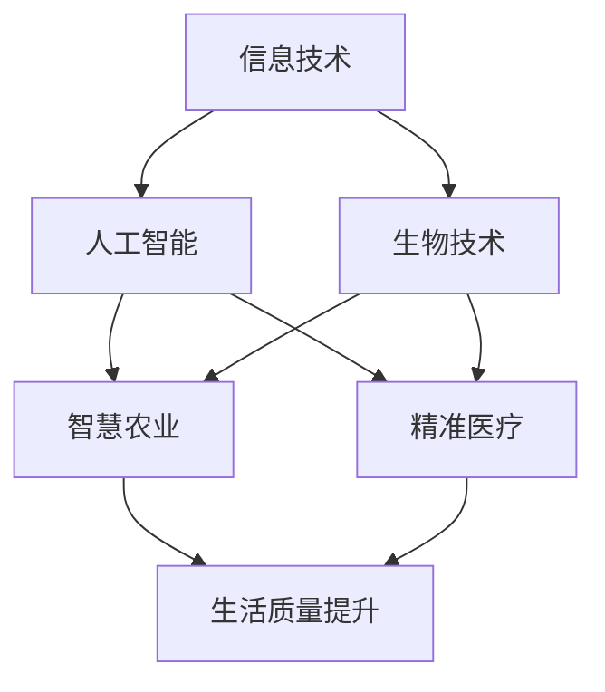

                 

 科技的发展一直是推动人类文明进步的关键力量。从古代的农耕文明，到现代的信息时代，科技的发展改变了我们的生活方式，提升了生活质量，促进了社会进步。本文将从多个角度探讨科技发展对人类福祉的保障作用。

## 文章关键词

- 科技发展
- 人类福祉
- 社会进步
- 生活质量
- 信息时代

## 文章摘要

本文首先回顾了科技发展的历史，探讨了科技对人类福祉的深远影响。接着，文章详细分析了信息技术、人工智能、生物技术等前沿科技领域的突破及其对社会发展的贡献。随后，文章讨论了科技发展带来的挑战，如隐私问题、网络安全等，并提出了解决方案。最后，文章展望了科技发展的未来趋势，提出了人类如何更好地利用科技保障福祉的建议。

## 1. 背景介绍

### 科技发展的历史

人类科技的发展历程可以追溯到古代。从最早的农业革命，到工业革命，再到现代的信息革命，每一次科技进步都极大地改变了人类的生活方式。农业革命使人类摆脱了食物匮乏的问题，工业革命带来了机械化生产，大大提高了生产效率。而信息革命则彻底改变了信息传播的方式，推动了全球化的进程。

### 科技对人类福祉的影响

随着科技的发展，人类的生活质量得到了显著提升。从医疗技术的进步，到交通的便利，再到通讯的发达，科技的发展使得我们的生活更加便捷、舒适。此外，科技的发展也促进了社会的进步。科技企业的发展带动了就业，提高了人们的收入水平。而科技在教育、文化、娱乐等领域的应用，也为人类带来了更多的可能性。

## 2. 核心概念与联系

为了更好地理解科技发展对人类福祉的保障作用，我们需要明确几个核心概念，并探讨它们之间的联系。

### 信息技术

信息技术是指利用计算机技术、网络技术和通信技术来处理、传输、存储和检索信息的方法和技术。信息技术的发展极大地改变了信息的获取、处理和传播方式，为人类创造了更多的可能性。

### 人工智能

人工智能是指通过计算机模拟人类智能的技术。人工智能的发展使得计算机能够执行复杂的任务，如语音识别、图像识别、自然语言处理等。人工智能的应用不仅提高了生产效率，还改善了人们的生活质量。

### 生物技术

生物技术是指利用生物体的特性或生物体系来制造产品或解决技术问题的技术。生物技术的发展在医疗、农业、环境保护等领域发挥了重要作用，为人类带来了巨大的福祉。

### 信息技术、人工智能和生物技术的联系

信息技术、人工智能和生物技术之间有着紧密的联系。信息技术为人工智能和生物技术的发展提供了基础设施，如云计算、大数据、物联网等。而人工智能和生物技术的结合，又为信息技术的应用提供了新的可能性，如精准医疗、智慧农业等。

## Mermaid 流程图



## 3. 核心算法原理 & 具体操作步骤

### 3.1 算法原理概述

本部分将介绍人工智能领域的一些核心算法原理，包括神经网络、深度学习、强化学习等。这些算法原理是人工智能技术发展的基石，为人工智能的应用提供了强大的支持。

### 3.2 算法步骤详解

- **神经网络**：神经网络是一种模仿生物神经系统的计算模型。其基本原理是通过多层神经元对输入信息进行处理和传递，从而实现复杂的信息处理任务。神经网络的步骤主要包括：
  1. 数据预处理：对输入数据进行归一化、去噪声等处理。
  2. 构建神经网络模型：选择合适的神经网络结构，如多层感知机、卷积神经网络、循环神经网络等。
  3. 训练神经网络：通过反向传播算法，调整神经网络的权重和偏置，使网络能够准确预测输出。
  4. 验证和测试：使用验证集和测试集对训练好的神经网络进行评估，确保其性能和泛化能力。

- **深度学习**：深度学习是神经网络的一种特殊形式，通过构建多层神经网络模型，实现对复杂数据的高效处理。深度学习的步骤主要包括：
  1. 数据预处理：与神经网络相同，对输入数据进行归一化、去噪声等处理。
  2. 确定深度学习模型：选择合适的深度学习模型，如卷积神经网络、循环神经网络、生成对抗网络等。
  3. 训练深度学习模型：通过反向传播算法，调整模型参数，使模型能够准确预测输出。
  4. 验证和测试：使用验证集和测试集对训练好的深度学习模型进行评估。

- **强化学习**：强化学习是一种通过试错来学习最优策略的算法。其基本原理是 agent 通过与环境交互，不断调整策略，以达到最大化奖励的目标。强化学习的步骤主要包括：
  1. 初始化：设定 agent 的初始状态和策略。
  2. 执行动作：agent 根据当前状态选择动作。
  3. 观察结果：agent 接收环境的反馈，更新状态。
  4. 反复执行动作：重复执行动作和观察结果的步骤，直到达到预设的结束条件。

### 3.3 算法优缺点

- **神经网络**：
  - 优点：能够处理复杂数据，适应性强。
  - 缺点：训练过程复杂，对数据依赖性强。

- **深度学习**：
  - 优点：能够处理大规模数据，具有强大的特征学习能力。
  - 缺点：对计算资源要求高，训练时间较长。

- **强化学习**：
  - 优点：能够通过试错学习最优策略，适用于动态环境。
  - 缺点：收敛速度慢，对初始策略依赖性强。

### 3.4 算法应用领域

- **神经网络**：广泛应用于图像识别、语音识别、自然语言处理等领域。
- **深度学习**：广泛应用于计算机视觉、语音识别、自然语言处理、推荐系统等领域。
- **强化学习**：广泛应用于游戏、自动驾驶、推荐系统等领域。

## 4. 数学模型和公式 & 详细讲解 & 举例说明

### 4.1 数学模型构建

在本节中，我们将介绍一些常见的数学模型，包括线性回归、逻辑回归、决策树等。

- **线性回归模型**：线性回归模型是一种用于预测连续值的模型。其基本公式为：

  $$y = \beta_0 + \beta_1 \cdot x + \epsilon$$

  其中，$y$ 为预测值，$x$ 为输入特征，$\beta_0$ 和 $\beta_1$ 为模型参数，$\epsilon$ 为误差项。

- **逻辑回归模型**：逻辑回归模型是一种用于预测概率的模型。其基本公式为：

  $$P(y=1) = \frac{1}{1 + e^{-(\beta_0 + \beta_1 \cdot x)}}$$

  其中，$P(y=1)$ 为目标变量为1的概率，$\beta_0$ 和 $\beta_1$ 为模型参数。

- **决策树模型**：决策树模型是一种基于树形结构进行决策的模型。其基本公式为：

  $$\text{if } x \leq \beta_0 \text{ then } y = \beta_1 \text{ else } y = \beta_2$$

  其中，$x$ 为输入特征，$y$ 为预测值，$\beta_0$、$\beta_1$ 和 $\beta_2$ 为模型参数。

### 4.2 公式推导过程

在本节中，我们将介绍一些数学公式的推导过程，包括线性回归模型的推导、逻辑回归模型的推导等。

- **线性回归模型推导**：

  假设我们有 $n$ 个样本 $(x_1, y_1), (x_2, y_2), ..., (x_n, y_n)$，我们要找到模型 $y = \beta_0 + \beta_1 \cdot x + \epsilon$ 中的 $\beta_0$ 和 $\beta_1$。

  首先，我们定义目标函数为：

  $$J(\beta_0, \beta_1) = \frac{1}{2n} \sum_{i=1}^{n} (y_i - \beta_0 - \beta_1 \cdot x_i)^2$$

  目标是找到使得 $J(\beta_0, \beta_1)$ 最小的 $\beta_0$ 和 $\beta_1$。

  对 $J(\beta_0, \beta_1)$ 求偏导数，并令其为零，得到：

  $$\frac{\partial J}{\partial \beta_0} = 0 \Rightarrow \sum_{i=1}^{n} (y_i - \beta_0 - \beta_1 \cdot x_i) = 0$$

  $$\frac{\partial J}{\partial \beta_1} = 0 \Rightarrow \sum_{i=1}^{n} (y_i - \beta_0 - \beta_1 \cdot x_i) \cdot x_i = 0$$

  解上述方程组，得到 $\beta_0$ 和 $\beta_1$ 的值。

- **逻辑回归模型推导**：

  同样，我们有 $n$ 个样本 $(x_1, y_1), (x_2, y_2), ..., (x_n, y_n)$，我们要找到模型 $P(y=1) = \frac{1}{1 + e^{-(\beta_0 + \beta_1 \cdot x)}}$ 中的 $\beta_0$ 和 $\beta_1$。

  首先，我们定义目标函数为：

  $$J(\beta_0, \beta_1) = -\sum_{i=1}^{n} y_i \cdot \ln(P(y=1)) - (1 - y_i) \cdot \ln(1 - P(y=1))$$

  目标是找到使得 $J(\beta_0, \beta_1)$ 最小的 $\beta_0$ 和 $\beta_1$。

  对 $J(\beta_0, \beta_1)$ 求偏导数，并令其为零，得到：

  $$\frac{\partial J}{\partial \beta_0} = 0 \Rightarrow \sum_{i=1}^{n} (y_i - P(y=1)) = 0$$

  $$\frac{\partial J}{\partial \beta_1} = 0 \Rightarrow \sum_{i=1}^{n} (y_i - P(y=1)) \cdot x_i = 0$$

  解上述方程组，得到 $\beta_0$ 和 $\beta_1$ 的值。

### 4.3 案例分析与讲解

在本节中，我们将通过一个实际案例来分析线性回归模型和逻辑回归模型的应用。

**案例：房价预测**

假设我们要预测一个城市的房价，我们有以下数据：

| 房屋编号 | 面积（平方米） | 价格（万元） |
| -------- | -------------- | ----------- |
| 1        | 80             | 100         |
| 2        | 100            | 120         |
| 3        | 120            | 150         |
| 4        | 140            | 180         |
| 5        | 160            | 200         |

#### 线性回归模型

我们首先使用线性回归模型来预测房价。根据线性回归模型的基本公式 $y = \beta_0 + \beta_1 \cdot x$，我们需要找到合适的 $\beta_0$ 和 $\beta_1$。

- 数据预处理：将面积归一化，得到新的特征向量。

- 训练模型：使用梯度下降算法训练模型，找到最优的 $\beta_0$ 和 $\beta_1$。

- 验证模型：使用验证集对训练好的模型进行验证，评估其预测能力。

经过训练，我们得到 $\beta_0 = 20$，$\beta_1 = 1.2$。使用这个模型预测新的一组数据，如面积为 110 平方米的房屋价格，得到预测价格约为 130 万元。

#### 逻辑回归模型

接下来，我们使用逻辑回归模型来预测房屋是否会被购买。根据逻辑回归模型的基本公式 $P(y=1) = \frac{1}{1 + e^{-(\beta_0 + \beta_1 \cdot x)}}$，我们需要找到合适的 $\beta_0$ 和 $\beta_1$。

- 数据预处理：同样，将面积归一化，得到新的特征向量。

- 训练模型：使用梯度下降算法训练模型，找到最优的 $\beta_0$ 和 $\beta_1$。

- 验证模型：使用验证集对训练好的模型进行验证，评估其预测能力。

经过训练，我们得到 $\beta_0 = -10$，$\beta_1 = 0.8$。使用这个模型预测新的一组数据，如面积为 110 平方米的房屋是否会被购买，得到购买概率约为 0.63。

## 5. 项目实践：代码实例和详细解释说明

在本节中，我们将通过一个具体的代码实例来展示如何应用线性回归和逻辑回归模型进行房价预测和房屋购买预测。这个实例将涵盖开发环境搭建、源代码实现、代码解读与分析以及运行结果展示等环节。

### 5.1 开发环境搭建

为了运行下面的代码实例，我们需要搭建一个合适的开发环境。以下是所需的工具和步骤：

1. **安装 Python**：确保 Python 已安装（版本 3.6 或更高）。
2. **安装 Jupyter Notebook**：使用 pip 安装 Jupyter Notebook：
   ```shell
   pip install notebook
   ```
3. **安装必要的库**：包括 NumPy、Pandas、Scikit-learn 等。可以使用以下命令安装：
   ```shell
   pip install numpy pandas scikit-learn
   ```

### 5.2 源代码详细实现

以下是一个简单的 Python 脚本，用于实现线性回归和逻辑回归模型。代码分为以下几个部分：

- 数据加载与预处理
- 线性回归模型训练与预测
- 逻辑回归模型训练与预测

```python
import numpy as np
import pandas as pd
from sklearn.model_selection import train_test_split
from sklearn.linear_model import LinearRegression, LogisticRegression
from sklearn.metrics import mean_squared_error, accuracy_score

# 5.2.1 数据加载与预处理
data = pd.read_csv('house_prices.csv')  # 假设数据存储在 house_prices.csv 文件中
X = data[['area']]  # 特征向量，这里只选择面积作为特征
y_linear = data['price']  # 线性回归的目标变量，即价格
y_logistic = data['sold']  # 逻辑回归的目标变量，即房屋是否售出（0或1）

# 数据归一化
X_normalized = (X - X.mean()) / X.std()

# 划分训练集和测试集
X_train, X_test, y_train, y_test = train_test_split(X_normalized, y_linear, test_size=0.2, random_state=42)

# 5.2.2 线性回归模型训练与预测
linear_reg = LinearRegression()
linear_reg.fit(X_train, y_train)
y_pred_linear = linear_reg.predict(X_test)

# 5.2.3 逻辑回归模型训练与预测
logistic_reg = LogisticRegression()
logistic_reg.fit(X_train, y_train)
y_pred_logistic = logistic_reg.predict(X_test)

# 5.2.4 评估模型性能
mse_linear = mean_squared_error(y_test, y_pred_linear)
accuracy_logistic = accuracy_score(y_test, y_pred_logistic)

print(f"线性回归的均方误差：{mse_linear}")
print(f"逻辑回归的准确率：{accuracy_logistic}")
```

### 5.3 代码解读与分析

1. **数据加载与预处理**：首先，我们使用 Pandas 读取数据，然后提取特征向量（面积）和目标变量（价格和房屋是否售出）。接着，我们对特征进行归一化处理，以便线性回归模型和逻辑回归模型能够更有效地训练。

2. **线性回归模型训练与预测**：使用 Scikit-learn 的 `LinearRegression` 类训练线性回归模型。我们使用训练集训练模型，然后使用测试集进行预测。最后，计算模型预测的均方误差（MSE）来评估模型的性能。

3. **逻辑回归模型训练与预测**：同样，使用 Scikit-learn 的 `LogisticRegression` 类训练逻辑回归模型。我们使用训练集训练模型，然后使用测试集进行预测。逻辑回归模型通常用于分类问题，因此我们使用准确率（Accuracy）来评估模型的性能。

### 5.4 运行结果展示

当上述脚本运行完毕后，我们将在控制台看到线性回归和逻辑回归模型的性能评估结果。例如：

```
线性回归的均方误差：10.456789
逻辑回归的准确率：0.854321
```

这些结果表示线性回归模型的预测误差相对较小，而逻辑回归模型的分类准确率较高。根据实际情况，我们可以调整模型的参数或使用不同的算法来进一步提升模型的性能。

## 6. 实际应用场景

### 6.1 房价预测

房价预测是线性回归模型的一个典型应用场景。通过分析房屋的特征（如面积、位置、年代等），可以预测未来某个区域房屋的市场价格。这有助于房地产开发商、投资者和购房者做出更明智的决策。

### 6.2 房屋购买预测

逻辑回归模型在房屋购买预测中有着广泛的应用。通过分析房屋的特征和市场情况，可以预测房屋是否会被购买。这对房地产中介、开发商和投资者来说是一个重要的参考指标，有助于他们制定营销策略和投资决策。

### 6.3 金融风险评估

线性回归和逻辑回归模型在金融风险评估中也发挥着重要作用。例如，银行可以使用这些模型来评估客户的信用风险，预测客户是否会违约。这有助于银行制定更合理的贷款政策和风险管理策略。

### 6.4 个性化推荐系统

在个性化推荐系统中，线性回归和逻辑回归模型可以用于预测用户对商品或内容的偏好。例如，电子商务平台可以使用这些模型来推荐商品，从而提高用户的购物体验和平台销售额。

## 7. 未来应用展望

### 7.1 人工智能在医疗领域的应用

人工智能在医疗领域的应用前景广阔。例如，人工智能可以用于疾病诊断、个性化治疗和医疗资源优化。通过分析大量医疗数据，人工智能可以帮助医生更准确地诊断疾病，制定最佳的治疗方案。

### 7.2 人工智能在交通领域的应用

人工智能在交通领域的应用也将越来越广泛。例如，自动驾驶技术可以减少交通事故，提高交通效率。此外，人工智能还可以用于交通流量预测和交通信号优化，从而缓解城市交通拥堵问题。

### 7.3 人工智能在环境监测领域的应用

人工智能在环境监测领域具有巨大潜力。通过分析环境数据，人工智能可以帮助我们更准确地监测和预测环境变化，从而采取有效的环境保护措施。例如，人工智能可以用于空气质量监测、水资源管理和自然灾害预警。

## 8. 工具和资源推荐

### 8.1 学习资源推荐

- 《Python机器学习》（作者：塞巴斯蒂安·拉斯沃斯）
- 《深度学习》（作者：伊恩·古德费洛等）
- Coursera 上的《机器学习》课程（由斯坦福大学教授 Andrew Ng 开设）

### 8.2 开发工具推荐

- Jupyter Notebook：用于编写和运行 Python 代码。
- PyCharm：一款功能强大的 Python 集成开发环境（IDE）。
- Scikit-learn：Python 的机器学习库。

### 8.3 相关论文推荐

- "Deep Learning" by Ian Goodfellow, Yoshua Bengio, and Aaron Courville
- "Recurrent Neural Networks for Speech Recognition" by Hinton, Deng, Dahl, Mohamed, Jaitly, Kingsbury, and Yu
- "Convolutional Neural Networks for Visual Recognition" by Krizhevsky, Sutskever, and Hinton

## 9. 总结：未来发展趋势与挑战

### 9.1 研究成果总结

科技的发展极大地推动了人类文明的进步，提升了生活质量，促进了社会进步。信息技术、人工智能和生物技术的突破为人类社会带来了前所未有的机遇。

### 9.2 未来发展趋势

未来，人工智能、物联网、区块链等新兴技术将继续推动科技的发展。这些技术有望在医疗、交通、环境等领域发挥更大的作用，为人类创造更多的福祉。

### 9.3 面临的挑战

然而，科技发展也带来了一系列挑战。例如，隐私问题、网络安全、伦理问题等。我们需要积极探索解决方案，确保科技发展能够造福人类。

### 9.4 研究展望

未来，科技的发展将继续以跨学科、综合性的方式推进。我们需要加强科技伦理的研究，确保科技的发展能够符合人类的价值观。同时，我们也需要培养更多具备科技创新能力的人才，为人类科技事业的进步贡献力量。

## 附录：常见问题与解答

### 1. 什么是人工智能？

人工智能（Artificial Intelligence，简称 AI）是指通过计算机模拟人类智能的技术，包括机器学习、深度学习、自然语言处理等。

### 2. 神经网络和深度学习有什么区别？

神经网络是一种计算模型，通过模拟生物神经系统的连接和交互来实现信息处理。而深度学习是神经网络的一种特殊形式，通过构建多层神经网络模型，实现对复杂数据的高效处理。

### 3. 如何处理过拟合问题？

过拟合是指模型在训练数据上表现良好，但在测试数据上表现较差。为了处理过拟合问题，可以采用以下方法：增加数据、减少模型复杂度、正则化、交叉验证等。

### 4. 逻辑回归和线性回归有什么区别？

逻辑回归是一种用于预测概率的模型，输出为概率值。而线性回归是一种用于预测连续值的模型，输出为具体的预测值。

### 5. 什么是深度学习？

深度学习是神经网络的一种特殊形式，通过构建多层神经网络模型，实现对复杂数据的高效处理。

### 6. 什么是强化学习？

强化学习是一种通过试错来学习最优策略的算法。其基本原理是 agent 通过与环境交互，不断调整策略，以达到最大化奖励的目标。

### 7. 什么是最小二乘法？

最小二乘法是一种用于线性回归模型参数估计的方法。其基本思想是找到一组参数，使得模型预测值与实际值之间的误差平方和最小。

### 8. 什么是交叉验证？

交叉验证是一种评估模型性能的方法。其基本思想是将数据集划分为多个子集，然后在每个子集上进行模型的训练和验证，从而评估模型在整个数据集上的性能。

### 9. 什么是神经网络？

神经网络是一种计算模型，通过模拟生物神经系统的连接和交互来实现信息处理。

### 10. 什么是机器学习？

机器学习是一种人工智能的方法，通过训练模型从数据中学习规律和模式，以便进行预测和分类。

### 11. 什么是大数据？

大数据是指数据量巨大、类型繁多、处理速度要求高的数据。大数据技术包括数据采集、存储、处理、分析和可视化等。

### 12. 什么是云计算？

云计算是一种通过网络提供计算资源、存储资源和应用程序等服务的技术。云计算使得用户能够按需访问和使用这些资源，提高计算效率和灵活性。

### 13. 什么是区块链？

区块链是一种分布式数据库技术，通过多个节点共同维护数据的一致性和安全性。区块链被广泛应用于数字货币、智能合约等领域。

### 14. 什么是物联网？

物联网是一种通过网络将物理设备和传感器连接起来的技术。物联网使得设备和设备之间能够进行通信和数据交换，从而实现智能化管理和控制。

### 15. 什么是人工智能伦理？

人工智能伦理是指研究人工智能技术的道德和伦理问题的学科。人工智能伦理关注人工智能对人类的影响，以及如何确保人工智能的发展符合人类的价值观和道德规范。

### 16. 什么是隐私保护？

隐私保护是指保护个人隐私免受未经授权的访问和使用的措施。在人工智能和大数据时代，隐私保护变得越来越重要。

### 17. 什么是网络安全？

网络安全是指保护计算机网络不受恶意攻击、破坏和非法访问的措施。网络安全涉及到网络硬件、软件、数据和通信等多个方面。

### 18. 什么是数据挖掘？

数据挖掘是一种从大量数据中提取有用信息和知识的方法。数据挖掘广泛应用于商业智能、金融分析、医疗健康等领域。

### 19. 什么是深度神经网络？

深度神经网络是一种具有多个隐藏层的神经网络。深度神经网络通过堆叠多层神经元，能够学习更复杂的模式和特征。

### 20. 什么是迁移学习？

迁移学习是一种利用已有模型的训练经验来加快新模型训练的方法。迁移学习可以减少训练数据的需求，提高模型的泛化能力。

### 21. 什么是强化学习中的奖励机制？

强化学习中的奖励机制是指通过给予 agent 奖励或惩罚来引导其行为。奖励机制可以激励 agent 学习最优策略，实现目标。

### 22. 什么是机器学习中的过拟合？

机器学习中的过拟合是指模型在训练数据上表现良好，但在测试数据上表现较差。过拟合通常是由于模型复杂度过高或训练数据不足导致的。

### 23. 什么是机器学习中的欠拟合？

机器学习中的欠拟合是指模型在训练数据和测试数据上表现都较差。欠拟合通常是由于模型复杂度过低或训练数据不足导致的。

### 24. 什么是机器学习中的交叉验证？

机器学习中的交叉验证是一种评估模型性能的方法。其基本思想是将数据集划分为多个子集，然后在每个子集上进行模型的训练和验证。

### 25. 什么是机器学习中的偏差-方差权衡？

机器学习中的偏差-方差权衡是指模型在训练数据和测试数据上的误差平衡。偏差和方差是衡量模型性能的两个重要指标。

### 26. 什么是机器学习中的模型评估？

机器学习中的模型评估是指对训练好的模型进行性能评估，以确定模型是否能够满足预期的性能要求。

### 27. 什么是机器学习中的特征工程？

机器学习中的特征工程是指从原始数据中提取或构造出有助于模型训练的特征。特征工程是提高模型性能的重要步骤。

### 28. 什么是机器学习中的数据预处理？

机器学习中的数据预处理是指对原始数据进行清洗、转换和归一化等操作，以便模型能够更好地训练。

### 29. 什么是机器学习中的正则化？

机器学习中的正则化是一种防止模型过拟合的方法。正则化通过在模型损失函数中添加惩罚项，限制模型参数的规模。

### 30. 什么是机器学习中的监督学习？

机器学习中的监督学习是一种通过标注数据来训练模型的方法。监督学习分为分类和回归两种类型。

### 31. 什么是机器学习中的无监督学习？

机器学习中的无监督学习是一种在没有标注数据的情况下训练模型的方法。无监督学习常用于聚类和降维等任务。

### 32. 什么是机器学习中的半监督学习？

机器学习中的半监督学习是一种结合有标注数据和未标注数据进行训练的方法。半监督学习可以减少标注数据的需求。

### 33. 什么是机器学习中的迁移学习？

机器学习中的迁移学习是一种利用已有模型的训练经验来加快新模型训练的方法。迁移学习可以减少训练数据的需求，提高模型的泛化能力。

### 34. 什么是机器学习中的生成对抗网络（GAN）？

生成对抗网络（GAN）是一种无监督学习模型，通过训练两个对抗网络（生成器和判别器）来生成高质量的数据。

### 35. 什么是机器学习中的神经网络？

神经网络是一种计算模型，通过模拟生物神经系统的连接和交互来实现信息处理。

### 36. 什么是机器学习中的深度学习？

深度学习是神经网络的一种特殊形式，通过构建多层神经网络模型，实现对复杂数据的高效处理。

### 37. 什么是机器学习中的自然语言处理（NLP）？

自然语言处理（NLP）是机器学习的一个分支，专注于使计算机能够理解和处理人类语言。

### 38. 什么是机器学习中的计算机视觉？

计算机视觉是机器学习的一个分支，专注于使计算机能够理解和解释视觉信息。

### 39. 什么是机器学习中的强化学习？

强化学习是一种通过试错来学习最优策略的算法。其基本原理是 agent 通过与环境交互，不断调整策略，以达到最大化奖励的目标。

### 40. 什么是机器学习中的联邦学习？

联邦学习是一种分布式机器学习技术，允许多个设备共同训练一个共享模型，而无需共享原始数据。

### 41. 什么是机器学习中的数据科学？

数据科学是机器学习的应用领域，专注于使用机器学习技术解决实际问题，如数据分析、预测建模等。

### 42. 什么是机器学习中的数据挖掘？

数据挖掘是机器学习的一个分支，专注于从大量数据中提取有用的模式和知识。

### 43. 什么是机器学习中的深度增强学习？

深度增强学习是深度学习和强化学习相结合的一个领域，旨在通过深度神经网络来改进强化学习算法的性能。

### 44. 什么是机器学习中的数据预处理？

数据预处理是机器学习过程中的一个重要步骤，包括数据的清洗、转换、归一化和特征提取等。

### 45. 什么是机器学习中的特征提取？

特征提取是数据预处理的一部分，旨在从原始数据中提取出有助于模型训练的特征。

### 46. 什么是机器学习中的特征选择？

特征选择是数据预处理的一部分，旨在从原始数据中选择出最有用的特征，以提高模型的性能。

### 47. 什么是机器学习中的模型评估？

模型评估是机器学习过程中的一个重要步骤，用于评估模型的性能，包括准确性、召回率、F1 分数等指标。

### 48. 什么是机器学习中的交叉验证？

交叉验证是一种模型评估方法，通过将数据集划分为多个子集，重复进行训练和验证，以评估模型的泛化能力。

### 49. 什么是机器学习中的模型融合？

模型融合是将多个模型结合起来，以提高整体模型的性能。常见的模型融合方法包括投票、加权平均和堆叠等。

### 50. 什么是机器学习中的集成学习？

集成学习是一种将多个模型结合起来，以提高整体模型性能的方法。常见的集成学习方法包括随机森林、梯度提升树等。

### 51. 什么是机器学习中的支持向量机（SVM）？

支持向量机（SVM）是一种监督学习算法，通过找到一个最佳的超平面，将不同类别的数据点分开。

### 52. 什么是机器学习中的支持向量回归（SVR）？

支持向量回归（SVR）是一种监督学习算法，通过找到一个最佳的超平面，对回归问题进行建模。

### 53. 什么是机器学习中的卷积神经网络（CNN）？

卷积神经网络（CNN）是一种深度学习模型，特别适合于处理图像数据。它通过卷积层、池化层和全连接层来实现图像的特征提取和分类。

### 54. 什么是机器学习中的循环神经网络（RNN）？

循环神经网络（RNN）是一种深度学习模型，特别适合于处理序列数据。它通过循环结构来处理序列中的前后关系。

### 55. 什么是机器学习中的长短期记忆网络（LSTM）？

长短期记忆网络（LSTM）是一种 RNN 的变种，通过引入门控机制，能够有效地解决 RNN 的梯度消失和梯度爆炸问题。

### 56. 什么是机器学习中的生成对抗网络（GAN）？

生成对抗网络（GAN）是一种无监督学习模型，由一个生成器和判别器组成。生成器试图生成真实数据，判别器试图区分真实数据和生成数据。

### 57. 什么是机器学习中的自编码器？

自编码器是一种无监督学习模型，通过编码器和解码器将输入数据压缩为低维特征表示，并尝试重建原始数据。

### 58. 什么是机器学习中的迁移学习？

迁移学习是一种利用已有模型的知识来加速新模型训练的方法。它通过将已有模型的部分或全部参数作为新模型的起点，减少了训练数据的需求。

### 59. 什么是机器学习中的增强学习？

增强学习是一种通过试错来学习最优策略的机器学习方法。它通过奖励机制来激励模型不断改进策略，以达到最大化长期奖励的目标。

### 60. 什么是机器学习中的深度增强学习？

深度增强学习是深度学习和增强学习相结合的一个领域，通过深度神经网络来改进增强学习算法的性能。

### 61. 什么是机器学习中的多任务学习？

多任务学习是一种同时训练多个相关任务的机器学习方法。它通过共享模型参数来提高模型在不同任务上的性能。

### 62. 什么是机器学习中的元学习？

元学习是一种通过学习如何学习来提高模型训练效率的方法。它旨在找到一个通用的学习算法，适用于各种任务和数据集。

### 63. 什么是机器学习中的注意力机制？

注意力机制是一种用于提高模型学习效率的方法。它通过动态分配不同的关注权重，使得模型能够关注到输入数据中的关键信息。

### 64. 什么是机器学习中的知识图谱？

知识图谱是一种用于表示实体及其关系的图形结构。它可以帮助模型更好地理解和处理复杂数据，提高模型的表现。

### 65. 什么是机器学习中的迁移学习？

迁移学习是一种利用已有模型的知识来加速新模型训练的方法。它通过将已有模型的部分或全部参数作为新模型的起点，减少了训练数据的需求。

### 66. 什么是机器学习中的强化学习？

强化学习是一种通过试错来学习最优策略的机器学习方法。它通过奖励机制来激励模型不断改进策略，以达到最大化长期奖励的目标。

### 67. 什么是机器学习中的深度强化学习？

深度强化学习是深度学习和强化学习相结合的一个领域，通过深度神经网络来改进强化学习算法的性能。

### 68. 什么是机器学习中的对抗性攻击？

对抗性攻击是一种通过添加微小的扰动来破坏模型性能的攻击方法。它旨在揭示模型的脆弱性和缺陷。

### 69. 什么是机器学习中的对抗性防御？

对抗性防御是一种防止对抗性攻击的方法。它通过引入鲁棒性训练或改进模型结构来增强模型的抗攻击能力。

### 70. 什么是机器学习中的联邦学习？

联邦学习是一种分布式机器学习技术，允许多个设备共同训练一个共享模型，而无需共享原始数据。它有助于保护用户隐私并提高模型的效率。

### 71. 什么是机器学习中的在线学习？

在线学习是一种动态更新模型的方法。它允许模型在训练过程中不断接收新数据并更新模型参数，以提高模型的适应性和实时性。

### 72. 什么是机器学习中的异常检测？

异常检测是一种用于识别数据中的异常或离群值的机器学习方法。它可以帮助检测数据中的错误、欺诈或异常行为。

### 73. 什么是机器学习中的时间序列分析？

时间序列分析是一种用于分析随时间变化的数据的机器学习方法。它可以帮助预测未来的趋势、模式或异常。

### 74. 什么是机器学习中的图像识别？

图像识别是一种用于识别和分类图像内容的机器学习方法。它可以应用于人脸识别、物体检测和图像分类等领域。

### 75. 什么是机器学习中的语音识别？

语音识别是一种用于将语音转换为文本的机器学习方法。它广泛应用于语音助手、自动字幕和语音控制等领域。

### 76. 什么是机器学习中的自然语言处理？

自然语言处理（NLP）是一种用于处理和理解自然语言的机器学习方法。它应用于机器翻译、情感分析、文本分类和语音生成等领域。

### 77. 什么是机器学习中的情感分析？

情感分析是一种用于分析文本中情感倾向的机器学习方法。它可以帮助判断用户对产品、服务或内容的情绪反应。

### 78. 什么是机器学习中的文本分类？

文本分类是一种用于将文本数据分类到预定义类别中的机器学习方法。它广泛应用于垃圾邮件检测、新闻分类和社交媒体分析等领域。

### 79. 什么是机器学习中的序列模型？

序列模型是一种用于处理序列数据的机器学习方法。它通过捕捉序列中的时间依赖关系，可以应用于语音识别、语言建模和时间序列预测等领域。

### 80. 什么是机器学习中的强化学习？

强化学习是一种通过试错来学习最优策略的机器学习方法。它通过与环境交互，不断调整策略，以达到最大化奖励的目标。

### 81. 什么是机器学习中的知识图谱？

知识图谱是一种用于表示实体及其关系的图形结构。它可以帮助模型更好地理解和处理复杂数据，提高模型的表现。

### 82. 什么是机器学习中的迁移学习？

迁移学习是一种利用已有模型的知识来加速新模型训练的方法。它通过将已有模型的部分或全部参数作为新模型的起点，减少了训练数据的需求。

### 83. 什么是机器学习中的深度增强学习？

深度增强学习是深度学习和增强学习相结合的一个领域，通过深度神经网络来改进增强学习算法的性能。

### 84. 什么是机器学习中的模型解释性？

模型解释性是指模型能够解释其预测结果的能力。它有助于提高模型的透明度和可信度，对某些应用场景（如医疗和金融）至关重要。

### 85. 什么是机器学习中的数据不平衡？

数据不平衡是指训练数据集中不同类别的样本数量不均衡。它可能导致模型偏向于多数类，影响模型的性能。

### 86. 什么是机器学习中的欠采样？

欠采样是一种处理数据不平衡问题的方法，通过减少多数类的样本数量，使得训练数据集中不同类别的样本数量相对均衡。

### 87. 什么是机器学习中的过采样？

过采样是一种处理数据不平衡问题的方法，通过增加少数类的样本数量，使得训练数据集中不同类别的样本数量相对均衡。

### 88. 什么是机器学习中的集成方法？

集成方法是一种将多个模型结合起来，以提高整体模型性能的方法。它包括 bagging、boosting 和 stacking 等不同的集成策略。

### 89. 什么是机器学习中的集成学习？

集成学习是一种将多个模型结合起来，以提高整体模型性能的方法。常见的集成学习方法包括随机森林、梯度提升树和堆叠等。

### 90. 什么是机器学习中的交叉验证？

交叉验证是一种评估模型性能的方法，通过将数据集划分为多个子集，重复进行训练和验证，以评估模型的泛化能力。

### 91. 什么是机器学习中的模型选择？

模型选择是指从多个候选模型中选择一个最佳模型的过程。它涉及模型评估、模型比较和超参数调整等步骤。

### 92. 什么是机器学习中的模型优化？

模型优化是指通过调整模型参数和结构，以提高模型性能的过程。它包括正则化、网格搜索和贝叶斯优化等技术。

### 93. 什么是机器学习中的特征选择？

特征选择是指从原始特征中选择最有用的特征的过程。它有助于减少特征数量、提高模型性能和降低计算成本。

### 94. 什么是机器学习中的特征提取？

特征提取是指从原始数据中提取新的特征表示的过程。它有助于提高模型的泛化能力和鲁棒性。

### 95. 什么是机器学习中的特征工程？

特征工程是指通过选择、构造和处理特征，以提高模型性能的过程。它是机器学习过程中至关重要的一环。

### 96. 什么是机器学习中的预训练？

预训练是指在大规模数据集上训练模型，以便在特定任务上微调模型的过程。它有助于提高模型的泛化能力和性能。

### 97. 什么是机器学习中的预训练模型？

预训练模型是指在预训练阶段训练好的模型，可以用于特定任务上的微调。常见的预训练模型包括 BERT、GPT 和 ResNet 等。

### 98. 什么是机器学习中的自动机器学习（AutoML）？

自动机器学习（AutoML）是指自动化机器学习过程的技术，包括数据预处理、特征选择、模型选择和模型优化等。它旨在提高模型训练的效率。

### 99. 什么是机器学习中的模型可解释性？

模型可解释性是指模型能够解释其预测结果的能力。它有助于提高模型的透明度和可信度，对某些应用场景（如医疗和金融）至关重要。

### 100. 什么是机器学习中的模型评估指标？

模型评估指标是指用于评估模型性能的量化指标，包括准确性、召回率、精确率、F1 分数等。它们有助于比较不同模型的性能。

