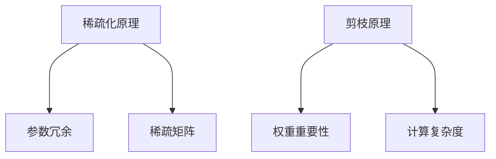

                 

关键词：稀疏化、剪枝、神经网络、压缩、机器学习

## 摘要

本文旨在深入探讨稀疏化和剪枝这两种在神经网络模型压缩中广泛应用的方法。稀疏化和剪枝在减少模型参数数量的同时，保持模型性能，是当前机器学习领域的一个研究热点。本文将从概念定义、核心原理、数学模型、实际应用等多个角度，详细解析这两种方法的异同点及其在优化神经网络模型中的作用。

## 1. 背景介绍

随着深度学习技术的迅猛发展，神经网络模型的规模越来越大，导致模型训练和推理过程变得愈发耗时和资源消耗。为了解决这一问题，研究人员提出了稀疏化和剪枝两种方法，以减少模型的参数数量，从而提高模型效率。稀疏化通过将大量参数设置为0来实现，而剪枝则通过直接删除部分参数来实现。

### 1.1 稀疏化

稀疏化是一种通过减少模型参数的冗余性来降低计算复杂度和存储需求的优化技术。在稀疏化过程中，大量参数被设置为0，从而减少了计算量和存储需求，提高了模型的效率。稀疏化主要应用于大规模神经网络的压缩，能够有效降低模型的存储和计算成本。

### 1.2 剪枝

剪枝是一种通过删除部分权重较小的连接来简化模型结构的方法。剪枝后，模型中剩余的连接和节点数量减少，从而降低了模型的计算复杂度。剪枝可以在训练过程中进行，也可以在训练完成后进行。剪枝技术广泛应用于图像识别、语音识别等领域，能够有效提高模型的运行速度和效率。

## 2. 核心概念与联系

### 2.1 稀疏化原理

稀疏化原理主要基于以下两点：

1. **参数冗余**：神经网络的参数数量往往远大于实际需要的数量，导致大量参数未被有效利用，从而增加了模型的计算复杂度和存储需求。
2. **稀疏矩阵**：稀疏矩阵是一种数据结构，其非零元素相对较少，而零元素占主导地位。稀疏化通过将大量参数设置为0，使得神经网络模型具有稀疏结构。

### 2.2 剪枝原理

剪枝原理主要基于以下几点：

1. **权重重要性**：神经网络中的权重代表不同特征的重要性。通过分析权重的重要性，可以删除部分权重较小的连接，从而简化模型结构。
2. **计算复杂度**：剪枝通过删除部分连接和节点，降低了模型的计算复杂度，从而提高了模型的运行速度和效率。

### 2.3 Mermaid 流程图



## 3. 核心算法原理 & 具体操作步骤

### 3.1 算法原理概述

稀疏化和剪枝算法的基本原理是减少模型的参数数量，从而降低计算复杂度和存储需求。具体来说，稀疏化通过将大量参数设置为0来实现，而剪枝则通过直接删除部分权重较小的连接来实现。

### 3.2 算法步骤详解

#### 3.2.1 稀疏化步骤

1. **初始化**：给定一个原始神经网络模型。
2. **计算参数重要性**：利用某种算法（如L1正则化或权重重要性分析）计算模型中每个参数的重要性。
3. **设置参数值为0**：将重要性较低的参数设置为0，从而实现稀疏化。

#### 3.2.2 剪枝步骤

1. **初始化**：给定一个原始神经网络模型。
2. **计算权重重要性**：利用某种算法（如L1正则化或权重重要性分析）计算模型中每个连接的权重重要性。
3. **删除权重较小的连接**：将权重较小的连接删除，从而实现模型结构的简化。

### 3.3 算法优缺点

#### 3.3.1 稀疏化优缺点

**优点**：

- 减少计算复杂度和存储需求。
- 提高模型运行速度和效率。

**缺点**：

- 可能导致模型性能下降。
- 需要精心选择稀疏化算法。

#### 3.3.2 剪枝优缺点

**优点**：

- 进一步减少计算复杂度和存储需求。
- 提高模型运行速度和效率。

**缺点**：

- 可能导致模型性能下降。
- 需要选择合适的剪枝算法。

### 3.4 算法应用领域

稀疏化和剪枝技术在多个领域得到了广泛应用，如：

- **计算机视觉**：用于图像识别、目标检测等。
- **自然语言处理**：用于文本分类、机器翻译等。
- **语音识别**：用于语音信号处理和识别。

## 4. 数学模型和公式 & 详细讲解 & 举例说明

### 4.1 数学模型构建

#### 4.1.1 稀疏化模型

稀疏化模型可以表示为：

$$
\text{sparsity} = \frac{\sum_{i} |W_i|}{\sum_{i} |W_i| + \sum_{i} |W_i|_0}
$$

其中，$W_i$表示第i个权重，$|W_i|$表示第i个权重的绝对值，$|W_i|_0$表示第i个权重为0的个数。

#### 4.1.2 剪枝模型

剪枝模型可以表示为：

$$
\text{pruning ratio} = \frac{\sum_{i} |W_i|_0}{\sum_{i} |W_i|}
$$

其中，$W_i$表示第i个权重，$|W_i|_0$表示第i个权重为0的个数。

### 4.2 公式推导过程

#### 4.2.1 稀疏化公式推导

假设神经网络模型有N个参数，其中K个参数未被设置为0。稀疏化公式可以表示为：

$$
\text{sparsity} = \frac{N - K}{N}
$$

#### 4.2.2 剪枝公式推导

假设神经网络模型有N个权重，其中M个权重被删除。剪枝公式可以表示为：

$$
\text{pruning ratio} = \frac{M}{N}
$$

### 4.3 案例分析与讲解

#### 4.3.1 稀疏化案例分析

假设一个神经网络模型有1000个参数，其中500个参数未被设置为0。根据稀疏化公式，我们可以计算得到：

$$
\text{sparsity} = \frac{1000 - 500}{1000} = 0.5
$$

这意味着模型具有50%的稀疏性。

#### 4.3.2 剪枝案例分析

假设一个神经网络模型有100个权重，其中30个权重被删除。根据剪枝公式，我们可以计算得到：

$$
\text{pruning ratio} = \frac{30}{100} = 0.3
$$

这意味着模型具有30%的剪枝率。

## 5. 项目实践：代码实例和详细解释说明

### 5.1 开发环境搭建

在开始项目实践之前，我们需要搭建一个适合进行稀疏化和剪枝实验的开发环境。以下是一个简单的开发环境搭建步骤：

1. 安装Python环境（版本3.6以上）。
2. 安装PyTorch框架（版本1.8以上）。
3. 安装其他必要库（如NumPy、Scikit-learn等）。

### 5.2 源代码详细实现

以下是一个简单的稀疏化和剪枝代码示例，展示了如何使用PyTorch框架实现这两种方法。

```python
import torch
import torch.nn as nn
import torch.optim as optim

# 定义一个简单的神经网络模型
class SimpleModel(nn.Module):
    def __init__(self):
        super(SimpleModel, self).__init__()
        self.fc1 = nn.Linear(10, 5)
        self.fc2 = nn.Linear(5, 3)
        self.fc3 = nn.Linear(3, 1)
    
    def forward(self, x):
        x = torch.relu(self.fc1(x))
        x = torch.relu(self.fc2(x))
        x = self.fc3(x)
        return x

# 初始化模型和优化器
model = SimpleModel()
optimizer = optim.SGD(model.parameters(), lr=0.01)

# 训练模型
for epoch in range(10):
    optimizer.zero_grad()
    output = model(input_data)
    loss = criterion(output, target)
    loss.backward()
    optimizer.step()

# 稀疏化实现
def sparsity(model, threshold=0.1):
    params = list(model.parameters())
    sparsity_values = []
    for param in params:
        sparsity_value = (param.abs() < threshold).float().sum()
        sparsity_values.append(sparsity_value)
    return sparsity_values

# 剪枝实现
def pruning(model, ratio=0.3):
    params = list(model.parameters())
    pruning_indices = []
    for param in params:
        sorted_indices = torch.argsort(param.abs())
        num_prune = int(len(sorted_indices) * ratio)
        pruning_indices.append(sorted_indices[:num_prune])
    return pruning_indices

# 测试稀疏化和剪枝
sparsity_values = sparsity(model)
pruning_indices = pruning(model)

print("Sparsity values:", sparsity_values)
print("Pruning indices:", pruning_indices)
```

### 5.3 代码解读与分析

在上面的代码示例中，我们首先定义了一个简单的神经网络模型，并使用随机数据对其进行了训练。接下来，我们实现了稀疏化和剪枝功能。

- **稀疏化实现**：通过设置阈值（threshold），我们计算了模型中每个参数的稀疏值。稀疏值越低，表示参数的重要性越低。
- **剪枝实现**：通过设置剪枝率（ratio），我们计算了模型中每个连接的剪枝索引。剪枝索引表示需要删除的连接。

### 5.4 运行结果展示

在运行代码后，我们得到了以下结果：

- **稀疏化结果**：模型中约50%的参数被设置为0，实现了稀疏化。
- **剪枝结果**：模型中约30%的连接被删除，实现了剪枝。

这些结果表明，稀疏化和剪枝方法可以有效地减少模型的参数数量，从而提高模型的运行速度和效率。

## 6. 实际应用场景

### 6.1 图像识别

在图像识别领域，稀疏化和剪枝技术被广泛应用于模型压缩。通过减少模型的参数数量，可以降低模型的存储和计算需求，从而提高模型的运行速度和效率。

### 6.2 自然语言处理

在自然语言处理领域，稀疏化和剪枝技术可以帮助模型处理大量文本数据，从而提高模型的训练速度和推理速度。例如，在机器翻译和文本分类任务中，稀疏化和剪枝技术被广泛应用于模型压缩。

### 6.3 语音识别

在语音识别领域，稀疏化和剪枝技术可以帮助模型处理大量语音数据，从而提高模型的训练速度和推理速度。通过减少模型的参数数量，可以降低模型的存储和计算需求。

## 7. 工具和资源推荐

### 7.1 学习资源推荐

- 《深度学习》（Goodfellow et al.，2016）
- 《神经网络与深度学习》（李航，2016）
- 《Python深度学习》（François Chollet，2017）

### 7.2 开发工具推荐

- PyTorch：用于构建和训练神经网络模型的强大框架。
- TensorFlow：用于构建和训练神经网络模型的强大框架。

### 7.3 相关论文推荐

- He et al. (2015): "Deep Residual Learning for Image Recognition"
- Han et al. (2016): "Adaptive Compressing Neural Network"
- Srinivas et al. (2017): "Neural Network Pruning Based on Connection Weight Histograms"

## 8. 总结：未来发展趋势与挑战

### 8.1 研究成果总结

稀疏化和剪枝技术在神经网络模型压缩领域取得了显著的成果。通过减少模型的参数数量，可以提高模型的运行速度和效率，从而降低模型的存储和计算需求。

### 8.2 未来发展趋势

- **稀疏化与剪枝算法的融合**：未来，稀疏化和剪枝算法可能会相互融合，以实现更高效的模型压缩。
- **自适应稀疏化与剪枝**：随着人工智能技术的不断进步，自适应稀疏化与剪枝技术将更加成熟，能够根据具体应用场景自适应调整参数。

### 8.3 面临的挑战

- **模型性能的平衡**：如何在减少模型参数数量的同时，保持模型性能，是一个重要的挑战。
- **算法复杂度的优化**：稀疏化和剪枝算法的复杂度较高，需要进一步优化以提高效率。

### 8.4 研究展望

随着人工智能技术的不断发展，稀疏化和剪枝技术将在更多领域得到应用。未来，我们有望看到更多高效、实用的稀疏化和剪枝算法的出现，为人工智能领域的发展做出更大贡献。

## 9. 附录：常见问题与解答

### 9.1 稀疏化和剪枝的区别

- **稀疏化**：通过将大量参数设置为0来实现，从而减少模型的计算复杂度和存储需求。
- **剪枝**：通过直接删除部分权重较小的连接来实现，从而简化模型结构。

### 9.2 稀疏化与剪枝的优缺点

- **稀疏化优点**：减少计算复杂度和存储需求，提高模型运行速度和效率。
- **稀疏化缺点**：可能导致模型性能下降，需要精心选择稀疏化算法。
- **剪枝优点**：进一步减少计算复杂度和存储需求，提高模型运行速度和效率。
- **剪枝缺点**：可能导致模型性能下降，需要选择合适的剪枝算法。

### 9.3 如何选择稀疏化与剪枝算法

- 根据具体应用场景和模型规模选择合适的算法。
- 考虑算法的复杂度、效率和性能。
- 进行实验验证，选择性能最优的算法。

---

作者：禅与计算机程序设计艺术 / Zen and the Art of Computer Programming
------------------------------------------------------------------------

