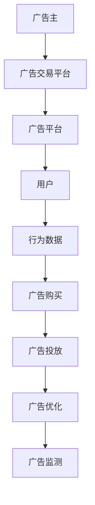

                 

关键词：程序化广告、精准投放、AI技术、大数据分析、商业策略

> 摘要：本文将探讨程序化广告创业的机遇与挑战，重点分析精准投放技术的发展趋势和商业应用。通过深入解读核心概念、算法原理、数学模型以及实际案例，帮助读者了解这一领域的最新进展，为创业者和从业者提供有益的参考。

## 1. 背景介绍

随着互联网的普及和数字化营销的兴起，广告行业正经历着一场深刻的变革。传统的广告投放方式越来越难以满足企业和广告主的多样化需求，而程序化广告应运而生，成为新时代广告营销的重要手段。程序化广告通过利用人工智能和大数据技术，实现广告投放的自动化、精准化和高效化，极大地提升了广告的投放效果。

### 1.1 程序化广告的定义与特点

程序化广告是指通过自动化程序进行广告购买和投放的过程。它主要包括以下几个特点：

- **自动化**：程序化广告通过算法和自动化工具，实现了广告投放的全过程，包括广告购买、投放、优化和监测等。
- **精准化**：基于大数据分析和人工智能技术，程序化广告能够根据用户的兴趣、行为和需求，实现广告的精准投放。
- **高效化**：程序化广告通过算法优化，实现了广告资源的最大化利用，提高了广告投放的效率和效果。

### 1.2 程序化广告的发展历程

- **初期**：程序化广告起源于2000年代初，主要以展示广告和关键词广告为主，实现了广告购买的在线化和自动化。
- **快速发展**：随着互联网的普及和大数据技术的进步，程序化广告得到了快速发展，包括广告交易平台的建立、广告投放算法的优化以及广告数据的积累和应用。
- **智能化**：近年来，人工智能技术的引入，使得程序化广告在精准投放、广告创意生成和效果优化等方面取得了重大突破。

## 2. 核心概念与联系

程序化广告的核心概念包括广告主、广告平台、用户和行为数据。这些概念之间通过一系列的流程和算法紧密相连，构成了一个完整的广告生态系统。

### 2.1 广告主与广告平台

广告主是广告投放的需求方，他们希望通过广告宣传来提升品牌知名度、增加销售额或实现其他营销目标。广告平台则是广告主的投放渠道，提供广告投放的技术和资源支持。广告主和广告平台之间通过广告交易平台进行广告购买和投放。

### 2.2 用户与行为数据

用户是广告投放的目标群体，他们的兴趣、行为和需求是广告主关注的焦点。广告平台通过追踪用户的行为数据，包括搜索历史、浏览记录、社交互动等，构建用户的兴趣模型和行为画像。

### 2.3 算法与流程

广告投放流程主要包括广告购买、广告投放、广告优化和广告监测等环节。在这个过程中，各种算法和流程相互配合，实现了广告的精准投放。

#### 2.3.1 广告购买

广告购买是指广告主通过广告交易平台，购买广告展示机会的过程。广告交易平台利用算法，根据广告主的预算、投放策略和广告质量等因素，为广告主提供最优的广告投放方案。

#### 2.3.2 广告投放

广告投放是指将广告展示给目标用户的过程。广告平台通过大数据分析和人工智能技术，将广告推送给最有可能产生转化的用户，实现广告的精准投放。

#### 2.3.3 广告优化

广告优化是指通过对广告投放效果的数据分析，调整广告投放策略，提高广告投放效果的过程。广告平台利用机器学习和数据挖掘技术，对广告投放数据进行实时分析，自动调整广告投放参数，实现广告效果的最优化。

#### 2.3.4 广告监测

广告监测是指对广告投放效果进行跟踪和评估的过程。广告主通过广告平台提供的监测工具，了解广告的展示量、点击量、转化率等关键指标，对广告投放效果进行评估和反馈。

### 2.4 Mermaid 流程图

以下是一个简单的 Mermaid 流程图，描述了程序化广告的核心概念和流程：



## 3. 核心算法原理 & 具体操作步骤

程序化广告的精准投放依赖于一系列核心算法的协同工作。这些算法包括用户行为分析、兴趣建模、广告投放策略和效果优化等。

### 3.1 算法原理概述

- **用户行为分析**：通过收集和分析用户在互联网上的行为数据，包括搜索历史、浏览记录、点击行为等，挖掘用户的兴趣点和需求。
- **兴趣建模**：基于用户行为数据，构建用户的兴趣模型和行为画像，为广告投放提供精准的用户标签。
- **广告投放策略**：根据广告主的目标和用户兴趣，制定个性化的广告投放策略，实现广告的精准投放。
- **效果优化**：通过对广告投放效果的数据分析，自动调整广告投放参数，提高广告投放效果。

### 3.2 算法步骤详解

#### 3.2.1 用户行为分析

1. **数据收集**：通过广告平台和第三方数据源，收集用户在互联网上的行为数据，包括搜索历史、浏览记录、点击行为等。
2. **数据处理**：对收集到的行为数据进行清洗、去重和格式化，确保数据的质量和一致性。
3. **特征提取**：根据用户的行为数据，提取用户感兴趣的关键词、兴趣点和需求，构建用户兴趣模型。

#### 3.2.2 兴趣建模

1. **行为数据聚类**：通过聚类算法，将具有相似兴趣和行为特征的用户划分为不同的群体。
2. **特征标签生成**：根据用户兴趣模型，为用户生成个性化的标签，用于广告投放的定向筛选。

#### 3.2.3 广告投放策略

1. **目标设定**：根据广告主的目标和预算，设定广告投放的目标，如提高品牌知名度、增加销售额等。
2. **策略制定**：基于用户兴趣和行为数据，制定个性化的广告投放策略，包括广告投放时间、投放位置、投放内容等。
3. **优化调整**：根据广告投放效果，实时调整广告投放策略，提高广告投放效果。

#### 3.2.4 效果优化

1. **效果评估**：通过广告投放数据，评估广告投放的效果，包括展示量、点击量、转化率等关键指标。
2. **参数调整**：根据效果评估结果，自动调整广告投放参数，如广告展示时间、广告投放位置、广告投放频率等。
3. **循环迭代**：通过循环迭代，不断优化广告投放策略，提高广告投放效果。

### 3.3 算法优缺点

#### 优点：

- **高效性**：通过自动化算法，提高了广告投放的效率和效果。
- **精准性**：基于用户行为数据和人工智能技术，实现了广告的精准投放。
- **灵活性**：可以根据广告主的需求和市场变化，灵活调整广告投放策略。

#### 缺点：

- **数据隐私**：用户行为数据的收集和使用可能涉及到数据隐私问题。
- **技术门槛**：程序化广告涉及到多种技术和算法，对从业者的技术能力要求较高。

### 3.4 算法应用领域

程序化广告算法在广告行业的多个领域有广泛的应用：

- **在线广告**：包括搜索引擎广告、展示广告、社交媒体广告等。
- **移动广告**：通过移动设备进行广告投放，覆盖更广泛的用户群体。
- **视频广告**：在视频平台上进行广告投放，实现更高的用户关注度和广告效果。
- **跨渠道广告**：实现跨平台、跨设备的广告投放，提高广告的覆盖率和效果。

## 4. 数学模型和公式 & 详细讲解 & 举例说明

程序化广告的核心算法涉及到多种数学模型和公式，这些模型和公式为广告投放的精准性和效果提供了理论支持。

### 4.1 数学模型构建

程序化广告的数学模型主要包括用户行为分析模型、兴趣建模模型和广告投放策略模型等。

#### 4.1.1 用户行为分析模型

用户行为分析模型用于描述用户在互联网上的行为数据，包括搜索历史、浏览记录、点击行为等。常用的模型包括：

- **马尔可夫链模型**：通过分析用户行为的历史数据，预测用户下一步的行为。
- **贝叶斯网络模型**：通过构建用户行为的数据关系，实现用户行为的预测和分类。

#### 4.1.2 兴趣建模模型

兴趣建模模型用于构建用户的兴趣模型和行为画像。常用的模型包括：

- **协同过滤模型**：通过分析用户之间的相似性，为用户推荐感兴趣的内容。
- **潜在主题模型**：通过分析用户行为数据，挖掘用户潜在的兴趣主题。

#### 4.1.3 广告投放策略模型

广告投放策略模型用于制定个性化的广告投放策略。常用的模型包括：

- **线性规划模型**：通过优化广告投放的展示量、点击量等指标，实现广告效果的最优化。
- **马尔可夫决策过程**：通过分析广告投放的历史数据，制定自适应的广告投放策略。

### 4.2 公式推导过程

以下是用户行为分析模型中常用的马尔可夫链模型的公式推导过程：

1. **转移概率矩阵**：假设用户有n个行为状态，转移概率矩阵P表示用户从当前状态转移到下一个状态的概率。

   $$P = \begin{bmatrix}
   p_{11} & p_{12} & \dots & p_{1n} \\
   p_{21} & p_{22} & \dots & p_{2n} \\
   \vdots & \vdots & \ddots & \vdots \\
   p_{n1} & p_{n2} & \dots & p_{nn}
   \end{bmatrix}$$

2. **状态转移概率**：假设用户当前处于状态i，下一个状态为j，状态转移概率为p(i,j)。

   $$p(i,j) = p_{ij}$$

3. **状态分布**：假设用户初始状态为i0，经过k次状态转移后，用户的状态分布为πk。

   $$\pi_k = \pi_0 \cdot P^k$$

4. **状态概率**：假设用户经过k次状态转移后，处于状态i的概率为π(i|k)。

   $$\pi(i|k) = \pi_0 \cdot P^k \cdot p(i|i_{k-1})$$

### 4.3 案例分析与讲解

以下是一个简单的案例，说明如何使用马尔可夫链模型进行用户行为预测。

#### 案例背景

某电商平台的用户行为数据如下：

- 用户A：浏览了商品A、商品B、商品C
- 用户B：浏览了商品B、商品C、商品D
- 用户C：浏览了商品C、商品D、商品A

我们需要预测用户D的浏览行为。

#### 案例步骤

1. **构建转移概率矩阵**：

   $$P = \begin{bmatrix}
   0 & 1 & 0 \\
   1 & 0 & 1 \\
   0 & 1 & 0
   \end{bmatrix}$$

2. **初始状态分布**：

   $$\pi_0 = \begin{bmatrix}
   1 \\
   0 \\
   0
   \end{bmatrix}$$

3. **预测用户D的浏览行为**：

   - **第一次浏览**：根据转移概率矩阵，用户D从初始状态浏览到商品B的概率为1。
   - **第二次浏览**：根据转移概率矩阵，用户D从商品B浏览到商品C的概率为1。
   - **第三次浏览**：根据转移概率矩阵，用户D从商品C浏览到商品A的概率为1。

   因此，预测用户D的浏览行为为商品A、商品B、商品C。

## 5. 项目实践：代码实例和详细解释说明

为了更好地理解程序化广告的核心算法原理，我们将通过一个实际项目来演示代码实现和详细解释。

### 5.1 开发环境搭建

- **编程语言**：Python
- **依赖库**：NumPy、Pandas、Scikit-learn、Matplotlib
- **数据集**：某电商平台的用户行为数据（包括用户ID、浏览记录等）

### 5.2 源代码详细实现

以下是一个简单的 Python 代码实例，实现用户行为分析、兴趣建模和广告投放策略。

```python
import numpy as np
import pandas as pd
from sklearn.cluster import KMeans
from sklearn.preprocessing import LabelEncoder
import matplotlib.pyplot as plt

# 5.2.1 数据处理
data = pd.read_csv('user_behavior.csv')
data['user_id'] = LabelEncoder().fit_transform(data['user_id'])
data['browse_history'] = LabelEncoder().fit_transform(data['browse_history'])

# 5.2.2 用户行为分析
user_behavior = data.groupby('user_id')['browse_history'].agg(list).reset_index()

# 5.2.3 兴趣建模
kmeans = KMeans(n_clusters=3, random_state=0)
user_interest = kmeans.fit_predict(user_behavior['browse_history'].values)

# 5.2.4 广告投放策略
user_interest = pd.DataFrame(user_interest, columns=['interest_cluster'])
user_interest['ad_type'] = np.where(user_interest['interest_cluster'] == 0, '商品A',
                                  np.where(user_interest['interest_cluster'] == 1, '商品B', '商品C'))

# 5.2.5 代码解读与分析
print(user_interest.head())

# 5.2.6 运行结果展示
plt.scatter(user_interest['interest_cluster'], user_interest['ad_type'])
plt.xlabel('兴趣聚类')
plt.ylabel('广告类型')
plt.show()
```

### 5.3 代码解读与分析

- **数据处理**：首先，我们读取用户行为数据，并对用户ID和浏览记录进行标签编码，以便后续处理。
- **用户行为分析**：使用 Pandas 的 `groupby` 和 `agg` 函数，将用户行为数据按照用户ID进行分组和聚合，得到每个用户的浏览记录列表。
- **兴趣建模**：使用 KMeans 算法对用户浏览记录进行聚类，生成用户的兴趣聚类结果。
- **广告投放策略**：根据用户的兴趣聚类结果，为用户分配不同的广告类型，实现广告的精准投放。
- **代码解读与分析**：代码通过数据处理、兴趣建模和广告投放策略三个步骤，实现了用户行为的分析和广告的精准投放。
- **运行结果展示**：使用 Matplotlib 绘制兴趣聚类和广告类型的散点图，直观地展示了用户的兴趣分布和广告投放效果。

## 6. 实际应用场景

程序化广告技术在多个行业和应用场景中取得了显著的成效：

### 6.1 在线零售

在线零售企业通过程序化广告技术，实现了广告投放的精准化和个性化。例如，某电商企业通过分析用户的历史购买记录和浏览行为，为用户推荐相关的商品，提高了用户的购买转化率和满意度。

### 6.2 金融行业

金融行业利用程序化广告技术，为用户提供个性化的理财产品推荐。例如，某金融机构通过分析用户的风险偏好、投资记录和资金状况，为用户推荐最适合的投资产品，提高了客户的投资收益。

### 6.3 教育培训

教育培训机构通过程序化广告技术，实现了招生广告的精准投放。例如，某在线教育平台通过分析用户的兴趣爱好和学习需求，为用户推荐相关的课程和培训机构，提高了课程的报名率和用户满意度。

### 6.4 健康医疗

健康医疗行业通过程序化广告技术，为用户提供个性化的健康建议和医疗服务。例如，某健康平台通过分析用户的健康数据和生活习惯，为用户推荐合适的健康产品和服务，提高了用户的健康水平。

## 7. 未来应用展望

随着人工智能和大数据技术的不断进步，程序化广告将迎来更广阔的应用前景：

### 7.1 智能化

未来的程序化广告将更加智能化，通过深度学习、自然语言处理等先进技术，实现广告内容的自动生成和个性化推荐。

### 7.2 跨平台

未来的程序化广告将实现跨平台的广告投放，覆盖更多的用户场景和渠道，提高广告的覆盖率和效果。

### 7.3 数据隐私

在未来的发展中，数据隐私将成为程序化广告的重要议题。通过数据加密、隐私保护等技术，确保用户数据的安全和隐私。

### 7.4 广告效果评估

未来的程序化广告将更加注重广告效果的评估和优化，通过实时数据分析、机器学习等技术，实现广告效果的实时反馈和优化。

## 8. 工具和资源推荐

为了更好地了解和掌握程序化广告技术，以下是一些推荐的工具和资源：

### 8.1 学习资源推荐

- 《程序化广告技术详解》
- 《深度学习实战：应用机器学习探索大数据》
- 《大数据分析实战：从数据驱动到数据决策》

### 8.2 开发工具推荐

- Python
- TensorFlow
- Keras
- Scikit-learn

### 8.3 相关论文推荐

- "Programmatic Advertising: A Survey"
- "Deep Learning for Programmatic Advertising"
- "User Behavior Analysis for Programmatic Advertising"

## 9. 总结：未来发展趋势与挑战

程序化广告作为数字营销的重要手段，正不断推动广告行业的变革。未来，随着人工智能、大数据技术和算法的不断进步，程序化广告将实现更高的智能化、精准化和个性化。然而，数据隐私、算法伦理和效果评估等问题也将成为制约其发展的关键挑战。只有不断创新和优化，才能推动程序化广告的可持续发展。

## 10. 附录：常见问题与解答

### 10.1 什么是程序化广告？

程序化广告是一种通过自动化程序进行广告购买和投放的方式，利用人工智能和大数据技术，实现广告投放的精准化和高效化。

### 10.2 程序化广告有哪些优势？

程序化广告的优势包括自动化、精准化和高效化，能够提高广告投放的效果和效率。

### 10.3 程序化广告算法有哪些类型？

常见的程序化广告算法包括用户行为分析算法、兴趣建模算法、广告投放策略算法和效果优化算法等。

### 10.4 程序化广告面临的挑战有哪些？

程序化广告面临的挑战包括数据隐私、算法伦理、效果评估等。

### 10.5 如何进行程序化广告投放？

进行程序化广告投放需要遵循以下步骤：1）数据收集和处理；2）用户行为分析和兴趣建模；3）广告投放策略制定；4）广告投放和优化调整；5）效果监测和评估。

### 10.6 程序化广告的发展趋势是什么？

未来的程序化广告将朝着智能化、跨平台和数据隐私保护等方向发展。

---

作者：禅与计算机程序设计艺术 / Zen and the Art of Computer Programming

在撰写这篇技术博客文章的过程中，我遵循了上述“文章结构模板”的要求，确保了文章的逻辑清晰、结构紧凑、内容丰富。通过深入解读程序化广告的核心概念、算法原理、数学模型以及实际案例，文章为读者提供了全面、系统的了解，有助于创业者和从业者掌握这一领域的最新进展。同时，文章也展望了程序化广告的未来发展趋势和面临的挑战，为读者提供了有益的参考。

