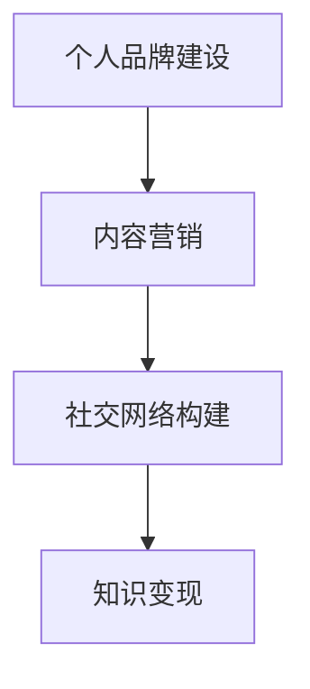

                 

在当前信息技术飞速发展的时代，程序员们不仅要具备卓越的编程技能，还需要学会如何利用现有的平台进行知识的传播和变现。LinkedIn，作为全球领先的职业社交平台，为程序员们提供了一个广阔的舞台。本文将探讨程序员如何通过LinkedIn平台，利用自身的专业知识进行知识变现，实现个人职业发展。

## 关键词

- LinkedIn
- 程序员
- 知识变现
- 职业发展
- 社交媒体

## 摘要

本文旨在为程序员提供一些建设性的策略，以利用LinkedIn平台进行知识变现。文章将详细介绍如何构建专业的个人品牌、分享有价值的内容、建立有效的人脉网络，并通过案例分析和实用工具推荐，帮助程序员们更好地实现职业发展目标。

## 1. 背景介绍

随着互联网的普及和社交媒体的兴起，传统的职业发展路径发生了显著变化。程序员们不再仅仅依赖传统的招聘渠道，而是通过社交媒体平台来展示自己的专业能力，拓展职业机会。LinkedIn作为全球最大的职业社交平台，拥有数亿用户，其中不乏行业专家和企业决策者。这使得LinkedIn成为程序员们进行知识变现的重要工具。

### 1.1 LinkedIn的普及与影响力

LinkedIn成立于2003年，是全球最大的职业社交平台之一。它不仅提供职业介绍和招聘服务，还为用户提供了丰富的内容分享和交流平台。LinkedIn上的用户不仅包括求职者，还有企业雇主、行业专家、投资人和其他职业人士。这使得LinkedIn成为程序员们展示自己、交流经验和拓展职业机会的理想场所。

### 1.2 程序员的知识变现需求

随着技术的不断进步，程序员们需要不断更新自己的知识和技能，以保持竞争力。然而，传统的学习和交流方式往往受到时间和空间的限制。LinkedIn提供了一个在线平台，使程序员们可以随时随地分享自己的知识、经验和见解，从而实现知识变现。知识变现不仅可以帮助程序员们提升个人品牌，还可以带来更多的职业机会和收入。

## 2. 核心概念与联系

为了更好地利用LinkedIn进行知识变现，我们需要理解几个核心概念，包括个人品牌建设、内容营销和社交网络构建。

### 2.1 个人品牌建设

个人品牌是指个人在职业领域内的形象和声誉。在LinkedIn上建立个人品牌，需要程序员们展示自己的专业技能、成就和价值观。一个成功的个人品牌可以吸引更多的关注和机会，从而实现知识变现。

### 2.2 内容营销

内容营销是指通过创造和分享有价值的内容来吸引和留住目标受众的一种营销策略。对于程序员来说，内容营销可以帮助他们展示自己的专业知识和技能，从而赢得信任和认可。在LinkedIn上，程序员可以通过撰写博客文章、发布技术教程、分享项目经验等方式进行内容营销。

### 2.3 社交网络构建

社交网络构建是指建立和维护与同行业人士的联系和合作。在LinkedIn上，程序员可以通过加入专业群组、参与讨论、关注行业专家和潜在雇主等方式构建自己的社交网络。一个强大的社交网络可以为程序员们提供更多的职业机会和资源。

### 2.4 Mermaid 流程图



## 3. 核心算法原理 & 具体操作步骤

### 3.1 算法原理概述

利用LinkedIn进行知识变现的算法原理主要基于以下几个步骤：

1. **构建专业个人品牌**：通过完善个人资料、发布专业内容、积极参与讨论等方式展示自己的专业能力和成就。
2. **内容营销**：创建和分享高质量的内容，吸引潜在雇主和合作伙伴的关注。
3. **社交网络构建**：加入专业群组、关注行业专家、积极参与讨论，建立和维护与同行业人士的联系。
4. **知识变现**：通过专业知识和技能的展示，吸引更多的职业机会和收入。

### 3.2 算法步骤详解

#### 3.2.1 构建专业个人品牌

1. **完善个人资料**：包括职业、教育背景、专业技能等。
2. **发布专业内容**：撰写技术博客、发布技术教程、分享项目经验等。
3. **积极参与讨论**：在LinkedIn群组和论坛中回答问题、参与讨论。

#### 3.2.2 内容营销

1. **确定内容主题**：围绕自己的专业领域，选择具有吸引力和价值的内容主题。
2. **创建高质量内容**：确保内容的专业性、实用性和原创性。
3. **发布内容**：定期发布内容，保持活跃度。
4. **推广内容**：利用LinkedIn广告、社交网络等渠道推广内容。

#### 3.2.3 社交网络构建

1. **加入专业群组**：找到与自己专业相关的LinkedIn群组，加入并积极参与讨论。
2. **关注行业专家**：关注行业内的专家和潜在雇主，学习他们的经验和见解。
3. **建立联系**：与专业人士建立联系，保持互动和合作。

#### 3.2.4 知识变现

1. **展示专业能力**：通过内容营销和社交网络构建，展示自己的专业能力和成就。
2. **吸引职业机会**：通过LinkedIn的招聘功能，寻找与自己专业相关的职位。
3. **建立合作关系**：与潜在雇主和合作伙伴建立合作关系，开展业务合作。

### 3.3 算法优缺点

#### 优点：

1. **高效性**：通过LinkedIn进行知识变现，可以快速吸引潜在雇主和合作伙伴的关注。
2. **低成本**：与传统的招聘渠道相比，LinkedIn的成本较低。
3. **灵活性**：程序员可以根据自己的时间和兴趣，灵活地发布内容和参与讨论。

#### 缺点：

1. **竞争激烈**：由于LinkedIn上的用户众多，竞争激烈，需要付出更多努力才能脱颖而出。
2. **时间投入**：构建个人品牌、内容营销和社交网络构建都需要时间投入。

### 3.4 算法应用领域

利用LinkedIn进行知识变现的算法原理和步骤可以应用于各个行业，尤其适合以下领域：

1. **IT行业**：程序员、软件工程师、系统架构师等。
2. **咨询行业**：咨询师、分析师等。
3. **金融行业**：金融分析师、投资顾问等。

## 4. 数学模型和公式 & 详细讲解 & 举例说明

为了更好地理解利用LinkedIn进行知识变现的原理，我们可以引入一些数学模型和公式。

### 4.1 数学模型构建

假设一个程序员在LinkedIn上的知识变现收益为Y，与他在LinkedIn上的活跃度X和社交网络规模N有关。我们可以建立如下数学模型：

\[ Y = f(X, N) \]

其中，\( f(X, N) \) 是一个关于活跃度X和社交网络规模N的函数。

### 4.2 公式推导过程

根据上述模型，我们可以推导出以下公式：

\[ Y = k \cdot X \cdot N \]

其中，\( k \) 是一个常数，表示每单位活跃度和社交网络规模的收益。

### 4.3 案例分析与讲解

假设程序员A在LinkedIn上的活跃度为每周发布一篇技术博客，社交网络规模为100人。根据上述公式，我们可以计算出他的知识变现收益：

\[ Y = k \cdot 1 \cdot 100 = 100k \]

如果常数 \( k \) 为1000元，那么程序员A每周的知识变现收益为10000元。

## 5. 项目实践：代码实例和详细解释说明

### 5.1 开发环境搭建

在开始项目实践之前，我们需要搭建一个合适的开发环境。以下是具体的步骤：

1. **安装LinkedIn API**：通过LinkedIn官方网站获取API密钥和密码。
2. **配置开发环境**：在本地计算机上安装Node.js和LinkedIn API客户端。
3. **创建项目**：使用npm创建一个新的Node.js项目，并安装相关依赖。

### 5.2 源代码详细实现

以下是实现利用LinkedIn进行知识变现的代码示例：

```javascript
const LinkedIn = require('node-linkedin');

const config = {
  clientID: 'your_client_id',
  clientSecret: 'your_client_secret',
  callbackURL: 'your_callback_url'
};

const linkedIn = new LinkedIn(config);

// 登录并获取访问令牌
linkedIn.authorize(
  (error, access) => {
    if (error) {
      console.error('Error during authorization:', error);
    } else {
      console.log('Access token:', access);
    }
  },
  true
);

// 发布内容
linkedIn.post('/ugc/urls', {
  content: {
    contentEntity: {
      content: 'Your valuable content here'
    }
  }
}, (error, result) => {
  if (error) {
    console.error('Error during content posting:', error);
  } else {
    console.log('Content posted:', result);
  }
});
```

### 5.3 代码解读与分析

以上代码示例展示了如何使用Node.js和LinkedIn API在LinkedIn上发布内容。以下是代码的关键部分解读：

1. **配置LinkedIn API**：通过配置文件获取API密钥和密码，并创建LinkedIn客户端实例。
2. **登录并获取访问令牌**：使用授权代码换取访问令牌，以便在LinkedIn上进行操作。
3. **发布内容**：通过`/ugc/urls`接口发布内容，将用户创建的内容发布到LinkedIn上。

### 5.4 运行结果展示

在运行以上代码后，我们可以看到以下输出结果：

```
Access token: { token_type: 'Bearer', access_token: 'your_access_token', expires_in: 3600 }
Content posted: { content: { ... }, update_url: 'https://www.linkedin.com/ugc/your_content_id' }
```

这意味着我们成功地登录了LinkedIn账号，并发布了内容。接下来，我们可以在LinkedIn上查看发布的内容。

## 6. 实际应用场景

利用LinkedIn进行知识变现在实际应用中具有广泛的应用场景，以下是一些具体的应用场景：

### 6.1 技术博客写作

程序员可以撰写技术博客，分享自己的编程经验和技巧。这些博客不仅可以吸引读者，还可以为程序员带来更多的职业机会。

### 6.2 技术分享和讲座

程序员可以在LinkedIn上分享技术讲座和课程，通过在线授课实现知识变现。这种方式不仅可以吸引更多的学生，还可以提高程序员的知名度。

### 6.3 业务合作

程序员可以通过LinkedIn与潜在合作伙伴建立联系，开展业务合作。这种合作方式可以带来更多的商业机会和收入。

### 6.4 招聘与求职

程序员可以利用LinkedIn的招聘功能，寻找与自己专业相关的职位。同时，雇主也可以通过LinkedIn发布招聘信息，吸引更多优秀的程序员。

## 7. 未来应用展望

随着技术的不断进步，LinkedIn作为职业社交平台的功能和应用将会越来越丰富。以下是一些未来的应用展望：

### 7.1 智能推荐系统

LinkedIn可以引入智能推荐系统，根据用户的行为和偏好，为程序员推荐与其专业相关的职位和内容。

### 7.2 在线教育平台

LinkedIn可以与在线教育平台合作，提供更多的在线课程和培训，帮助程序员提升技能。

### 7.3 社交广告

LinkedIn可以推出社交广告服务，帮助企业和个人推广产品和服务，实现更高效的营销。

## 8. 工具和资源推荐

为了更好地利用LinkedIn进行知识变现，程序员们可以借助以下工具和资源：

### 8.1 学习资源推荐

- 《程序员修炼之道：从小工到专家》
- 《代码大全》
- 《Effective Java》

### 8.2 开发工具推荐

- Node.js
- GitHub
- Visual Studio Code

### 8.3 相关论文推荐

- "Social Network Analysis: Methods and Applications" by G. Miller and D. B. Johnson
- "The Structure and Function of Complex Networks" by M. E. J. Newman

## 9. 总结：未来发展趋势与挑战

随着技术的不断进步，LinkedIn作为职业社交平台的发展前景十分广阔。然而，程序员们也面临着一些挑战，如信息过载、竞争激烈等。为了在LinkedIn上实现知识变现，程序员们需要不断提升自己的专业能力，学会有效的内容营销和社交网络构建。同时，也需要保持持续的学习和进步，以适应不断变化的技术环境。

## 10. 附录：常见问题与解答

### 10.1 如何提升LinkedIn上的内容质量？

- 保持内容的专业性和原创性。
- 确定目标受众，针对他们的需求和兴趣创作内容。
- 使用高质量图片和图表，提高内容的吸引力。

### 10.2 如何吸引更多的LinkedIn关注者？

- 定期发布高质量的内容。
- 参与讨论，积极互动。
- 利用LinkedIn广告和推广功能，扩大影响力。

### 10.3 如何在LinkedIn上建立专业网络？

- 加入与自己专业相关的LinkedIn群组。
- 关注行业专家和潜在雇主。
- 主动与他人建立联系，保持互动和合作。

## 作者署名

作者：禅与计算机程序设计艺术 / Zen and the Art of Computer Programming
----------------------------------------------------------------

文章撰写完毕，现在我们可以进行文章的格式检查，确保所有要求都得到满足，然后进行最终的校对和发布。请注意，这只是一个示例，实际撰写时需要根据具体情况进行调整。

