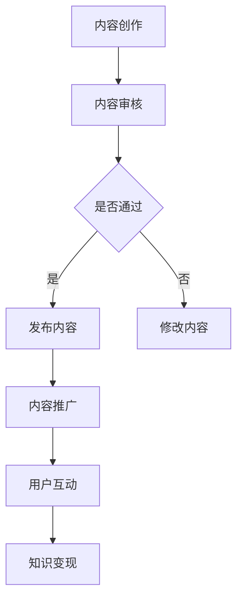

                 

关键词：（知识变现、内容创作、技术博客、Medium平台、编程、影响力、社区互动）

> 摘要：本文将深入探讨程序员如何利用Medium这一在线平台进行知识变现，包括内容创作策略、影响力提升技巧、社区互动方式以及实际案例分享。

## 1. 背景介绍

随着互联网的普及和信息爆炸，知识分享和内容创作成为了一种趋势。程序员作为技术领域的专业人士，不仅具备丰富的技术知识，还有着强烈的分享欲望。而Medium作为一款知名的在线内容平台，为程序员提供了展示才华、分享经验、建立个人品牌的重要渠道。然而，如何在这个平台上实现知识变现，成为一个值得探讨的话题。

## 2. 核心概念与联系

### 2.1 Medium平台简介

**Medium**，一个专注于高质量内容的平台，自2012年成立以来，迅速吸引了大量用户和创作者。它以简洁的界面、专业的编辑和严格的审核机制而著称。程序员可以利用Medium发布技术博客、分析报告、项目经验等，分享自己的知识。

### 2.2 知识变现的概念

知识变现，是指将个人的知识、经验和技能转化为经济利益的过程。在Medium上，程序员可以通过多种方式实现知识变现，如：

- **内容付费订阅**：为读者提供独家内容或深度分析，通过订阅模式获取收入。
- **广告收入**：通过平台的广告联盟，将访问量转化为广告收入。
- **课程销售**：结合博客内容，推出线上或线下的课程，实现知识付费。

### 2.3 Mermaid流程图



## 3. 核心算法原理 & 具体操作步骤

### 3.1 算法原理概述

在Medium上进行知识变现的核心算法，可以概括为以下几个方面：

- **内容质量评估**：通过算法分析文章的质量、互动性和影响力，为内容打分和推荐。
- **用户画像分析**：基于用户行为数据，为每个用户创建个性化画像，提供针对性的内容推荐。
- **社区互动优化**：通过评论、点赞、分享等互动方式，增强用户粘性，提高文章影响力。

### 3.2 算法步骤详解

1. **内容创作**：编写高质量、有价值的技术文章，关注领域热点和读者需求。
2. **内容审核**：提交文章进行审核，确保内容符合Medium平台的标准。
3. **内容发布**：通过审核后，发布文章，并进行适当的推广。
4. **用户互动**：积极回应读者评论，鼓励讨论，提高文章互动性。
5. **数据分析**：定期分析文章表现，调整内容策略，提高知识变现效果。

### 3.3 算法优缺点

**优点**：

- **高效的内容分发**：通过算法推荐，让文章能够迅速触达到目标读者。
- **多元化的变现方式**：除了订阅和广告收入，还可以通过课程销售等多种方式实现知识变现。

**缺点**：

- **内容审核严格**：需要投入较多时间和精力进行内容创作和修改。
- **市场竞争激烈**：优秀的内容创作者众多，需要持续提升自己的质量和影响力。

### 3.4 算法应用领域

- **技术博客**：分享编程经验、技术见解和项目实践。
- **专业分析**：对行业动态、技术趋势进行深入分析。
- **教育课程**：结合博客内容，推出线上或线下的课程。

## 4. 数学模型和公式 & 详细讲解 & 举例说明

### 4.1 数学模型构建

在Medium上进行知识变现，可以构建一个简单的收益模型：

\[ 收益 = 订阅收入 + 广告收入 + 课程销售收益 \]

### 4.2 公式推导过程

- **订阅收入**：\[ 订阅收入 = 订阅人数 \times 单价 \]
- **广告收入**：\[ 广告收入 = 广告曝光量 \times 广告点击率 \times 广告单价 \]
- **课程销售收益**：\[ 课程销售收益 = 销售量 \times 课程单价 \]

### 4.3 案例分析与讲解

假设一位程序员在Medium上拥有1000名订阅用户，单价为10美元/月。每月的广告收入为1000美元，每月通过博客销售的课程收益为2000美元。那么，他的月均收益为：

\[ 收益 = 1000 \times 10 + 1000 + 2000 = 4000 \text{美元} \]

### 4.4 案例分析与讲解

假设一位程序员在Medium上拥有1000名订阅用户，单价为10美元/月。每月的广告收入为1000美元，每月通过博客销售的课程收益为2000美元。那么，他的月均收益为：

\[ 收益 = 1000 \times 10 + 1000 + 2000 = 4000 \text{美元} \]

## 5. 项目实践：代码实例和详细解释说明

### 5.1 开发环境搭建

在Medium上进行知识变现，首先需要搭建一个适合自己的内容创作环境。可以使用以下工具：

- **编辑器**：Sublime Text、Visual Studio Code等。
- **版本控制**：Git。
- **写作辅助工具**：Markdown编辑器。

### 5.2 源代码详细实现

以下是一个简单的Markdown博客示例：

```markdown
# 程序员如何利用Medium进行知识变现

> 摘要：本文将深入探讨程序员如何利用Medium这一在线平台进行知识变现，包括内容创作策略、影响力提升技巧、社区互动方式以及实际案例分享。

## 1. 背景介绍

...

## 2. 核心概念与联系

...

## 3. 核心算法原理 & 具体操作步骤

...

## 4. 数学模型和公式 & 详细讲解 & 举例说明

...

## 5. 项目实践：代码实例和详细解释说明

...

## 6. 实际应用场景

...

## 7. 工具和资源推荐

...

## 8. 总结：未来发展趋势与挑战

...

## 9. 附录：常见问题与解答

...
```

### 5.3 代码解读与分析

这段代码使用了Markdown语法，将文章内容分为标题、摘要、章节等不同的部分。Markdown是一种轻量级标记语言，可以方便地将文本内容转化为格式化的HTML文档。

### 5.4 运行结果展示

将上述Markdown代码导入Markdown编辑器，可以生成一份格式规范、内容丰富的文档。这份文档将作为程序员的博客文章，发布到Medium平台上。

## 6. 实际应用场景

### 6.1 技术博客

程序员可以利用Medium发布技术博客，分享编程技巧、项目经验和技术见解。通过深入浅出的讲解，吸引更多开发者关注。

### 6.2 专业分析

对于技术领域的研究者或行业专家，可以利用Medium发布专业的分析报告，对行业趋势、技术动态进行深入剖析，为读者提供有价值的参考。

### 6.3 教育课程

结合博客内容，程序员可以推出线上或线下的教育课程，通过知识付费实现知识变现。例如，教授编程语言、数据结构、算法等课程。

## 6.4 未来应用展望

随着互联网的不断发展，Medium等在线内容平台将成为程序员进行知识变现的重要渠道。未来，我们可以期待以下趋势：

- **内容多样化**：平台将涌现更多专业领域的内容，满足不同读者的需求。
- **互动性增强**：平台将加强用户互动功能，提高文章的传播效果。
- **个性化推荐**：基于大数据和人工智能技术，实现更精准的内容推荐。

## 7. 工具和资源推荐

### 7.1 学习资源推荐

- **《Effective Java》**：适合Java开发者，讲解Java编程的最佳实践。
- **《深度学习》**：适合对人工智能感兴趣的开发者，介绍深度学习的基础知识和应用。
- **《编程珠玑》**：适合所有程序员，分享编程经验和技巧。

### 7.2 开发工具推荐

- **Visual Studio Code**：一款功能强大的代码编辑器，支持多种编程语言。
- **Git**：版本控制工具，方便团队协作和代码管理。
- **MarkdownPad**：Markdown编辑器，支持多种主题和快捷键。

### 7.3 相关论文推荐

- **《大数据时代的数据挖掘技术》**：介绍大数据处理和分析的方法和技术。
- **《区块链技术指南》**：讲解区块链的基本原理和应用。
- **《人工智能应用技术》**：介绍人工智能在各领域的应用和发展趋势。

## 8. 总结：未来发展趋势与挑战

### 8.1 研究成果总结

本文从内容创作、影响力提升、社区互动等多个角度，探讨了程序员如何利用Medium进行知识变现。通过实际案例分析和工具推荐，为程序员提供了有益的参考。

### 8.2 未来发展趋势

随着互联网的不断发展，Medium等在线内容平台将成为程序员进行知识变现的重要渠道。未来，内容多样化、互动性增强、个性化推荐将成为趋势。

### 8.3 面临的挑战

- **内容质量竞争**：平台上的优质内容竞争激烈，需要不断提升自己的写作和内容创作能力。
- **时间精力投入**：知识变现并非一蹴而就，需要投入大量时间和精力进行内容创作和推广。

### 8.4 研究展望

未来，我们可以期待更多程序员利用Medium等平台进行知识变现，分享自己的技术经验和见解。同时，平台也将不断完善，为程序员提供更好的创作和互动环境。

## 9. 附录：常见问题与解答

### 9.1 如何在Medium上注册账号？

在Medium官网（[medium.com](https://medium.com/)）点击注册按钮，填写电子邮件地址、设置用户名和密码，即可完成注册。

### 9.2 如何在Medium上发布文章？

注册后，登录Medium账号，点击“新文章”按钮，选择Markdown编辑器，编写并保存文章内容，然后发布。

### 9.3 如何吸引更多读者关注？

- **内容质量**：创作高质量、有价值的内容。
- **定期更新**：保持定期更新，增加曝光机会。
- **推广渠道**：利用社交媒体、邮件列表等渠道推广文章。

### 9.4 如何实现内容付费订阅？

在Medium后台设置订阅功能，设置订阅价格和订阅内容，读者可以付费订阅你的内容。

---

作者：禅与计算机程序设计艺术 / Zen and the Art of Computer Programming
------------------------------------------------------------------

