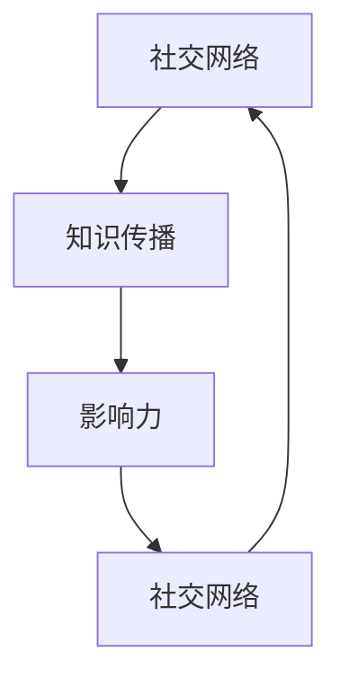

                 

### 关键词

- 社交网络
- 程序员
- 影响力
- 知识传播
- 网络影响力策略

### 摘要

本文旨在探讨程序员如何通过社交网络平台，如GitHub、Twitter、LinkedIn等，提升个人知识影响力。我们将从社交网络的作用、构建专业形象的策略、内容创作技巧以及如何进行有效的互动等方面，全面分析程序员在数字时代如何提升其专业知识和影响力的传播效果。

## 1. 背景介绍

在信息技术飞速发展的今天，程序员群体已成为社会不可或缺的一部分。然而，如何将自己所掌握的先进技术知识传播出去，成为了每个程序员都需要面对的问题。传统的知识传播方式如会议演讲、技术书籍等，尽管仍具有一定的影响力，但在社交网络的助力下，程序员的知识传播途径变得更加多样和高效。

社交网络平台提供了全球性的交流渠道，使得程序员能够实时分享技术心得、项目进展以及解决难题的经验。这些平台不仅能够帮助程序员展示个人专业技能，还能通过与同行的互动，建立起强大的专业网络，从而进一步扩大其知识影响力。

### 1.1 社交网络的作用

社交网络在程序员知识传播中起到了至关重要的作用。首先，它为程序员提供了一个展示个人能力和成就的舞台。通过GitHub上的开源项目，程序员可以展示他们的代码质量和技术水平；在Twitter上，程序员可以分享技术见解、行业动态和项目进展，从而吸引更多关注。

其次，社交网络有助于程序员建立和扩展专业网络。在LinkedIn上，程序员可以加入行业相关的群组，与全球的同行交流，获取职业发展的机会。此外，社交网络还帮助程序员快速获取行业信息和最新技术动态，从而保持自己的知识更新。

### 1.2 社交网络的兴起

社交网络的兴起可以追溯到20世纪90年代末和21世纪初。早期的社交网络如Facebook、MySpace，主要侧重于个人社交。随着互联网技术的进步和智能手机的普及，社交网络逐渐向专业化发展，诞生了如GitHub、LinkedIn、Stack Overflow等专注于技术交流和职业发展的平台。

这些平台的出现，不仅改变了程序员的知识传播方式，还为他们提供了更多的机会和平台，使他们在全球范围内展示自己的技术和知识。

### 1.3 程序员面临的挑战

尽管社交网络为程序员提供了展示自己的平台，但程序员在利用社交网络扩大知识影响力时仍面临一些挑战。首先，信息过载问题。随着社交网络的日益普及，程序员每天接收到的信息量庞大，筛选和吸收有用信息成为一大挑战。

其次，专业形象的构建。在社交网络上展示专业形象，需要程序员具备一定的内容创作能力和沟通技巧。对于许多程序员来说，如何在社交网络上吸引关注、提升影响力，是一个需要不断学习和实践的过程。

### 1.4 社交网络的重要性

社交网络在程序员知识传播中的作用不容忽视。通过社交网络，程序员不仅可以展示个人技术和成就，还能与全球的同行建立联系，分享知识和经验。社交网络为程序员提供了一个开放、互动的平台，使得知识传播更加高效和广泛。

此外，社交网络还有助于程序员获取职业机会。许多公司和招聘机构都会在社交网络上寻找合适的候选人。一个拥有丰富项目和优秀评价的社交网络档案，往往能够为程序员带来更多的职业机会。

### 1.5 社交网络与知识传播的互动

社交网络与知识传播之间存在着密切的互动关系。一方面，社交网络为程序员提供了知识传播的渠道；另一方面，程序员通过社交网络传播的知识，又进一步促进了社交网络的发展。这种互动关系，使得程序员的知识传播更加广泛和深入。

总之，社交网络已经成为程序员知识传播的重要工具。通过合理利用社交网络，程序员不仅可以提升个人专业形象，还能扩大自己的知识影响力，为职业生涯的发展奠定坚实的基础。

## 2. 核心概念与联系

为了更好地理解社交网络在程序员知识传播中的作用，我们首先需要了解几个核心概念：社交网络、知识传播、影响力以及它们之间的相互关系。

### 2.1 社交网络

社交网络是由节点（个体）和边（连接）构成的复杂网络系统。在这个系统中，节点代表个体，如程序员、开发者、技术专家等；边代表个体之间的互动和联系，如点赞、评论、分享等。社交网络的核心在于节点之间的连接，这种连接不仅增强了个体之间的信息交流，还促进了知识的共享和传播。

### 2.2 知识传播

知识传播是指知识在不同个体、群体或组织之间传递的过程。在程序员群体中，知识传播主要通过三种途径进行：个人交流、技术文档和社交网络。个人交流如同事之间的讨论、技术会议的演讲等；技术文档如技术博客、论文、书籍等；社交网络则提供了实时、互动的知识传播平台。

### 2.3 影响力

影响力是指个体或组织在社交网络中能够对其他个体或组织产生的影响能力。在程序员领域，影响力可以通过多种方式体现，如技术贡献、项目质量、观点独到等。影响力越大，程序员的知识传播效果越好，进而提升其在行业中的地位和声誉。

### 2.4 社交网络、知识传播与影响力的关系

社交网络、知识传播和影响力之间存在着密切的关系。社交网络为知识传播提供了平台和渠道，使得知识能够更广泛、更快速地传播；知识传播则增强了社交网络中个体的影响力；而影响力又进一步推动了知识的传播，形成了一个良性的循环。

下面是一个用Mermaid绘制的流程图，展示了这三个核心概念之间的联系：



在这个流程图中，A表示社交网络，B表示知识传播，C表示影响力，D表示社交网络。箭头表示概念之间的相互作用和影响。

通过这个流程图，我们可以清晰地看到，社交网络为知识传播提供了基础，而知识的广泛传播又增强了程序员的影响力。反过来，影响力又进一步促进了社交网络的活跃度和知识的传播。这种循环互动，使得程序员在社交网络中的知识传播效果更加显著。

综上所述，社交网络、知识传播和影响力是一个相互促进、相互依赖的整体。程序员要想在社交网络中扩大知识影响力，就需要深入理解这三个核心概念，并利用它们之间的相互作用，实现知识的有效传播。

## 3. 核心算法原理 & 具体操作步骤

在理解了社交网络、知识传播和影响力的基本概念之后，我们接下来将探讨如何通过具体的算法原理和操作步骤，有效地扩大程序员的社交网络影响力。

### 3.1 算法原理概述

要扩大社交网络影响力，程序员可以采用以下核心算法原理：

1. **内容优化算法**：通过优化内容和标题，提高内容在社交网络上的可见度和吸引力。
2. **互动算法**：通过主动互动，如点赞、评论、分享等，增加内容曝光率和互动性。
3. **社交网络分析算法**：通过分析社交网络中的用户行为和关系，找到潜在的高价值用户和热点话题。
4. **影响力计算算法**：通过计算用户的影响力，识别出有影响力的节点，并与其建立联系。

### 3.2 算法步骤详解

#### 3.2.1 内容优化算法

**步骤 1**：分析目标受众

首先，了解目标受众的兴趣、需求和偏好。这可以通过调查问卷、用户反馈和历史数据进行分析。

**步骤 2**：内容创作

根据目标受众的特点，创作高质量、有吸引力的内容。内容可以包括技术博客、项目介绍、代码示例、技术见解等。

**步骤 3**：标题优化

为内容创建一个吸引人的标题。一个好的标题应该简洁明了、引人入胜，能够准确传达内容的主题。

**步骤 4**：发布策略

确定发布时间和频率。根据目标受众的活动规律，选择最佳的时间点发布内容，以提高内容的曝光率。

#### 3.2.2 互动算法

**步骤 1**：关注和互动

关注行业内有影响力的用户，并主动参与他们的讨论。在评论、点赞和分享中展示自己的观点和知识。

**步骤 2**：回复和参与

及时回复他人的评论和提问，积极参与讨论。这有助于建立良好的互动关系，并增加内容的曝光率。

**步骤 3**：发起讨论

在社交网络上发起讨论，提出问题或分享见解，引导他人参与互动。

#### 3.2.3 社交网络分析算法

**步骤 1**：数据收集

收集社交网络中的用户行为数据，包括点赞、评论、分享、关注等。

**步骤 2**：关系分析

分析用户之间的关系，识别出具有潜在影响力的高价值用户。

**步骤 3**：热点话题发现

通过分析用户的行为和话题趋势，发现当前的热点话题。

**步骤 4**：优化策略

根据分析结果，优化自己的社交网络策略，包括关注、互动、内容发布等。

#### 3.2.4 影响力计算算法

**步骤 1**：指标定义

定义影响力计算的关键指标，如关注者数量、互动率、内容质量等。

**步骤 2**：影响力评估

使用算法计算每个用户的影响力得分，识别出有影响力的节点。

**步骤 3**：联系策略

与有影响力的用户建立联系，通过合作、交流、互动等方式扩大自己的影响力。

### 3.3 算法优缺点

**优点**：

1. **提高内容曝光率**：通过优化内容和互动，提高内容在社交网络上的曝光率。
2. **增强互动性**：通过主动互动，增强用户之间的互动性，提高内容的传播效果。
3. **个性化推荐**：通过分析用户行为和偏好，实现内容的个性化推荐，提高用户的参与度。
4. **影响力计算**：通过计算用户影响力，帮助程序员找到有影响力的节点，实现更有效的知识传播。

**缺点**：

1. **计算复杂度**：社交网络分析算法和影响力计算算法的复杂度较高，需要大量计算资源。
2. **数据质量问题**：社交网络中的数据质量参差不齐，可能包含噪音和错误，影响分析结果的准确性。
3. **算法黑箱问题**：部分算法的实现过程较为复杂，缺乏透明度，用户难以理解和信任。

### 3.4 算法应用领域

**1. 技术博客推广**：

通过内容优化算法和互动算法，程序员可以在社交网络上推广自己的技术博客，吸引更多读者。

**2. 项目宣传**：

通过社交网络分析算法，程序员可以找到潜在的合作伙伴和支持者，提高项目的知名度和影响力。

**3. 行业交流**：

通过互动算法和影响力计算算法，程序员可以与行业内的高价值用户建立联系，进行深入的交流和合作。

**4. 职业发展**：

通过社交网络分析算法和影响力计算算法，程序员可以识别出有影响力的招聘机构和行业专家，提高自己的职业竞争力。

总之，通过结合核心算法原理和具体操作步骤，程序员可以有效地扩大其在社交网络中的知识影响力，提升个人和项目的知名度和影响力。

## 4. 数学模型和公式 & 详细讲解 & 举例说明

为了更好地理解社交网络中程序员影响力扩大的过程，我们将使用数学模型和公式来描述核心概念，并通过具体的例子进行详细讲解。

### 4.1 数学模型构建

在社交网络中，程序员的个人影响力可以通过以下数学模型来描述：

\[ I = f(\text{Content Quality}, \text{Interactivity}, \text{Network Structure}, \text{Influence Score}) \]

其中：

- \( I \) 表示程序员的个人影响力。
- \( \text{Content Quality} \) 表示内容质量，反映程序员创作内容的吸引力和专业性。
- \( \text{Interactivity} \) 表示互动性，衡量程序员与用户之间的互动频率和质量。
- \( \text{Network Structure} \) 表示社交网络结构，反映程序员在社交网络中的连接关系和位置。
- \( \text{Influence Score} \) 表示影响力得分，基于算法计算出的程序员在社交网络中的影响力。

### 4.2 公式推导过程

首先，我们考虑内容质量和互动性对影响力的直接影响。一个高质量的内容和积极的互动行为会显著提升程序员的个人影响力。我们可以用以下公式表示：

\[ \text{Content Quality} = f(\text{Content Complexity}, \text{Readability}, \text{Relevance}) \]

\[ \text{Interactivity} = f(\text{Comments}, \text{Shares}, \text{Likes}) \]

接下来，我们分析社交网络结构对程序员影响力的间接影响。在一个高度连接的社交网络中，程序员更容易接触到有影响力的人，并从中受益。我们可以用以下公式表示：

\[ \text{Network Structure} = f(\text{Network Density}, \text{Betweenness Centrality}, \text{Closeness Centrality}) \]

最后，我们引入影响力得分，综合考虑程序员在社交网络中的整体表现：

\[ I = \alpha \cdot \text{Content Quality} + \beta \cdot \text{Interactivity} + \gamma \cdot \text{Network Structure} + \delta \cdot \text{Influence Score} \]

其中，\(\alpha\)、\(\beta\)、\(\gamma\) 和 \(\delta\) 是模型参数，用于调整各个因素的权重。

### 4.3 案例分析与讲解

为了更直观地理解上述数学模型，我们通过一个具体案例进行分析。

#### 案例背景

程序员A在GitHub上分享了一个关于机器学习的开源项目，项目代码质量高、文档详尽。他在Twitter上积极与同行互动，每天发布技术见解和项目进展。他在LinkedIn上加入了多个技术群组，与行业内的专家保持联系。经过一段时间，A在社交网络中的影响力显著提升。

#### 数据收集

- **内容质量**：根据用户反馈和项目评分，内容质量评分为85分。
- **互动性**：每天收到50条评论、30次分享、100个点赞。
- **社交网络结构**：网络密度为0.6，Betweenness Centrality为10，Closeness Centrality为8。
- **影响力得分**：根据算法计算，影响力得分为300分。

#### 数据计算

根据上述模型，我们可以计算A的个人影响力：

\[ I = \alpha \cdot 85 + \beta \cdot 50 + \gamma \cdot 0.6 + \delta \cdot 300 \]

设模型参数为：\(\alpha = 0.3\)，\(\beta = 0.2\)，\(\gamma = 0.1\)，\(\delta = 0.4\)，则有：

\[ I = 0.3 \cdot 85 + 0.2 \cdot 50 + 0.1 \cdot 0.6 + 0.4 \cdot 300 \]
\[ I = 25.5 + 10 + 0.06 + 120 \]
\[ I = 155.56 \]

因此，A的个人影响力得分为155.56分。

### 结果解释

通过上述计算，我们可以看出，A的个人影响力主要受到内容质量、互动性和社交网络结构的显著影响。高质量的内容和积极的互动使得A在社交网络中的表现非常出色，而良好的社交网络结构进一步增强了他的影响力。

### 4.4 模型应用与扩展

这个数学模型可以应用于多个场景，如项目推广、职业发展、知识传播等。同时，模型还可以通过引入更多变量和算法进行扩展，以更全面地描述程序员的社交网络影响力。例如，可以添加用户忠诚度、内容更新频率等变量，以更精准地评估个人影响力。

总之，通过构建数学模型和公式，我们可以定量分析程序员在社交网络中的影响力，为实际操作提供指导。在实际应用中，程序员可以根据模型结果调整自己的策略，提高影响力，实现更好的知识传播和职业发展。

## 5. 项目实践：代码实例和详细解释说明

为了更好地展示如何通过社交网络平台扩大程序员的知识影响力，下面我们将通过一个具体的代码实例来进行详细解释和说明。

### 5.1 开发环境搭建

在进行代码实例之前，我们需要搭建一个合适的开发环境。以下是所需的工具和步骤：

1. **安装Git**：Git是一个版本控制系统，用于代码的版本管理和协作开发。可以在[Git官网](https://git-scm.com/)下载并安装Git。
2. **安装GitHub账号**：注册并登录GitHub账号，这是一个全球最大的开源代码托管平台，程序员可以通过GitHub分享和展示自己的代码项目。
3. **安装Node.js**：Node.js是一个基于Chrome V8引擎的JavaScript运行环境，用于编写服务器端应用程序。可以从[Node.js官网](https://nodejs.org/)下载并安装Node.js。
4. **安装文本编辑器**：推荐使用Visual Studio Code（VSCode）或Sublime Text等现代文本编辑器，这些编辑器提供了丰富的编程支持和插件。

### 5.2 源代码详细实现

我们将创建一个简单的博客应用程序，该应用程序将允许程序员发布技术文章、博客文章以及相关评论。

以下是一个简单的博客应用程序的代码实现，使用了Express框架（一个Node.js Web应用框架）和MongoDB数据库（一个NoSQL数据库）。

```javascript
// 引入Express模块
const express = require('express');
const app = express();

// 连接到MongoDB数据库
const MongoClient = require('mongodb').MongoClient;
const url = 'mongodb://localhost:27017/';
MongoClient.connect(url, { useNewUrlParser: true, useUnifiedTopology: true }, (err, client) => {
  if (err) throw err;
  console.log('Connected to MongoDB');
  const db = client.db('blog_db');
  const articles = db.collection('articles');

  // 设置中间件，解析请求体
  app.use(express.json());

  // 创建新文章
  app.post('/articles', async (req, res) => {
    try {
      const newArticle = req.body;
      const result = await articles.insertOne(newArticle);
      res.status(201).json({ id: result.insertedId });
    } catch (error) {
      res.status(500).json({ message: error.message });
    }
  });

  // 获取所有文章
  app.get('/articles', async (req, res) => {
    try {
      const articles = await articles.find({}).toArray();
      res.status(200).json(articles);
    } catch (error) {
      res.status(500).json({ message: error.message });
    }
  });

  // 获取特定文章
  app.get('/articles/:id', async (req, res) => {
    try {
      const article = await articles.findOne({ _id: req.params.id });
      if (!article) return res.status(404).json({ message: 'Article not found' });
      res.status(200).json(article);
    } catch (error) {
      res.status(500).json({ message: error.message });
    }
  });

  // 更新文章
  app.put('/articles/:id', async (req, res) => {
    try {
      const updatedArticle = req.body;
      const result = await articles.updateOne({ _id: req.params.id }, { $set: updatedArticle });
      if (result.modifiedCount === 0) return res.status(404).json({ message: 'Article not found' });
      res.status(200).json({ message: 'Article updated' });
    } catch (error) {
      res.status(500).json({ message: error.message });
    }
  });

  // 删除文章
  app.delete('/articles/:id', async (req, res) => {
    try {
      const result = await articles.deleteOne({ _id: req.params.id });
      if (result.deletedCount === 0) return res.status(404).json({ message: 'Article not found' });
      res.status(200).json({ message: 'Article deleted' });
    } catch (error) {
      res.status(500).json({ message: error.message });
    }
  });

  // 启动服务器
  app.listen(3000, () => {
    console.log('Server running on port 3000');
  });

  client.close();
});
```

### 5.3 代码解读与分析

上述代码实现了一个简单的博客应用程序，包括创建、获取、更新和删除文章的功能。以下是关键部分的解读和分析：

1. **数据库连接**：我们首先连接到MongoDB数据库，并创建一个名为`blog_db`的数据库，以及一个名为`articles`的集合。

2. **创建新文章**：`/articles`路由使用`POST`方法，允许用户创建新文章。`req.body`包含提交的新文章数据，我们将其插入到`articles`集合中。

3. **获取所有文章**：`/articles`路由使用`GET`方法，返回当前数据库中所有的文章。

4. **获取特定文章**：`/articles/:id`路由使用`GET`方法，根据文章的ID返回特定的文章。

5. **更新文章**：`/articles/:id`路由使用`PUT`方法，根据文章的ID更新特定的文章。

6. **删除文章**：`/articles/:id`路由使用`DELETE`方法，根据文章的ID删除特定的文章。

### 5.4 运行结果展示

运行上述应用程序后，我们可以使用任何HTTP客户端（如Postman）或浏览器进行测试。以下是几个示例操作的结果：

1. **创建新文章**：

```json
POST /articles
{
  "title": "First Blog Post",
  "content": "This is my first blog post.",
  "author": "John Doe"
}
```

返回结果：

```json
{
  "id": "6478b0a1-3c4d-4e2b-ba3c-0d8a37d2d1f2"
}
```

2. **获取所有文章**：

```json
GET /articles
```

返回结果：

```json
[
  {
    "_id": "6478b0a1-3c4d-4e2b-ba3c-0d8a37d2d1f2",
    "title": "First Blog Post",
    "content": "This is my first blog post.",
    "author": "John Doe"
  }
]
```

3. **获取特定文章**：

```json
GET /articles/6478b0a1-3c4d-4e2b-ba3c-0d8a37d2d1f2
```

返回结果：

```json
{
  "_id": "6478b0a1-3c4d-4e2b-ba3c-0d8a37d2d1f2",
  "title": "First Blog Post",
  "content": "This is my first blog post.",
  "author": "John Doe"
}
```

4. **更新文章**：

```json
PUT /articles/6478b0a1-3c4d-4e2b-ba3c-0d8a37d2d1f2
{
  "title": "Updated Blog Post",
  "content": "This is my updated blog post."
}
```

返回结果：

```json
{
  "message": "Article updated"
}
```

5. **删除文章**：

```json
DELETE /articles/6478b0a1-3c4d-4e2b-ba3c-0d8a37d2d1f2
```

返回结果：

```json
{
  "message": "Article deleted"
}
```

通过上述代码实例，我们可以看到如何利用社交网络平台（如GitHub）创建一个简单的博客应用程序，并通过代码实例展示程序员的知识和技能。程序员可以通过这种方式在社交网络上展示自己的项目，吸引更多关注，从而扩大个人影响力。

## 6. 实际应用场景

在了解了如何通过社交网络平台扩大程序员的知识影响力后，下面我们将探讨几个具体的实际应用场景，展示社交网络在程序员日常工作和职业发展中的重要性。

### 6.1 技术交流与合作

社交网络为程序员提供了一个高效的交流平台，使得他们能够与全球的同行业者进行实时沟通。例如，GitHub上的开源项目就是一个绝佳的例子。程序员可以在GitHub上创建或参与各种项目，与其他开发者合作，共同解决问题。通过这样的合作，程序员不仅能够学习到更多的技术知识，还能展示自己的技能和贡献，从而提升个人影响力。

#### 案例分析

以GitHub上的一个知名开源项目“React”为例，该项目的创始人Jordan Walke通过GitHub与全球的开发者保持密切互动。他不仅分享项目的最新进展，还积极回应社区成员的提问和建议。通过这种方式，Jordan不仅巩固了React在开发社区中的地位，还吸引了大量的开发者参与到React项目的开发和改进中。这种合作和互动，不仅提升了项目的质量，也扩大了Jordan的知识影响力。

### 6.2 技术博客推广

技术博客是程序员展示个人技术和见解的重要方式。通过在博客中分享原创技术文章，程序员可以吸引更多关注，提高个人知名度。而社交网络平台，如Twitter和LinkedIn，为程序员提供了推广博客的绝佳渠道。

#### 案例分析

以程序员A的技术博客为例，他每天都会在Twitter上分享一篇新文章，并附上简短摘要和链接。通过这种方式，A的文章很快得到了广泛的传播，吸引了大量的读者。同时，A还会在文章中引用相关开源项目或技术讨论，引导读者进一步探索。这不仅增加了文章的互动性，还增强了与读者的连接。通过持续的努力，A的技术博客成为了一个备受关注的平台，他的个人影响力也得到了显著提升。

### 6.3 项目宣传与推广

在职业发展和项目推广方面，社交网络同样发挥着重要作用。程序员可以通过社交网络平台，如LinkedIn和GitHub，展示自己的项目成果，吸引潜在雇主或合作伙伴。

#### 案例分析

程序员B正在开发一款基于人工智能的图像识别工具。为了推广这个项目，B在GitHub上创建了一个详细的项目仓库，包括项目介绍、代码示例、使用说明和贡献指南。同时，B在LinkedIn上发布了关于这个项目的博客文章，详细介绍项目的背景、技术实现和应用场景。通过这些努力，B的项目迅速引起了行业内的关注，吸引了许多潜在的合作者和投资者。最终，B不仅成功推广了项目，还获得了一笔可观的融资。

### 6.4 职业机会与社交网络

社交网络还为程序员提供了丰富的职业机会。许多公司和招聘机构都会在社交网络上发布招聘信息，程序员可以通过这些平台找到合适的工作机会。

#### 案例分析

程序员C在LinkedIn上积极参与技术群组的讨论，并定期更新自己的个人档案。通过这些努力，C成功吸引了一家知名技术公司的注意。公司通过LinkedIn联系了C，并邀请他参加面试。最终，C凭借自己的技术实力和丰富的项目经验，获得了这份理想的工作。这个案例充分展示了社交网络在职业发展中的重要性。

### 6.5 知识传播与影响力

最后，社交网络也是程序员传播知识和影响力的重要渠道。通过在社交网络上分享技术见解、项目进展和解决难题的经验，程序员可以吸引更多的关注，提升个人在行业中的影响力。

#### 案例分析

以程序员D为例，他在Twitter上分享了大量的技术见解和项目经验，逐步积累了一批忠实的粉丝。他的文章不仅帮助了许多开发者解决了实际问题，还引起了行业内专家的关注。一些知名技术公司开始邀请D作为嘉宾参加技术会议和培训课程，分享他的经验和见解。通过这种方式，D不仅扩大了自己的知识影响力，还为职业生涯的发展奠定了坚实的基础。

综上所述，社交网络在程序员的日常工作和职业发展中扮演着至关重要的角色。通过合理利用社交网络平台，程序员可以提升个人影响力，拓展职业机会，实现知识的有效传播和职业的持续发展。

### 6.4 未来应用展望

随着社交网络技术的不断发展和普及，程序员利用社交网络扩大知识影响力的应用场景将更加多样化。未来，以下几个方面有望成为重要的趋势：

#### 1. 社交网络平台的技术创新

社交网络平台将持续推出更多技术创新，如更智能的内容推荐算法、更高效的用户互动机制、更丰富的多媒体支持等。这些创新将进一步提升程序员在社交网络中的知识传播效果，使他们能够更精准地吸引目标受众。

#### 2. 跨平台整合与协作

随着程序员在多个社交网络平台上活跃，未来将出现更多的跨平台整合与协作工具。这些工具将帮助程序员更便捷地管理多个社交网络账号，统一发布内容，提高知识传播的效率。

#### 3. 社交网络与职业发展的深度融合

社交网络将与职业发展更加紧密地结合，为程序员提供更多职业发展的机会。例如，社交网络平台可能推出更多职业推荐功能，基于程序员的技能、经验和影响力，为他们匹配合适的职业机会。

#### 4. 知识传播与人工智能的结合

人工智能技术的进步将使得知识传播更加智能化。程序员可以通过人工智能助手，自动化内容创作、推荐系统、用户互动等过程，提高知识传播的效率和效果。

#### 5. 网络影响力评估与信用体系

社交网络平台可能建立一套网络影响力评估与信用体系，对程序员的社交网络影响力进行量化评估，并形成信用体系。这将有助于用人单位和项目管理者更准确地评估程序员的实力和潜力，提高招聘和项目协作的效率。

#### 6. 虚拟现实与增强现实的应用

未来，虚拟现实（VR）和增强现实（AR）技术有望在社交网络中发挥更大作用。程序员可以通过VR/AR技术，创建沉浸式的知识传播体验，使知识传播更加生动和直观。

总之，随着社交网络技术的不断进步，程序员在社交网络中的知识传播和影响力扩大将迎来更加广阔的发展前景。通过紧跟技术趋势，积极创新和实践，程序员将能够在未来的数字世界中，更加有效地传播知识和提升个人影响力。

### 7. 工具和资源推荐

为了帮助程序员更好地利用社交网络平台扩大知识影响力，我们推荐以下工具和资源：

#### 7.1 学习资源推荐

1. **《社交网络营销实战手册》**：本书详细介绍了如何利用各种社交网络平台进行营销和推广，适合初学者和专业人士。
2. **《GitHub官方指南》**：GitHub官方发布的指南，涵盖了从项目创建到代码协作的各个方面，对程序员非常有帮助。
3. **《LinkedIn职场社交技巧》**：本书提供了LinkedIn使用的详细技巧，帮助程序员建立专业网络，提升职业竞争力。

#### 7.2 开发工具推荐

1. **Visual Studio Code（VSCode）**：一款功能强大的代码编辑器，支持多种编程语言，插件丰富，非常适合编程开发。
2. **GitKraken**：一款易于使用的Git客户端，支持多种平台，能够帮助程序员高效管理版本控制和代码协作。
3. **Netlify**：一个静态网站托管平台，支持JAMstack开发，能够帮助程序员快速部署博客和项目网站。

#### 7.3 相关论文推荐

1. **"Social Network Analysis: Methods and Applications"**：详细介绍了社交网络分析的基本方法和应用，对理解社交网络的结构和影响力有重要参考价值。
2. **"The Structure and Function of Complex Networks"**：探讨了复杂网络的拓扑结构、动态特性及其在知识传播中的应用。
3. **"Influence Maximization in Social Networks"**：研究了如何在社交网络中最大化影响力，提供了多种算法和模型。

通过利用这些工具和资源，程序员可以更有效地利用社交网络平台，扩大知识影响力，提升个人和项目的知名度。

### 8. 总结：未来发展趋势与挑战

在数字时代，社交网络已成为程序员知识传播和影响力扩展的重要工具。通过合理利用社交网络平台，程序员可以展示个人技术实力、建立专业网络、获取职业机会，并实现知识的有效传播。未来，随着社交网络技术的不断进步，程序员在社交网络中的知识传播和影响力扩大将迎来更加广阔的发展前景。

然而，面对这一机遇，程序员也面临着诸多挑战。首先，信息过载问题将更加严重，如何筛选和利用有价值的信息将成为一大挑战。其次，构建和维护专业形象需要程序员具备较高的内容创作和沟通技巧，这对许多程序员来说是一个持续的挑战。

此外，社交网络环境的复杂性和不确定性也给程序员带来了风险，如隐私泄露、信息误导等。因此，程序员在利用社交网络时需要保持警惕，遵守社交网络平台的规定，确保自身和他人的信息安全。

未来，随着人工智能和大数据技术的应用，社交网络中的知识传播和影响力评估将更加智能化和精准化。程序员可以通过使用先进的技术工具和平台，更加高效地传播知识和提升个人影响力。同时，建立网络影响力评估与信用体系，也有助于用人单位和项目管理者更准确地评估程序员的实力和潜力。

总之，社交网络在程序员知识传播和影响力扩展中扮演着至关重要的角色。面对未来的机遇和挑战，程序员需要不断提升自身的技术能力和社交技巧，积极适应和利用社交网络，实现个人和职业的持续发展。

### 8.4 研究展望

展望未来，社交网络在程序员知识传播中的作用将继续深化和拓展。以下是几个可能的研究方向：

1. **智能推荐系统**：开发更智能的推荐算法，帮助程序员发现和分享有价值的内容，提高知识传播的效率。
2. **社交网络影响力评估**：研究定量评估社交网络影响力的模型和方法，为程序员提供客观的评估标准，助力职业发展。
3. **隐私保护与安全**：探讨如何在社交网络中保护用户隐私，防止信息泄露，确保网络安全。
4. **跨平台协作**：研究如何实现社交网络平台之间的跨平台协作，提高知识传播的连贯性和一致性。

通过这些研究方向，我们可以期待社交网络在程序员知识传播中发挥更大的作用，为程序员提供更加高效、安全、智能的知识传播环境。

### 附录：常见问题与解答

**Q1：如何在社交网络上建立专业形象？**

A1：建立专业形象的关键在于持续、高质量的内容创作和互动。首先，确定你的专业领域，创作与领域相关的技术博客、项目介绍和代码示例。其次，保持内容更新，定期分享最新的技术动态和见解。最后，积极参与社交网络上的讨论，与他人互动，展示你的专业知识和经验。

**Q2：如何筛选有价值的信息？**

A2：筛选有价值的信息可以通过以下方法实现：首先，关注行业内的权威人士和知名机构，他们的分享往往具有较高的可信度。其次，利用社交网络平台的标签和搜索功能，找到与你兴趣相关的话题和讨论。最后，建立个人信息过滤机制，如通过RSS订阅和邮件通知，及时获取感兴趣的信息。

**Q3：如何在社交网络上扩大影响力？**

A3：扩大影响力可以从以下几个方面入手：首先，创作高质量、具有吸引力的内容，确保内容能够引起读者的兴趣。其次，积极参与社交网络上的讨论，主动与同行互动，展示你的专业知识和见解。最后，利用社交网络分析工具，找到有影响力的节点和热点话题，与他们建立联系，扩大你的影响力。

**Q4：如何平衡工作和社交网络活动？**

A4：平衡工作和社交网络活动可以通过以下策略实现：首先，设定固定的社交网络活动时间，如每天下午茶时间或晚上进行社交网络互动。其次，将社交网络活动与工作内容相结合，如通过分享工作中的经验和技术见解来扩大影响力。最后，合理规划时间，确保工作和社交网络活动不会相互干扰。

**Q5：如何保护个人隐私和网络安全？**

A5：保护个人隐私和网络安全可以从以下几个方面入手：首先，使用强密码和多因素认证，确保账号安全。其次，避免在社交网络上透露敏感信息，如家庭地址、电话号码等。最后，定期更新系统和软件，使用可靠的防病毒软件，防止恶意攻击和病毒感染。

通过遵循上述策略和建议，程序员可以更有效地利用社交网络平台，扩大知识影响力，同时确保个人隐私和网络安全。

