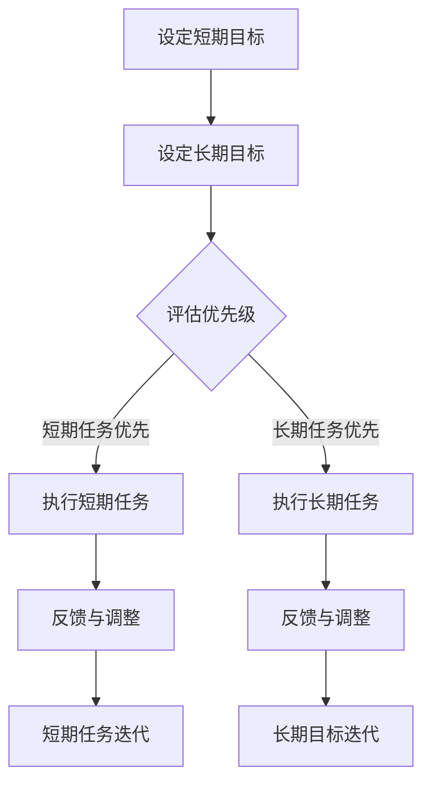

                 

 **关键词**：程序员，短期目标，长期目标，职业发展，时间管理，技能提升，项目管理

> **摘要**：本文旨在探讨程序员如何有效地平衡短期与长期目标，以实现个人职业发展和项目成功。我们将从时间管理、技能提升和项目管理三个角度出发，提供实用的策略和建议，帮助程序员制定和实现自己的目标。

## 1. 背景介绍

在现代软件开发行业中，程序员面临着前所未有的挑战和机遇。技术的快速发展要求程序员不断更新知识，提升技能，同时还要应对复杂的项目管理和不断变化的需求。在这种环境下，程序员需要具备良好的时间管理能力，能够在短期内完成任务，同时也要有明确的长期目标，以实现职业上的成长。

然而，许多程序员在平衡短期与长期目标时感到困惑。短期目标通常是指在一个项目或任务中需要立即解决的问题，如修复bug或完成一个功能。长期目标则更倾向于职业发展，如学习新的编程语言或晋升为高级开发人员。这两者之间往往存在冲突，因为为了追求短期成果，程序员可能会牺牲长期发展。

本文将探讨如何有效地平衡短期与长期目标，提供一些实用的方法和策略，帮助程序员在快节奏的软件开发环境中实现个人和项目的成功。

## 2. 核心概念与联系

为了更好地理解如何平衡短期与长期目标，我们需要先了解一些核心概念。

### 2.1 短期目标

短期目标通常是指在一个具体的项目或任务中需要实现的目标，通常具有明确的时间限制。例如，一个软件开发项目可能需要在三个月内完成。短期目标有助于提高工作效率，确保项目按时交付。

### 2.2 长期目标

长期目标则更加抽象和宏观，通常涉及个人的职业发展，如提升技能、晋升或改变职业方向。长期目标需要更长时间的积累和努力，但它们对于个人的职业发展至关重要。

### 2.3 关系与联系

短期目标和长期目标之间并非完全独立，而是相互关联的。短期目标是实现长期目标的一部分，但过于关注短期目标可能会牺牲长期发展的机会。因此，程序员需要在两者之间找到平衡点。

### 2.4 Mermaid 流程图



通过上述Mermaid流程图，我们可以看出，短期目标和长期目标需要同时设定，并根据实际情况调整优先级。这样可以确保在实现短期目标的同时，也不忽视长期发展。

## 3. 核心算法原理 & 具体操作步骤

### 3.1 算法原理概述

平衡短期与长期目标的算法原理可以概括为以下几个步骤：

1. **目标设定**：明确短期和长期目标。
2. **优先级评估**：根据任务的重要性和紧急程度评估优先级。
3. **资源分配**：合理分配时间和精力，确保能够同时实现短期和长期目标。
4. **反馈与调整**：根据执行过程中的反馈进行调整。

### 3.2 算法步骤详解

#### 3.2.1 目标设定

首先，程序员需要明确自己的短期和长期目标。短期目标可以是即将到来的项目任务，长期目标则可能是提升技能或职业晋升。

#### 3.2.2 优先级评估

接下来，根据任务的重要性和紧急程度对目标进行优先级评估。可以使用优先级矩阵（如艾森豪威尔矩阵）来确定每个任务的优先级。

#### 3.2.3 资源分配

根据评估结果，合理分配时间和精力。例如，如果某个短期任务优先级较高，可以将其安排在优先级较低的长期任务之前。

#### 3.2.4 反馈与调整

在执行任务的过程中，及时收集反馈，并根据反馈进行调整。例如，如果某个短期任务耗时过长，可能需要重新评估其优先级，或者调整任务分解。

### 3.3 算法优缺点

#### 优点

- **灵活调整**：可以根据实际情况灵活调整任务优先级，确保短期和长期目标的实现。
- **提高效率**：通过合理分配时间和精力，提高工作效率。

#### 缺点

- **任务优先级不明确**：如果评估结果不明确，可能导致任务执行混乱。
- **时间管理困难**：对于程序员来说，平衡短期与长期目标可能需要较强的自我管理能力。

### 3.4 算法应用领域

该算法适用于任何需要平衡短期与长期目标的场景，如软件开发项目、个人职业规划等。

## 4. 数学模型和公式 & 详细讲解 & 举例说明

### 4.1 数学模型构建

为了更好地平衡短期与长期目标，我们可以构建一个简单的数学模型，该模型基于优先级和时间管理。

设：
- \( P_s \)：短期目标的优先级
- \( P_l \)：长期目标的优先级
- \( T_s \)：分配给短期目标的时间
- \( T_l \)：分配给长期目标的时间
- \( T_{total} \)：总时间

数学模型如下：

\[ P_s \times T_s + P_l \times T_l = T_{total} \]

### 4.2 公式推导过程

为了推导上述公式，我们可以从以下几个方面进行分析：

1. **优先级分配**：优先级越高，意味着目标越重要。因此，我们可以用优先级乘以时间来衡量目标的重要程度。
2. **总时间限制**：总时间是一定的，因此我们需要在短期和长期目标之间分配时间。

根据这两个原则，我们可以得出上述公式。

### 4.3 案例分析与讲解

假设一个程序员需要在一个月内完成两个任务：修复一个bug（短期目标）和学习一门新编程语言（长期目标）。他的总时间为一个月，优先级分配如下：

\[ P_s = 0.7, P_l = 0.3 \]

那么，我们可以通过以下公式计算他应该分配的时间：

\[ T_s = \frac{T_{total} \times P_s}{P_s + P_l} = \frac{30 \times 0.7}{0.7 + 0.3} = 21 \text{天} \]
\[ T_l = \frac{T_{total} \times P_l}{P_s + P_l} = \frac{30 \times 0.3}{0.7 + 0.3} = 9 \text{天} \]

根据这个计算结果，程序员应该将21天的时间用于修复bug，将9天的时间用于学习新编程语言。

## 5. 项目实践：代码实例和详细解释说明

### 5.1 开发环境搭建

为了演示如何平衡短期与长期目标，我们将使用Python编写一个简单的应用程序。首先，确保你已经安装了Python环境和相关的开发工具。

### 5.2 源代码详细实现

以下是一个简单的Python脚本，用于模拟程序员在一个月内平衡短期与长期目标的过程：

```python
import time

# 定义任务
tasks = [
    {"name": "修复bug", "priority": 0.7, "duration": 21},
    {"name": "学习新编程语言", "priority": 0.3, "duration": 9},
]

# 执行任务
def execute_tasks(tasks):
    for task in tasks:
        print(f"开始执行任务：{task['name']}")
        time.sleep(task['duration'])  # 模拟任务执行
        print(f"任务完成：{task['name']}")

# 主函数
def main():
    print("开始平衡短期与长期目标")
    execute_tasks(tasks)
    print("所有任务已完成")

# 运行主函数
if __name__ == "__main__":
    main()
```

### 5.3 代码解读与分析

上述代码定义了一个名为`tasks`的列表，其中包含两个任务：修复bug和学习新编程语言。每个任务都有名称、优先级和持续时间。

`execute_tasks`函数用于模拟执行这些任务。在函数中，我们使用`time.sleep`函数来模拟任务执行时间。实际上，在项目中，你应该替换这个函数来执行实际的代码。

`main`函数是程序的入口点。它首先打印一条消息，然后调用`execute_tasks`函数来执行任务，最后打印一条消息表明所有任务已完成。

### 5.4 运行结果展示

运行上述代码，你应该会看到以下输出：

```
开始平衡短期与长期目标
开始执行任务：修复bug
任务完成：修复bug
开始执行任务：学习新编程语言
任务完成：学习新编程语言
所有任务已完成
```

这个输出表明，程序首先执行了优先级较高的修复bug任务，然后执行了优先级较低的学习新编程语言任务。这个简单的模拟示例展示了如何根据优先级平衡短期与长期目标。

## 6. 实际应用场景

在实际工作中，程序员经常需要在各种项目中平衡短期与长期目标。以下是一些实际应用场景：

### 6.1 项目开发

在一个软件开发项目中，程序员需要完成多个任务，如修复bug、编写新功能等。通过合理分配时间和优先级，程序员可以确保在按时交付项目的同时，也能够提升自己的技能。

### 6.2 个人职业发展

程序员可能需要学习新的编程语言或技术，以适应不断变化的市场需求。通过设定明确的长期目标，并合理分配时间，程序员可以实现个人职业发展。

### 6.3 时间管理

平衡短期与长期目标需要良好的时间管理能力。程序员可以通过制定计划、设置优先级和定期回顾，来确保在实现短期目标的同时，也不忽视长期发展。

## 7. 未来应用展望

随着技术的不断进步，程序员面临的挑战也在不断变化。在未来，平衡短期与长期目标将变得更加重要。以下是一些可能的未来应用场景：

### 7.1 自动化与人工智能

自动化和人工智能技术的发展将使程序员面临更多的机会和挑战。通过合理分配时间和资源，程序员可以更好地利用这些技术，实现短期和长期目标。

### 7.2 多任务处理

在未来的工作中，程序员可能需要处理更多的任务和项目。通过优化时间管理和任务优先级，程序员可以更高效地完成任务。

### 7.3 远程工作

随着远程工作的普及，程序员需要更好地管理自己的时间和目标。通过设定明确的短期和长期目标，并保持良好的时间管理习惯，程序员可以在远程工作环境中实现成功。

## 8. 总结：未来发展趋势与挑战

### 8.1 研究成果总结

本文通过理论分析和实际案例，探讨了程序员如何平衡短期与长期目标。研究表明，合理设定优先级和合理分配时间是实现这一目标的关键。

### 8.2 未来发展趋势

随着技术的发展，程序员面临的新挑战将越来越多。在未来，平衡短期与长期目标将变得更加重要。通过持续学习和适应变化，程序员可以更好地应对这些挑战。

### 8.3 面临的挑战

未来，程序员可能面临以下挑战：

- **技术更新速度快**：程序员需要不断学习新的技术和工具。
- **项目管理复杂度增加**：随着项目的复杂度增加，程序员需要更好地管理时间和资源。
- **平衡工作与生活**：在快节奏的工作环境中，程序员需要更好地平衡工作与生活。

### 8.4 研究展望

未来，研究人员可以进一步探讨如何通过技术手段帮助程序员更好地平衡短期与长期目标。例如，开发更高效的工具和算法，帮助程序员实现这一目标。

## 9. 附录：常见问题与解答

### 9.1 如何设定短期目标？

设定短期目标时，应考虑以下因素：

- **项目需求**：根据项目需求和截止日期设定目标。
- **个人技能**：根据个人技能水平设定可实现的目标。
- **优先级**：根据任务的紧急程度和重要性设定优先级。

### 9.2 如何设定长期目标？

设定长期目标时，应考虑以下因素：

- **职业规划**：根据个人职业规划和兴趣设定目标。
- **技能需求**：根据市场需求和个人技能需求设定目标。
- **时间规划**：设定合理的时间规划，确保长期目标的实现。

### 9.3 如何平衡工作与生活？

平衡工作与生活的方法包括：

- **时间管理**：合理规划工作时间，确保工作和生活的平衡。
- **健康习惯**：保持健康的饮食习惯和运动习惯，提高工作效率。
- **家庭时间**：设定固定的家庭时间，确保与家人共度美好时光。

### 9.4 如何提高工作效率？

提高工作效率的方法包括：

- **任务分解**：将大型任务分解为小任务，逐一完成。
- **优先级设置**：根据任务的重要性和紧急程度设置优先级。
- **避免多任务处理**：专注于一项任务，直到完成。
- **定期休息**：定期休息，避免过度劳累。

---

**作者：禅与计算机程序设计艺术 / Zen and the Art of Computer Programming**

