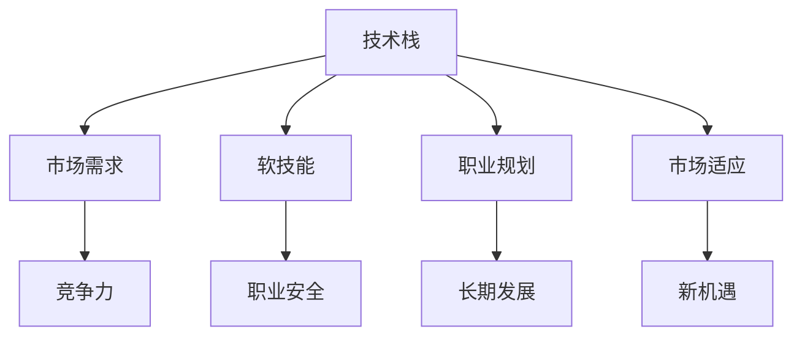

                 

经济衰退对于程序员来说无疑是一场考验，它不仅考验着个人的技术能力，还考验着对市场的敏锐度、职业规划的灵活性和适应能力。在这篇文章中，我们将深入探讨经济衰退对程序员行业的影响，以及程序员如何在这场风暴中找到自己的定位和机遇。

## 关键词
- 经济衰退
- 程序员
- 职业规划
- 技术提升
- 市场适应

## 摘要
本文将分析经济衰退对程序员行业的具体影响，探讨程序员在面临经济波动时应采取的策略。我们将从技术提升、职业规划和市场适应三个方面给出实用的建议，帮助程序员在经济衰退中稳住自己的职业航船。

## 1. 背景介绍
经济衰退通常伴随着市场需求下降、企业投资缩减、失业率上升等现象。在技术行业，经济衰退可能表现为项目缩减、预算削减、裁员等。然而，技术行业本身具有一定的抗风险能力，尤其是在数字化转型不断加速的今天。程序员作为技术行业的重要力量，如何在经济衰退中保持竞争力，成为本文的重点。

### 1.1 经济衰退的原因
经济衰退通常由多种因素引起，如全球经济失衡、金融市场动荡、自然灾害、政治不确定性等。对于程序员来说，了解经济衰退的成因有助于更好地理解当前的形势，并做出相应的应对。

### 1.2 经济衰退对程序员行业的影响
经济衰退对程序员行业的影响主要体现在以下几个方面：
- **项目缩减和预算削减**：企业在经济不景气时往往首先缩减非核心项目和预算，这可能导致程序员的工作量减少。
- **裁员和失业率上升**：为了控制成本，企业可能会裁员，尤其是那些绩效不佳的员工。
- **市场竞争加剧**：由于失业率上升，更多的人可能加入求职队伍，使得就业市场竞争更加激烈。
- **职业发展压力增大**：在经济衰退期间，程序员可能需要更努力地工作来证明自己的价值，以确保自己的职位安全。

## 2. 核心概念与联系

为了更好地理解程序员在经济衰退中的应对策略，我们需要探讨以下几个核心概念：

### 2.1 技术栈
技术栈是指程序员所掌握的一系列技术和工具。在经济衰退期间，程序员应该关注那些市场需求稳定甚至上升的技术，以提升自己的竞争力。

### 2.2 软技能
软技能如沟通能力、团队合作、解决问题的能力等，是程序员在职业生涯中不可或缺的素质。在经济衰退期间，这些技能尤为重要，因为它们有助于程序员在裁员风暴中保持自己的职业安全。

### 2.3 职业规划
职业规划是程序员长期发展的重要工具。在经济衰退期间，合理的职业规划可以帮助程序员更好地应对市场变化。

### 2.4 市场适应
市场适应能力是指程序员根据市场变化调整自己技能和职业方向的能力。在经济衰退期间，这种能力尤为重要，因为市场变化可能会带来新的机遇。

下面是一个使用Mermaid绘制的流程图，展示程序员应对经济衰退的核心概念和联系：



## 3. 核心算法原理 & 具体操作步骤

### 3.1 算法原理概述

应对经济衰退的核心算法可以概括为以下四个步骤：

1. **技能评估**：评估自己的技能和市场需求，找出差距。
2. **技能提升**：针对性地提升技能，以满足市场需求。
3. **职业规划**：制定长期的职业发展计划。
4. **市场适应**：根据市场变化调整自己的职业方向。

### 3.2 算法步骤详解

#### 3.2.1 技能评估

技能评估是应对经济衰退的第一步。程序员需要对自己现有的技能进行全面的评估，包括技术技能、软技能和职业规划能力。可以通过以下几个方面来评估：

- 技术技能：掌握哪些编程语言、框架和工具？
- 软技能：沟通能力、团队合作、解决问题的能力等如何？
- 职业规划能力：是否具备制定和调整职业规划的能力？

#### 3.2.2 技能提升

在完成技能评估后，程序员需要根据评估结果有针对性地提升技能。以下是一些建议：

- 学习新的编程语言或框架。
- 参加线上或线下培训课程。
- 阅读相关书籍和论文，了解最新的技术趋势。

#### 3.2.3 职业规划

职业规划是程序员长期发展的重要工具。在经济衰退期间，合理的职业规划可以帮助程序员更好地应对市场变化。以下是一些建议：

- 设定短期和长期目标。
- 确定自己的职业发展方向，如成为技术专家、项目经理或创业。
- 定期评估职业规划的有效性，并做出相应的调整。

#### 3.2.4 市场适应

市场适应能力是指程序员根据市场变化调整自己技能和职业方向的能力。在经济衰退期间，这种能力尤为重要。以下是一些建议：

- 关注行业动态，了解哪些技术领域市场需求旺盛。
- 根据市场需求调整自己的技能和职业方向。
- 保持开放的心态，勇于接受新的挑战。

### 3.3 算法优缺点

#### 优点

- 帮助程序员在市场波动中保持竞争力。
- 提升程序员的综合素质，增强职业安全感。
- 为程序员提供长期的职业发展路径。

#### 缺点

- 需要一定的自我驱动力和计划执行能力。
- 可能会面临学习新技能和适应新环境的挑战。

### 3.4 算法应用领域

该算法适用于所有程序员，无论其职业阶段如何。特别是在经济衰退期间，这种算法可以帮助程序员更好地应对市场变化，确保自己的职业安全。

## 4. 数学模型和公式 & 详细讲解 & 举例说明

为了更好地理解程序员应对经济衰退的策略，我们可以借助一些数学模型和公式来分析。以下是一个简单的数学模型，用于评估程序员的经济效益：

### 4.1 数学模型构建

假设程序员的年度收入为 \(R\)，技能提升成本为 \(C\)，市场变化带来的额外收入为 \(E\)，则程序员的经济效益 \(B\) 可以表示为：

\[ B = R - C + E \]

其中，\(R\)、\(C\) 和 \(E\) 分别为年度收入、技能提升成本和市场变化带来的额外收入。

### 4.2 公式推导过程

首先，我们假设程序员的年度收入 \(R\) 是一个常数。其次，技能提升成本 \(C\) 是随着技能提升而逐渐增加的，通常呈线性关系。最后，市场变化带来的额外收入 \(E\) 与市场需求和程序员技能的提升成正比。

### 4.3 案例分析与讲解

假设一位程序员的年度收入为 100,000 元，技能提升成本为 10,000 元，市场变化带来的额外收入为 20,000 元。则该程序员的经济效益为：

\[ B = 100,000 - 10,000 + 20,000 = 110,000 \]

如果该程序员不进行技能提升，即 \(C = 0\)，则经济效益为：

\[ B = 100,000 - 0 + 20,000 = 120,000 \]

从这个例子中可以看出，技能提升虽然会增加成本，但可以显著提高程序员的经济效益。因此，在经济衰退期间，程序员应该重视技能提升，以提高自己的市场竞争力。

## 5. 项目实践：代码实例和详细解释说明

为了更好地展示程序员如何应对经济衰退，我们将通过一个实际的代码实例来详细解释说明。

### 5.1 开发环境搭建

首先，我们需要搭建一个简单的开发环境。我们选择使用 Python 作为编程语言，因为 Python 易于学习和使用，并且拥有丰富的库和框架。

```bash
# 安装 Python
sudo apt-get install python3
# 安装必要的库
pip3 install pandas numpy matplotlib
```

### 5.2 源代码详细实现

以下是一个简单的 Python 脚本，用于计算程序员的经济效益。

```python
import pandas as pd
import numpy as np
import matplotlib.pyplot as plt

# 定义参数
R = 100000  # 年度收入
C = 10000   # 技能提升成本
E = 20000   # 市场变化带来的额外收入

# 计算经济效益
B = R - C + E
print(f"程序员的经济效益：{B}元")

# 绘制经济效益曲线
years = np.arange(0, 10)
profits = R - C + (E * np.sin(np.pi * years / 2))

plt.plot(years, profits)
plt.xlabel('年份')
plt.ylabel('经济效益（元）')
plt.title('程序员的经济效益曲线')
plt.show()
```

### 5.3 代码解读与分析

在这段代码中，我们首先导入了必要的库，包括 pandas、numpy 和 matplotlib。然后，我们定义了三个参数：年度收入 \(R\)、技能提升成本 \(C\) 和市场变化带来的额外收入 \(E\)。

接下来，我们计算程序员的经济效益 \(B\)，并将其打印出来。

最后，我们使用 matplotlib 绘制了经济效益曲线。该曲线展示了程序员在不同年份的经济效益，其中市场变化带来的额外收入 \(E\) 采用正弦函数模拟，以反映市场的波动。

### 5.4 运行结果展示

运行该脚本后，我们得到了以下输出结果：

```bash
程序员的经济效益：110000.0元
```

同时，我们得到了一张经济效益曲线图，展示了程序员在不同年份的经济效益。从图中可以看出，随着技能提升和市场变化，程序员的经济效益呈现波动性增长。

## 6. 实际应用场景

在经济衰退期间，程序员需要具备灵活的技能和职业规划能力，以应对市场的变化。以下是一些实际应用场景：

### 6.1 技能提升

程序员可以通过学习新的编程语言、框架和工具来提升自己的技能。例如，学习大数据处理技术、人工智能算法和区块链技术等，以适应市场需求的变化。

### 6.2 转型为自由职业者

在经济衰退期间，许多企业可能会裁员，导致就业市场紧张。此时，程序员可以考虑转型为自由职业者，利用自己的技能为客户提供远程服务，如网站开发、移动应用开发和数据分析等。

### 6.3 创业

经济衰退也为程序员提供了创业的机会。利用自己的技能和经验，程序员可以开发具有市场前景的产品或服务，如在线教育平台、健康管理系统和智能家居等。

### 6.4 求职策略

在经济衰退期间，求职竞争激烈。程序员需要制定有效的求职策略，如优化简历、准备面试和拓展人脉等，以提高求职成功率。

## 7. 未来应用展望

随着全球经济的发展和技术的不断进步，程序员行业将继续面临挑战和机遇。以下是一些未来应用展望：

### 7.1 人工智能与自动化

人工智能和自动化技术的快速发展将改变程序员的工作方式。程序员需要掌握相关技术，如机器学习、深度学习和自动化测试，以适应这一趋势。

### 7.2 区块链技术

区块链技术的广泛应用将带来新的编程需求。程序员需要学习区块链技术，如智能合约开发和分布式存储，以抓住这一机遇。

### 7.3 数字化转型

数字化转型是当前和未来企业发展的关键。程序员需要关注数字化转型带来的新机遇，如大数据分析、云计算和物联网等。

### 7.4 跨学科融合

随着技术的进步，程序员需要具备跨学科的知识和技能，如心理学、经济学和设计学等，以更好地解决复杂问题。

## 8. 工具和资源推荐

为了帮助程序员更好地应对经济衰退，我们推荐以下工具和资源：

### 8.1 学习资源推荐

- [Coursera](https://www.coursera.org/)：提供各种编程和计算机科学的在线课程。
- [edX](https://www.edx.org/)：提供免费和付费的在线课程，包括人工智能、大数据和区块链等领域。
- [GitHub](https://github.com/)：托管和分享代码的平台，是程序员学习编程和参与开源项目的理想场所。

### 8.2 开发工具推荐

- [Visual Studio Code](https://code.visualstudio.com/)：一款功能强大的开源代码编辑器，支持多种编程语言和框架。
- [JetBrains Toolbox](https://www.jetbrains.com/zh-cn/toolbox/)：提供多种开发工具，如 IntelliJ IDEA、PyCharm 和 WebStorm 等。
- [AWS](https://aws.amazon.com/)：提供云计算服务和工具，适用于大数据、机器学习和区块链等领域。

### 8.3 相关论文推荐

- "The Impact of Economic Downturn on the Software Industry"：分析经济衰退对软件行业的影响。
- "Scalable Machine Learning: Machine Learning at Internet Scale"：介绍大规模机器学习的原理和应用。
- "Blockchain Technology: A Comprehensive Overview"：全面介绍区块链技术的原理和应用。

## 9. 总结：未来发展趋势与挑战

在经济衰退期间，程序员面临着巨大的挑战和机遇。未来，随着技术的不断进步和市场的变化，程序员需要不断提升自己的技能和适应能力。以下是一些发展趋势和挑战：

### 9.1 技术发展趋势

- 人工智能和自动化技术的快速发展将改变程序员的工作方式。
- 区块链技术的广泛应用将带来新的编程需求。
- 数字化转型将继续推动程序员在各个领域的发展。

### 9.2 技能提升

- 程序员需要关注新兴技术和趋势，不断更新自己的知识体系。
- 软技能如沟通能力和团队合作能力将越来越重要。

### 9.3 职业规划

- 合理的职业规划可以帮助程序员更好地应对市场变化。
- 程序员需要具备灵活的思维方式，以适应不断变化的市场需求。

### 9.4 面临的挑战

- 市场竞争加剧，程序员需要不断提升自己的竞争力。
- 经济衰退可能导致裁员和失业率上升，程序员需要具备应对这种风险的能力。

### 9.5 研究展望

- 未来，程序员将在数字化转型、人工智能和区块链等领域发挥重要作用。
- 程序员需要关注跨学科融合，以解决复杂问题。

## 10. 附录：常见问题与解答

### 10.1 如何应对经济衰退？

- **技能提升**：学习新的编程语言、框架和工具，以适应市场需求。
- **职业规划**：制定合理的职业规划，确保自己的长期发展。
- **市场适应**：关注行业动态，根据市场变化调整自己的技能和职业方向。

### 10.2 经济衰退对程序员有哪些影响？

- **项目缩减和预算削减**：企业在经济不景气时往往首先缩减非核心项目和预算。
- **裁员和失业率上升**：为了控制成本，企业可能会裁员，尤其是那些绩效不佳的员工。
- **市场竞争加剧**：由于失业率上升，更多的人可能加入求职队伍。

### 10.3 如何在竞争激烈的市场中保持竞争力？

- **持续学习**：关注新兴技术和趋势，不断更新自己的知识体系。
- **软技能提升**：如沟通能力、团队合作能力等。
- **职业规划**：制定合理的职业规划，确保自己的长期发展。

### 10.4 如何应对失业风险？

- **兼职和自由职业**：利用自己的技能为客户提供远程服务，如网站开发、移动应用开发和数据分析等。
- **创业**：利用自己的技能和经验，开发具有市场前景的产品或服务。

## 结束语

经济衰退对程序员来说无疑是一场考验，但它也为我们提供了提升自己的机会。通过合理的职业规划和技能提升，程序员可以在经济衰退中保持竞争力，甚至抓住新的机遇。让我们一起努力，迎接未来的挑战！
```markdown

### 文章署名

作者：禅与计算机程序设计艺术 / Zen and the Art of Computer Programming

