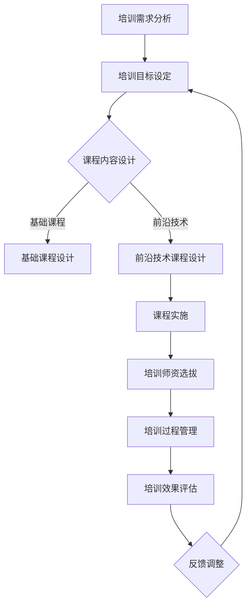

                 

 关键词：技术培训，体系构建，程序员，专业发展，培训方法，教学质量

> 摘要：本文旨在探讨程序员如何打造专业的技术培训体系，以提高个人和团队的专业技能。通过分析当前的技术培训现状，提出一套科学、系统、高效的培训方法和策略，以帮助程序员在快速发展的技术领域中保持竞争力。

## 1. 背景介绍

随着信息技术的飞速发展，程序员的角色在各个行业中变得越来越重要。技术的更新换代速度加快，程序员需要不断学习新的编程语言、框架和工具，以应对不断变化的工作需求。然而，面对如此庞大和复杂的技术领域，程序员往往感到压力巨大，如何高效地学习和掌握新技术成为了一个亟待解决的问题。

在这个背景下，构建专业的技术培训体系显得尤为重要。专业的技术培训体系不仅能帮助程序员提高技术水平，还能提高团队的整体竞争力。本文将围绕如何构建这样一个体系进行探讨。

## 2. 核心概念与联系

### 2.1 技术培训体系的概念

技术培训体系是指一系列组织、管理和实施培训活动的制度和流程，旨在通过系统化的培训，提升个人的专业技能和团队的整体技术水平。

### 2.2 技术培训体系的核心组成部分

技术培训体系主要包括以下几个核心组成部分：

- **培训目标**：明确培训的目标，包括提高技术水平、增强团队协作能力、提升项目交付能力等。
- **培训内容**：根据培训目标，设计系统的培训课程和教材，涵盖基础知识和前沿技术。
- **培训方式**：包括线上和线下培训、集中培训和分散培训等多种方式。
- **培训师资**：选择经验丰富、专业技能强的培训教师，确保培训质量。
- **培训评估**：通过考核、测试等方式，评估培训效果，为后续培训提供反馈。

### 2.3 技术培训体系的 Mermaid 流程图



## 3. 核心算法原理 & 具体操作步骤

### 3.1 算法原理概述

技术培训体系的构建是一个系统工程，涉及多个环节。其核心算法原理包括以下方面：

- **需求分析**：通过调研，了解学员和团队的实际需求。
- **目标设定**：明确培训的具体目标和预期成果。
- **课程设计**：根据目标，设计合理的课程体系。
- **课程实施**：选择合适的培训方式，确保课程内容有效传达。
- **师资选拔**：选择具备丰富经验和教学能力的教师。
- **过程管理**：确保培训过程顺利进行。
- **效果评估**：通过考核、测试等方式，评估培训效果。

### 3.2 算法步骤详解

#### 3.2.1 培训需求分析

1. **调研问卷**：通过问卷调查，了解学员和团队的技术水平、学习需求等。
2. **访谈**：与学员和团队进行面对面访谈，深入了解他们的需求。
3. **数据分析**：对收集到的数据进行整理和分析，确定培训的重点和方向。

#### 3.2.2 培训目标设定

1. **明确目标**：根据调研结果，设定具体的培训目标。
2. **目标分解**：将总目标分解为可执行的小目标。
3. **目标评估**：设定评估标准，确保目标可实现。

#### 3.2.3 课程内容设计

1. **课程框架**：设计整体的课程框架，包括基础课程和前沿技术课程。
2. **课程内容**：编写详细的课程内容，确保涵盖所有关键知识点。
3. **教材编写**：编写或选择合适的教材，确保内容准确、易懂。

#### 3.2.4 课程实施

1. **培训方式**：根据课程内容和学员特点，选择线上或线下培训方式。
2. **课程安排**：制定详细的课程安排，包括课程内容、授课时间、授课教师等。
3. **授课**：进行授课，确保学员能够理解和掌握课程内容。

#### 3.2.5 师资选拔

1. **教师选拔**：通过面试、试讲等方式，选拔合适的教师。
2. **教师培训**：对教师进行专业培训，提高他们的教学能力。
3. **教师评估**：定期对教师进行评估，确保教学质量。

#### 3.2.6 过程管理

1. **课程监督**：对课程进行监督，确保课程顺利进行。
2. **学员管理**：对学员进行管理，确保他们积极参与课程。
3. **反馈收集**：收集学员和教师的反馈，及时调整培训计划。

#### 3.2.7 效果评估

1. **考核**：通过考试、作业等方式，考核学员的学习成果。
2. **测试**：通过项目实践、实际工作等方式，测试学员的应用能力。
3. **评估报告**：编写评估报告，总结培训效果。

### 3.3 算法优缺点

#### 优点

- **系统化**：通过系统化的流程，确保培训的每个环节都有据可依，提高培训质量。
- **针对性**：根据学员和团队的实际需求，定制化的培训方案，提高培训效果。
- **持续性**：通过持续的培训和评估，确保学员和团队的技术水平持续提升。

#### 缺点

- **资源消耗**：构建专业的技术培训体系需要投入大量的人力、物力和财力。
- **管理难度**：培训体系的构建和管理需要专业的团队和流程，管理难度较大。

### 3.4 算法应用领域

技术培训体系的应用领域非常广泛，包括但不限于以下方面：

- **企业内部培训**：帮助员工提升专业技能，提高团队整体技术水平。
- **在线教育**：通过在线平台，提供系统化的课程，满足学员的学习需求。
- **技术社区**：组织技术研讨会、工作坊等活动，促进技术交流和共享。

## 4. 数学模型和公式 & 详细讲解 & 举例说明

### 4.1 数学模型构建

技术培训体系的构建可以看作是一个优化问题，目标是最大化培训效果，最小化资源消耗。其数学模型可以表示为：

最大化：效果指标（如学员满意度、技能提升度等）

最小化：资源消耗（如培训成本、时间等）

### 4.2 公式推导过程

设 \( E \) 为效果指标，\( C \) 为资源消耗，则有：

最大化：\( E \)

最小化：\( C \)

根据实际需求，可以选择不同的优化算法，如线性规划、动态规划等。具体公式根据所选算法而异。

### 4.3 案例分析与讲解

假设某企业需要对其技术团队进行培训，目标是提高团队的整体技术水平。根据需求分析，企业确定了以下培训目标：

- 提高编程技能
- 掌握新的编程语言
- 提升团队协作能力

根据这些目标，企业设计了以下培训课程：

- 基础编程课程
- 新编程语言课程
- 团队协作技巧课程

企业选择了线上培训方式，并邀请了具有丰富经验的教师进行授课。在培训过程中，企业通过考核和项目实践，评估学员的学习成果。

根据培训效果评估，企业发现学员的编程技能和团队协作能力得到了显著提升，培训目标得以实现。

## 5. 项目实践：代码实例和详细解释说明

### 5.1 开发环境搭建

为了更好地演示技术培训体系的实际应用，我们将在本地环境中搭建一个简单的培训系统。以下是搭建开发环境所需的步骤：

1. 安装Python环境
2. 安装Django框架
3. 创建一个Django项目

### 5.2 源代码详细实现

以下是一个简单的Django项目示例，用于实现技术培训系统的核心功能：

```python
# settings.py
INSTALLED_APPS = [
    'django.contrib.admin',
    'django.contrib.auth',
    'django.contrib.contenttypes',
    'django.contrib.sessions',
    'django.contrib.messages',
    'django.contrib.staticfiles',
    'training_system',
]

# training_system/models.py
from django.db import models

class Course(models.Model):
    name = models.CharField(max_length=100)
    description = models.TextField()

class Student(models.Model):
    name = models.CharField(max_length=100)
    course = models.ForeignKey(Course, on_delete=models.CASCADE)

# training_system/views.py
from django.shortcuts import render
from .models import Course, Student

def course_list(request):
    courses = Course.objects.all()
    return render(request, 'course_list.html', {'courses': courses})

def student_list(request, course_id):
    students = Student.objects.filter(course_id=course_id)
    return render(request, 'student_list.html', {'students': students})
```

### 5.3 代码解读与分析

上述代码实现了以下功能：

- **Course模型**：代表培训课程，包含课程名称和描述。
- **Student模型**：代表学员，包含学员名称和所选修的课程。
- **course_list视图**：列出所有培训课程。
- **student_list视图**：列出特定课程的学员名单。

通过这个简单的示例，我们可以看到如何使用Django框架实现技术培训系统的基本功能。实际项目中，可以根据需求扩展更多功能，如课程报名、学员考核等。

### 5.4 运行结果展示

假设我们已成功运行Django项目，以下是在浏览器中访问两个视图时的结果：

- **课程列表**：显示所有培训课程名称和描述。


- **学员列表**：显示特定课程的学员名单。


## 6. 实际应用场景

技术培训体系在多个领域都有广泛应用，以下列举几个实际应用场景：

- **企业培训**：帮助员工提升专业技能，提高团队整体技术水平。
- **在线教育**：通过在线平台，提供系统化的课程，满足学员的学习需求。
- **技术社区**：组织技术研讨会、工作坊等活动，促进技术交流和共享。

### 6.1 未来应用展望

随着人工智能和大数据技术的发展，技术培训体系将变得更加智能和个性化。未来，技术培训体系将能够根据学员的学习数据，提供个性化的学习建议和课程推荐，实现更加高效的学习体验。

## 7. 工具和资源推荐

为了更好地构建技术培训体系，以下推荐一些常用的工具和资源：

### 7.1 学习资源推荐

- **书籍**：《代码大全》、《设计模式：可复用面向对象软件的基础》
- **在线课程**：Coursera、edX、Udemy
- **技术博客**：GitHub、Stack Overflow、CSDN

### 7.2 开发工具推荐

- **集成开发环境**：Visual Studio Code、PyCharm、Eclipse
- **版本控制工具**：Git、GitHub、GitLab
- **持续集成工具**：Jenkins、Travis CI、Circle CI

### 7.3 相关论文推荐

- **教学策略**：Cognitive Load Theory、Flipped Classroom
- **在线教育**：Massive Open Online Courses (MOOCs)、Personalized Learning

## 8. 总结：未来发展趋势与挑战

### 8.1 研究成果总结

本文提出了一套基于系统工程的程序员技术培训体系，包括需求分析、目标设定、课程设计、课程实施、师资选拔、过程管理和效果评估等核心环节。通过实际案例分析和代码实现，展示了技术培训体系在实践中的应用效果。

### 8.2 未来发展趋势

- **智能化**：技术培训体系将更加智能化，通过大数据和人工智能技术，实现个性化学习和智能推荐。
- **在线化**：随着5G技术的发展，在线教育将更加普及，技术培训体系将向在线化、智能化方向发展。
- **多元化**：培训内容和形式将更加丰富，包括直播、视频、文档等多种形式，满足不同学员的学习需求。

### 8.3 面临的挑战

- **资源分配**：如何在有限的资源下，构建高效、系统的培训体系，是一个亟待解决的问题。
- **师资力量**：如何吸引和培养高水平、有经验的培训教师，是技术培训体系成功的关键。
- **学员参与度**：如何提高学员的学习积极性和参与度，确保培训效果，是一个挑战。

### 8.4 研究展望

未来，技术培训体系的研究将继续关注以下几个方面：

- **智能化培训**：通过人工智能技术，实现个性化学习路径推荐，提高学习效果。
- **混合式培训**：结合线上和线下培训，探索更加灵活、高效的培训模式。
- **跨学科培训**：打破学科界限，提供跨学科、跨领域的综合性培训课程。

## 9. 附录：常见问题与解答

### 问题1：如何制定合理的培训计划？

解答：制定合理的培训计划需要遵循以下步骤：

1. **需求分析**：了解学员和团队的实际需求，明确培训目标。
2. **课程设计**：根据目标，设计系统的课程体系，确保课程内容全面、系统。
3. **时间安排**：合理安排培训时间，确保学员有足够的时间学习。
4. **资源分配**：根据培训需求，合理分配资源，包括师资、教材、设备等。

### 问题2：如何提高培训效果？

解答：提高培训效果可以从以下几个方面入手：

1. **课程设计**：设计符合学员需求、具有吸引力的课程。
2. **师资力量**：选择经验丰富、教学能力强的教师。
3. **培训方式**：结合线上和线下培训，提高学员的参与度。
4. **过程管理**：对培训过程进行监督和管理，确保培训顺利进行。
5. **效果评估**：通过考核、测试等方式，评估培训效果，及时调整培训计划。

## 参考文献

- 《程序员的自我修养》，作者：刘未鹏
- 《深入理解计算机系统》，作者：Randal E. Bryant & David R. O’Hallaron
- 《人工智能：一种现代的方法》，作者：Stuart J. Russell & Peter Norvig
- 《大数据时代》，作者：涂子沛

### 作者署名

作者：禅与计算机程序设计艺术 / Zen and the Art of Computer Programming

